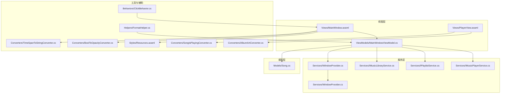
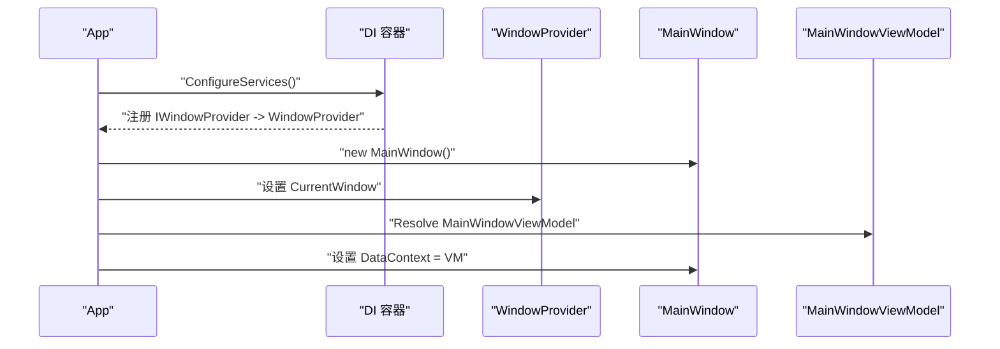
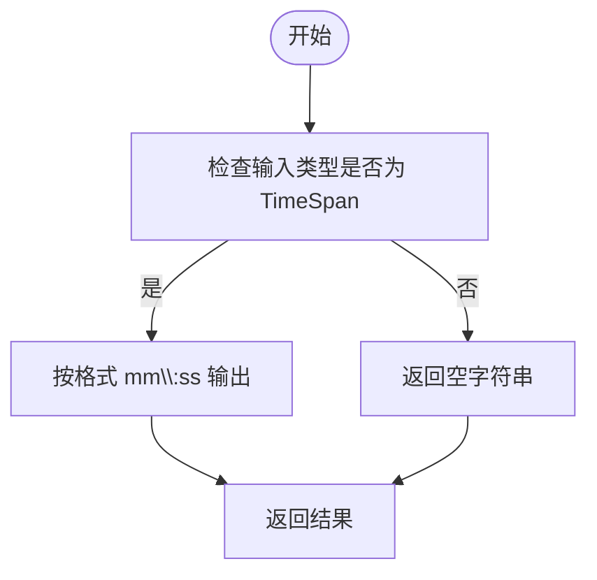
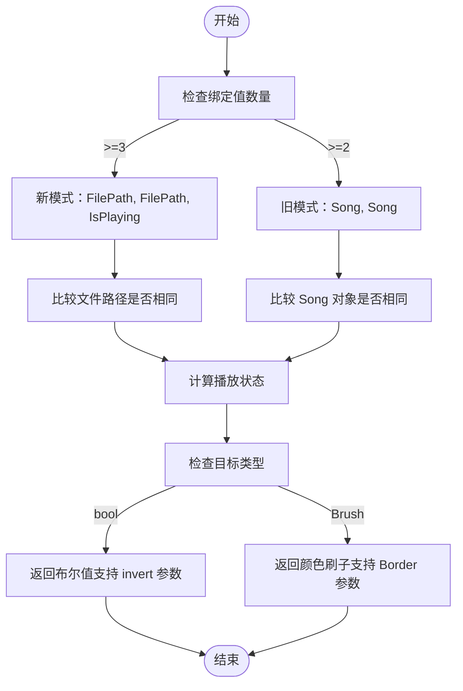
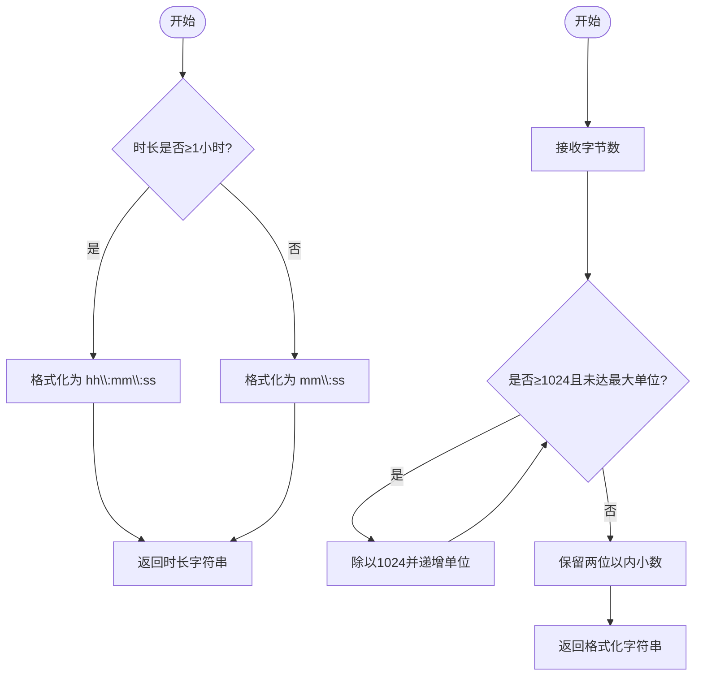
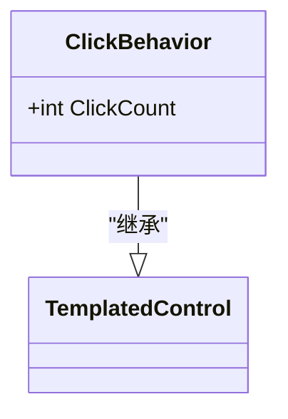
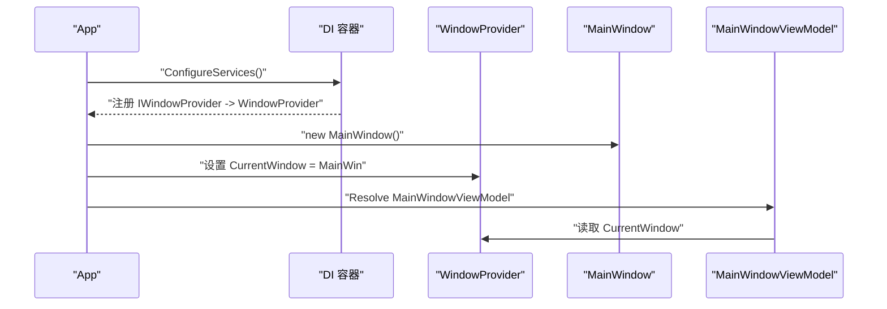
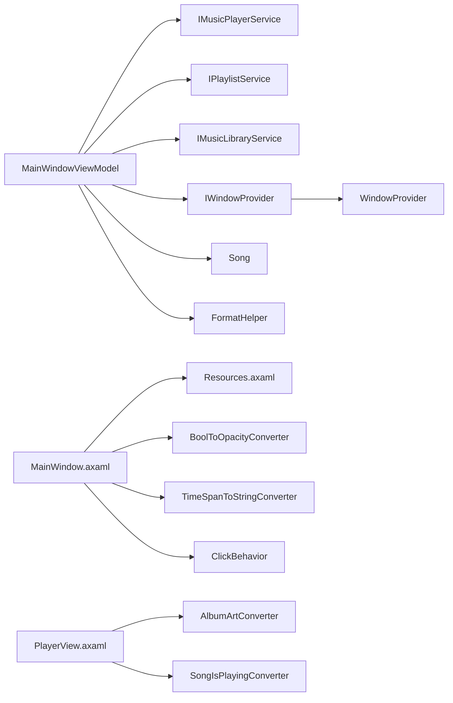

# 工具和辅助功能

<cite>
**本文引用的文件**
- [Converters/BoolToOpacityConverter.cs](file://Converters/BoolToOpacityConverter.cs)
- [Converters/TimeSpanToStringConverter.cs](file://Converters/TimeSpanToStringConverter.cs)
- [Converters/AlbumArtConverter.cs](file://Converters/AlbumArtConverter.cs)
- [Converters/SongIsPlayingConverter.cs](file://Converters/SongIsPlayingConverter.cs)
- [Helpers/FormatHelper.cs](file://Helpers/FormatHelper.cs)
- [Services/IWindowProvider.cs](file://Services/IWindowProvider.cs)
- [Services/WindowProvider.cs](file://Services/WindowProvider.cs)
- [Behaviors/ClickBehavior.cs](file://Behaviors/ClickBehavior.cs)
- [App.axaml.cs](file://App.axaml.cs)
- [ViewModels/MainWindowViewModel.cs](file://ViewModels/MainWindowViewModel.cs)
- [Views/MainWindow.axaml](file://Views/MainWindow.axaml)
- [Views/PlayerView.axaml](file://Views/PlayerView.axaml)
- [Styles/Resources.axaml](file://Styles/Resources.axaml)
- [Services/IMusicPlayerService.cs](file://Services/IMusicPlayerService.cs)
- [Services/IMusicLibraryService.cs](file://Services/IMusicLibraryService.cs)
- [Services/IPlaylistService.cs](file://Services/IPlaylistService.cs)
- [Models/Song.cs](file://Models/Song.cs)
</cite>

## 更新摘要
**变更内容**
- 新增专辑封面转换器（AlbumArtConverter）用于图片资源转换
- 新增播放状态转换器（SongIsPlayingConverter）用于动态视觉反馈
- 扩展数据转换器生态系统，支持更丰富的 UI 交互场景
- 增强歌曲模型以支持专辑封面路径管理

## 目录
1. [简介](#简介)
2. [项目结构](#项目结构)
3. [核心组件](#核心组件)
4. [架构总览](#架构总览)
5. [详细组件分析](#详细组件分析)
6. [依赖关系分析](#依赖关系分析)
7. [性能考虑](#性能考虑)
8. [故障排除指南](#故障排除指南)
9. [结论](#结论)
10. [附录](#附录)

## 简介
本文件系统性梳理 LocalMusicPlayer 中的工具与辅助功能，重点覆盖以下方面：
- 数据转换器（Converters）：布尔值到透明度转换、时间跨度到字符串转换、专辑封面转换、播放状态转换
- UI 行为（Behaviors）：扩展机制与自定义行为实现
- 格式化助手（FormatHelper）：时长与文件大小格式化
- 窗口提供者（IWindowProvider/WindowProvider）：界面管理与对话框处理
- 设计原则、使用模式、扩展方法与最佳实践
- 性能优化建议、错误处理策略与实际应用场景

## 项目结构
项目采用分层与按职责划分的组织方式：
- Converters：Avalonia 数据绑定转换器集合，包含基础转换器和高级转换器
- Helpers：通用格式化工具类
- Behaviors：基于 Avalonia 控件模板的行为扩展
- Services：服务接口与实现（含窗口提供者）
- Models：领域模型，包含增强的歌曲信息
- ViewModels/Views：MVVM 视图与视图模型
- Styles：资源字典与主题样式



**图表来源**
- [Views/MainWindow.axaml:1-78](file://Views/MainWindow.axaml#L1-L78)
- [Views/PlayerView.axaml:1-718](file://Views/PlayerView.axaml#L1-L718)
- [ViewModels/MainWindowViewModel.cs:1-324](file://ViewModels/MainWindowViewModel.cs#L1-L324)
- [Services/IWindowProvider.cs:1-9](file://Services/IWindowProvider.cs#L1-L9)
- [Services/WindowProvider.cs:1-9](file://Services/WindowProvider.cs#L1-L9)
- [Services/IMusicPlayerService.cs:1-27](file://Services/IMusicPlayerService.cs#L1-L27)
- [Services/IMusicLibraryService.cs:1-14](file://Services/IMusicLibraryService.cs#L1-L14)
- [Services/IPlaylistService.cs:1-22](file://Services/IPlaylistService.cs#L1-L22)
- [Models/Song.cs:1-77](file://Models/Song.cs#L1-L77)
- [Converters/BoolToOpacityConverter.cs:1-21](file://Converters/BoolToOpacityConverter.cs#L1-L21)
- [Converters/TimeSpanToStringConverter.cs:1-21](file://Converters/TimeSpanToStringConverter.cs#L1-L21)
- [Converters/AlbumArtConverter.cs:1-46](file://Converters/AlbumArtConverter.cs#L1-L46)
- [Converters/SongIsPlayingConverter.cs:1-53](file://Converters/SongIsPlayingConverter.cs#L1-L53)
- [Helpers/FormatHelper.cs:1-28](file://Helpers/FormatHelper.cs#L1-L28)
- [Behaviors/ClickBehavior.cs:1-17](file://Behaviors/ClickBehavior.cs#L1-L17)
- [Styles/Resources.axaml:1-67](file://Styles/Resources.axaml#L1-L67)

## 核心组件
- 数据转换器：用于在视图与视图模型之间进行单向数据转换，提升 UI 响应与可读性
- 格式化助手：提供统一的时长与文件大小格式化方法，便于跨模块复用
- UI 行为：通过 Avalonia 的 StyledProperty 扩展控件行为，支持状态属性暴露
- 窗口提供者：以接口抽象当前主窗体，便于注入与测试，同时为对话框等交互提供上下文

章节来源
- [Converters/BoolToOpacityConverter.cs:1-21](file://Converters/BoolToOpacityConverter.cs#L1-L21)
- [Converters/TimeSpanToStringConverter.cs:1-21](file://Converters/TimeSpanToStringConverter.cs#L1-L21)
- [Converters/AlbumArtConverter.cs:1-46](file://Converters/AlbumArtConverter.cs#L1-L46)
- [Converters/SongIsPlayingConverter.cs:1-53](file://Converters/SongIsPlayingConverter.cs#L1-L53)
- [Helpers/FormatHelper.cs:1-28](file://Helpers/FormatHelper.cs#L1-L28)
- [Behaviors/ClickBehavior.cs:1-17](file://Behaviors/ClickBehavior.cs#L1-L17)
- [Services/IWindowProvider.cs:1-9](file://Services/IWindowProvider.cs#L1-L9)
- [Services/WindowProvider.cs:1-9](file://Services/WindowProvider.cs#L1-L9)

## 架构总览
工具与辅助功能在 MVVM 架构中承担"基础设施"角色：
- 视图层通过绑定使用转换器与资源，减少视图逻辑复杂度
- 视图模型通过服务接口与模型交互，避免直接依赖 UI 细节
- 窗口提供者作为注入的服务，贯穿应用生命周期，确保 UI 上下文可用



**图表来源**
- [App.axaml.cs:41-51](file://App.axaml.cs#L41-L51)
- [Services/WindowProvider.cs:1-9](file://Services/WindowProvider.cs#L1-L9)
- [ViewModels/MainWindowViewModel.cs:120-135](file://ViewModels/MainWindowViewModel.cs#L120-L135)
- [Views/MainWindow.axaml:1-78](file://Views/MainWindow.axaml#L1-L78)

## 详细组件分析

### 数据转换器（Converters）

#### 布尔值到透明度转换（BoolToOpacityConverter）
- 功能：将布尔值映射为不透明度数值，常用于按钮或控件的视觉反馈
- 实现要点：
  - 单向转换（Convert），ConvertBack 抛出不支持异常，避免双向绑定误用
  - 默认返回较低透明度，保证未选中状态的可读性
- 应用场景：
  - 导航按钮的前景色或透明度绑定，根据是否选中切换视觉状态
  - 播放控制按钮的禁用态显示


**图表来源**
- [Converters/BoolToOpacityConverter.cs:9-19](file://Converters/BoolToOpacityConverter.cs#L9-L19)

章节来源
- [Converters/BoolToOpacityConverter.cs:1-21](file://Converters/BoolToOpacityConverter.cs#L1-L21)

#### 时间跨度到字符串转换（TimeSpanToStringConverter）
- 功能：将 TimeSpan 转换为 mm:ss 或 hh:mm:ss 格式的字符串
- 实现要点：
  - 单向转换，使用固定格式字符串输出
  - 非 TimeSpan 输入返回空字符串，避免异常传播
- 应用场景：
  - 歌曲时长显示、进度条标签、播放时长文本
  - 与 FormatHelper 的协同使用，满足不同精度需求



**图表来源**
- [Converters/TimeSpanToStringConverter.cs:9-19](file://Converters/TimeSpanToStringConverter.cs#L9-L19)

章节来源
- [Converters/TimeSpanToStringConverter.cs:1-21](file://Converters/TimeSpanToStringConverter.cs#L1-L21)

#### 专辑封面转换器（AlbumArtConverter）
- 功能：将文件路径转换为 Bitmap 图像，支持默认封面回退
- 实现要点：
  - 实现 IValueConverter 接口，支持单向转换
  - 优先从文件系统加载图像，失败时回退到内置默认封面
  - 使用 Avalonia 平台资源加载器处理嵌入式资源
- 应用场景：
  - 歌曲列表中的专辑封面显示
  - 播放器底部栏的当前歌曲封面
  - 媒体库中的缩略图展示


**图表来源**
- [Converters/AlbumArtConverter.cs:11-40](file://Converters/AlbumArtConverter.cs#L11-L40)

章节来源
- [Converters/AlbumArtConverter.cs:1-46](file://Converters/AlbumArtConverter.cs#L1-L46)

#### 播放状态转换器（SongIsPlayingConverter）
- 功能：根据当前播放状态动态返回视觉样式或可见性
- 实现要点：
  - 实现 IMultiValueConverter 接口，支持多值绑定
  - 兼容两种模式：Song 对象比较和文件路径比较
  - 支持多种输出类型：背景色、边框色、可见性（bool）
  - 参数支持："Border"（边框）、"invert"（反向逻辑）
- 应用场景：
  - 歌曲列表行的高亮显示
  - 播放按钮的显示/隐藏控制
  - 当前播放歌曲的视觉标识



**图表来源**
- [Converters/SongIsPlayingConverter.cs:16-51](file://Converters/SongIsPlayingConverter.cs#L16-L51)

章节来源
- [Converters/SongIsPlayingConverter.cs:1-53](file://Converters/SongIsPlayingConverter.cs#L1-L53)

### 格式化助手（FormatHelper）
- 功能：
  - FormatDuration：根据时长是否超过小时，自动选择 hh:mm:ss 或 mm:ss 格式
  - FormatFileSize：将字节数转换为 B/KB/MB/GB 的人类可读格式，保留合理小数位
- 设计原则：
  - 静态方法，无状态，便于全局调用
  - 返回值为纯字符串，避免 UI 层再次转换
- 应用场景：
  - 歌曲信息面板中的时长与文件大小展示
  - 列表项与详情页的统一格式化输出



**图表来源**
- [Helpers/FormatHelper.cs:7-26](file://Helpers/FormatHelper.cs#L7-L26)

章节来源
- [Helpers/FormatHelper.cs:1-28](file://Helpers/FormatHelper.cs#L1-L28)

### UI 行为（Behaviors）
- ClickBehavior：基于 TemplatedControl 的行为扩展，暴露 ClickCount 可样式化的属性
- 设计原则：
  - 使用 StyledProperty 支持样式与模板绑定
  - 仅暴露必要状态属性，避免过度耦合
- 扩展方法：
  - 可在模板中添加事件处理器，结合 ClickCount 实现点击计数或双击检测
  - 通过样式选择器与触发器，实现不同点击次数下的视觉反馈



**图表来源**
- [Behaviors/ClickBehavior.cs:6-16](file://Behaviors/ClickBehavior.cs#L6-L16)

章节来源
- [Behaviors/ClickBehavior.cs:1-17](file://Behaviors/ClickBehavior.cs#L1-L17)

### 窗口提供者（IWindowProvider/WindowProvider）
- 接口职责：抽象当前主窗口实例，便于在服务中访问 UI 上下文
- 实现要点：
  - 简单的 CurrentWindow 属性，支持注入与替换
  - 在应用启动时由容器注册并设置
- 生命周期：
  - 应用初始化阶段注册为单例
  - 主窗口创建后设置 CurrentWindow
  - 视图模型通过构造函数注入使用



**图表来源**
- [App.axaml.cs:41-51](file://App.axaml.cs#L41-L51)
- [Services/WindowProvider.cs:1-9](file://Services/WindowProvider.cs#L1-L9)
- [ViewModels/MainWindowViewModel.cs:120-135](file://ViewModels/MainWindowViewModel.cs#L120-L135)

章节来源
- [Services/IWindowProvider.cs:1-9](file://Services/IWindowProvider.cs#L1-L9)
- [Services/WindowProvider.cs:1-9](file://Services/WindowProvider.cs#L1-L9)
- [App.axaml.cs:18-39](file://App.axaml.cs#L18-L39)

## 依赖关系分析
- 视图层依赖资源字典与转换器，减少 XAML 中的复杂逻辑
- 视图模型依赖服务接口，通过依赖注入解耦具体实现
- 窗口提供者作为横切关注点，被多个组件共享
- 模型层保持简单数据载体，便于序列化与跨层传递



**图表来源**
- [ViewModels/MainWindowViewModel.cs:13-16](file://ViewModels/MainWindowViewModel.cs#L13-L16)
- [Services/IWindowProvider.cs:1-9](file://Services/IWindowProvider.cs#L1-L9)
- [Services/WindowProvider.cs:1-9](file://Services/WindowProvider.cs#L1-L9)
- [Services/IMusicPlayerService.cs:1-27](file://Services/IMusicPlayerService.cs#L1-L27)
- [Services/IPlaylistService.cs:1-22](file://Services/IPlaylistService.cs#L1-L22)
- [Services/IMusicLibraryService.cs:1-14](file://Services/IMusicLibraryService.cs#L1-L14)
- [Models/Song.cs:1-77](file://Models/Song.cs#L1-L77)
- [Views/MainWindow.axaml:1-78](file://Views/MainWindow.axaml#L1-L78)
- [Views/PlayerView.axaml:1-718](file://Views/PlayerView.axaml#L1-L718)
- [Styles/Resources.axaml:1-67](file://Styles/Resources.axaml#L1-L67)
- [Converters/BoolToOpacityConverter.cs:1-21](file://Converters/BoolToOpacityConverter.cs#L1-L21)
- [Converters/TimeSpanToStringConverter.cs:1-21](file://Converters/TimeSpanToStringConverter.cs#L1-L21)
- [Converters/AlbumArtConverter.cs:1-46](file://Converters/AlbumArtConverter.cs#L1-L46)
- [Converters/SongIsPlayingConverter.cs:1-53](file://Converters/SongIsPlayingConverter.cs#L1-L53)
- [Helpers/FormatHelper.cs:1-28](file://Helpers/FormatHelper.cs#L1-L28)
- [Behaviors/ClickBehavior.cs:1-17](file://Behaviors/ClickBehavior.cs#L1-L17)

章节来源
- [ViewModels/MainWindowViewModel.cs:1-324](file://ViewModels/MainWindowViewModel.cs#L1-L324)
- [Services/IWindowProvider.cs:1-9](file://Services/IWindowProvider.cs#L1-L9)
- [Services/WindowProvider.cs:1-9](file://Services/WindowProvider.cs#L1-L9)
- [Services/IMusicPlayerService.cs:1-27](file://Services/IMusicPlayerService.cs#L1-L27)
- [Services/IPlaylistService.cs:1-22](file://Services/IPlaylistService.cs#L1-L22)
- [Services/IMusicLibraryService.cs:1-14](file://Services/IMusicLibraryService.cs#L1-L14)
- [Models/Song.cs:1-77](file://Models/Song.cs#L1-L77)
- [Views/MainWindow.axaml:1-78](file://Views/MainWindow.axaml#L1-L78)
- [Views/PlayerView.axaml:1-718](file://Views/PlayerView.axaml#L1-L718)
- [Styles/Resources.axaml:1-67](file://Styles/Resources.axaml#L1-L67)
- [Converters/BoolToOpacityConverter.cs:1-21](file://Converters/BoolToOpacityConverter.cs#L1-L21)
- [Converters/TimeSpanToStringConverter.cs:1-21](file://Converters/TimeSpanToStringConverter.cs#L1-L21)
- [Converters/AlbumArtConverter.cs:1-46](file://Converters/AlbumArtConverter.cs#L1-L46)
- [Converters/SongIsPlayingConverter.cs:1-53](file://Converters/SongIsPlayingConverter.cs#L1-L53)
- [Helpers/FormatHelper.cs:1-28](file://Helpers/FormatHelper.cs#L1-L28)
- [Behaviors/ClickBehavior.cs:1-17](file://Behaviors/ClickBehavior.cs#L1-L17)

## 性能考虑
- 转换器与格式化助手均为轻量级计算，适合频繁调用
- 建议：
  - 避免在转换器中执行 IO 或网络请求
  - 对于高频率更新的 UI（如进度条），可考虑降低绑定刷新频率或使用节流策略
  - 将格式化逻辑集中在 FormatHelper，减少重复代码与维护成本
  - 图像转换器应缓存常用资源，避免重复加载
  - 多值转换器应优化比较逻辑，避免不必要的对象创建

## 故障排除指南
- 转换器异常
  - 现象：ConvertBack 抛出不支持异常
  - 处理：确认绑定方向为单向，或提供 ConvertBack 实现
- 类型不匹配
  - 现象：非目标类型输入导致返回默认值
  - 处理：在调用前确保数据类型正确，或在转换器中增加类型校验与日志
- 窗口上下文丢失
  - 现象：服务无法获取当前窗口
  - 处理：确认应用初始化阶段已设置 IWindowProvider.CurrentWindow；检查 DI 注册顺序
- 图像加载失败
  - 现象：专辑封面显示默认占位符
  - 处理：检查文件路径有效性，验证文件存在性和可读权限
- 播放状态判断错误
  - 现象：歌曲高亮状态不正确
  - 处理：确认绑定的歌曲对象或文件路径是否正确，检查播放状态同步

章节来源
- [Converters/BoolToOpacityConverter.cs:16-19](file://Converters/BoolToOpacityConverter.cs#L16-L19)
- [Converters/TimeSpanToStringConverter.cs:16-19](file://Converters/TimeSpanToStringConverter.cs#L16-L19)
- [Converters/AlbumArtConverter.cs:23-26](file://Converters/AlbumArtConverter.cs#L23-L26)
- [Converters/SongIsPlayingConverter.cs:25-37](file://Converters/SongIsPlayingConverter.cs#L25-L37)
- [Services/WindowProvider.cs:1-9](file://Services/WindowProvider.cs#L1-L9)
- [App.axaml.cs:26-29](file://App.axaml.cs#L26-L29)

## 结论
本项目通过一组简洁、可复用的工具与辅助功能，有效降低了视图层的复杂度，提升了 UI 响应与一致性。新增的数据转换器进一步丰富了 UI 交互能力，包括图像资源转换和动态视觉反馈。数据转换器与格式化助手提供了稳定的格式化能力，UI 行为扩展了控件的可配置性，窗口提供者则为应用的 UI 上下文管理提供了清晰的抽象。遵循本文的设计原则与最佳实践，可在保持架构清晰的同时，持续扩展更多实用工具。

## 附录

### 设计原则与最佳实践
- 单一职责：每个工具专注于一个明确任务
- 不可变与无副作用：格式化助手应返回纯字符串，避免外部状态依赖
- 明确的契约：接口与实现分离，便于替换与测试
- 可扩展性：通过接口与依赖注入，支持新实现无缝接入
- 错误处理：转换器应优雅处理无效输入，提供合理的默认值
- 性能优化：避免在转换器中执行昂贵操作，考虑缓存策略

### 实际应用场景
- 布尔到透明度转换：导航按钮的选中态视觉反馈
- 时间跨度到字符串：歌曲时长与进度显示
- 专辑封面转换：歌曲列表和播放器中的图片显示
- 播放状态转换：当前播放歌曲的高亮显示和按钮控制
- 文件大小格式化：媒体库列表中的容量展示
- 点击行为：按钮点击计数与多击检测
- 窗口提供者：对话框打开、模态提示与焦点管理

### 新增转换器使用示例

#### 专辑封面转换器使用
```xml
<Image Source="{Binding CurrentSong.AlbumArtPath, Converter={StaticResource AlbumArtConverter}}" />
```

#### 播放状态转换器使用
```xml
<!-- 背景色高亮当前播放歌曲 -->
<Border.Background>
    <MultiBinding Converter="{StaticResource SongIsPlayingConverter}">
        <Binding Path="." />
        <Binding Path="DataContext.CurrentSong" RelativeSource="{RelativeSource AncestorType=ListBox}" />
    </MultiBinding>
</Border.Background>

<!-- 播放按钮可见性控制 -->
<Button IsVisible="{Binding ., Converter={StaticResource SongIsPlayingConverter}, ConverterParameter=invert}" />
```