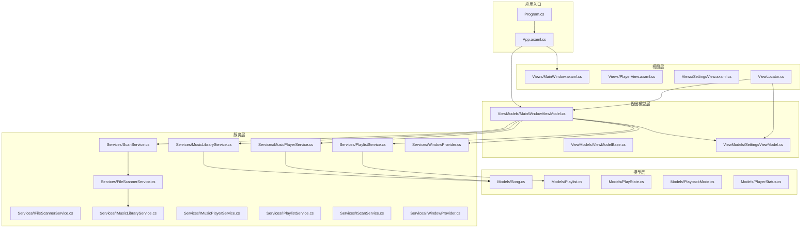
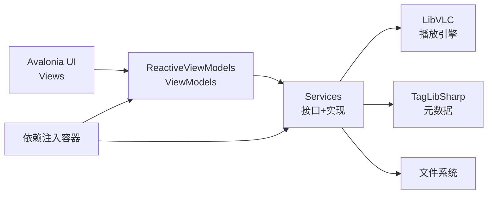
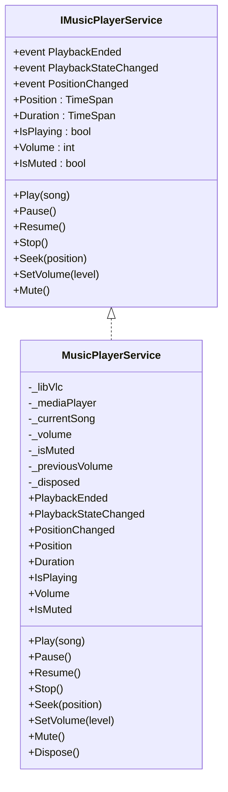
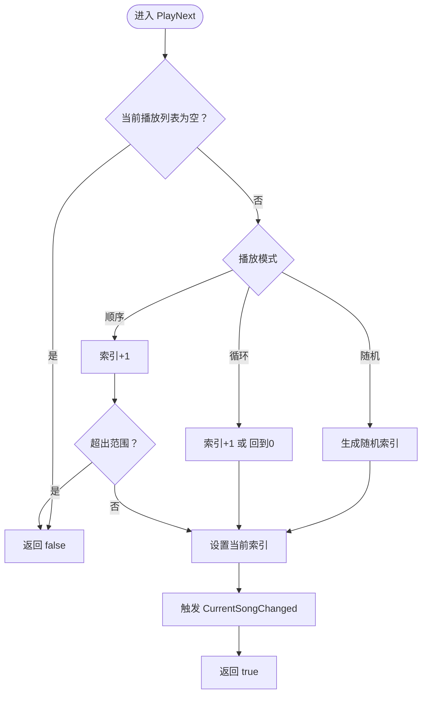
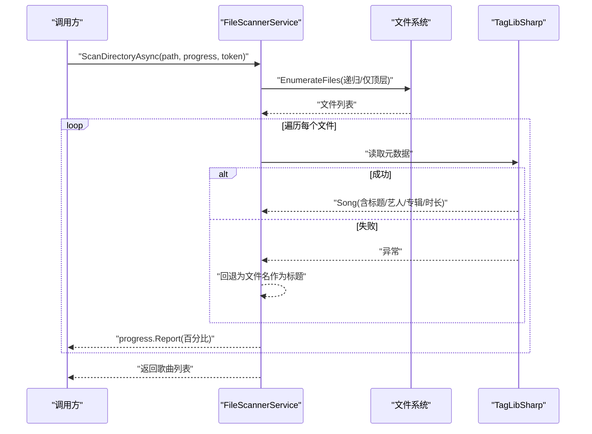
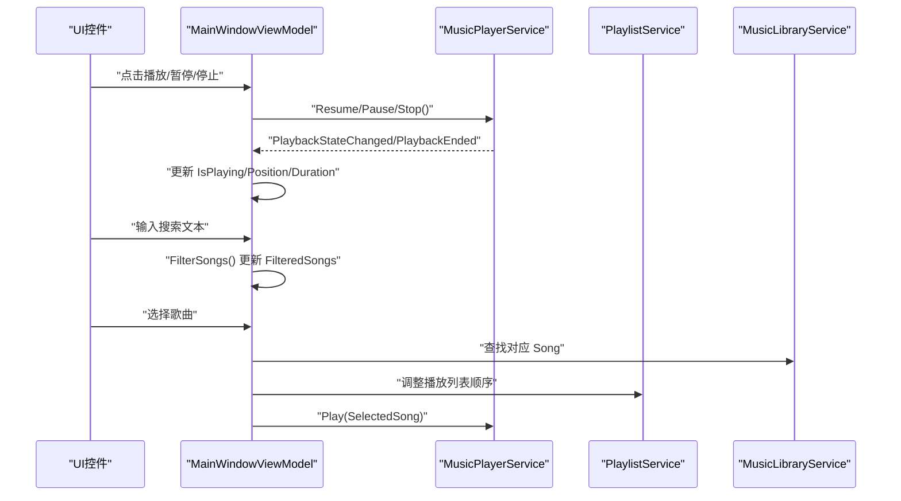
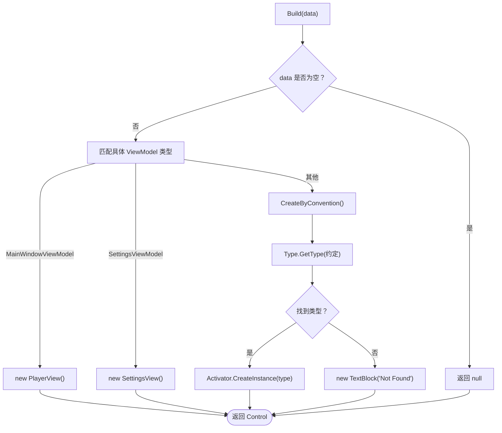
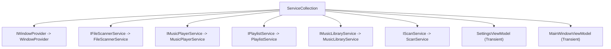

# 开发指南

<cite>
**本文引用的文件**
- [README.md](file://README.md)
- [LocalMusicPlayer.csproj](file://LocalMusicPlayer.csproj)
- [Program.cs](file://Program.cs)
- [App.axaml.cs](file://App.axaml.cs)
- [ViewLocator.cs](file://ViewLocator.cs)
- [IFileScannerService.cs](file://Services/IFileScannerService.cs)
- [FileScannerService.cs](file://Services/FileScannerService.cs)
- [IMusicLibraryService.cs](file://Services/IMusicLibraryService.cs)
- [MusicLibraryService.cs](file://Services/MusicLibraryService.cs)
- [IMusicPlayerService.cs](file://Services/IMusicPlayerService.cs)
- [MusicPlayerService.cs](file://Services/MusicPlayerService.cs)
- [IPlaylistService.cs](file://Services/IPlaylistService.cs)
- [PlaylistService.cs](file://Services/PlaylistService.cs)
- [IScanService.cs](file://Services/IScanService.cs)
- [ScanService.cs](file://Services/ScanService.cs)
- [IWindowProvider.cs](file://Services/IWindowProvider.cs)
- [WindowProvider.cs](file://Services/WindowProvider.cs)
- [ViewModelBase.cs](file://ViewModels/ViewModelBase.cs)
- [MainWindowViewModel.cs](file://ViewModels/MainWindowViewModel.cs)
- [SettingsViewModel.cs](file://ViewModels/SettingsViewModel.cs)
- [Song.cs](file://Models/Song.cs)
- [Playlist.cs](file://Models/Playlist.cs)
- [PlayState.cs](file://Models/PlayState.cs)
- [PlaybackMode.cs](file://Models/PlaybackMode.cs)
- [PlayerStatus.cs](file://Models/PlayerStatus.cs)
- [MainWindow.axaml.cs](file://Views/MainWindow.axaml.cs)
- [PlayerView.axaml.cs](file://Views/PlayerView.axaml.cs)
- [SettingsView.axaml.cs](file://Views/SettingsView.axaml.cs)
- [.gitignore](file://.gitignore)
- [app.manifest](file://app.manifest)
- [.github/workflows/ci.yml](file://.github/workflows/ci.yml)
- [.github/workflows/pr-checks.yml](file://.github/workflows/pr-checks.yml)
- [.github/workflows/release-please.yml](file://.github/workflows/release-please.yml)
</cite>

## 更新摘要
**所做更改**
- 新增README.md项目说明、安装指导和开发设置指南章节
- 更新CI/CD相关章节以反映工作流的重大重组
- 移除了Dependabot配置说明
- 更新了持续集成与自动化部署章节的内容
- 重新组织了版本控制最佳实践章节
- 新增Conventional Commits提交规范说明
- 更新了贡献指南和开发流程

## 目录
1. [简介](#简介)
2. [项目结构](#项目结构)
3. [核心组件](#核心组件)
4. [架构总览](#架构总览)
5. [详细组件分析](#详细组件分析)
6. [依赖关系分析](#依赖关系分析)
7. [性能考量](#性能考量)
8. [故障排查指南](#故障排查指南)
9. [结论](#结论)
10. [附录](#附录)

## 简介
本开发指南面向LocalMusicPlayer项目的开发者，系统性地阐述项目结构与编码规范、调试与开发工具使用、测试策略与单元测试编写、版本控制与分支管理、持续集成与自动化部署、代码审查与质量保障、安全注意事项，以及扩展开发（新功能、第三方库集成、插件化）的实践方法。文档同时提供常见问题的定位与解决思路，并通过图示帮助不同技术背景的读者快速上手。

LocalMusicPlayer是一款基于Avalonia UI的跨平台本地音乐播放器，支持Windows、Linux和macOS三大平台。项目采用现代化的技术栈，包括.NET 9、Avalonia UI、LibVLC多媒体播放引擎和ReactiveUI响应式编程框架。

## 项目结构
项目采用基于功能域的分层组织方式：Models（模型）、Services（服务接口与实现）、ViewModels（响应式视图模型）、Views（界面）、Converters（值转换器）、Behaviors（行为）、Helpers（辅助类）、Styles（样式资源）、Assets（资源文件）。构建与依赖通过MSBuild与NuGet管理，目标框架为.NET 9.0，UI框架为Avalonia，响应式编程由ReactiveUI提供支持。



**图表来源**
- [Program.cs:1-20](file://Program.cs#L1-L20)
- [App.axaml.cs:18-52](file://App.axaml.cs#L18-L52)
- [ViewLocator.cs:8-39](file://ViewLocator.cs#L8-L39)
- [MainWindowViewModel.cs:120-216](file://ViewModels/MainWindowViewModel.cs#L120-L216)
- [FileScannerService.cs:12-103](file://Services/FileScannerService.cs#L12-L103)
- [MusicLibraryService.cs:7-27](file://Services/MusicLibraryService.cs#L7-L27)
- [MusicPlayerService.cs:7-129](file://Services/MusicPlayerService.cs#L7-L129)
- [PlaylistService.cs:7-120](file://Services/PlaylistService.cs#L7-L120)
- [MainWindow.axaml.cs:5-11](file://Views/MainWindow.axaml.cs#L5-L11)

**章节来源**
- [LocalMusicPlayer.csproj:1-45](file://LocalMusicPlayer.csproj#L1-L45)
- [Program.cs:1-20](file://Program.cs#L1-L20)
- [App.axaml.cs:18-52](file://App.axaml.cs#L18-L52)
- [ViewLocator.cs:8-39](file://ViewLocator.cs#L8-L39)

## 核心组件
- 应用入口与生命周期
  - 入口程序负责初始化Avalonia应用、平台检测、字体加载、ReactiveUI集成与日志输出。
  - 应用在框架初始化完成后注册服务容器，解析主窗体与视图模型，建立数据上下文绑定。
- 视图与视图模型
  - ViewLocator通过约定自动映射ViewModel到View，或显式匹配特定VM类型。
  - MainWindowViewModel集中管理播放控制、播放列表、搜索过滤、音量与播放状态等。
- 服务层
  - 文件扫描：IFileScannerService/FileScannerService负责目录扫描、元数据提取与进度报告。
  - 音乐库：IMusicLibraryService/MusicLibraryService维护歌曲集合与过滤集合。
  - 播放器：IMusicPlayerService/MusicPlayerService封装LibVLC播放能力，暴露事件与属性。
  - 播放列表：IPlaylistService/PlaylistService管理当前播放列表、索引与播放模式（顺序/随机/循环）。
  - 扫描编排：IScanService/ScanService协调扫描流程。
  - 窗口提供：IWindowProvider/WindowProvider提供顶层窗口实例。
- 模型
  - Song/Playlist承载媒体数据；PlayState/PlaybackMode/PlayerStatus定义播放状态与模式枚举。

**章节来源**
- [Program.cs:14-20](file://Program.cs#L14-L20)
- [App.axaml.cs:41-51](file://App.axaml.cs#L41-L51)
- [ViewLocator.cs:10-37](file://ViewLocator.cs#L10-L37)
- [MainWindowViewModel.cs:120-216](file://ViewModels/MainWindowViewModel.cs#L120-L216)
- [FileScannerService.cs:12-103](file://Services/FileScannerService.cs#L12-L103)
- [MusicLibraryService.cs:7-27](file://Services/MusicLibraryService.cs#L7-L27)
- [MusicPlayerService.cs:7-129](file://Services/MusicPlayerService.cs#L7-L129)
- [PlaylistService.cs:7-120](file://Services/PlaylistService.cs#L7-L120)
- [Song.cs:5-13](file://Models/Song.cs#L5-L13)
- [Playlist.cs:5-10](file://Models/Playlist.cs#L5-L10)

## 架构总览
应用采用MVVM与依赖注入相结合的架构。UI通过Avalonia渲染，ViewModel通过ReactiveUI响应式更新UI，服务层通过接口抽象与依赖注入解耦。LibVLC提供底层播放能力，TagLibSharp用于音频元数据读取。



**图表来源**
- [Program.cs:14-20](file://Program.cs#L14-L20)
- [App.axaml.cs:41-51](file://App.axaml.cs#L41-L51)
- [MusicPlayerService.cs:27-38](file://Services/MusicPlayerService.cs#L27-L38)
- [FileScannerService.cs:77-101](file://Services/FileScannerService.cs#L77-L101)

## 详细组件分析

### 组件A：播放器服务（MusicPlayerService）
- 职责
  - 封装LibVLC播放器生命周期与事件，暴露播放、暂停、停止、跳转、音量与静音控制。
  - 提供位置与时长查询，订阅播放状态变化与结束事件。
- 关键点
  - 使用Core.Initialize确保LibVLC初始化。
  - 事件桥接：EndReached、TimeChanged、Playing/Paused/Stopped映射到统一事件。
  - 音量静音切换保存/恢复逻辑。
- 错误处理
  - 对外部调用进行空检查，避免Disposed状态下的操作。
- 性能
  - 播放位置轮询通过定时观察在主线程调度，降低UI阻塞风险。



**图表来源**
- [IMusicPlayerService.cs](file://Services/IMusicPlayerService.cs)
- [MusicPlayerService.cs:7-132](file://Services/MusicPlayerService.cs#L7-L132)

**章节来源**
- [MusicPlayerService.cs:27-132](file://Services/MusicPlayerService.cs#L27-L132)

### 组件B：播放列表服务（PlaylistService）
- 职责
  - 管理当前播放列表、当前索引、播放模式（顺序/随机/循环），并触发变更事件。
- 关键点
  - PlayNext/PlayPrevious根据模式计算下一曲索引，支持循环与随机。
  - 当播放列表为空或越界时返回false，避免异常。
- 并发与线程
  - 该组件不直接涉及异步IO，但其结果会被ViewModel在主线程订阅更新UI。



**图表来源**
- [PlaylistService.cs:69-95](file://Services/PlaylistService.cs#L69-L95)

**章节来源**
- [PlaylistService.cs:7-120](file://Services/PlaylistService.cs#L7-L120)

### 组件C：文件扫描服务（FileScannerService）
- 职责
  - 异步扫描指定目录，筛选受支持的音频扩展名，读取元数据，支持取消与进度上报。
- 关键点
  - 支持扩展名白名单，使用TagLibSharp读取标题、艺人、专辑与时长。
  - 失败时回退为文件名作为标题，保证扫描健壮性。
  - 进度按百分比上报，取消令牌用于中断扫描。
- 性能
  - 使用Task.Run在后台线程处理文件遍历与元数据读取，避免UI阻塞。



**图表来源**
- [FileScannerService.cs:16-75](file://Services/FileScannerService.cs#L16-L75)
- [FileScannerService.cs:77-101](file://Services/FileScannerService.cs#L77-L101)

**章节来源**
- [FileScannerService.cs:12-103](file://Services/FileScannerService.cs#L12-L103)

### 组件D：主窗口视图模型（MainWindowViewModel）
- 职责
  - 聚合播放控制命令、播放列表操作、搜索过滤、播放状态与音量同步。
  - 订阅播放器事件，驱动UI状态更新。
- 关键点
  - 使用ReactiveCommand创建命令，绑定到UI交互。
  - 定时轮询播放器位置与时长，保持UI显示与实际一致。
  - 搜索文本变更即时过滤歌曲集合。
- 可扩展性
  - 命令与事件分离，便于新增功能（如收藏、均衡器、歌词）而不影响现有逻辑。



**图表来源**
- [MainWindowViewModel.cs:108-216](file://ViewModels/MainWindowViewModel.cs#L108-L216)
- [MusicPlayerService.cs:17-38](file://Services/MusicPlayerService.cs#L17-L38)
- [PlaylistService.cs:47-95](file://Services/PlaylistService.cs#L47-L95)
- [MusicLibraryService.cs:18-25](file://Services/MusicLibraryService.cs#L18-L25)

**章节来源**
- [MainWindowViewModel.cs:120-231](file://ViewModels/MainWindowViewModel.cs#L120-L231)

### 组件E：视图定位器（ViewLocator）
- 职责
  - 根据ViewModel类型自动创建对应View，或按约定反射创建，否则返回未找到提示。
- 关键点
  - 通过Match限定只对ViewModelBase派生类型生效，避免误匹配。
  - 约定规则：ViewModel名称替换"ViewModel"为"View"。



**图表来源**
- [ViewLocator.cs:10-37](file://ViewLocator.cs#L10-L37)

**章节来源**
- [ViewLocator.cs:8-39](file://ViewLocator.cs#L8-L39)

## 依赖关系分析
- 依赖注入
  - 在应用初始化阶段注册服务：窗口提供、文件扫描、播放器、播放列表、音乐库、扫描编排、视图模型。
  - 通过ServiceProvider解析MainWindowViewModel，注入其依赖的服务。
- 外部依赖
  - Avalonia系列包、ReactiveUI、TagLibSharp、LibVLCSharp、VideoLAN.LibVLC.Windows、Microsoft.Extensions.DependencyInjection。
- 版本与诊断
  - Debug配置包含Avalonia.Diagnostics，Release配置排除以减小体积。



**图表来源**
- [App.axaml.cs:41-51](file://App.axaml.cs#L41-L51)
- [LocalMusicPlayer.csproj:21-41](file://LocalMusicPlayer.csproj#L21-L41)

**章节来源**
- [App.axaml.cs:22-51](file://App.axaml.cs#L22-L51)
- [LocalMusicPlayer.csproj:21-41](file://LocalMusicPlayer.csproj#L21-L41)

## 性能考量
- UI线程与后台任务
  - 文件扫描与元数据读取在后台线程执行，避免阻塞UI；UI更新通过定时观察在主线程调度。
- 播放器轮询
  - 500ms间隔轮询播放位置与时长，频率适中，可根据设备性能调整。
- 资源释放
  - 播放器服务在Dispose中停止并释放LibVLC与MediaPlayer资源，防止内存泄漏。
- 诊断包
  - Release配置移除Avalonia.Diagnostics，减少运行时开销。

**章节来源**
- [FileScannerService.cs:45-72](file://Services/FileScannerService.cs#L45-L72)
- [MainWindowViewModel.cs:209-215](file://ViewModels/MainWindowViewModel.cs#L209-L215)
- [MusicPlayerService.cs:120-132](file://Services/MusicPlayerService.cs#L120-L132)
- [LocalMusicPlayer.csproj:26-30](file://LocalMusicPlayer.csproj#L26-L30)

## 故障排查指南
- 启动与依赖注入
  - 若出现"无法解析服务"错误，检查服务注册顺序与作用域是否正确（单例/瞬态）。
- 播放无声音或无声
  - 检查音量设置与静音状态；确认LibVLC初始化成功且媒体路径有效。
- 扫描无结果或卡顿
  - 检查扫描目录是否存在、扩展名是否受支持；必要时增加取消令牌与进度回调。
- UI不更新
  - 确认ReactiveUI属性变更通知已触发；检查定时观察是否在主线程调度。
- 调试建议
  - 断点：在命令创建处、事件订阅处、服务调用处设置断点。
  - 日志：利用Avalonia的日志输出到跟踪器；在关键路径添加日志。
  - 性能：使用性能分析器观察后台线程与UI线程占用情况。

**章节来源**
- [App.axaml.cs:41-51](file://App.axaml.cs#L41-L51)
- [MusicPlayerService.cs:27-38](file://Services/MusicPlayerService.cs#L27-L38)
- [FileScannerService.cs:32-35](file://Services/FileScannerService.cs#L32-L35)
- [MainWindowViewModel.cs:209-215](file://ViewModels/MainWindowViewModel.cs#L209-L215)

## 持续集成与自动化部署

### CI流水线配置
项目采用GitHub Actions实现持续集成，包含三个主要工作流：

#### CI工作流（ci.yml）
- **触发条件**：推送至master或develop分支，PR至master或develop分支
- **平台矩阵**：ubuntu-latest、windows-latest、macos-latest
- **配置矩阵**：Debug、Release两种配置
- **步骤**：
  1. 检出代码
  2. 设置.NET 9.0.x环境
  3. 还原依赖
  4. 构建项目
  5. 运行测试（继续执行，不阻塞后续步骤）
  6. 发布Windows构建产物（Release配置）
  7. 上传构建工件

#### PR检查工作流（pr-checks.yml）
- **触发条件**：PR打开、同步或重新打开至master分支
- **作业**：
  1. **构建检查**：在所有平台和配置下构建项目
  2. **代码质量检查**：使用dotnet-format验证代码格式
  3. **安全扫描**：检查易受攻击的包依赖

#### Release Please工作流（release-please.yml）
- **触发条件**：推送至master分支
- **功能**：自动生成发布版本和变更日志
- **构建矩阵**：支持Windows x64/x86、Linux x64、macOS x64/arm64
- **步骤**：
  1. 安装平台依赖（Linux: libvlc-dev, vlc；macOS: vlc）
  2. 发布自包含应用程序
  3. 创建平台特定压缩包
  4. 上传到GitHub Releases

**章节来源**
- [.github/workflows/ci.yml:1-61](file://.github/workflows/ci.yml#L1-L61)
- [.github/workflows/pr-checks.yml:1-83](file://.github/workflows/pr-checks.yml#L1-L83)
- [.github/workflows/release-please.yml:1-100](file://.github/workflows/release-please.yml#L1-L100)

## 版本控制最佳实践与分支管理
- **分支策略**
  - 主干保护：main仅允许通过合并请求（MR）合并
  - 功能分支：feature/* 用于新功能开发，完成后合并到develop
  - 发布分支：release/* 用于预发布修复，完成后合并到main与develop
  - 热修复：hotfix/* 用于紧急修复，完成后合并到main与develop
- **提交规范**
  - 项目采用Conventional Commits规范
  - 格式：type(scope): description
  - 示例：
    - `feat: 添加歌词显示功能`
    - `fix: 修复音量调节失效问题`
    - `docs: 更新使用说明`
    - `refactor: 优化播放引擎性能`
- **合并与审查**
  - MR必须通过代码审查与CI检查方可合并
  - 代码质量检查包括格式验证和安全扫描

**章节来源**
- [README.md:73-89](file://README.md#L73-L89)

## 贡献指南
LocalMusicPlayer欢迎所有形式的贡献！项目采用MIT许可证开源。

### 开发流程
1. Fork本仓库
2. 创建特性分支 (`git checkout -b feature/amazing-feature`)
3. 提交更改 (`git commit -m 'feat: add amazing feature'`)
4. 推送到分支 (`git push origin feature/amazing-feature`)
5. 创建Pull Request

### 提交规范
项目使用Conventional Commits规范，支持以下类型：
- `feat`：新功能
- `fix`：Bug修复
- `docs`：文档更新
- `style`：代码格式调整
- `refactor`：代码重构
- `perf`：性能改进
- `test`：测试相关
- `chore`：构建过程或依赖项更新

**章节来源**
- [README.md:69-98](file://README.md#L69-L98)
- [README.md:73-89](file://README.md#L73-L89)

## 项目说明与安装指导

### 特性概览
LocalMusicPlayer具备以下核心特性：
- **多格式支持**：支持MP3、FLAC、WAV、AAC等主流音频格式
- **智能音乐库**：自动扫描本地音乐文件，智能分类管理
- **现代化界面**：采用Fluent Design设计语言，支持深色/浅色主题
- **高品质播放**：基于LibVLC实现，提供稳定的音频播放体验
- **播放列表**：支持创建和管理多个播放列表
- **快捷键支持**：丰富的键盘快捷键，提升操作效率
- **跨平台**：支持Windows、Linux、macOS三大平台

### 系统要求
- Windows 10/11
- Linux (Ubuntu 20.04+)
- macOS 11.0+

### 安装步骤
1. 从 [Releases](https://github.com/cycling02/LocalMusicPlayer/releases) 下载对应平台的安装包
2. 解压并运行 `LocalMusicPlayer`

### 开发环境设置
```bash
# 克隆仓库
git clone https://github.com/cycling02/LocalMusicPlayer.git
cd LocalMusicPlayer

# 还原依赖
dotnet restore

# 构建项目
dotnet build

# 运行
dotnet run
```

### 技术栈
- [.NET 9](https://dotnet.microsoft.com/) - 跨平台开发框架
- [Avalonia UI](https://avaloniaui.net/) - 跨平台 UI 框架
- [LibVLC](https://www.videolan.org/vlc/libvlc.html) - 多媒体播放引擎
- [ReactiveUI](https://www.reactiveui.net/) - 响应式编程框架

### 项目结构
```
LocalMusicPlayer/
├── Models/           # 数据模型
├── Services/         # 业务服务层
├── ViewModels/       # MVVM 视图模型
├── Views/            # Avalonia 视图
├── Converters/       # 数据转换器
├── Styles/           # 样式资源
└── Assets/           # 静态资源
```

**章节来源**
- [README.md:7-17](file://README.md#L7-L17)
- [README.md:19-47](file://README.md#L19-L47)
- [README.md:49-67](file://README.md#L49-L67)

## 结论
本指南从架构、组件、依赖、性能、调试与质量保障等方面提供了LocalMusicPlayer项目的开发蓝图。结合README.md中的项目说明、安装指导和开发设置指南，开发者可以快速上手项目并遵循统一的开发规范。遵循本文档的规范与流程，可高效完成功能迭代、稳定发布与持续演进。

## 附录

### 编码规范与命名约定
- **命名**
  - 类型：PascalCase（如MainWindowViewModel、MusicPlayerService）
  - 接口：以大写I前缀（如IMusicPlayerService）
  - 属性与字段：PascalCase；私有字段以下划线前缀（如_currentSong）
  - 命令：以Command结尾（如PlayCommand、NextCommand）
- **文件组织**
  - 按功能域分层：Models、Services、ViewModels、Views、Converters、Behaviors、Helpers、Styles、Assets
  - XAML与后缀代码成对放置，命名一致（如MainWindow.axaml 与 MainWindow.axaml.cs）
- **注释与文档**
  - 公共API与复杂逻辑需提供清晰注释；简要说明职责、参数、返回值与异常场景
- **响应式与事件**
  - 使用ReactiveUI属性变更与命令；事件命名采用动词短语（如PlaybackEnded、PositionChanged）

### 调试技巧与开发工具
- **断点调试**
  - 在命令执行链路、服务调用前后、事件订阅处设置断点
- **日志记录**
  - 使用Avalonia.LogToTrace输出日志；在关键路径补充自定义日志
- **性能分析**
  - 使用性能分析器观察后台扫描与UI轮询的CPU与内存占用
- **工具链**
  - IDE：启用ReactiveUI源生成器；启用nullable与IDE内诊断
  - 包管理：通过NuGet包管理器更新Avalonia、LibVLCSharp、TagLibSharp

### 测试策略与单元测试编写
- **单元测试**
  - 针对纯逻辑组件（如PlaylistService）编写参数化测试，覆盖边界条件（空列表、越界、随机模式）
  - 使用Mock框架模拟服务接口（如IMusicPlayerService、IMusicLibraryService），验证命令与事件交互
- **集成测试**
  - 使用真实或虚拟文件系统进行扫描测试，验证元数据读取与进度上报
- **测试数据准备**
  - 准备少量带元数据与无元数据的音频文件，覆盖成功与失败分支
- **模拟对象**
  - 使用Moq或FakeItEasy创建接口Mock，注入到ViewModel或服务构造函数

### 代码审查标准与质量保证
- **审查要点**
  - 设计一致性：是否符合MVVM与依赖注入原则
  - 错误处理：异常捕获、回退策略、取消令牌使用
  - 性能：后台任务、UI线程调度、资源释放
  - 可测试性：接口隔离、依赖注入、可Mock性
- **质量度量**
  - 覆盖率：关键逻辑单元测试覆盖率不低于80%
  - 静态分析：启用nullable、IDE诊断与第三方分析工具
- **安全**
  - 输入校验：扫描路径、文件路径、用户输入
  - 权限：避免不必要的管理员权限；最小权限原则

### 扩展开发指导
- **新功能添加**
  - 优先设计接口与模型，再实现服务与ViewModel命令，最后完善UI
  - 保持事件与命令解耦，避免紧耦合
- **第三方库集成**
  - 评估兼容性与许可协议；通过DI注册；提供适配层
- **插件化**
  - 以接口与工厂模式抽象插件；通过配置或发现机制加载
- **常见问题**
  - 播放器初始化失败：检查Core.Initialize与平台库（LibVLC Windows）
  - 扫描性能差：限制并发、增加取消与进度回调
  - UI卡顿：避免在后台线程直接更新UI；使用定时观察与主线程调度

**章节来源**
- [README.md:99-112](file://README.md#L99-L112)