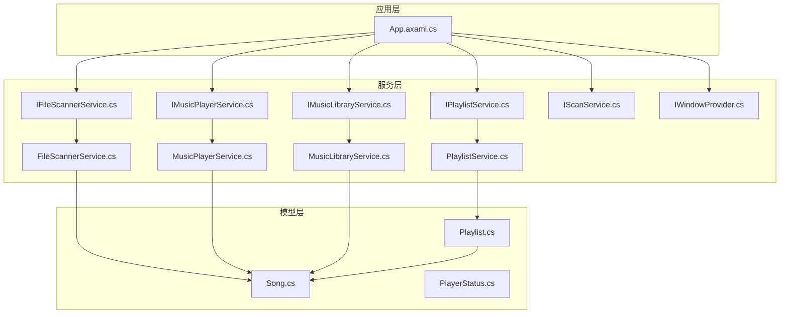
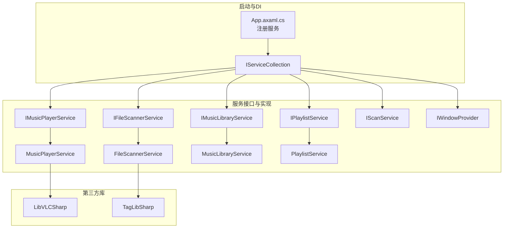
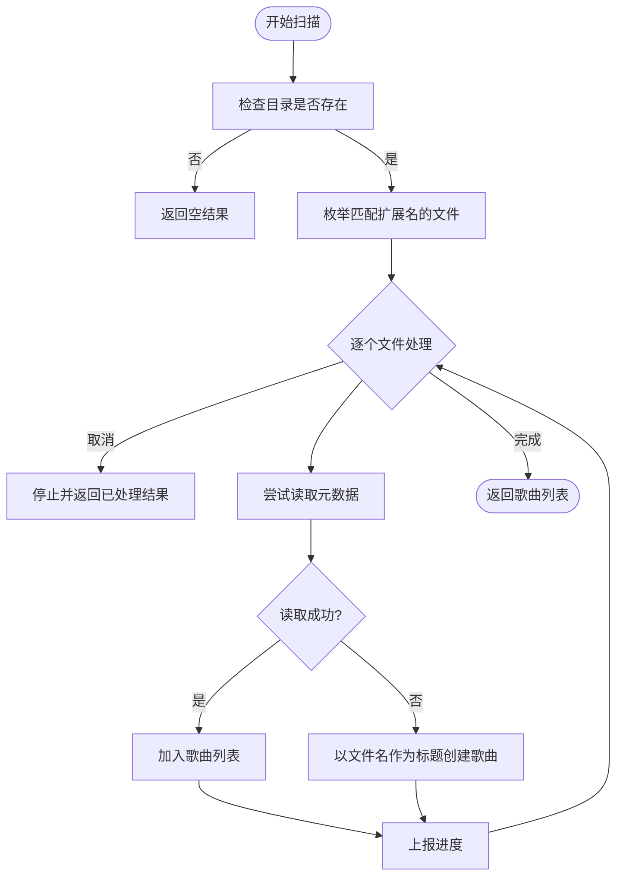
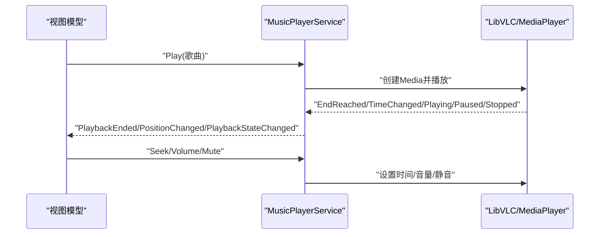
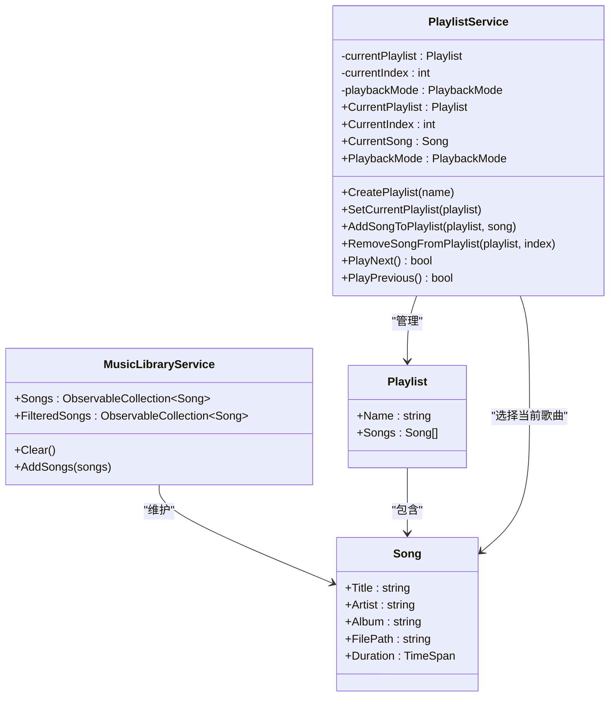
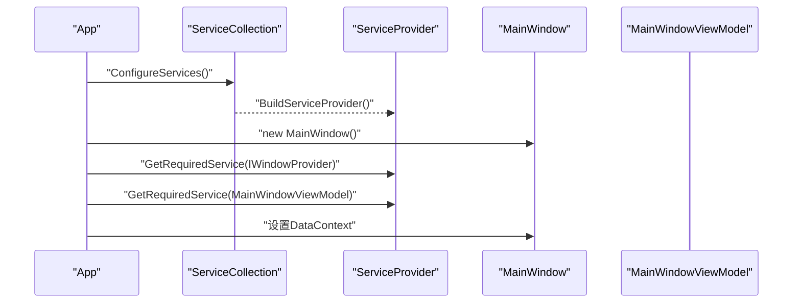
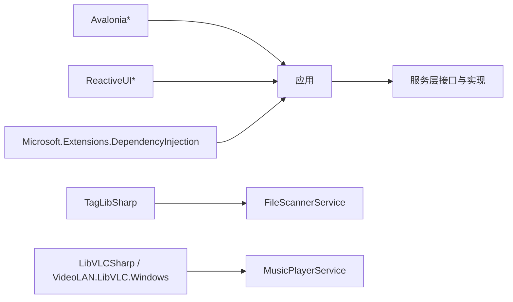

# 扩展开发与集成

<cite>
**本文引用的文件**
- [LocalMusicPlayer.csproj](file://LocalMusicPlayer.csproj)
- [App.axaml.cs](file://App.axaml.cs)
- [IFileScannerService.cs](file://Services/IFileScannerService.cs)
- [IMusicPlayerService.cs](file://Services/IMusicPlayerService.cs)
- [IMusicLibraryService.cs](file://Services/IMusicLibraryService.cs)
- [IPlaylistService.cs](file://Services/IPlaylistService.cs)
- [IScanService.cs](file://Services/IScanService.cs)
- [IWindowProvider.cs](file://Services/IWindowProvider.cs)
- [FileScannerService.cs](file://Services/FileScannerService.cs)
- [MusicPlayerService.cs](file://Services/MusicPlayerService.cs)
- [MusicLibraryService.cs](file://Services/MusicLibraryService.cs)
- [PlaylistService.cs](file://Services/PlaylistService.cs)
- [Song.cs](file://Models/Song.cs)
- [Playlist.cs](file://Models/Playlist.cs)
- [PlayerStatus.cs](file://Models/PlayerStatus.cs)
</cite>

## 目录
1. [简介](#简介)
2. [项目结构](#项目结构)
3. [核心组件](#核心组件)
4. [架构总览](#架构总览)
5. [详细组件分析](#详细组件分析)
6. [依赖关系分析](#依赖关系分析)
7. [性能考量](#性能考量)
8. [故障排查指南](#故障排查指南)
9. [结论](#结论)
10. [附录](#附录)

## 简介
本指南面向希望在LocalMusicPlayer项目上进行扩展开发与第三方集成的开发者。内容覆盖以下方面：
- 基于现有接口体系扩展新功能模块的方法与实现规范
- 第三方库（如LibVLC、TagLibSharp）的使用与升级策略
- 插件架构的设计思路与实现方案（含动态加载与配置管理）
- 音频格式扩展的可能性与实现路径
- UI组件扩展指导（自定义控件与主题定制）
- API扩展最佳实践与向后兼容性保障方法

## 项目结构
项目采用分层与按职责划分的组织方式：Models（数据模型）、Services（业务服务接口与实现）、ViewModels（MVVM视图模型）、Views（界面）、Styles（样式资源）、Converters/Behaviors/Helpers（辅助层）。依赖注入通过Microsoft.Extensions.DependencyInjection在应用启动时集中注册。

图表来源
- [App.axaml.cs:41-51](file://App.axaml.cs#L41-L51)
- [IFileScannerService.cs:9-16](file://Services/IFileScannerService.cs#L9-L16)
- [IMusicPlayerService.cs:6-27](file://Services/IMusicPlayerService.cs#L6-L27)
- [IMusicLibraryService.cs:7-13](file://Services/IMusicLibraryService.cs#L7-L13)
- [IPlaylistService.cs:7-21](file://Services/IPlaylistService.cs#L7-L21)
- [IScanService.cs:5-8](file://Services/IScanService.cs#L5-L8)
- [IWindowProvider.cs:5-8](file://Services/IWindowProvider.cs#L5-L8)
- [FileScannerService.cs:12-103](file://Services/FileScannerService.cs#L12-L103)
- [MusicPlayerService.cs:7-129](file://Services/MusicPlayerService.cs#L7-L129)
- [MusicLibraryService.cs:7-27](file://Services/MusicLibraryService.cs#L7-L27)
- [PlaylistService.cs:7-120](file://Services/PlaylistService.cs#L7-L120)
- [Song.cs:5-12](file://Models/Song.cs#L5-L12)
- [Playlist.cs:5-9](file://Models/Playlist.cs#L5-L9)
- [PlayerStatus.cs:5-14](file://Models/PlayerStatus.cs#L5-L14)

章节来源
- [LocalMusicPlayer.csproj:11-41](file://LocalMusicPlayer.csproj#L11-L41)
- [App.axaml.cs:41-51](file://App.axaml.cs#L41-L51)

## 核心组件
- 接口与实现概览
  - 文件扫描接口与实现：负责目录扫描与元数据读取，支持多种音频格式扩展点
  - 播放器接口与实现：封装LibVLC播放能力，提供播放控制、音量与位置事件
  - 媒体库接口与实现：维护歌曲集合与过滤集合
  - 播放列表接口与实现：管理当前播放列表、索引、播放模式与切歌逻辑
  - 扫描服务：协调扫描流程（可与扫描接口配合）
  - 窗口提供者：统一管理主窗口实例

- 数据模型
  - Song：标题、艺人、专辑、文件路径、时长
  - Playlist：名称与歌曲列表
  - PlayerStatus：播放状态、位置、时长、音量、静音、当前歌曲

章节来源
- [IFileScannerService.cs:9-16](file://Services/IFileScannerService.cs#L9-L16)
- [IMusicPlayerService.cs:6-27](file://Services/IMusicPlayerService.cs#L6-L27)
- [IMusicLibraryService.cs:7-13](file://Services/IMusicLibraryService.cs#L7-L13)
- [IPlaylistService.cs:7-21](file://Services/IPlaylistService.cs#L7-L21)
- [IScanService.cs:5-8](file://Services/IScanService.cs#L5-L8)
- [IWindowProvider.cs:5-8](file://Services/IWindowProvider.cs#L5-L8)
- [FileScannerService.cs:12-103](file://Services/FileScannerService.cs#L12-L103)
- [MusicPlayerService.cs:7-129](file://Services/MusicPlayerService.cs#L7-L129)
- [MusicLibraryService.cs:7-27](file://Services/MusicLibraryService.cs#L7-L27)
- [PlaylistService.cs:7-120](file://Services/PlaylistService.cs#L7-L120)
- [Song.cs:5-12](file://Models/Song.cs#L5-L12)
- [Playlist.cs:5-9](file://Models/Playlist.cs#L5-L9)
- [PlayerStatus.cs:5-14](file://Models/PlayerStatus.cs#L5-L14)

## 架构总览
应用通过依赖注入容器集中注册服务，启动时构建服务提供者，并将视图模型绑定到主窗口。LibVLC与TagLibSharp分别承担媒体播放与元数据读取职责。

图表来源
- [App.axaml.cs:41-51](file://App.axaml.cs#L41-L51)
- [LocalMusicPlayer.csproj:36-39](file://LocalMusicPlayer.csproj#L36-L39)

## 详细组件分析

### 文件扫描服务扩展（音频格式与元数据）
- 当前实现要点
  - 支持扩展名集合与目录遍历
  - 使用TagLibSharp读取元数据，失败时回退为文件名作为标题
  - 支持进度报告与取消令牌
- 扩展音频格式
  - 在支持集合中新增扩展名
  - 如需特殊解码或元数据处理，可在读取元数据处增加分支
- 元数据增强
  - 可扩展字段（如歌词、封面、流派）在TagLibSharp可用范围内进行读取与映射
- 并发与性能
  - 扫描过程在后台线程执行；建议对大目录启用分批处理与进度回调

图表来源
- [FileScannerService.cs:16-75](file://Services/FileScannerService.cs#L16-L75)
- [FileScannerService.cs:77-101](file://Services/FileScannerService.cs#L77-L101)

章节来源
- [FileScannerService.cs:12-103](file://Services/FileScannerService.cs#L12-L103)
- [IFileScannerService.cs:9-16](file://Services/IFileScannerService.cs#L9-L16)

### 播放器服务扩展（LibVLC与播放控制）
- 当前实现要点
  - 初始化LibVLC与MediaPlayer，订阅播放结束、时间变化、状态变化事件
  - 提供播放、暂停、恢复、停止、跳转、音量与静音控制
  - 位置、时长、播放状态、音量与静音状态属性
- 扩展方向
  - 增加均衡器、环绕声、音效插件等高级播放特性
  - 实现“上一首/下一首”切换逻辑（当前占位）
  - 事件驱动的状态机与播放队列管理
- 升级策略
  - 保持接口稳定，内部版本升级遵循语义化版本
  - 对外暴露的事件与属性保持向后兼容

图表来源
- [MusicPlayerService.cs:27-38](file://Services/MusicPlayerService.cs#L27-L38)
- [MusicPlayerService.cs:40-48](file://Services/MusicPlayerService.cs#L40-L48)
- [MusicPlayerService.cs:76-82](file://Services/MusicPlayerService.cs#L76-L82)
- [MusicPlayerService.cs:84-113](file://Services/MusicPlayerService.cs#L84-L113)

章节来源
- [MusicPlayerService.cs:7-129](file://Services/MusicPlayerService.cs#L7-L129)
- [IMusicPlayerService.cs:6-27](file://Services/IMusicPlayerService.cs#L6-L27)

### 媒体库与播放列表服务
- 媒体库
  - 维护原始与过滤后的歌曲集合，支持清空与批量添加
- 播放列表
  - 管理当前播放列表、索引、播放模式（顺序/随机/单曲循环/列表循环）
  - 切歌逻辑根据模式计算下一项或前一项索引
  - 事件通知当前歌曲变更与播放模式变更

图表来源
- [MusicLibraryService.cs:7-27](file://Services/MusicLibraryService.cs#L7-L27)
- [PlaylistService.cs:7-120](file://Services/PlaylistService.cs#L7-L120)
- [Playlist.cs:5-9](file://Models/Playlist.cs#L5-L9)
- [Song.cs:5-12](file://Models/Song.cs#L5-L12)

章节来源
- [MusicLibraryService.cs:7-27](file://Services/MusicLibraryService.cs#L7-L27)
- [PlaylistService.cs:7-120](file://Services/PlaylistService.cs#L7-L120)
- [IMusicLibraryService.cs:7-13](file://Services/IMusicLibraryService.cs#L7-L13)
- [IPlaylistService.cs:7-21](file://Services/IPlaylistService.cs#L7-L21)

### 依赖注入与启动流程
- 启动阶段
  - 注册窗口提供者、扫描服务、播放器服务、媒体库服务、播放列表服务与视图模型
  - 构建服务提供者，设置主窗口与视图模型上下文
- 扩展点
  - 新增服务时仅需在配置方法中注册对应接口与实现
  - 视图模型可通过构造函数注入所需服务

图表来源
- [App.axaml.cs:18-39](file://App.axaml.cs#L18-L39)
- [App.axaml.cs:41-51](file://App.axaml.cs#L41-L51)

章节来源
- [App.axaml.cs:18-51](file://App.axaml.cs#L18-L51)

## 依赖关系分析
- 外部依赖
  - Avalonia生态：UI框架、主题、字体与调试包
  - ReactiveUI：响应式UI与源生成器
  - TagLibSharp：音频元数据读取
  - LibVLCSharp与VideoLAN.LibVLC.Windows：跨平台媒体播放与本地解码库
  - Microsoft.Extensions.DependencyInjection：依赖注入
- 内部耦合
  - 服务层通过接口解耦，便于替换与测试
  - 播放器服务依赖LibVLC，文件扫描服务依赖TagLibSharp

图表来源
- [LocalMusicPlayer.csproj:22-41](file://LocalMusicPlayer.csproj#L22-L41)

章节来源
- [LocalMusicPlayer.csproj:22-41](file://LocalMusicPlayer.csproj#L22-L41)

## 性能考量
- 扫描阶段
  - 使用异步与进度回调，避免UI阻塞
  - 大目录建议分批处理与取消支持
- 播放阶段
  - 避免频繁调用音量/静音设置，合并更新
  - 时间变化事件频率较高，订阅方应做节流或去抖
- 内存与资源
  - 播放器与媒体对象需要显式释放，确保实现IDisposable
  - 列表操作尽量使用就地修改而非频繁重建集合

## 故障排查指南
- 播放异常
  - 检查LibVLC初始化与媒体URI有效性
  - 关注EndReached与Playing/Paused/Stopped事件是否正确触发
- 元数据缺失
  - 确认TagLibSharp可用且文件未损坏
  - 回退逻辑会以文件名作为标题，确认文件命名是否合理
- UI无响应
  - 确保扫描与播放操作在后台线程执行
  - 检查视图模型与服务的生命周期与注入

章节来源
- [MusicPlayerService.cs:27-38](file://Services/MusicPlayerService.cs#L27-L38)
- [FileScannerService.cs:77-101](file://Services/FileScannerService.cs#L77-L101)

## 结论
通过清晰的接口分层与依赖注入，LocalMusicPlayer具备良好的扩展性。围绕LibVLC与TagLibSharp的组合，可以在不破坏现有API的前提下逐步引入更丰富的播放能力与元数据处理。插件化与动态加载可在未来以服务注册与配置为中心进行演进，同时保持向后兼容。

## 附录

### 第三方库集成与升级策略
- LibVLC
  - 使用LibVLCSharp进行托管封装，VideoLAN.LibVLC.Windows提供本地解码库
  - 升级时先升级LibVLCSharp，再同步VideoLAN.LibVLC.Windows版本
  - 注意平台差异与运行时依赖，确保打包包含对应本地库
- TagLibSharp
  - 负责多格式元数据读取，升级时验证支持的音频格式与编码
  - 若新增格式，需在支持集合中补充扩展名并在读取逻辑中完善映射

章节来源
- [LocalMusicPlayer.csproj:36-39](file://LocalMusicPlayer.csproj#L36-L39)
- [FileScannerService.cs:14](file://Services/FileScannerService.cs#L14)
- [FileScannerService.cs:77-101](file://Services/FileScannerService.cs#L77-L101)

### 插件架构设计思路与实现方案
- 设计思路
  - 以接口为中心：定义插件契约（如IPlugin），通过服务注册发现
  - 配置管理：集中配置文件或注册表项，声明启用的插件与参数
  - 动态加载：利用Assembly加载机制与反射，延迟初始化插件
- 实现方案
  - 在启动阶段扫描插件目录，按约定加载实现
  - 将插件注册为服务，视图模型通过依赖注入使用
  - 插件间通信通过事件总线或共享服务实现

[本节为概念性指导，不直接分析具体文件，故不附“章节来源”]

### 音频格式扩展方法
- 在文件扫描服务中增加支持集合
- 如需特殊解码，确保对应本地解码库可用（如LibVLC支持范围）
- 对于非标准元数据，扩展读取逻辑并做好异常与回退处理

章节来源
- [FileScannerService.cs:14](file://Services/FileScannerService.cs#L14)
- [FileScannerService.cs:77-101](file://Services/FileScannerService.cs#L77-L101)

### UI组件扩展与主题定制
- 自定义控件
  - 基于Avalonia控件模板与样式进行扩展
  - 通过资源字典与样式合并实现复用
- 主题定制
  - 使用Fluent主题与自定义颜色/字体资源
  - 通过视图模型与绑定实现交互状态驱动的视觉反馈

章节来源
- [LocalMusicPlayer.csproj:22-26](file://LocalMusicPlayer.csproj#L22-L26)
- [Styles/Resources.axaml](file://Styles/Resources.axaml)

### API扩展最佳实践与向后兼容
- 接口演进
  - 新增方法时保持默认实现（接口默认实现或适配器模式）
  - 避免删除或重命名现有事件与属性
- 版本管理
  - 以语义化版本管理对外API，重大变更提升主版本号
  - 通过条件编译或特性开关提供过渡期兼容
- 测试与文档
  - 为新接口编写单元测试与集成测试
  - 更新API文档与迁移指南

[本节为通用实践指导，不直接分析具体文件，故不附“章节来源”]