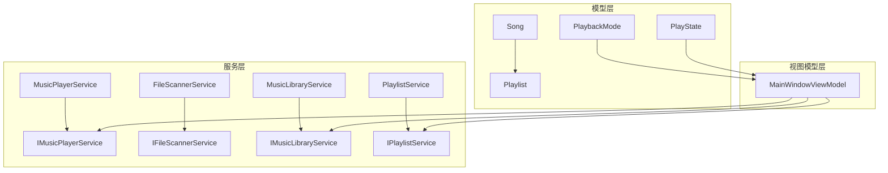
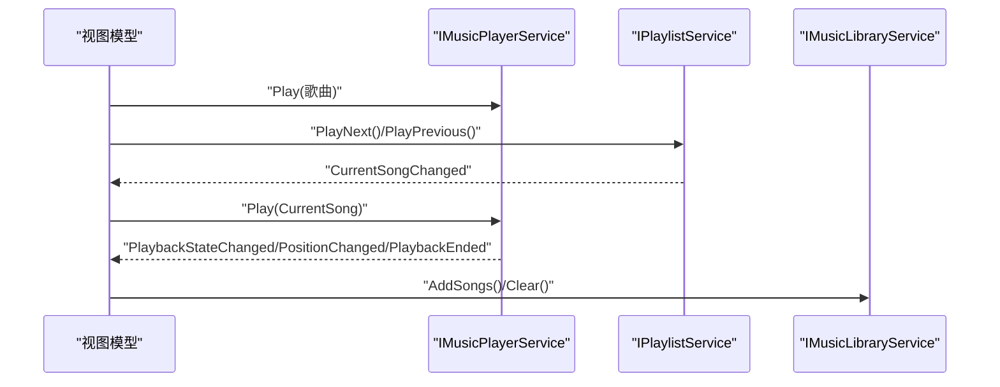
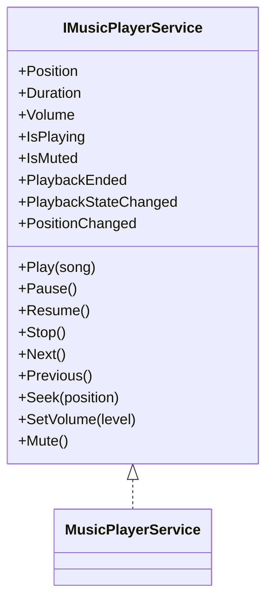
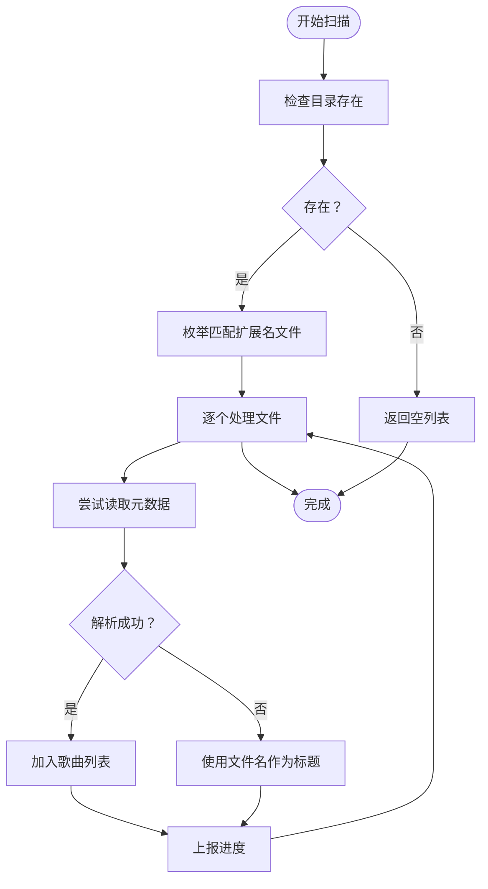
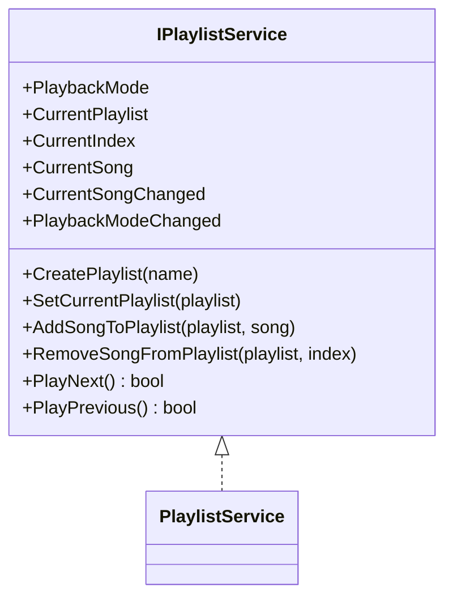
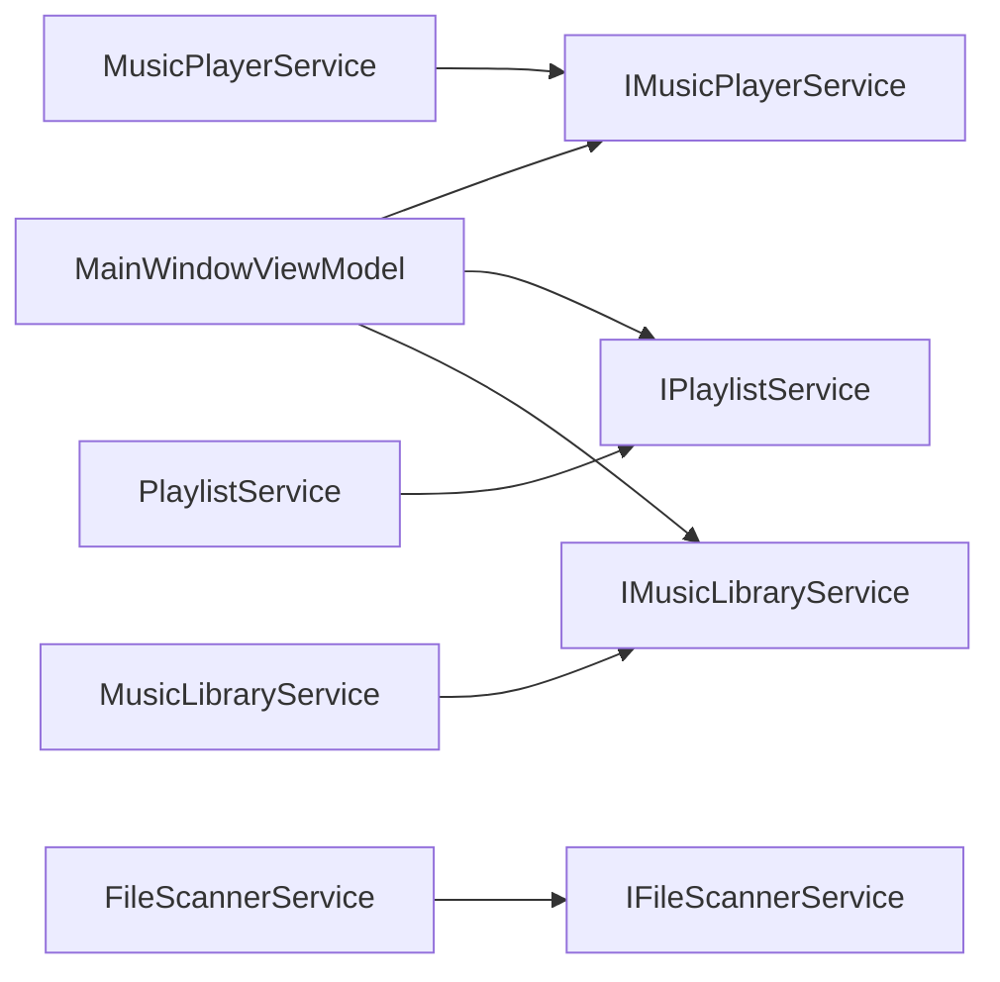

# 测试策略与实践

<cite>
**本文引用的文件**
- [IMusicPlayerService.cs](file://Services/IMusicPlayerService.cs)
- [MusicPlayerService.cs](file://Services/MusicPlayerService.cs)
- [IFileScannerService.cs](file://Services/IFileScannerService.cs)
- [FileScannerService.cs](file://Services/FileScannerService.cs)
- [IMusicLibraryService.cs](file://Services/IMusicLibraryService.cs)
- [MusicLibraryService.cs](file://Services/MusicLibraryService.cs)
- [IPlaylistService.cs](file://Services/IPlaylistService.cs)
- [PlaylistService.cs](file://Services/PlaylistService.cs)
- [Song.cs](file://Models/Song.cs)
- [Playlist.cs](file://Models/Playlist.cs)
- [PlayState.cs](file://Models/PlayState.cs)
- [PlaybackMode.cs](file://Models/PlaybackMode.cs)
- [MainWindowViewModel.cs](file://ViewModels/MainWindowViewModel.cs)
</cite>

## 目录
1. [引言](#引言)
2. [项目结构](#项目结构)
3. [核心组件](#核心组件)
4. [架构总览](#架构总览)
5. [详细组件分析](#详细组件分析)
6. [依赖关系分析](#依赖关系分析)
7. [性能考量](#性能考量)
8. [故障排查指南](#故障排查指南)
9. [结论](#结论)
10. [附录](#附录)

## 引言
本指南面向LocalMusicPlayer项目，构建一套完整的测试策略与实践方法，覆盖单元测试、接口测试、模拟对象与测试替身、集成测试（服务层与UI）、测试数据与环境准备、持续集成中的测试执行，以及性能与负载测试方法。文档以测试金字塔为主线，强调以单元测试为基础、接口测试为补充、集成测试为保障的质量体系。

## 项目结构
项目采用分层组织：Models定义领域模型；Services提供业务能力（播放、扫描、播放列表、库管理等）；ViewModels承载UI交互逻辑；Views绑定到ViewModels；Resources与Behaviors等提供样式与行为支持。测试应围绕上述层次进行分层设计与验证。

图表来源
- [Song.cs:1-13](file://Models/Song.cs#L1-L13)
- [Playlist.cs:1-10](file://Models/Playlist.cs#L1-L10)
- [PlayState.cs:1-9](file://Models/PlayState.cs#L1-L9)
- [PlaybackMode.cs:1-9](file://Models/PlaybackMode.cs#L1-L9)
- [IMusicPlayerService.cs:1-27](file://Services/IMusicPlayerService.cs#L1-L27)
- [MusicPlayerService.cs:1-129](file://Services/MusicPlayerService.cs#L1-L129)
- [IFileScannerService.cs:1-17](file://Services/IFileScannerService.cs#L1-L17)
- [FileScannerService.cs:1-103](file://Services/FileScannerService.cs#L1-L103)
- [IMusicLibraryService.cs:1-14](file://Services/IMusicLibraryService.cs#L1-L14)
- [MusicLibraryService.cs:1-27](file://Services/MusicLibraryService.cs#L1-L27)
- [IPlaylistService.cs:1-22](file://Services/IPlaylistService.cs#L1-L22)
- [PlaylistService.cs:1-120](file://Services/PlaylistService.cs#L1-L120)
- [MainWindowViewModel.cs:1-231](file://ViewModels/MainWindowViewModel.cs#L1-L231)

章节来源
- [MainWindowViewModel.cs:1-231](file://ViewModels/MainWindowViewModel.cs#L1-L231)
- [MusicPlayerService.cs:1-129](file://Services/MusicPlayerService.cs#L1-L129)
- [FileScannerService.cs:1-103](file://Services/FileScannerService.cs#L1-L103)
- [PlaylistService.cs:1-120](file://Services/PlaylistService.cs#L1-L120)
- [MusicLibraryService.cs:1-27](file://Services/MusicLibraryService.cs#L1-L27)

## 核心组件
- 播放器服务：负责播放控制、音量、静音、位置与时长查询，以及播放状态事件发布。
- 文件扫描服务：异步扫描目录，解析音频元数据，支持取消与进度上报。
- 播放列表服务：维护当前播放列表、索引、播放模式（顺序/随机/循环），并提供前进/后退逻辑。
- 音乐库服务：提供歌曲集合与过滤后的集合，支持清空与批量添加。
- 视图模型：协调播放器、播放列表与音乐库，处理UI交互命令与状态同步。

章节来源
- [IMusicPlayerService.cs:1-27](file://Services/IMusicPlayerService.cs#L1-L27)
- [MusicPlayerService.cs:1-129](file://Services/MusicPlayerService.cs#L1-L129)
- [IFileScannerService.cs:1-17](file://Services/IFileScannerService.cs#L1-L17)
- [FileScannerService.cs:1-103](file://Services/FileScannerService.cs#L1-L103)
- [IPlaylistService.cs:1-22](file://Services/IPlaylistService.cs#L1-L22)
- [PlaylistService.cs:1-120](file://Services/PlaylistService.cs#L1-L120)
- [IMusicLibraryService.cs:1-14](file://Services/IMusicLibraryService.cs#L1-L14)
- [MusicLibraryService.cs:1-27](file://Services/MusicLibraryService.cs#L1-L27)
- [MainWindowViewModel.cs:1-231](file://ViewModels/MainWindowViewModel.cs#L1-L231)

## 架构总览
下图展示从视图模型到服务层的关键调用链，以及事件驱动的状态传播路径。

图表来源
- [MainWindowViewModel.cs:140-216](file://ViewModels/MainWindowViewModel.cs#L140-L216)
- [IMusicPlayerService.cs:1-27](file://Services/IMusicPlayerService.cs#L1-L27)
- [IPlaylistService.cs:1-22](file://Services/IPlaylistService.cs#L1-L22)
- [IMusicLibraryService.cs:1-14](file://Services/IMusicLibraryService.cs#L1-L14)

## 详细组件分析

### 单元测试设计原则与测试金字塔
- 原则
  - 隔离性：通过接口与依赖注入隔离外部副作用（如LibVLC、文件系统）。
  - 可预测性：对输入输出与边界条件进行明确断言。
  - 可维护性：保持测试简洁，关注单一职责。
- 金字塔
  - 底层：单元测试（纯函数、值对象、业务规则）。
  - 中层：接口测试（验证接口契约与事件行为）。
  - 顶层：集成测试（跨服务协作、UI自动化）。

### 接口测试：IMusicPlayerService
- 关注点
  - 播放控制：Play/Pause/Resume/Stop/Seek/Next/Previous。
  - 状态查询：Position/Duration/Volume/IsPlaying/IsMuted。
  - 事件：PlaybackEnded、PlaybackStateChanged、PositionChanged。
- 设计要点
  - 使用测试替身实现IMusicPlayerService，模拟媒体播放器内部状态与事件。
  - 断言事件触发顺序与参数正确性。
  - 覆盖异常路径（如重复播放、越界Seek）。

图表来源
- [IMusicPlayerService.cs:1-27](file://Services/IMusicPlayerService.cs#L1-L27)
- [MusicPlayerService.cs:1-129](file://Services/MusicPlayerService.cs#L1-L129)

章节来源
- [IMusicPlayerService.cs:1-27](file://Services/IMusicPlayerService.cs#L1-L27)
- [MusicPlayerService.cs:1-129](file://Services/MusicPlayerService.cs#L1-L129)

### 接口测试：IFileScannerService
- 关注点
  - 扫描行为：支持子目录、扩展名过滤、进度上报、取消令牌。
  - 元数据解析：TagLib读取失败时回退到文件名作为标题。
- 设计要点
  - 使用测试替身返回预置文件列表，断言过滤与映射结果。
  - 模拟取消与进度回调，验证中断与报告时机。
  - 验证异常分支的健壮性与回退逻辑。

图表来源
- [IFileScannerService.cs:1-17](file://Services/IFileScannerService.cs#L1-L17)
- [FileScannerService.cs:1-103](file://Services/FileScannerService.cs#L1-L103)

章节来源
- [IFileScannerService.cs:1-17](file://Services/IFileScannerService.cs#L1-L17)
- [FileScannerService.cs:1-103](file://Services/FileScannerService.cs#L1-L103)

### 接口测试：IPlaylistService
- 关注点
  - 创建与设置：CreatePlaylist/SetCurrentPlaylist。
  - 歌曲管理：AddSongToPlaylist/RemoveSongFromPlaylist。
  - 播放控制：PlayNext/PlayPrevious，受PlaybackMode影响。
  - 事件：CurrentSongChanged/PlaybackModeChanged。
- 设计要点
  - 随机模式下PlayNext的随机性可通过固定种子或替换随机源进行可测性改造。
  - 循环模式的边界条件（首尾切换）需重点覆盖。
  - 当前索引与当前歌曲一致性校验。

图表来源
- [IPlaylistService.cs:1-22](file://Services/IPlaylistService.cs#L1-L22)
- [PlaylistService.cs:1-120](file://Services/PlaylistService.cs#L1-L120)

章节来源
- [IPlaylistService.cs:1-22](file://Services/IPlaylistService.cs#L1-L22)
- [PlaylistService.cs:1-120](file://Services/PlaylistService.cs#L1-L120)

### 接口测试：IMusicLibraryService
- 关注点
  - 集合管理：Songs/FilteredSongs、Clear、AddSongs。
  - 过滤逻辑：MainWindowViewModel中的FilterSongs。
- 设计要点
  - AddSongs后FilteredSongs应同步更新。
  - 清空后集合为空且过滤结果为空。

章节来源
- [IMusicLibraryService.cs:1-14](file://Services/IMusicLibraryService.cs#L1-L14)
- [MusicLibraryService.cs:1-27](file://Services/MusicLibraryService.cs#L1-L27)
- [MainWindowViewModel.cs:218-229](file://ViewModels/MainWindowViewModel.cs#L218-L229)

### 模拟对象与测试替身
- LibVLC播放器模拟
  - 通过IMusicPlayerService的测试替身，模拟媒体播放器内部状态（播放中/暂停/停止）、时间轴、音量与事件。
  - 对Seek/Volume/Mute等方法进行行为验证。
- 文件系统模拟
  - 使用内存文件系统或自定义I/O替身，提供可控的文件列表与元数据读取。
  - 支持取消与进度回调的注入，便于断言。
- 依赖注入与接口隔离
  - 在构造函数中注入接口，避免直接依赖具体实现，便于替换为测试替身。

章节来源
- [IMusicPlayerService.cs:1-27](file://Services/IMusicPlayerService.cs#L1-L27)
- [MusicPlayerService.cs:1-129](file://Services/MusicPlayerService.cs#L1-L129)
- [IFileScannerService.cs:1-17](file://Services/IFileScannerService.cs#L1-L17)
- [FileScannerService.cs:1-103](file://Services/FileScannerService.cs#L1-L103)

### 集成测试策略
- 服务层测试
  - 组合多个服务（播放器、播放列表、库）验证端到端流程（扫描→入库→播放→切歌→事件）。
  - 使用轻量级替身替代真实LibVLC与文件系统，确保测试稳定与可重复。
- UI测试（自动化）
  - 使用自动化框架（如基于Avalonia的UI测试工具）对MainWindowViewModel的关键命令与状态变更进行验证。
  - 覆盖搜索过滤、播放控制、静音切换、播放模式切换等场景。
  - 通过事件订阅验证状态同步（位置、时长、播放状态）。

章节来源
- [MainWindowViewModel.cs:108-216](file://ViewModels/MainWindowViewModel.cs#L108-L216)
- [MusicPlayerService.cs:1-129](file://Services/MusicPlayerService.cs#L1-L129)
- [PlaylistService.cs:1-120](file://Services/PlaylistService.cs#L1-L120)
- [MusicLibraryService.cs:1-27](file://Services/MusicLibraryService.cs#L1-L27)

### 测试数据准备与环境配置
- 测试数据
  - 使用最小化、可复现的Song样本，包含FilePath、Title、Artist、Album、Duration。
  - 为扫描测试准备不同扩展名与无元数据的音频文件。
- 环境配置
  - 确保测试运行时不加载真实LibVLC，使用测试替身。
  - 在CI环境中禁用需要真实硬件的测试，或使用虚拟显示设备。
  - 为文件扫描测试准备临时目录与权限。

章节来源
- [Song.cs:1-13](file://Models/Song.cs#L1-L13)
- [FileScannerService.cs:1-103](file://Services/FileScannerService.cs#L1-L103)

### 持续集成中的测试执行
- 分层执行
  - PR检查：优先运行单元测试与接口测试，快速反馈。
  - 主干合并：增加集成测试与UI测试，确保端到端质量。
- 并行与缓存
  - 将不依赖共享资源的测试并行执行。
  - 缓存测试依赖（如测试数据集），减少CI时间。
- 失败恢复
  - 对不稳定测试（网络/文件系统）启用重试与超时控制。

## 依赖关系分析
- 视图模型依赖服务接口，通过构造函数注入，降低耦合度，便于测试替身替换。
- 播放器服务依赖LibVLC，需通过接口隔离或抽象化以支持测试。
- 扫描服务依赖文件系统与TagLib，建议通过抽象接口或可替换的工厂模式提升可测试性。

图表来源
- [MainWindowViewModel.cs:120-131](file://ViewModels/MainWindowViewModel.cs#L120-L131)
- [MusicPlayerService.cs:1-129](file://Services/MusicPlayerService.cs#L1-L129)
- [FileScannerService.cs:1-103](file://Services/FileScannerService.cs#L1-L103)
- [PlaylistService.cs:1-120](file://Services/PlaylistService.cs#L1-L120)
- [MusicLibraryService.cs:1-27](file://Services/MusicLibraryService.cs#L1-L27)

章节来源
- [MainWindowViewModel.cs:120-131](file://ViewModels/MainWindowViewModel.cs#L120-L131)
- [MusicPlayerService.cs:1-129](file://Services/MusicPlayerService.cs#L1-L129)
- [FileScannerService.cs:1-103](file://Services/FileScannerService.cs#L1-L103)
- [PlaylistService.cs:1-120](file://Services/PlaylistService.cs#L1-L120)
- [MusicLibraryService.cs:1-27](file://Services/MusicLibraryService.cs#L1-L27)

## 性能考量
- 单元测试
  - 避免任何I/O与外部依赖，保证测试快速稳定。
- 接口测试
  - 对耗时操作（如Seek、进度上报）进行时间与频率断言。
- 集成测试
  - 控制测试数据规模，避免真实音频文件过大影响性能。
  - 使用替身模拟慢速I/O，集中验证算法正确性而非性能。
- 负载测试
  - 构造大规模播放列表与库，验证PlayNext/PlayPrevious在循环与随机模式下的响应时间。
  - 模拟高并发事件（频繁Seek/切换歌曲）下的稳定性。

## 故障排查指南
- 播放器事件未触发
  - 检查测试替身是否正确发布PlaybackStateChanged/PositionChanged/PlaybackEnded。
  - 确认事件订阅与断言时机（如定时轮询位置）。
- 扫描异常
  - 验证取消令牌传递与进度回调时机。
  - 确认元数据读取失败时的回退逻辑。
- 播放列表越界
  - 核对PlayNext/PlayPrevious在不同PlaybackMode下的边界处理。
  - 固定随机种子或替换随机源以保证可重复性。
- UI状态不一致
  - 检查主线程调度与状态同步（如Rx定时器）。
  - 确认命令与属性变更通知的正确性。

章节来源
- [MusicPlayerService.cs:33-37](file://Services/MusicPlayerService.cs#L33-L37)
- [FileScannerService.cs:49-72](file://Services/FileScannerService.cs#L49-L72)
- [PlaylistService.cs:69-119](file://Services/PlaylistService.cs#L69-L119)
- [MainWindowViewModel.cs:209-215](file://ViewModels/MainWindowViewModel.cs#L209-L215)

## 结论
通过测试金字塔分层设计，结合接口测试、模拟对象与测试替身、服务层与UI集成测试，以及完善的测试数据与环境准备，LocalMusicPlayer可以在开发周期内持续获得高质量反馈。建议在CI中分层执行测试，并针对性能与负载进行专项验证，确保系统在复杂场景下的稳定性与用户体验。

## 附录
- 测试清单
  - 播放器：播放控制、音量/静音、Seek、事件发布。
  - 扫描器：扩展名过滤、进度与取消、元数据回退。
  - 播放列表：创建/设置、增删改、PlayNext/PlayPrevious、播放模式。
  - 库管理：清空、批量添加、过滤逻辑。
  - 视图模型：命令执行、状态同步、搜索过滤。
- 推荐工具
  - 单元测试：xUnit/NUnit。
  - 模拟：Moq/NSubstitute。
  - UI测试：Avalonia UI测试框架或对应自动化工具。
  - 性能：BenchmarkDotNet（基准）、压力测试工具（如JMeter/Artillery）。