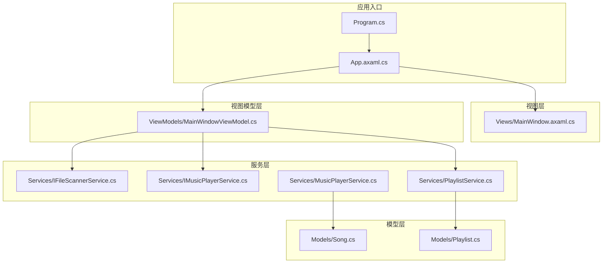
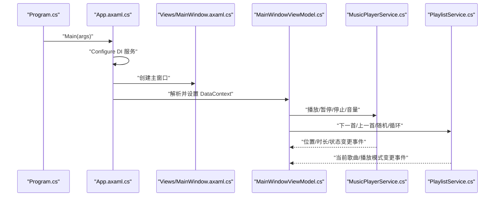
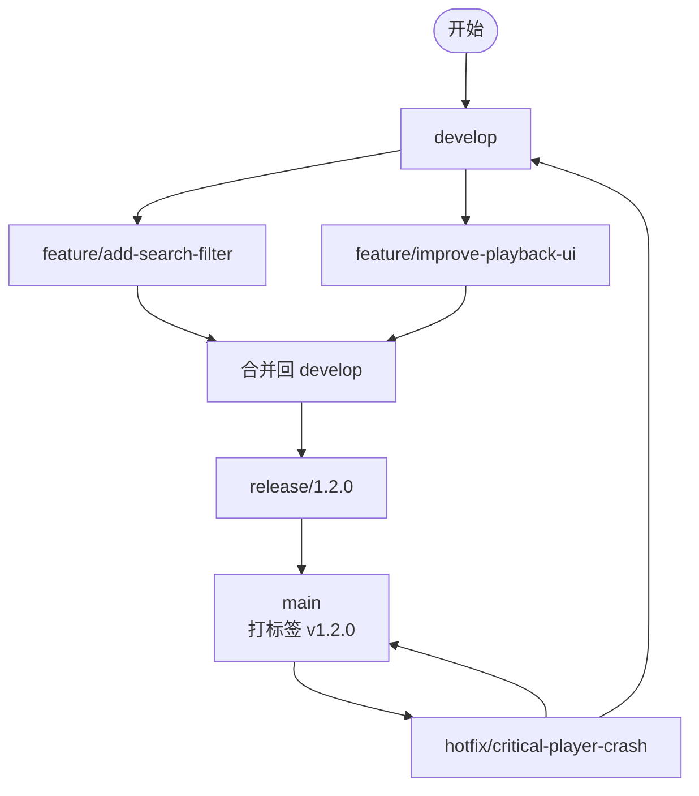
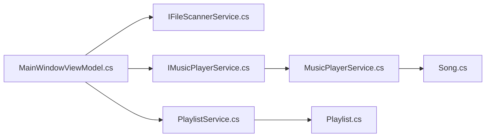

# 版本控制与协作

<cite>
**本文引用的文件**
- [.gitignore](file://.gitignore)
- [LocalMusicPlayer.csproj](file://LocalMusicPlayer.csproj)
- [Program.cs](file://Program.cs)
- [App.axaml.cs](file://App.axaml.cs)
- [docs/PRD.md](file://docs/PRD.md)
- [Services/IFileScannerService.cs](file://Services/IFileScannerService.cs)
- [Services/IMusicPlayerService.cs](file://Services/IMusicPlayerService.cs)
- [Services/MusicPlayerService.cs](file://Services/MusicPlayerService.cs)
- [Services/PlaylistService.cs](file://Services/PlaylistService.cs)
- [ViewModels/MainWindowViewModel.cs](file://ViewModels/MainWindowViewModel.cs)
- [Views/MainWindow.axaml.cs](file://Views/MainWindow.axaml.cs)
- [Models/Song.cs](file://Models/Song.cs)
- [Models/Playlist.cs](file://Models/Playlist.cs)
</cite>

## 目录
1. [引言](#引言)
2. [项目结构](#项目结构)
3. [核心组件](#核心组件)
4. [架构总览](#架构总览)
5. [详细组件分析](#详细组件分析)
6. [依赖分析](#依赖分析)
7. [性能考虑](#性能考虑)
8. [故障排查指南](#故障排查指南)
9. [结论](#结论)
10. [附录](#附录)

## 引言
本指南面向LocalMusicPlayer项目的版本控制与团队协作最佳实践，结合当前仓库现状与项目技术栈，提供可落地的Git工作流、分支策略、提交信息规范、代码审查标准、冲突解决策略、CI/CD建议以及版本标签与发布流程。文档同时给出与源码实现相契合的架构图与流程图，帮助不同背景的成员快速理解并执行。

## 项目结构
LocalMusicPlayer采用C#与Avalonia MVVM架构，核心模块围绕“服务层-模型-视图模型-视图”分层组织，构建于.NET 9之上，并通过DI容器在应用启动阶段完成服务注册与页面绑定。项目当前未包含CI/CD配置文件或版本标签历史，因此本指南将从零开始设计标准化流程与实践。

图表来源
- [Program.cs:1-20](file://Program.cs#L1-L20)
- [App.axaml.cs:18-52](file://App.axaml.cs#L18-L52)
- [ViewModels/MainWindowViewModel.cs:120-216](file://ViewModels/MainWindowViewModel.cs#L120-L216)
- [Services/MusicPlayerService.cs:7-38](file://Services/MusicPlayerService.cs#L7-L38)
- [Services/PlaylistService.cs:7-34](file://Services/PlaylistService.cs#L7-L34)
- [Models/Song.cs:5-12](file://Models/Song.cs#L5-L12)
- [Models/Playlist.cs:5-9](file://Models/Playlist.cs#L5-L9)

章节来源
- [Program.cs:1-20](file://Program.cs#L1-L20)
- [App.axaml.cs:18-52](file://App.axaml.cs#L18-L52)
- [LocalMusicPlayer.csproj:11-19](file://LocalMusicPlayer.csproj#L11-L19)

## 核心组件
- 应用入口与生命周期：程序入口负责构建Avalonia应用并启动经典桌面生命周期；应用初始化阶段完成DI容器装配与主窗体绑定。
- 视图与视图模型：主窗口视图承载UI，视图模型负责播放控制、播放列表交互、搜索过滤与状态同步。
- 服务层：播放服务封装LibVLC播放能力，播放列表服务管理播放模式与索引切换，文件扫描服务定义异步扫描接口。
- 模型层：Song与Playlist作为不可变属性的数据载体，支撑UI渲染与业务逻辑。

章节来源
- [Program.cs:10-20](file://Program.cs#L10-L20)
- [App.axaml.cs:22-51](file://App.axaml.cs#L22-L51)
- [ViewModels/MainWindowViewModel.cs:120-216](file://ViewModels/MainWindowViewModel.cs#L120-L216)
- [Services/IMusicPlayerService.cs:6-27](file://Services/IMusicPlayerService.cs#L6-L27)
- [Services/MusicPlayerService.cs:7-38](file://Services/MusicPlayerService.cs#L7-L38)
- [Services/PlaylistService.cs:7-34](file://Services/PlaylistService.cs#L7-L34)
- [Models/Song.cs:5-12](file://Models/Song.cs#L5-L12)
- [Models/Playlist.cs:5-9](file://Models/Playlist.cs#L5-L9)

## 架构总览
下图展示从应用启动到播放控制的关键调用链，体现MVVM与服务注入的解耦关系。

图表来源
- [Program.cs:11-20](file://Program.cs#L11-L20)
- [App.axaml.cs:22-51](file://App.axaml.cs#L22-L51)
- [ViewModels/MainWindowViewModel.cs:141-205](file://ViewModels/MainWindowViewModel.cs#L141-L205)
- [Services/MusicPlayerService.cs:40-118](file://Services/MusicPlayerService.cs#L40-L118)
- [Services/PlaylistService.cs:69-119](file://Services/PlaylistService.cs#L69-L119)

## 详细组件分析

### 分支策略与Git工作流（基于Git Flow）
- 主分支
  - main：稳定可发布版本，每次发布打标签并合并release分支。
  - develop：集成开发分支，日常feature合并的目标分支。
- 功能分支
  - feature/*：从develop切出，完成评审后合并回develop。
  - 示例：feature/add-search-filter、feature/improve-playback-ui。
- 预发布分支
  - release/*：从develop切出，进行最终测试与小修复，完成后合并至main并打标签。
  - 示例：release/1.2.0。
- 热修复分支
  - hotfix/*：从main切出，紧急修复线上问题，完成后同时合并回main与develop。
  - 示例：hotfix/critical-player-crash。

章节来源
- [ViewModels/MainWindowViewModel.cs:218-229](file://ViewModels/MainWindowViewModel.cs#L218-L229)
- [Services/IMusicPlayerService.cs:6-27](file://Services/IMusicPlayerService.cs#L6-L27)
- [Services/MusicPlayerService.cs:40-118](file://Services/MusicPlayerService.cs#L40-L118)

### 提交信息规范
- 类型
  - feat：新增功能（如搜索过滤、播放模式切换）。
  - fix：修复缺陷（如播放器崩溃、UI闪烁）。
  - refactor：重构（不改变行为，提升可维护性）。
  - docs：仅文档更新。
  - test：新增或调整测试。
  - chore：构建流程、依赖更新等。
- 格式
  - type(scope): subject
  - body（可选）：详细说明动机与影响范围。
  - footer（可选）：关联Issue或破坏性变更说明。
- 示例
  - feat(player): 增加随机播放模式
  - fix(viewmodel): 修复搜索导致的内存泄漏
  - refactor(services): 将播放状态事件抽象为接口

### 合并策略
- Pull Request/合并请求
  - 必须有至少一名审查者批准。
  - CI必须全部通过。
  - 合并前需squash或rebase以保持提交历史整洁。
- 合并到main
  - 仅允许从release分支合并，且要求打标签与发布说明。

### 代码审查标准与检查清单
- 代码质量
  - 是否遵循单一职责与接口隔离（如服务接口与实现分离）。
  - 是否存在重复代码与过长函数。
  - 是否使用异步编程避免阻塞UI线程（如扫描与播放控制）。
- 安全性
  - 文件路径输入校验与转义，防止目录穿越。
  - 外部资源加载（LibVLC媒体）的URI合法性验证。
- 可测试性
  - 服务是否可通过接口注入，便于单元测试。
  - 是否提供必要的事件与状态查询接口。
- 文档与注释
  - 关键算法与边界条件是否有注释说明。
  - 接口与公共方法是否具备清晰的契约描述。

章节来源
- [Services/IFileScannerService.cs:9-16](file://Services/IFileScannerService.cs#L9-L16)
- [Services/IMusicPlayerService.cs:6-27](file://Services/IMusicPlayerService.cs#L6-L27)
- [Services/MusicPlayerService.cs:27-38](file://Services/MusicPlayerService.cs#L27-L38)
- [ViewModels/MainWindowViewModel.cs:141-205](file://ViewModels/MainWindowViewModel.cs#L141-L205)

### 分支管理最佳实践
- feature分支
  - 从develop切出，命名语义化，任务驱动，及时同步上游。
  - 完成后通过PR合并回develop，删除已合并分支。
- release分支
  - 在发布前从develop切出，集中修复回归问题，关闭相关issue。
  - 合并回main并打标签，再合并回develop以同步补丁。
- hotfix分支
  - 从main切出，修复后同时合并回main与develop，确保两分支一致。

### 冲突解决策略与合并冲突处理
- 预防
  - 频繁rebase同步上游，减少大范围长期分支。
  - 小步提交，明确提交信息，降低冲突粒度。
- 发生冲突
  - 使用工具逐个定位冲突块，结合上下文与设计意图决定保留方案。
  - 对UI与样式冲突优先统一命名与布局策略；对业务逻辑冲突优先保证数据一致性与事件顺序。
- 回滚与重试
  - 若冲突复杂，可临时提交中间态，邀请多人协同解决后再清理历史。

### 持续集成与持续部署（CI/CD）配置示例
说明：仓库中暂无CI/CD配置文件，以下为建议模板内容（以文本形式呈现，非仓库文件），请根据团队使用的CI平台（如GitHub Actions、Azure Pipelines、GitLab CI等）进行适配。
- 触发条件
  - push到feature/*、release/*、hotfix/*触发构建与测试。
  - push到main触发构建、测试、打包与发布。
- 步骤
  - 恢复NuGet包
  - 还原SDK与工具链
  - 编译（Debug/Release）
  - 运行单元测试
  - 扫描安全漏洞与依赖风险
  - 生成安装包（Windows/macOS/Linux）
  - 上传制品与日志
- 发布
  - main分支打标签并触发发布流程
  - 自动发布到应用商店或下载站

### 版本标签管理与发布流程
- 标签规范
  - 采用语义化版本：vMAJOR.MINOR.PATCH
  - 为每个正式版本打标签并附带发布说明
- 发布流程
  - 在release分支完成最终测试后合并至main并打标签
  - 同步合并至develop以保留补丁
  - 生成各平台安装包并上传发布

## 依赖分析
- 组件耦合
  - 视图模型依赖服务接口，降低对具体实现的耦合。
  - 播放服务与LibVLC强相关，应通过接口隔离以便替换或模拟。
- 外部依赖
  - Avalonia、LibVLCSharp、TagLibSharp等通过NuGet管理，建议锁定版本并在项目文件中显式声明。
- 平台与清单
  - 应用清单用于Win32环境配置，需随发布流程一并交付。

图表来源
- [ViewModels/MainWindowViewModel.cs:120-136](file://ViewModels/MainWindowViewModel.cs#L120-L136)
- [Services/IMusicPlayerService.cs:6-27](file://Services/IMusicPlayerService.cs#L6-L27)
- [Services/MusicPlayerService.cs:7-38](file://Services/MusicPlayerService.cs#L7-L38)
- [Services/PlaylistService.cs:7-34](file://Services/PlaylistService.cs#L7-L34)
- [Models/Song.cs:5-12](file://Models/Song.cs#L5-L12)
- [Models/Playlist.cs:5-9](file://Models/Playlist.cs#L5-L9)

章节来源
- [LocalMusicPlayer.csproj:21-41](file://LocalMusicPlayer.csproj#L21-L41)
- [App.axaml.cs:41-51](file://App.axaml.cs#L41-L51)

## 性能考虑
- UI线程与后台任务
  - 避免在UI线程执行耗时操作（如文件扫描、媒体加载），使用异步API与进度回调。
- 播放性能
  - 播放状态与位置更新频率应适度（如每500ms一次），避免过度订阅造成卡顿。
- 资源释放
  - 播放器实例与媒体对象应在合适时机释放，防止内存泄漏。

章节来源
- [ViewModels/MainWindowViewModel.cs:209-215](file://ViewModels/MainWindowViewModel.cs#L209-L215)
- [Services/MusicPlayerService.cs:120-129](file://Services/MusicPlayerService.cs#L120-L129)

## 故障排查指南
- 启动失败
  - 检查应用清单与平台检测配置，确认运行时与依赖已正确安装。
- 播放异常
  - 确认媒体文件路径有效且可访问；检查LibVLC初始化与媒体对象创建。
- 播放列表错乱
  - 核对播放模式切换逻辑与索引边界，确保在循环与随机模式下的索引计算正确。
- 搜索无响应
  - 检查搜索命令绑定与过滤逻辑，确认FilteredSongs集合更新在主线程调度。

章节来源
- [Program.cs:14-20](file://Program.cs#L14-L20)
- [Services/MusicPlayerService.cs:27-38](file://Services/MusicPlayerService.cs#L27-L38)
- [Services/PlaylistService.cs:69-119](file://Services/PlaylistService.cs#L69-L119)
- [ViewModels/MainWindowViewModel.cs:218-229](file://ViewModels/MainWindowViewModel.cs#L218-L229)

## 结论
通过引入标准化的Git工作流、严格的代码审查与冲突解决机制、完善的CI/CD与版本标签管理，LocalMusicPlayer项目可在保证质量的同时提升交付效率与可维护性。建议团队在现有MVVM与服务注入基础上，进一步强化接口抽象与测试覆盖，确保变更可追踪、可回滚、可发布。

## 附录
- 项目概览与需求
  - PRD文档明确了技术栈、核心功能与非功能性需求，是制定版本控制与发布策略的重要依据。

章节来源
- [docs/PRD.md:1-51](file://docs/PRD.md#L1-L51)