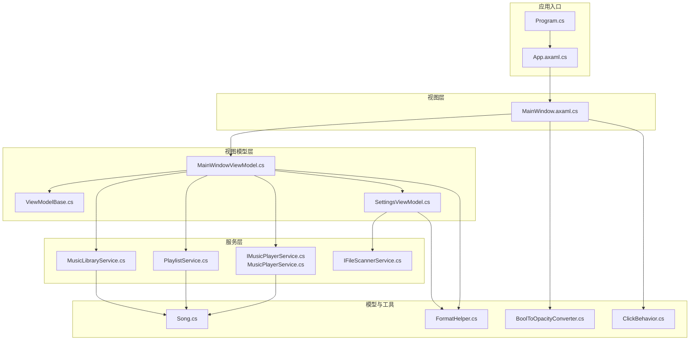
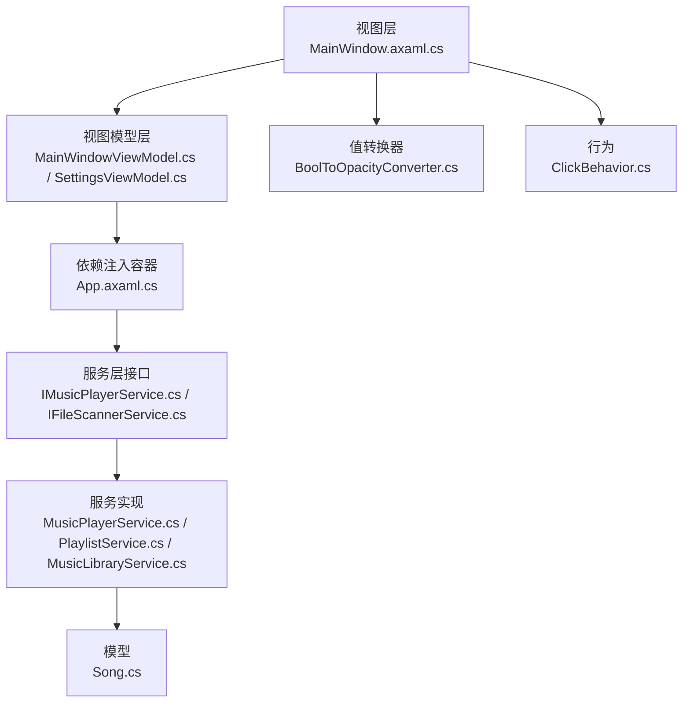
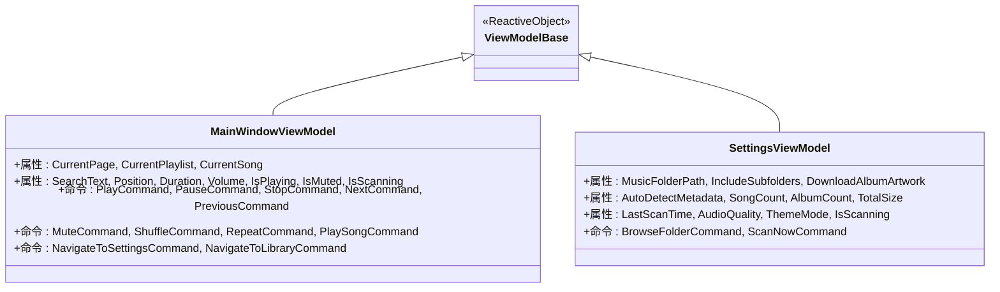
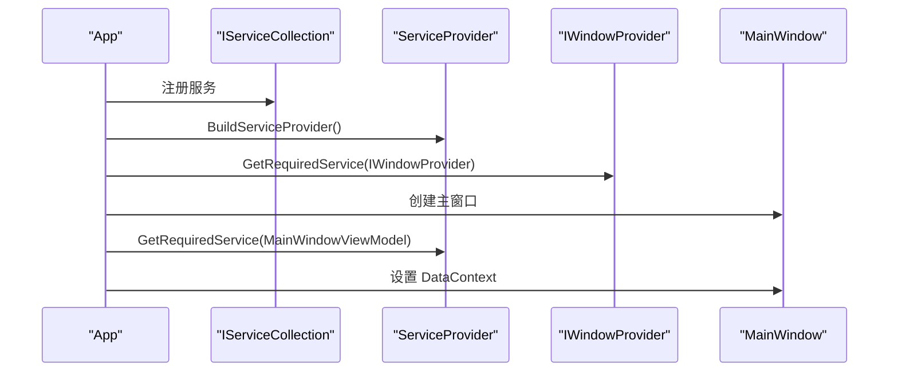
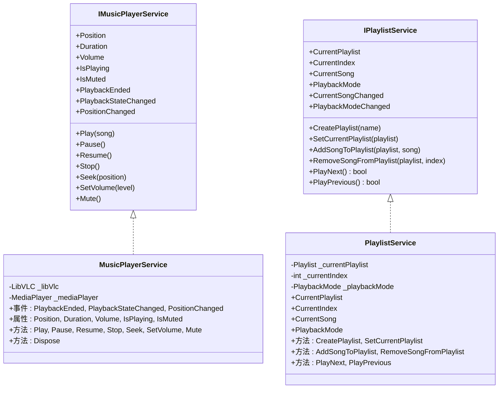
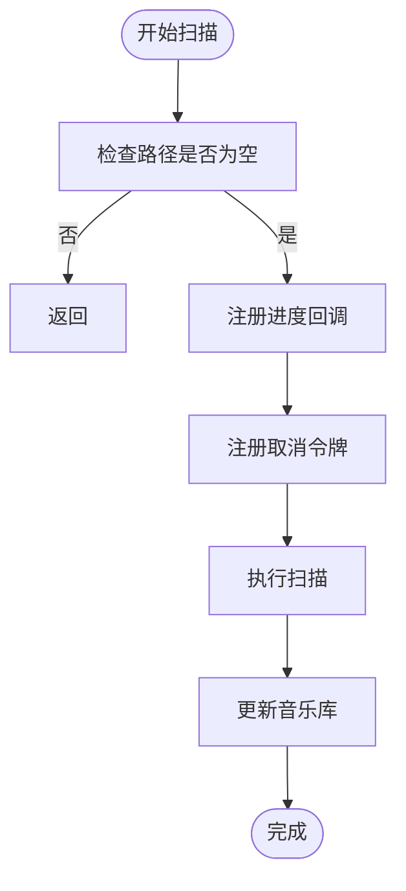
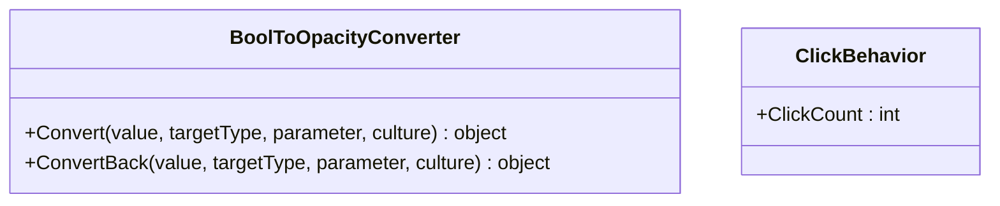
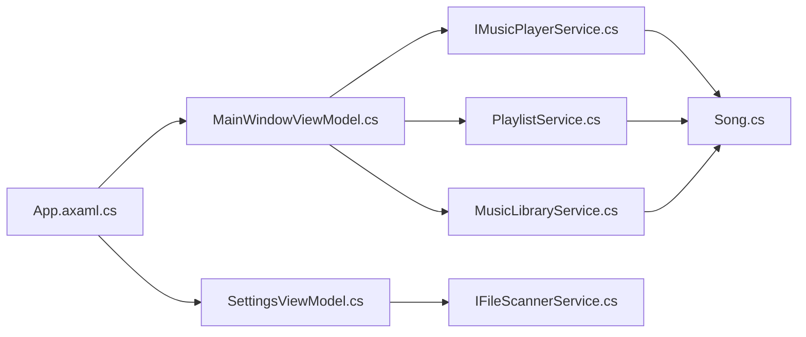

# 编码规范与最佳实践

<cite>
**本文引用的文件**
- [Program.cs](file://Program.cs)
- [App.axaml.cs](file://App.axaml.cs)
- [ViewModelBase.cs](file://ViewModels/ViewModelBase.cs)
- [MainWindowViewModel.cs](file://ViewModels/MainWindowViewModel.cs)
- [SettingsViewModel.cs](file://ViewModels/SettingsViewModel.cs)
- [IFileScannerService.cs](file://Services/IFileScannerService.cs)
- [IMusicPlayerService.cs](file://Services/IMusicPlayerService.cs)
- [MusicPlayerService.cs](file://Services/MusicPlayerService.cs)
- [PlaylistService.cs](file://Services/PlaylistService.cs)
- [MusicLibraryService.cs](file://Services/MusicLibraryService.cs)
- [Song.cs](file://Models/Song.cs)
- [ClickBehavior.cs](file://Behaviors/ClickBehavior.cs)
- [BoolToOpacityConverter.cs](file://Converters/BoolToOpacityConverter.cs)
- [FormatHelper.cs](file://Helpers/FormatHelper.cs)
- [MainWindow.axaml.cs](file://Views/MainWindow.axaml.cs)
</cite>

## 目录
1. 引言
2. 项目结构
3. 核心组件
4. 架构总览
5. 详细组件分析
6. 依赖关系分析
7. 性能考虑
8. 故障排查指南
9. 结论
10. 附录

## 引言
本指南面向LocalMusicPlayer项目，系统性制定C#编码规范与最佳实践，覆盖命名约定、代码格式化、注释标准；明确MVVM模式实现规范（ViewModel基类、命令绑定、数据绑定）；给出接口设计与依赖注入使用建议；统一错误处理、异常管理与日志记录策略；并总结重构与可维护性提升的最佳实践。文档中的具体实现细节均以仓库现有代码为依据。

## 项目结构
项目采用分层与功能域结合的组织方式：
- Models：领域模型（如歌曲信息）
- Services：服务接口与实现（播放、扫描、库、播放列表等）
- ViewModels：响应式ViewModel（MVVM）
- Views：界面控件与窗口
- Behaviors：自定义行为
- Converters：值转换器
- Helpers：通用工具
- 入口与应用配置：Program.cs、App.axaml.cs

图表来源
- [Program.cs:1-20](file://Program.cs#L1-L20)
- [App.axaml.cs:18-52](file://App.axaml.cs#L18-L52)
- [MainWindow.axaml.cs:5-11](file://Views/MainWindow.axaml.cs#L5-L11)
- [ViewModelBase.cs:5-7](file://ViewModels/ViewModelBase.cs#L5-L7)
- [MainWindowViewModel.cs:11-216](file://ViewModels/MainWindowViewModel.cs#L11-L216)
- [SettingsViewModel.cs:10-146](file://ViewModels/SettingsViewModel.cs#L10-L146)
- [IMusicPlayerService.cs:6-27](file://Services/IMusicPlayerService.cs#L6-L27)
- [MusicPlayerService.cs:7-129](file://Services/MusicPlayerService.cs#L7-L129)
- [PlaylistService.cs:7-120](file://Services/PlaylistService.cs#L7-L120)
- [MusicLibraryService.cs:7-27](file://Services/MusicLibraryService.cs#L7-L27)
- [Song.cs:5-13](file://Models/Song.cs#L5-L13)
- [FormatHelper.cs:5-28](file://Helpers/FormatHelper.cs#L5-L28)
- [BoolToOpacityConverter.cs:7-21](file://Converters/BoolToOpacityConverter.cs#L7-L21)
- [ClickBehavior.cs:6-17](file://Behaviors/ClickBehavior.cs#L6-L17)

章节来源
- [Program.cs:1-20](file://Program.cs#L1-L20)
- [App.axaml.cs:18-52](file://App.axaml.cs#L18-L52)
- [MainWindow.axaml.cs:5-11](file://Views/MainWindow.axaml.cs#L5-L11)

## 核心组件
- 应用启动与平台初始化：通过入口程序构建Avalonia应用，启用ReactiveUI与日志输出。
- 依赖注入容器：在应用生命周期中注册服务，按需解析视图模型与窗口上下文。
- MVVM基础：ViewModelBase继承ReactiveObject，提供属性变更通知。
- 播放核心：IMusicPlayerService抽象播放器能力，MusicPlayerService基于LibVLC实现。
- 播放列表与媒体库：PlaylistService负责播放顺序与模式切换；MusicLibraryService提供歌曲集合与过滤集合。
- 视图模型：MainWindowViewModel集中控制播放、导航与搜索；SettingsViewModel负责扫描与设置。
- 值转换与行为：Converters用于UI绑定转换；Behaviors扩展控件属性。

章节来源
- [Program.cs:14-20](file://Program.cs#L14-L20)
- [App.axaml.cs:41-51](file://App.axaml.cs#L41-L51)
- [ViewModelBase.cs:5-7](file://ViewModels/ViewModelBase.cs#L5-L7)
- [IMusicPlayerService.cs:6-27](file://Services/IMusicPlayerService.cs#L6-L27)
- [MusicPlayerService.cs:7-129](file://Services/MusicPlayerService.cs#L7-L129)
- [PlaylistService.cs:7-120](file://Services/PlaylistService.cs#L7-L120)
- [MusicLibraryService.cs:7-27](file://Services/MusicLibraryService.cs#L7-L27)
- [MainWindowViewModel.cs:11-216](file://ViewModels/MainWindowViewModel.cs#L11-L216)
- [SettingsViewModel.cs:10-146](file://ViewModels/SettingsViewModel.cs#L10-L146)
- [BoolToOpacityConverter.cs:7-21](file://Converters/BoolToOpacityConverter.cs#L7-L21)
- [ClickBehavior.cs:6-17](file://Behaviors/ClickBehavior.cs#L6-L17)

## 架构总览
应用采用MVVM+服务接口的分层架构，依赖注入贯穿应用生命周期，ReactiveUI驱动响应式UI更新。

图表来源
- [App.axaml.cs:41-51](file://App.axaml.cs#L41-L51)
- [MainWindowViewModel.cs:120-131](file://ViewModels/MainWindowViewModel.cs#L120-L131)
- [SettingsViewModel.cs:107-114](file://ViewModels/SettingsViewModel.cs#L107-L114)
- [IMusicPlayerService.cs:9-16](file://Services/IMusicPlayerService.cs#L9-L16)
- [MusicPlayerService.cs:7-38](file://Services/MusicPlayerService.cs#L7-L38)
- [PlaylistService.cs:7-34](file://Services/PlaylistService.cs#L7-L34)
- [MusicLibraryService.cs:7-16](file://Services/MusicLibraryService.cs#L7-L16)
- [Song.cs:5-13](file://Models/Song.cs#L5-L13)
- [BoolToOpacityConverter.cs:7-21](file://Converters/BoolToOpacityConverter.cs#L7-L21)
- [ClickBehavior.cs:6-17](file://Behaviors/ClickBehavior.cs#L6-L17)

## 详细组件分析

### MVVM模式实现规范
- ViewModel基类设计
  - 使用ReactiveObject作为基类，确保属性变更通知一致性。
  - 所有可观察属性通过RaiseAndSetIfChanged进行赋值与通知。
- 命令绑定规范
  - 使用ReactiveCommand创建命令，支持同步与异步（Create/ CreateFromTask）。
  - 命令命名采用动词短语，如PlayCommand、ScanNowCommand。
- 数据绑定最佳实践
  - 属性与事件订阅使用Observable.Interval与主线程调度，避免UI卡顿。
  - 过滤逻辑在ViewModel内完成，减少View复杂度。

图表来源
- [ViewModelBase.cs:5-7](file://ViewModels/ViewModelBase.cs#L5-L7)
- [MainWindowViewModel.cs:11-216](file://ViewModels/MainWindowViewModel.cs#L11-L216)
- [SettingsViewModel.cs:10-146](file://ViewModels/SettingsViewModel.cs#L10-L146)

章节来源
- [ViewModelBase.cs:5-7](file://ViewModels/ViewModelBase.cs#L5-L7)
- [MainWindowViewModel.cs:108-118](file://ViewModels/MainWindowViewModel.cs#L108-L118)
- [MainWindowViewModel.cs:141-178](file://ViewModels/MainWindowViewModel.cs#L141-L178)
- [MainWindowViewModel.cs:209-216](file://ViewModels/MainWindowViewModel.cs#L209-L216)
- [SettingsViewModel.cs:104-105](file://ViewModels/SettingsViewModel.cs#L104-L105)
- [SettingsViewModel.cs:116-145](file://ViewModels/SettingsViewModel.cs#L116-L145)

### 接口设计与依赖注入
- 接口设计原则
  - 单一职责：每个接口聚焦一个能力域（如播放、扫描、播放列表、音乐库）。
  - 明确契约：方法签名清晰，参数与返回值语义明确。
- 依赖注入使用
  - 在应用初始化阶段注册服务（单例/瞬态），在需要时解析。
  - ViewModel通过构造函数注入所需服务，保证可测试性与解耦。

图表来源
- [App.axaml.cs:41-51](file://App.axaml.cs#L41-L51)
- [MainWindow.axaml.cs:5-11](file://Views/MainWindow.axaml.cs#L5-L11)

章节来源
- [App.axaml.cs:41-51](file://App.axaml.cs#L41-L51)
- [MainWindowViewModel.cs:120-131](file://ViewModels/MainWindowViewModel.cs#L120-L131)
- [SettingsViewModel.cs:107-114](file://ViewModels/SettingsViewModel.cs#L107-L114)

### 播放服务与播放列表
- 播放服务
  - 事件驱动：播放状态变化、位置变化、播放结束事件对外广播。
  - 资源管理：实现IDisposable，在Dispose中释放底层资源。
- 播放列表
  - 支持普通、循环、随机三种模式，自动推进当前索引。
  - 提供添加/移除歌曲、切换当前歌曲等操作。

图表来源
- [IMusicPlayerService.cs:6-27](file://Services/IMusicPlayerService.cs#L6-L27)
- [MusicPlayerService.cs:7-129](file://Services/MusicPlayerService.cs#L7-L129)
- [PlaylistService.cs:7-120](file://Services/PlaylistService.cs#L7-L120)

章节来源
- [IMusicPlayerService.cs:6-27](file://Services/IMusicPlayerService.cs#L6-L27)
- [MusicPlayerService.cs:7-129](file://Services/MusicPlayerService.cs#L7-L129)
- [PlaylistService.cs:7-120](file://Services/PlaylistService.cs#L7-L120)

### 音乐库与扫描
- 音乐库
  - 维护原始歌曲集合与过滤后的集合，便于UI展示与筛选。
- 扫描服务
  - 定义扫描目录、进度与取消令牌的异步接口，便于UI反馈与中断。

图表来源
- [IFileScannerService.cs:9-16](file://Services/IFileScannerService.cs#L9-L16)
- [SettingsViewModel.cs:133-145](file://ViewModels/SettingsViewModel.cs#L133-L145)
- [MusicLibraryService.cs:18-25](file://Services/MusicLibraryService.cs#L18-L25)

章节来源
- [IFileScannerService.cs:9-16](file://Services/IFileScannerService.cs#L9-L16)
- [SettingsViewModel.cs:133-145](file://ViewModels/SettingsViewModel.cs#L133-L145)
- [MusicLibraryService.cs:7-27](file://Services/MusicLibraryService.cs#L7-L27)

### 值转换与行为
- 值转换器
  - 将布尔值映射到不透明度，简化UI绑定逻辑。
- 自定义行为
  - 通过附加属性扩展控件行为，保持控件与逻辑分离。

图表来源
- [BoolToOpacityConverter.cs:7-21](file://Converters/BoolToOpacityConverter.cs#L7-L21)
- [ClickBehavior.cs:6-17](file://Behaviors/ClickBehavior.cs#L6-L17)

章节来源
- [BoolToOpacityConverter.cs:7-21](file://Converters/BoolToOpacityConverter.cs#L7-L21)
- [ClickBehavior.cs:6-17](file://Behaviors/ClickBehavior.cs#L6-L17)

## 依赖关系分析
- 组件耦合
  - View依赖ViewModel；ViewModel依赖服务接口；服务实现依赖模型。
- 解析链路
  - App注册服务 → 解析IWindowProvider与MainWindowViewModel → 设置DataContext。
- 可能的循环依赖
  - 当前未见直接循环依赖；注意ViewModel间导航通过实例传递而非接口注入。

图表来源
- [App.axaml.cs:41-51](file://App.axaml.cs#L41-L51)
- [MainWindowViewModel.cs:120-131](file://ViewModels/MainWindowViewModel.cs#L120-L131)
- [SettingsViewModel.cs:107-114](file://ViewModels/SettingsViewModel.cs#L107-L114)
- [IMusicPlayerService.cs:9-16](file://Services/IMusicPlayerService.cs#L9-L16)
- [PlaylistService.cs:7-34](file://Services/PlaylistService.cs#L7-L34)
- [MusicLibraryService.cs:7-16](file://Services/MusicLibraryService.cs#L7-L16)
- [Song.cs:5-13](file://Models/Song.cs#L5-L13)

章节来源
- [App.axaml.cs:41-51](file://App.axaml.cs#L41-L51)
- [MainWindowViewModel.cs:120-131](file://ViewModels/MainWindowViewModel.cs#L120-L131)
- [SettingsViewModel.cs:107-114](file://ViewModels/SettingsViewModel.cs#L107-L114)

## 性能考虑
- UI线程调度
  - 使用主线程调度器订阅定时器，避免跨线程访问UI引发异常或卡顿。
- 资源释放
  - 播放服务实现IDisposable，确保LibVLC与MediaPlayer正确释放。
- 数据结构选择
  - 使用ObservableCollection承载歌曲集合，便于UI增量更新。
- 计算开销
  - 过滤逻辑在ViewModel内完成，建议对大数据集增加节流或延迟策略。

章节来源
- [MainWindowViewModel.cs:209-216](file://ViewModels/MainWindowViewModel.cs#L209-L216)
- [MusicPlayerService.cs:120-129](file://Services/MusicPlayerService.cs#L120-L129)
- [MusicLibraryService.cs:9-16](file://Services/MusicLibraryService.cs#L9-L16)

## 故障排查指南
- 启动与平台初始化
  - 确认入口程序正确配置平台检测与ReactiveUI集成。
- 依赖注入
  - 检查服务注册顺序与作用域（单例/瞬态），避免解析空依赖。
- 播放异常
  - 播放前检查底层资源是否已初始化且未被释放；关注事件订阅与取消。
- UI无响应
  - 确保订阅在主线程调度；避免在订阅中执行耗时操作。

章节来源
- [Program.cs:14-20](file://Program.cs#L14-L20)
- [App.axaml.cs:41-51](file://App.axaml.cs#L41-L51)
- [MusicPlayerService.cs:27-38](file://Services/MusicPlayerService.cs#L27-L38)

## 结论
本指南基于LocalMusicPlayer现有实现，总结了命名、格式、注释、MVVM、接口与依赖注入、错误处理与日志、性能与可维护性等方面的规范与最佳实践。建议在后续迭代中持续遵循这些规范，以提升代码一致性、可读性与可维护性。

## 附录

### 命名约定与代码格式化
- 类名：帕斯卡命名法（如MainWindowViewModel、MusicPlayerService）
- 方法名：帕斯卡命名法（如Play、Pause、Resume）
- 属性名：帕斯卡命名法（如CurrentSong、IsPlaying）
- 接口名：大写字母I前缀加帕斯卡命名（如IMusicPlayerService）
- 命令：动词短语+Command（如PlayCommand、BrowseFolderCommand）
- 常量：帕斯卡命名法（如SupportedExtensions）
- 文件与目录：与上述命名一致，避免混合大小写

### 注释标准
- 类与接口：简述职责与关键行为
- 方法：说明输入、输出、异常与副作用
- 属性：说明用途与约束
- 复杂逻辑：在方法内添加小段注释解释关键步骤

### 错误处理与日志
- 使用try/catch捕获可预期异常，避免UI崩溃
- 对外部依赖（如文件系统、网络）增加超时与重试策略
- 利用日志框架记录关键事件与错误堆栈（建议在AppBuilder中配置）

### 重构与维护性
- 优先拆分长方法，提取纯函数与可复用逻辑
- 保持单一职责，避免ViewModel承担过多职责
- 使用接口隔离具体实现，便于单元测试与替换
- 对UI绑定逻辑集中在ViewModel，避免在后台代码中直接操作控件