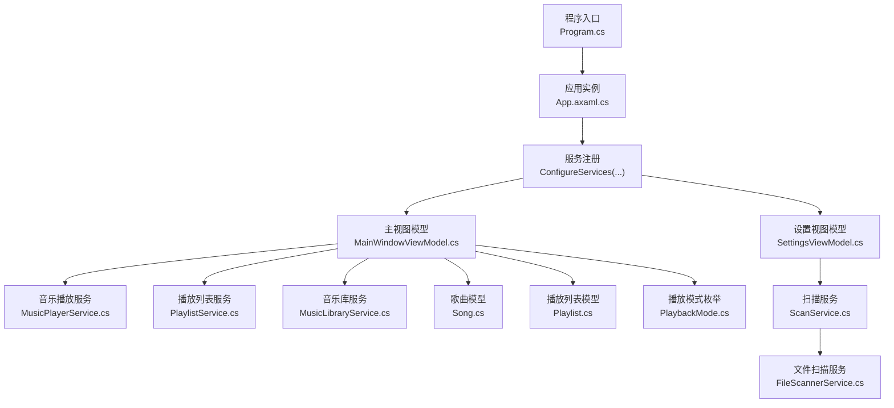
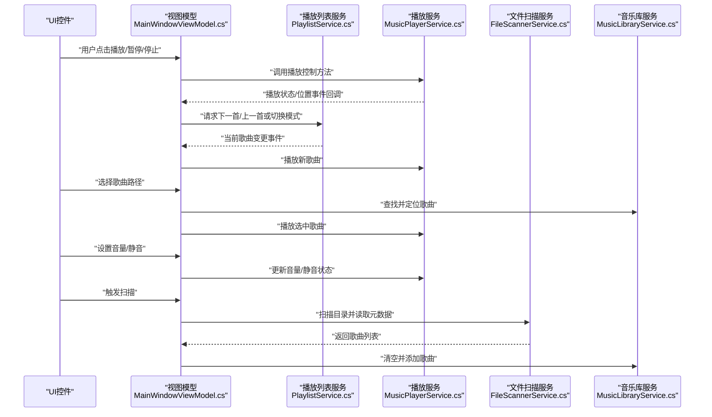
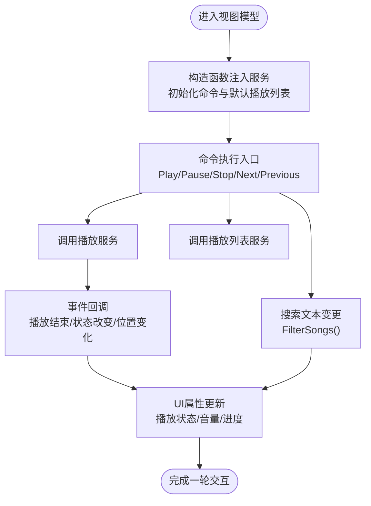
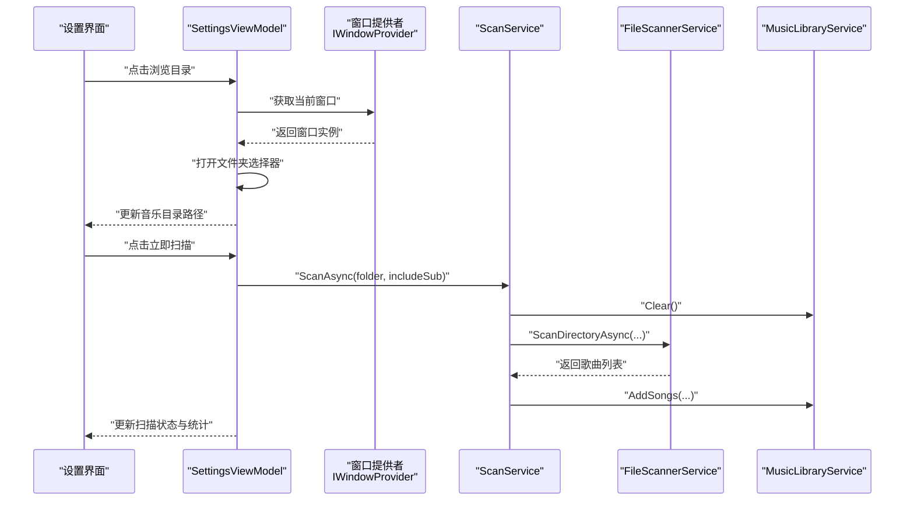
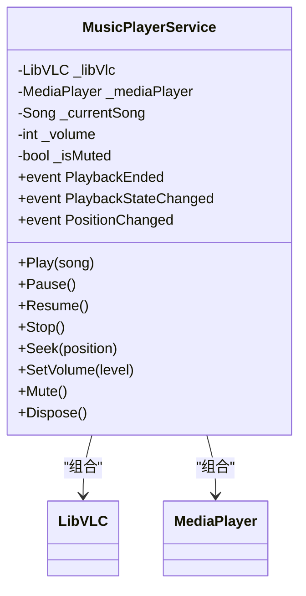
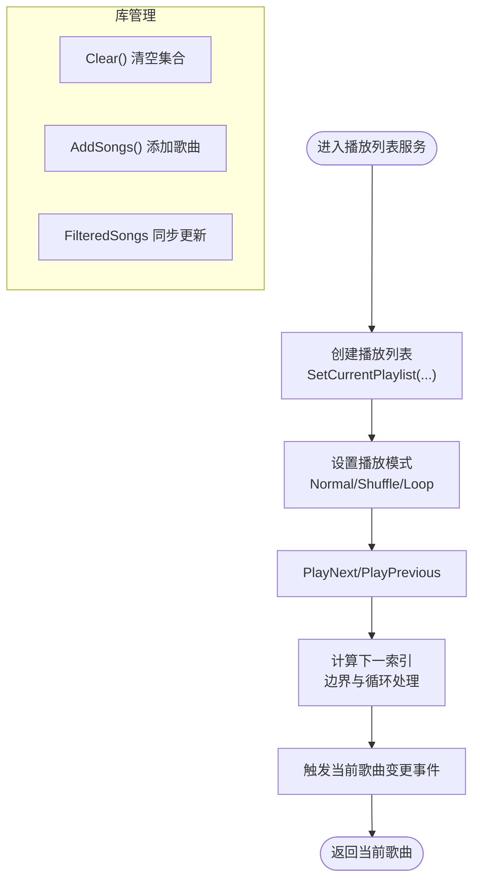
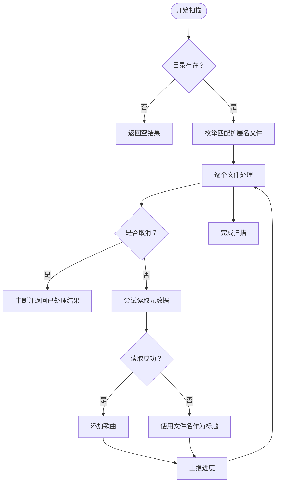
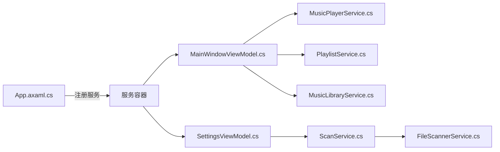

# 调试技巧与开发工具

<cite>
**本文引用的文件**
- [Program.cs](file://Program.cs)
- [App.axaml.cs](file://App.axaml.cs)
- [MainWindowViewModel.cs](file://ViewModels/MainWindowViewModel.cs)
- [SettingsViewModel.cs](file://ViewModels/SettingsViewModel.cs)
- [MusicPlayerService.cs](file://Services/MusicPlayerService.cs)
- [PlaylistService.cs](file://Services/PlaylistService.cs)
- [MusicLibraryService.cs](file://Services/MusicLibraryService.cs)
- [ScanService.cs](file://Services/ScanService.cs)
- [FileScannerService.cs](file://Services/FileScannerService.cs)
- [MainWindow.axaml.cs](file://Views/MainWindow.axaml.cs)
- [Song.cs](file://Models/Song.cs)
- [Playlist.cs](file://Models/Playlist.cs)
- [PlaybackMode.cs](file://Models/PlaybackMode.cs)
- [IWindowProvider.cs](file://Services/IWindowProvider.cs)
- [ViewModelBase.cs](file://ViewModels/ViewModelBase.cs)
</cite>

## 目录
1. [简介](#简介)
2. [项目结构](#项目结构)
3. [核心组件](#核心组件)
4. [架构总览](#架构总览)
5. [详细组件分析](#详细组件分析)
6. [依赖关系分析](#依赖关系分析)
7. [性能考虑](#性能考虑)
8. [故障排除指南](#故障排除指南)
9. [结论](#结论)
10. [附录](#附录)

## 简介
本指南面向LocalMusicPlayer项目的开发者，聚焦于调试技巧与开发工具的系统化使用，覆盖以下主题：
- Visual Studio调试：断点、条件断点、监视表达式、调用堆栈分析
- Avalonia UI调试：XAML设计器、可视化树检查、属性绑定调试
- 日志记录与诊断：日志级别与输出格式配置
- 性能分析：内存泄漏检测、CPU性能分析
- 跨平台调试注意事项与工具配置
- 常见问题的调试方法与故障排除

## 项目结构
LocalMusicPlayer采用MVVM架构，结合Avalonia UI与ReactiveUI，服务层通过依赖注入管理，媒体播放基于LibVLCSharp。关键入口与模块如下：
- 应用入口与构建：Program.cs、App.axaml.cs
- 视图与视图模型：Views与ViewModels命名空间下的窗口与页面
- 业务服务：Services命名空间下的播放、扫描、库管理等服务
- 模型：Models命名空间下的Song、Playlist、PlaybackMode等
- 依赖注入与生命周期：在App初始化阶段完成注册与主窗体加载

图表来源
- [Program.cs:14-20](file://Program.cs#L14-L20)
- [App.axaml.cs:41-51](file://App.axaml.cs#L41-L51)
- [MainWindowViewModel.cs:120-136](file://ViewModels/MainWindowViewModel.cs#L120-L136)
- [SettingsViewModel.cs:107-114](file://ViewModels/SettingsViewModel.cs#L107-L114)
- [MusicPlayerService.cs:7-38](file://Services/MusicPlayerService.cs#L7-L38)
- [PlaylistService.cs:7-45](file://Services/PlaylistService.cs#L7-L45)
- [MusicLibraryService.cs:7-26](file://Services/MusicLibraryService.cs#L7-L26)
- [ScanService.cs:6-23](file://Services/ScanService.cs#L6-L23)
- [FileScannerService.cs:12-75](file://Services/FileScannerService.cs#L12-L75)
- [Song.cs:5-12](file://Models/Song.cs#L5-L12)
- [Playlist.cs:5-9](file://Models/Playlist.cs#L5-L9)
- [PlaybackMode.cs:3-8](file://Models/PlaybackMode.cs#L3-L8)

章节来源
- [Program.cs:14-20](file://Program.cs#L14-L20)
- [App.axaml.cs:18-51](file://App.axaml.cs#L18-L51)

## 核心组件
- 应用入口与平台检测：Program.cs中通过BuildAvaloniaApp配置平台检测与日志输出到跟踪器，便于调试时查看底层框架消息。
- 应用生命周期与DI：App.axaml.cs在框架初始化完成后注册服务、创建主窗体并设置数据上下文，是调试窗口与视图模型交互的关键位置。
- 主视图模型：MainWindowViewModel.cs集中处理播放控制、播放列表切换、搜索过滤、音量与静音状态同步，以及定时轮询更新播放进度。
- 设置视图模型：SettingsViewModel.cs负责浏览目录、触发扫描任务，并在扫描完成后更新统计信息。
- 播放服务：MusicPlayerService.cs封装LibVLCSharp的播放器对象，暴露事件与属性用于UI绑定，是音频播放调试的重点。
- 列表与库服务：PlaylistService.cs与MusicLibraryService.cs分别维护当前播放序列与可筛选的歌曲集合，是播放逻辑与UI绑定的核心数据源。
- 扫描服务：ScanService.cs协调文件扫描与库填充；FileScannerService.cs执行实际的文件遍历、元数据读取与异常容错。

章节来源
- [Program.cs:14-20](file://Program.cs#L14-L20)
- [App.axaml.cs:18-51](file://App.axaml.cs#L18-L51)
- [MainWindowViewModel.cs:120-216](file://ViewModels/MainWindowViewModel.cs#L120-L216)
- [SettingsViewModel.cs:107-146](file://ViewModels/SettingsViewModel.cs#L107-L146)
- [MusicPlayerService.cs:7-129](file://Services/MusicPlayerService.cs#L7-L129)
- [PlaylistService.cs:7-120](file://Services/PlaylistService.cs#L7-L120)
- [MusicLibraryService.cs:7-26](file://Services/MusicLibraryService.cs#L7-L26)
- [ScanService.cs:6-23](file://Services/ScanService.cs#L6-L23)
- [FileScannerService.cs:12-103](file://Services/FileScannerService.cs#L12-L103)

## 架构总览
下图展示从用户操作到服务层与媒体播放器的调用链路，有助于定位断点与分析调用堆栈。

图表来源
- [MainWindowViewModel.cs:141-205](file://ViewModels/MainWindowViewModel.cs#L141-L205)
- [PlaylistService.cs:69-119](file://Services/PlaylistService.cs#L69-L119)
- [MusicPlayerService.cs:40-118](file://Services/MusicPlayerService.cs#L40-L118)
- [FileScannerService.cs:16-75](file://Services/FileScannerService.cs#L16-L75)
- [MusicLibraryService.cs:12-25](file://Services/MusicLibraryService.cs#L12-L25)

## 详细组件分析

### 视图模型与命令流（MainWindowViewModel）
- 关键职责：播放控制命令、播放列表导航、搜索过滤、音量与静音、定时刷新播放进度。
- 调试要点：
  - 在构造函数中设置断点，验证服务注入与初始状态（如默认播放列表）。
  - 在命令执行处（如播放、暂停、停止、下一首、上一首）设置断点，观察参数与内部状态变化。
  - 在事件订阅处（播放结束、状态改变、位置变化）设置断点，验证UI与服务的联动。
  - 使用监视表达式观察当前歌曲、播放状态、音量、是否扫描中等关键字段。
  - 使用调用堆栈分析命令链路与事件传播路径。

图表来源
- [MainWindowViewModel.cs:120-216](file://ViewModels/MainWindowViewModel.cs#L120-L216)

章节来源
- [MainWindowViewModel.cs:120-216](file://ViewModels/MainWindowViewModel.cs#L120-L216)

### 设置视图模型与扫描流程（SettingsViewModel）
- 关键职责：浏览音乐目录、触发扫描、更新统计信息。
- 调试要点：
  - 在浏览目录命令中设置断点，验证窗口提供者与存储提供者的可用性。
  - 在扫描命令中设置断点，观察扫描开始/结束标志位与异常处理。
  - 使用监视表达式观察扫描进度、歌曲数量、专辑数量与最后扫描时间。
  - 结合ScanService与FileScannerService的实现，定位扫描耗时与异常点。

图表来源
- [SettingsViewModel.cs:116-145](file://ViewModels/SettingsViewModel.cs#L116-L145)
- [ScanService.cs:17-22](file://Services/ScanService.cs#L17-L22)
- [FileScannerService.cs:16-75](file://Services/FileScannerService.cs#L16-L75)
- [MusicLibraryService.cs:12-25](file://Services/MusicLibraryService.cs#L12-L25)

章节来源
- [SettingsViewModel.cs:107-146](file://ViewModels/SettingsViewModel.cs#L107-L146)
- [ScanService.cs:6-23](file://Services/ScanService.cs#L6-L23)
- [FileScannerService.cs:12-103](file://Services/FileScannerService.cs#L12-L103)
- [MusicLibraryService.cs:7-26](file://Services/MusicLibraryService.cs#L7-L26)

### 播放服务与媒体播放器（MusicPlayerService）
- 关键职责：封装LibVLCSharp播放器，提供播放、暂停、停止、跳转、音量与静音控制，发布播放状态与位置事件。
- 调试要点：
  - 在构造函数中设置断点，验证LibVLC初始化与播放器创建。
  - 在播放/暂停/停止方法中设置断点，观察播放器状态变化。
  - 在事件回调中设置断点，验证播放结束、状态改变、位置变化事件的触发顺序与频率。
  - 使用监视表达式观察Position、Duration、IsPlaying、Volume、IsMuted等属性。
  - 在Seek/SetVolume/Mute等方法中设置断点，验证UI与服务之间的双向绑定。

图表来源
- [MusicPlayerService.cs:7-129](file://Services/MusicPlayerService.cs#L7-L129)

章节来源
- [MusicPlayerService.cs:7-129](file://Services/MusicPlayerService.cs#L7-L129)

### 播放列表与库管理（PlaylistService、MusicLibraryService）
- 关键职责：维护当前播放列表、索引与播放模式，提供下一首/上一首逻辑；维护歌曲集合与筛选集合。
- 调试要点：
  - 在创建播放列表与设置当前播放列表处设置断点，验证索引重置与当前歌曲为空。
  - 在PlayNext/PlayPrevious中设置断点，观察不同播放模式下的索引计算与边界处理。
  - 在AddSongToPlaylist/RemoveSongFromPlaylist中设置断点，验证集合变更与事件触发。
  - 在MusicLibraryService的AddSongs/Clear中设置断点，验证UI筛选集合的同步更新。

图表来源
- [PlaylistService.cs:47-119](file://Services/PlaylistService.cs#L47-L119)
- [MusicLibraryService.cs:12-25](file://Services/MusicLibraryService.cs#L12-L25)

章节来源
- [PlaylistService.cs:7-120](file://Services/PlaylistService.cs#L7-L120)
- [MusicLibraryService.cs:7-26](file://Services/MusicLibraryService.cs#L7-L26)

### 文件扫描与元数据读取（FileScannerService）
- 关键职责：遍历目录、筛选支持的音频扩展名、读取TagLib元数据、报告进度与取消令牌。
- 调试要点：
  - 在ScanDirectoryAsync入口设置断点，验证路径存在性与子目录选项。
  - 在foreach循环中设置断点，观察文件处理进度与异常捕获。
  - 在ReadSongMetadata中设置断点，验证元数据缺失时的回退策略。
  - 使用监视表达式观察processed/total百分比与进度上报频率。

图表来源
- [FileScannerService.cs:16-75](file://Services/FileScannerService.cs#L16-L75)

章节来源
- [FileScannerService.cs:12-103](file://Services/FileScannerService.cs#L12-L103)

## 依赖关系分析
- 依赖注入：在App的框架初始化完成后注册服务，主窗体加载时解析视图模型并设置DataContext，确保所有组件按需注入。
- 组件耦合：视图模型依赖服务接口，服务之间通过接口解耦；播放服务与LibVLCSharp紧密耦合但通过事件与属性对外暴露，便于测试与替换。
- 外部依赖：LibVLCSharp用于播放，TagLib用于元数据读取，Avalonia与ReactiveUI用于UI与响应式编程。

图表来源
- [App.axaml.cs:41-51](file://App.axaml.cs#L41-L51)
- [MainWindowViewModel.cs:120-136](file://ViewModels/MainWindowViewModel.cs#L120-L136)
- [SettingsViewModel.cs:107-114](file://ViewModels/SettingsViewModel.cs#L107-L114)
- [MusicPlayerService.cs:7-38](file://Services/MusicPlayerService.cs#L7-L38)
- [PlaylistService.cs:7-45](file://Services/PlaylistService.cs#L7-L45)
- [MusicLibraryService.cs:7-26](file://Services/MusicLibraryService.cs#L7-L26)
- [ScanService.cs:6-23](file://Services/ScanService.cs#L6-L23)
- [FileScannerService.cs:12-75](file://Services/FileScannerService.cs#L12-L75)

章节来源
- [App.axaml.cs:41-51](file://App.axaml.cs#L41-L51)
- [MainWindowViewModel.cs:120-136](file://ViewModels/MainWindowViewModel.cs#L120-L136)
- [SettingsViewModel.cs:107-114](file://ViewModels/SettingsViewModel.cs#L107-L114)

## 性能考虑
- CPU性能分析
  - 使用Visual Studio性能探查器对播放控制、扫描与UI刷新进行采样，识别高开销方法（如播放状态轮询、元数据读取、集合变更）。
  - 在MainWindowViewModel的定时轮询处设置采样断点，观察主线程调度与UI卡顿关联。
  - 在FileScannerService的foreach循环中设置采样断点，评估元数据读取与异常捕获的成本。
- 内存泄漏检测
  - 使用Visual Studio诊断工具监控对象分配与垃圾回收，重点检查播放器与媒体对象的释放路径（MusicPlayerService.Dispose）。
  - 验证播放器事件订阅的生命周期，避免因未注销导致的内存泄漏。
- 跨平台注意
  - 平台检测与字体加载由Avalonia自动处理，调试时关注平台差异导致的UI布局与输入行为差异。
  - LibVLCSharp在不同平台上的初始化与权限要求不同，确保在目标平台正确部署与运行。

[本节为通用指导，不直接分析具体文件，故无章节来源]

## 故障排除指南
- UI无响应或卡顿
  - 在MainWindowViewModel的定时轮询处设置断点，确认轮询频率与主线程调度是否合理。
  - 在播放控制命令处设置断点，验证命令执行与播放器状态切换是否及时。
- 播放异常或无声
  - 在MusicPlayerService的Play/Pause/Stop与事件回调处设置断点，确认播放器状态与事件触发顺序。
  - 在Seek/SetVolume/Mute处设置断点，验证音量与静音状态的同步。
- 扫描失败或无歌曲
  - 在ScanService的ScanAsync入口设置断点，确认目录路径与包含子目录选项。
  - 在FileScannerService的文件枚举与元数据读取处设置断点，排查异常捕获分支与回退逻辑。
- 属性绑定不生效
  - 在视图模型的属性setter与RaiseAndSetIfChanged调用处设置断点，确认属性变更通知是否发出。
  - 在XAML中检查绑定路径与DataContext设置，确保绑定目标与源一致。

章节来源
- [MainWindowViewModel.cs:209-215](file://ViewModels/MainWindowViewModel.cs#L209-L215)
- [MusicPlayerService.cs:40-118](file://Services/MusicPlayerService.cs#L40-L118)
- [ScanService.cs:17-22](file://Services/ScanService.cs#L17-L22)
- [FileScannerService.cs:45-75](file://Services/FileScannerService.cs#L45-L75)
- [ViewModelBase.cs:5](file://ViewModels/ViewModelBase.cs#L5)

## 结论
通过在关键入口（应用构建、视图模型构造、命令执行）、事件回调（播放状态、位置变化、当前歌曲变更）与服务实现（播放器、扫描、库管理）设置断点，结合监视表达式与调用堆栈分析，可以高效定位LocalMusicPlayer中的问题。配合Avalonia UI的可视化树检查与属性绑定调试，能够快速解决界面与数据交互问题。利用日志与性能分析工具，可在复杂场景下进一步优化性能与稳定性。

[本节为总结，不直接分析具体文件，故无章节来源]

## 附录
- Visual Studio调试建议
  - 断点：在关键方法入口与事件回调处设置，避免在高频轮询中设置过多断点。
  - 条件断点：在播放状态轮询与文件处理循环中设置条件断点，仅在特定条件下中断。
  - 监视表达式：监视播放状态、音量、位置、歌曲数量、扫描进度等关键变量。
  - 调用堆栈：在命令与事件传播路径上查看调用链，确认责任归属。
- Avalonia UI调试建议
  - XAML设计器：在设计时检查控件层次与绑定路径，避免运行时绑定错误。
  - 可视化树检查：使用工具查看实际渲染树，核对模板与样式应用。
  - 属性绑定调试：启用绑定诊断输出，定位路径错误与类型不匹配。
- 日志与诊断
  - 在Program.cs中已启用日志输出到跟踪器，可结合自定义日志框架（如Microsoft.Extensions.Logging）统一输出格式与级别。
- 性能分析工具
  - 使用Visual Studio内置性能探查器与诊断工具，针对播放控制、扫描与UI刷新进行采样与内存分析。
- 跨平台调试
  - 确保平台检测与字体加载正常，关注不同平台的权限与路径差异，必要时增加平台特定的日志与容错。

[本节为通用指导，不直接分析具体文件，故无章节来源]