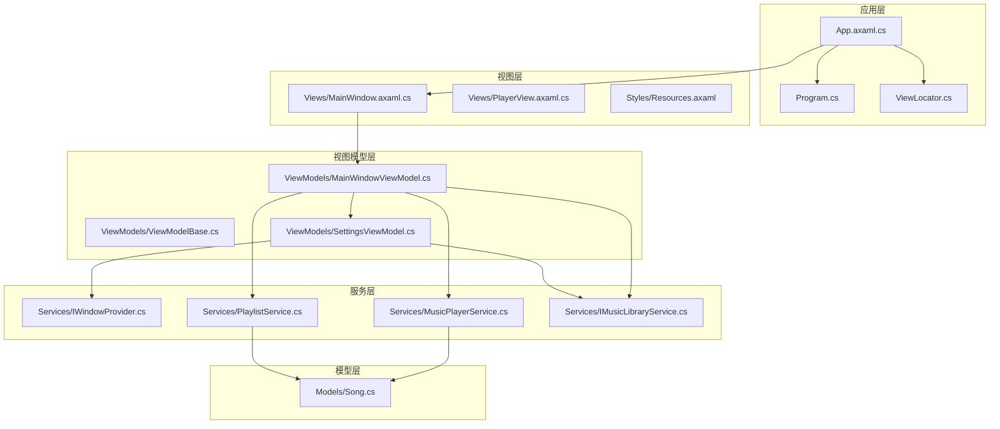
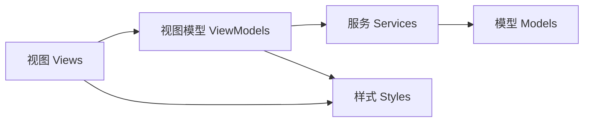
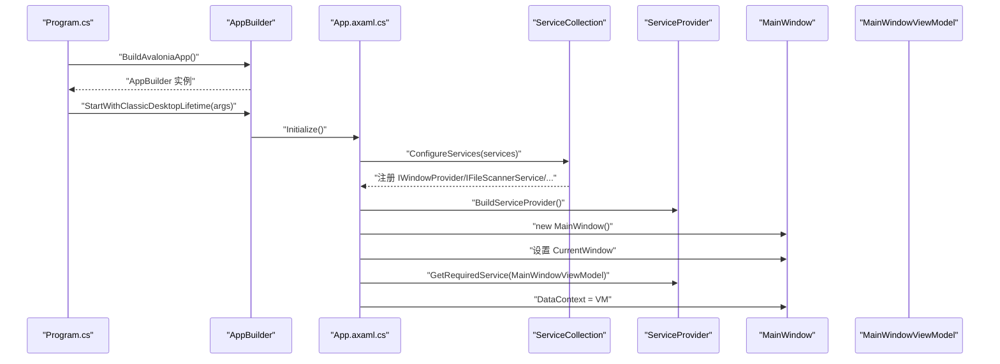
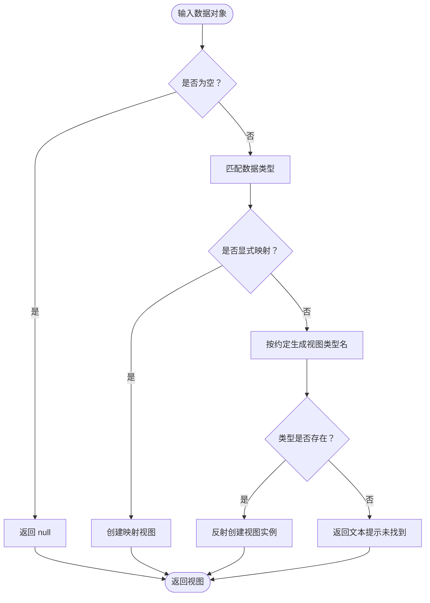
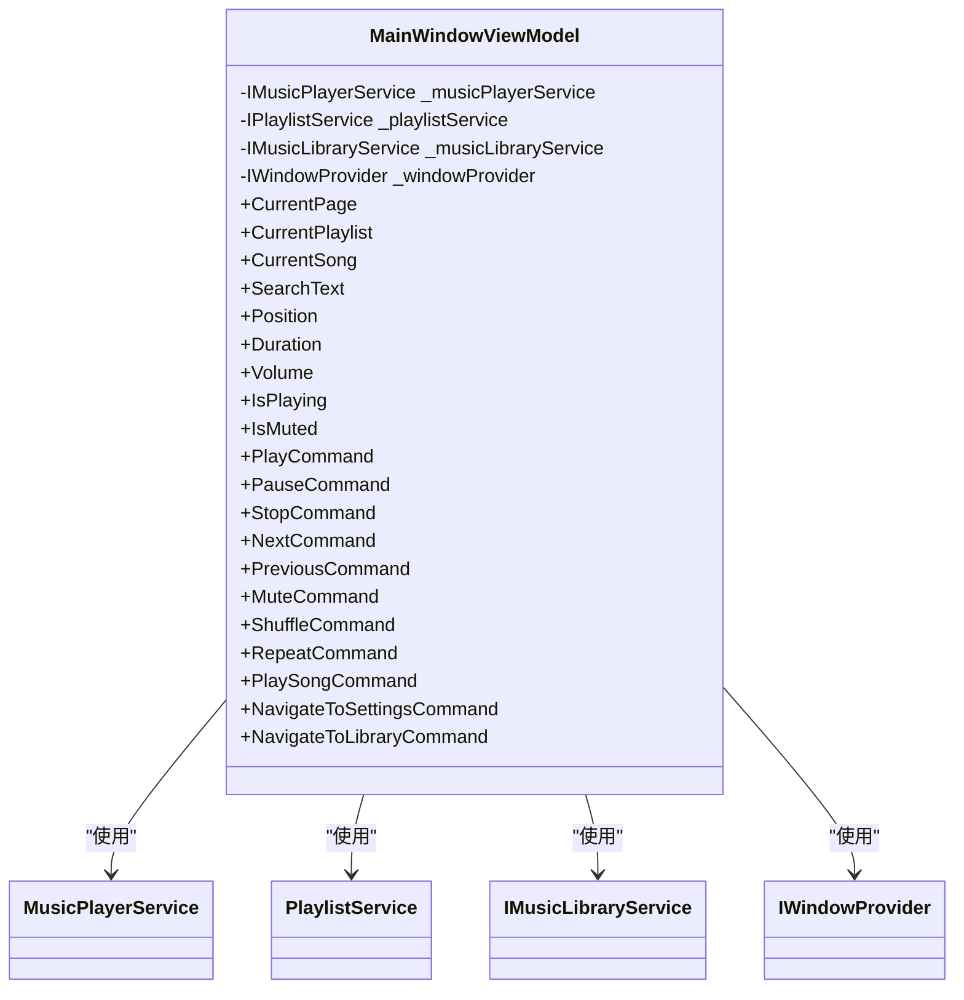
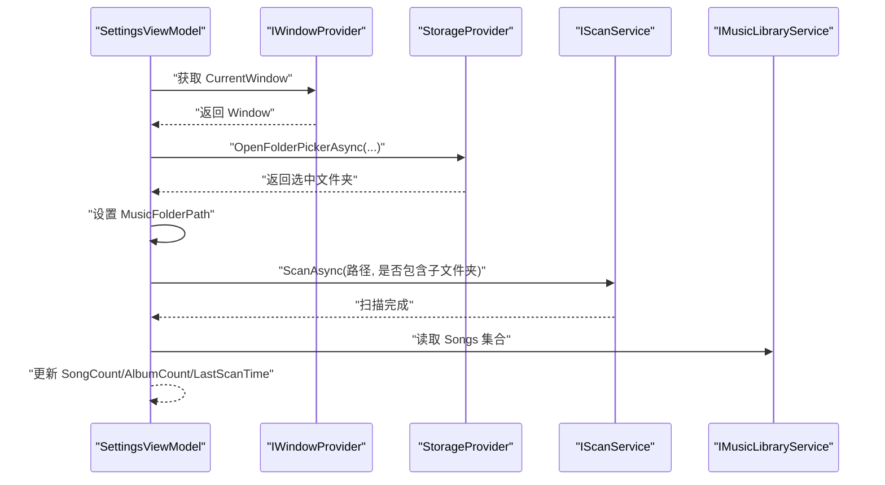
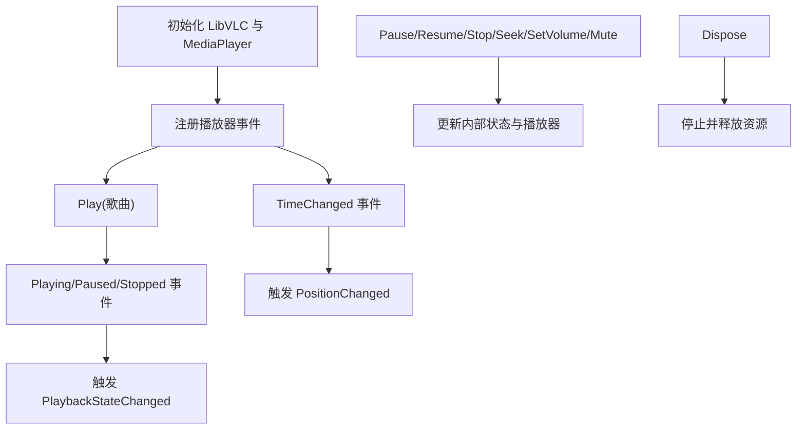
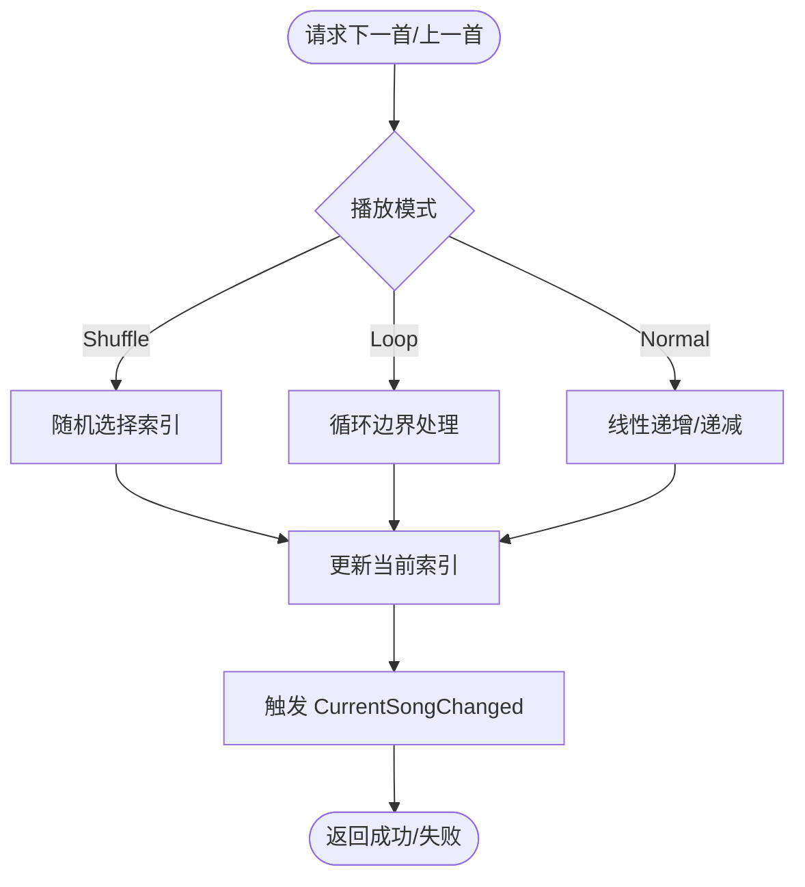
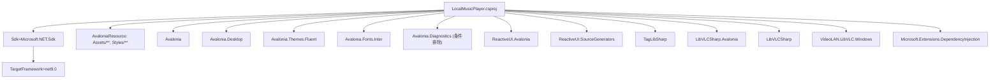

# 项目结构与组织

<cite>
**本文引用的文件**
- [LocalMusicPlayer.csproj](file://LocalMusicPlayer.csproj)
- [App.axaml.cs](file://App.axaml.cs)
- [Program.cs](file://Program.cs)
- [ViewLocator.cs](file://ViewLocator.cs)
- [ViewModelBase.cs](file://ViewModels/ViewModelBase.cs)
- [MainWindowViewModel.cs](file://ViewModels/MainWindowViewModel.cs)
- [SettingsViewModel.cs](file://ViewModels/SettingsViewModel.cs)
- [Song.cs](file://Models/Song.cs)
- [MusicPlayerService.cs](file://Services/MusicPlayerService.cs)
- [PlaylistService.cs](file://Services/PlaylistService.cs)
- [IMusicLibraryService.cs](file://Services/IMusicLibraryService.cs)
- [IWindowProvider.cs](file://Services/IWindowProvider.cs)
- [MainWindow.axaml.cs](file://Views/MainWindow.axaml.cs)
- [PlayerView.axaml.cs](file://Views/PlayerView.axaml.cs)
- [Resources.axaml](file://Styles/Resources.axaml)
</cite>

## 目录
1. [引言](#引言)
2. [项目结构](#项目结构)
3. [核心组件](#核心组件)
4. [架构总览](#架构总览)
5. [详细组件分析](#详细组件分析)
6. [依赖分析](#依赖分析)
7. [性能考虑](#性能考虑)
8. [故障排查指南](#故障排查指南)
9. [结论](#结论)
10. [附录：命名约定与最佳实践](#附录命名约定与最佳实践)

## 引言
本文件系统性梳理 LocalMusicPlayer 项目的目录组织原则、各模块职责、MVVM 架构实现方式、依赖注入与服务注册、构建配置与资源管理策略，并给出文件命名约定与代码组织的最佳实践建议。目标是帮助新成员快速理解项目结构与交互关系，同时为后续扩展与维护提供清晰指引。

## 项目结构
项目采用基于功能域的分层组织方式，遵循 MVVM 模式与依赖注入（DI）原则，主要目录如下：
- Models：数据模型定义，如歌曲信息等纯数据结构。
- Services：业务服务接口与实现，负责媒体播放、播放列表、音乐库扫描与窗口上下文等。
- ViewModels：视图模型，封装 UI 状态与命令，连接服务与视图。
- Views：UI 视图（XAML + 后台代码），承载界面布局与交互。
- Styles：样式与资源字典，集中管理颜色、画刷与控件主题。
- Converters：值转换器，用于绑定时的数据格式化与逻辑转换。
- Behaviors：行为（Behaviors），用于附加行为以增强控件能力。
- Helpers：辅助工具类，提供通用方法（如格式化）。
- 根目录配置：LocalMusicPlayer.csproj（项目文件）、App.axaml.cs（应用入口）、Program.cs（程序入口）、ViewLocator.cs（视图定位器）等。

图表来源
- [App.axaml.cs:18-39](file://App.axaml.cs#L18-L39)
- [Program.cs:14-20](file://Program.cs#L14-L20)
- [ViewLocator.cs:8-38](file://ViewLocator.cs#L8-L38)
- [MainWindowViewModel.cs:120-216](file://ViewModels/MainWindowViewModel.cs#L120-L216)
- [SettingsViewModel.cs:107-146](file://ViewModels/SettingsViewModel.cs#L107-L146)
- [MusicPlayerService.cs:7-38](file://Services/MusicPlayerService.cs#L7-L38)
- [PlaylistService.cs:7-34](file://Services/PlaylistService.cs#L7-L34)
- [IMusicLibraryService.cs:7-13](file://Services/IMusicLibraryService.cs#L7-L13)
- [IWindowProvider.cs:5-8](file://Services/IWindowProvider.cs#L5-L8)
- [Song.cs:5-12](file://Models/Song.cs#L5-L12)

章节来源
- [LocalMusicPlayer.csproj:11-19](file://LocalMusicPlayer.csproj#L11-L19)
- [App.axaml.cs:18-51](file://App.axaml.cs#L18-L51)
- [Program.cs:8-20](file://Program.cs#L8-L20)
- [ViewLocator.cs:8-38](file://ViewLocator.cs#L8-L38)

## 核心组件
- 应用启动与 DI 注册
  - 程序入口通过构建器启用平台检测、字体与 ReactiveUI 支持，并启动经典桌面生命周期。
  - 应用初始化阶段注册服务集合，构建 ServiceProvider，并将主窗体与当前窗口上下文注入。
- 视图定位器
  - 基于约定自动解析 ViewModel 对应的 View 类型，或显式映射特定 ViewModel 到 View。
- 视图模型基类
  - 继承 ReactiveObject，提供属性变更通知能力，作为所有 ViewModel 的统一基类。
- 主视图模型
  - 聚合播放器、播放列表、音乐库与窗口提供者，暴露播放控制命令、搜索过滤、音量与播放状态等。
- 设置视图模型
  - 提供扫描设置、浏览文件夹、触发扫描任务与统计信息展示。
- 服务层
  - 音乐播放服务：封装 LibVLC 播放器事件与状态，提供播放、暂停、停止、音量与跳转。
  - 播放列表服务：维护当前播放列表、索引与播放模式（顺序/随机/循环），并发出变更事件。
  - 音乐库服务：提供歌曲集合与过滤集合，支持清空与批量添加。
  - 窗口提供者：保存当前主窗体实例，供视图模型访问系统存储对话框等。
- 模型层
  - Song：描述歌曲标题、艺人、专辑、路径与时长等元数据。

章节来源
- [Program.cs:14-20](file://Program.cs#L14-L20)
- [App.axaml.cs:41-51](file://App.axaml.cs#L41-L51)
- [ViewLocator.cs:10-37](file://ViewLocator.cs#L10-L37)
- [ViewModelBase.cs:5-7](file://ViewModels/ViewModelBase.cs#L5-L7)
- [MainWindowViewModel.cs:120-216](file://ViewModels/MainWindowViewModel.cs#L120-L216)
- [SettingsViewModel.cs:107-146](file://ViewModels/SettingsViewModel.cs#L107-L146)
- [MusicPlayerService.cs:7-129](file://Services/MusicPlayerService.cs#L7-L129)
- [PlaylistService.cs:7-120](file://Services/PlaylistService.cs#L7-L120)
- [IMusicLibraryService.cs:7-13](file://Services/IMusicLibraryService.cs#L7-L13)
- [IWindowProvider.cs:5-8](file://Services/IWindowProvider.cs#L5-L8)
- [Song.cs:5-12](file://Models/Song.cs#L5-L12)

## 架构总览
LocalMusicPlayer 采用 MVVM + 依赖注入的架构：
- 视图（Views）仅负责呈现与用户交互，不直接操作业务数据。
- 视图模型（ViewModels）持有服务实例，封装 UI 行为与状态，通过命令与事件驱动服务。
- 服务（Services）封装业务逻辑与外部依赖（LibVLC、文件系统、存储 API 等），向视图模型提供稳定接口。
- 模型（Models）保持轻量与不可变特性，便于跨层传递与缓存。
- 样式（Styles）集中管理 UI 主题与控件外观，提升一致性与可维护性。

图表来源
- [MainWindowViewModel.cs:120-216](file://ViewModels/MainWindowViewModel.cs#L120-L216)
- [SettingsViewModel.cs:107-146](file://ViewModels/SettingsViewModel.cs#L107-L146)
- [MusicPlayerService.cs:7-129](file://Services/MusicPlayerService.cs#L7-L129)
- [PlaylistService.cs:7-120](file://Services/PlaylistService.cs#L7-L120)
- [Resources.axaml:1-67](file://Styles/Resources.axaml#L1-L67)

## 详细组件分析

### 应用启动与依赖注入流程
应用启动时执行以下步骤：
- 构建 AppBuilder 并启用 ReactiveUI、平台检测与字体。
- 初始化应用并注册服务集合（单例/瞬态按需配置）。
- 创建 ServiceProvider，设置主窗体 DataContext 为 MainWindowViewModel。

图表来源
- [Program.cs:14-20](file://Program.cs#L14-L20)
- [App.axaml.cs:18-51](file://App.axaml.cs#L18-L51)

章节来源
- [Program.cs:8-20](file://Program.cs#L8-L20)
- [App.axaml.cs:18-51](file://App.axaml.cs#L18-L51)

### 视图定位与约定解析
视图定位器根据数据类型动态解析对应视图：
- 显式映射：MainWindowViewModel → PlayerView；SettingsViewModel → SettingsView。
- 约定解析：将 ViewModel 类名替换“ViewModel”为“View”，反射创建对应视图类型。
- 匹配规则：仅当数据类型继承自 ViewModelBase 时进行解析。

图表来源
- [ViewLocator.cs:10-37](file://ViewLocator.cs#L10-L37)

章节来源
- [ViewLocator.cs:8-38](file://ViewLocator.cs#L8-L38)

### 主视图模型：播放控制与页面导航
MainWindowViewModel 负责：
- 页面切换：通过 CurrentPage 在“主页”和“设置页”之间切换。
- 播放控制：命令驱动播放器服务，更新播放状态、音量与进度。
- 播放列表：维护当前播放列表与歌曲，响应播放列表服务事件。
- 搜索过滤：根据标题与艺人筛选歌曲集合。
- 定时刷新：周期性订阅播放器位置与时长，保证 UI 同步。

图表来源
- [MainWindowViewModel.cs:11-216](file://ViewModels/MainWindowViewModel.cs#L11-L216)
- [MusicPlayerService.cs:7-129](file://Services/MusicPlayerService.cs#L7-L129)
- [PlaylistService.cs:7-120](file://Services/PlaylistService.cs#L7-L120)
- [IMusicLibraryService.cs:7-13](file://Services/IMusicLibraryService.cs#L7-L13)
- [IWindowProvider.cs:5-8](file://Services/IWindowProvider.cs#L5-L8)

章节来源
- [MainWindowViewModel.cs:120-216](file://ViewModels/MainWindowViewModel.cs#L120-L216)

### 设置视图模型：扫描与统计
SettingsViewModel 负责：
- 文件夹选择：通过窗口提供者调用系统存储 API 打开文件夹选择器。
- 扫描触发：调用扫描服务异步扫描指定目录及子目录，完成后更新统计信息与最后扫描时间。
- UI 状态：IsScanning 控制加载状态，SongCount/AlbumCount/TotalSize 等字段用于展示结果。

图表来源
- [SettingsViewModel.cs:116-145](file://ViewModels/SettingsViewModel.cs#L116-L145)
- [IWindowProvider.cs:7-8](file://Services/IWindowProvider.cs#L7-L8)
- [IMusicLibraryService.cs:9-13](file://Services/IMusicLibraryService.cs#L9-L13)

章节来源
- [SettingsViewModel.cs:107-146](file://ViewModels/SettingsViewModel.cs#L107-L146)

### 播放器服务：LibVLC 封装
MusicPlayerService 封装 LibVLC 播放器：
- 事件桥接：EndReached、TimeChanged、Playing/Paused/Stopped 等事件转发为播放状态变更。
- 播放控制：Play/Pause/Resume/Stop/Seek/SetVolume/Mute。
- 状态查询：Position、Duration、IsPlaying、Volume、IsMuted。
- 资源释放：实现 IDisposable，确保播放器与 LibVLC 正确释放。

图表来源
- [MusicPlayerService.cs:27-129](file://Services/MusicPlayerService.cs#L27-L129)

章节来源
- [MusicPlayerService.cs:7-129](file://Services/MusicPlayerService.cs#L7-L129)

### 播放列表服务：播放模式与索引
PlaylistService 维护：
- 当前播放列表与索引，支持添加/移除歌曲。
- 播放模式：Normal、Shuffle、Loop，影响 Next/Previous 的索引计算。
- 事件通知：CurrentSongChanged、PlaybackModeChanged。

图表来源
- [PlaylistService.cs:69-119](file://Services/PlaylistService.cs#L69-L119)

章节来源
- [PlaylistService.cs:7-120](file://Services/PlaylistService.cs#L7-L120)

### 样式与资源：主题与控件主题
Resources.axaml 定义了：
- 基础颜色与画刷（背景、文本、强调色、边框等）。
- 控件主题（如 SidebarButtonTheme），包含悬停、选中等状态样式。

章节来源
- [Resources.axaml:1-67](file://Styles/Resources.axaml#L1-L67)

## 依赖分析
项目文件 LocalMusicPlayer.csproj 描述了 SDK、目标框架、编译选项以及 NuGet 包依赖。其关键点包括：
- SDK 与目标框架：.NET 9，WinExe 输出类型。
- 编译与诊断：启用 Nullable，启用 Avalonia 编译绑定，默认启用 Avalonia 调试包在 Debug 中排除。
- 资源包含：Assets 与 Styles 目录下的资源被标记为 AvaloniaResource。
- 包依赖：Avalonia 核心与桌面、Fluent 主题、Inter 字体、ReactiveUI 及其源生成器、TagLibSharp、LibVLCSharp（含 Avalonia 绑定）与 Microsoft.Extensions.DependencyInjection。

图表来源
- [LocalMusicPlayer.csproj:1-43](file://LocalMusicPlayer.csproj#L1-L43)

章节来源
- [LocalMusicPlayer.csproj:1-43](file://LocalMusicPlayer.csproj#L1-L43)

## 性能考虑
- 绑定与调度：MainWindowViewModel 使用定时器周期性订阅播放器状态，建议在 UI 不可见或后台时降低频率或暂停订阅，避免不必要的 UI 更新。
- 播放器事件：LibVLC 的 TimeChanged 事件可能频繁触发，建议在 UI 层合并更新或节流，减少绑定写入次数。
- 扫描任务：扫描大目录时应异步执行并显示进度，避免阻塞 UI 线程。
- 资源释放：确保播放器与 LibVLC 在不再使用时及时释放，避免内存泄漏。

## 故障排查指南
- 无法播放音频
  - 检查 LibVLC 初始化与媒体路径有效性。
  - 确认播放器事件已正确注册并转发到视图模型。
- 播放列表不更新
  - 确认 CurrentSongChanged 事件是否触发，以及视图模型是否正确订阅。
- 扫描无结果
  - 检查扫描服务参数（路径、是否包含子目录），确认 IMusicLibraryService 的 Songs/FilteredSongs 已更新。
- 样式不生效
  - 确认资源字典已正确包含在 AvaloniaResource 中，且控件引用了正确的静态资源键。

章节来源
- [MusicPlayerService.cs:33-118](file://Services/MusicPlayerService.cs#L33-L118)
- [PlaylistService.cs:14-94](file://Services/PlaylistService.cs#L14-L94)
- [IMusicLibraryService.cs:9-13](file://Services/IMusicLibraryService.cs#L9-L13)
- [Resources.axaml:1-67](file://Styles/Resources.axaml#L1-L67)

## 结论
LocalMusicPlayer 通过清晰的 MVVM 分层与依赖注入，实现了 UI 与业务逻辑的解耦；结合 LibVLC 的多媒体能力与 Avalonia 的跨平台 UI，提供了可扩展的本地音乐播放体验。建议在后续开发中持续优化事件频率、资源释放与扫描性能，并完善错误处理与日志记录。

## 附录：命名约定与最佳实践
- 目录与文件命名
  - 视图与视图模型：View 与 ViewModel 成对出现，如 PlayerView 与 PlayerViewModel。
  - 服务接口以 I 开头，实现类去除 I 前缀，如 IWindowProvider 与 WindowProvider。
  - 模型类保持简洁，优先使用只读属性与不可变语义。
- 代码组织
  - ViewModel 统一继承 ViewModelBase，使用 ReactiveObject 的属性变更通知。
  - 服务接口隔离实现细节，便于测试与替换。
  - 视图尽量保持“薄视图”，复杂逻辑放入 ViewModel。
- 构建与资源
  - 资源文件统一纳入 AvaloniaResource，避免遗漏导致运行时缺失。
  - 依赖包版本集中管理，避免冲突；调试与发布配置差异通过条件引用控制。
- 命名约定示例
  - 视图：MainWindow.axaml、PlayerView.axaml、SettingsView.axaml
  - 视图模型：MainWindowViewModel.cs、SettingsViewModel.cs
  - 服务接口：IMusicPlayerService.cs、IPlaylistService.cs、IMusicLibraryService.cs
  - 服务实现：MusicPlayerService.cs、PlaylistService.cs、MusicLibraryService.cs
  - 模型：Song.cs、Playlist.cs、PlayState.cs、PlaybackMode.cs、PlayerStatus.cs
  - 样式：Resources.axaml
  - 辅助：FormatHelper.cs
  - 行为：ClickBehavior.cs
  - 转换器：BoolToOpacityConverter.cs、TimeSpanToStringConverter.cs