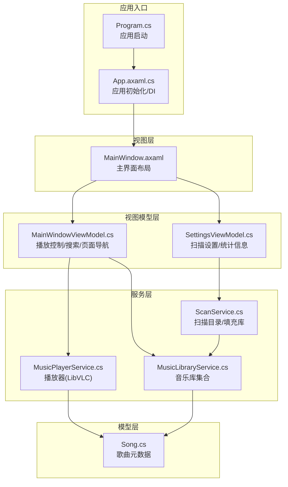
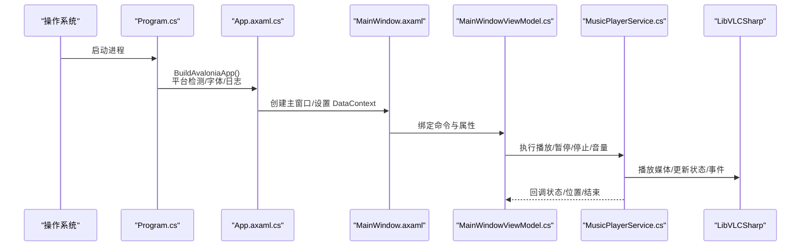
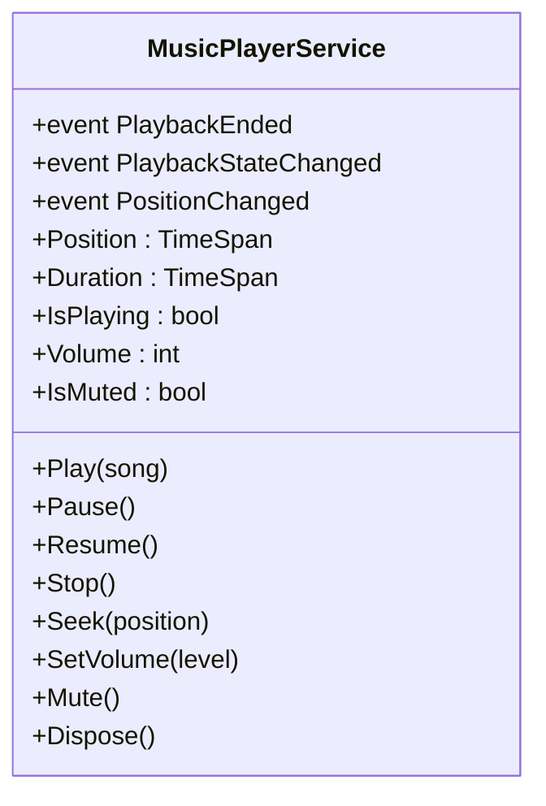
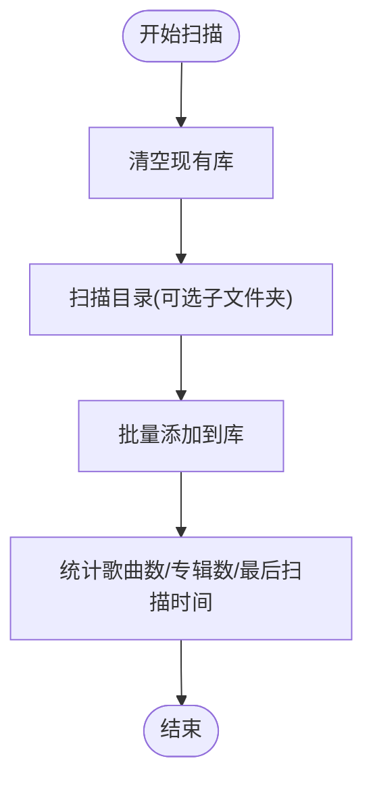
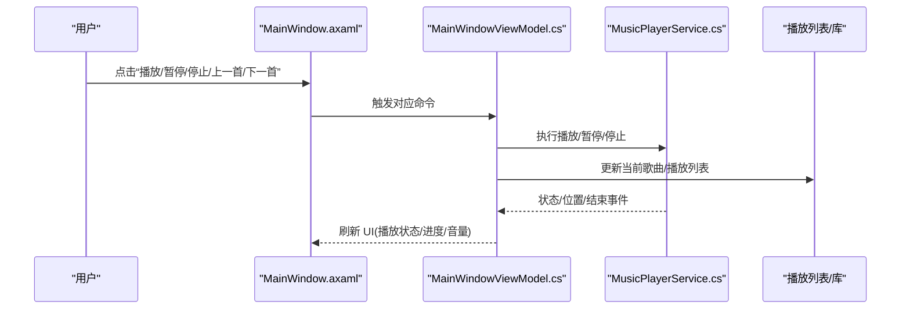
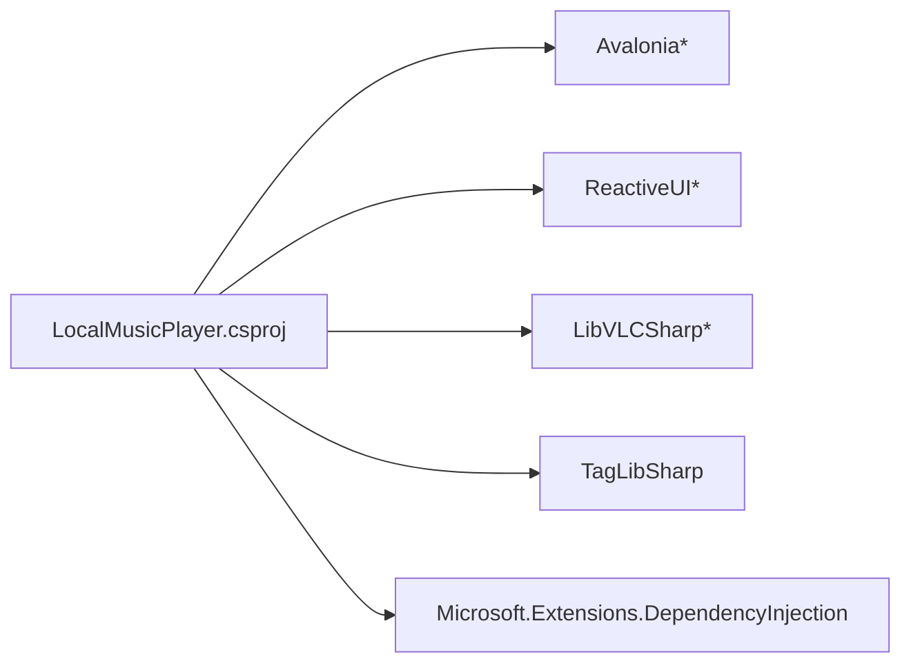

# 快速开始

<cite>
**本文引用的文件**
- [LocalMusicPlayer.csproj](file://LocalMusicPlayer.csproj)
- [Program.cs](file://Program.cs)
- [App.axaml.cs](file://App.axaml.cs)
- [LocalMusicPlayer.sln](file://LocalMusicPlayer.sln)
- [app.manifest](file://app.manifest)
- [docs/PRD.md](file://docs/PRD.md)
- [ViewModels/MainWindowViewModel.cs](file://ViewModels/MainWindowViewModel.cs)
- [ViewModels/SettingsViewModel.cs](file://ViewModels/SettingsViewModel.cs)
- [Services/MusicPlayerService.cs](file://Services/MusicPlayerService.cs)
- [Services/MusicLibraryService.cs](file://Services/MusicLibraryService.cs)
- [Services/ScanService.cs](file://Services/ScanService.cs)
- [Models/Song.cs](file://Models/Song.cs)
- [Views/MainWindow.axaml](file://Views/MainWindow.axaml)
</cite>

## 目录
1. [简介](#简介)
2. [项目结构](#项目结构)
3. [核心组件](#核心组件)
4. [架构总览](#架构总览)
5. [详细组件分析](#详细组件分析)
6. [依赖分析](#依赖分析)
7. [性能考虑](#性能考虑)
8. [故障排除指南](#故障排除指南)
9. [结论](#结论)
10. [附录](#附录)

## 简介
本指南面向新开发者，帮助你在最短时间内完成 LocalMusicPlayer 项目的环境准备、构建与运行，并体验核心功能（音乐库扫描、播放控制等）。项目基于 Avalonia + ReactiveUI 构建，使用 LibVLCSharp 进行跨平台音频播放，使用 TagLibSharp 读取音频元数据。

## 项目结构
- 项目采用 MVVM 分层组织：
  - 视图层：Avalonia XAML 页面与视图模型绑定
  - 视图模型层：负责业务交互与状态管理
  - 服务层：封装播放、扫描、库管理等能力
  - 模型层：基础数据结构（如歌曲信息）
- 关键入口：
  - 应用入口在 Program.cs 中通过 Avalonia 构建器启动
  - 应用初始化阶段在 App.axaml.cs 中注册 DI 容器与主窗体
- 平台与清单：
  - 目标框架为 net9.0
  - 使用 app.manifest 保证 Windows 平台窗口透明与嵌入控件兼容性

图表来源
- [Program.cs:1-20](file://Program.cs#L1-L20)
- [App.axaml.cs:18-51](file://App.axaml.cs#L18-L51)
- [Views/MainWindow.axaml:1-78](file://Views/MainWindow.axaml#L1-L78)
- [ViewModels/MainWindowViewModel.cs:110-231](file://ViewModels/MainWindowViewModel.cs#L110-L231)
- [ViewModels/SettingsViewModel.cs:107-148](file://ViewModels/SettingsViewModel.cs#L107-L148)
- [Services/MusicPlayerService.cs:7-129](file://Services/MusicPlayerService.cs#L7-L129)
- [Services/MusicLibraryService.cs:7-27](file://Services/MusicLibraryService.cs#L7-L27)
- [Services/ScanService.cs:6-24](file://Services/ScanService.cs#L6-L24)
- [Models/Song.cs:5-13](file://Models/Song.cs#L5-L13)

章节来源
- [LocalMusicPlayer.csproj:1-43](file://LocalMusicPlayer.csproj#L1-L43)
- [Program.cs:1-20](file://Program.cs#L1-L20)
- [App.axaml.cs:18-51](file://App.axaml.cs#L18-L51)
- [Views/MainWindow.axaml:1-78](file://Views/MainWindow.axaml#L1-L78)
- [docs/PRD.md:1-51](file://docs/PRD.md#L1-L51)

## 核心组件
- 应用启动与平台检测：Program.cs 使用 AppBuilder 配置平台检测、字体与日志，然后以经典桌面生命周期启动
- 应用初始化与依赖注入：App.axaml.cs 在桌面生命周期中构建 ServiceCollection，注册窗口提供者、播放器、库、扫描器、视图模型等
- 主窗体与页面导航：MainWindow.axaml 提供侧边栏与内容区，通过 CurrentPage 切换到“库”或“设置”
- 播放控制与状态：MainWindowViewModel.cs 提供播放/暂停/停止/上一首/下一首/静音/随机/循环等命令，绑定播放器与播放列表
- 音乐库与扫描：MusicLibraryService.cs 管理歌曲集合；ScanService.cs 清空并填充库；SettingsViewModel.cs 提供浏览文件夹与触发扫描
- 播放器实现：MusicPlayerService.cs 基于 LibVLCSharp，处理播放、暂停、停止、音量、静音、进度事件与结束事件
- 歌曲模型：Song.cs 包含标题、艺术家、专辑、文件路径与时长等字段

章节来源
- [Program.cs:14-20](file://Program.cs#L14-L20)
- [App.axaml.cs:41-51](file://App.axaml.cs#L41-L51)
- [Views/MainWindow.axaml:38-74](file://Views/MainWindow.axaml#L38-L74)
- [ViewModels/MainWindowViewModel.cs:108-216](file://ViewModels/MainWindowViewModel.cs#L108-L216)
- [ViewModels/SettingsViewModel.cs:107-146](file://ViewModels/SettingsViewModel.cs#L107-L146)
- [Services/MusicLibraryService.cs:9-26](file://Services/MusicLibraryService.cs#L9-L26)
- [Services/ScanService.cs:17-23](file://Services/ScanService.cs#L17-L23)
- [Services/MusicPlayerService.cs:40-118](file://Services/MusicPlayerService.cs#L40-L118)
- [Models/Song.cs:7-12](file://Models/Song.cs#L7-L12)

## 架构总览
下图展示从应用启动到播放控制的关键交互流程：

图表来源
- [Program.cs:14-20](file://Program.cs#L14-L20)
- [App.axaml.cs:26-35](file://App.axaml.cs#L26-L35)
- [Views/MainWindow.axaml:73-74](file://Views/MainWindow.axaml#L73-L74)
- [ViewModels/MainWindowViewModel.cs:141-205](file://ViewModels/MainWindowViewModel.cs#L141-L205)
- [Services/MusicPlayerService.cs:27-38](file://Services/MusicPlayerService.cs#L27-L38)

## 详细组件分析

### 组件A：播放器服务（MusicPlayerService）
- 职责：封装 LibVLCSharp 的播放逻辑，暴露播放/暂停/停止、音量/静音、进度与状态事件
- 关键点：
  - 初始化 LibVLC 与 MediaPlayer，订阅 EndReached、TimeChanged、Playing/Paused/Stopped 事件
  - 通过 Play(song) 播放指定歌曲，Seek 支持进度跳转
  - SetVolume 与 Mute 控制音量与静音状态
- 复杂度与性能：
  - 播放状态查询与事件回调为 O(1)，内存占用主要由底层解码器决定
  - 建议避免频繁切换歌曲导致的解码器重建

图表来源
- [Services/MusicPlayerService.cs:7-129](file://Services/MusicPlayerService.cs#L7-L129)

章节来源
- [Services/MusicPlayerService.cs:27-118](file://Services/MusicPlayerService.cs#L27-L118)

### 组件B：音乐库与扫描（MusicLibraryService、ScanService）
- 职责：
  - MusicLibraryService：维护 Songs 与 FilteredSongs 集合，支持清空与批量添加
  - ScanService：清理旧库、扫描目录、填充库，并统计歌曲数与专辑数
- 流程：
  - SettingsViewModel 提供浏览文件夹与“立即扫描”命令
  - ScanService 调用 IFileScannerService（接口未在当前快照出现）执行扫描，再写入库

图表来源
- [Services/ScanService.cs:17-23](file://Services/ScanService.cs#L17-L23)
- [Services/MusicLibraryService.cs:12-26](file://Services/MusicLibraryService.cs#L12-L26)
- [ViewModels/SettingsViewModel.cs:133-145](file://ViewModels/SettingsViewModel.cs#L133-L145)

章节来源
- [Services/MusicLibraryService.cs:9-26](file://Services/MusicLibraryService.cs#L9-L26)
- [Services/ScanService.cs:17-23](file://Services/ScanService.cs#L17-L23)
- [ViewModels/SettingsViewModel.cs:116-145](file://ViewModels/SettingsViewModel.cs#L116-L145)

### 组件C：主窗体与播放控制（MainWindow、MainWindowViewModel）
- 职责：
  - MainWindow.axaml：左侧导航栏 + 内容区域（当前页绑定到库或设置）
  - MainWindowViewModel：聚合播放器、播放列表、音乐库、窗口提供者；提供播放控制命令、搜索过滤、页面切换
- 关键交互：
  - 播放命令直接委托给播放器服务
  - 播放列表变更后同步当前歌曲并驱动播放器
  - 定时轮询播放器位置与时长，用于进度显示

图表来源
- [Views/MainWindow.axaml:38-74](file://Views/MainWindow.axaml#L38-L74)
- [ViewModels/MainWindowViewModel.cs:141-205](file://ViewModels/MainWindowViewModel.cs#L141-L205)
- [Services/MusicPlayerService.cs:17-38](file://Services/MusicPlayerService.cs#L17-L38)

章节来源
- [Views/MainWindow.axaml:17-74](file://Views/MainWindow.axaml#L17-L74)
- [ViewModels/MainWindowViewModel.cs:108-216](file://ViewModels/MainWindowViewModel.cs#L108-L216)

## 依赖分析
- 目标框架与平台：
  - 目标框架：net9.0
  - 平台：Windows、macOS、Linux（平台检测由 Avalonia 提供）
- 关键 NuGet 包：
  - UI：Avalonia、Avalonia.Desktop、Avalonia.Themes.Fluent、Avalonia.Fonts.Inter
  - MVVM：ReactiveUI、ReactiveUI.SourceGenerators
  - 音频：LibVLCSharp、LibVLCSharp.Avalonia、VideoLAN.LibVLC.Windows
  - 元数据：TagLibSharp
  - 依赖注入：Microsoft.Extensions.DependencyInjection
- 依赖注入注册：
  - IWindowProvider、IFileScannerService、IMusicPlayerService、IPlaylistService、IMusicLibraryService、IScanService、SettingsViewModel、MainWindowViewModel

图表来源
- [LocalMusicPlayer.csproj:21-41](file://LocalMusicPlayer.csproj#L21-L41)

章节来源
- [LocalMusicPlayer.csproj:2-41](file://LocalMusicPlayer.csproj#L2-L41)
- [App.axaml.cs:43-50](file://App.axaml.cs#L43-L50)

## 性能考虑
- 启动时间：根据 PRD 要求小于 3 秒，建议优化点包括延迟加载非关键资源、减少启动时的扫描操作
- 播放流畅性：避免频繁创建/销毁 LibVLC 实例；合理使用 Seek 与播放器状态缓存
- UI 响应：MainWindowViewModel 使用定时器轮询位置与时长，建议在主线程调度且频率适中
- 扫描效率：ScanService 支持递归扫描，建议限制并发与 I/O，避免阻塞 UI

章节来源
- [docs/PRD.md:48-50](file://docs/PRD.md#L48-L50)
- [ViewModels/MainWindowViewModel.cs:209-215](file://ViewModels/MainWindowViewModel.cs#L209-L215)

## 故障排除指南
- 无法找到 README.md：项目根目录缺少该文件，不影响构建与运行
- 启动黑屏或崩溃（Windows）：
  - 确认 app.manifest 存在且未被删除
  - 检查系统是否满足 LibVLC 依赖（Windows 需要对应运行库）
- 播放无声或报错：
  - 检查音量与静音状态（IsMuted），确认 SetVolume 已生效
  - 确保歌曲文件路径有效且可访问
- 扫描不到歌曲：
  - 确认选择了正确的音乐目录
  - 检查 IncludeSubfolders 设置
  - 确认文件格式受支持（参考 PRD 中的格式列表）
- UI 不响应命令：
  - 确认 MainWindowViewModel 的命令已正确绑定到按钮
  - 检查 DataContext 是否在窗口 Loaded 事件后设置

章节来源
- [app.manifest:1-19](file://app.manifest#L1-L19)
- [Services/MusicPlayerService.cs:84-113](file://Services/MusicPlayerService.cs#L84-L113)
- [ViewModels/SettingsViewModel.cs:133-145](file://ViewModels/SettingsViewModel.cs#L133-L145)
- [docs/PRD.md:24-26](file://docs/PRD.md#L24-L26)
- [Views/MainWindow.axaml:38-74](file://Views/MainWindow.axaml#L38-L74)
- [App.axaml.cs:31-35](file://App.axaml.cs#L31-L35)

## 结论
通过本指南，你可以在本地快速完成 .NET 9 SDK 环境准备、项目克隆、依赖安装与编译运行，并掌握音乐库扫描与播放控制等核心功能。建议在熟悉代码结构后再逐步扩展功能或优化性能。

## 附录

### 环境搭建与安装
- 安装 .NET 9 SDK
  - 访问官方下载页面，安装对应平台的 .NET 9 SDK
- 克隆项目
  - 使用 Git 克隆仓库到本地
- 安装 NuGet 包依赖
  - 在解决方案根目录执行包恢复（IDE 或命令行均可）
- 编译与运行
  - Visual Studio：打开 LocalMusicPlayer.sln，选择启动项为 LocalMusicPlayer，点击“启动”
  - 命令行：在项目根目录执行构建与运行命令（例如 dotnet run）

章节来源
- [LocalMusicPlayer.sln:1-17](file://LocalMusicPlayer.sln#L1-L17)
- [LocalMusicPlayer.csproj:21-41](file://LocalMusicPlayer.csproj#L21-L41)

### 基本使用说明
- 首次启动
  - 启动应用后进入主界面，左侧为导航栏，右侧为当前页面
- 音乐库扫描
  - 打开“设置”页面，点击“浏览”选择音乐目录，勾选“包含子文件夹”，点击“立即扫描”
  - 扫描完成后可在“库”页面查看歌曲列表
- 播放控制
  - 在“库”页面双击歌曲或使用顶部控制按钮进行播放/暂停/停止
  - 使用进度条拖拽跳转，调整音量或静音
  - 使用“上一首/下一首”切换，启用“随机/循环”播放模式

章节来源
- [Views/MainWindow.axaml:38-74](file://Views/MainWindow.axaml#L38-L74)
- [ViewModels/MainWindowViewModel.cs:141-195](file://ViewModels/MainWindowViewModel.cs#L141-L195)
- [ViewModels/SettingsViewModel.cs:133-145](file://ViewModels/SettingsViewModel.cs#L133-L145)
- [docs/PRD.md:28-44](file://docs/PRD.md#L28-L44)