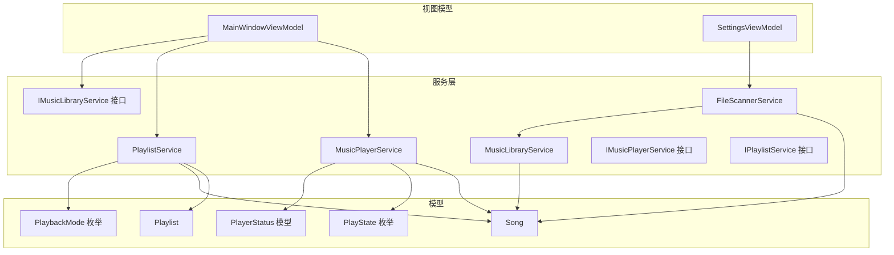
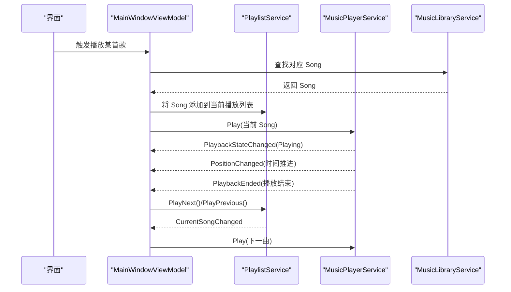
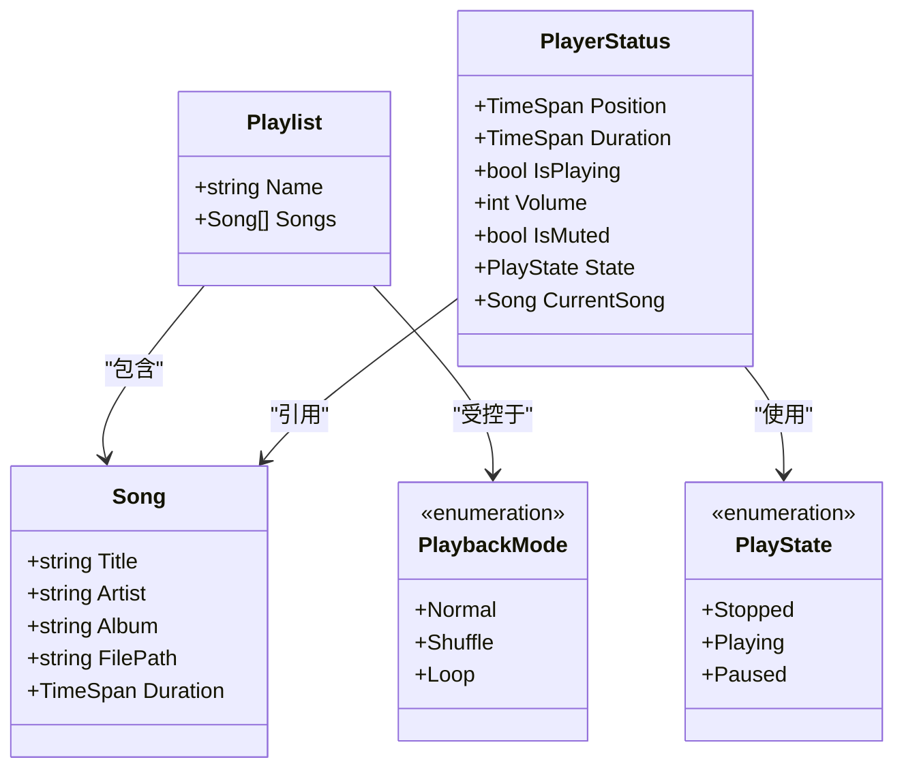
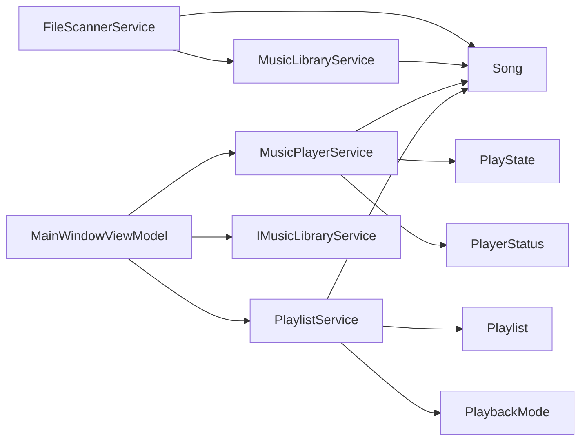

# 数据模型

<cite>
**本文引用的文件**
- [Models/Song.cs](file://Models/Song.cs)
- [Models/Playlist.cs](file://Models/Playlist.cs)
- [Models/PlayState.cs](file://Models/PlayState.cs)
- [Models/PlaybackMode.cs](file://Models/PlaybackMode.cs)
- [Models/PlayerStatus.cs](file://Models/PlayerStatus.cs)
- [Services/FileScannerService.cs](file://Services/FileScannerService.cs)
- [Services/MusicLibraryService.cs](file://Services/MusicLibraryService.cs)
- [Services/MusicPlayerService.cs](file://Services/MusicPlayerService.cs)
- [Services/PlaylistService.cs](file://Services/PlaylistService.cs)
- [Services/IMusicPlayerService.cs](file://Services/IMusicPlayerService.cs)
- [Services/IMusicLibraryService.cs](file://Services/IMusicLibraryService.cs)
- [Services/IPlaylistService.cs](file://Services/IPlaylistService.cs)
- [ViewModels/MainWindowViewModel.cs](file://ViewModels/MainWindowViewModel.cs)
- [ViewModels/SettingsViewModel.cs](file://ViewModels/SettingsViewModel.cs)
</cite>

## 目录
1. [简介](#简介)
2. [项目结构](#项目结构)
3. [核心组件](#核心组件)
4. [架构总览](#架构总览)
5. [详细组件分析](#详细组件分析)
6. [依赖分析](#依赖分析)
7. [性能考虑](#性能考虑)
8. [故障排查指南](#故障排查指南)
9. [结论](#结论)
10. [附录](#附录)

## 简介
本文件为 LocalMusicPlayer 项目的“数据模型”文档，聚焦于以下实体与状态的定义、字段语义、业务规则、关系与依赖，并结合服务层与视图模型的使用方式，给出验证规则、序列化与版本兼容性建议、以及实际使用示例与最佳实践。

## 项目结构
数据模型位于 Models 命名空间，围绕音频曲目（Song）、播放列表（Playlist）、播放状态（PlayState）、播放模式（PlaybackMode）与播放器状态封装（PlayerStatus）构建；服务层负责扫描、播放、播放列表管理与状态同步；视图模型负责 UI 层的交互与状态绑定。

图表来源
- [Models/Song.cs:1-13](file://Models/Song.cs#L1-L13)
- [Models/Playlist.cs:1-10](file://Models/Playlist.cs#L1-L10)
- [Models/PlayState.cs:1-9](file://Models/PlayState.cs#L1-L9)
- [Models/PlaybackMode.cs:1-9](file://Models/PlaybackMode.cs#L1-L9)
- [Models/PlayerStatus.cs:1-15](file://Models/PlayerStatus.cs#L1-L15)
- [Services/FileScannerService.cs:1-103](file://Services/FileScannerService.cs#L1-L103)
- [Services/MusicLibraryService.cs:1-27](file://Services/MusicLibraryService.cs#L1-L27)
- [Services/MusicPlayerService.cs:1-129](file://Services/MusicPlayerService.cs#L1-L129)
- [Services/PlaylistService.cs:1-120](file://Services/PlaylistService.cs#L1-L120)
- [Services/IMusicPlayerService.cs:1-27](file://Services/IMusicPlayerService.cs#L1-L27)
- [Services/IMusicLibraryService.cs:1-14](file://Services/IMusicLibraryService.cs#L1-L14)
- [Services/IPlaylistService.cs:1-22](file://Services/IPlaylistService.cs#L1-L22)
- [ViewModels/MainWindowViewModel.cs:1-231](file://ViewModels/MainWindowViewModel.cs#L1-L231)
- [ViewModels/SettingsViewModel.cs:1-148](file://ViewModels/SettingsViewModel.cs#L1-L148)

章节来源
- [Models/Song.cs:1-13](file://Models/Song.cs#L1-L13)
- [Models/Playlist.cs:1-10](file://Models/Playlist.cs#L1-L10)
- [Models/PlayState.cs:1-9](file://Models/PlayState.cs#L1-L9)
- [Models/PlaybackMode.cs:1-9](file://Models/PlaybackMode.cs#L1-L9)
- [Models/PlayerStatus.cs:1-15](file://Models/PlayerStatus.cs#L1-L15)
- [Services/FileScannerService.cs:1-103](file://Services/FileScannerService.cs#L1-L103)
- [Services/MusicLibraryService.cs:1-27](file://Services/MusicLibraryService.cs#L1-L27)
- [Services/MusicPlayerService.cs:1-129](file://Services/MusicPlayerService.cs#L1-L129)
- [Services/PlaylistService.cs:1-120](file://Services/PlaylistService.cs#L1-L120)
- [ViewModels/MainWindowViewModel.cs:1-231](file://ViewModels/MainWindowViewModel.cs#L1-L231)
- [ViewModels/SettingsViewModel.cs:1-148](file://ViewModels/SettingsViewModel.cs#L1-L148)

## 核心组件
- Song：音频曲目的元数据载体，包含标题、艺术家、专辑、文件路径与时长。
- Playlist：播放列表，包含名称与歌曲集合。
- PlayState：播放状态枚举（停止、播放中、暂停）。
- PlaybackMode：播放模式枚举（普通、随机、单曲循环）。
- PlayerStatus：播放器状态封装，聚合位置、时长、音量、静音、播放状态与当前曲目。

章节来源
- [Models/Song.cs:1-13](file://Models/Song.cs#L1-L13)
- [Models/Playlist.cs:1-10](file://Models/Playlist.cs#L1-L10)
- [Models/PlayState.cs:1-9](file://Models/PlayState.cs#L1-L9)
- [Models/PlaybackMode.cs:1-9](file://Models/PlaybackMode.cs#L1-L9)
- [Models/PlayerStatus.cs:1-15](file://Models/PlayerStatus.cs#L1-L15)

## 架构总览
数据模型通过服务层与视图模型协同工作：FileScannerService 扫描文件并解析 TagLib 元数据生成 Song；MusicLibraryService 维护全局与筛选后的 Song 集合；MusicPlayerService 提供播放控制与事件；PlaylistService 管理播放列表与播放模式；MainWindowViewModel 将播放器状态与 UI 绑定。

图表来源
- [ViewModels/MainWindowViewModel.cs:140-205](file://ViewModels/MainWindowViewModel.cs#L140-L205)
- [Services/PlaylistService.cs:69-119](file://Services/PlaylistService.cs#L69-L119)
- [Services/MusicPlayerService.cs:17-38](file://Services/MusicPlayerService.cs#L17-L38)
- [Services/MusicLibraryService.cs:18-25](file://Services/MusicLibraryService.cs#L18-L25)

## 详细组件分析

### Song 模型：音频文件元数据结构
- 字段与含义
  - Title：曲目标题。若无法从元数据读取，则回退为文件名（不含扩展名）。
  - Artist：第一演奏者（艺人）。可为空字符串。
  - Album：专辑名。可为空字符串。
  - FilePath：本地文件绝对路径。用于播放器加载媒体。
  - Duration：音频总时长（TimeSpan）。
- 业务规则
  - FilePath 必须有效且指向可访问的音频文件。
  - Title 不应为空；当元数据缺失时需进行回退处理。
  - Duration 应由底层媒体库正确解析。
- 数据来源与生成
  - 通过 FileScannerService 使用 TagLib 解析文件元数据生成 Song。
  - 支持扩展名：.mp3、.flac、.wav、.aac、.ogg、.m4a。
- 验证与容错
  - 若解析失败，构造最小可用 Song（仅设置 Title 与 FilePath），避免中断扫描流程。
- 序列化与版本兼容
  - 当前模型为简单类，适合 JSON 序列化；如需持久化，建议引入版本号字段并在反序列化时做向后兼容映射。
- 使用示例与最佳实践
  - 在 UI 中显示时，优先使用 Title/Artist/Album，若为空则显示文件名。
  - 播放前校验 FilePath 存在性与可读性。

章节来源
- [Models/Song.cs:5-12](file://Models/Song.cs#L5-L12)
- [Services/FileScannerService.cs:77-101](file://Services/FileScannerService.cs#L77-L101)
- [Services/FileScannerService.cs:14-14](file://Services/FileScannerService.cs#L14-L14)

### Playlist 模型：播放列表与歌曲集合管理
- 字段与含义
  - Name：播放列表名称。
  - Songs：歌曲集合（List<Song>）。
- 业务规则
  - 支持添加/移除歌曲；索引越界需进行边界检查。
  - 切换当前播放列表时重置当前索引。
  - 当 Songs 为空时，Next/Previous 行为需返回失败。
- 播放模式下的导航
  - Normal：顺序播放，到达末尾返回失败。
  - Shuffle：随机选择下一曲。
  - Loop：循环播放，到达末尾回到开头或反之。
- 序列化与版本兼容
  - Songs 可序列化；建议记录创建时间、版本号，以便迁移。
- 使用示例与最佳实践
  - 新建播放列表后立即 SetCurrentPlaylist，确保后续播放逻辑一致。
  - UI 中根据 CurrentIndex 高亮当前播放项。

章节来源
- [Models/Playlist.cs:5-9](file://Models/Playlist.cs#L5-L9)
- [Services/PlaylistService.cs:47-57](file://Services/PlaylistService.cs#L47-L57)
- [Services/PlaylistService.cs:59-67](file://Services/PlaylistService.cs#L59-L67)
- [Services/PlaylistService.cs:69-95](file://Services/PlaylistService.cs#L69-L95)
- [Services/PlaylistService.cs:97-119](file://Services/PlaylistService.cs#L97-L119)

### PlayState 枚举：播放状态定义与转换
- 定义
  - Stopped：停止
  - Playing：播放中
  - Paused：暂停
- 转换逻辑
  - 底层播放器事件触发状态变更：EndReached -> Stopped；Playing/Paused 事件分别映射到对应状态。
  - UI 通过 PlaybackStateChanged 订阅状态变化，驱动按钮与进度条更新。
- 使用示例与最佳实践
  - UI 根据 IsPlaying（来自 PlayerStatus 或播放器服务）切换图标与交互。

章节来源
- [Models/PlayState.cs:3-8](file://Models/PlayState.cs#L3-L8)
- [Services/MusicPlayerService.cs:33-37](file://Services/MusicPlayerService.cs#L33-L37)
- [Services/MusicPlayerService.cs:21-25](file://Services/MusicPlayerService.cs#L21-L25)
- [ViewModels/MainWindowViewModel.cs:197-207](file://ViewModels/MainWindowViewModel.cs#L197-L207)

### PlaybackMode 枚举：播放模式选项与行为差异
- 定义
  - Normal：普通顺序播放
  - Shuffle：随机播放
  - Loop：单曲循环（当前曲目）
- 行为差异
  - Next/Previous 在不同模式下计算下一曲索引的方式不同。
  - Loop 模式下，Next/Previous 在边界处环绕。
- 使用示例与最佳实践
  - UI 中将“重复”按钮与 Loop 模式关联，“随机”按钮与 Shuffle 模式关联；Normal 作为默认态。

章节来源
- [Models/PlaybackMode.cs:3-8](file://Models/PlaybackMode.cs#L3-L8)
- [Services/PlaylistService.cs:75-90](file://Services/PlaylistService.cs#L75-L90)
- [Services/PlaylistService.cs:103-114](file://Services/PlaylistService.cs#L103-L114)
- [ViewModels/MainWindowViewModel.cs:167-178](file://ViewModels/MainWindowViewModel.cs#L167-L178)

### PlayerStatus 模型：播放器状态封装与查询方法
- 字段与含义
  - Position：当前播放位置
  - Duration：总时长
  - IsPlaying：是否正在播放
  - Volume：音量等级
  - IsMuted：是否静音
  - State：PlayState 枚举
  - CurrentSong：当前播放曲目（可空）
- 查询方法
  - 通过服务层属性与事件组合提供状态查询与订阅能力。
- 使用示例与最佳实践
  - UI 绑定 Position/Duration 显示进度条与时间标签；IsPlaying 控制播放/暂停按钮状态。

章节来源
- [Models/PlayerStatus.cs:5-14](file://Models/PlayerStatus.cs#L5-L14)
- [Services/MusicPlayerService.cs:21-25](file://Services/MusicPlayerService.cs#L21-L25)
- [ViewModels/MainWindowViewModel.cs:209-215](file://ViewModels/MainWindowViewModel.cs#L209-L215)

### 数据模型关系图与依赖

图表来源
- [Models/Song.cs:5-12](file://Models/Song.cs#L5-L12)
- [Models/Playlist.cs:5-9](file://Models/Playlist.cs#L5-L9)
- [Models/PlayState.cs:3-8](file://Models/PlayState.cs#L3-L8)
- [Models/PlaybackMode.cs:3-8](file://Models/PlaybackMode.cs#L3-L8)
- [Models/PlayerStatus.cs:5-14](file://Models/PlayerStatus.cs#L5-L14)

## 依赖分析
- FileScannerService 依赖 TagLib 解析元数据，生成 Song 并写入 MusicLibraryService 的集合。
- MusicLibraryService 提供全局与筛选后的 Song 集合，供视图模型搜索与展示。
- MusicPlayerService 通过 LibVLC 播放媒体，发布状态事件，供视图模型与 PlaylistService 同步。
- PlaylistService 维护当前播放列表、索引与播放模式，决定 Next/Previous 行为。
- MainWindowViewModel 将上述服务整合，驱动 UI 交互与状态绑定。

图表来源
- [Services/FileScannerService.cs:77-101](file://Services/FileScannerService.cs#L77-L101)
- [Services/MusicLibraryService.cs:9-25](file://Services/MusicLibraryService.cs#L9-L25)
- [Services/MusicPlayerService.cs:27-38](file://Services/MusicPlayerService.cs#L27-L38)
- [Services/PlaylistService.cs:47-51](file://Services/PlaylistService.cs#L47-L51)
- [ViewModels/MainWindowViewModel.cs:120-136](file://ViewModels/MainWindowViewModel.cs#L120-L136)

章节来源
- [Services/FileScannerService.cs:1-103](file://Services/FileScannerService.cs#L1-L103)
- [Services/MusicLibraryService.cs:1-27](file://Services/MusicLibraryService.cs#L1-L27)
- [Services/MusicPlayerService.cs:1-129](file://Services/MusicPlayerService.cs#L1-L129)
- [Services/PlaylistService.cs:1-120](file://Services/PlaylistService.cs#L1-L120)
- [ViewModels/MainWindowViewModel.cs:1-231](file://ViewModels/MainWindowViewModel.cs#L1-L231)

## 性能考虑
- 扫描性能
  - 使用异步扫描与进度报告，避免 UI 卡顿。
  - 支持取消令牌，允许用户中断长时间扫描。
- 播放性能
  - 音量与静音切换避免频繁调用底层接口，减少开销。
  - 通过定时轮询（如每 500ms）更新 UI，兼顾实时性与性能。
- 内存与集合
  - 使用 ObservableCollection 便于 UI 绑定；注意在大量数据场景下避免频繁重建集合。
- 元数据解析
  - 对于损坏或不可解析的文件，快速降级为最小可用 Song，保证扫描继续。

章节来源
- [Services/FileScannerService.cs:16-25](file://Services/FileScannerService.cs#L16-L25)
- [Services/FileScannerService.cs:45-72](file://Services/FileScannerService.cs#L45-L72)
- [Services/MusicPlayerService.cs:84-113](file://Services/MusicPlayerService.cs#L84-L113)
- [ViewModels/MainWindowViewModel.cs:209-215](file://ViewModels/MainWindowViewModel.cs#L209-L215)

## 故障排查指南
- 扫描无结果
  - 检查目录是否存在、扩展名是否受支持、是否勾选了子文件夹扫描。
- 无法播放
  - 确认 FilePath 有效且文件存在；检查播放器初始化与 LibVLC 是否成功加载。
- 播放结束后不自动下一曲
  - 确认 PlaybackEnded 事件已订阅；检查 PlaylistService 的 PlayNext 返回值与 CurrentSong 是否为空。
- 随机/循环无效
  - 确认 PlaybackMode 已正确设置；检查索引边界与环绕逻辑。
- UI 不更新
  - 确认属性绑定与事件订阅（PositionChanged、PlaybackStateChanged、CurrentSongChanged）是否生效。

章节来源
- [Services/FileScannerService.cs:32-35](file://Services/FileScannerService.cs#L32-L35)
- [Services/FileScannerService.cs:54-67](file://Services/FileScannerService.cs#L54-L67)
- [Services/MusicPlayerService.cs:40-48](file://Services/MusicPlayerService.cs#L40-L48)
- [Services/PlaylistService.cs:69-95](file://Services/PlaylistService.cs#L69-L95)
- [ViewModels/MainWindowViewModel.cs:197-205](file://ViewModels/MainWindowViewModel.cs#L197-L205)

## 结论
本数据模型以简洁、清晰为核心设计原则：Song 聚焦元数据与文件定位；Playlist 提供播放队列与导航策略；PlayState 与 PlaybackMode 描述播放状态与行为；PlayerStatus 封装播放器关键状态。服务层与视图模型围绕这些模型协同工作，形成完整的播放体验闭环。建议在后续迭代中增强序列化与版本兼容性、优化大库场景下的性能与内存占用，并完善错误提示与日志记录。

## 附录

### 实际使用示例与最佳实践
- 创建并使用播放列表
  - 通过 IPlaylistService.CreatePlaylist 与 SetCurrentPlaylist 初始化播放列表。
  - 使用 AddSongToPlaylist/RemoveSongFromPlaylist 管理歌曲集合。
- 切换播放模式
  - 通过绑定 Repeat/ Shuffle 按钮切换 PlaybackMode，实现 Loop 与 Shuffle。
- 播放控制
  - 通过 IMusicPlayerService 的 Play/Pause/Resume/Stop/Seek 控制播放。
  - 订阅 PlaybackStateChanged 与 PositionChanged 更新 UI。
- 元数据扫描
  - 使用 FileScannerService 扫描指定目录，支持进度与取消；异常文件降级为最小可用 Song。
- 库管理
  - 使用 IMusicLibraryService 的 Songs/FilteredSongs 进行展示与过滤。

章节来源
- [Services/IPlaylistService.cs:9-18](file://Services/IPlaylistService.cs#L9-L18)
- [Services/PlaylistService.cs:36-51](file://Services/PlaylistService.cs#L36-L51)
- [Services/IMusicPlayerService.cs:8-17](file://Services/IMusicPlayerService.cs#L8-L17)
- [Services/MusicPlayerService.cs:40-82](file://Services/MusicPlayerService.cs#L40-L82)
- [Services/FileScannerService.cs:16-25](file://Services/FileScannerService.cs#L16-L25)
- [ViewModels/MainWindowViewModel.cs:144-178](file://ViewModels/MainWindowViewModel.cs#L144-L178)