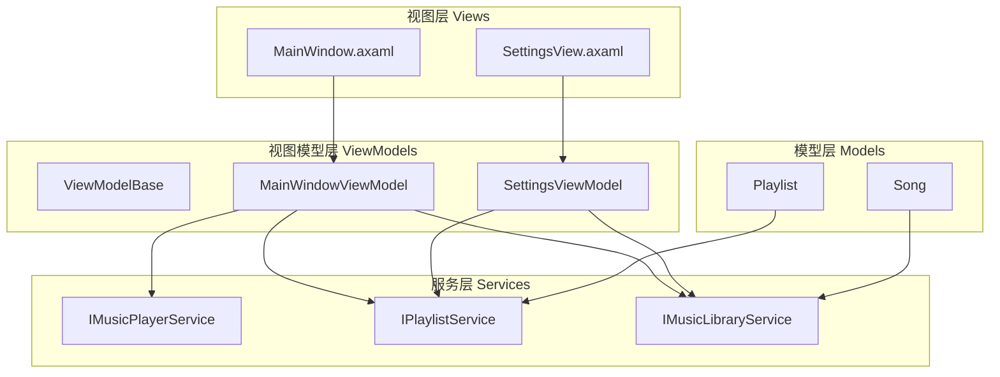
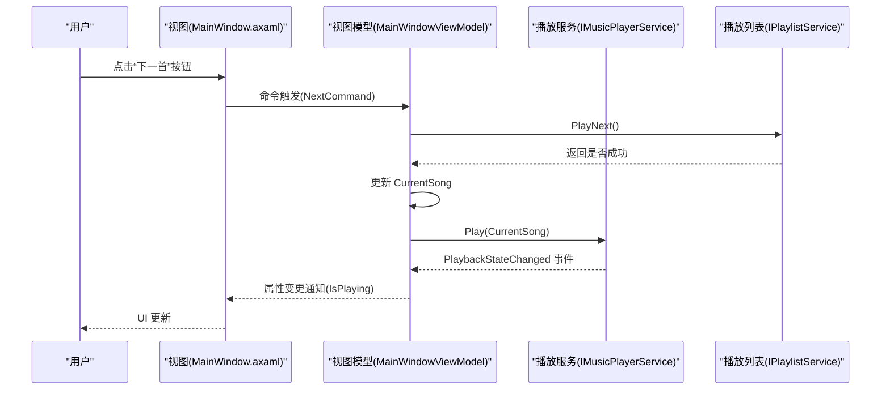
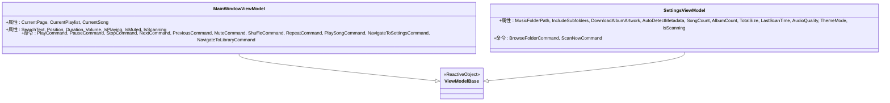
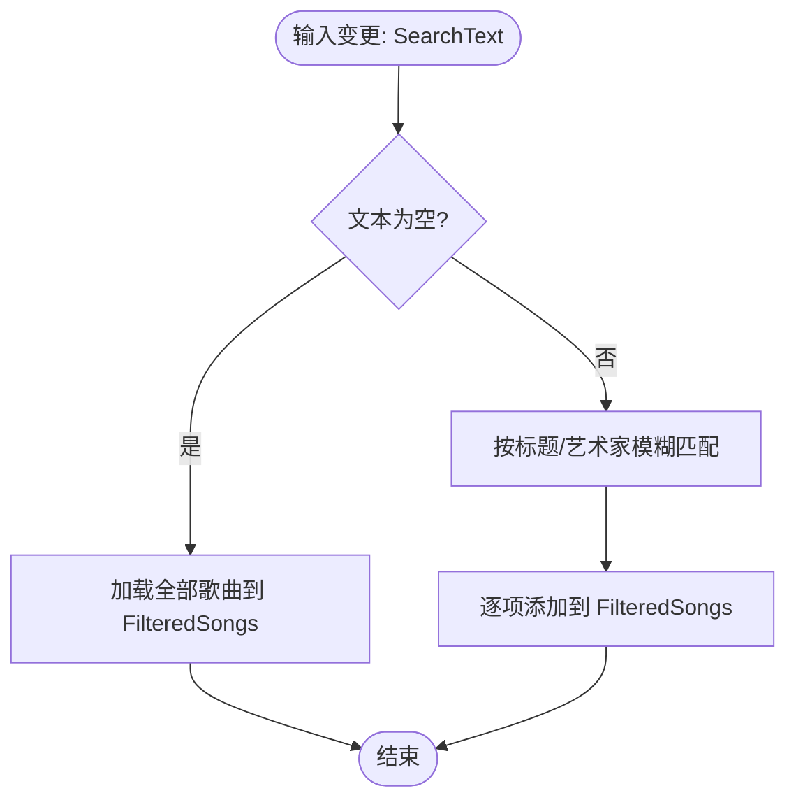
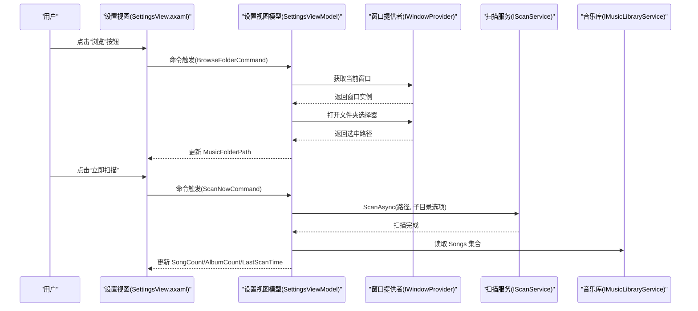
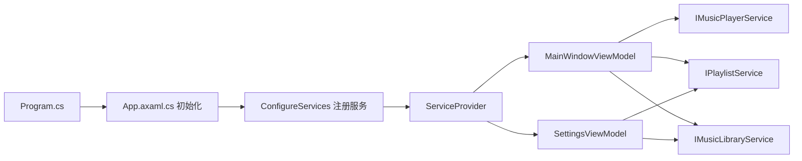

# MVVM架构模式

<cite>
**本文引用的文件**
- [ViewModelBase.cs](file://ViewModels/ViewModelBase.cs)
- [MainWindowViewModel.cs](file://ViewModels/MainWindowViewModel.cs)
- [SettingsViewModel.cs](file://ViewModels/SettingsViewModel.cs)
- [MainWindow.axaml](file://Views/MainWindow.axaml)
- [SettingsView.axaml](file://Views/SettingsView.axaml)
- [Song.cs](file://Models/Song.cs)
- [Playlist.cs](file://Models/Playlist.cs)
- [IMusicPlayerService.cs](file://Services/IMusicPlayerService.cs)
- [IPlaylistService.cs](file://Services/IPlaylistService.cs)
- [IMusicLibraryService.cs](file://Services/IMusicLibraryService.cs)
- [BoolToOpacityConverter.cs](file://Converters/BoolToOpacityConverter.cs)
- [ClickBehavior.cs](file://Behaviors/ClickBehavior.cs)
- [App.axaml.cs](file://App.axaml.cs)
- [Program.cs](file://Program.cs)
- [ViewLocator.cs](file://ViewLocator.cs)
</cite>

## 目录
1. [引言](#引言)
2. [项目结构](#项目结构)
3. [核心组件](#核心组件)
4. [架构总览](#架构总览)
5. [详细组件分析](#详细组件分析)
6. [依赖关系分析](#依赖关系分析)
7. [性能考虑](#性能考虑)
8. [故障排查指南](#故障排查指南)
9. [结论](#结论)
10. [附录](#附录)

## 引言
本文件围绕 LocalMusicPlayer 项目的 MVVM 架构进行系统化梳理，重点阐释 Model-View-ViewModel 的职责划分与数据流，详解 ViewModelBase 基类设计与属性变更通知机制，剖析 MainWindowViewModel 与 SettingsViewModel 的命令绑定、属性封装与业务协调，并结合 XAML 数据绑定（单向、双向、命令）说明其在界面中的应用。最后总结 MVVM 最佳实践与常见陷阱，帮助读者在保持可维护性的同时提升性能与稳定性。

## 项目结构
LocalMusicPlayer 采用基于 Avalonia UI 的桌面应用，遵循 MVVM 分层组织：
- 模型层 Models：承载不可变或可变的数据实体，如歌曲、播放列表等。
- 视图层 Views：XAML 界面与后台代码，负责展示与交互。
- 视图模型层 ViewModels：继承自 ViewModelBase，封装状态、命令与业务逻辑。
- 服务层 Services：抽象播放、扫描、库管理等能力，通过依赖注入提供。
- 资源与工具：转换器 Converters、行为 Behaviors、样式 Styles、辅助工具 Helpers。

图表来源
- [MainWindow.axaml:1-78](file://Views/MainWindow.axaml#L1-L78)
- [SettingsView.axaml:1-372](file://Views/SettingsView.axaml#L1-L372)
- [ViewModelBase.cs:1-8](file://ViewModels/ViewModelBase.cs#L1-L8)
- [MainWindowViewModel.cs:1-231](file://ViewModels/MainWindowViewModel.cs#L1-L231)
- [SettingsViewModel.cs:1-148](file://ViewModels/SettingsViewModel.cs#L1-L148)
- [Song.cs:1-13](file://Models/Song.cs#L1-L13)
- [Playlist.cs:1-10](file://Models/Playlist.cs#L1-L10)
- [IMusicPlayerService.cs:1-27](file://Services/IMusicPlayerService.cs#L1-L27)
- [IPlaylistService.cs:1-22](file://Services/IPlaylistService.cs#L1-L22)
- [IMusicLibraryService.cs:1-14](file://Services/IMusicLibraryService.cs#L1-L14)

章节来源
- [MainWindow.axaml:1-78](file://Views/MainWindow.axaml#L1-L78)
- [SettingsView.axaml:1-372](file://Views/SettingsView.axaml#L1-L372)
- [ViewModelBase.cs:1-8](file://ViewModels/ViewModelBase.cs#L1-L8)
- [MainWindowViewModel.cs:1-231](file://ViewModels/MainWindowViewModel.cs#L1-L231)
- [SettingsViewModel.cs:1-148](file://ViewModels/SettingsViewModel.cs#L1-L148)
- [Song.cs:1-13](file://Models/Song.cs#L1-L13)
- [Playlist.cs:1-10](file://Models/Playlist.cs#L1-L10)
- [IMusicPlayerService.cs:1-27](file://Services/IMusicPlayerService.cs#L1-L27)
- [IPlaylistService.cs:1-22](file://Services/IPlaylistService.cs#L1-L22)
- [IMusicLibraryService.cs:1-14](file://Services/IMusicLibraryService.cs#L1-L14)

## 核心组件
- ViewModelBase：作为所有视图模型的基类，继承 ReactiveObject，提供统一的属性变更通知能力，简化派生类的实现。
- MainWindowViewModel：主界面视图模型，负责页面切换、播放控制、搜索过滤、音量同步、播放进度更新等；通过 ReactiveCommand 绑定用户交互。
- SettingsViewModel：设置页视图模型，负责音乐库扫描路径选择、扫描选项、扫描执行与统计信息展示；同样使用 ReactiveCommand 处理异步操作。
- 服务接口：IMusicPlayerService、IPlaylistService、IMusicLibraryService 抽象播放、播放列表与音乐库的核心能力，降低视图模型耦合度。
- 模型对象：Song、Playlist 等承载数据，便于在视图中直接绑定显示。

章节来源
- [ViewModelBase.cs:1-8](file://ViewModels/ViewModelBase.cs#L1-L8)
- [MainWindowViewModel.cs:1-231](file://ViewModels/MainWindowViewModel.cs#L1-L231)
- [SettingsViewModel.cs:1-148](file://ViewModels/SettingsViewModel.cs#L1-L148)
- [IMusicPlayerService.cs:1-27](file://Services/IMusicPlayerService.cs#L1-L27)
- [IPlaylistService.cs:1-22](file://Services/IPlaylistService.cs#L1-L22)
- [IMusicLibraryService.cs:1-14](file://Services/IMusicLibraryService.cs#L1-L14)
- [Song.cs:1-13](file://Models/Song.cs#L1-L13)
- [Playlist.cs:1-10](file://Models/Playlist.cs#L1-L10)

## 架构总览
MVVM 在 LocalMusicPlayer 中的落地要点：
- 视图仅负责呈现与事件转发，不包含业务逻辑。
- 视图模型持有状态与命令，协调服务完成业务动作。
- 服务通过接口抽象，便于替换与测试。
- 使用 ReactiveUI 的 ReactiveObject 与 ReactiveCommand 实现响应式数据绑定与命令处理。

图表来源
- [MainWindow.axaml:1-78](file://Views/MainWindow.axaml#L1-L78)
- [MainWindowViewModel.cs:144-161](file://ViewModels/MainWindowViewModel.cs#L144-L161)
- [IMusicPlayerService.cs:1-27](file://Services/IMusicPlayerService.cs#L1-L27)
- [IPlaylistService.cs:1-22](file://Services/IPlaylistService.cs#L1-L22)

## 详细组件分析

### ViewModelBase 基类设计
- 设计理念：以最小实现提供统一的属性变更通知能力，派生类只需关注业务状态与命令，无需重复实现 INotifyPropertyChanged。
- 关键点：继承 ReactiveObject，派生类通过 RaiseAndSetIfChanged 实现属性变更通知，避免手动调用 OnPropertyChanged。
- 适用范围：所有视图模型均继承自该基类，确保一致的响应式行为。

图表来源
- [ViewModelBase.cs:1-8](file://ViewModels/ViewModelBase.cs#L1-L8)
- [MainWindowViewModel.cs:1-231](file://ViewModels/MainWindowViewModel.cs#L1-L231)
- [SettingsViewModel.cs:1-148](file://ViewModels/SettingsViewModel.cs#L1-L148)

章节来源
- [ViewModelBase.cs:1-8](file://ViewModels/ViewModelBase.cs#L1-L8)

### MainWindowViewModel 实现细节
- 页面切换：通过 CurrentPage 与 NavigateToSettingsCommand/NavigateToLibraryCommand 切换视图内容。
- 播放控制：PlayCommand/PauseCommand/StopCommand 直接委托给播放服务；NextCommand/PreviousCommand 协调播放列表与当前歌曲。
- 音量同步：Volume 属性变更时调用播放服务 SetVolume，并保持 IsMuted 与播放服务状态一致。
- 进度更新：使用 Observable.Interval 定期从播放服务读取 Position 与 Duration 并刷新 UI。
- 搜索过滤：SearchText 变更时调用 FilterSongs 将结果写入 Library.FilteredSongs。
- 事件订阅：监听播放服务的 PlaybackEnded 与 PlaybackStateChanged 事件，驱动 UI 状态更新。

图表来源
- [MainWindowViewModel.cs:218-229](file://ViewModels/MainWindowViewModel.cs#L218-L229)

章节来源
- [MainWindowViewModel.cs:1-231](file://ViewModels/MainWindowViewModel.cs#L1-L231)
- [IMusicPlayerService.cs:1-27](file://Services/IMusicPlayerService.cs#L1-L27)
- [IPlaylistService.cs:1-22](file://Services/IPlaylistService.cs#L1-L22)
- [IMusicLibraryService.cs:1-14](file://Services/IMusicLibraryService.cs#L1-L14)

### SettingsViewModel 实现细节
- 文件夹浏览：BrowseFolderCommand 通过窗口提供者打开文件夹选择器，将选中路径写入 MusicFolderPath。
- 扫描执行：ScanNowCommand 校验路径后调用扫描服务异步扫描，期间 IsScanning 控制按钮可用性；扫描完成后更新统计信息与最后扫描时间。
- 设置项：包含子目录扫描、专辑封面下载、元数据自动检测等布尔选项，以及音频质量与主题模式等字符串选项。

图表来源
- [SettingsView.axaml:1-372](file://Views/SettingsView.axaml#L1-L372)
- [SettingsViewModel.cs:107-146](file://ViewModels/SettingsViewModel.cs#L107-L146)
- [App.axaml.cs:18-39](file://App.axaml.cs#L18-L39)

章节来源
- [SettingsViewModel.cs:1-148](file://ViewModels/SettingsViewModel.cs#L1-L148)
- [SettingsView.axaml:1-372](file://Views/SettingsView.axaml#L1-L372)
- [App.axaml.cs:18-39](file://App.axaml.cs#L18-L39)

### XAML 数据绑定工作原理
- 单向绑定：用于只读或从模型到视图的展示，例如设置页中歌曲数量、专辑数量、总大小与最后扫描时间的显示。
- 双向绑定：用于用户可编辑的输入控件，例如 ToggleSwitch 绑定到 IncludeSubfolders、DownloadAlbumArtwork、AutoDetectMetadata 等布尔属性。
- 命令绑定：用于触发业务逻辑，例如按钮绑定到 NavigateToSettingsCommand、NavigateToLibraryCommand、ScanNowCommand 等。
- 设计时 DataContext：在设计时为视图提供 DataContext，便于可视化设计器预览绑定效果。
- 视图定位：通过 ViewLocator 将视图模型与视图按约定自动映射，减少手工绑定代码。

章节来源
- [MainWindow.axaml:13-76](file://Views/MainWindow.axaml#L13-L76)
- [SettingsView.axaml:10-205](file://Views/SettingsView.axaml#L10-L205)
- [ViewLocator.cs:8-39](file://ViewLocator.cs#L8-L39)

### 转换器与行为
- 布尔到不透明度转换器：根据布尔值返回不同不透明度，常用于控制控件的视觉状态。
- 自定义行为：ClickBehavior 展示了如何在 Avalonia 中扩展控件属性，便于在 XAML 中复用。

章节来源
- [BoolToOpacityConverter.cs:1-21](file://Converters/BoolToOpacityConverter.cs#L1-L21)
- [ClickBehavior.cs:1-17](file://Behaviors/ClickBehavior.cs#L1-L17)

## 依赖关系分析
- 视图模型依赖注入：通过 Program 与 App 的初始化流程配置服务容器，MainWindowViewModel 与 SettingsViewModel 由容器解析。
- 视图与视图模型绑定：MainWindow.axaml 通过 x:DataType 指定数据类型，SettingsView.axaml 同理；ViewLocator 将视图模型与视图按约定映射。
- 服务接口解耦：播放、播放列表、音乐库通过接口注入，便于替换实现与单元测试。

图表来源
- [Program.cs:1-20](file://Program.cs#L1-L20)
- [App.axaml.cs:41-51](file://App.axaml.cs#L41-L51)
- [MainWindowViewModel.cs:120-130](file://ViewModels/MainWindowViewModel.cs#L120-L130)
- [SettingsViewModel.cs:107-114](file://ViewModels/SettingsViewModel.cs#L107-L114)

章节来源
- [Program.cs:1-20](file://Program.cs#L1-L20)
- [App.axaml.cs:18-51](file://App.axaml.cs#L18-L51)
- [ViewLocator.cs:8-39](file://ViewLocator.cs#L8-L39)

## 性能考虑
- 响应式轮询：MainWindowViewModel 使用定时器周期性读取播放进度，建议根据 UI 刷新需求调整频率，避免过度刷新导致 CPU 占用。
- 搜索过滤：FilterSongs 对集合进行全量筛选，建议在大数据集上引入节流或分页策略，减少 UI 卡顿。
- 命令异步：ScanNowCommand 使用异步执行扫描，避免阻塞 UI 线程；同时通过 IsScanning 控制按钮状态，防止重复触发。
- 事件订阅：注意在视图模型生命周期结束时取消事件订阅，防止内存泄漏（当前代码未见显式取消订阅，建议补充）。
- 绑定转换器：转换器应尽量轻量，避免复杂计算；必要时可缓存中间结果。

## 故障排查指南
- 命令无法触发：检查 XAML 中 Command 绑定的目标命令是否存在且已正确初始化；确认视图的 DataContext 已设置为对应的视图模型。
- 属性变更不生效：确认属性使用 RaiseAndSetIfChanged 更新，并在 XAML 中使用正确的绑定路径；避免直接赋值而不触发通知。
- 服务未注入：检查 App.axaml.cs 中 ConfigureService 是否注册了所需服务；确认 Program.cs 中启用了 ReactiveUI。
- 视图未显示：确认 ViewLocator 的命名约定与实际类型一致；检查 x:DataType 与视图模型类型匹配。
- 内存泄漏：长时间运行后出现异常占用，检查事件订阅是否在合适时机解除；对长生命周期对象的集合使用弱引用或及时清理。

章节来源
- [MainWindow.axaml:13-76](file://Views/MainWindow.axaml#L13-L76)
- [SettingsView.axaml:10-205](file://Views/SettingsView.axaml#L10-L205)
- [App.axaml.cs:18-51](file://App.axaml.cs#L18-L51)
- [Program.cs:14-20](file://Program.cs#L14-L20)
- [ViewLocator.cs:8-39](file://ViewLocator.cs#L8-L39)

## 结论
LocalMusicPlayer 的 MVVM 架构通过清晰的职责分离与响应式绑定实现了良好的可维护性与可扩展性。ViewModelBase 提供统一的通知机制，MainWindowViewModel 与 SettingsViewModel 将业务逻辑与界面行为解耦，配合服务接口与依赖注入，使系统具备良好的测试性与演进空间。建议在后续开发中进一步完善事件订阅的生命周期管理与性能优化策略，以获得更稳定的用户体验。

## 附录
- 最佳实践
  - 使用 ReactiveObject 与 ReactiveCommand 统一响应式实现。
  - 将业务逻辑集中在视图模型，避免在视图后台代码中嵌入复杂逻辑。
  - 通过接口抽象服务，便于替换与测试。
  - 合理使用异步命令与进度指示，避免 UI 阻塞。
- 常见陷阱
  - 忘记触发属性变更通知导致 UI 不更新。
  - 事件订阅未解除造成内存泄漏。
  - 过度频繁的轮询与过滤引发性能问题。
  - 命名约定不一致导致视图与视图模型映射失败。