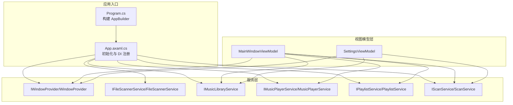
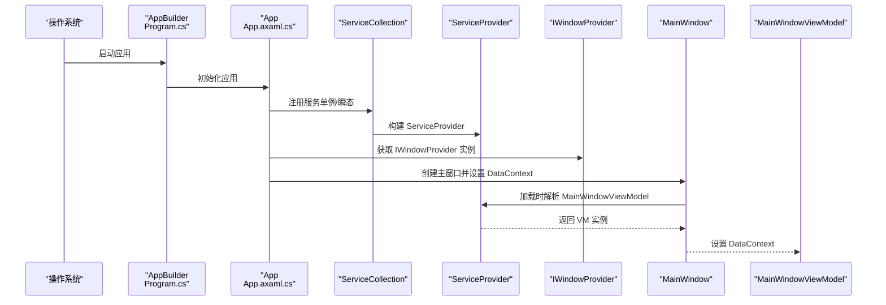
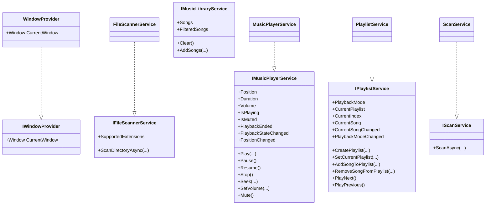
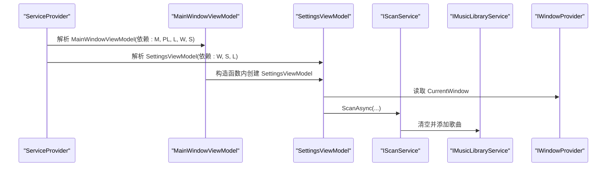
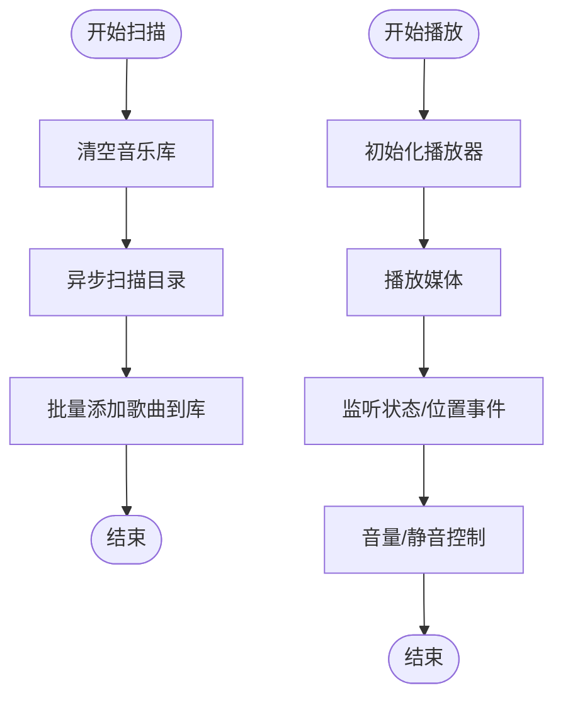
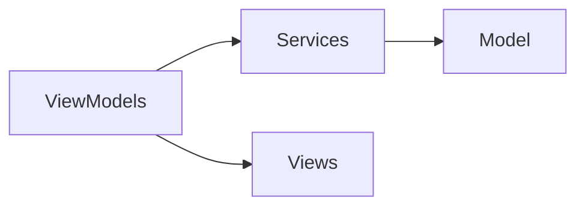

# 依赖注入容器

<cite>
**本文引用的文件**
- [Program.cs](file://Program.cs)
- [App.axaml.cs](file://App.axaml.cs)
- [IWindowProvider.cs](file://Services/IWindowProvider.cs)
- [WindowProvider.cs](file://Services/WindowProvider.cs)
- [IFileScannerService.cs](file://Services/IFileScannerService.cs)
- [FileScannerService.cs](file://Services/FileScannerService.cs)
- [IMusicLibraryService.cs](file://Services/IMusicLibraryService.cs)
- [IMusicPlayerService.cs](file://Services/IMusicPlayerService.cs)
- [MusicPlayerService.cs](file://Services/MusicPlayerService.cs)
- [IPlaylistService.cs](file://Services/IPlaylistService.cs)
- [PlaylistService.cs](file://Services/PlaylistService.cs)
- [IScanService.cs](file://Services/IScanService.cs)
- [ScanService.cs](file://Services/ScanService.cs)
- [MainWindowViewModel.cs](file://ViewModels/MainWindowViewModel.cs)
- [SettingsViewModel.cs](file://ViewModels/SettingsViewModel.cs)
</cite>

## 目录
1. [简介](#简介)
2. [项目结构](#项目结构)
3. [核心组件](#核心组件)
4. [架构总览](#架构总览)
5. [详细组件分析](#详细组件分析)
6. [依赖关系分析](#依赖关系分析)
7. [性能考量](#性能考量)
8. [故障排除指南](#故障排除指南)
9. [结论](#结论)
10. [附录](#附录)

## 简介
本文件围绕 LocalMusicPlayer 项目中的依赖注入（DI）容器进行系统化说明，重点基于 Microsoft.Extensions.DependencyInjection 的配置与使用，涵盖以下主题：
- ServiceCollection 的注册方式与 ServiceProvider 的构建流程
- 生命周期策略：Singleton 单例、Transient 瞬态的适用场景与选择依据
- 接口抽象设计原则与实现方式（如 IWindowProvider、IFileScannerService 等）
- 在 MVVM 架构中 ViewModel 的自动注入与构造函数注入实践
- 配置示例路径、循环依赖检测与性能监控建议

## 项目结构
LocalMusicPlayer 采用桌面应用框架与 MVVM 模式，依赖注入主要集中在应用启动阶段完成服务注册，并在主窗口加载时解析 ViewModel 的 DataContext。

图表来源
- [App.axaml.cs:41-51](file://App.axaml.cs#L41-L51)
- [MainWindowViewModel.cs:120-125](file://ViewModels/MainWindowViewModel.cs#L120-L125)
- [SettingsViewModel.cs:107-111](file://ViewModels/SettingsViewModel.cs#L107-L111)

章节来源
- [Program.cs:14-20](file://Program.cs#L14-L20)
- [App.axaml.cs:18-51](file://App.axaml.cs#L18-L51)

## 核心组件
- 服务注册与构建
  - 在应用初始化完成后，通过 ServiceCollection 完成服务注册，并构建 ServiceProvider。
  - 使用 GetRequiredService 解析所需服务实例，随后用于设置主窗体与 DataContext。
- 生命周期策略
  - Singleton：IWindowProvider、IFileScannerService、IMusicPlayerService、IPlaylistService、IMusicLibraryService、IScanService 均以单例注册，确保全局共享状态与资源复用。
  - Transient：MainWindowViewModel、SettingsViewModel 以瞬态注册，每次解析都创建新实例，适合无共享状态或轻量级 ViewModel。
- 接口抽象
  - 通过接口定义服务契约，便于替换实现、测试与解耦。
  - 示例接口：IWindowProvider、IFileScannerService、IMusicLibraryService、IMusicPlayerService、IPlaylistService、IScanService。
- MVVM 中的注入
  - MainWindowViewModel 与 SettingsViewModel 通过构造函数注入所需服务，形成清晰的依赖关系与职责分离。

章节来源
- [App.axaml.cs:22-51](file://App.axaml.cs#L22-L51)
- [MainWindowViewModel.cs:120-125](file://ViewModels/MainWindowViewModel.cs#L120-L125)
- [SettingsViewModel.cs:107-111](file://ViewModels/SettingsViewModel.cs#L107-L111)

## 架构总览
下图展示了应用启动到 ViewModel 绑定的关键流程，以及依赖注入在其中的作用。

图表来源
- [Program.cs:14-20](file://Program.cs#L14-L20)
- [App.axaml.cs:18-39](file://App.axaml.cs#L18-L39)
- [App.axaml.cs:41-51](file://App.axaml.cs#L41-L51)

## 详细组件分析

### 服务注册与构建流程
- 注册点：在应用初始化完成后，集中调用 ConfigureServices 完成所有服务注册。
- 构建点：通过 BuildServiceProvider 创建容器，随后使用 GetRequiredService 获取服务实例。
- 典型用法：先解析 IWindowProvider 并设置当前窗口，再在主窗口 Loaded 事件中解析 MainWindowViewModel 并绑定 DataContext。

章节来源
- [App.axaml.cs:18-39](file://App.axaml.cs#L18-L39)
- [App.axaml.cs:41-51](file://App.axaml.cs#L41-L51)

### 生命周期策略与应用场景
- Singleton（单例）
  - 适用：跨模块共享的状态对象、昂贵资源的持有者、无状态工具类。
  - 项目实践：IWindowProvider、IFileScannerService、IMusicPlayerService、IPlaylistService、IMusicLibraryService、IScanService。
  - 注意：避免在单例中持有与 UI 或请求上下文相关的短生命周期对象；若需上下文感知，请使用 Scoped 或在调用处传参。
- Transient（瞬态）
  - 适用：轻量、无共享状态的对象，如 ViewModel、临时工具类。
  - 项目实践：MainWindowViewModel、SettingsViewModel。
  - 注意：每次解析都会创建新实例，避免在其中缓存不应共享的数据。

章节来源
- [App.axaml.cs:43-50](file://App.axaml.cs#L43-L50)

### 接口抽象设计与实现
- IWindowProvider
  - 职责：提供当前主窗口引用，供视图模型访问存储提供程序等 UI 能力。
  - 实现：WindowProvider 将 CurrentWindow 设为可读写属性。
- IFileScannerService
  - 职责：扫描指定目录并提取歌曲元数据，支持进度与取消令牌。
  - 实现：FileScannerService 提供多种重载方法与扩展名白名单。
- IMusicLibraryService
  - 职责：维护歌曲集合与过滤后的集合，支持清空与批量添加。
- IMusicPlayerService
  - 职责：封装底层播放器能力，暴露播放控制与状态事件。
  - 实现：MusicPlayerService 内部持有播放器实例并处理音量、静音、位置变化等。
- IPlaylistService
  - 职责：管理播放列表、当前索引、播放模式（顺序/随机/单曲循环），并触发变更事件。
  - 实现：PlaylistService 提供播放下一首/上一首、随机播放、循环播放等逻辑。
- IScanService
  - 职责：协调文件扫描与库更新。
  - 实现：ScanService 调用 IFileScannerService 扫描后写入 IMusicLibraryService。

图表来源
- [IWindowProvider.cs:5-8](file://Services/IWindowProvider.cs#L5-L8)
- [WindowProvider.cs:5-8](file://Services/WindowProvider.cs#L5-L8)
- [IFileScannerService.cs:9-16](file://Services/IFileScannerService.cs#L9-L16)
- [FileScannerService.cs:12-14](file://Services/FileScannerService.cs#L12-L14)
- [IMusicLibraryService.cs:7-13](file://Services/IMusicLibraryService.cs#L7-L13)
- [IMusicPlayerService.cs:6-27](file://Services/IMusicPlayerService.cs#L6-L27)
- [MusicPlayerService.cs:7-38](file://Services/MusicPlayerService.cs#L7-L38)
- [IPlaylistService.cs:7-21](file://Services/IPlaylistService.cs#L7-L21)
- [PlaylistService.cs:7-45](file://Services/PlaylistService.cs#L7-L45)
- [IScanService.cs:5-8](file://Services/IScanService.cs#L5-L8)
- [ScanService.cs:6-22](file://Services/ScanService.cs#L6-L22)

章节来源
- [IWindowProvider.cs:5-8](file://Services/IWindowProvider.cs#L5-L8)
- [WindowProvider.cs:5-8](file://Services/WindowProvider.cs#L5-L8)
- [IFileScannerService.cs:9-16](file://Services/IFileScannerService.cs#L9-L16)
- [FileScannerService.cs:12-75](file://Services/FileScannerService.cs#L12-L75)
- [IMusicLibraryService.cs:7-13](file://Services/IMusicLibraryService.cs#L7-L13)
- [IMusicPlayerService.cs:6-27](file://Services/IMusicPlayerService.cs#L6-L27)
- [MusicPlayerService.cs:7-129](file://Services/MusicPlayerService.cs#L7-L129)
- [IPlaylistService.cs:7-21](file://Services/IPlaylistService.cs#L7-L21)
- [PlaylistService.cs:7-120](file://Services/PlaylistService.cs#L7-L120)
- [IScanService.cs:5-8](file://Services/IScanService.cs#L5-L8)
- [ScanService.cs:6-23](file://Services/ScanService.cs#L6-L23)

### MVVM 架构中的依赖注入
- MainWindowViewModel
  - 通过构造函数注入 IMusicPlayerService、IPlaylistService、IMusicLibraryService、IWindowProvider、IScanService。
  - 在构造函数中创建 SettingsViewModel 并设置当前页面，体现 ViewModel 间的协作。
- SettingsViewModel
  - 通过构造函数注入 IWindowProvider、IScanService、IMusicLibraryService。
  - 使用 IWindowProvider.CurrentWindow 访问存储提供程序以打开文件夹选择器。

图表来源
- [MainWindowViewModel.cs:120-133](file://ViewModels/MainWindowViewModel.cs#L120-L133)
- [SettingsViewModel.cs:107-114](file://ViewModels/SettingsViewModel.cs#L107-L114)
- [ScanService.cs:17-22](file://Services/ScanService.cs#L17-L22)

章节来源
- [MainWindowViewModel.cs:120-133](file://ViewModels/MainWindowViewModel.cs#L120-L133)
- [SettingsViewModel.cs:107-114](file://ViewModels/SettingsViewModel.cs#L107-L114)

### 复杂逻辑组件：扫描与播放控制
- 扫描流程（ScanService）
  - 清空音乐库 -> 异步扫描文件 -> 添加到音乐库。
- 播放控制（MusicPlayerService）
  - 初始化底层播放器 -> 播放媒体 -> 处理状态事件 -> 音量与静音控制 -> 位置变化通知。

图表来源
- [ScanService.cs:17-22](file://Services/ScanService.cs#L17-L22)
- [MusicPlayerService.cs:27-118](file://Services/MusicPlayerService.cs#L27-L118)

章节来源
- [ScanService.cs:6-23](file://Services/ScanService.cs#L6-L23)
- [MusicPlayerService.cs:7-129](file://Services/MusicPlayerService.cs#L7-L129)

## 依赖关系分析
- 低耦合高内聚
  - 通过接口隔离具体实现，服务间通过接口交互，降低直接依赖。
- 控制反转
  - 由容器负责实例化与注入，避免手动 new 导致的紧耦合。
- 可测试性
  - 可针对接口编写单元测试，替换为模拟实现。

图表来源
- [MainWindowViewModel.cs:120-133](file://ViewModels/MainWindowViewModel.cs#L120-L133)
- [SettingsViewModel.cs:107-114](file://ViewModels/SettingsViewModel.cs#L107-L114)
- [ScanService.cs:11-14](file://Services/ScanService.cs#L11-L14)
- [PlaylistService.cs:7-45](file://Services/PlaylistService.cs#L7-L45)

章节来源
- [MainWindowViewModel.cs:120-133](file://ViewModels/MainWindowViewModel.cs#L120-L133)
- [SettingsViewModel.cs:107-114](file://ViewModels/SettingsViewModel.cs#L107-L114)
- [ScanService.cs:6-23](file://Services/ScanService.cs#L6-L23)
- [PlaylistService.cs:7-120](file://Services/PlaylistService.cs#L7-L120)

## 性能考量
- 单例复用
  - 对昂贵资源（如播放器、文件扫描器）使用单例可减少重复初始化开销。
- 瞬态对象
  - ViewModel 以瞬态注册，避免在 UI 层产生不必要的长生命周期对象。
- 异步与取消
  - 文件扫描支持取消令牌与进度回调，避免阻塞 UI 线程。
- 事件风暴
  - 播放位置与状态事件订阅频率较高，注意在 ViewModel 中合理调度与节流。

## 故障排除指南
- 循环依赖
  - 现象：容器在解析服务时出现异常，提示循环依赖。
  - 排查：检查服务构造函数参数是否相互依赖；拆分职责或引入中间层。
  - 项目现状：未见显式循环依赖迹象，但需避免在 ViewModel 构造函数中互相 new。
- 服务解析失败
  - 现象：GetRequiredService 抛出异常。
  - 排查：确认服务已在 ConfigureServices 中注册；检查泛型类型是否匹配。
- 生命周期误用
  - 现象：单例持有短生命周期对象导致内存泄漏或状态污染。
  - 排查：将 UI 相关对象改为瞬态或按需传入；必要时使用工厂委托。
- 性能问题
  - 现象：扫描卡顿、UI 响应慢。
  - 排查：确保扫描在后台线程执行；对频繁事件进行节流；避免在单例中缓存过多 UI 状态。

## 结论
LocalMusicPlayer 的依赖注入实践体现了清晰的分层与接口抽象，通过 ServiceCollection 的集中注册与 ServiceProvider 的按需解析，实现了 MVVM 架构下的松耦合与可测试性。合理选择 Singleton 与 Transient 生命周期，配合接口隔离与构造函数注入，使系统具备良好的扩展性与维护性。

## 附录
- 配置示例路径
  - 服务注册与构建：[App.axaml.cs:41-51](file://App.axaml.cs#L41-L51)
  - 主窗口加载后解析 ViewModel：[App.axaml.cs:31-35](file://App.axaml.cs#L31-L35)
  - ViewModel 构造函数注入示例：
    - [MainWindowViewModel.cs:120-125](file://ViewModels/MainWindowViewModel.cs#L120-L125)
    - [SettingsViewModel.cs:107-111](file://ViewModels/SettingsViewModel.cs#L107-L111)
- 关键接口与实现对照
  - [IWindowProvider.cs:5-8](file://Services/IWindowProvider.cs#L5-L8) ↔ [WindowProvider.cs:5-8](file://Services/WindowProvider.cs#L5-8)
  - [IFileScannerService.cs:9-16](file://Services/IFileScannerService.cs#L9-L16) ↔ [FileScannerService.cs:12-75](file://Services/FileScannerService.cs#L12-L75)
  - [IMusicLibraryService.cs:7-13](file://Services/IMusicLibraryService.cs#L7-L13)
  - [IMusicPlayerService.cs:6-27](file://Services/IMusicPlayerService.cs#L6-L27) ↔ [MusicPlayerService.cs:7-129](file://Services/MusicPlayerService.cs#L7-L129)
  - [IPlaylistService.cs:7-21](file://Services/IPlaylistService.cs#L7-L21) ↔ [PlaylistService.cs:7-120](file://Services/PlaylistService.cs#L7-L120)
  - [IScanService.cs:5-8](file://Services/IScanService.cs#L5-L8) ↔ [ScanService.cs:6-23](file://Services/ScanService.cs#L6-L23)