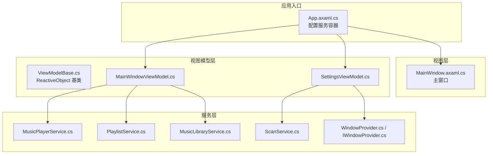
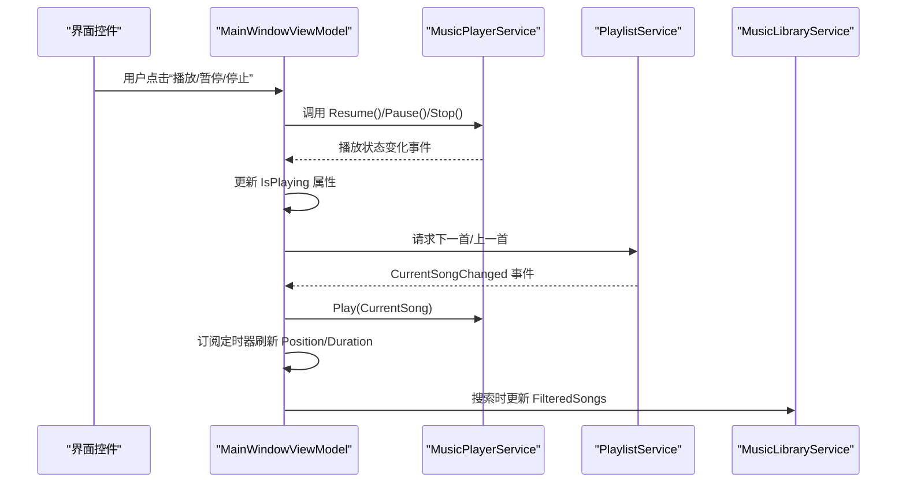
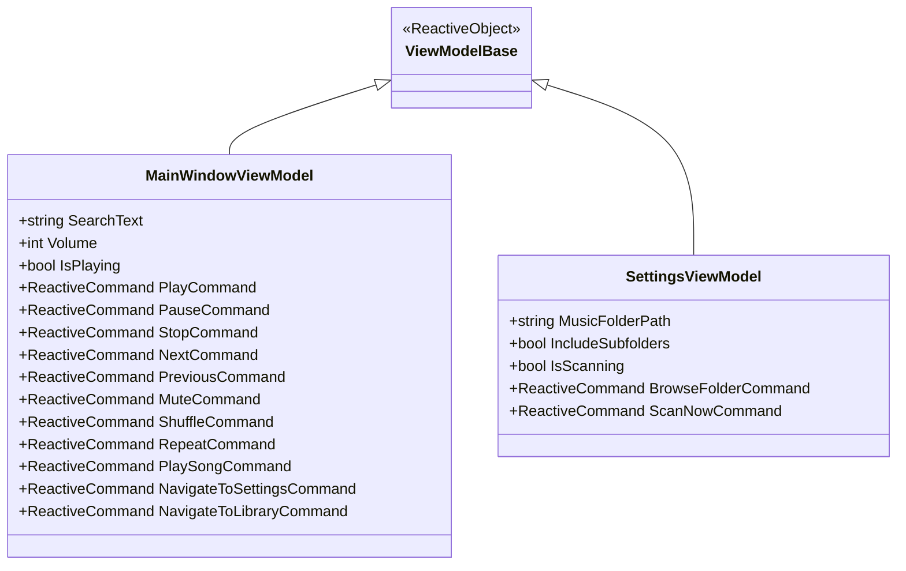
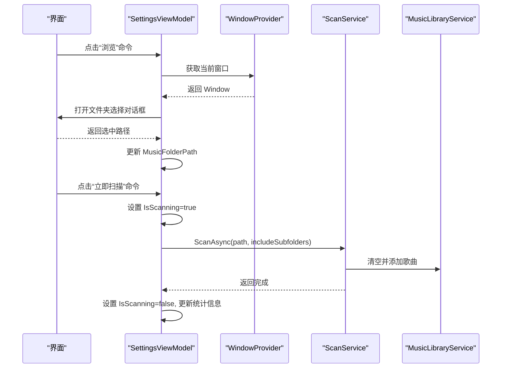
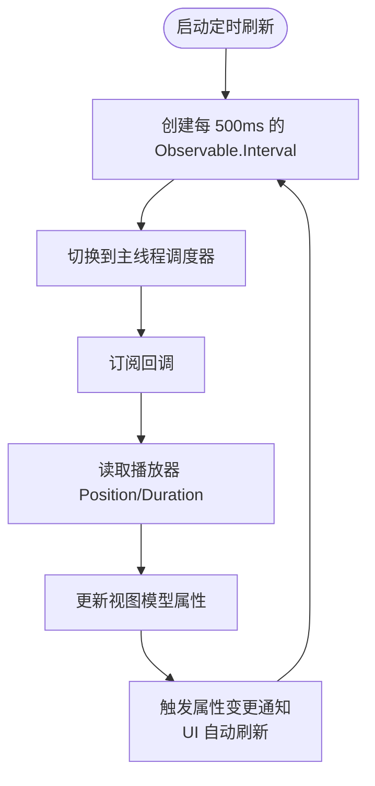
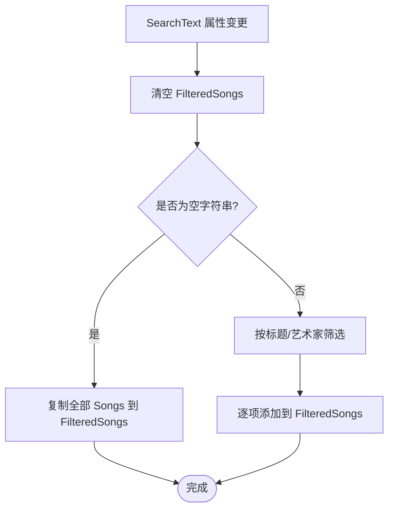
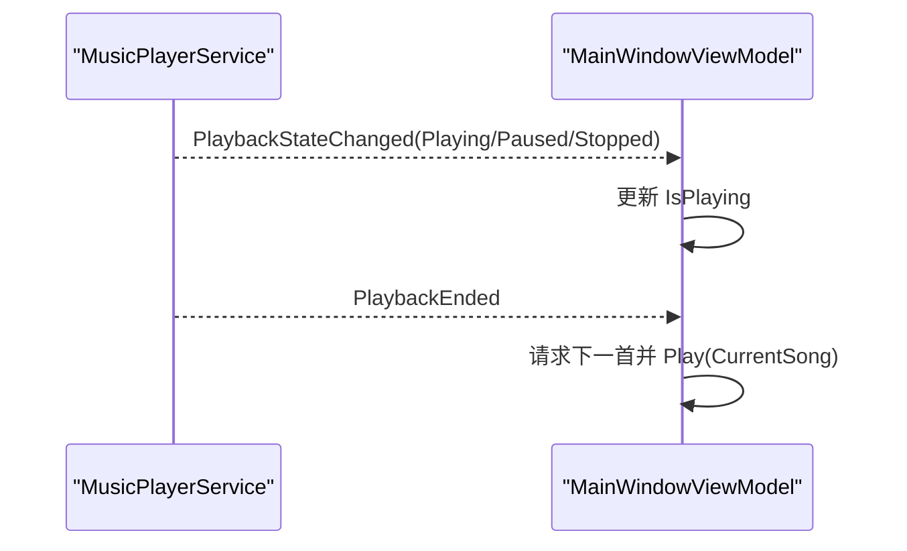
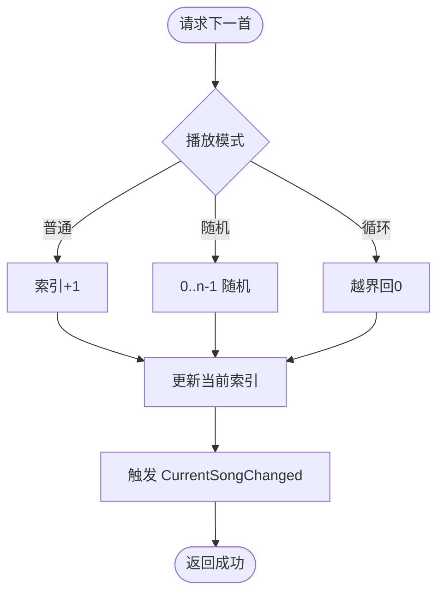
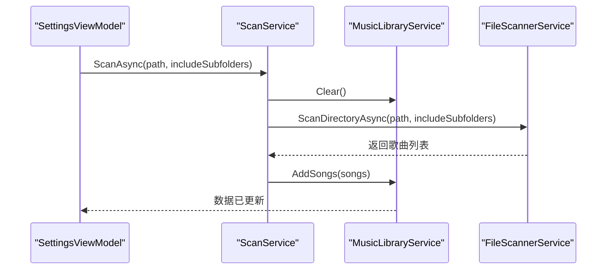
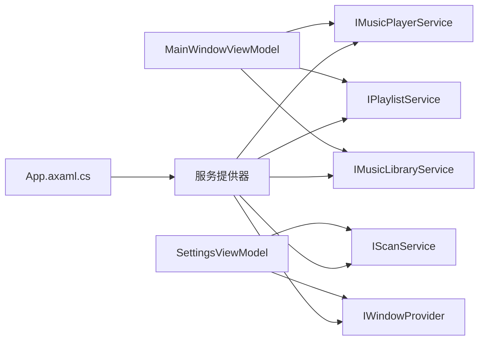

# 响应式编程

<cite>
**本文引用的文件**
- [MainWindowViewModel.cs](file://ViewModels/MainWindowViewModel.cs)
- [SettingsViewModel.cs](file://ViewModels/SettingsViewModel.cs)
- [ViewModelBase.cs](file://ViewModels/ViewModelBase.cs)
- [MusicPlayerService.cs](file://Services/MusicPlayerService.cs)
- [PlaylistService.cs](file://Services/PlaylistService.cs)
- [MusicLibraryService.cs](file://Services/MusicLibraryService.cs)
- [ScanService.cs](file://Services/ScanService.cs)
- [App.axaml.cs](file://App.axaml.cs)
- [MainWindow.axaml.cs](file://Views/MainWindow.axaml.cs)
- [PlayerStatus.cs](file://Models/PlayerStatus.cs)
- [PlaybackMode.cs](file://Models/PlaybackMode.cs)
- [Song.cs](file://Models/Song.cs)
- [Playlist.cs](file://Models/Playlist.cs)
- [IWindowProvider.cs](file://Services/IWindowProvider.cs)
- [WindowProvider.cs](file://Services/WindowProvider.cs)
</cite>

## 目录
1. [引言](#引言)
2. [项目结构](#项目结构)
3. [核心组件](#核心组件)
4. [架构总览](#架构总览)
5. [详细组件分析](#详细组件分析)
6. [依赖关系分析](#依赖关系分析)
7. [性能考虑](#性能考虑)
8. [故障排查指南](#故障排查指南)
9. [结论](#结论)
10. [附录](#附录)

## 引言
本文件围绕 LocalMusicPlayer 项目中 ReactiveUI 的响应式编程实践展开，系统性阐述以下主题：
- ReactiveUI 在 MVVM 中的应用：Observable 属性、命令绑定与事件流整合
- 核心概念：Observable 序列、Observer 观察者、Subject 主题（以事件和可观察集合体现）
- 命令绑定：CanExecute 条件判断与 Execute 执行逻辑
- 属性变更通知的响应式实现：自动订阅与取消订阅机制
- 实际应用场景：用户输入验证、异步操作处理、状态同步
- 性能优化与内存管理策略

## 项目结构
项目采用典型的 MVVM 架构，并通过 DI 容器注册服务与视图模型，界面层基于 Avalonia。ReactiveUI 被用于：
- 视图模型基类提供属性变更通知
- 使用 ReactiveCommand 封装交互命令
- 使用 Observable.Interval 定期刷新播放状态
- 使用 ReactiveCommand.CreateFromTask 处理异步扫描任务

图表来源
- [App.axaml.cs:18-51](file://App.axaml.cs#L18-L51)
- [MainWindowViewModel.cs:120-216](file://ViewModels/MainWindowViewModel.cs#L120-L216)
- [SettingsViewModel.cs:107-146](file://ViewModels/SettingsViewModel.cs#L107-L146)
- [MusicPlayerService.cs:7-38](file://Services/MusicPlayerService.cs#L7-L38)
- [PlaylistService.cs:7-34](file://Services/PlaylistService.cs#L7-L34)
- [MusicLibraryService.cs:7-26](file://Services/MusicLibraryService.cs#L7-L26)
- [ScanService.cs:6-23](file://Services/ScanService.cs#L6-L23)
- [WindowProvider.cs:5-8](file://Services/WindowProvider.cs#L5-L8)

章节来源
- [App.axaml.cs:18-51](file://App.axaml.cs#L18-L51)
- [MainWindowViewModel.cs:11-231](file://ViewModels/MainWindowViewModel.cs#L11-L231)
- [SettingsViewModel.cs:10-148](file://ViewModels/SettingsViewModel.cs#L10-L148)

## 核心组件
- 视图模型基类：继承 ReactiveObject，提供属性变更通知能力
- 播放器服务：封装底层播放器，暴露事件与属性，供视图模型订阅
- 播放列表服务：维护当前播放列表、索引与播放模式，触发歌曲切换事件
- 音乐库服务：提供歌曲集合与过滤集合，支持清空与批量添加
- 扫描服务：异步扫描目录并将结果写入音乐库
- 窗口提供者：为设置视图提供弹出选择对话框所需的窗口上下文

章节来源
- [ViewModelBase.cs:5-7](file://ViewModels/ViewModelBase.cs#L5-L7)
- [MusicPlayerService.cs:7-129](file://Services/MusicPlayerService.cs#L7-L129)
- [PlaylistService.cs:7-120](file://Services/PlaylistService.cs#L7-L120)
- [MusicLibraryService.cs:7-26](file://Services/MusicLibraryService.cs#L7-L26)
- [ScanService.cs:6-23](file://Services/ScanService.cs#L6-L23)
- [IWindowProvider.cs:5-8](file://Services/IWindowProvider.cs#L5-L8)
- [WindowProvider.cs:5-8](file://Services/WindowProvider.cs#L5-L8)

## 架构总览
下图展示从 UI 到服务层的响应式数据流与命令链路。

图表来源
- [MainWindowViewModel.cs:141-216](file://ViewModels/MainWindowViewModel.cs#L141-L216)
- [MusicPlayerService.cs:17-38](file://Services/MusicPlayerService.cs#L17-L38)
- [PlaylistService.cs:14-94](file://Services/PlaylistService.cs#L14-L94)
- [MusicLibraryService.cs:9-25](file://Services/MusicLibraryService.cs#L9-L25)

## 详细组件分析

### 视图模型基类与属性变更通知
- 基类 ViewModelBase 继承 ReactiveObject，提供属性变更通知能力
- MainWindowViewModel 与 SettingsViewModel 通过属性 setter 调用 RaiseAndSetIfChanged 实现响应式属性
- 典型场景：
  - 输入框变更时立即触发过滤逻辑
  - 音量属性变更时调用播放器服务设置音量
  - 播放状态事件驱动 UI 状态同步

图表来源
- [ViewModelBase.cs:5-7](file://ViewModels/ViewModelBase.cs#L5-L7)
- [MainWindowViewModel.cs:11-231](file://ViewModels/MainWindowViewModel.cs#L11-L231)
- [SettingsViewModel.cs:10-148](file://ViewModels/SettingsViewModel.cs#L10-L148)

章节来源
- [ViewModelBase.cs:5-7](file://ViewModels/ViewModelBase.cs#L5-L7)
- [MainWindowViewModel.cs:44-98](file://ViewModels/MainWindowViewModel.cs#L44-L98)
- [SettingsViewModel.cs:16-102](file://ViewModels/SettingsViewModel.cs#L16-L102)

### 命令绑定与执行逻辑
- ReactiveCommand.Create：用于无参数或带参数的同步命令
- ReactiveCommand.CreateFromTask：用于异步命令（如浏览文件夹、扫描音乐库）
- 命令执行流程：
  - 触发命令 -> 执行 Execute 回调 -> 更新相关状态 -> 触发 UI 刷新
- 命令与 CanExecute：
  - 当前代码未显式设置 CanExecute，因此命令默认始终可执行
  - 可通过 ReactiveCommand.Create(...) 的第二个参数传入 CanExecute 条件，实现按钮禁用/启用

图表来源
- [SettingsViewModel.cs:116-145](file://ViewModels/SettingsViewModel.cs#L116-L145)
- [WindowProvider.cs:5-8](file://Services/WindowProvider.cs#L5-L8)
- [ScanService.cs:17-22](file://Services/ScanService.cs#L17-L22)
- [MusicLibraryService.cs:12-25](file://Services/MusicLibraryService.cs#L12-L25)

章节来源
- [MainWindowViewModel.cs:108-195](file://ViewModels/MainWindowViewModel.cs#L108-L195)
- [SettingsViewModel.cs:104-145](file://ViewModels/SettingsViewModel.cs#L104-L145)

### Observable 属性与定时刷新
- 使用 Observable.Interval 创建周期性可观测序列，每 500ms 刷新一次位置与时长
- ObserveOn(RxApp.MainThreadScheduler) 确保 UI 更新在主线程执行
- 订阅回调内读取播放器服务的 Position/Duration 并赋值到视图模型属性，从而驱动 UI 同步

图表来源
- [MainWindowViewModel.cs:209-215](file://ViewModels/MainWindowViewModel.cs#L209-L215)
- [MusicPlayerService.cs:21-25](file://Services/MusicPlayerService.cs#L21-L25)

章节来源
- [MainWindowViewModel.cs:209-215](file://ViewModels/MainWindowViewModel.cs#L209-L215)
- [MusicPlayerService.cs:17-38](file://Services/MusicPlayerService.cs#L17-L38)

### 输入验证与搜索过滤
- 搜索文本属性变更时，立即调用过滤方法，清空并重新填充过滤后的歌曲集合
- 过滤逻辑基于标题与艺术家名称进行不区分大小写的包含匹配

图表来源
- [MainWindowViewModel.cs:218-229](file://ViewModels/MainWindowViewModel.cs#L218-L229)
- [MusicLibraryService.cs:9-25](file://Services/MusicLibraryService.cs#L9-L25)

章节来源
- [MainWindowViewModel.cs:44-54](file://ViewModels/MainWindowViewModel.cs#L44-L54)
- [MainWindowViewModel.cs:218-229](file://ViewModels/MainWindowViewModel.cs#L218-L229)

### 播放状态同步与事件驱动
- 播放器服务在播放状态变化、结束等事件发生时触发事件
- 视图模型订阅这些事件，更新 IsPlaying 等属性，实现 UI 与播放器状态的强一致

图表来源
- [MusicPlayerService.cs:17-38](file://Services/MusicPlayerService.cs#L17-L38)
- [MainWindowViewModel.cs:197-207](file://ViewModels/MainWindowViewModel.cs#L197-L207)

章节来源
- [MusicPlayerService.cs:17-38](file://Services/MusicPlayerService.cs#L17-L38)
- [MainWindowViewModel.cs:197-207](file://ViewModels/MainWindowViewModel.cs#L197-L207)

### 播放列表与播放模式
- 播放列表服务维护当前索引与播放模式，根据模式计算下一首/上一首
- 支持普通、随机、循环三种模式，切换时触发事件通知当前歌曲变化

图表来源
- [PlaylistService.cs:69-95](file://Services/PlaylistService.cs#L69-L95)
- [PlaybackMode.cs:3-8](file://Models/PlaybackMode.cs#L3-L8)

章节来源
- [PlaylistService.cs:23-34](file://Services/PlaylistService.cs#L23-L34)
- [PlaylistService.cs:69-119](file://Services/PlaylistService.cs#L69-L119)
- [PlaybackMode.cs:3-8](file://Models/PlaybackMode.cs#L3-L8)

### 音乐库与扫描流程
- 音乐库服务提供歌曲集合与过滤集合，支持清空与批量添加
- 扫描服务负责异步扫描目录，清空旧数据后写入新数据

图表来源
- [ScanService.cs:17-22](file://Services/ScanService.cs#L17-L22)
- [MusicLibraryService.cs:12-25](file://Services/MusicLibraryService.cs#L12-L25)

章节来源
- [ScanService.cs:6-23](file://Services/ScanService.cs#L6-L23)
- [MusicLibraryService.cs:7-26](file://Services/MusicLibraryService.cs#L7-L26)

## 依赖关系分析
- 依赖注入：App 在初始化完成后构建服务提供器，注册播放器、播放列表、音乐库、扫描等服务
- 视图模型通过构造函数注入所需服务，形成松耦合
- 事件与可观察集合作为服务间通信的桥梁

图表来源
- [App.axaml.cs:41-51](file://App.axaml.cs#L41-L51)
- [MainWindowViewModel.cs:120-136](file://ViewModels/MainWindowViewModel.cs#L120-L136)
- [SettingsViewModel.cs:107-114](file://ViewModels/SettingsViewModel.cs#L107-L114)

章节来源
- [App.axaml.cs:18-51](file://App.axaml.cs#L18-L51)
- [MainWindowViewModel.cs:120-136](file://ViewModels/MainWindowViewModel.cs#L120-L136)
- [SettingsViewModel.cs:107-114](file://ViewModels/SettingsViewModel.cs#L107-L114)

## 性能考虑
- 定时刷新频率：当前每 500ms 刷新一次，建议根据 UI 需求调整间隔；过短会增加 CPU 占用，过长影响体验
- 主线程调度：确保 UI 更新在主线程执行，避免跨线程访问 UI 导致异常
- 事件风暴抑制：对于高频事件（如播放进度），可考虑节流/去抖（Throttle/Debounce）以减少 UI 抖动
- 内存管理：播放器服务实现 IDisposable，在视图模型不再需要时应释放资源；避免长时间订阅导致的内存泄漏
- 集合操作：过滤时一次性清空再批量添加，避免频繁通知；必要时使用批量操作接口
- 异步命令：使用 ReactiveCommand.CreateFromTask 执行耗时操作，避免阻塞 UI 线程

## 故障排查指南
- 命令无法执行
  - 检查命令是否被禁用（未设置 CanExecute 或条件不满足）
  - 确认命令绑定的参数类型与调用方式一致
- UI 不刷新
  - 确认属性 setter 是否调用了 RaiseAndSetIfChanged
  - 检查定时刷新订阅是否仍在，以及是否在主线程更新
- 播放状态不同步
  - 检查播放器服务事件是否正确触发
  - 确认视图模型订阅了相应事件且更新了对应属性
- 扫描无结果
  - 确认选择了有效目录且包含子文件夹选项符合预期
  - 检查扫描服务是否成功写入音乐库集合

章节来源
- [MainWindowViewModel.cs:209-215](file://ViewModels/MainWindowViewModel.cs#L209-L215)
- [MusicPlayerService.cs:17-38](file://Services/MusicPlayerService.cs#L17-L38)
- [ScanService.cs:17-22](file://Services/ScanService.cs#L17-L22)

## 结论
LocalMusicPlayer 通过 ReactiveUI 将 MVVM 与响应式思想有机结合：
- 使用 Observable 属性与命令实现 UI 与业务逻辑的解耦
- 使用事件与可观察集合实现跨组件的状态同步
- 使用定时刷新与异步命令提升用户体验与性能
建议后续增强点：
- 显式设置命令的 CanExecute 条件
- 对高频事件引入节流/去抖策略
- 在合适时机释放订阅与资源，避免内存泄漏

## 附录
- 关键模型与状态
  - 播放状态：Position、Duration、IsPlaying、Volume、IsMuted、State、CurrentSong
  - 播放模式：Normal、Shuffle、Loop
  - 歌曲与播放列表：Song、Playlist

章节来源
- [PlayerStatus.cs:5-14](file://Models/PlayerStatus.cs#L5-L14)
- [PlaybackMode.cs:3-8](file://Models/PlaybackMode.cs#L3-L8)
- [Song.cs:5-12](file://Models/Song.cs#L5-L12)
- [Playlist.cs:5-9](file://Models/Playlist.cs#L5-L9)