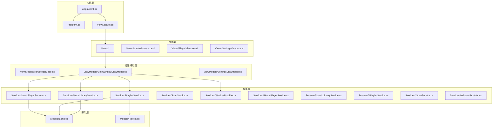
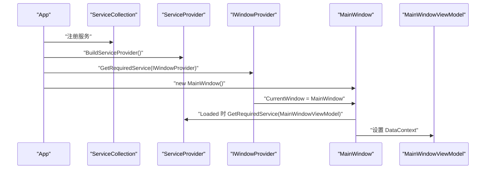
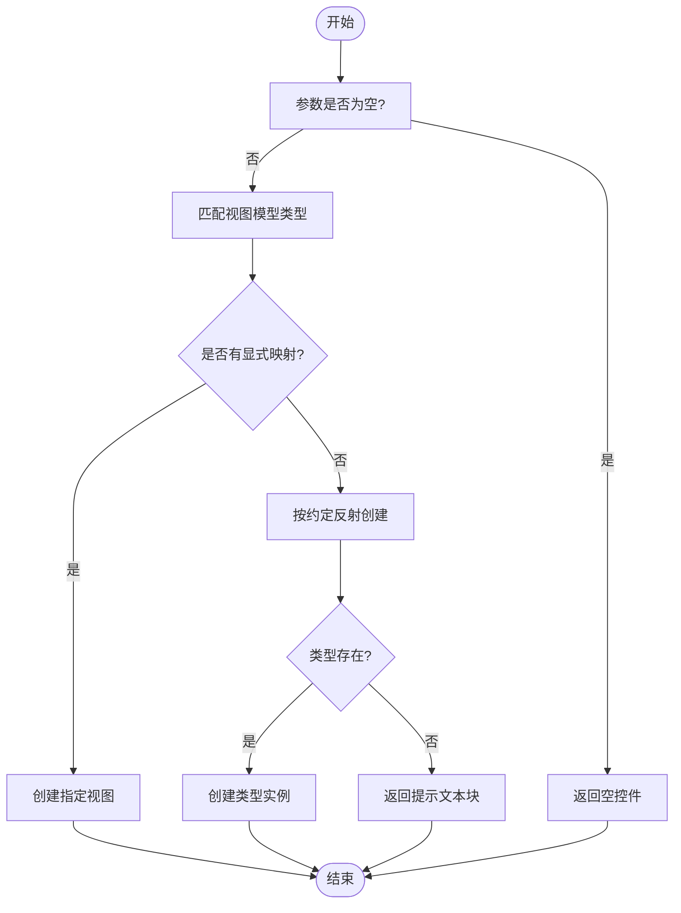
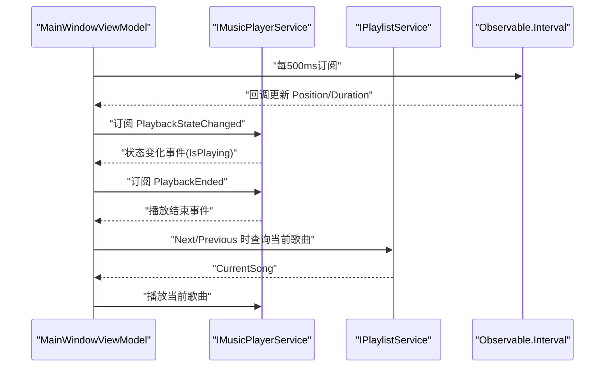
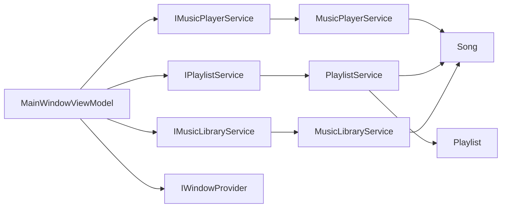

# 架构设计

<cite>
**本文引用的文件**
- [App.axaml.cs](file://App.axaml.cs)
- [Program.cs](file://Program.cs)
- [ViewLocator.cs](file://ViewLocator.cs)
- [ViewModelBase.cs](file://ViewModels/ViewModelBase.cs)
- [MainWindowViewModel.cs](file://ViewModels/MainWindowViewModel.cs)
- [IWindowProvider.cs](file://Services/IWindowProvider.cs)
- [IMusicPlayerService.cs](file://Services/IMusicPlayerService.cs)
- [IMusicLibraryService.cs](file://Services/IMusicLibraryService.cs)
- [IPlaylistService.cs](file://Services/IPlaylistService.cs)
- [IScanService.cs](file://Services/IScanService.cs)
- [MusicPlayerService.cs](file://Services/MusicPlayerService.cs)
- [MusicLibraryService.cs](file://Services/MusicLibraryService.cs)
- [PlaylistService.cs](file://Services/PlaylistService.cs)
- [Song.cs](file://Models/Song.cs)
- [Playlist.cs](file://Models/Playlist.cs)
</cite>

## 目录
1. [引言](#引言)
2. [项目结构](#项目结构)
3. [核心组件](#核心组件)
4. [架构总览](#架构总览)
5. [详细组件分析](#详细组件分析)
6. [依赖关系分析](#依赖关系分析)
7. [性能考量](#性能考量)
8. [故障排查指南](#故障排查指南)
9. [结论](#结论)
10. [附录](#附录)

## 引言
本文件为 LocalMusicPlayer 项目的架构设计文档，聚焦于 MVVM 架构模式的落地与实践，涵盖以下主题：
- Model-View-ViewModel 的职责分离与数据绑定机制
- 依赖注入容器的配置与使用（服务注册、生命周期管理、接口抽象）
- 响应式编程在项目中的应用（ReactiveCommand 命令绑定、Observable 属性）
- 视图定位器（ViewLocator）的工作原理与自定义扩展
- 架构决策的技术背景与权衡（跨平台兼容性、性能优化、可维护性）
- 系统边界图与组件交互图

## 项目结构
项目采用基于功能域的分层组织方式，结合 MVVM 模式与依赖注入，主要目录与职责如下：
- Models：领域模型（Song、Playlist 等），承载不可变或只读属性的数据载体
- Services：业务服务接口与实现（播放、库、播放列表、扫描、窗口等）
- ViewModels：视图模型，封装状态、命令与业务逻辑，继承 ReactiveObject 实现响应式属性
- Views：视图（Avalonia XAML 视图），通过 DataContext 绑定到 ViewModel
- Converters、Behaviors、Styles：UI 辅助工具与样式资源
- App.axaml.cs、Program.cs：应用入口与 DI 容器初始化
- ViewLocator.cs：视图与视图模型的约定式映射

图表来源
- [App.axaml.cs:18-51](file://App.axaml.cs#L18-L51)
- [Program.cs:14-20](file://Program.cs#L14-L20)
- [ViewLocator.cs:8-38](file://ViewLocator.cs#L8-L38)
- [MainWindowViewModel.cs:120-216](file://ViewModels/MainWindowViewModel.cs#L120-L216)
- [MusicPlayerService.cs:7-38](file://Services/MusicPlayerService.cs#L7-L38)
- [PlaylistService.cs:7-45](file://Services/PlaylistService.cs#L7-L45)
- [MusicLibraryService.cs:7-26](file://Services/MusicLibraryService.cs#L7-L26)
- [Song.cs:5-12](file://Models/Song.cs#L5-L12)
- [Playlist.cs:5-9](file://Models/Playlist.cs#L5-L9)

章节来源
- [App.axaml.cs:18-51](file://App.axaml.cs#L18-L51)
- [Program.cs:14-20](file://Program.cs#L14-L20)
- [ViewLocator.cs:8-38](file://ViewLocator.cs#L8-L38)
- [MainWindowViewModel.cs:120-216](file://ViewModels/MainWindowViewModel.cs#L120-L216)

## 核心组件
- 应用启动与 DI 配置
  - 在应用初始化时构建 ServiceCollection，注册服务接口与实现，并以单例/瞬态方式注入
  - 通过 IWindowProvider 注入主窗体实例，供视图模型使用
  - 在 MainWindow 加载完成后解析 MainWindowViewModel 并设置 DataContext
- 视图定位器（ViewLocator）
  - 依据视图模型类型动态创建对应视图；若未显式映射，则按“ViewModel → View”命名约定反射创建
  - 通过 Match 判定是否为 ViewModelBase 子类，确保仅对视图模型进行映射
- 视图模型基类（ViewModelBase）
  - 继承 ReactiveObject，提供属性变更通知能力，支撑 Avalonia/XAML 数据绑定
- 主视图模型（MainWindowViewModel）
  - 聚合播放器、播放列表、音乐库、窗口等服务
  - 暴露响应式命令（ReactiveCommand）与可观测属性（如 CurrentSong、Position、Duration、Volume 等）
  - 订阅播放器事件，驱动 UI 状态更新；定时轮询更新播放进度

章节来源
- [App.axaml.cs:18-51](file://App.axaml.cs#L18-L51)
- [ViewLocator.cs:8-38](file://ViewLocator.cs#L8-L38)
- [ViewModelBase.cs:5-7](file://ViewModels/ViewModelBase.cs#L5-L7)
- [MainWindowViewModel.cs:120-216](file://ViewModels/MainWindowViewModel.cs#L120-L216)

## 架构总览
LocalMusicPlayer 采用 MVVM 架构，结合 ReactiveUI 的响应式特性与 Avalonia 的 XAML 绑定，形成清晰的职责分离：
- Model：Song、Playlist 等领域对象，承载数据与元信息
- Service：抽象接口定义能力边界，具体实现封装播放、扫描、库管理等业务
- ViewModel：封装 UI 状态与交互逻辑，暴露命令与属性，订阅服务事件
- View：声明式 UI，通过 DataContext 与 ViewModel 双向/单向绑定

```mermaid
classDiagram
class ViewModelBase {
<<ReactiveObject>>
}
class MainWindowViewModel {
+属性 : CurrentPage, CurrentSong, Position, Duration, Volume, IsPlaying, IsMuted, IsScanning
+命令 : PlayCommand, PauseCommand, StopCommand, NextCommand, PreviousCommand, MuteCommand, ShuffleCommand, RepeatCommand, PlaySongCommand, NavigateToSettingsCommand, NavigateToLibraryCommand
+构造函数(依赖注入)
}
class IMusicPlayerService {
+方法 : Play(), Pause(), Resume(), Stop(), Seek(), SetVolume(), Mute()
+属性 : Position, Duration, Volume, IsPlaying, IsMuted
+事件 : PlaybackEnded, PlaybackStateChanged, PositionChanged
}
class MusicPlayerService
class IPlaylistService {
+方法 : CreatePlaylist(), SetCurrentPlaylist(), AddSongToPlaylist(), RemoveSongFromPlaylist(), PlayNext(), PlayPrevious()
+属性 : CurrentPlaylist, CurrentIndex, CurrentSong, PlaybackMode
+事件 : CurrentSongChanged, PlaybackModeChanged
}
class PlaylistService
class IMusicLibraryService {
+属性 : Songs, FilteredSongs
+方法 : Clear(), AddSongs()
}
class MusicLibraryService
class IWindowProvider {
+属性 : CurrentWindow
}
class WindowProvider
class Song
class Playlist
MainWindowViewModel --> IMusicPlayerService : "依赖"
MainWindowViewModel --> IPlaylistService : "依赖"
MainWindowViewModel --> IMusicLibraryService : "依赖"
MainWindowViewModel --> IWindowProvider : "依赖"
MusicPlayerService ..|> IMusicPlayerService
PlaylistService ..|> IPlaylistService
MusicLibraryService ..|> IMusicLibraryService
WindowProvider ..|> IWindowProvider
MusicPlayerService --> Song : "播放"
PlaylistService --> Playlist : "管理"
PlaylistService --> Song : "索引"
MusicLibraryService --> Song : "存储"
```

图表来源
- [ViewModelBase.cs:5-7](file://ViewModels/ViewModelBase.cs#L5-L7)
- [MainWindowViewModel.cs:120-216](file://ViewModels/MainWindowViewModel.cs#L120-L216)
- [IMusicPlayerService.cs:6-27](file://Services/IMusicPlayerService.cs#L6-L27)
- [MusicPlayerService.cs:7-38](file://Services/MusicPlayerService.cs#L7-L38)
- [IPlaylistService.cs:7-22](file://Services/IPlaylistService.cs#L7-L22)
- [PlaylistService.cs:7-45](file://Services/PlaylistService.cs#L7-L45)
- [IMusicLibraryService.cs:7-14](file://Services/IMusicLibraryService.cs#L7-L14)
- [MusicLibraryService.cs:7-26](file://Services/MusicLibraryService.cs#L7-L26)
- [IWindowProvider.cs:5-8](file://Services/IWindowProvider.cs#L5-L8)
- [Song.cs:5-12](file://Models/Song.cs#L5-L12)
- [Playlist.cs:5-9](file://Models/Playlist.cs#L5-L9)

## 详细组件分析

### 依赖注入与生命周期
- 服务注册
  - 单例：IWindowProvider、IFileScannerService、IMusicPlayerService、IPlaylistService、IMusicLibraryService、IScanService
  - 瞬态：SettingsViewModel、MainWindowViewModel
- 生命周期管理
  - 单例贯穿应用生命周期，适合无状态或共享状态的服务
  - 瞬态视图模型每次解析都创建新实例，便于隔离视图状态
- 接口抽象
  - 通过接口解耦，便于替换实现（例如播放器后端、扫描策略）

图表来源
- [App.axaml.cs:22-35](file://App.axaml.cs#L22-L35)
- [App.axaml.cs:41-51](file://App.axaml.cs#L41-L51)

章节来源
- [App.axaml.cs:22-51](file://App.axaml.cs#L22-L51)

### 视图定位器（ViewLocator）
- 工作原理
  - Build：根据传入的视图模型类型返回对应视图；若未显式映射则按约定反射创建
  - Match：仅对 ViewModelBase 子类进行处理
- 自定义扩展
  - 可在 switch 分支中添加更多显式映射，或在约定创建失败时提供回退 UI（如显示“未找到”的文本块）

图表来源
- [ViewLocator.cs:10-37](file://ViewLocator.cs#L10-L37)

章节来源
- [ViewLocator.cs:8-38](file://ViewLocator.cs#L8-L38)

### 响应式编程与命令绑定
- ReactiveObject 与属性变更
  - ViewModelBase 继承 ReactiveObject，MainWindowViewModel 使用 RaiseAndSetIfChanged 更新属性，触发 XAML 绑定刷新
- ReactiveCommand 命令
  - MainWindowViewModel 暴露多个 ReactiveCommand，用于执行播放控制、导航、播放歌曲等操作
  - 命令内部调用服务方法（如播放器、播放列表、音乐库），并同步 UI 状态
- 定时刷新与事件订阅
  - 使用 Observable.Interval 定期轮询播放位置与时长，切换到主线程调度以保证 UI 安全更新
  - 订阅播放器事件（播放状态变化、播放结束、位置变化）以驱动 UI 同步

图表来源
- [MainWindowViewModel.cs:108-216](file://ViewModels/MainWindowViewModel.cs#L108-L216)
- [IMusicPlayerService.cs:18-27](file://Services/IMusicPlayerService.cs#L18-L27)
- [MusicPlayerService.cs:17-38](file://Services/MusicPlayerService.cs#L17-L38)

章节来源
- [ViewModelBase.cs:5-7](file://ViewModels/ViewModelBase.cs#L5-L7)
- [MainWindowViewModel.cs:108-216](file://ViewModels/MainWindowViewModel.cs#L108-L216)

### 服务层设计与职责
- IMusicPlayerService
  - 提供播放控制、音量、静音、位置与时长查询，以及播放状态与结束事件
- IPlaylistService
  - 管理播放列表、当前索引、播放模式（顺序/随机/循环），并发出当前歌曲与模式变更事件
- IMusicLibraryService
  - 维护完整曲库与过滤后的歌曲集合，支持清空与批量添加
- IWindowProvider
  - 提供当前主窗体引用，便于视图模型与窗口交互

章节来源
- [IMusicPlayerService.cs:6-27](file://Services/IMusicPlayerService.cs#L6-L27)
- [IPlaylistService.cs:7-22](file://Services/IPlaylistService.cs#L7-L22)
- [IMusicLibraryService.cs:7-14](file://Services/IMusicLibraryService.cs#L7-L14)
- [IWindowProvider.cs:5-8](file://Services/IWindowProvider.cs#L5-L8)

### 播放器与播放列表实现
- MusicPlayerService
  - 基于 LibVLCSharp 实现底层播放，封装播放、暂停、停止、跳转、音量与静音逻辑
  - 通过事件向上抛出播放状态与位置变化，供视图模型订阅
- PlaylistService
  - 支持顺序、随机、循环三种播放模式，计算下一首/上一首索引并触发事件
  - 对播放列表进行增删改时，通过集合复制与重新赋值维持可观察性

章节来源
- [MusicPlayerService.cs:7-129](file://Services/MusicPlayerService.cs#L7-L129)
- [PlaylistService.cs:7-120](file://Services/PlaylistService.cs#L7-L120)

### 模型层
- Song：歌曲元数据（标题、艺术家、专辑、文件路径、时长）
- Playlist：播放列表（名称、歌曲集合）

章节来源
- [Song.cs:5-12](file://Models/Song.cs#L5-L12)
- [Playlist.cs:5-9](file://Models/Playlist.cs#L5-L9)

## 依赖关系分析
- 组件耦合与内聚
  - ViewModels 通过接口依赖服务，降低对具体实现的耦合
  - Services 内聚业务逻辑，避免视图模型直接访问底层播放器
- 外部依赖
  - ReactiveUI：响应式对象与命令
  - Avalonia：XAML 框架与视图系统
  - LibVLCSharp：多媒体播放后端
- 循环依赖规避
  - 通过接口抽象与单向依赖（ViewModel → Service → Model）避免循环

图表来源
- [MainWindowViewModel.cs:120-216](file://ViewModels/MainWindowViewModel.cs#L120-L216)
- [IMusicPlayerService.cs:6-27](file://Services/IMusicPlayerService.cs#L6-L27)
- [IPlaylistService.cs:7-22](file://Services/IPlaylistService.cs#L7-L22)
- [IMusicLibraryService.cs:7-14](file://Services/IMusicLibraryService.cs#L7-L14)
- [MusicPlayerService.cs:7-38](file://Services/MusicPlayerService.cs#L7-L38)
- [PlaylistService.cs:7-45](file://Services/PlaylistService.cs#L7-L45)
- [MusicLibraryService.cs:7-26](file://Services/MusicLibraryService.cs#L7-L26)
- [Song.cs:5-12](file://Models/Song.cs#L5-L12)
- [Playlist.cs:5-9](file://Models/Playlist.cs#L5-L9)

章节来源
- [MainWindowViewModel.cs:120-216](file://ViewModels/MainWindowViewModel.cs#L120-L216)
- [MusicPlayerService.cs:7-38](file://Services/MusicPlayerService.cs#L7-L38)
- [PlaylistService.cs:7-45](file://Services/PlaylistService.cs#L7-L45)
- [MusicLibraryService.cs:7-26](file://Services/MusicLibraryService.cs#L7-L26)

## 性能考量
- 响应式轮询频率
  - 当前以 500ms 轮询更新播放进度，建议根据 UI 刷新率与设备性能调整间隔，避免过度刷新
- 事件风暴与去抖
  - 播放位置事件可能高频触发，可在视图模型侧引入节流/去抖策略，减少 UI 刷新压力
- 集合操作与可观察性
  - 播放列表的增删改通过复制集合再赋值，避免直接修改底层集合导致的通知异常；建议在大批量更新时合并通知
- 播放器生命周期
  - 在应用退出或视图关闭时正确释放播放器资源，防止内存泄漏

## 故障排查指南
- 视图未正确加载
  - 检查 ViewLocator 是否能按约定创建视图；若未映射，确认命名规范一致
- 命令无法执行
  - 确认 ReactiveCommand 的 CanExecute 条件与绑定状态；检查服务是否已正确注入
- 播放无声音
  - 检查音量与静音状态；确认播放器音量设置与静音切换逻辑
- 进度不更新
  - 确认定时轮询是否运行、事件订阅是否生效、线程调度是否切换到主线程

章节来源
- [ViewLocator.cs:23-32](file://ViewLocator.cs#L23-L32)
- [MainWindowViewModel.cs:108-216](file://ViewModels/MainWindowViewModel.cs#L108-L216)
- [MusicPlayerService.cs:84-113](file://Services/MusicPlayerService.cs#L84-L113)

## 结论
LocalMusicPlayer 通过 MVVM 与 ReactiveUI 的结合，实现了清晰的职责分离与良好的可维护性。依赖注入确保了接口抽象与可替换性，视图定位器简化了视图与视图模型的绑定流程。响应式命令与属性使交互逻辑简洁直观，配合服务层的事件驱动，形成了稳定可靠的播放体验。未来可在性能调优（事件节流、批量更新）、错误处理与测试覆盖方面进一步完善。

## 附录
- 技术选型背景
  - Avalonia：跨平台 UI 框架，适合桌面应用；与 ReactiveUI 集成良好
  - ReactiveUI：响应式框架，提供命令、属性变更与线程调度能力
  - LibVLCSharp：成熟的多媒体播放后端，支持多种格式与平台
- 架构权衡
  - 可维护性：接口抽象与依赖注入提升模块内聚、降低耦合
  - 跨平台：Avalonia 与 LibVLCSharp 共同保障 Windows/Linux/macOS 的一致性
  - 性能：事件与轮询需平衡刷新频率与资源占用