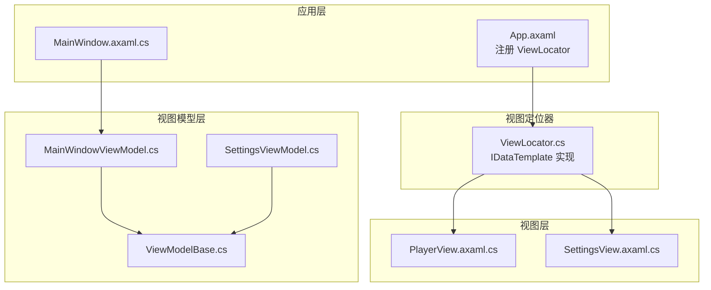
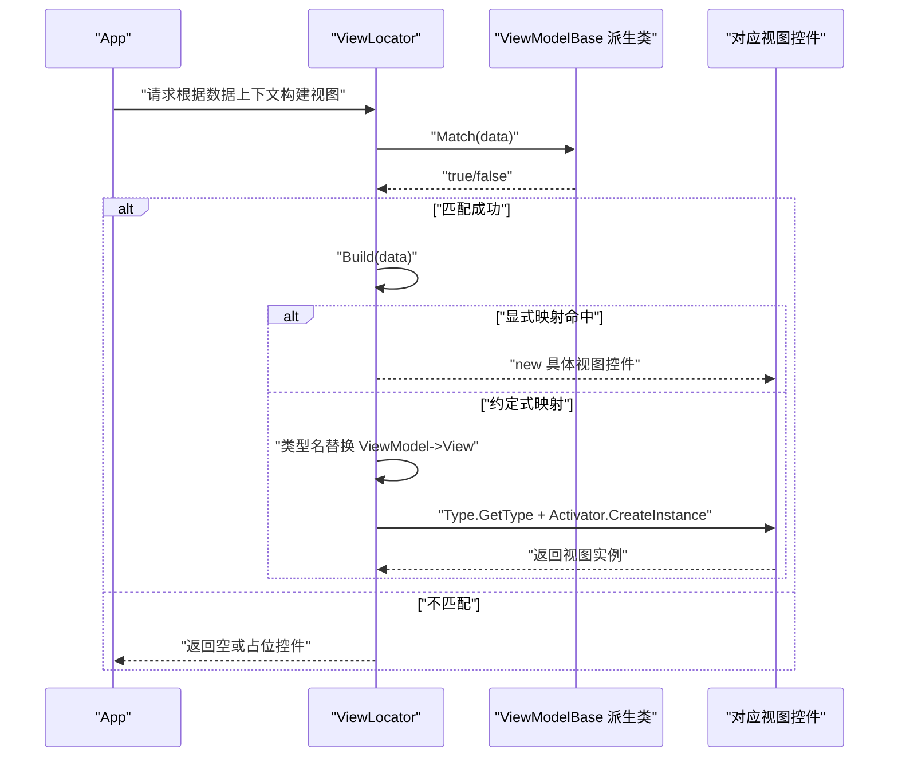
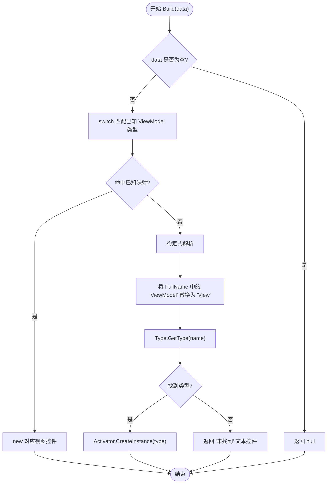
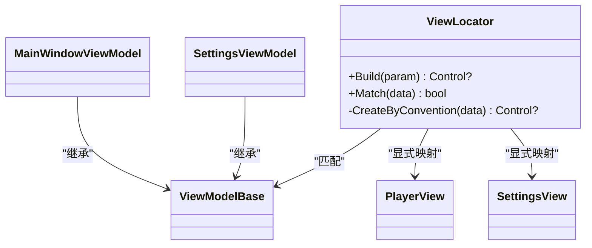
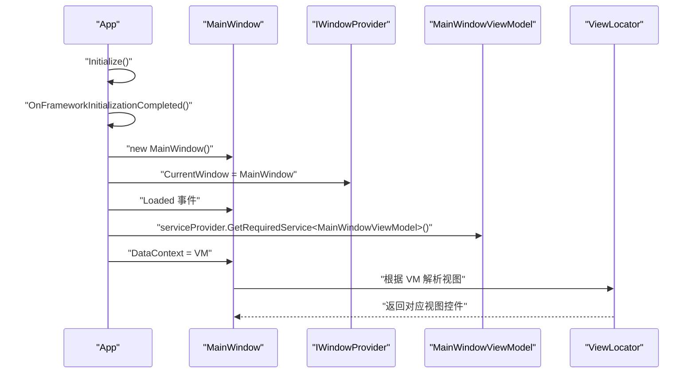

# 视图定位器

<cite>
**本文引用的文件**
- [ViewLocator.cs](file://ViewLocator.cs)
- [App.axaml](file://App.axaml)
- [App.axaml.cs](file://App.axaml.cs)
- [MainWindowViewModel.cs](file://ViewModels/MainWindowViewModel.cs)
- [SettingsViewModel.cs](file://ViewModels/SettingsViewModel.cs)
- [ViewModelBase.cs](file://ViewModels/ViewModelBase.cs)
- [MainWindow.axaml.cs](file://Views/MainWindow.axaml.cs)
- [PlayerView.axaml.cs](file://Views/PlayerView.axaml.cs)
- [SettingsView.axaml.cs](file://Views/SettingsView.axaml.cs)
- [IWindowProvider.cs](file://Services/IWindowProvider.cs)
- [IMusicLibraryService.cs](file://Services/IMusicLibraryService.cs)
</cite>

## 目录
1. [简介](#简介)
2. [项目结构](#项目结构)
3. [核心组件](#核心组件)
4. [架构总览](#架构总览)
5. [详细组件分析](#详细组件分析)
6. [依赖关系分析](#依赖关系分析)
7. [性能考虑](#性能考虑)
8. [故障排查指南](#故障排查指南)
9. [结论](#结论)
10. [附录](#附录)

## 简介
本文件围绕 LocalMusicPlayer 项目中的视图定位器（ViewLocator）进行系统化说明，重点解释其工作原理、自定义实现方式、命名约定与匹配规则、动态视图解析过程（含反射机制）、在 MVVM 架构中的作用（视图生命周期与资源管理），以及调试技巧与常见问题解决方案。读者无需深入源码即可理解视图定位器如何将“视图模型”自动映射到对应的“视图”。

## 项目结构
LocalMusicPlayer 采用 AvaloniaUI + ReactiveUI 的 MVVM 架构，视图定位器通过 XAML 注册为全局数据模板，用于根据 DataContext 自动选择合适的视图控件。

**图表来源**
- [App.axaml:8-10](file://App.axaml#L8-L10)
- [ViewLocator.cs:8-38](file://ViewLocator.cs#L8-L38)
- [MainWindowViewModel.cs:11-24](file://ViewModels/MainWindowViewModel.cs#L11-L24)
- [SettingsViewModel.cs:10-14](file://ViewModels/SettingsViewModel.cs#L10-L14)
- [ViewModelBase.cs:5-7](file://ViewModels/ViewModelBase.cs#L5-L7)
- [PlayerView.axaml.cs:5-11](file://Views/PlayerView.axaml.cs#L5-L11)
- [SettingsView.axaml.cs:5-11](file://Views/SettingsView.axaml.cs#L5-L11)

**章节来源**
- [App.axaml:1-23](file://App.axaml#L1-L23)
- [App.axaml.cs:18-39](file://App.axaml.cs#L18-L39)
- [ViewLocator.cs:8-38](file://ViewLocator.cs#L8-L38)

## 核心组件
- 视图定位器（ViewLocator）
  - 实现 Avalonia 的 IDataTemplate 接口，负责根据传入的数据上下文（通常是 ViewModel）返回对应的视图控件实例。
  - 提供两种解析路径：显式映射（针对特定 ViewModel 类型）与约定式映射（基于命名约定自动推断）。
- 应用入口（App）
  - 在 XAML 中注册 ViewLocator 作为全局数据模板，使 Avalonia 在渲染内容时自动调用定位器。
- 视图模型基类（ViewModelBase）
  - 所有 ViewModel 继承自 ReactiveObject，并以 ViewModelBase 作为统一基类，用于匹配定位器的 Match 条件。
- 视图（Views）
  - 对应的视图控件（UserControl 或 Window）由定位器按约定或显式映射创建。

**章节来源**
- [ViewLocator.cs:8-38](file://ViewLocator.cs#L8-L38)
- [App.axaml:8-10](file://App.axaml#L8-L10)
- [ViewModelBase.cs:5-7](file://ViewModels/ViewModelBase.cs#L5-L7)

## 架构总览
视图定位器在 Avalonia 渲染管线中的职责是“把 ViewModel 映射到 View”。其核心流程如下：

**图表来源**
- [ViewLocator.cs:10-37](file://ViewLocator.cs#L10-L37)
- [ViewModelBase.cs:5-7](file://ViewModels/ViewModelBase.cs#L5-L7)

## 详细组件分析

### 视图定位器（ViewLocator）工作原理
- 匹配规则（Match）
  - 仅当数据上下文继承自 ViewModelBase 时才进行处理，确保只对 MVVM 的 ViewModel 进行视图解析。
- 构建逻辑（Build）
  - 首先检查是否为已知的特定 ViewModel 类型，若是则直接返回对应的视图实例。
  - 否则进入约定式解析：将 ViewModel 的完整类型名中的“ViewModel”替换为“View”，尝试通过反射加载类型并创建实例。
- 错误回退
  - 若约定式解析失败（找不到类型），返回一个文本提示控件，便于调试定位缺失的视图类型。

**图表来源**
- [ViewLocator.cs:10-37](file://ViewLocator.cs#L10-L37)

**章节来源**
- [ViewLocator.cs:8-38](file://ViewLocator.cs#L8-L38)

### 命名约定与匹配规则
- 基本约定
  - ViewModel 类型名中包含“ViewModel”后缀；对应的视图类型名需将“ViewModel”替换为“View”后与之对应。
  - 例如：某 ViewModel 完整类型名为“LocalMusicPlayer.ViewModels.SettingsViewModel”，则对应视图为“LocalMusicPlayer.Views.SettingsView”。
- 命名空间要求
  - 建议保持 ViewModel 与 View 的命名空间一致或结构清晰，以便约定式解析能正确拼接类型名。
- 特殊映射
  - 对于需要特殊处理的 ViewModel（如 MainWindowViewModel），可直接在显式映射中指定其视图，避免受约定式解析影响。
- 匹配条件
  - 只有当数据上下文为 ViewModelBase（或其派生类）时，定位器才会参与解析。

**章节来源**
- [ViewLocator.cs:23-32](file://ViewLocator.cs#L23-L32)
- [ViewModelBase.cs:5-7](file://ViewModels/ViewModelBase.cs#L5-L7)

### 动态视图解析与反射机制
- 类型查找
  - 使用 Type.GetType(name) 根据完全限定类型名获取类型对象；该方法会从当前程序集及已加载的程序集中查找。
- 实例创建
  - 通过 Activator.CreateInstance(type) 创建视图控件实例，要求目标类型具备无参构造函数。
- 性能与优化建议
  - 预热：在应用启动阶段触发一次定位器调用，促使 JIT 编译与类型加载提前完成。
  - 缓存：对常用 ViewModel 到 View 的映射结果进行缓存，减少重复字符串替换与类型查找开销。
  - 限制范围：尽量保持命名空间与类型名简洁明确，避免 Type.GetType 在大型程序集中进行过多搜索。
  - 失败快速：约定式解析失败时尽早返回占位控件，避免长时间阻塞 UI 线程。

**章节来源**
- [ViewLocator.cs:23-32](file://ViewLocator.cs#L23-L32)

### 视图定位器在 MVVM 中的作用
- 视图生命周期管理
  - 定位器本身不直接管理视图生命周期，但通过 DataContext 的切换间接影响视图的显示与隐藏。
  - 在 MainWindowViewModel 中，通过 CurrentPage 属性在不同 ViewModel 之间切换，从而驱动视图的动态更新。
- 资源释放
  - 当视图不再被使用时，应确保解除事件订阅、取消定时器与后台任务等，防止内存泄漏。
  - 建议在视图的卸载或 ViewModel 的释放路径中执行清理操作。

**章节来源**
- [MainWindowViewModel.cs:18-24](file://ViewModels/MainWindowViewModel.cs#L18-L24)
- [MainWindowViewModel.cs:132-139](file://ViewModels/MainWindowViewModel.cs#L132-L139)

### 自定义视图定位器实现示例（概念性）
以下为复杂场景下的扩展思路（概念说明，非现有代码）：
- 条件绑定
  - 根据 ViewModel 的状态或属性值决定使用哪个视图（例如根据 IsEditMode 决定编辑视图或只读视图）。
- 分组映射
  - 将多个 ViewModel 归类到同一视图，或为不同模块（如“设置”、“播放器”）分别维护独立的定位器。
- 多级约定
  - 支持多段命名约定（如“ViewModel”->“View”，或“Model”->“Control”），并允许优先级排序。
- 插件化
  - 通过插件或特性标记（如自定义 Attribute）声明 ViewModel 与 View 的映射关系，替代硬编码的显式映射。

[本节为概念性说明，不直接分析具体文件，故不附“章节来源”]

## 依赖关系分析
- ViewLocator 依赖
  - ViewModelBase：用于匹配所有 ViewModel。
  - Views 命名空间下的具体视图类型：用于创建实例。
- App 与 ViewLocator
  - App.axaml 在 Application.DataTemplates 中注册 ViewLocator，使其成为 Avalonia 的全局数据模板。
- ViewModel 与 View
  - MainWindowViewModel 通过 CurrentPage 在“主页面”和“设置页面”之间切换，体现视图定位器在运行时的动态解析能力。

**图表来源**
- [ViewLocator.cs:8-38](file://ViewLocator.cs#L8-L38)
- [ViewModelBase.cs:5-7](file://ViewModels/ViewModelBase.cs#L5-L7)
- [MainWindowViewModel.cs:11-11](file://ViewModels/MainWindowViewModel.cs#L11-L11)
- [SettingsViewModel.cs:10-10](file://ViewModels/SettingsViewModel.cs#L10-L10)
- [PlayerView.axaml.cs:5-5](file://Views/PlayerView.axaml.cs#L5-L5)
- [SettingsView.axaml.cs:5-5](file://Views/SettingsView.axaml.cs#L5-L5)

**章节来源**
- [App.axaml:8-10](file://App.axaml#L8-L10)
- [ViewLocator.cs:8-38](file://ViewLocator.cs#L8-L38)
- [MainWindowViewModel.cs:11-11](file://ViewModels/MainWindowViewModel.cs#L11-L11)
- [SettingsViewModel.cs:10-10](file://ViewModels/SettingsViewModel.cs#L10-L10)

## 性能考虑
- 反射成本
  - Type.GetType 与 Activator.CreateInstance 存在一定开销，建议在启动阶段预热常用映射。
- 字符串替换
  - 频繁的字符串替换与类型名拼接可能带来额外负担，可在高频路径中引入缓存。
- UI 线程阻塞
  - 避免在主线程中执行耗时的类型扫描或网络查询；将解析逻辑异步化或延迟到后台线程。
- 内存占用
  - 长期运行的应用应避免持有大量视图实例；及时释放不再使用的视图与 ViewModel。

[本节为通用性能建议，不直接分析具体文件，故不附“章节来源”]

## 故障排查指南
- “未找到视图”提示
  - 现象：界面出现“未找到”的文本提示。
  - 排查：确认 ViewModel 的完整类型名中包含“ViewModel”，且对应视图类型名中包含“View”，并保持命名空间一致。
  - 参考：约定式解析失败时的回退行为。
- 视图未显示或空白
  - 现象：视图控件未渲染。
  - 排查：检查 DataContext 是否正确设置；确认 ViewLocator 的 Match 返回 true；验证视图构造函数是否抛出异常。
- 导航切换无效
  - 现象：切换 ViewModel 后视图未更新。
  - 排查：确认 ViewModel 的 CurrentPage 属性使用了正确的通知机制；检查视图容器是否绑定了 DataContext 或 ContentPresenter。
- 启动时解析异常
  - 现象：应用启动时报错或卡顿。
  - 排查：检查 App 初始化顺序；确保在 MainWindow.Loaded 之后再设置 DataContext；避免在 App.Initialize 中过早访问定位器。

**章节来源**
- [ViewLocator.cs:23-32](file://ViewLocator.cs#L23-L32)
- [App.axaml.cs:31-35](file://App.axaml.cs#L31-L35)
- [MainWindowViewModel.cs:132-139](file://ViewModels/MainWindowViewModel.cs#L132-L139)

## 结论
LocalMusicPlayer 的视图定位器通过 IDataTemplate 接口实现了 ViewModel 与 View 的自动映射，结合显式映射与约定式解析，既保证了灵活性又降低了样板代码。遵循清晰的命名约定与模块化设计，可有效提升可维护性与开发效率。在实际工程中，建议配合缓存、预热与严格的生命周期管理策略，进一步优化性能与稳定性。

## 附录

### 关键流程：应用启动与视图绑定

**图表来源**
- [App.axaml.cs:18-39](file://App.axaml.cs#L18-L39)
- [MainWindow.axaml.cs:5-11](file://Views/MainWindow.axaml.cs#L5-L11)
- [MainWindowViewModel.cs:132-139](file://ViewModels/MainWindowViewModel.cs#L132-L139)
- [IWindowProvider.cs:5-8](file://Services/IWindowProvider.cs#L5-L8)