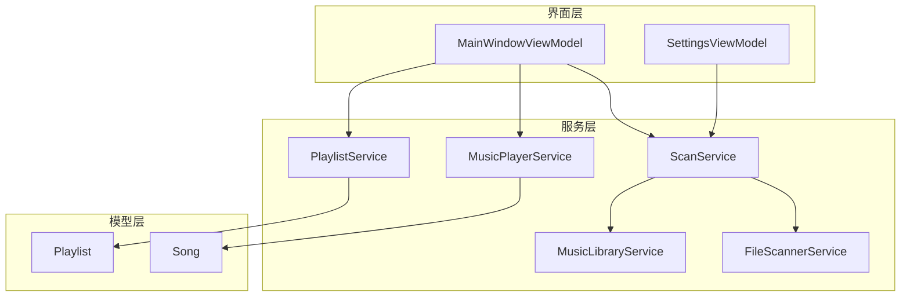
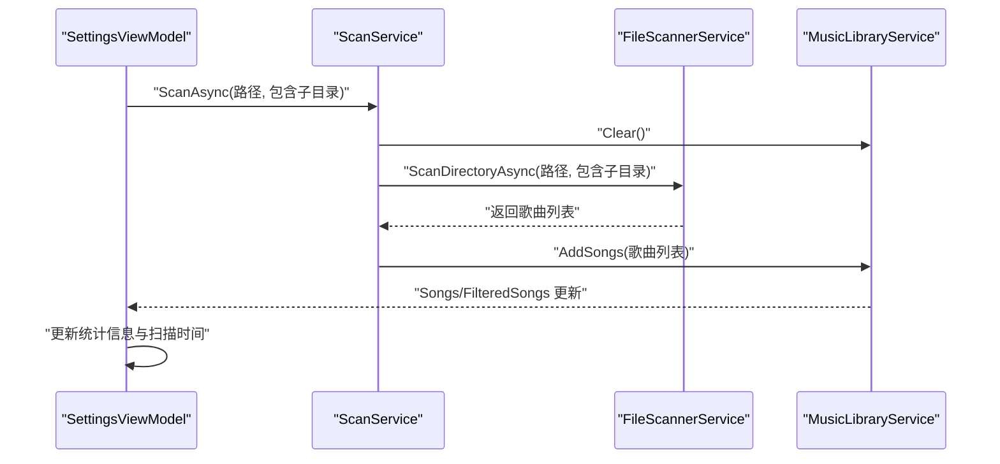
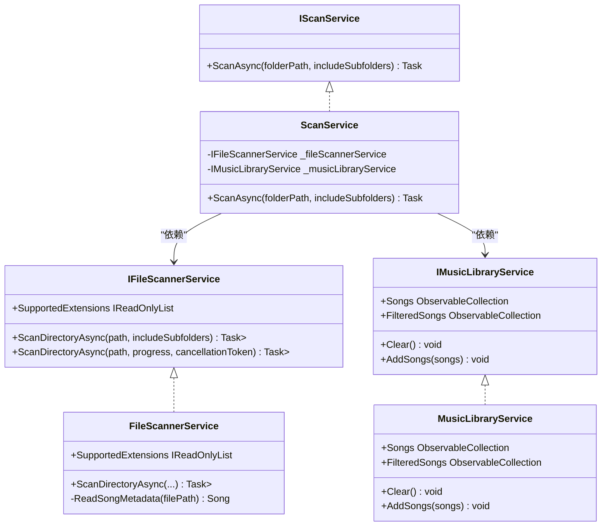
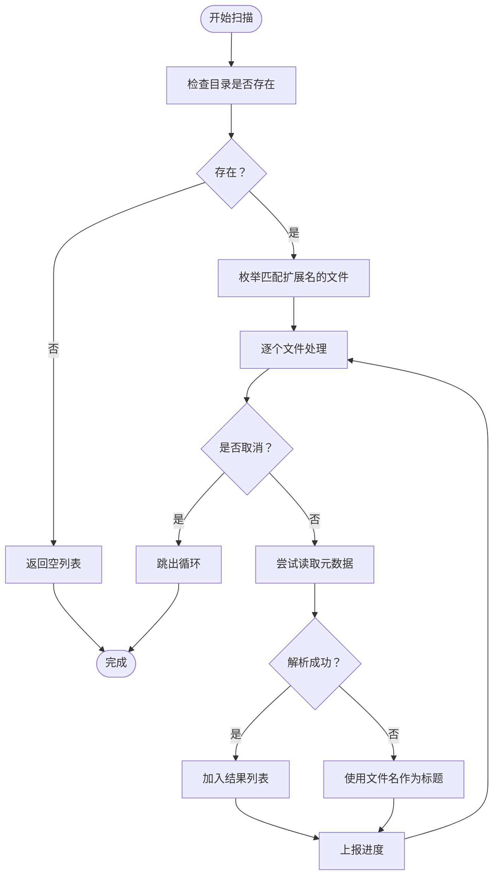
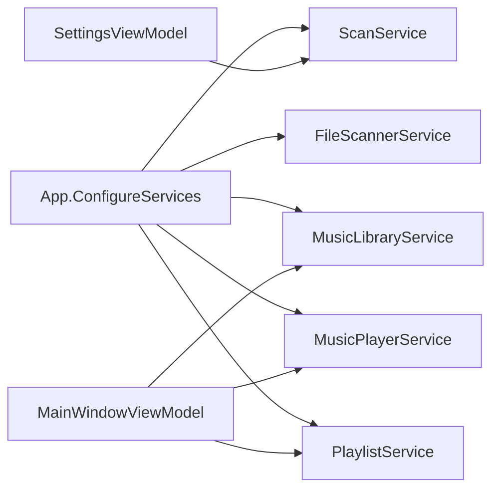

# 扫描协调服务

<cite>
**本文档引用的文件**
- [Services\IScanService.cs](file://Services/IScanService.cs)
- [Services\ScanService.cs](file://Services/ScanService.cs)
- [Services\IFileScannerService.cs](file://Services/IFileScannerService.cs)
- [Services\FileScannerService.cs](file://Services/FileScannerService.cs)
- [Services\IMusicLibraryService.cs](file://Services/IMusicLibraryService.cs)
- [Services\MusicLibraryService.cs](file://Services/MusicLibraryService.cs)
- [Services\IMusicPlayerService.cs](file://Services/IMusicPlayerService.cs)
- [Services\MusicPlayerService.cs](file://Services/MusicPlayerService.cs)
- [Services\IPlaylistService.cs](file://Services/IPlaylistService.cs)
- [Services\PlaylistService.cs](file://Services/PlaylistService.cs)
- [ViewModels\MainWindowViewModel.cs](file://ViewModels/MainWindowViewModel.cs)
- [ViewModels\SettingsViewModel.cs](file://ViewModels/SettingsViewModel.cs)
- [App.axaml.cs](file://App.axaml.cs)
- [Models\Song.cs](file://Models/Song.cs)
- [Models\Playlist.cs](file://Models/Playlist.cs)
</cite>

## 目录
1. [简介](#简介)
2. [项目结构](#项目结构)
3. [核心组件](#核心组件)
4. [架构总览](#架构总览)
5. [详细组件分析](#详细组件分析)
6. [依赖分析](#依赖分析)
7. [性能考虑](#性能考虑)
8. [故障排除指南](#故障排除指南)
9. [结论](#结论)
10. [附录](#附录)

## 简介
本文件聚焦于扫描协调服务，系统性阐述 ISacnService 接口的设计目标与 ScanService 实现类的协调机制；详解扫描流程的编排与调度策略（含多线程与任务队列）、扫描进度监控与状态报告、用户反馈机制；说明扫描服务与文件扫描服务、音乐库服务之间的交互关系与数据流转；介绍扫描配置管理、参数传递与结果汇总；涵盖扫描中断处理、错误恢复与重试机制；提供使用示例与性能调优建议，并解释扫描服务在应用生命周期中的作用与资源管理策略。

## 项目结构
本项目采用分层与按职责划分的服务架构：界面层（Views/ViewModels）通过依赖注入获取服务实例；服务层包含扫描协调、文件扫描、音乐库、播放器与播放列表等服务；模型层定义歌曲与播放列表实体。扫描协调服务位于服务层核心，负责编排扫描流程并将结果写入音乐库。

图表来源
- [App.axaml.cs:41-51](file://App.axaml.cs#L41-L51)
- [Services\ScanService.cs:6-23](file://Services/ScanService.cs#L6-L23)
- [Services\FileScannerService.cs:12-103](file://Services/FileScannerService.cs#L12-L103)
- [Services\MusicLibraryService.cs:7-27](file://Services/MusicLibraryService.cs#L7-L27)
- [Services\MusicPlayerService.cs:7-129](file://Services/MusicPlayerService.cs#L7-L129)
- [Services\PlaylistService.cs:7-120](file://Services/PlaylistService.cs#L7-L120)
- [Models\Song.cs:5-12](file://Models/Song.cs#L5-L12)
- [Models\Playlist.cs:5-9](file://Models/Playlist.cs#L5-L9)

章节来源
- [App.axaml.cs:18-51](file://App.axaml.cs#L18-L51)

## 核心组件
- 扫描协调接口与实现
  - IScanService：定义异步扫描入口，接收根目录路径与是否包含子目录的布尔参数。
  - ScanService：实现 IScanService，负责清理旧库、调用文件扫描服务、批量添加歌曲到音乐库。
- 文件扫描服务
  - IFileScannerService：提供多种重载的目录扫描方法，支持进度上报与取消令牌。
  - FileScannerService：实现具体扫描逻辑，过滤扩展名、并发读取元数据、进度上报、异常容错。
- 音乐库服务
  - IMusicLibraryService：暴露可观察集合 Songs 与 FilteredSongs，提供清空与批量添加能力。
  - MusicLibraryService：基于 ObservableCollection 实现，负责数据聚合与筛选视图同步。
- 播放器与播放列表服务
  - IMusicPlayerService、MusicPlayerService：提供播放控制、音量与位置事件。
  - IPlaylistService、PlaylistService：维护当前播放列表、索引与播放模式（普通/随机/循环）。

章节来源
- [Services\IScanService.cs:5-8](file://Services/IScanService.cs#L5-L8)
- [Services\ScanService.cs:6-23](file://Services/ScanService.cs#L6-L23)
- [Services\IFileScannerService.cs:9-16](file://Services/IFileScannerService.cs#L9-L16)
- [Services\FileScannerService.cs:12-103](file://Services/FileScannerService.cs#L12-L103)
- [Services\IMusicLibraryService.cs:7-13](file://Services/IMusicLibraryService.cs#L7-L13)
- [Services\MusicLibraryService.cs:7-27](file://Services/MusicLibraryService.cs#L7-L27)
- [Services\IMusicPlayerService.cs:6-27](file://Services/IMusicPlayerService.cs#L6-L27)
- [Services\MusicPlayerService.cs:7-129](file://Services/MusicPlayerService.cs#L7-L129)
- [Services\IPlaylistService.cs:7-21](file://Services/IPlaylistService.cs#L7-L21)
- [Services\PlaylistService.cs:7-120](file://Services/PlaylistService.cs#L7-L120)

## 架构总览
扫描协调服务以“清理旧库—扫描文件—写入库”的流水线方式工作，贯穿 UI 触发、服务编排与数据持久化。下图展示从设置页触发扫描到最终更新音乐库的时序：

图表来源
- [ViewModels\SettingsViewModel.cs:133-145](file://ViewModels/SettingsViewModel.cs#L133-L145)
- [Services\ScanService.cs:17-22](file://Services/ScanService.cs#L17-L22)
- [Services\FileScannerService.cs:16-25](file://Services/FileScannerService.cs#L16-L25)
- [Services\MusicLibraryService.cs:18-25](file://Services/MusicLibraryService.cs#L18-L25)

## 详细组件分析

### 扫描协调服务（IScanService 与 ScanService）
- 设计目的
  - 将“扫描”这一复合操作抽象为单一入口，屏蔽上层对文件扫描与音乐库操作的细节。
  - 统一扫描前后的状态管理（清空旧库、批量写入）。
- 协调机制
  - 清理：先清空音乐库，避免重复或脏数据。
  - 扫描：委托给文件扫描服务，支持包含/不包含子目录两种模式。
  - 写入：将扫描结果批量加入音乐库，同时更新筛选视图。
- 并发与调度
  - 扫描过程在后台线程执行，避免阻塞 UI。
  - 使用取消令牌支持中断；进度通过 IProgress 上报。
- 用户反馈
  - 设置页通过 IsScanning 标志与进度条联动，扫描完成后刷新统计信息。

图表来源
- [Services\IScanService.cs:5-8](file://Services/IScanService.cs#L5-L8)
- [Services\ScanService.cs:6-23](file://Services/ScanService.cs#L6-L23)
- [Services\IFileScannerService.cs:9-16](file://Services/IFileScannerService.cs#L9-L16)
- [Services\FileScannerService.cs:12-103](file://Services/FileScannerService.cs#L12-L103)
- [Services\IMusicLibraryService.cs:7-13](file://Services/IMusicLibraryService.cs#L7-L13)
- [Services\MusicLibraryService.cs:7-27](file://Services/MusicLibraryService.cs#L7-L27)

章节来源
- [Services\ScanService.cs:17-22](file://Services/ScanService.cs#L17-L22)
- [ViewModels\SettingsViewModel.cs:133-145](file://ViewModels/SettingsViewModel.cs#L133-L145)

### 文件扫描服务（IFileScannerService 与 FileScannerService）
- 功能要点
  - 支持多种音频扩展名过滤。
  - 提供带进度与取消的扫描重载，便于 UI 反馈与中断。
  - 对单个文件读取元数据失败时进行降级处理（保留文件名作为标题）。
- 多线程与任务队列
  - 使用后台线程遍历文件并解析元数据，避免 UI 卡顿。
  - 进度按已处理数量占总数的比例上报。
- 中断与错误恢复
  - 周期性检查取消令牌，收到请求立即停止后续处理。
  - 解析失败的文件不会中断整体流程，而是记录降级项并继续。
- 性能特性
  - 使用 LINQ 过滤与一次性枚举，减少内存占用。
  - 元数据读取使用外部库，异常即降级，保证稳定性。

图表来源
- [Services\FileScannerService.cs:27-75](file://Services/FileScannerService.cs#L27-L75)

章节来源
- [Services\IFileScannerService.cs:9-16](file://Services/IFileScannerService.cs#L9-L16)
- [Services\FileScannerService.cs:14-103](file://Services/FileScannerService.cs#L14-L103)

### 音乐库服务（IMusicLibraryService 与 MusicLibraryService）
- 职责
  - 维护 Songs 与 FilteredSongs 两个可观察集合，用于 UI 展示与搜索过滤。
  - 提供 Clear 与 AddSongs 批量写入能力，确保一致性。
- 数据结构
  - 基于 ObservableCollection，支持 UI 自动刷新。
- 与扫描流程的关系
  - 扫描完成后由 ScanService 调用 AddSongs，同时更新 FilteredSongs，保证筛选视图同步。

章节来源
- [Services\IMusicLibraryService.cs:7-13](file://Services/IMusicLibraryService.cs#L7-L13)
- [Services\MusicLibraryService.cs:7-27](file://Services/MusicLibraryService.cs#L7-L27)
- [Services\ScanService.cs:19-22](file://Services/ScanService.cs#L19-L22)

### 播放器与播放列表服务（与扫描的交互）
- 播放器服务
  - 提供播放控制、音量、位置与状态事件，供主窗口 ViewModel 订阅并更新 UI。
- 播放列表服务
  - 维护当前播放列表、索引与播放模式（普通/随机/循环），与播放器协同工作。
- 与扫描的关系
  - 扫描结果写入音乐库后，播放列表可直接基于库中歌曲构建或追加。
  - 主窗口订阅播放状态变化，实现播放进度与按钮状态联动。

章节来源
- [Services\IMusicPlayerService.cs:6-27](file://Services/IMusicPlayerService.cs#L6-L27)
- [Services\MusicPlayerService.cs:7-129](file://Services/MusicPlayerService.cs#L7-L129)
- [Services\IPlaylistService.cs:7-21](file://Services/IPlaylistService.cs#L7-L21)
- [Services\PlaylistService.cs:7-120](file://Services/PlaylistService.cs#L7-L120)
- [ViewModels\MainWindowViewModel.cs:100-216](file://ViewModels/MainWindowViewModel.cs#L100-L216)

## 依赖分析
- 依赖注入配置
  - 应用启动时注册所有服务为单例，确保全局唯一实例与跨视图共享状态。
- 组件耦合
  - ScanService 依赖 FileScannerService 与 MusicLibraryService，耦合度低，便于替换与测试。
  - SettingsViewModel 与 MainWindowViewModel 通过 IScanService 与 IMusicLibraryService 间接依赖具体实现，保持界面与业务解耦。

图表来源
- [App.axaml.cs:41-51](file://App.axaml.cs#L41-L51)
- [ViewModels\SettingsViewModel.cs:107-115](file://ViewModels/SettingsViewModel.cs#L107-L115)
- [ViewModels\MainWindowViewModel.cs:120-136](file://ViewModels/MainWindowViewModel.cs#L120-L136)

章节来源
- [App.axaml.cs:41-51](file://App.axaml.cs#L41-L51)

## 性能考虑
- I/O 与 CPU 分离
  - 文件扫描在后台线程执行，避免阻塞 UI；元数据解析可能较慢，建议限制并发或分批处理。
- 进度与取消
  - 使用 IProgress 与 CancellationToken，确保长耗时扫描可中断与可观测。
- 内存与集合
  - 使用 ObservableCollection，避免频繁重建集合；批量 AddSongs 减少 UI 刷新次数。
- 扩展名过滤
  - 在扫描前过滤扩展名，减少无效文件处理；如需动态扩展，可考虑缓存与增量更新。
- 外部库稳定性
  - 元数据读取失败时的降级策略保障了扫描的鲁棒性；若磁盘文件损坏较多，可考虑增加重试与日志记录。

## 故障排除指南
- 扫描无结果
  - 检查选择的根目录是否存在与可访问。
  - 确认 SupportedExtensions 是否包含目标文件扩展名。
- 扫描卡住或无进度
  - 确认 UI 已正确绑定 IsScanning 与进度回调。
  - 若扫描时间过长，考虑启用取消令牌并提供中断按钮。
- 部分文件未被识别
  - 元数据读取失败会降级为文件名，属于预期行为；可手动修正元数据或更换文件。
- UI 不刷新
  - 确保 AddSongs 后集合已通知变更；避免在非 UI 线程直接修改集合。
- 播放异常
  - 检查文件路径有效性与媒体库一致性；播放器服务初始化失败会导致无法播放。

章节来源
- [Services\FileScannerService.cs:32-35](file://Services/FileScannerService.cs#L32-L35)
- [Services\FileScannerService.cs:54-67](file://Services/FileScannerService.cs#L54-L67)
- [Services\MusicLibraryService.cs:18-25](file://Services/MusicLibraryService.cs#L18-L25)
- [Services\MusicPlayerService.cs:27-38](file://Services/MusicPlayerService.cs#L27-L38)

## 结论
扫描协调服务通过清晰的接口与简洁的实现，将复杂的文件扫描、元数据解析与库更新整合为统一的异步流程。其设计兼顾了可扩展性（支持取消与进度）、健壮性（异常降级）与用户体验（UI 线程不阻塞）。结合依赖注入与可观察集合，扫描服务在应用生命周期内稳定地为播放器与播放列表提供数据支撑。

## 附录

### 使用示例
- 触发扫描
  - 在设置页点击“立即扫描”，输入音乐目录并勾选是否包含子目录，等待扫描完成并查看统计信息。
- 参数传递
  - ScanAsync 接收根目录路径与包含子目录布尔值；FileScannerService 的重载支持进度与取消。
- 结果汇总
  - 扫描完成后，音乐库 Songs 与 FilteredSongs 同步更新；设置页统计歌曲数与专辑数。

章节来源
- [ViewModels\SettingsViewModel.cs:133-145](file://ViewModels/SettingsViewModel.cs#L133-L145)
- [Services\ScanService.cs:17-22](file://Services/ScanService.cs#L17-L22)
- [Services\IMusicLibraryService.cs:9-12](file://Services/IMusicLibraryService.cs#L9-L12)

### 配置与参数
- 扫描配置
  - 目录选择：通过窗口提供者打开文件夹选择器。
  - 子目录选项：影响扫描范围。
  - 元数据自动检测：当前实现依赖外部库解析，失败时降级。
- 服务注册
  - 应用启动时集中注册各服务，确保单例与依赖解析。

章节来源
- [ViewModels\SettingsViewModel.cs:116-131](file://ViewModels/SettingsViewModel.cs#L116-L131)
- [App.axaml.cs:41-51](file://App.axaml.cs#L41-L51)

### 错误恢复与重试机制
- 当前实现
  - 单个文件解析失败时降级为文件名标题并继续扫描。
  - 支持取消令牌中断扫描。
- 建议增强
  - 引入重试策略（指数退避）与错误计数阈值。
  - 记录失败文件清单以便后续修复或二次扫描。

章节来源
- [Services\FileScannerService.cs:54-67](file://Services/FileScannerService.cs#L54-L67)
- [Services\FileScannerService.cs:49-52](file://Services/FileScannerService.cs#L49-L52)

### 生命周期与资源管理
- 服务生命周期
  - 所有服务注册为单例，随应用启动初始化并在整个生命周期内复用。
- 资源释放
  - 播放器服务实现 IDisposable，在销毁时释放底层媒体资源。
- UI 状态
  - 通过 IsScanning 与事件订阅维持 UI 与服务状态一致。

章节来源
- [App.axaml.cs:41-51](file://App.axaml.cs#L41-L51)
- [Services\MusicPlayerService.cs:120-129](file://Services/MusicPlayerService.cs#L120-L129)
- [ViewModels\MainWindowViewModel.cs:100-106](file://ViewModels/MainWindowViewModel.cs#L100-L106)