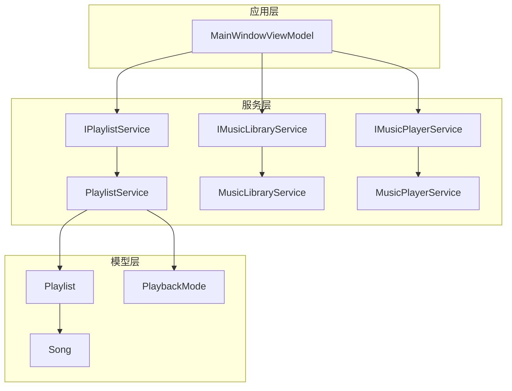
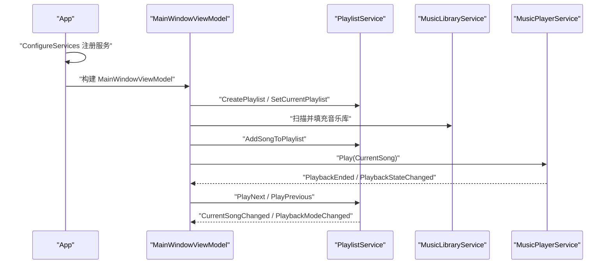
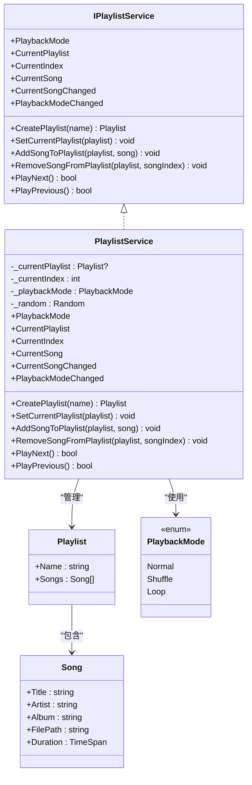
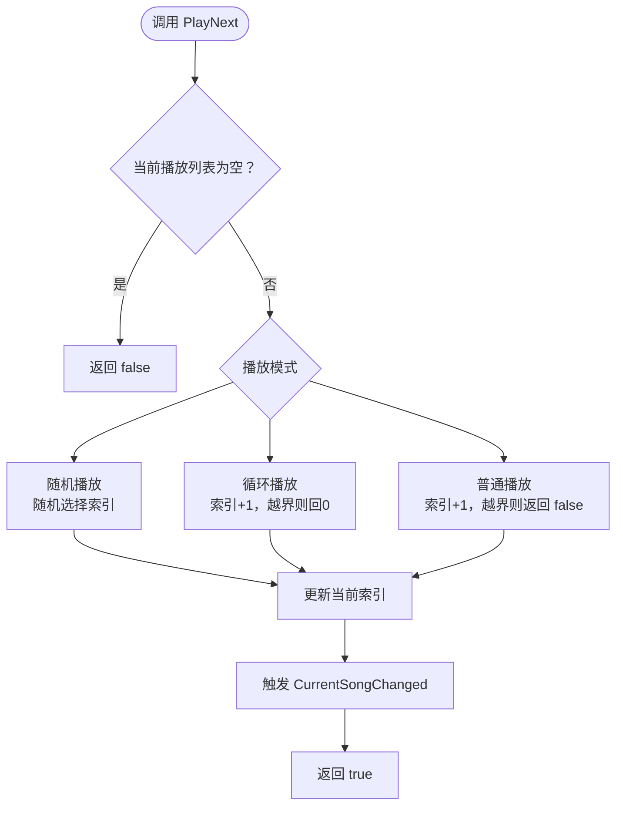
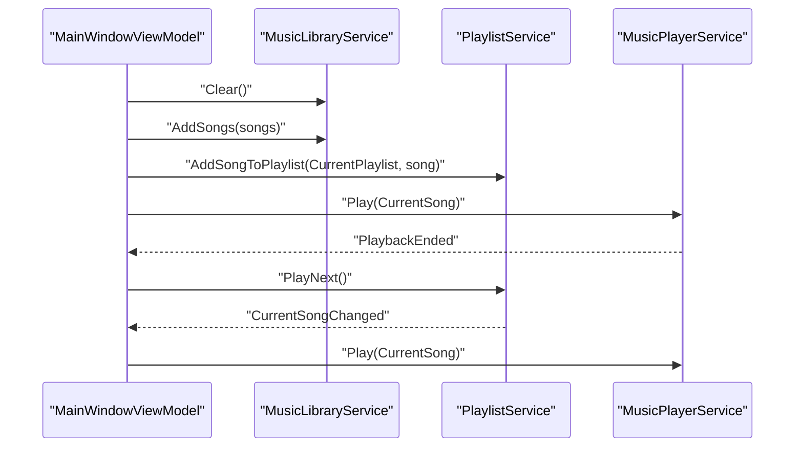
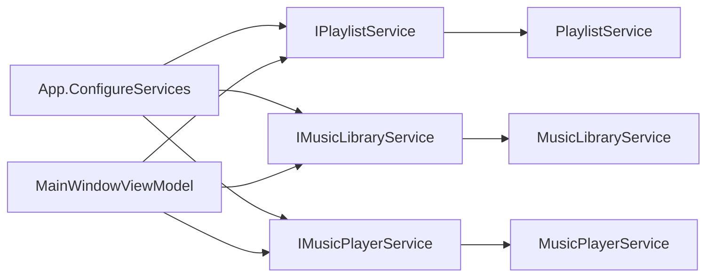

# 播放列表服务

<cite>
**本文引用的文件**
- [IPlaylistService.cs](file://Services/IPlaylistService.cs)
- [PlaylistService.cs](file://Services/PlaylistService.cs)
- [Playlist.cs](file://Models/Playlist.cs)
- [Song.cs](file://Models/Song.cs)
- [PlaybackMode.cs](file://Models/PlaybackMode.cs)
- [IMusicLibraryService.cs](file://Services/IMusicLibraryService.cs)
- [MusicLibraryService.cs](file://Services/MusicLibraryService.cs)
- [IMusicPlayerService.cs](file://Services/IMusicPlayerService.cs)
- [MusicPlayerService.cs](file://Services/MusicPlayerService.cs)
- [MainWindowViewModel.cs](file://ViewModels/MainWindowViewModel.cs)
- [App.axaml.cs](file://App.axaml.cs)
- [IScanService.cs](file://Services/IScanService.cs)
- [ScanService.cs](file://Services/ScanService.cs)
</cite>

## 目录
1. [简介](#简介)
2. [项目结构](#项目结构)
3. [核心组件](#核心组件)
4. [架构总览](#架构总览)
5. [详细组件分析](#详细组件分析)
6. [依赖关系分析](#依赖关系分析)
7. [性能考虑](#性能考虑)
8. [故障排除指南](#故障排除指南)
9. [结论](#结论)
10. [附录](#附录)

## 简介
本文件系统性地梳理了播放列表服务的设计与实现，围绕 IPlaylistService 接口与 PlaylistService 类展开，重点覆盖以下方面：
- 播放列表的创建、修改（增删歌曲）、查询与当前播放项跟踪
- 播放模式控制（普通播放、随机播放、循环播放）的实现与切换机制
- 歌曲索引管理、播放队列维护与事件通知
- 与音乐库服务的协作关系与数据同步机制
- 当前代码库中未实现的持久化、导入导出、重复检测与冲突处理等扩展点的现状说明与建议

## 项目结构
播放列表服务位于 Services 层，核心接口与实现如下：
- 接口层：IPlaylistService 定义播放列表服务契约
- 实现层：PlaylistService 提供播放列表管理与播放控制逻辑
- 数据模型：Playlist、Song、PlaybackMode 描述播放列表、歌曲与播放模式
- 协作服务：IMusicLibraryService、IMusicPlayerService 分别负责音乐库与播放器
- 应用入口：App.axaml.cs 注册服务；MainWindowViewModel 使用服务协调 UI 与播放流程

图表来源
- [App.axaml.cs:41-51](file://App.axaml.cs#L41-L51)
- [MainWindowViewModel.cs:120-130](file://ViewModels/MainWindowViewModel.cs#L120-L130)
- [IPlaylistService.cs:7-21](file://Services/IPlaylistService.cs#L7-L21)
- [PlaylistService.cs:7-34](file://Services/PlaylistService.cs#L7-L34)
- [IMusicLibraryService.cs:7-13](file://Services/IMusicLibraryService.cs#L7-L13)
- [MusicLibraryService.cs:7-26](file://Services/MusicLibraryService.cs#L7-L26)
- [IMusicPlayerService.cs:6-27](file://Services/IMusicPlayerService.cs#L6-L27)
- [MusicPlayerService.cs:7-38](file://Services/MusicPlayerService.cs#L7-L38)
- [Playlist.cs:5-9](file://Models/Playlist.cs#L5-L9)
- [Song.cs:5-12](file://Models/Song.cs#L5-L12)
- [PlaybackMode.cs:3-8](file://Models/PlaybackMode.cs#L3-L8)

章节来源
- [App.axaml.cs:41-51](file://App.axaml.cs#L41-L51)
- [MainWindowViewModel.cs:120-130](file://ViewModels/MainWindowViewModel.cs#L120-L130)

## 核心组件
- IPlaylistService：定义播放列表服务的契约，包括创建播放列表、设置当前播放列表、添加/移除歌曲、前进/后退播放、播放模式与当前播放项的读写以及事件通知。
- PlaylistService：IPlaylistService 的具体实现，内部维护当前播放列表、当前索引、播放模式与随机数生成器，并通过事件向订阅者广播状态变化。
- Playlist：播放列表实体，包含名称与歌曲集合。
- Song：歌曲实体，包含标题、艺人、专辑、文件路径与时长。
- PlaybackMode：播放模式枚举，支持 Normal、Shuffle、Loop。

章节来源
- [IPlaylistService.cs:7-21](file://Services/IPlaylistService.cs#L7-L21)
- [PlaylistService.cs:7-34](file://Services/PlaylistService.cs#L7-L34)
- [Playlist.cs:5-9](file://Models/Playlist.cs#L5-L9)
- [Song.cs:5-12](file://Models/Song.cs#L5-L12)
- [PlaybackMode.cs:3-8](file://Models/PlaybackMode.cs#L3-L8)

## 架构总览
播放列表服务在应用中的职责是管理播放队列、维护当前播放项与播放模式，并与音乐库服务和播放器服务协同工作。应用启动时通过依赖注入注册服务，视图模型在构造函数中注入这些服务并驱动播放流程。

图表来源
- [App.axaml.cs:41-51](file://App.axaml.cs#L41-L51)
- [MainWindowViewModel.cs:120-130](file://ViewModels/MainWindowViewModel.cs#L120-L130)
- [MainWindowViewModel.cs:144-161](file://ViewModels/MainWindowViewModel.cs#L144-L161)
- [MainWindowViewModel.cs:197-205](file://ViewModels/MainWindowViewModel.cs#L197-L205)
- [MusicPlayerService.cs:33-37](file://Services/MusicPlayerService.cs#L33-L37)

## 详细组件分析

### IPlaylistService 接口设计
- 职责边界清晰：仅关注播放列表与播放控制，不涉及持久化与导入导出。
- 关键能力：
  - 创建播放列表与设置当前播放列表
  - 添加/移除指定索引的歌曲
  - 前进/后退播放，返回是否成功
  - 播放模式读写与事件通知
  - 当前播放列表、索引与歌曲的只读访问

章节来源
- [IPlaylistService.cs:7-21](file://Services/IPlaylistService.cs#L7-L21)

### PlaylistService 实现机制
- 内部状态：
  - 当前播放列表、当前索引、播放模式、随机数生成器
- 事件机制：
  - CurrentSongChanged：当前歌曲变更时触发
  - PlaybackModeChanged：播放模式变更时触发
- 播放控制逻辑：
  - PlayNext：根据播放模式计算下一首索引，更新当前索引并触发事件
  - PlayPrevious：根据播放模式计算上一首索引，更新当前索引并触发事件
- 队列维护：
  - AddSongToPlaylist：复制现有列表并追加新歌曲
  - RemoveSongFromPlaylist：复制现有列表并移除指定索引的歌曲

图表来源
- [IPlaylistService.cs:7-21](file://Services/IPlaylistService.cs#L7-L21)
- [PlaylistService.cs:7-120](file://Services/PlaylistService.cs#L7-L120)
- [Playlist.cs:5-9](file://Models/Playlist.cs#L5-L9)
- [Song.cs:5-12](file://Models/Song.cs#L5-L12)
- [PlaybackMode.cs:3-8](file://Models/PlaybackMode.cs#L3-L8)

章节来源
- [PlaylistService.cs:7-120](file://Services/PlaylistService.cs#L7-L120)

### 播放模式控制与切换机制
- 普通播放（Normal）：按顺序播放，到达末尾则无法继续前进
- 随机播放（Shuffle）：每次前进选择一个随机索引
- 循环播放（Loop）：前进到末尾回到开头，后退到开头回到末尾
- 切换逻辑：
  - 视图模型通过命令切换播放模式
  - PlaylistService 在设置属性时触发 PlaybackModeChanged 事件

图表来源
- [PlaylistService.cs:69-95](file://Services/PlaylistService.cs#L69-L95)
- [PlaybackMode.cs:3-8](file://Models/PlaybackMode.cs#L3-L8)

章节来源
- [PlaylistService.cs:69-119](file://Services/PlaylistService.cs#L69-L119)
- [MainWindowViewModel.cs:167-178](file://ViewModels/MainWindowViewModel.cs#L167-L178)

### 歌曲索引管理与播放队列维护
- 索引管理：
  - 当前索引初始为 -1，表示尚未开始播放
  - PlayNext/PlayPrevious 更新当前索引
- 队列维护：
  - 添加/移除歌曲时复制现有列表，避免直接修改原集合
  - 通过新的 List<Song> 替换 Playlist.Songs，确保集合可变性与一致性

章节来源
- [PlaylistService.cs:9-11](file://Services/PlaylistService.cs#L9-L11)
- [PlaylistService.cs:53-67](file://Services/PlaylistService.cs#L53-L67)

### 当前播放项跟踪与事件通知
- CurrentSong 通过当前播放列表与当前索引推导
- CurrentSongChanged 在 PlayNext/PlayPrevious 后触发
- PlaybackModeChanged 在播放模式属性被设置时触发

章节来源
- [PlaylistService.cs:17-21](file://Services/PlaylistService.cs#L17-L21)
- [PlaylistService.cs:14](file://Services/PlaylistService.cs#L14)
- [PlaylistService.cs:31](file://Services/PlaylistService.cs#L31)

### 与音乐库服务的协作与数据同步
- 音乐库服务提供 ObservableCollection<Song> 与过滤后的集合
- 扫描服务负责清空并填充音乐库
- 视图模型在播放歌曲时从音乐库中查找对应歌曲并将其加入播放列表

图表来源
- [ScanService.cs:17-22](file://Services/ScanService.cs#L17-L22)
- [MusicLibraryService.cs:12-25](file://Services/MusicLibraryService.cs#L12-L25)
- [MainWindowViewModel.cs:179-195](file://ViewModels/MainWindowViewModel.cs#L179-L195)
- [PlaylistService.cs:53-67](file://Services/PlaylistService.cs#L53-L67)
- [MusicPlayerService.cs:40-48](file://Services/MusicPlayerService.cs#L40-L48)

章节来源
- [ScanService.cs:17-22](file://Services/ScanService.cs#L17-L22)
- [MusicLibraryService.cs:12-25](file://Services/MusicLibraryService.cs#L12-L25)
- [MainWindowViewModel.cs:179-195](file://ViewModels/MainWindowViewModel.cs#L179-L195)

### 播放列表持久化、导入导出与重复检测
- 现状：当前代码库未实现播放列表的持久化存储、导入导出、重复检测与冲突解决策略
- 建议扩展方向（概念性说明）：
  - 引入 JSON 序列化/反序列化，保存 Playlist 名称与歌曲文件路径
  - 导入时进行路径存在性校验与去重
  - 冲突解决：保留用户选择或自动合并同名播放列表
  - 与 IPlaylistService 新增方法：Load/Save、Import/Export、Merge

[本节为概念性建议，不直接分析具体文件，故无章节来源]

## 依赖关系分析
- 依赖注入注册：App 在 ConfigureServices 中注册 IPlaylistService、IMusicLibraryService、IMusicPlayerService 等服务
- 视图模型依赖：MainWindowViewModel 注入上述服务并协调播放流程
- 服务间耦合：PlaylistService 与 MusicPlayerService 通过事件解耦，通过 CurrentSongChanged 与 PlaybackEnded 协同

图表来源
- [App.axaml.cs:41-51](file://App.axaml.cs#L41-L51)
- [MainWindowViewModel.cs:120-130](file://ViewModels/MainWindowViewModel.cs#L120-L130)

章节来源
- [App.axaml.cs:41-51](file://App.axaml.cs#L41-L51)
- [MainWindowViewModel.cs:120-130](file://ViewModels/MainWindowViewModel.cs#L120-L130)

## 性能考虑
- 集合操作：
  - 添加/移除歌曲时复制列表，时间复杂度 O(n)，n 为歌曲数量
  - 建议：在批量操作时合并多次变更，减少集合替换次数
- 随机播放：
  - 使用 Random 生成索引，注意线程安全与种子初始化
- 事件风暴：
  - 频繁触发 CurrentSongChanged 可能导致 UI 抖动，建议在 UI 线程订阅并节流
- 播放器集成：
  - MusicPlayerService 通过 LibVLC 播放媒体，注意资源释放与异常处理

[本节提供通用指导，不直接分析具体文件，故无章节来源]

## 故障排除指南
- 播放列表为空或索引越界：
  - PlayNext/PlayPrevious 在空列表或越界时返回 false，需检查当前播放列表与索引状态
- 播放模式切换无效：
  - 确认视图模型命令正确设置 PlaybackMode，并监听 PlaybackModeChanged 事件
- 歌曲未播放：
  - 确认 CurrentSong 已更新且已调用播放器 Play 方法
- 事件未触发：
  - 检查事件订阅位置与 UI 线程调度

章节来源
- [PlaylistService.cs:69-119](file://Services/PlaylistService.cs#L69-L119)
- [MainWindowViewModel.cs:144-161](file://ViewModels/MainWindowViewModel.cs#L144-L161)
- [MusicPlayerService.cs:40-48](file://Services/MusicPlayerService.cs#L40-L48)

## 结论
播放列表服务通过清晰的接口与简洁的实现，提供了播放队列管理与播放模式控制的核心能力。其与音乐库服务和播放器服务的协作关系明确，事件驱动的设计降低了模块间的耦合。当前代码库未实现持久化与导入导出等功能，后续可在不破坏现有接口的前提下扩展这些能力。

## 附录
- 实际使用示例（基于现有代码）：
  - 创建播放列表并设为当前播放列表：见 [MainWindowViewModel.cs:135-136](file://ViewModels/MainWindowViewModel.cs#L135-L136)
  - 添加歌曲到播放列表：见 [MainWindowViewModel.cs:187-189](file://ViewModels/MainWindowViewModel.cs#L187-L189)
  - 前进/后退播放：见 [MainWindowViewModel.cs:144-161](file://ViewModels/MainWindowViewModel.cs#L144-L161)
  - 切换播放模式：见 [MainWindowViewModel.cs:167-178](file://ViewModels/MainWindowViewModel.cs#L167-L178)
  - 播放结束自动下一首：见 [MainWindowViewModel.cs:197-205](file://ViewModels/MainWindowViewModel.cs#L197-L205)