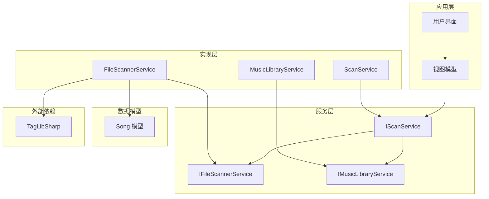
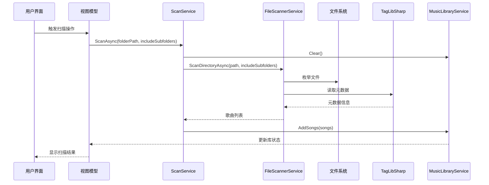
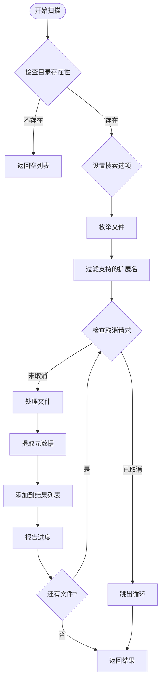
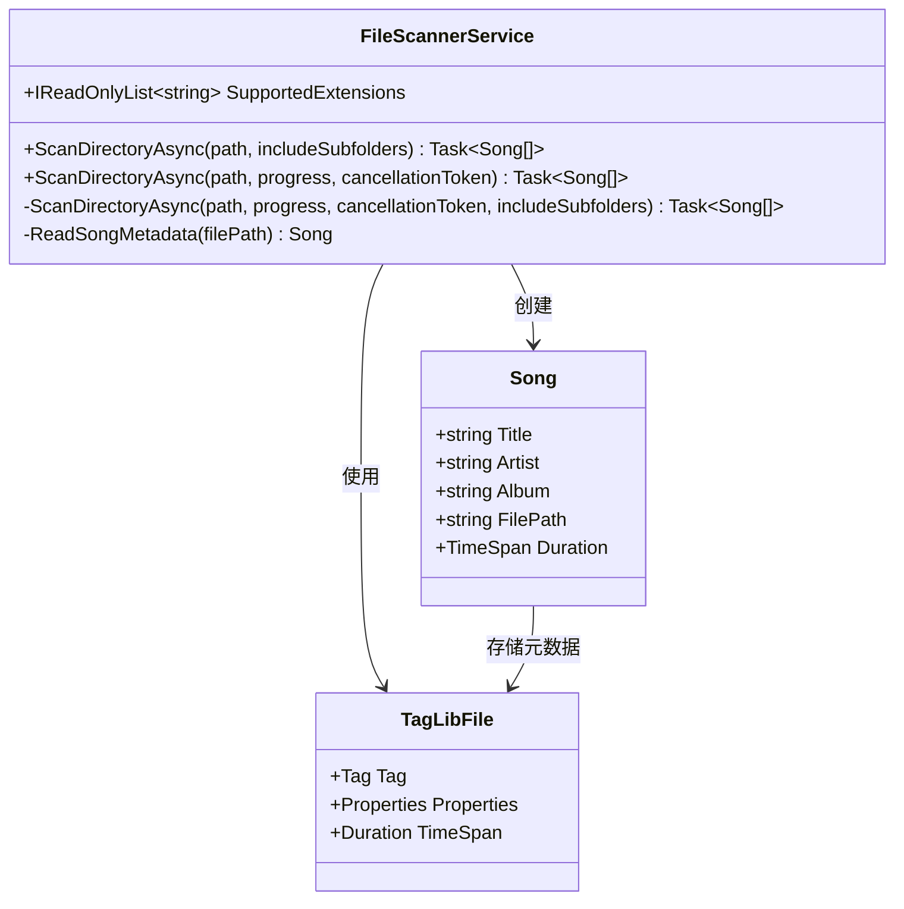
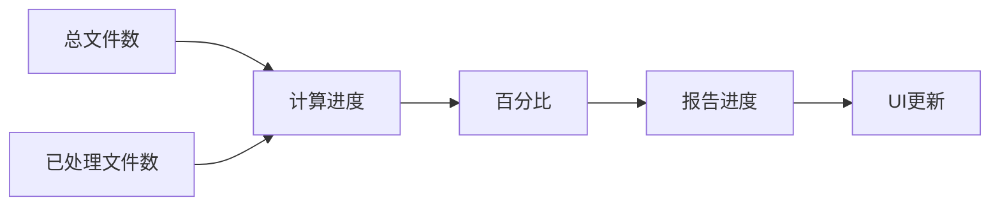
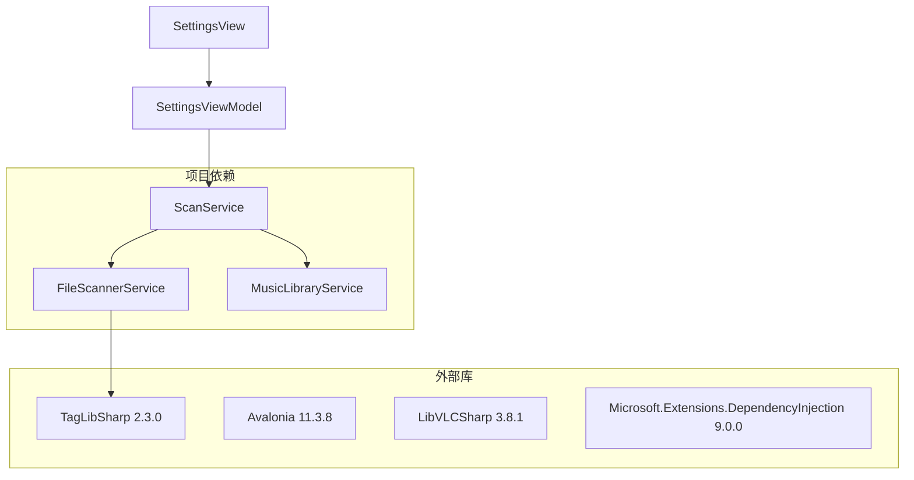
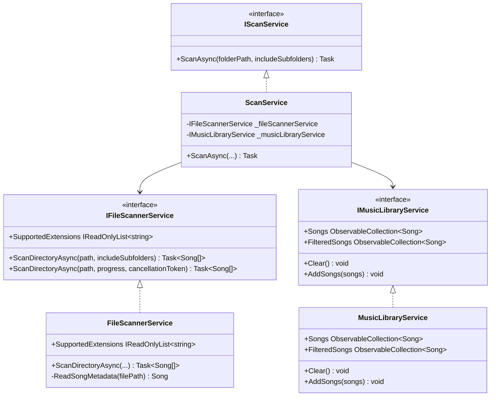
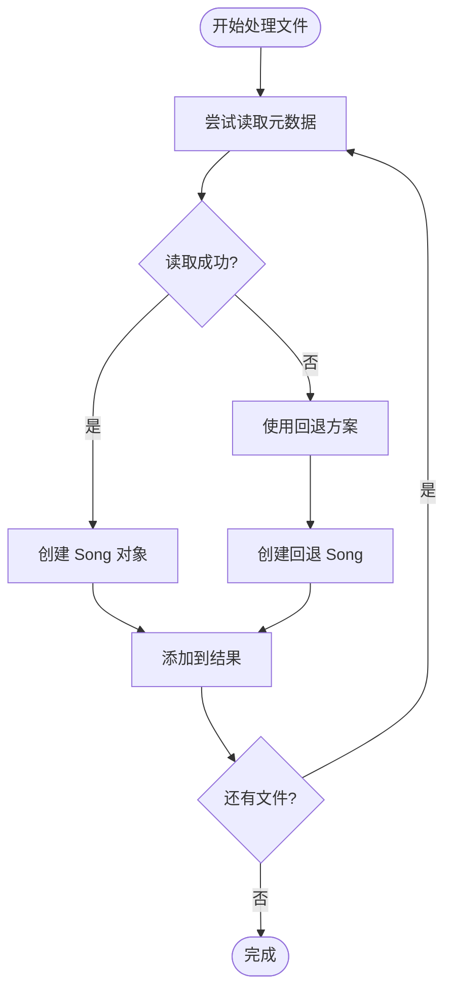

# 文件扫描服务

<cite>
**本文档引用的文件**
- [IFileScannerService.cs](file://Services/IFileScannerService.cs)
- [FileScannerService.cs](file://Services/FileScannerService.cs)
- [IScanService.cs](file://Services/IScanService.cs)
- [ScanService.cs](file://Services/ScanService.cs)
- [IMusicLibraryService.cs](file://Services/IMusicLibraryService.cs)
- [MusicLibraryService.cs](file://Services/MusicLibraryService.cs)
- [Song.cs](file://Models/Song.cs)
- [LocalMusicPlayer.csproj](file://LocalMusicPlayer.csproj)
- [SettingsViewModel.cs](file://ViewModels/SettingsViewModel.cs)
- [spec.md](file://.trae/specs/core-features/spec.md)
</cite>

## 目录
1. [简介](#简介)
2. [项目结构](#项目结构)
3. [核心组件](#核心组件)
4. [架构概览](#架构概览)
5. [详细组件分析](#详细组件分析)
6. [依赖关系分析](#依赖关系分析)
7. [性能考虑](#性能考虑)
8. [故障排除指南](#故障排除指南)
9. [结论](#结论)
10. [附录](#附录)

## 简介

文件扫描服务是 LocalMusicPlayer 音乐播放器的核心组件之一，负责扫描本地音乐文件并提取元数据信息。该服务基于接口驱动的设计模式，提供了灵活且可扩展的文件扫描能力，支持多种音频格式的识别和处理。

本文档深入分析了 IFileScannerService 接口的设计理念和 FileScannerService 实现类的核心功能，详细说明了异步文件扫描机制、元数据提取过程、进度报告机制以及错误处理策略。

## 项目结构

LocalMusicPlayer 采用分层架构设计，文件扫描服务位于 Services 目录中，与数据模型、视图模型和 UI 组件分离：



**图表来源**
- [IFileScannerService.cs:1-17](file://Services/IFileScannerService.cs#L1-L17)
- [FileScannerService.cs:1-103](file://Services/FileScannerService.cs#L1-L103)
- [IScanService.cs:1-9](file://Services/IScanService.cs#L1-L9)
- [ScanService.cs:1-24](file://Services/ScanService.cs#L1-L24)
- [IMusicLibraryService.cs:1-14](file://Services/IMusicLibraryService.cs#L1-L14)
- [MusicLibraryService.cs:1-27](file://Services/MusicLibraryService.cs#L1-L27)

**章节来源**
- [LocalMusicPlayer.csproj:1-43](file://LocalMusicPlayer.csproj#L1-L43)
- [IFileScannerService.cs:1-17](file://Services/IFileScannerService.cs#L1-L17)

## 核心组件

### IFileScannerService 接口设计

IFileScannerService 接口采用了简洁而强大的设计原则，提供了两个主要的扫描方法：

1. **基础扫描方法**：`ScanDirectoryAsync(string path, bool includeSubfolders = true)`
   - 支持递归扫描子文件夹
   - 返回完整的歌曲列表

2. **高级扫描方法**：`ScanDirectoryAsync(string path, IProgress<int>? progress, CancellationToken cancellationToken)`
   - 支持进度报告
   - 支持取消操作
   - 提供细粒度的扫描控制

接口还暴露了 `SupportedExtensions` 属性，用于查询支持的音频文件扩展名列表。

### FileScannerService 实现

FileScannerService 是接口的具体实现，具有以下核心特性：

- **多格式支持**：支持 MP3、FLAC、WAV、AAC、OGG、M4A 等主流音频格式
- **异步处理**：完全基于异步编程模型，避免阻塞 UI 线程
- **内存优化**：使用流式文件枚举，减少内存占用
- **错误容错**：对损坏或无法读取的文件进行优雅降级处理

**章节来源**
- [IFileScannerService.cs:9-16](file://Services/IFileScannerService.cs#L9-L16)
- [FileScannerService.cs:12-14](file://Services/FileScannerService.cs#L12-L14)

## 架构概览

文件扫描服务在整个应用架构中的位置和交互关系如下：



**图表来源**
- [ScanService.cs:17-22](file://Services/ScanService.cs#L17-L22)
- [FileScannerService.cs:16-25](file://Services/FileScannerService.cs#L16-L25)
- [MusicLibraryService.cs:18-25](file://Services/MusicLibraryService.cs#L18-L25)

## 详细组件分析

### 异步文件扫描机制

#### 目录遍历策略

FileScannerService 采用了高效的目录遍历策略：



**图表来源**
- [FileScannerService.cs:27-75](file://Services/FileScannerService.cs#L27-L75)

#### 并发处理策略

虽然当前实现使用单线程处理文件，但代码结构已经为未来的并发优化预留了空间：

- **线程安全**：使用 `Task.Run` 在后台线程执行文件处理
- **取消支持**：实时检查 `CancellationToken` 状态
- **进度报告**：每处理一个文件就更新一次进度

### 元数据提取过程

#### TagLibSharp 集成

FileScannerService 通过 TagLibSharp 库实现高质量的音频元数据提取：



**图表来源**
- [FileScannerService.cs:77-101](file://Services/FileScannerService.cs#L77-L101)
- [Song.cs:5-12](file://Models/Song.cs#L5-L12)

#### 音频格式识别

支持的音频格式及其特性：

| 格式 | 扩展名 | 特性 | 质量 |
|------|--------|------|------|
| MP3 | .mp3 | 最广泛支持 | 可变比特率 |
| FLAC | .flac | 无损压缩 | 无损 |
| WAV | .wav | 未压缩 | 无损 |
| AAC | .aac | 高效压缩 | 高质量 |
| OGG | .ogg | 开源格式 | 可变质量 |
| M4A | .m4a | Apple格式 | 高质量 |

#### 信息解析流程

元数据提取遵循以下优先级顺序：

1. **标题**：优先使用文件标签中的标题，若为空则使用文件名
2. **艺术家**：使用第一表演者信息
3. **专辑**：使用专辑标签信息
4. **时长**：直接从文件属性获取
5. **文件路径**：完整文件路径

### 进度报告机制

#### 进度计算算法

进度报告采用简单的百分比计算方式：



**图表来源**
- [FileScannerService.cs:42-71](file://Services/FileScannerService.cs#L42-L71)

#### 进度更新频率

每次文件处理完成后都会更新进度，确保用户能够实时了解扫描状态。

### 取消令牌使用

#### 取消检测时机

取消令牌在以下关键点被检查：

1. **文件处理循环开始**：每次迭代开始时
2. **异常处理**：捕获异常时
3. **方法结束**：返回结果前

#### 取消响应策略

当检测到取消请求时：
- 立即停止处理剩余文件
- 返回已处理的文件列表
- 不抛出异常中断调用链

**章节来源**
- [FileScannerService.cs:49-52](file://Services/FileScannerService.cs#L49-L52)

## 依赖关系分析

### 外部依赖

项目对外部库的依赖关系如下：



**图表来源**
- [LocalMusicPlayer.csproj:36](file://LocalMusicPlayer.csproj#L36)
- [LocalMusicPlayer.csproj:22-41](file://LocalMusicPlayer.csproj#L22-L41)

### 内部依赖关系

服务之间的依赖关系体现了清晰的分层架构：



**图表来源**
- [IFileScannerService.cs:9-16](file://Services/IFileScannerService.cs#L9-L16)
- [IScanService.cs:5-8](file://Services/IScanService.cs#L5-L8)
- [IMusicLibraryService.cs:7-13](file://Services/IMusicLibraryService.cs#L7-L13)
- [FileScannerService.cs:12-14](file://Services/FileScannerService.cs#L12-L14)
- [ScanService.cs:8-15](file://Services/ScanService.cs#L8-L15)
- [MusicLibraryService.cs:7-10](file://Services/MusicLibraryService.cs#L7-L10)

**章节来源**
- [LocalMusicPlayer.csproj:36](file://LocalMusicPlayer.csproj#L36)

## 性能考虑

### 内存优化策略

1. **流式文件枚举**：使用 `Directory.EnumerateFiles` 而非 `GetFiles`，避免一次性加载所有文件路径到内存
2. **渐进式处理**：逐个处理文件，不保留中间结果在内存中
3. **对象复用**：重用 `List<Song>` 对象，减少垃圾回收压力

### I/O 性能优化

1. **批量文件过滤**：在内存中使用 LINQ 过滤支持的文件扩展名
2. **最小化磁盘访问**：只在需要时打开文件进行元数据读取
3. **异步文件操作**：利用异步 I/O 减少阻塞

### 并发处理建议

虽然当前实现是单线程的，但可以考虑以下优化：

1. **并行文件处理**：使用 `Parallel.ForEachAsync` 或 `Task.WhenAll` 处理多个文件
2. **工作窃取队列**：实现更复杂的并发调度策略
3. **内存池**：为频繁创建的对象使用内存池

### 大文件处理最佳实践

1. **超时控制**：为长时间运行的文件读取设置超时
2. **进度反馈**：对于大型文件，提供更详细的处理进度
3. **资源清理**：确保及时释放 TagLibSharp 创建的资源

## 故障排除指南

### 常见问题及解决方案

#### 扫描结果为空

**可能原因**：
- 指定的目录不存在
- 目标目录中没有支持的音频文件
- 权限不足访问某些文件

**解决方法**：
- 验证目录路径的有效性
- 检查文件扩展名是否在支持列表中
- 确认应用程序有足够的文件系统权限

#### 元数据读取失败

**可能原因**：
- 文件损坏或格式不受支持
- TagLibSharp 解析错误
- 文件被其他进程占用

**解决方法**：
- 跳过有问题的文件，继续处理其他文件
- 记录错误日志以便调试
- 重试机制：允许用户重新扫描

#### 性能问题

**可能原因**：
- 磁盘 I/O 速度慢
- 网络驱动器扫描
- 大量小文件导致的元数据读取开销

**解决方法**：
- 优化文件系统布局
- 考虑使用缓存机制
- 实施分批处理策略

### 错误处理策略

FileScannerService 采用了"优雅降级"的错误处理策略：



**图表来源**
- [FileScannerService.cs:54-67](file://Services/FileScannerService.cs#L54-L67)

**章节来源**
- [FileScannerService.cs:59-67](file://Services/FileScannerService.cs#L59-L67)

## 结论

文件扫描服务通过其精心设计的接口和实现，为 LocalMusicPlayer 提供了强大而灵活的音乐文件扫描能力。该服务的主要优势包括：

1. **接口驱动设计**：清晰的抽象接口便于测试和替换实现
2. **异步编程模型**：避免阻塞 UI 线程，提供良好的用户体验
3. **错误容错机制**：对异常情况进行优雅处理，保证服务稳定性
4. **可扩展性**：支持新的音频格式和自定义扩展
5. **性能优化**：内存和 I/O 优化策略确保高效处理大量文件

未来可以考虑的改进方向包括：
- 实现真正的并行文件处理
- 添加文件大小限制和过滤
- 增强缓存机制以提高重复扫描性能
- 提供更详细的扫描统计信息

## 附录

### 支持的音频格式

当前版本支持以下音频格式：

| 格式 | 扩展名 | 描述 |
|------|--------|------|
| MP3 | .mp3 | 最广泛支持的音频格式 |
| FLAC | .flac | 无损压缩格式，音质最佳 |
| WAV | .wav | 未压缩格式，质量高但文件大 |
| AAC | .aac | 高效压缩格式，适合移动设备 |
| OGG | .ogg | 开源格式，压缩效率高 |
| M4A | .m4a | Apple生态系统标准格式 |

### 扫描配置选项

#### 目录扫描选项

| 选项 | 类型 | 默认值 | 描述 |
|------|------|--------|------|
| includeSubfolders | bool | true | 是否包含子目录扫描 |
| progress | IProgress<int>? | null | 进度报告回调 |
| cancellationToken | CancellationToken | None | 取消令牌 |

#### 性能配置建议

| 配置项 | 建议值 | 说明 |
|--------|--------|------|
| 并发线程数 | 1-4 | 根据 CPU 核心数调整 |
| 缓存大小 | 100-1000 MB | 根据可用内存调整 |
| 扫描批大小 | 100-1000 个文件 | 平衡内存使用和 I/O 效率 |

### 自定义扩展方法

#### 扩展接口设计

为了支持自定义扩展，建议实现以下接口：

```csharp
// 示例：自定义文件过滤器
public interface IFileFilter
{
    bool IsSupported(string filePath);
    Task<bool> IsSupportedAsync(string filePath);
}

// 示例：自定义元数据处理器
public interface IMetadataProcessor
{
    Task<Song> ProcessMetadataAsync(string filePath);
    bool CanProcess(string filePath);
}
```

#### 使用示例

```csharp
// 注入自定义过滤器
public class EnhancedFileScannerService : IFileScannerService
{
    private readonly IFileFilter _customFilter;
    
    public EnhancedFileScannerService(IFileFilter customFilter)
    {
        _customFilter = customFilter;
    }
    
    public async Task<List<Song>> ScanDirectoryAsync(string path, IProgress<int>? progress, CancellationToken cancellationToken)
    {
        // 使用自定义过滤器
        var files = Directory.EnumerateFiles(path, "*.*", SearchOption.AllDirectories)
            .Where(f => _customFilter.IsSupported(f))
            .ToList();
            
        // 继续处理...
    }
}
```

### 最佳实践总结

1. **错误处理**：始终使用 try-catch 包装文件操作
2. **资源管理**：正确释放 TagLibSharp 资源
3. **进度报告**：定期更新进度，提供良好的用户体验
4. **取消支持**：及时响应取消请求，避免资源浪费
5. **性能监控**：监控内存使用和处理时间
6. **日志记录**：记录重要的错误和警告信息