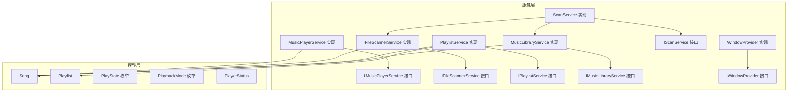
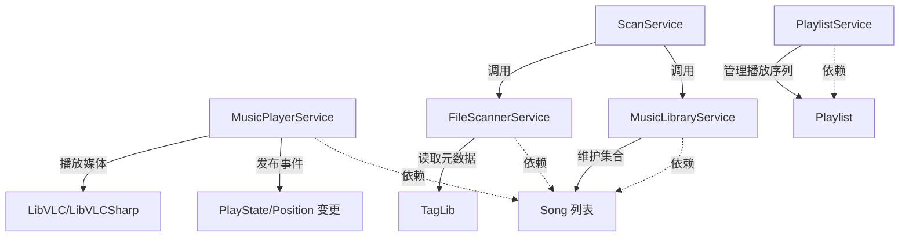
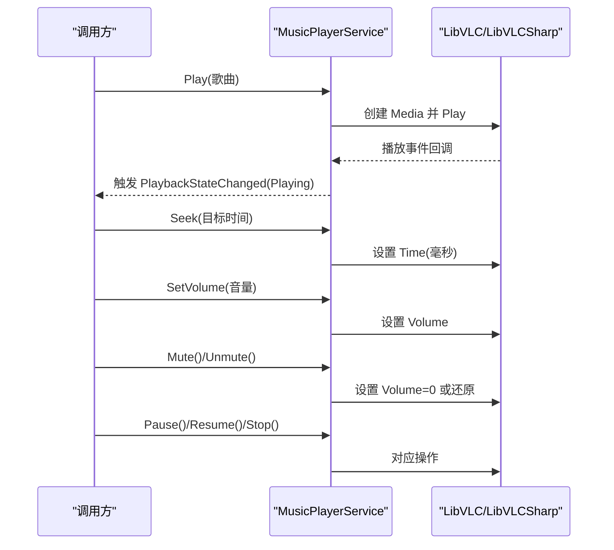
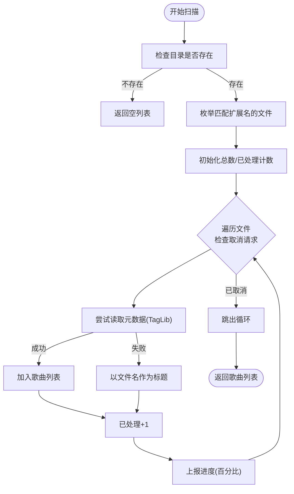
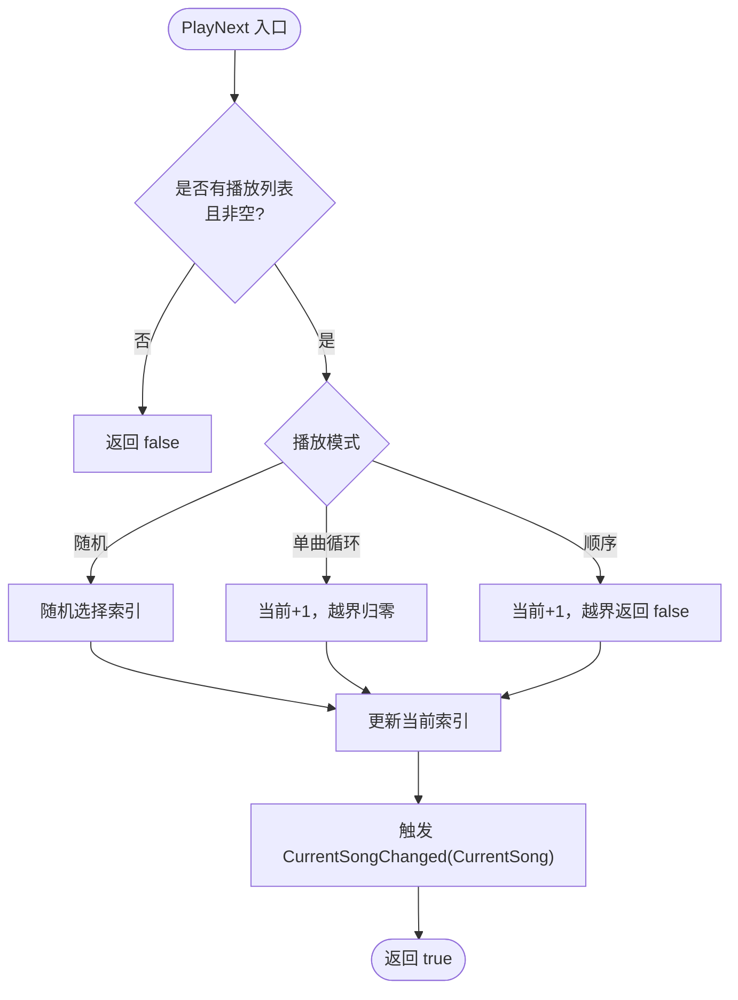
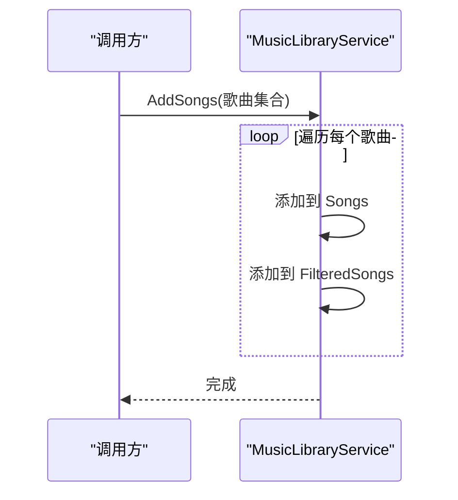
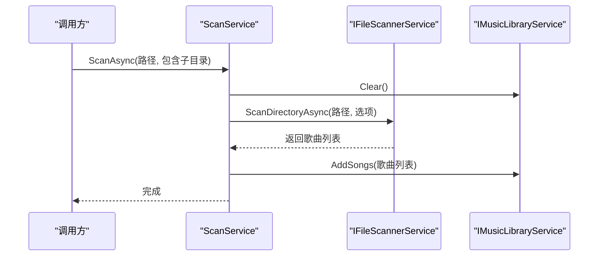
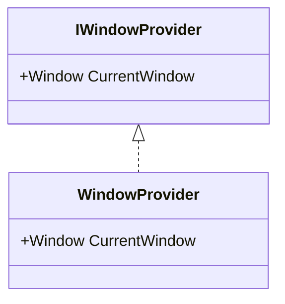
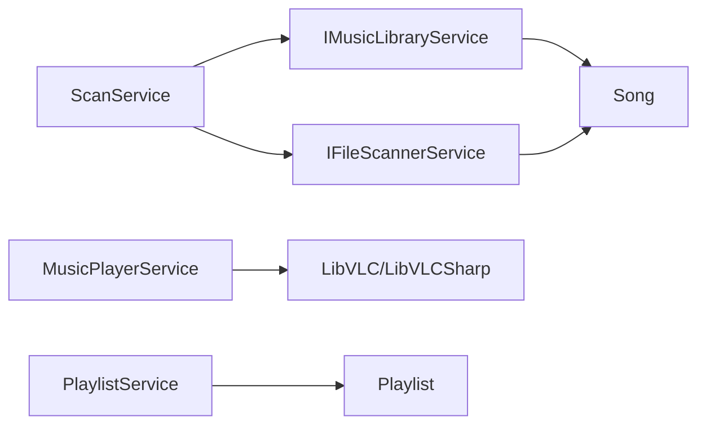
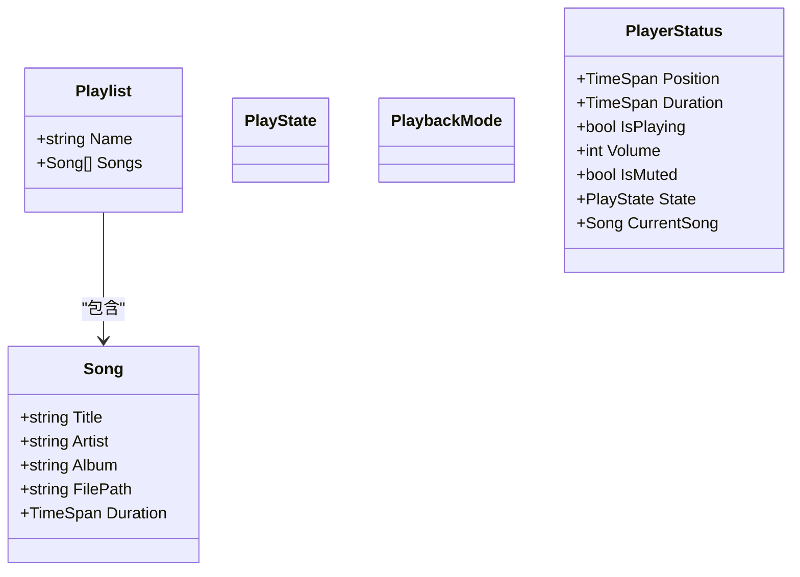

# 核心服务层

<cite>
**本文引用的文件**
- [Services/IMusicPlayerService.cs](file://Services/IMusicPlayerService.cs)
- [Services/MusicPlayerService.cs](file://Services/MusicPlayerService.cs)
- [Services/IFileScannerService.cs](file://Services/IFileScannerService.cs)
- [Services/FileScannerService.cs](file://Services/FileScannerService.cs)
- [Services/IPlaylistService.cs](file://Services/IPlaylistService.cs)
- [Services/PlaylistService.cs](file://Services/PlaylistService.cs)
- [Services/IMusicLibraryService.cs](file://Services/IMusicLibraryService.cs)
- [Services/MusicLibraryService.cs](file://Services/MusicLibraryService.cs)
- [Services/IScanService.cs](file://Services/IScanService.cs)
- [Services/ScanService.cs](file://Services/ScanService.cs)
- [Services/IWindowProvider.cs](file://Services/IWindowProvider.cs)
- [Services/WindowProvider.cs](file://Services/WindowProvider.cs)
- [Models/Song.cs](file://Models/Song.cs)
- [Models/Playlist.cs](file://Models/Playlist.cs)
- [Models/PlayState.cs](file://Models/PlayState.cs)
- [Models/PlaybackMode.cs](file://Models/PlaybackMode.cs)
- [Models/PlayerStatus.cs](file://Models/PlayerStatus.cs)
</cite>

## 目录
1. [简介](#简介)
2. [项目结构](#项目结构)
3. [核心组件](#核心组件)
4. [架构总览](#架构总览)
5. [详细组件分析](#详细组件分析)
6. [依赖分析](#依赖分析)
7. [性能考量](#性能考量)
8. [故障排查指南](#故障排查指南)
9. [结论](#结论)
10. [附录](#附录)

## 简介
本文件聚焦于 LocalMusicPlayer 的核心服务层，系统化梳理服务接口与实现类的功能、职责与交互关系。重点覆盖以下方面：
- 音频播放服务（MusicPlayerService）：基于 LibVLCSharp 的播放控制、状态事件与资源管理
- 文件扫描服务（FileScannerService）：异步扫描与元数据提取（TagLib）
- 播放列表服务（PlaylistService）：播放列表管理与播放模式控制
- 音乐库服务（MusicLibraryService）：歌曲集合的组织与过滤视图
- 扫描服务（ScanService）：协调扫描与入库流程
- 服务间依赖关系与调用流程
- 错误处理策略、性能优化建议与扩展性考虑

## 项目结构
服务层位于 Services 命名空间，围绕播放、扫描、库与播放列表等职责进行模块化拆分；模型层位于 Models 命名空间，定义 Song、Playlist、PlayState、PlaybackMode、PlayerStatus 等核心数据结构。

图表来源
- [Services/MusicPlayerService.cs:1-129](file://Services/MusicPlayerService.cs#L1-L129)
- [Services/FileScannerService.cs:1-103](file://Services/FileScannerService.cs#L1-L103)
- [Services/PlaylistService.cs:1-120](file://Services/PlaylistService.cs#L1-L120)
- [Services/MusicLibraryService.cs:1-27](file://Services/MusicLibraryService.cs#L1-L27)
- [Services/ScanService.cs:1-24](file://Services/ScanService.cs#L1-L24)
- [Services/WindowProvider.cs:1-9](file://Services/WindowProvider.cs#L1-L9)
- [Models/Song.cs:1-13](file://Models/Song.cs#L1-L13)
- [Models/Playlist.cs:1-10](file://Models/Playlist.cs#L1-L10)
- [Models/PlayState.cs:1-9](file://Models/PlayState.cs#L1-L9)
- [Models/PlaybackMode.cs:1-9](file://Models/PlaybackMode.cs#L1-L9)
- [Models/PlayerStatus.cs:1-15](file://Models/PlayerStatus.cs#L1-L15)

章节来源
- [Services/MusicPlayerService.cs:1-129](file://Services/MusicPlayerService.cs#L1-L129)
- [Services/FileScannerService.cs:1-103](file://Services/FileScannerService.cs#L1-L103)
- [Services/PlaylistService.cs:1-120](file://Services/PlaylistService.cs#L1-L120)
- [Services/MusicLibraryService.cs:1-27](file://Services/MusicLibraryService.cs#L1-L27)
- [Services/ScanService.cs:1-24](file://Services/ScanService.cs#L1-L24)
- [Services/WindowProvider.cs:1-9](file://Services/WindowProvider.cs#L1-L9)
- [Models/Song.cs:1-13](file://Models/Song.cs#L1-L13)
- [Models/Playlist.cs:1-10](file://Models/Playlist.cs#L1-L10)
- [Models/PlayState.cs:1-9](file://Models/PlayState.cs#L1-L9)
- [Models/PlaybackMode.cs:1-9](file://Models/PlaybackMode.cs#L1-L9)
- [Models/PlayerStatus.cs:1-15](file://Models/PlayerStatus.cs#L1-L15)

## 核心组件
- 音频播放服务（IMusicPlayerService/MusicPlayerService）
  - 职责：提供播放、暂停、恢复、停止、跳转、音量与静音控制；暴露播放位置、时长、状态与事件
  - 关键点：使用 LibVLCSharp 初始化播放器，订阅媒体事件并转发为应用级事件；支持 Seek、SetVolume、Mute
- 文件扫描服务（IFileScannerService/FileScannerService）
  - 职责：异步扫描目录，筛选受支持扩展名，提取元数据（标题、艺术家、专辑、时长），支持进度与取消
  - 关键点：使用 TagLib 读取音频属性；异常时回退到文件名作为标题
- 播放列表服务（IPlaylistService/PlaylistService）
  - 职责：创建/设置当前播放列表，增删歌曲，推进/回退播放索引，维护播放模式（顺序/随机/单曲循环）
  - 关键点：根据 PlaybackMode 计算下一曲或上一曲索引；触发 CurrentSongChanged 与 PlaybackModeChanged
- 音乐库服务（IMusicLibraryService/MusicLibraryService）
  - 职责：维护歌曲集合与过滤视图，提供清空与批量添加能力
  - 关键点：Songs 与 FilteredSongs 均为 ObservableCollection，便于 UI 绑定
- 扫描服务（IScanService/ScanService）
  - 职责：协调扫描与入库，清空旧库后写入新扫描结果
  - 关键点：依赖 IFileScannerService 与 IMusicLibraryService

章节来源
- [Services/IMusicPlayerService.cs:1-27](file://Services/IMusicPlayerService.cs#L1-L27)
- [Services/MusicPlayerService.cs:1-129](file://Services/MusicPlayerService.cs#L1-L129)
- [Services/IFileScannerService.cs:1-17](file://Services/IFileScannerService.cs#L1-L17)
- [Services/FileScannerService.cs:1-103](file://Services/FileScannerService.cs#L1-L103)
- [Services/IPlaylistService.cs:1-22](file://Services/IPlaylistService.cs#L1-L22)
- [Services/PlaylistService.cs:1-120](file://Services/PlaylistService.cs#L1-L120)
- [Services/IMusicLibraryService.cs:1-14](file://Services/IMusicLibraryService.cs#L1-L14)
- [Services/MusicLibraryService.cs:1-27](file://Services/MusicLibraryService.cs#L1-L27)
- [Services/IScanService.cs:1-9](file://Services/IScanService.cs#L1-L9)
- [Services/ScanService.cs:1-24](file://Services/ScanService.cs#L1-L24)

## 架构总览
下图展示服务层与模型层之间的关系以及关键调用方向：

图表来源
- [Services/MusicPlayerService.cs:1-129](file://Services/MusicPlayerService.cs#L1-L129)
- [Services/FileScannerService.cs:1-103](file://Services/FileScannerService.cs#L1-L103)
- [Services/PlaylistService.cs:1-120](file://Services/PlaylistService.cs#L1-L120)
- [Services/MusicLibraryService.cs:1-27](file://Services/MusicLibraryService.cs#L1-L27)
- [Services/ScanService.cs:1-24](file://Services/ScanService.cs#L1-L24)
- [Models/Song.cs:1-13](file://Models/Song.cs#L1-L13)
- [Models/Playlist.cs:1-10](file://Models/Playlist.cs#L1-L10)

## 详细组件分析

### 音频播放服务（MusicPlayerService）
- 设计要点
  - 使用 LibVLCSharp 初始化播放器实例，订阅 EndReached、TimeChanged、Playing/Paused/Stopped 等事件，转换为应用级事件
  - 提供 Play/Pause/Resume/Stop 控制；Seek 支持毫秒级定位；SetVolume 与 Mute 支持音量与静音切换
  - 暴露 Position、Duration、IsPlaying、Volume、IsMuted 等只读属性
  - 实现 IDisposable，确保释放 LibVLC 与 MediaPlayer 资源
- 关键流程（播放控制）

图表来源
- [Services/MusicPlayerService.cs:1-129](file://Services/MusicPlayerService.cs#L1-L129)

章节来源
- [Services/MusicPlayerService.cs:1-129](file://Services/MusicPlayerService.cs#L1-L129)
- [Services/IMusicPlayerService.cs:1-27](file://Services/IMusicPlayerService.cs#L1-L27)
- [Models/PlayState.cs:1-9](file://Models/PlayState.cs#L1-L9)
- [Models/PlayerStatus.cs:1-15](file://Models/PlayerStatus.cs#L1-L15)

### 文件扫描服务（FileScannerService）
- 设计要点
  - 支持多级目录扫描，按扩展名白名单过滤；提供重载方法支持进度上报与取消令牌
  - 使用 TagLib 读取音频元数据；异常时回退为文件名作为标题
  - 进度按已处理数量占总数的比例上报（百分比）
- 关键流程（异步扫描与元数据提取）

图表来源
- [Services/FileScannerService.cs:1-103](file://Services/FileScannerService.cs#L1-L103)

章节来源
- [Services/FileScannerService.cs:1-103](file://Services/FileScannerService.cs#L1-L103)
- [Services/IFileScannerService.cs:1-17](file://Services/IFileScannerService.cs#L1-L17)
- [Models/Song.cs:1-13](file://Models/Song.cs#L1-L13)

### 播放列表服务（PlaylistService）
- 设计要点
  - 维护当前播放列表、当前索引与播放模式；支持顺序、随机、单曲循环
  - PlayNext/PlayPrevious 根据模式计算索引；越界时按模式处理（循环或结束）
  - 暴露 CurrentSongChanged 与 PlaybackModeChanged 事件
- 关键流程（下一曲逻辑）

图表来源
- [Services/PlaylistService.cs:1-120](file://Services/PlaylistService.cs#L1-L120)
- [Models/PlaybackMode.cs:1-9](file://Models/PlaybackMode.cs#L1-L9)

章节来源
- [Services/PlaylistService.cs:1-120](file://Services/PlaylistService.cs#L1-L120)
- [Services/IPlaylistService.cs:1-22](file://Services/IPlaylistService.cs#L1-L22)
- [Models/Playlist.cs:1-10](file://Models/Playlist.cs#L1-L10)

### 音乐库服务（MusicLibraryService）
- 设计要点
  - 提供 Songs 与 FilteredSongs 两个 ObservableCollection，便于 UI 层直接绑定
  - Clear 清空两集合；AddSongs 批量添加并同步到过滤视图
- 关键流程（批量添加）

图表来源
- [Services/MusicLibraryService.cs:1-27](file://Services/MusicLibraryService.cs#L1-L27)

章节来源
- [Services/MusicLibraryService.cs:1-27](file://Services/MusicLibraryService.cs#L1-L27)
- [Services/IMusicLibraryService.cs:1-14](file://Services/IMusicLibraryService.cs#L1-L14)

### 扫描服务（ScanService）
- 设计要点
  - 协调扫描与入库：先清空旧库，再异步扫描并写入新结果
  - 依赖注入 IFileScannerService 与 IMusicLibraryService
- 关键流程（扫描与入库）

图表来源
- [Services/ScanService.cs:1-24](file://Services/ScanService.cs#L1-L24)
- [Services/IScanService.cs:1-9](file://Services/IScanService.cs#L1-L9)

章节来源
- [Services/ScanService.cs:1-24](file://Services/ScanService.cs#L1-L24)
- [Services/IScanService.cs:1-9](file://Services/IScanService.cs#L1-L9)

### 窗口提供者（WindowProvider）
- 设计要点
  - 提供 CurrentWindow 属性，用于需要访问主窗口上下文的场景
- 关键流程（属性访问）

图表来源
- [Services/IWindowProvider.cs:1-9](file://Services/IWindowProvider.cs#L1-L9)
- [Services/WindowProvider.cs:1-9](file://Services/WindowProvider.cs#L1-L9)

章节来源
- [Services/WindowProvider.cs:1-9](file://Services/WindowProvider.cs#L1-L9)
- [Services/IWindowProvider.cs:1-9](file://Services/IWindowProvider.cs#L1-L9)

## 依赖分析
- 低耦合高内聚
  - 各服务通过接口解耦，便于替换与测试（如替换扫描实现、播放器实现）
- 关键依赖链
  - ScanService 依赖 IFileScannerService 与 IMusicLibraryService
  - MusicPlayerService 依赖 LibVLCSharp（外部库）
  - PlaylistService 依赖 Playlist 与 Song（模型）
  - MusicLibraryService 依赖 Song（模型）
- 可能的循环依赖
  - 当前未发现直接循环依赖；若后续在服务中引入反向回调需谨慎设计

图表来源
- [Services/ScanService.cs:1-24](file://Services/ScanService.cs#L1-L24)
- [Services/MusicPlayerService.cs:1-129](file://Services/MusicPlayerService.cs#L1-L129)
- [Services/PlaylistService.cs:1-120](file://Services/PlaylistService.cs#L1-L120)
- [Services/MusicLibraryService.cs:1-27](file://Services/MusicLibraryService.cs#L1-L27)
- [Services/FileScannerService.cs:1-103](file://Services/FileScannerService.cs#L1-L103)
- [Models/Playlist.cs:1-10](file://Models/Playlist.cs#L1-L10)
- [Models/Song.cs:1-13](file://Models/Song.cs#L1-L13)

章节来源
- [Services/ScanService.cs:1-24](file://Services/ScanService.cs#L1-L24)
- [Services/MusicPlayerService.cs:1-129](file://Services/MusicPlayerService.cs#L1-L129)
- [Services/PlaylistService.cs:1-120](file://Services/PlaylistService.cs#L1-L120)
- [Services/MusicLibraryService.cs:1-27](file://Services/MusicLibraryService.cs#L1-L27)
- [Services/FileScannerService.cs:1-103](file://Services/FileScannerService.cs#L1-L103)
- [Models/Playlist.cs:1-10](file://Models/Playlist.cs#L1-L10)
- [Models/Song.cs:1-13](file://Models/Song.cs#L1-L13)

## 性能考量
- 扫描阶段
  - 异步执行与进度上报：避免 UI 阻塞，提升用户体验
  - 取消令牌：支持用户中断长时间扫描
  - 元数据读取：TagLib 在大文件上可能较慢，可考虑缓存或延迟加载
- 播放阶段
  - LibVLC 初始化成本：仅在首次使用时初始化，避免重复创建
  - 事件频率：PositionChanged 回调频繁，UI 绑定时注意节流
  - 音量与静音：避免频繁设置底层音量，减少不必要的调用
- 内存与集合
  - ObservableCollection 适合 UI 绑定，但大量变更会带来开销；批量 Add 可合并为一次操作
- I/O 与并发
  - 扫描与播放互不阻塞；但同时进行大量磁盘访问时需关注系统资源占用

## 故障排查指南
- 播放无法启动
  - 检查 LibVLC 初始化是否成功，确认媒体路径有效
  - 查看 EndReached 事件是否被触发过早（媒体文件损坏或格式不受支持）
- 元数据缺失
  - TagLib 读取失败时会回退到文件名；确认文件是否损坏或缺少标签
  - 检查扩展名白名单是否包含目标文件类型
- 扫描卡住或无响应
  - 确认取消令牌是否正确传递；检查进度上报是否被 UI 忽略
  - 大目录扫描耗时较长，建议限制扫描层级或启用取消
- 播放列表越界
  - PlayNext/PlayPrevious 在空列表或索引非法时返回 false；检查当前索引与播放模式
- 资源释放
  - MusicPlayerService 实现了 IDisposable；确保在退出时调用 Dispose 释放底层资源

章节来源
- [Services/MusicPlayerService.cs:1-129](file://Services/MusicPlayerService.cs#L1-L129)
- [Services/FileScannerService.cs:1-103](file://Services/FileScannerService.cs#L1-L103)
- [Services/PlaylistService.cs:1-120](file://Services/PlaylistService.cs#L1-L120)
- [Services/ScanService.cs:1-24](file://Services/ScanService.cs#L1-L24)

## 结论
核心服务层通过清晰的接口与职责划分，实现了从扫描、入库到播放与列表管理的完整闭环。LibVLCSharp 提供稳定的播放能力，FileScannerService 与 TagLib 协作完成元数据提取，PlaylistService 与 MusicLibraryService 分别承担播放序列与数据组织职责。整体设计具备良好的扩展性与可测试性，后续可在播放器实现替换、扫描算法优化与 UI 绑定增强等方面继续演进。

## 附录
- 数据模型概览

图表来源
- [Models/Song.cs:1-13](file://Models/Song.cs#L1-L13)
- [Models/Playlist.cs:1-10](file://Models/Playlist.cs#L1-L10)
- [Models/PlayState.cs:1-9](file://Models/PlayState.cs#L1-L9)
- [Models/PlaybackMode.cs:1-9](file://Models/PlaybackMode.cs#L1-L9)
- [Models/PlayerStatus.cs:1-15](file://Models/PlayerStatus.cs#L1-L15)