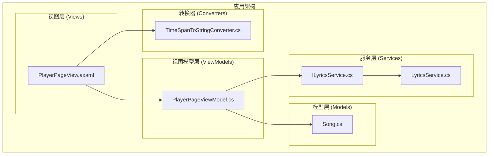
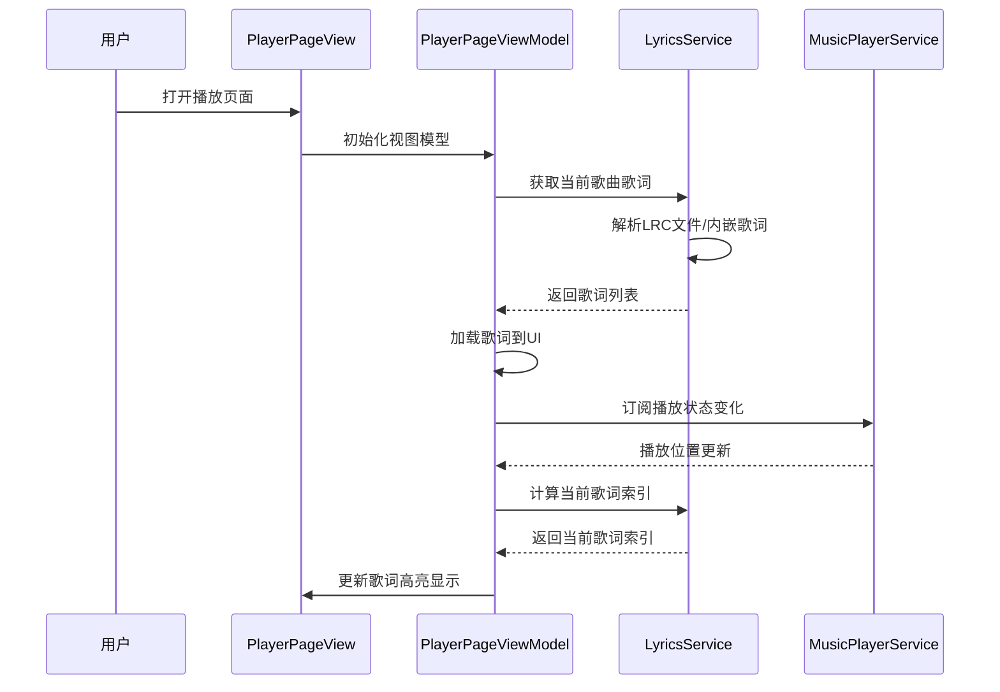
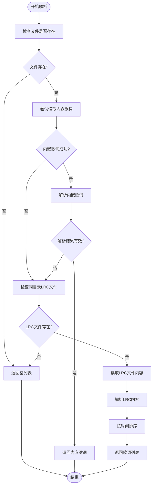
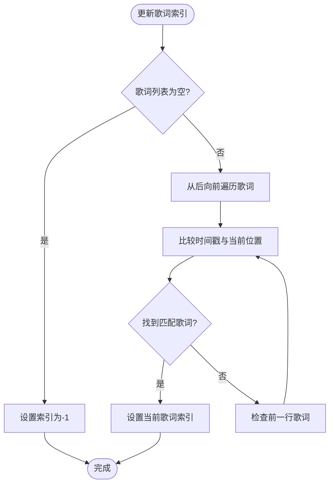
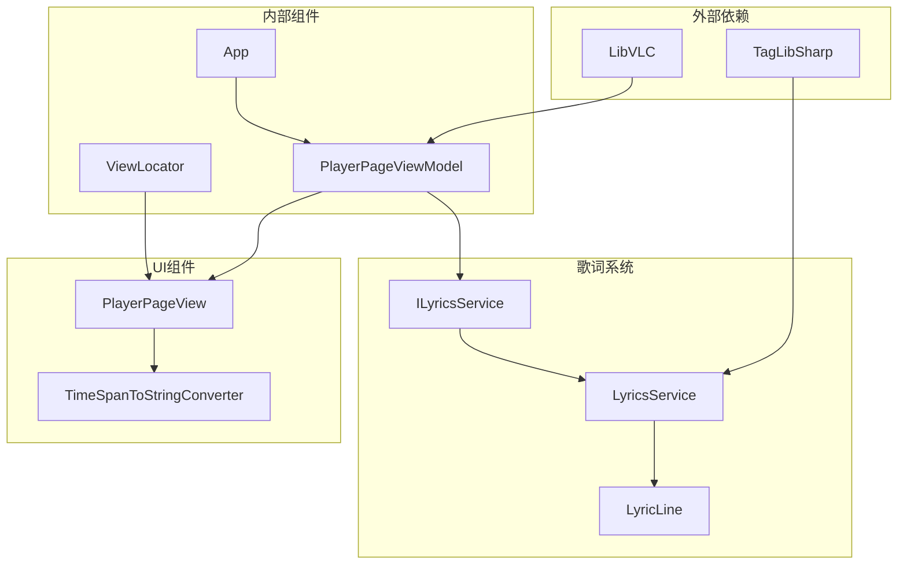

# 歌词显示系统

<cite>
**本文档引用的文件**
- [README.md](file://README.md)
- [LyricsService.cs](file://Services/LyricsService.cs)
- [ILyricsService.cs](file://Services/ILyricsService.cs)
- [PlayerPageViewModel.cs](file://ViewModels/PlayerPageViewModel.cs)
- [PlayerPageView.axaml](file://Views/PlayerPageView.axaml)
- [PlayerPageView.axaml.cs](file://Views/PlayerPageView.axaml.cs)
- [Song.cs](file://Models/Song.cs)
- [TimeSpanToStringConverter.cs](file://Converters/TimeSpanToStringConverter.cs)
- [App.axaml.cs](file://App.axaml.cs)
- [LocalMusicPlayer.csproj](file://LocalMusicPlayer.csproj)
</cite>

## 目录
1. [简介](#简介)
2. [项目结构](#项目结构)
3. [核心组件](#核心组件)
4. [架构概览](#架构概览)
5. [详细组件分析](#详细组件分析)
6. [依赖关系分析](#依赖关系分析)
7. [性能考虑](#性能考虑)
8. [故障排除指南](#故障排除指南)
9. [结论](#结论)

## 简介

歌词显示系统是 LocalMusicPlayer 音乐播放器中的一个关键功能模块，它允许用户在播放音乐时实时查看同步的歌词内容。该系统支持多种歌词来源，包括音频文件内嵌歌词和外部 LRC 格式文件，并提供了流畅的用户体验。

## 项目结构

LocalMusicPlayer 采用标准的 MVVM（Model-View-ViewModel）架构模式，歌词显示系统作为独立的服务层集成到整个应用程序中：

**图表来源**
- [PlayerPageView.axaml:1-454](file://Views/PlayerPageView.axaml#L1-L454)
- [PlayerPageViewModel.cs:1-306](file://ViewModels/PlayerPageViewModel.cs#L1-L306)
- [ILyricsService.cs:1-30](file://Services/ILyricsService.cs#L1-L30)
- [LyricsService.cs:1-101](file://Services/LyricsService.cs#L1-L101)

**章节来源**
- [README.md:56-67](file://README.md#L56-L67)
- [LocalMusicPlayer.csproj:1-45](file://LocalMusicPlayer.csproj#L1-L45)

## 核心组件

歌词显示系统由以下核心组件构成：

### 1. 歌词服务接口 (ILyricsService)
定义了歌词处理的标准接口，包括歌词获取和当前歌词索引计算功能。

### 2. 歌词服务实现 (LyricsService)
实现了歌词解析和管理功能，支持多种歌词格式和来源。

### 3. 歌词行模型 (LyricLine)
表示单个歌词行的数据结构，包含时间戳和歌词文本。

### 4. 播放器页面视图模型 (PlayerPageViewModel)
负责协调歌词显示与音乐播放的同步。

### 5. 歌词显示视图 (PlayerPageView)
提供歌词内容的可视化展示界面。

**章节来源**
- [ILyricsService.cs:7-29](file://Services/ILyricsService.cs#L7-L29)
- [LyricsService.cs:9-101](file://Services/LyricsService.cs#L9-L101)
- [PlayerPageViewModel.cs:13-306](file://ViewModels/PlayerPageViewModel.cs#L13-L306)

## 架构概览

歌词显示系统采用分层架构设计，确保了良好的关注点分离和可维护性：

**图表来源**
- [PlayerPageViewModel.cs:251-304](file://ViewModels/PlayerPageViewModel.cs#L251-L304)
- [LyricsService.cs:13-50](file://Services/LyricsService.cs#L13-L50)

## 详细组件分析

### 歌词服务 (LyricsService)

歌词服务是系统的核心组件，负责处理各种歌词格式和来源：

#### 主要功能
- **内嵌歌词读取**: 通过 TagLib 库从音频文件中提取内嵌歌词
- **LRC文件解析**: 支持标准 LRC 格式的歌词文件
- **时间戳解析**: 使用正则表达式解析时间戳格式 `[mm:ss.xx]`
- **歌词排序**: 自动按时间顺序排列歌词行

#### 歌词解析算法

**图表来源**
- [LyricsService.cs:13-50](file://Services/LyricsService.cs#L13-L50)
- [LyricsService.cs:66-99](file://Services/LyricsService.cs#L66-L99)

#### 时间戳解析机制

歌词服务使用正则表达式精确解析 LRC 格式的时间戳：
- 支持 `mm:ss` 和 `mm:ss.xx` 两种时间格式
- 将毫秒值标准化为 3 位格式
- 自动过滤空歌词内容

**章节来源**
- [LyricsService.cs:11-11](file://Services/LyricsService.cs#L11-L11)
- [LyricsService.cs:66-99](file://Services/LyricsService.cs#L66-L99)

### 播放器页面视图模型 (PlayerPageViewModel)

视图模型负责协调歌词显示与音乐播放的同步：

#### 关键职责
- **歌词加载**: 当歌曲切换时自动加载新歌词
- **播放位置同步**: 定期更新播放位置并计算当前歌词
- **UI状态管理**: 管理歌词高亮显示状态
- **事件订阅**: 订阅播放器状态变化事件

#### 歌词索引计算

**图表来源**
- [PlayerPageViewModel.cs:298-304](file://ViewModels/PlayerPageViewModel.cs#L298-L304)

**章节来源**
- [PlayerPageViewModel.cs:283-304](file://ViewModels/PlayerPageViewModel.cs#L283-L304)

### 歌词显示视图 (PlayerPageView)

歌词显示视图提供了直观的歌词浏览界面：

#### 视觉设计特点
- **滚动区域**: 使用 ScrollViewer 实现歌词内容的垂直滚动
- **居中对齐**: 歌词文本采用居中对齐，提升视觉效果
- **颜色层次**: 使用渐变背景和不同灰度的文本颜色
- **响应式布局**: 支持不同屏幕尺寸的自适应显示

#### 数据绑定机制
- **ItemsControl**: 绑定到 Lyrics 集合并动态渲染歌词行
- **DataTemplate**: 为每个歌词行定义统一的显示模板
- **文本包装**: 支持长歌词的自动换行显示

**章节来源**
- [PlayerPageView.axaml:227-250](file://Views/PlayerPageView.axaml#L227-L250)
- [PlayerPageView.axaml:235-248](file://Views/PlayerPageView.axaml#L235-L248)

### 歌词行模型 (LyricLine)

歌词行模型是歌词数据的最小单位，包含必要的元数据：

#### 属性结构
- **Timestamp**: 歌词开始播放的时间点
- **Text**: 实际的歌词文本内容

#### 设计考虑
- 简化的数据结构便于序列化和传输
- 明确的时间戳字段支持精确的歌词同步
- 不包含样式信息，保持数据与表现的分离

**章节来源**
- [ILyricsService.cs:25-29](file://Services/ILyricsService.cs#L25-L29)

## 依赖关系分析

歌词显示系统与其他组件的依赖关系如下：

**图表来源**
- [App.axaml.cs:41-54](file://App.axaml.cs#L41-L54)
- [LocalMusicPlayer.csproj:38-42](file://LocalMusicPlayer.csproj#L38-L42)

### 依赖注入配置

系统通过依赖注入容器管理组件生命周期：

| 服务类型 | 实现类 | 生命周期 | 用途 |
|---------|--------|----------|------|
| ILyricsService | LyricsService | 单例 | 歌词解析和管理 |
| IMusicPlayerService | MusicPlayerService | 单例 | 音频播放控制 |
| IPlaylistService | PlaylistService | 单例 | 播放列表管理 |
| IMusicLibraryService | MusicLibraryService | 单例 | 音乐库管理 |

**章节来源**
- [App.axaml.cs:41-54](file://App.axaml.cs#L41-L54)
- [LocalMusicPlayer.csproj:38-42](file://LocalMusicPlayer.csproj#L38-L42)

## 性能考虑

### 1. 歌词解析优化
- 使用编译后的正则表达式提高解析性能
- 缓存解析结果避免重复计算
- 异常处理确保解析失败不影响主流程

### 2. UI渲染优化
- 使用 ObservableCollection 实现高效的列表更新
- 滚动视图仅渲染可见内容
- 防抖机制减少频繁的 UI 更新

### 3. 内存管理
- 及时释放文件句柄和资源
- 避免内存泄漏的循环引用
- 合理的垃圾回收策略

## 故障排除指南

### 常见问题及解决方案

#### 1. 歌词无法显示
**可能原因**:
- 音频文件不包含内嵌歌词
- LRC 文件不存在或格式不正确
- 文件权限问题

**解决步骤**:
1. 检查音频文件是否包含内嵌歌词
2. 验证 LRC 文件路径和格式
3. 确认文件访问权限

#### 2. 歌词不同步
**可能原因**:
- 时间戳格式不正确
- 播放器延迟导致的时间偏差

**解决步骤**:
1. 验证 LRC 文件中的时间戳格式
2. 检查播放器的播放状态
3. 调整播放器的同步设置

#### 3. 性能问题
**可能原因**:
- 歌词文件过大
- UI 更新过于频繁

**解决步骤**:
1. 优化歌词文件大小
2. 调整 UI 更新频率
3. 检查系统资源使用情况

**章节来源**
- [LyricsService.cs:20-47](file://Services/LyricsService.cs#L20-L47)
- [PlayerPageViewModel.cs:251-278](file://ViewModels/PlayerPageViewModel.cs#L251-L278)

## 结论

歌词显示系统通过精心设计的架构和实现，为用户提供了流畅、准确的歌词同步体验。系统的主要优势包括：

### 技术优势
- **多源支持**: 同时支持内嵌歌词和外部 LRC 文件
- **精确解析**: 使用正则表达式确保时间戳解析的准确性
- **响应式设计**: 与播放器状态紧密同步
- **可扩展性**: 清晰的接口设计便于功能扩展

### 用户体验
- **直观界面**: 简洁美观的歌词显示界面
- **流畅交互**: 无卡顿的歌词滚动和高亮显示
- **稳定可靠**: 完善的错误处理和异常恢复机制

该系统展现了现代桌面应用程序的最佳实践，为后续的功能扩展和性能优化奠定了坚实的基础。