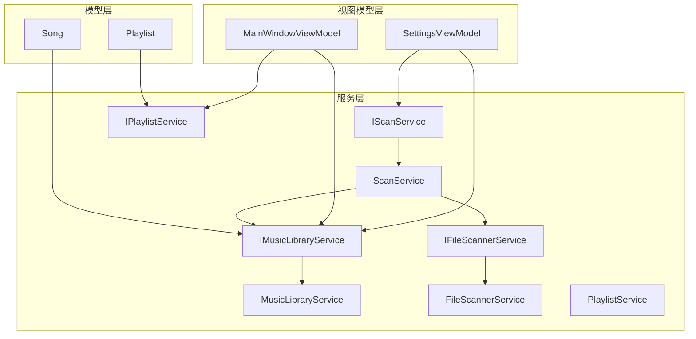
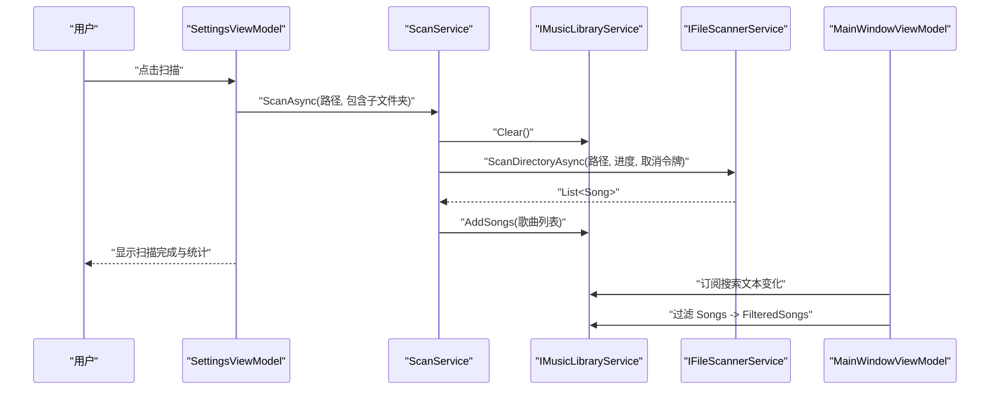
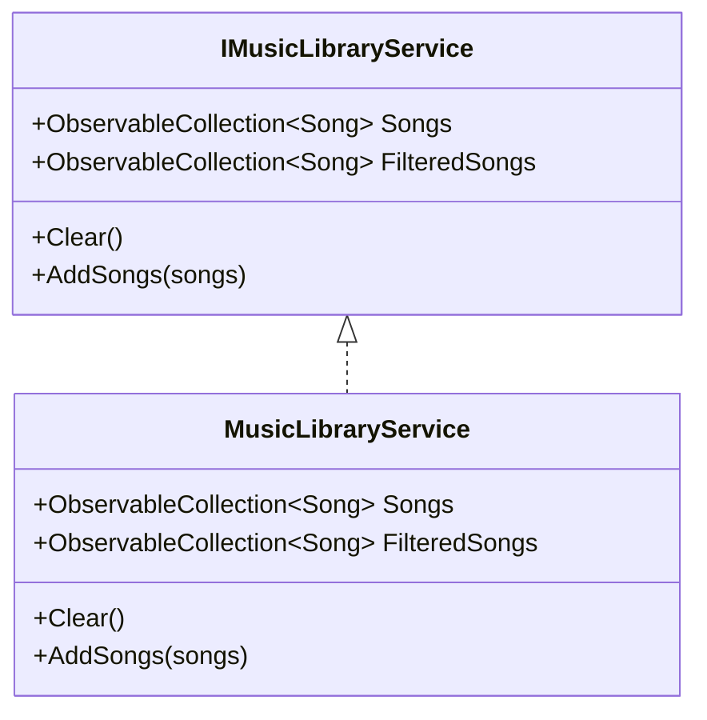
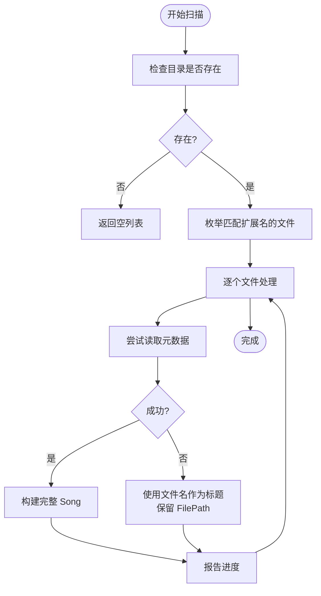
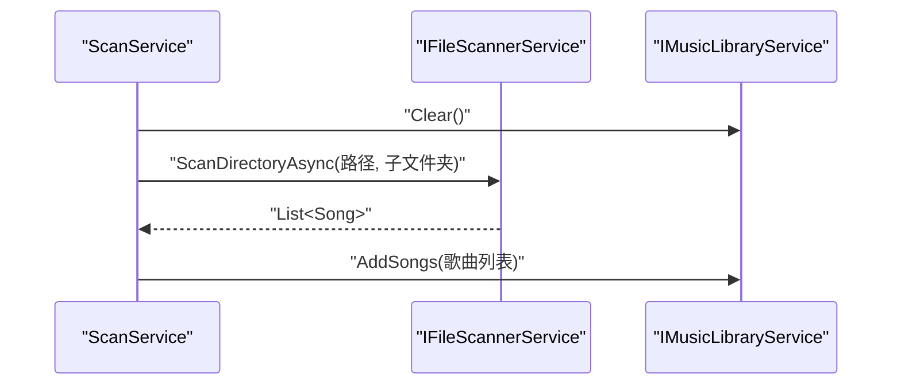
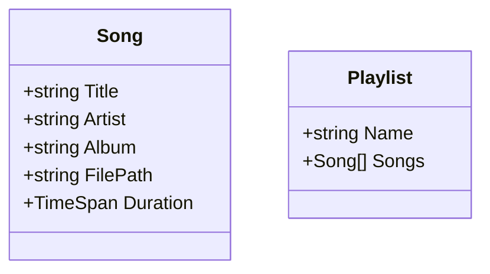
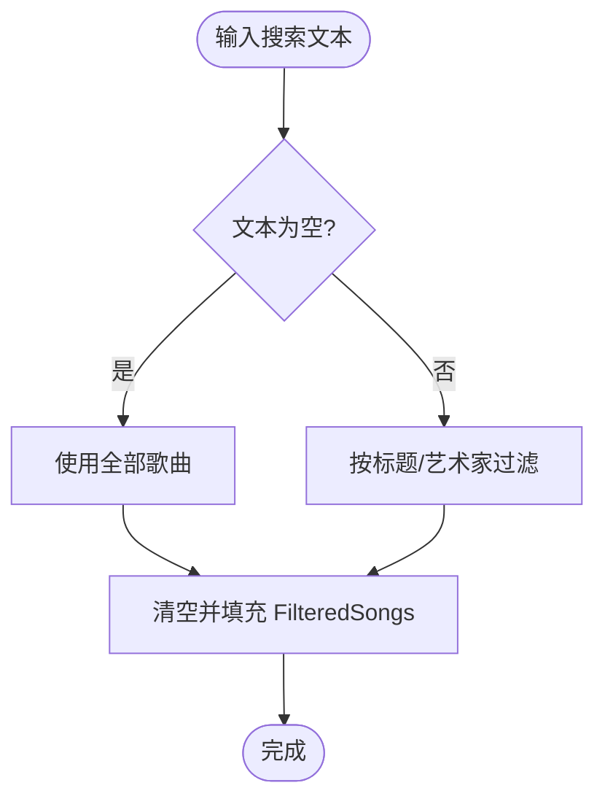
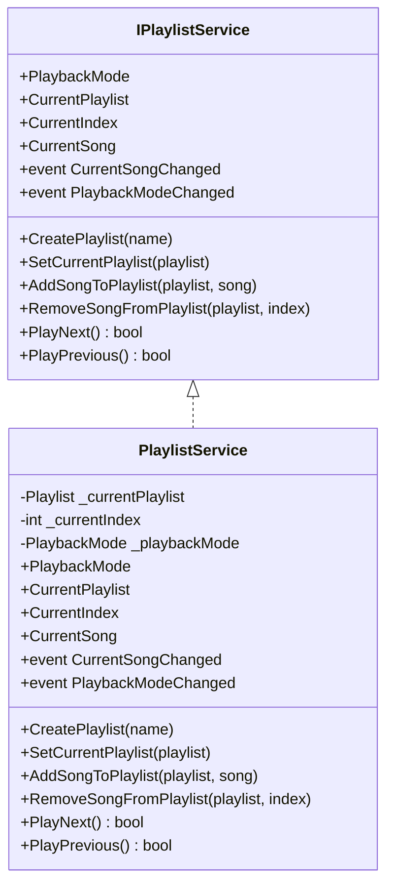
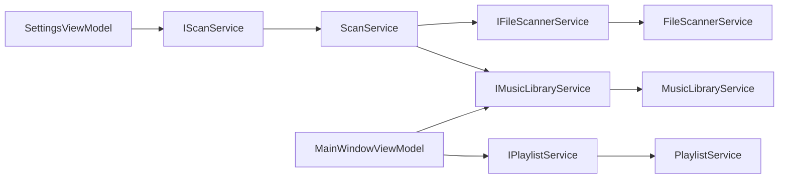

# 音乐库服务

<cite>
**本文引用的文件**
- [IMusicLibraryService.cs](file://Services/IMusicLibraryService.cs)
- [MusicLibraryService.cs](file://Services/MusicLibraryService.cs)
- [IFileScannerService.cs](file://Services/IFileScannerService.cs)
- [FileScannerService.cs](file://Services/FileScannerService.cs)
- [IScanService.cs](file://Services/IScanService.cs)
- [ScanService.cs](file://Services/ScanService.cs)
- [Song.cs](file://Models/Song.cs)
- [Playlist.cs](file://Models/Playlist.cs)
- [IPlaylistService.cs](file://Services/IPlaylistService.cs)
- [PlaylistService.cs](file://Services/PlaylistService.cs)
- [MainWindowViewModel.cs](file://ViewModels/MainWindowViewModel.cs)
- [SettingsViewModel.cs](file://ViewModels/SettingsViewModel.cs)
</cite>

## 目录
1. [简介](#简介)
2. [项目结构](#项目结构)
3. [核心组件](#核心组件)
4. [架构总览](#架构总览)
5. [详细组件分析](#详细组件分析)
6. [依赖分析](#依赖分析)
7. [性能考虑](#性能考虑)
8. [故障排除指南](#故障排除指南)
9. [结论](#结论)
10. [附录](#附录)

## 简介
本文件系统性地解析本地音乐播放器中的“音乐库服务”子系统，重点围绕 IMusicLibraryService 接口与其具体实现 MusicLibraryService 的设计与数据管理能力展开；同时梳理与文件扫描服务（IFileScannerService/FileScannerService）及扫描协调服务（IScanService/ScanService）之间的协作关系，说明音乐库的初始化、更新与清理流程；并从数据模型（Song/Playlist）出发，解释歌曲数据的存储结构、索引与查询优化思路，以及搜索与过滤功能的实现方式。最后给出实际使用示例与批量处理建议，并讨论状态管理、缓存策略与内存优化、完整性检查与损坏文件处理等主题。

## 项目结构
本项目采用分层与职责分离的组织方式：
- 模型层：定义 Song、Playlist 等领域对象
- 服务层：封装业务逻辑，如音乐库管理、文件扫描、播放列表管理、扫描协调
- 视图模型层：承载 UI 行为与状态，负责搜索过滤、命令绑定与界面交互
- 资源与样式：UI 基础资源

图表来源
- [IMusicLibraryService.cs:1-14](file://Services/IMusicLibraryService.cs#L1-L14)
- [MusicLibraryService.cs:1-27](file://Services/MusicLibraryService.cs#L1-L27)
- [IFileScannerService.cs:1-17](file://Services/IFileScannerService.cs#L1-L17)
- [FileScannerService.cs:1-103](file://Services/FileScannerService.cs#L1-L103)
- [IScanService.cs:1-9](file://Services/IScanService.cs#L1-L9)
- [ScanService.cs:1-24](file://Services/ScanService.cs#L1-L24)
- [Song.cs:1-13](file://Models/Song.cs#L1-L13)
- [Playlist.cs:1-10](file://Models/Playlist.cs#L1-L10)
- [MainWindowViewModel.cs:1-231](file://ViewModels/MainWindowViewModel.cs#L1-L231)
- [SettingsViewModel.cs:1-148](file://ViewModels/SettingsViewModel.cs#L1-L148)

章节来源
- [IMusicLibraryService.cs:1-14](file://Services/IMusicLibraryService.cs#L1-L14)
- [MusicLibraryService.cs:1-27](file://Services/MusicLibraryService.cs#L1-L27)
- [IFileScannerService.cs:1-17](file://Services/IFileScannerService.cs#L1-L17)
- [FileScannerService.cs:1-103](file://Services/FileScannerService.cs#L1-L103)
- [IScanService.cs:1-9](file://Services/IScanService.cs#L1-L9)
- [ScanService.cs:1-24](file://Services/ScanService.cs#L1-L24)
- [Song.cs:1-13](file://Models/Song.cs#L1-L13)
- [Playlist.cs:1-10](file://Models/Playlist.cs#L1-L10)
- [MainWindowViewModel.cs:1-231](file://ViewModels/MainWindowViewModel.cs#L1-L231)
- [SettingsViewModel.cs:1-148](file://ViewModels/SettingsViewModel.cs#L1-L148)

## 核心组件
- IMusicLibraryService：定义音乐库的只读集合 Songs、过滤集合 FilteredSongs，以及清空与批量添加歌曲的能力。该接口是 UI 与业务层交互的契约。
- MusicLibraryService：提供 ObservableCollection<Song> 的具体实现，支持 Clear 与 AddSongs 批量添加；同时维护一个独立的 FilteredSongs 集合用于 UI 层的搜索过滤。
- IFileScannerService/FileScannerService：负责扫描指定目录下的音频文件，提取元数据（标题、艺术家、专辑、时长），并处理损坏或无法读取的文件，保证即使失败也能返回可用的 Song 对象。
- IScanService/ScanService：协调扫描流程，先清空现有音乐库，再调用文件扫描服务获取新歌曲列表，最后批量写入音乐库。
- Song/Playlist：数据模型，承载歌曲的基本属性与播放列表结构。
- IPlaylistService/PlaylistService：播放列表管理，支持添加/移除歌曲、循环/随机播放模式切换与当前曲目导航。
- MainWindowViewModel/SettingsViewModel：视图模型，前者负责搜索过滤与播放控制，后者负责触发扫描与展示统计信息。

章节来源
- [IMusicLibraryService.cs:7-13](file://Services/IMusicLibraryService.cs#L7-L13)
- [MusicLibraryService.cs:7-26](file://Services/MusicLibraryService.cs#L7-L26)
- [IFileScannerService.cs:9-16](file://Services/IFileScannerService.cs#L9-L16)
- [FileScannerService.cs:12-103](file://Services/FileScannerService.cs#L12-L103)
- [IScanService.cs:5-8](file://Services/IScanService.cs#L5-L8)
- [ScanService.cs:6-23](file://Services/ScanService.cs#L6-L23)
- [Song.cs:5-12](file://Models/Song.cs#L5-L12)
- [Playlist.cs:5-9](file://Models/Playlist.cs#L5-L9)
- [IPlaylistService.cs:7-21](file://Services/IPlaylistService.cs#L7-L21)
- [PlaylistService.cs:7-120](file://Services/PlaylistService.cs#L7-L120)
- [MainWindowViewModel.cs:11-231](file://ViewModels/MainWindowViewModel.cs#L11-L231)
- [SettingsViewModel.cs:10-148](file://ViewModels/SettingsViewModel.cs#L10-L148)

## 架构总览
音乐库服务的运行链路如下：
- 用户在设置页选择音乐目录并点击“立即扫描”
- SettingsViewModel 调用 IScanService.ScanAsync
- ScanService 清空音乐库后，调用 IFileScannerService 扫描目录，生成歌曲列表
- FileScannerService 使用 TagLib 读取元数据，异常时回退到仅文件名作为标题
- ScanService 将结果批量写入 IMusicLibraryService
- MainWindowViewModel 订阅搜索文本变化，对 IMusicLibraryService.Songs 进行 LINQ 过滤，填充 FilteredSongs
- UI 绑定 FilteredSongs 进行展示与播放

图表来源
- [SettingsViewModel.cs:133-145](file://ViewModels/SettingsViewModel.cs#L133-L145)
- [ScanService.cs:17-22](file://Services/ScanService.cs#L17-L22)
- [IFileScannerService.cs:11-13](file://Services/IFileScannerService.cs#L11-L13)
- [FileScannerService.cs:16-75](file://Services/FileScannerService.cs#L16-L75)
- [IMusicLibraryService.cs:9-12](file://Services/IMusicLibraryService.cs#L9-L12)
- [MusicLibraryService.cs:12-25](file://Services/MusicLibraryService.cs#L12-L25)
- [MainWindowViewModel.cs:218-229](file://ViewModels/MainWindowViewModel.cs#L218-L229)

## 详细组件分析

### IMusicLibraryService 接口与 MusicLibraryService 实现
- 设计要点
  - 提供只读集合 Songs 与过滤集合 FilteredSongs，便于 UI 层直接绑定
  - Clear 与 AddSongs 支持全量替换与批量追加，满足扫描后的整体更新需求
  - 使用 ObservableCollection 以支持 UI 自动刷新
- 数据结构与复杂度
  - AddSongs 为 O(n)，n 为传入歌曲数量
  - FilteredSongs 的构建基于 LINQ Where，复杂度 O(m)，m 为 Songs 长度
- 错误处理
  - MusicLibraryService 不直接处理损坏文件，由上游 FileScannerService 处理并返回可用 Song
- 性能影响
  - 大批量 AddSongs 会触发多次 UI 刷新；可考虑在上层进行批处理或合并通知

图表来源
- [IMusicLibraryService.cs:7-13](file://Services/IMusicLibraryService.cs#L7-L13)
- [MusicLibraryService.cs:7-26](file://Services/MusicLibraryService.cs#L7-L26)

章节来源
- [IMusicLibraryService.cs:7-13](file://Services/IMusicLibraryService.cs#L7-L13)
- [MusicLibraryService.cs:7-26](file://Services/MusicLibraryService.cs#L7-L26)

### 文件扫描服务：IFileScannerService 与 FileScannerService
- 功能概述
  - 支持多级目录扫描，筛选受支持扩展名的音频文件
  - 使用 TagLib 读取元数据（标题、艺术家、专辑、时长）
  - 异常时回退：仅使用文件名作为标题，保留 FilePath 以便后续播放
- 扫描流程
  - 参数化重载支持进度回调与取消令牌
  - 内部遍历文件，逐个尝试读取元数据，异常则构造最小可用 Song
- 完整性与错误处理
  - 目录不存在时返回空列表
  - 通过 try/catch 保护读取过程，避免单个文件损坏影响整体扫描
- 扩展性
  - SupportedExtensions 可配置，便于新增或移除格式支持

图表来源
- [FileScannerService.cs:16-75](file://Services/FileScannerService.cs#L16-L75)
- [FileScannerService.cs:77-101](file://Services/FileScannerService.cs#L77-L101)

章节来源
- [IFileScannerService.cs:9-16](file://Services/IFileScannerService.cs#L9-L16)
- [FileScannerService.cs:12-103](file://Services/FileScannerService.cs#L12-L103)

### 扫描协调服务：IScanService 与 ScanService
- 协作关系
  - ScanService 依赖 IFileScannerService 获取歌曲列表，依赖 IMusicLibraryService 写入
  - 在扫描前清空音乐库，确保库内容与扫描结果一致
- 批量处理
  - 先 Clear 再 AddSongs，形成一次性的全量替换，适合大规模更新场景

图表来源
- [ScanService.cs:17-22](file://Services/ScanService.cs#L17-L22)
- [IFileScannerService.cs:11-13](file://Services/IFileScannerService.cs#L11-L13)
- [IMusicLibraryService.cs:11-12](file://Services/IMusicLibraryService.cs#L11-L12)

章节来源
- [IScanService.cs:5-8](file://Services/IScanService.cs#L5-L8)
- [ScanService.cs:6-23](file://Services/ScanService.cs#L6-L23)

### 歌曲数据模型：Song 与 Playlist
- Song 字段
  - Title、Artist、Album、FilePath、Duration
  - 用于 UI 显示与播放控制
- Playlist 结构
  - 名称与歌曲列表，配合播放列表服务进行播放序列管理

图表来源
- [Song.cs:5-12](file://Models/Song.cs#L5-L12)
- [Playlist.cs:5-9](file://Models/Playlist.cs#L5-L9)

章节来源
- [Song.cs:5-12](file://Models/Song.cs#L5-L12)
- [Playlist.cs:5-9](file://Models/Playlist.cs#L5-L9)

### 搜索与过滤：MainWindowViewModel 中的 FilterSongs
- 过滤逻辑
  - 当搜索文本为空时，FilteredSongs 等于 Songs
  - 否则对 Songs 进行 LINQ Where 过滤，条件为标题或艺术家包含搜索词（不区分大小写）
- 性能与内存
  - 每次输入都会重建 FilteredSongs，对于大库可能造成频繁分配
  - 可考虑延迟计算、缓存中间结果或使用更高效的索引结构（见“性能考虑”）

图表来源
- [MainWindowViewModel.cs:218-229](file://ViewModels/MainWindowViewModel.cs#L218-L229)

章节来源
- [MainWindowViewModel.cs:218-229](file://ViewModels/MainWindowViewModel.cs#L218-L229)

### 播放列表与状态管理：IPlaylistService 与 PlaylistService
- 功能点
  - 创建/设置当前播放列表
  - 添加/移除歌曲
  - 导航到下一首/上一首，支持普通、循环、随机三种模式
- 状态变更事件
  - CurrentSongChanged 与 PlaybackModeChanged 事件用于 UI 同步
- 注意事项
  - 当前索引与播放模式共同决定播放序列，需谨慎处理边界情况（如空列表、越界）

图表来源
- [IPlaylistService.cs:7-21](file://Services/IPlaylistService.cs#L7-L21)
- [PlaylistService.cs:7-120](file://Services/PlaylistService.cs#L7-L120)

章节来源
- [IPlaylistService.cs:7-21](file://Services/IPlaylistService.cs#L7-L21)
- [PlaylistService.cs:7-120](file://Services/PlaylistService.cs#L7-L120)

## 依赖分析
- 低耦合高内聚
  - IMusicLibraryService 与 MusicLibraryService 通过接口解耦
  - ScanService 通过依赖注入组合 IFileScannerService 与 IMusicLibraryService，职责清晰
- 关键依赖链
  - SettingsViewModel -> IScanService -> ScanService -> IFileScannerService -> FileScannerService
  - MainWindowViewModel -> IMusicLibraryService -> MusicLibraryService
  - MainWindowViewModel -> IPlaylistService -> PlaylistService
- 循环依赖风险
  - 未发现循环依赖；各层方向明确（UI -> Service -> Model）

图表来源
- [SettingsViewModel.cs:133-145](file://ViewModels/SettingsViewModel.cs#L133-L145)
- [ScanService.cs:11-15](file://Services/ScanService.cs#L11-L15)
- [IFileScannerService.cs:11-13](file://Services/IFileScannerService.cs#L11-L13)
- [IMusicLibraryService.cs:9-12](file://Services/IMusicLibraryService.cs#L9-L12)
- [MainWindowViewModel.cs:120-130](file://ViewModels/MainWindowViewModel.cs#L120-L130)

章节来源
- [SettingsViewModel.cs:133-145](file://ViewModels/SettingsViewModel.cs#L133-L145)
- [ScanService.cs:11-15](file://Services/ScanService.cs#L11-L15)
- [MainWindowViewModel.cs:120-130](file://ViewModels/MainWindowViewModel.cs#L120-L130)

## 性能考虑
- 批量写入优化
  - MusicLibraryService.AddSongs 逐条 Add，可能引发多次 UI 通知；建议在上层进行一次性 Clear/批量 Add 或使用自定义集合以减少通知次数
- 过滤性能
  - MainWindowViewModel.FilterSongs 每次输入都重建 FilteredSongs，对大库影响明显；可考虑：
    - 延迟过滤（如输入停止一段时间后再执行）
    - 缓存最近一次过滤结果，仅在 Songs 发生变化时重建
    - 建立多字段索引（标题/艺术家/专辑）以支持快速查找
- I/O 与解析
  - FileScannerService 使用 TagLib 读取元数据，耗时与文件数量成正比；建议：
    - 并发限制与进度反馈
    - 对已知损坏文件跳过或缓存失败记录
- 内存优化
  - Song 仅保存必要字段；Playlist 保存歌曲列表，注意避免重复引用导致内存泄漏
  - 大批量 AddSongs 时，建议在 UI 线程外执行，避免阻塞

[本节为通用性能建议，无需特定文件来源]

## 故障排除指南
- 扫描无结果
  - 检查目录是否存在与权限
  - 确认 SupportedExtensions 是否包含目标文件扩展名
- 元数据缺失
  - FileScannerService 已在读取失败时回退为文件名作为标题，确保 FilePath 正确
- 过滤无效
  - 确认搜索文本是否为空；确认 FilterSongs 是否被触发
- 播放异常
  - 确认 Song.FilePath 是否有效且文件存在
  - 检查播放列表服务的当前索引与播放模式

章节来源
- [FileScannerService.cs:32-35](file://Services/FileScannerService.cs#L32-L35)
- [FileScannerService.cs:54-67](file://Services/FileScannerService.cs#L54-L67)
- [MainWindowViewModel.cs:218-229](file://ViewModels/MainWindowViewModel.cs#L218-L229)

## 结论
音乐库服务通过清晰的接口与分层设计，实现了从文件扫描到数据入库再到 UI 展示的完整闭环。MusicLibraryService 提供了简洁的批量写入与过滤能力；FileScannerService 保障了元数据读取的鲁棒性；ScanService 则统一了扫描流程。未来可在过滤性能、索引与缓存策略方面进一步优化，以支撑更大规模的音乐库与更流畅的用户体验。

[本节为总结性内容，无需特定文件来源]

## 附录

### 实际使用示例与批量处理建议
- 初始化与更新
  - 在设置页选择音乐目录后，调用 SettingsViewModel 的 ScanNowCommand，内部会通过 IScanService 执行全量扫描与更新
  - 扫描完成后，MainWindowViewModel 的 FilteredSongs 会自动反映最新结果
- 批量处理
  - 使用 MusicLibraryService.AddSongs 一次性添加大量歌曲
  - 若需避免频繁 UI 刷新，可在上层进行批处理或合并通知
- 搜索与过滤
  - 在 MainWindowViewModel 中修改 SearchText，FilterSongs 会自动重建 FilteredSongs
  - 目前支持按标题与艺术家过滤；若需按专辑过滤，可在 FilterSongs 中增加相应条件

章节来源
- [SettingsViewModel.cs:133-145](file://ViewModels/SettingsViewModel.cs#L133-L145)
- [ScanService.cs:19-21](file://Services/ScanService.cs#L19-L21)
- [MusicLibraryService.cs:18-25](file://Services/MusicLibraryService.cs#L18-L25)
- [MainWindowViewModel.cs:218-229](file://ViewModels/MainWindowViewModel.cs#L218-L229)

### 数据完整性与修复机制
- 完整性检查
  - FileScannerService 在读取失败时仍返回可用 Song，避免扫描中断
  - 建议在 UI 层对 FilteredSongs 中的 FilePath 进行有效性校验
- 损坏文件处理
  - 读取 TagLib 失败时回退为文件名标题，保留 FilePath
  - 可在上层记录失败文件清单，便于后续修复或重新扫描
- 数据修复
  - 对于缺失元数据的歌曲，可提供“自动检测元数据”选项（当前设置页中存在相关开关），结合 FileScannerService 的回退策略提升可用性

章节来源
- [FileScannerService.cs:54-67](file://Services/FileScannerService.cs#L54-L67)
- [SettingsViewModel.cs:40-46](file://ViewModels/SettingsViewModel.cs#L40-L46)