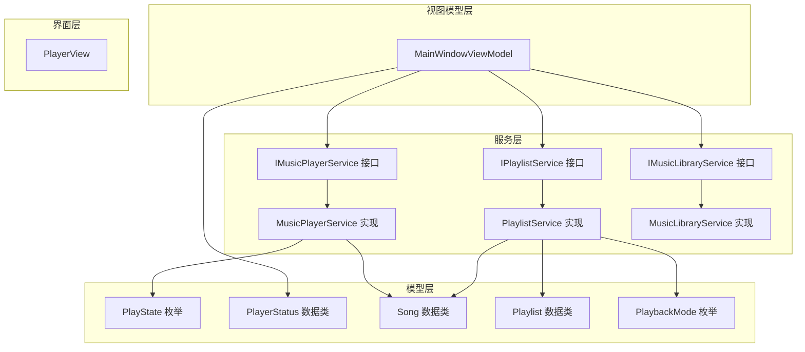
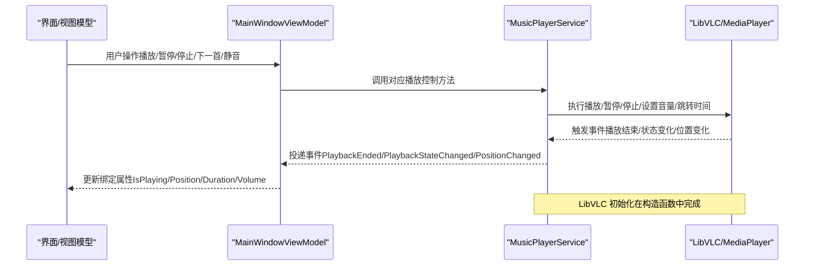
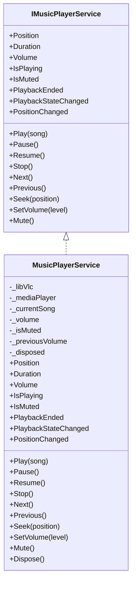
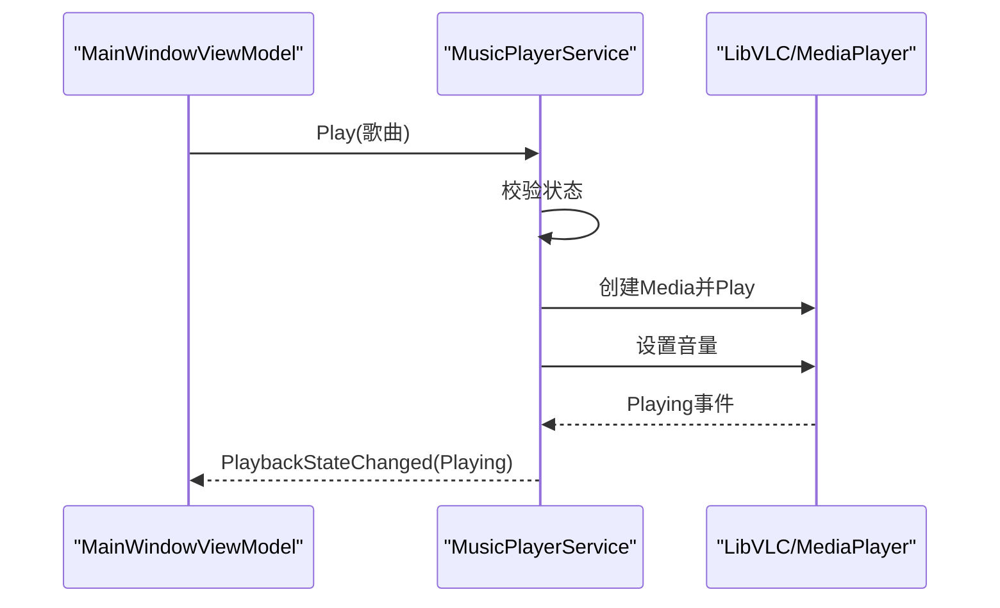
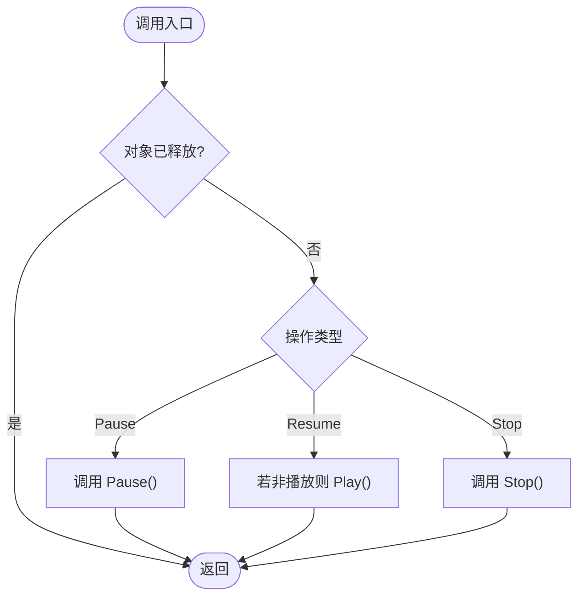
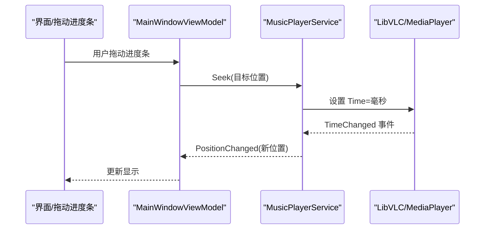
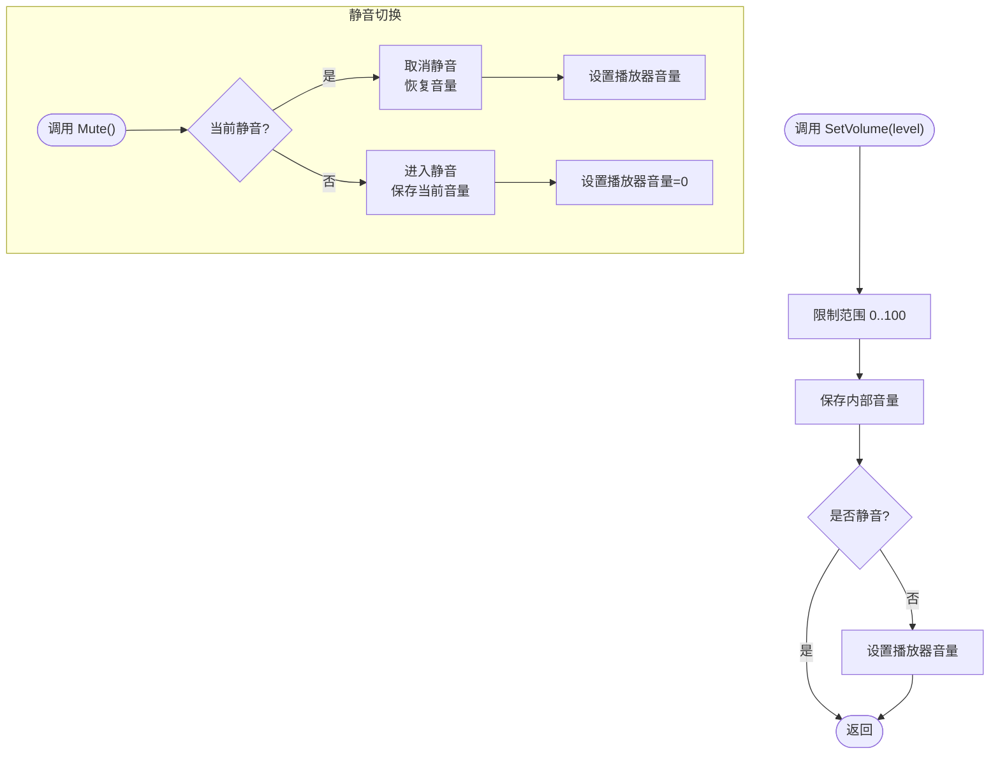
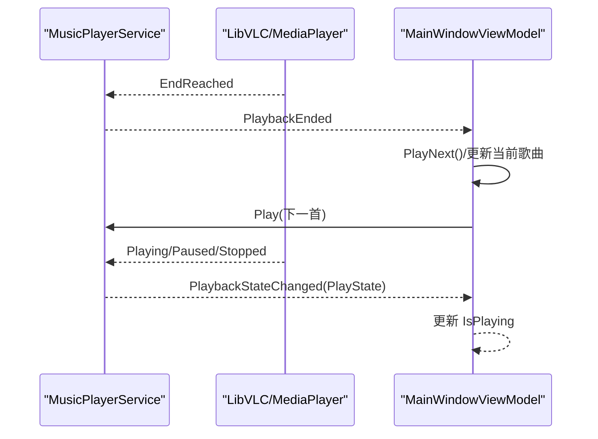
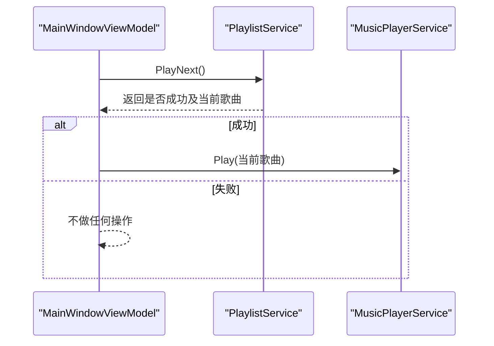
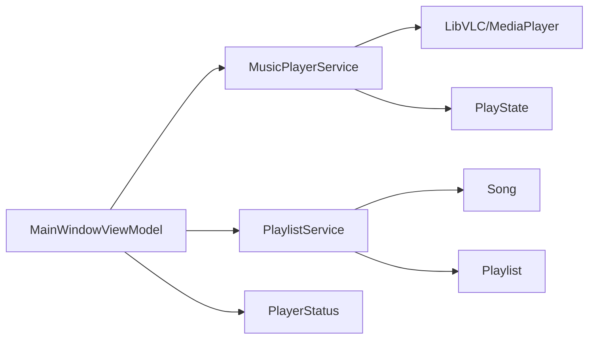

# 音频播放服务

<cite>
**本文档引用的文件**
- [IMusicPlayerService.cs](file://Services/IMusicPlayerService.cs)
- [MusicPlayerService.cs](file://Services/MusicPlayerService.cs)
- [PlayState.cs](file://Models/PlayState.cs)
- [PlayerStatus.cs](file://Models/PlayerStatus.cs)
- [Song.cs](file://Models/Song.cs)
- [IPlaylistService.cs](file://Services/IPlaylistService.cs)
- [PlaylistService.cs](file://Services/PlaylistService.cs)
- [MainWindowViewModel.cs](file://ViewModels/MainWindowViewModel.cs)
- [LocalMusicPlayer.csproj](file://LocalMusicPlayer.csproj)
</cite>

## 目录
1. [简介](#简介)
2. [项目结构](#项目结构)
3. [核心组件](#核心组件)
4. [架构总览](#架构总览)
5. [详细组件分析](#详细组件分析)
6. [依赖关系分析](#依赖关系分析)
7. [性能考虑](#性能考虑)
8. [故障排除指南](#故障排除指南)
9. [结论](#结论)
10. [附录](#附录)

## 简介
本文件面向“音频播放服务”的设计与实现，聚焦于 IMusicPlayerService 接口与 MusicPlayerService 类的具体职责与行为，系统阐述以下主题：
- 播放控制方法（Play、Pause、Resume、Stop、Next、Previous）的实现机制与调用流程
- Seek 方法的时间轴控制与 PositionChanged 事件处理
- 音量控制（SetVolume、Mute）与状态属性（IsPlaying、IsMuted）的管理
- 播放状态事件（PlaybackStateChanged）与播放结束事件（PlaybackEnded）的触发时机与处理逻辑
- LibVLCSharp 集成的技术细节、错误处理策略与性能优化建议
- 实际使用示例与最佳实践

## 项目结构
该项目采用分层与功能模块化组织方式：
- Models：定义播放器状态、歌曲与播放列表等数据模型
- Services：封装业务能力，包括音乐库、播放器、播放列表与扫描服务
- ViewModels：MVVM 中的视图模型，协调 UI 与服务层交互
- Views：界面控件（此处以 PlayerView 为例）
- 其他资源：转换器、样式、行为等

**图表来源**
- [IMusicPlayerService.cs:1-27](file://Services/IMusicPlayerService.cs#L1-L27)
- [MusicPlayerService.cs:1-129](file://Services/MusicPlayerService.cs#L1-L129)
- [IPlaylistService.cs:1-22](file://Services/IPlaylistService.cs#L1-L22)
- [PlaylistService.cs:1-120](file://Services/PlaylistService.cs#L1-L120)
- [PlayState.cs:1-9](file://Models/PlayState.cs#L1-L9)
- [PlayerStatus.cs:1-15](file://Models/PlayerStatus.cs#L1-L15)
- [Song.cs:1-13](file://Models/Song.cs#L1-L13)
- [MainWindowViewModel.cs:1-231](file://ViewModels/MainWindowViewModel.cs#L1-L231)

**章节来源**
- [LocalMusicPlayer.csproj:1-43](file://LocalMusicPlayer.csproj#L1-L43)

## 核心组件
- IMusicPlayerService：定义播放器对外能力契约，包括播放控制、时间轴与音量管理、状态与事件。
- MusicPlayerService：基于 LibVLCSharp 的具体实现，负责媒体加载、播放控制、事件转发与资源释放。
- IPlaylistService/PlaylistService：维护播放列表、当前索引与播放模式（顺序/随机/单曲循环），并与播放器联动。
- MainWindowViewModel：协调播放器与播放列表服务，绑定 UI 与状态，订阅播放器事件并驱动 UI 更新。

**章节来源**
- [IMusicPlayerService.cs:1-27](file://Services/IMusicPlayerService.cs#L1-L27)
- [MusicPlayerService.cs:1-129](file://Services/MusicPlayerService.cs#L1-L129)
- [IPlaylistService.cs:1-22](file://Services/IPlaylistService.cs#L1-L22)
- [PlaylistService.cs:1-120](file://Services/PlaylistService.cs#L1-L120)
- [MainWindowViewModel.cs:1-231](file://ViewModels/MainWindowViewModel.cs#L1-L231)

## 架构总览
下图展示从 UI 到播放器再到 LibVLC 的端到端调用链路与事件传播路径：

**图表来源**
- [MusicPlayerService.cs:27-38](file://Services/MusicPlayerService.cs#L27-L38)
- [MainWindowViewModel.cs:141-216](file://ViewModels/MainWindowViewModel.cs#L141-L216)

## 详细组件分析

### IMusicPlayerService 接口与 MusicPlayerService 实现
- 设计要点
  - 统一的播放控制入口：Play、Pause、Resume、Stop、Next、Previous、Seek、SetVolume、Mute
  - 状态暴露：Position、Duration、Volume、IsPlaying、IsMuted
  - 事件驱动：PlaybackEnded、PlaybackStateChanged、PositionChanged
- 实现要点
  - 使用 LibVLCSharp 的 Core.Initialize、LibVLC、MediaPlayer
  - 将 LibVLC 的事件映射为应用级事件，供上层订阅
  - 对外暴露只读状态，内部维护音量与静音状态

**图表来源**
- [IMusicPlayerService.cs:6-27](file://Services/IMusicPlayerService.cs#L6-L27)
- [MusicPlayerService.cs:7-129](file://Services/MusicPlayerService.cs#L7-L129)

**章节来源**
- [IMusicPlayerService.cs:1-27](file://Services/IMusicPlayerService.cs#L1-L27)
- [MusicPlayerService.cs:1-129](file://Services/MusicPlayerService.cs#L1-L129)

### 播放控制方法实现机制与调用流程

#### Play
- 流程
  - 校验对象未被释放且媒体播放器可用
  - 创建 Media 并播放指定歌曲
  - 同步当前音量至播放器
- 关键点
  - 使用歌曲文件路径构造 URI
  - 播放后自动应用当前音量

**图表来源**
- [MusicPlayerService.cs:40-48](file://Services/MusicPlayerService.cs#L40-L48)
- [MainWindowViewModel.cs:179-195](file://ViewModels/MainWindowViewModel.cs#L179-L195)

**章节来源**
- [MusicPlayerService.cs:40-48](file://Services/MusicPlayerService.cs#L40-L48)

#### Pause/Resume/Stop
- Pause：调用播放器暂停
- Resume：若当前非播放状态则继续播放
- Stop：调用播放器停止

**图表来源**
- [MusicPlayerService.cs:50-66](file://Services/MusicPlayerService.cs#L50-L66)

**章节来源**
- [MusicPlayerService.cs:50-66](file://Services/MusicPlayerService.cs#L50-L66)

#### Next/Previous
- 当前实现：占位符，尚未接入播放列表服务
- 建议实现：结合 IPlaylistService 的 PlayNext/PlayPrevious 与 CurrentSong 变更

**章节来源**
- [MusicPlayerService.cs:68-74](file://Services/MusicPlayerService.cs#L68-L74)
- [IPlaylistService.cs:13-14](file://Services/IPlaylistService.cs#L13-L14)
- [PlaylistService.cs:69-95](file://Services/PlaylistService.cs#L69-L95)

### Seek 时间轴控制与 PositionChanged 事件
- Seek 实现
  - 将传入的 TimeSpan 转换为毫秒并设置到播放器的 Time 属性
- Position 与 Duration
  - Position：来自播放器 Time（毫秒）转换为 TimeSpan
  - Duration：来自播放器 Length（毫秒）转换为 TimeSpan
- PositionChanged 事件
  - 播放器 TimeChanged 事件触发时，将毫秒值转换为 TimeSpan 并投递

**图表来源**
- [MusicPlayerService.cs:76-82](file://Services/MusicPlayerService.cs#L76-L82)
- [MusicPlayerService.cs:21-25](file://Services/MusicPlayerService.cs#L21-L25)
- [MusicPlayerService.cs](file://Services/MusicPlayerService.cs#L34)

**章节来源**
- [MusicPlayerService.cs:76-82](file://Services/MusicPlayerService.cs#L76-L82)
- [MusicPlayerService.cs:21-25](file://Services/MusicPlayerService.cs#L21-L25)
- [MusicPlayerService.cs](file://Services/MusicPlayerService.cs#L34)

### 音量控制与状态属性
- SetVolume
  - 内部将音量限制在 0-100 区间
  - 若未静音，则同步到播放器
- Mute
  - 切换静音状态，记录/恢复音量
  - 静音时将播放器音量置零；取消静音时恢复先前音量
- 状态属性
  - Volume：返回内部音量
  - IsMuted：返回静音状态
  - IsPlaying：委托给播放器 IsPlaying

**图表来源**
- [MusicPlayerService.cs:84-113](file://Services/MusicPlayerService.cs#L84-L113)

**章节来源**
- [MusicPlayerService.cs:84-113](file://Services/MusicPlayerService.cs#L84-L113)

### 播放状态事件与播放结束事件
- PlaybackStateChanged
  - 来自播放器 Playing/Paused/Stopped 事件，映射为 PlayState 枚举并投递
- PlaybackEnded
  - 来自播放器 EndReached 事件，表示当前媒体播放完毕
- 上层处理
  - MainWindowViewModel 订阅 PlaybackEnded 自动播放下一首
  - 订阅 PlaybackStateChanged 更新 IsPlaying

**图表来源**
- [MusicPlayerService.cs:33-37](file://Services/MusicPlayerService.cs#L33-L37)
- [MusicPlayerService.cs:115-118](file://Services/MusicPlayerService.cs#L115-L118)
- [MainWindowViewModel.cs:197-207](file://ViewModels/MainWindowViewModel.cs#L197-L207)
- [MainWindowViewModel.cs](file://ViewModels/MainWindowViewModel.cs#L207)

**章节来源**
- [MusicPlayerService.cs:33-37](file://Services/MusicPlayerService.cs#L33-L37)
- [MusicPlayerService.cs:115-118](file://Services/MusicPlayerService.cs#L115-L118)
- [MainWindowViewModel.cs:197-207](file://ViewModels/MainWindowViewModel.cs#L197-L207)
- [MainWindowViewModel.cs](file://ViewModels/MainWindowViewModel.cs#L207)

### 与播放列表服务的协作
- MainWindowViewModel 在用户点击“下一首/上一首”或播放结束时，调用 IPlaylistService 的 PlayNext/PlayPrevious 获取下一首歌曲，并驱动 MusicPlayerService.Play
- PlaylistService 提供三种播放模式：Normal、Shuffle、Loop，并维护 CurrentIndex 与 CurrentSong

**图表来源**
- [MainWindowViewModel.cs:144-161](file://ViewModels/MainWindowViewModel.cs#L144-L161)
- [PlaylistService.cs:69-95](file://Services/PlaylistService.cs#L69-L95)

**章节来源**
- [MainWindowViewModel.cs:144-161](file://ViewModels/MainWindowViewModel.cs#L144-L161)
- [IPlaylistService.cs:13-14](file://Services/IPlaylistService.cs#L13-L14)
- [PlaylistService.cs:69-95](file://Services/PlaylistService.cs#L69-L95)

## 依赖关系分析
- 播放器依赖 LibVLCSharp（LibVLC、MediaPlayer、Core）
- 视图模型依赖播放器与播放列表服务进行业务编排
- 模型层提供 Song、Playlist、PlayState、PlayerStatus、PlaybackMode 等基础数据结构

**图表来源**
- [LocalMusicPlayer.csproj:37-39](file://LocalMusicPlayer.csproj#L37-L39)
- [MainWindowViewModel.cs:1-231](file://ViewModels/MainWindowViewModel.cs#L1-L231)
- [MusicPlayerService.cs:1-129](file://Services/MusicPlayerService.cs#L1-L129)
- [PlaylistService.cs:1-120](file://Services/PlaylistService.cs#L1-L120)
- [PlayState.cs:1-9](file://Models/PlayState.cs#L1-L9)
- [PlayerStatus.cs:1-15](file://Models/PlayerStatus.cs#L1-L15)
- [Song.cs:1-13](file://Models/Song.cs#L1-L13)

**章节来源**
- [LocalMusicPlayer.csproj:37-39](file://LocalMusicPlayer.csproj#L37-L39)

## 性能考虑
- 定时刷新策略
  - MainWindowViewModel 使用定时器每 500ms 读取 Position/Duration，避免频繁 UI 刷新导致卡顿
- 音量设置
  - SetVolume 仅在非静音状态下同步到播放器，减少不必要的调用
- 资源释放
  - 实现 IDisposable，在 Dispose 中停止播放器并释放底层资源，防止内存泄漏
- 媒体创建
  - Play 中使用 using 语句确保 Media 资源及时释放

**章节来源**
- [MainWindowViewModel.cs:209-215](file://ViewModels/MainWindowViewModel.cs#L209-L215)
- [MusicPlayerService.cs:84-91](file://Services/MusicPlayerService.cs#L84-L91)
- [MusicPlayerService.cs:120-129](file://Services/MusicPlayerService.cs#L120-L129)
- [MusicPlayerService.cs](file://Services/MusicPlayerService.cs#L45)

## 故障排除指南
- 播放器不可用或已释放
  - 现象：调用播放控制方法无响应
  - 原因：对象已被释放或播放器为空
  - 处理：检查 Dispose 调用与生命周期管理
- 无法设置音量
  - 现象：音量调节无效
  - 原因：处于静音状态或播放器未就绪
  - 处理：先取消静音，再设置音量
- Seek 不生效
  - 现象：拖动进度条后不跳转
  - 原因：播放器未正确接收时间戳或媒体未加载
  - 处理：确认媒体已 Play，再执行 Seek
- 事件未触发
  - 现象：UI 不更新状态
  - 原因：未订阅事件或线程上下文问题
  - 处理：确保在主线程订阅并更新绑定属性

**章节来源**
- [MusicPlayerService.cs:42-47](file://Services/MusicPlayerService.cs#L42-L47)
- [MusicPlayerService.cs:84-91](file://Services/MusicPlayerService.cs#L84-L91)
- [MusicPlayerService.cs:76-82](file://Services/MusicPlayerService.cs#L76-L82)
- [MainWindowViewModel.cs:209-215](file://ViewModels/MainWindowViewModel.cs#L209-L215)

## 结论
本音频播放服务通过清晰的接口与实现分离，结合 LibVLCSharp 提供了稳定的播放能力。通过事件驱动与状态暴露，实现了 UI 与播放器之间的松耦合。建议后续完善 Next/Previous 的播放列表联动，并在上层增加更完善的错误提示与重试机制，以提升用户体验。

## 附录

### 使用示例与最佳实践
- 播放一首歌曲
  - 通过 MainWindowViewModel 的 PlaySongCommand 或直接调用 MusicPlayerService.Play(song)
  - 订阅 PlaybackStateChanged 更新 UI 状态
- 进度控制
  - 使用 Seek 将进度跳转到指定位置
  - 订阅 PositionChanged 实时更新进度条
- 音量控制
  - 使用 SetVolume 调整音量，使用 Mute 切换静音
  - 注意静音状态下的音量同步逻辑
- 下一首/上一首
  - 通过 IPlaylistService 的 PlayNext/PlayPrevious 获取下一首歌曲
  - 在 PlaybackEnded 事件中自动播放下一首

**章节来源**
- [MainWindowViewModel.cs:144-161](file://ViewModels/MainWindowViewModel.cs#L144-L161)
- [MainWindowViewModel.cs:197-207](file://ViewModels/MainWindowViewModel.cs#L197-L207)
- [MusicPlayerService.cs:76-82](file://Services/MusicPlayerService.cs#L76-L82)
- [MusicPlayerService.cs:84-113](file://Services/MusicPlayerService.cs#L84-L113)