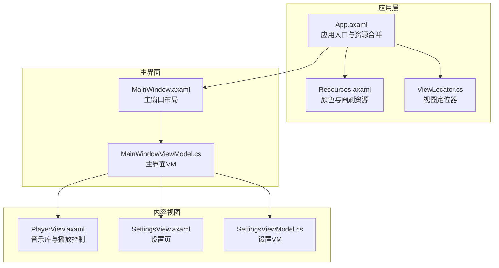
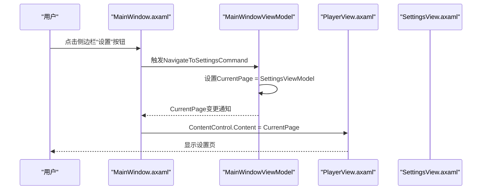
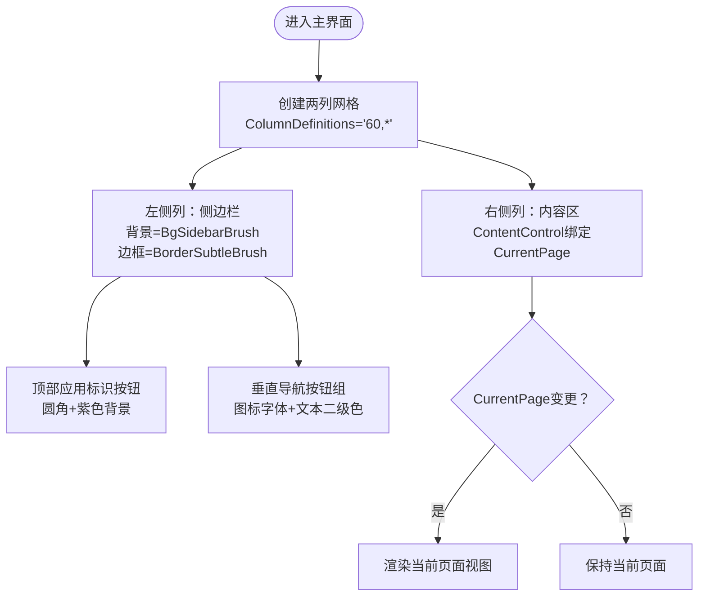
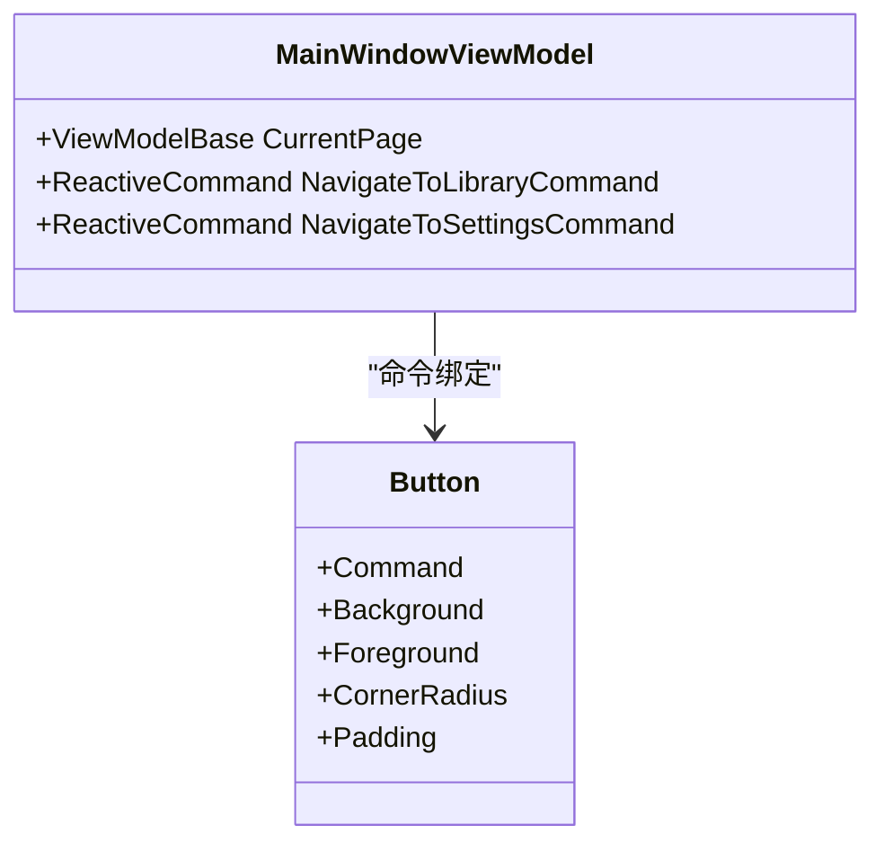
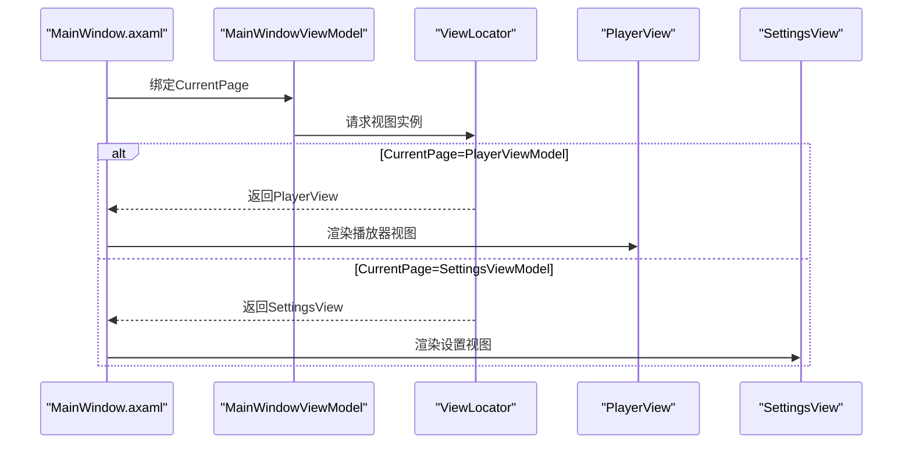
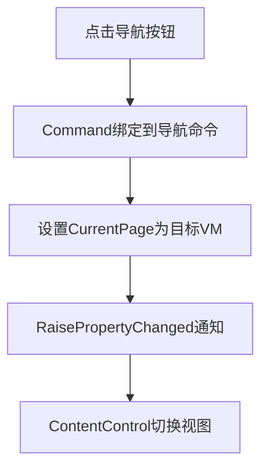
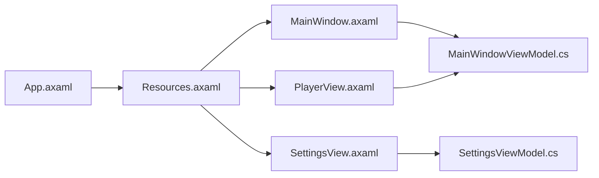
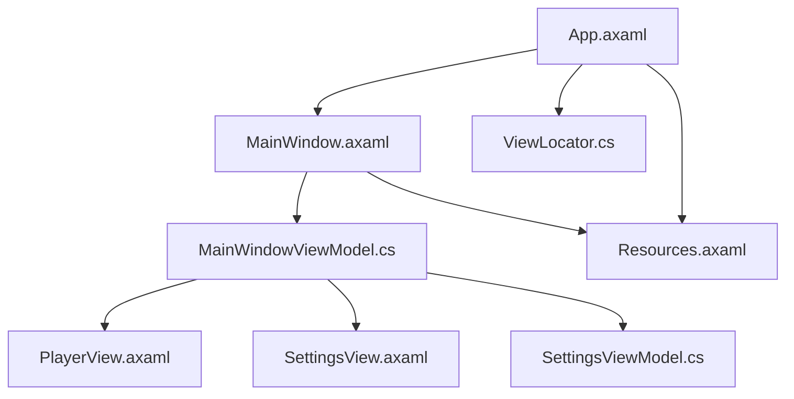

# 主界面

<cite>
**本文引用的文件**
- [MainWindow.axaml](file://Views/MainWindow.axaml)
- [MainWindow.axaml.cs](file://Views/MainWindow.axaml.cs)
- [MainWindowViewModel.cs](file://ViewModels/MainWindowViewModel.cs)
- [Resources.axaml](file://Styles/Resources.axaml)
- [App.axaml](file://App.axaml)
- [PlayerView.axaml](file://Views/PlayerView.axaml)
- [SettingsView.axaml](file://Views/SettingsView.axaml)
- [SettingsViewModel.cs](file://ViewModels/SettingsViewModel.cs)
- [ViewModelBase.cs](file://ViewModels/ViewModelBase.cs)
- [TimeSpanToStringConverter.cs](file://Converters/TimeSpanToStringConverter.cs)
- [ClickBehavior.cs](file://Behaviors/ClickBehavior.cs)
- [ViewLocator.cs](file://ViewLocator.cs)
</cite>

## 目录
1. [简介](#简介)
2. [项目结构](#项目结构)
3. [核心组件](#核心组件)
4. [架构总览](#架构总览)
5. [详细组件分析](#详细组件分析)
6. [依赖分析](#依赖分析)
7. [性能考虑](#性能考虑)
8. [故障排除指南](#故障排除指南)
9. [结论](#结论)
10. [附录](#附录)

## 简介
本文件聚焦于LocalMusicPlayer主界面（MainWindow）的技术实现，围绕XAML布局设计、网格系统、侧边栏导航、内容区域切换、导航架构、图标字体使用、响应式设计、与ViewModel的绑定关系、数据上下文与命令绑定机制、深色主题资源应用以及界面布局的响应式适配与用户体验优化策略进行深入解析，并提供可直接参考的XAML代码片段路径与最佳实践建议。

## 项目结构
主界面位于Views目录下的MainWindow.axaml与MainWindow.axaml.cs，其ViewModel为ViewModels目录下的MainWindowViewModel.cs；主题与颜色资源定义在Styles/Resources.axaml中；应用级主题与资源在App.axaml中配置；内容区域通过ViewLocator根据ViewModel类型动态加载PlayerView与SettingsView；播放器控件与设置页分别由PlayerView.axaml与SettingsView.axaml实现；时间显示转换器位于Converters目录下。

图表来源
- [App.axaml:1-23](file://App.axaml#L1-L23)
- [Resources.axaml:1-67](file://Styles/Resources.axaml#L1-L67)
- [ViewLocator.cs:1-39](file://ViewLocator.cs#L1-L39)
- [MainWindow.axaml:1-78](file://Views/MainWindow.axaml#L1-L78)
- [MainWindowViewModel.cs:1-231](file://ViewModels/MainWindowViewModel.cs#L1-L231)
- [PlayerView.axaml:1-271](file://Views/PlayerView.axaml#L1-L271)
- [SettingsView.axaml:1-372](file://Views/SettingsView.axaml#L1-L372)
- [SettingsViewModel.cs:1-148](file://ViewModels/SettingsViewModel.cs#L1-L148)

章节来源
- [MainWindow.axaml:1-78](file://Views/MainWindow.axaml#L1-L78)
- [MainWindowViewModel.cs:1-231](file://ViewModels/MainWindowViewModel.cs#L1-L231)
- [Resources.axaml:1-67](file://Styles/Resources.axaml#L1-L67)
- [App.axaml:1-23](file://App.axaml#L1-L23)
- [ViewLocator.cs:1-39](file://ViewLocator.cs#L1-L39)

## 核心组件
- 主窗口布局：采用两列网格（侧边栏列宽固定，内容区自适应），侧边栏包含顶部应用标识按钮与垂直排列的导航按钮，内容区通过ContentControl绑定CurrentPage进行页面切换。
- 导航架构：通过ReactiveCommand在主VM中创建导航命令，绑定到侧边栏按钮，实现从主界面到设置页的切换。
- 数据绑定与命令：MainWindow.axaml使用x:DataType绑定MainWindowViewModel，ContentControl绑定CurrentPage；按钮通过Command绑定到对应命令；文本框绑定搜索文本，实现过滤逻辑。
- 深色主题：通过App.axaml合并Resources.axaml中的颜色与画刷资源，统一应用到主界面与内容视图；侧边栏、卡片、输入框、边框等均引用静态资源。
- 响应式设计：侧边栏宽度固定，内容区自适应；播放器底部工具栏在不同分辨率下保持关键控件可见性与间距；设置页使用滚动视图以适配小屏设备。

章节来源
- [MainWindow.axaml:17-74](file://Views/MainWindow.axaml#L17-L74)
- [MainWindowViewModel.cs:118-139](file://ViewModels/MainWindowViewModel.cs#L118-L139)
- [Resources.axaml:22-38](file://Styles/Resources.axaml#L22-L38)
- [App.axaml:16-22](file://App.axaml#L16-L22)

## 架构总览
主界面采用MVVM模式，MainWindow.axaml作为View，MainWindowViewModel.cs作为ViewModel，通过ReactiveUI的命令与属性变更通知实现交互。内容区域通过ViewLocator根据ViewModel类型动态选择PlayerView或SettingsView进行渲染。主题资源集中管理，确保一致的视觉风格。

图表来源
- [MainWindow.axaml:61-68](file://Views/MainWindow.axaml#L61-L68)
- [MainWindowViewModel.cs:132-139](file://ViewModels/MainWindowViewModel.cs#L132-L139)
- [PlayerView.axaml:1-271](file://Views/PlayerView.axaml#L1-L271)
- [SettingsView.axaml:1-372](file://Views/SettingsView.axaml#L1-L372)

## 详细组件分析

### 主窗口布局与网格系统
- 两列网格：左侧固定宽度列用于侧边栏，右侧自适应列用于内容区。
- 侧边栏背景与边框：使用静态画刷资源，形成统一的深色风格。
- 内容区：通过ContentControl绑定CurrentPage，实现页面切换。

图表来源
- [MainWindow.axaml:17-74](file://Views/MainWindow.axaml#L17-L74)
- [Resources.axaml:23-38](file://Styles/Resources.axaml#L23-L38)

章节来源
- [MainWindow.axaml:17-74](file://Views/MainWindow.axaml#L17-L74)

### 侧边栏导航与菜单按钮
- 顶部按钮：用于应用标识，使用图标字体与圆角设计，突出品牌感。
- 导航按钮：垂直排列，使用图标字体与文本二级色；通过样式主题实现悬停与选中态变化。
- 命令绑定：导航按钮绑定到主VM的导航命令，实现页面切换。

图表来源
- [MainWindowViewModel.cs:118-139](file://ViewModels/MainWindowViewModel.cs#L118-L139)
- [MainWindow.axaml:39-68](file://Views/MainWindow.axaml#L39-L68)
- [Resources.axaml:40-63](file://Styles/Resources.axaml#L40-L63)

章节来源
- [MainWindow.axaml:38-69](file://Views/MainWindow.axaml#L38-L69)
- [MainWindowViewModel.cs:118-139](file://ViewModels/MainWindowViewModel.cs#L118-L139)
- [Resources.axaml:40-63](file://Styles/Resources.axaml#L40-L63)

### 内容区域与页面切换
- 当前页面绑定：ContentControl的Content绑定到MainWindowViewModel的CurrentPage属性。
- 页面切换：通过导航命令将CurrentPage设置为不同的ViewModel实例，从而触发视图切换。
- 动态视图：ViewLocator根据ViewModel类型返回对应的View实例，支持约定式命名与显式映射。

图表来源
- [MainWindow.axaml:73](file://Views/MainWindow.axaml#L73)
- [MainWindowViewModel.cs:132-139](file://ViewModels/MainWindowViewModel.cs#L132-L139)
- [ViewLocator.cs:15-20](file://ViewLocator.cs#L15-L20)

章节来源
- [MainWindow.axaml:73](file://Views/MainWindow.axaml#L73)
- [MainWindowViewModel.cs:132-139](file://ViewModels/MainWindowViewModel.cs#L132-L139)
- [ViewLocator.cs:1-39](file://ViewLocator.cs#L1-L39)

### 导航架构与命令绑定机制
- 导航命令：主VM创建NavigateToLibraryCommand与NavigateToSettingsCommand，分别将CurrentPage设置为主VM实例或设置VM实例。
- 命令执行：按钮Command绑定到对应命令，点击后触发CurrentPage变更，进而驱动视图切换。
- 播放控制命令：主VM还提供播放、暂停、停止、上一首、下一首、静音、随机播放、循环播放等命令，用于播放器功能。

图表来源
- [MainWindowViewModel.cs:118-119](file://ViewModels/MainWindowViewModel.cs#L118-L119)
- [MainWindowViewModel.cs:138-139](file://ViewModels/MainWindowViewModel.cs#L138-L139)
- [MainWindow.axaml:39-68](file://Views/MainWindow.axaml#L39-L68)

章节来源
- [MainWindowViewModel.cs:118-139](file://ViewModels/MainWindowViewModel.cs#L118-L139)
- [MainWindow.axaml:39-68](file://Views/MainWindow.axaml#L39-L68)

### 深色主题与颜色资源
- 应用主题：App.axaml通过合并Resources.axaml引入颜色与画刷资源，支持系统主题跟随。
- 资源定义：Resources.axaml定义了主背景、侧边栏、卡片、输入框、文本、强调色、边框等颜色与画刷，并提供控件主题样式。
- 使用方式：主界面与内容视图广泛使用静态资源引用，确保全局一致性与易于维护。

图表来源
- [App.axaml:16-22](file://App.axaml#L16-L22)
- [Resources.axaml:1-67](file://Styles/Resources.axaml#L1-L67)
- [MainWindow.axaml:11](file://Views/MainWindow.axaml#L11)
- [PlayerView.axaml:24](file://Views/PlayerView.axaml#L24)
- [SettingsView.axaml:30](file://Views/SettingsView.axaml#L30)

章节来源
- [App.axaml:16-22](file://App.axaml#L16-L22)
- [Resources.axaml:1-67](file://Styles/Resources.axaml#L1-L67)

### 响应式设计与用户体验优化
- 布局适配：侧边栏固定宽度，内容区自适应；播放器底部工具栏在不同分辨率下保持关键控件可见性与间距。
- 可访问性：按钮使用手型光标与圆角设计，提升点击反馈；文本使用多级颜色资源，保证对比度。
- 输入体验：搜索框采用输入背景与边框，水印提示清晰；滑块控件提供进度与音量调节。
- 视觉反馈：按钮悬停与选中态通过样式主题实现，增强交互感知。

章节来源
- [PlayerView.axaml:167-268](file://Views/PlayerView.axaml#L167-L268)
- [SettingsView.axaml:14-372](file://Views/SettingsView.axaml#L14-L372)
- [Resources.axaml:40-63](file://Styles/Resources.axaml#L40-L63)

### 实际XAML代码示例与最佳实践
- 主窗口布局示例路径：[主窗口网格与侧边栏:17-74](file://Views/MainWindow.axaml#L17-L74)
- 导航按钮与命令绑定示例路径：[导航按钮与命令:39-68](file://Views/MainWindow.axaml#L39-L68)
- 内容区页面切换示例路径：[CurrentPage绑定](file://Views/MainWindow.axaml#L73)
- 深色主题资源引用示例路径：[静态资源引用](file://Views/MainWindow.axaml#L11)
- 时间显示转换器示例路径：[TimeSpanToStringConverter:7-21](file://Converters/TimeSpanToStringConverter.cs#L7-L21)
- 视图定位器示例路径：[ViewLocator:8-39](file://ViewLocator.cs#L8-L39)

最佳实践建议
- 使用静态资源统一管理颜色与画刷，避免硬编码颜色值。
- 将导航命令集中在主VM中，便于复用与测试。
- 在内容区使用ContentControl绑定CurrentPage，结合ViewLocator实现视图解耦。
- 对关键控件（按钮、输入框、边框）统一使用主题样式，提升一致性。
- 合理使用图标字体与文本裁剪，保证在小尺寸屏幕上的可读性。

章节来源
- [MainWindow.axaml:17-74](file://Views/MainWindow.axaml#L17-L74)
- [MainWindowViewModel.cs:118-139](file://ViewModels/MainWindowViewModel.cs#L118-L139)
- [Resources.axaml:22-38](file://Styles/Resources.axaml#L22-L38)
- [TimeSpanToStringConverter.cs:7-21](file://Converters/TimeSpanToStringConverter.cs#L7-L21)
- [ViewLocator.cs:8-39](file://ViewLocator.cs#L8-L39)

## 依赖分析
- 主窗口依赖：MainWindow.axaml依赖MainWindowViewModel.cs进行数据绑定；依赖Resources.axaml提供的颜色与画刷资源。
- 视图定位：ViewLocator根据ViewModel类型返回对应View，支持约定式命名与显式映射。
- 命令依赖：主VM创建并暴露导航命令，供侧边栏按钮绑定。
- 资源依赖：App.axaml合并Resources.axaml，确保全局可用。

图表来源
- [MainWindow.axaml:1-78](file://Views/MainWindow.axaml#L1-L78)
- [MainWindowViewModel.cs:1-231](file://ViewModels/MainWindowViewModel.cs#L1-L231)
- [Resources.axaml:1-67](file://Styles/Resources.axaml#L1-L67)
- [App.axaml:1-23](file://App.axaml#L1-L23)
- [ViewLocator.cs:1-39](file://ViewLocator.cs#L1-L39)

章节来源
- [MainWindow.axaml:1-78](file://Views/MainWindow.axaml#L1-L78)
- [MainWindowViewModel.cs:1-231](file://ViewModels/MainWindowViewModel.cs#L1-L231)
- [Resources.axaml:1-67](file://Styles/Resources.axaml#L1-L67)
- [App.axaml:1-23](file://App.axaml#L1-L23)
- [ViewLocator.cs:1-39](file://ViewLocator.cs#L1-L39)

## 性能考虑
- 绑定更新频率：主VM中使用定时器订阅播放状态更新，建议在不需要时降低更新频率或在后台线程中处理，避免UI阻塞。
- 列表渲染：播放器视图中的歌曲列表使用数据模板，建议启用虚拟化以提升大数据集下的滚动性能。
- 资源加载：静态资源集中管理，减少重复定义；避免在运行时频繁创建新的画刷对象。
- 命令执行：导航命令为轻量操作，但需注意避免在短时间内频繁切换页面导致的重绘开销。

## 故障排除指南
- 导航无反应：检查按钮Command是否正确绑定到主VM的导航命令，确认CurrentPage属性变更通知生效。
- 页面不显示：确认ViewLocator已正确映射ViewModel到View，或遵循约定式命名规则。
- 颜色不生效：检查App.axaml是否合并Resources.axaml，以及控件是否正确引用静态资源键。
- 搜索无结果：确认SearchText属性变更触发FilterSongs方法，且FilteredSongs集合被正确更新。

章节来源
- [MainWindowViewModel.cs:218-229](file://ViewModels/MainWindowViewModel.cs#L218-L229)
- [ViewLocator.cs:15-20](file://ViewLocator.cs#L15-L20)
- [App.axaml:16-22](file://App.axaml#L16-L22)

## 结论
主界面通过清晰的网格布局、统一的深色主题资源、简洁的导航按钮与命令绑定，实现了良好的用户体验与可维护性。结合ViewLocator的动态视图映射与主VM的页面切换机制，整体架构具备扩展性与一致性。建议在后续迭代中进一步优化大数据集下的列表渲染性能，并完善主题切换与无障碍访问能力。

## 附录
- 关键XAML片段路径
  - [主窗口网格与侧边栏:17-74](file://Views/MainWindow.axaml#L17-L74)
  - [导航按钮与命令:39-68](file://Views/MainWindow.axaml#L39-L68)
  - [CurrentPage绑定](file://Views/MainWindow.axaml#L73)
  - [静态资源引用](file://Views/MainWindow.axaml#L11)
  - [TimeSpanToStringConverter:7-21](file://Converters/TimeSpanToStringConverter.cs#L7-L21)
  - [ViewLocator:8-39](file://ViewLocator.cs#L8-L39)
- 相关ViewModel
  - [MainWindowViewModel.cs:1-231](file://ViewModels/MainWindowViewModel.cs#L1-L231)
  - [SettingsViewModel.cs:1-148](file://ViewModels/SettingsViewModel.cs#L1-L148)
  - [ViewModelBase.cs:1-8](file://ViewModels/ViewModelBase.cs#L1-L8)