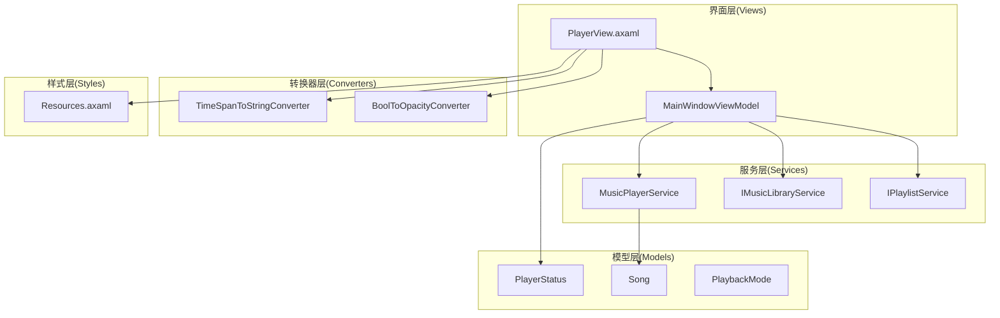
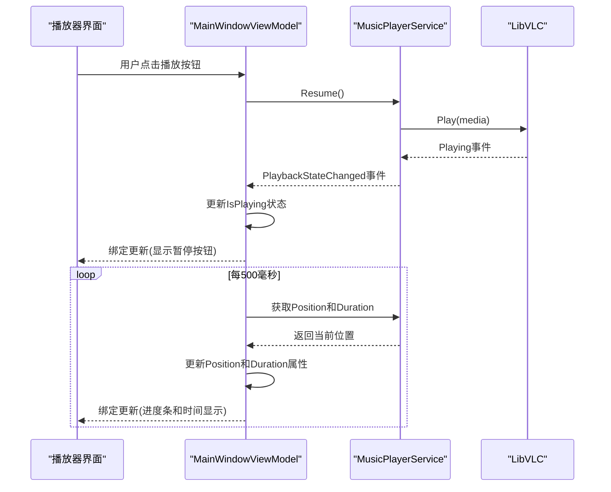
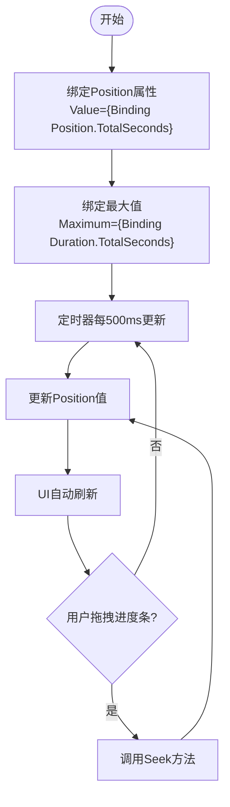
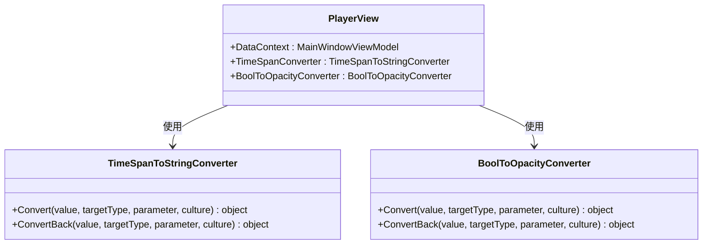
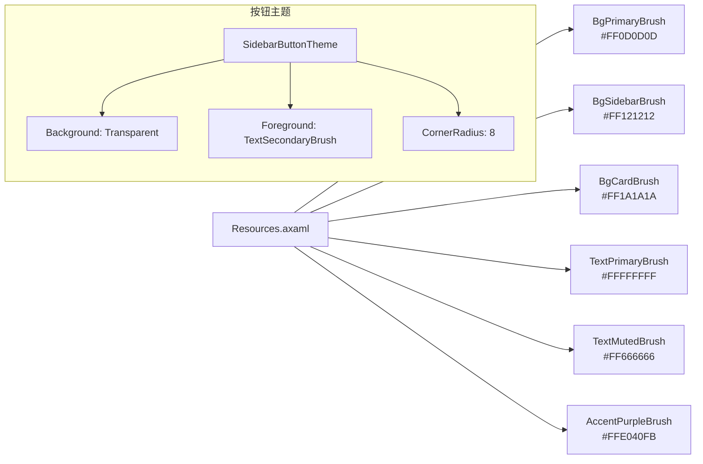
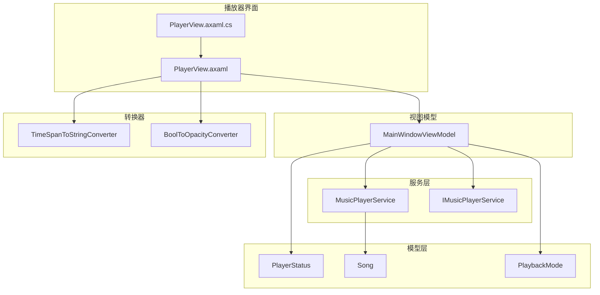

# 播放器界面

<cite>
**本文引用的文件**
- [PlayerView.axaml](file://Views/PlayerView.axaml)
- [PlayerView.axaml.cs](file://Views/PlayerView.axaml.cs)
- [MainWindowViewModel.cs](file://ViewModels/MainWindowViewModel.cs)
- [MusicPlayerService.cs](file://Services/MusicPlayerService.cs)
- [IMusicPlayerService.cs](file://Services/IMusicPlayerService.cs)
- [PlayerStatus.cs](file://Models/PlayerStatus.cs)
- [Song.cs](file://Models/Song.cs)
- [PlaybackMode.cs](file://Models/PlaybackMode.cs)
- [TimeSpanToStringConverter.cs](file://Converters/TimeSpanToStringConverter.cs)
- [BoolToOpacityConverter.cs](file://Converters/BoolToOpacityConverter.cs)
- [Resources.axaml](file://Styles/Resources.axaml)
- [ClickBehavior.cs](file://Behaviors/ClickBehavior.cs)
- [FormatHelper.cs](file://Helpers/FormatHelper.cs)
</cite>

## 目录
1. [简介](#简介)
2. [项目结构](#项目结构)
3. [核心组件](#核心组件)
4. [架构概览](#架构概览)
5. [详细组件分析](#详细组件分析)
6. [依赖关系分析](#依赖关系分析)
7. [性能考虑](#性能考虑)
8. [故障排除指南](#故障排除指南)
9. [结论](#结论)
10. [附录](#附录)

## 简介
本文档为LocalMusicPlayer播放器界面提供全面的技术文档。该播放器采用AvaloniaUI框架构建，基于MVVM模式实现，集成了LibVLC媒体播放引擎。文档详细介绍了播放器界面的XAML布局结构、播放状态实时更新机制、播放控制按钮交互逻辑、音量控制组件设计，以及播放器界面与MusicPlayerService的集成方式。

## 项目结构
LocalMusicPlayer项目采用清晰的分层架构，主要包含以下模块：
- **Views层**：负责用户界面展示，包括主窗口和播放器视图
- **ViewModels层**：实现MVVM模式的数据绑定和业务逻辑
- **Services层**：提供音乐播放服务和库管理服务
- **Models层**：定义数据模型和枚举类型
- **Converters层**：提供数据转换器用于UI绑定
- **Styles层**：定义主题资源和样式
- **Behaviors层**：实现自定义行为
- **Helpers层**：提供辅助工具类



**图表来源**
- [PlayerView.axaml:1-271](file://Views/PlayerView.axaml#L1-L271)
- [MainWindowViewModel.cs:1-231](file://ViewModels/MainWindowViewModel.cs#L1-L231)
- [MusicPlayerService.cs:1-129](file://Services/MusicPlayerService.cs#L1-L129)

**章节来源**
- [PlayerView.axaml:1-271](file://Views/PlayerView.axaml#L1-L271)
- [MainWindowViewModel.cs:1-231](file://ViewModels/MainWindowViewModel.cs#L1-L231)

## 核心组件
播放器界面的核心组件包括：

### 播放控制区域
- **封面显示**：48x48像素的圆角矩形，显示专辑封面占位符
- **歌曲信息**：标题和艺术家名称的文本显示
- **控制按钮**：随机播放、上一首、播放/暂停、下一首、重复播放按钮
- **进度条**：可拖拽的时间进度条，支持快进和快退

### 进度条显示
- **位置显示**：左侧显示当前播放时间
- **进度条**：中间显示可拖拽的进度条
- **总时长**：右侧显示歌曲总时长

### 音量控制组件
- **静音按钮**：切换静音状态
- **音量滑块**：0-100的音量调节

**章节来源**
- [PlayerView.axaml:21-165](file://Views/PlayerView.axaml#L21-L165)
- [MainWindowViewModel.cs:56-98](file://ViewModels/MainWindowViewModel.cs#L56-L98)

## 架构概览
播放器界面采用MVVM架构模式，通过数据绑定实现视图与业务逻辑的解耦。



**图表来源**
- [MainWindowViewModel.cs:108-216](file://ViewModels/MainWindowViewModel.cs#L108-L216)
- [MusicPlayerService.cs:17-38](file://Services/MusicPlayerService.cs#L17-L38)

## 详细组件分析

### 播放器界面布局结构
播放器界面采用DockPanel作为根容器，底部固定高度的播放控制栏。

```mermaid
graph TB
DP[DockPanel根容器] --> BD[底部边框Border<br/>高度80px]
DP --> GR[顶部网格Grid<br/>包含库和搜索]
BD --> G1[三列网格Grid<br/>ColumnDefinitions="Auto,*,Auto"]
G1 --> SP1[左侧StackPanel<br/>歌曲信息]
G1 --> SP2[中央StackPanel<br/>播放控制按钮]
G1 --> SP3[右侧StackPanel<br/>音量控制]
SP2 --> SL[中央Grid<br/>包含进度条和时间]
SL --> TB1[当前时间TextBlock]
SL --> SD[进度条Slider]
SL --> TB2[总时长TextBlock]
```

**图表来源**
- [PlayerView.axaml:21-165](file://Views/PlayerView.axaml#L21-L165)

#### 播放控制按钮实现
播放控制按钮使用图标字体实现，支持响应式设计和悬停效果：

- **随机播放按钮**：切换播放模式（普通/随机）
- **上一首按钮**：播放列表上一首歌曲
- **播放/暂停按钮**：根据播放状态动态显示
- **下一首按钮**：播放列表下一首歌曲
- **重复播放按钮**：切换重复模式（普通/循环）

**章节来源**
- [PlayerView.axaml:66-119](file://Views/PlayerView.axaml#L66-L119)
- [MainWindowViewModel.cs:108-178](file://ViewModels/MainWindowViewModel.cs#L108-L178)

#### 进度条显示机制
进度条采用双向数据绑定，支持实时更新和用户交互：



**图表来源**
- [PlayerView.axaml:128-140](file://Views/PlayerView.axaml#L128-L140)
- [MainWindowViewModel.cs:209-215](file://ViewModels/MainWindowViewModel.cs#L209-L215)

**章节来源**
- [PlayerView.axaml:122-140](file://Views/PlayerView.axaml#L122-L140)
- [MainWindowViewModel.cs:56-70](file://ViewModels/MainWindowViewModel.cs#L56-L70)

#### 音量控制组件设计
音量控制组件包含静音功能和视觉反馈：

- **静音按钮**：切换静音状态，使用透明背景和圆角设计
- **音量滑块**：0-100范围，宽度90像素
- **静音状态指示**：通过IsMuted属性控制按钮外观

**章节来源**
- [PlayerView.axaml:149-162](file://Views/PlayerView.axaml#L149-L162)
- [MainWindowViewModel.cs:72-98](file://ViewModels/MainWindowViewModel.cs#L72-L98)

### 数据绑定和转换器
播放器界面使用多种转换器实现数据格式化：



**图表来源**
- [TimeSpanToStringConverter.cs:7-20](file://Converters/TimeSpanToStringConverter.cs#L7-L20)
- [BoolToOpacityConverter.cs:7-20](file://Converters/BoolToOpacityConverter.cs#L7-L20)
- [PlayerView.axaml:16-19](file://Views/PlayerView.axaml#L16-L19)

**章节来源**
- [TimeSpanToStringConverter.cs:1-21](file://Converters/TimeSpanToStringConverter.cs#L1-L21)
- [BoolToOpacityConverter.cs:1-21](file://Converters/BoolToOpacityConverter.cs#L1-L21)

### 主题和样式系统
播放器界面采用统一的主题系统，定义了深色主题的颜色方案：



**图表来源**
- [Resources.axaml:1-67](file://Styles/Resources.axaml#L1-L67)

**章节来源**
- [Resources.axaml:1-67](file://Styles/Resources.axaml#L1-L67)

## 依赖关系分析



**图表来源**
- [PlayerView.axaml.cs:5-11](file://Views/PlayerView.axaml.cs#L5-L11)
- [MainWindowViewModel.cs:11-16](file://ViewModels/MainWindowViewModel.cs#L11-L16)
- [MusicPlayerService.cs:7-26](file://Services/MusicPlayerService.cs#L7-L26)

**章节来源**
- [IMusicPlayerService.cs:1-27](file://Services/IMusicPlayerService.cs#L1-L27)
- [Song.cs:1-13](file://Models/Song.cs#L1-L13)
- [PlayerStatus.cs:1-15](file://Models/PlayerStatus.cs#L1-L15)

## 性能考虑
播放器界面在性能方面采用了多项优化措施：

### 实时更新频率
- **进度更新间隔**：每500毫秒更新一次，平衡流畅性和性能
- **事件驱动更新**：使用LibVLC的TimeChanged事件进行精确位置跟踪

### 内存管理
- **资源释放**：实现IDisposable接口，确保LibVLC资源正确释放
- **事件订阅管理**：避免重复订阅和内存泄漏

### UI响应性
- **主线程调度**：使用RxApp.MainThreadScheduler确保UI更新在主线程执行
- **异步操作**：避免阻塞UI线程的操作

## 故障排除指南

### 常见问题及解决方案

#### 播放状态不同步
**症状**：播放按钮状态与实际播放状态不一致
**原因**：事件处理延迟或状态更新异常
**解决**：检查PlaybackStateChanged事件订阅和IsPlaying属性更新逻辑

#### 进度条不更新
**症状**：进度条停留在初始位置
**原因**：定时器未启动或Position属性未正确更新
**解决**：验证Observable.Interval配置和Position属性绑定

#### 音量控制失效
**症状**：音量滑块无法调节音量
**原因**：Volume属性绑定或SetVolume方法调用失败
**解决**：检查Volume属性的setter逻辑和Mute状态处理

**章节来源**
- [MainWindowViewModel.cs:197-205](file://ViewModels/MainWindowViewModel.cs#L197-L205)
- [MusicPlayerService.cs:84-113](file://Services/MusicPlayerService.cs#L84-L113)

## 结论
LocalMusicPlayer播放器界面展现了现代桌面应用的最佳实践，通过MVVM架构实现了清晰的关注点分离。界面采用响应式设计，提供了丰富的视觉反馈和流畅的用户体验。服务层与界面层的良好解耦使得代码具有良好的可维护性和扩展性。

## 附录

### 关键配置参数
- **播放控制栏高度**：80像素
- **进度条最小值**：0秒
- **音量滑块范围**：0-100
- **进度更新间隔**：500毫秒
- **图标字体**：Segoe Fluent Icons

### 扩展建议
- **动画效果**：可以添加按钮悬停和点击动画
- **键盘快捷键**：支持键盘控制播放
- **拖拽功能**：支持从文件系统拖拽歌曲到播放列表
- **均衡器**：集成音频效果器