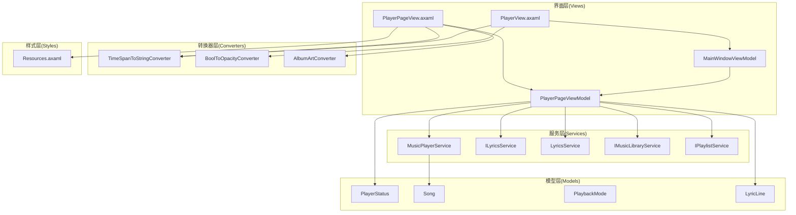
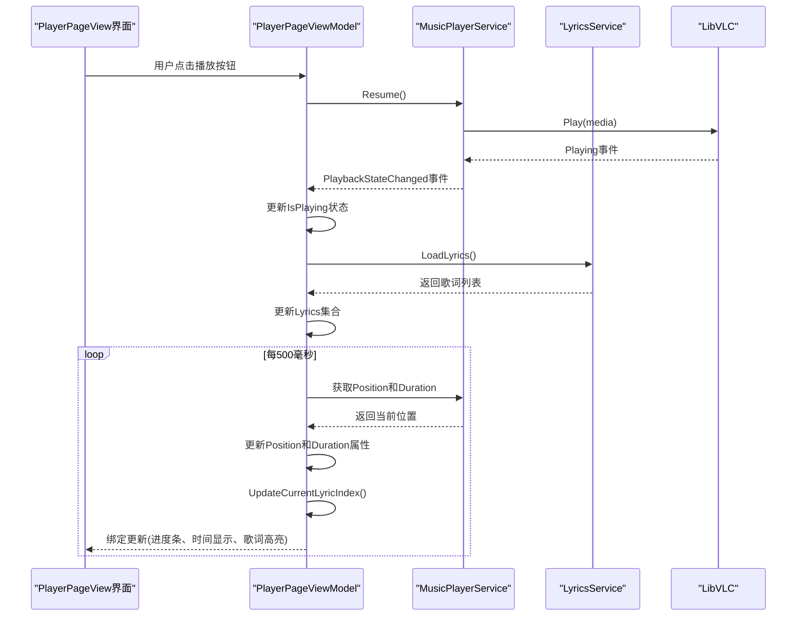
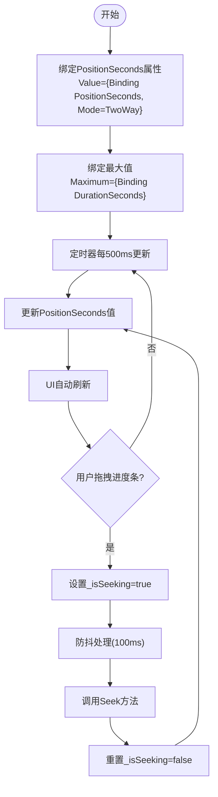
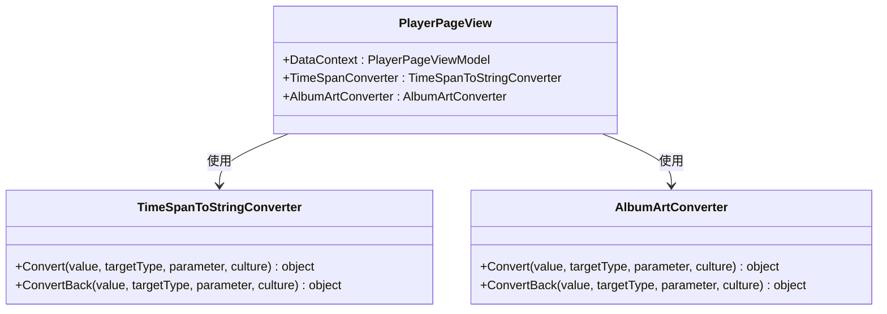
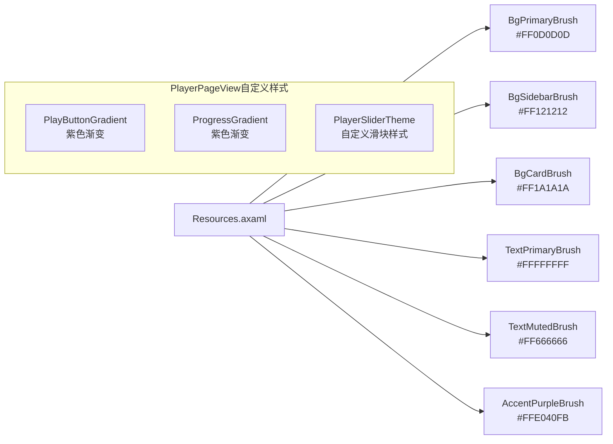
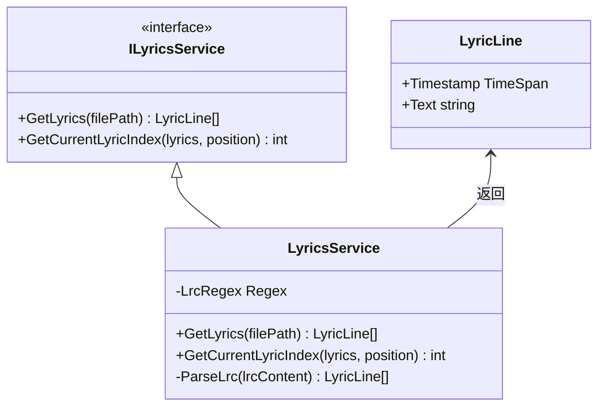
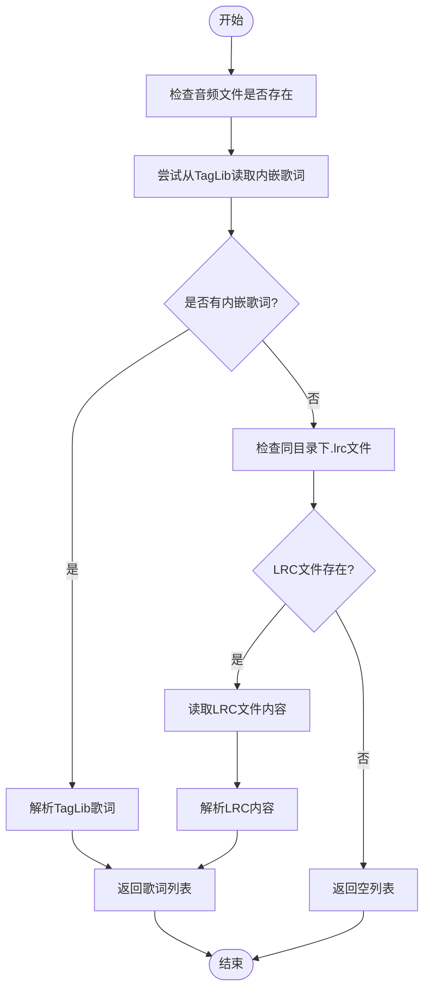
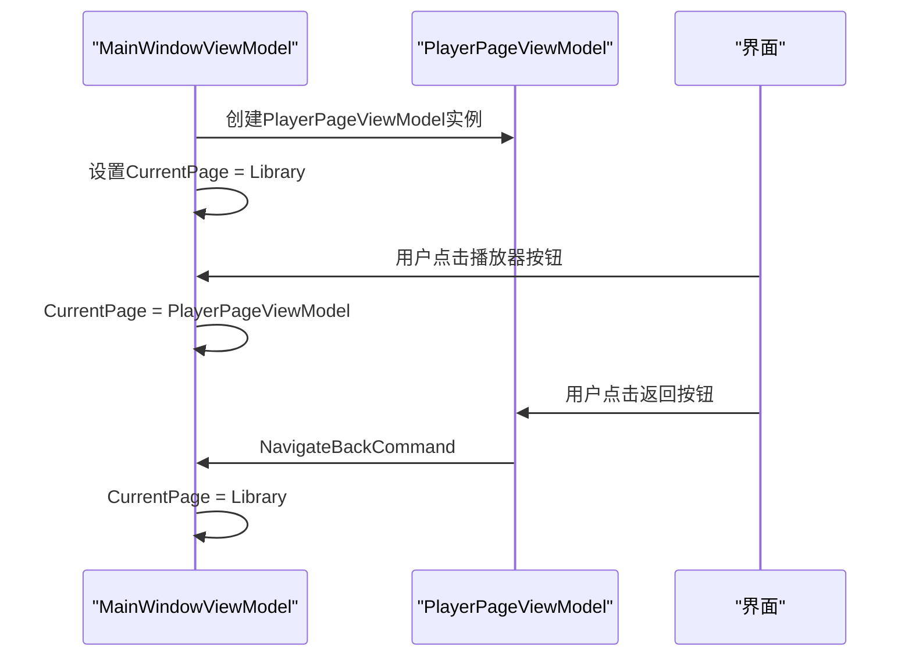
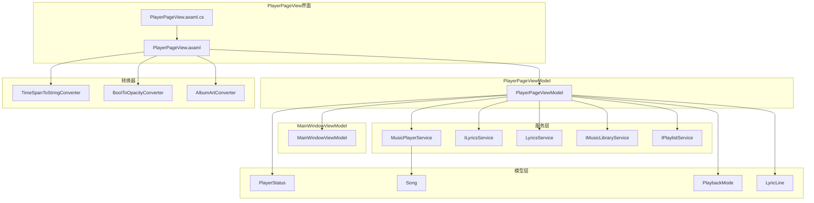

# 播放器界面

<cite>
**本文引用的文件**
- [PlayerPageView.axaml](file://Views/PlayerPageView.axaml)
- [PlayerPageView.axaml.cs](file://Views/PlayerPageView.axaml.cs)
- [PlayerPageViewModel.cs](file://ViewModels/PlayerPageViewModel.cs)
- [MainWindowViewModel.cs](file://ViewModels/MainWindowViewModel.cs)
- [MusicPlayerService.cs](file://Services/MusicPlayerService.cs)
- [ILyricsService.cs](file://Services/ILyricsService.cs)
- [LyricsService.cs](file://Services/LyricsService.cs)
- [AlbumArtConverter.cs](file://Converters/AlbumArtConverter.cs)
- [SliderClickToSeekBehavior.cs](file://Behaviors/SliderClickToSeekBehavior.cs)
- [PlayerView.axaml](file://Views/PlayerView.axaml)
- [PlayerView.axaml.cs](file://Views/PlayerView.axaml.cs)
- [MainWindow.axaml](file://Views/MainWindow.axaml)
- [PlayerStatus.cs](file://Models/PlayerStatus.cs)
- [Song.cs](file://Models/Song.cs)
- [PlaybackMode.cs](file://Models/PlaybackMode.cs)
- [TimeSpanToStringConverter.cs](file://Converters/TimeSpanToStringConverter.cs)
- [BoolToOpacityConverter.cs](file://Converters/BoolToOpacityConverter.cs)
- [Resources.axaml](file://Styles/Resources.axaml)
- [ClickBehavior.cs](file://Behaviors/ClickBehavior.cs)
- [FormatHelper.cs](file://Helpers/FormatHelper.cs)
</cite>

## 更新摘要
**变更内容**
- 新增PlayerPageView完整播放器界面，替代原有的简单播放器视图
- 集成歌词显示功能，支持LRC格式歌词解析和显示
- 增强的UI设计，包含专辑封面、歌曲信息、控制按钮和歌词区域
- 改进的导航系统，支持从主界面切换到播放器页面
- 新增PlayerPageViewModel专门处理播放器页面的状态管理

## 目录
1. [简介](#简介)
2. [项目结构](#项目结构)
3. [核心组件](#核心组件)
4. [架构概览](#架构概览)
5. [详细组件分析](#详细组件-analysis)
6. [歌词显示功能](#歌词显示功能)
7. [导航系统集成](#导航系统集成)
8. [依赖关系分析](#依赖关系分析)
9. [性能考虑](#性能考虑)
10. [故障排除指南](#故障排除指南)
11. [结论](#结论)
12. [附录](#附录)

## 简介
本文档为LocalMusicPlayer播放器界面提供全面的技术文档。该播放器采用AvaloniaUI框架构建，基于MVVM模式实现，集成了LibVLC媒体播放引擎。文档详细介绍了播放器界面的XAML布局结构、播放状态实时更新机制、播放控制按钮交互逻辑、音量控制组件设计，以及播放器界面与MusicPlayerService的集成方式。

**更新** 新增了PlayerPageView完整播放器界面，提供更丰富的用户体验，包括歌词显示、专辑封面展示和增强的控制面板。

## 项目结构
LocalMusicPlayer项目采用清晰的分层架构，主要包含以下模块：
- **Views层**：负责用户界面展示，包括主窗口、播放器视图和播放器页面
- **ViewModels层**：实现MVVM模式的数据绑定和业务逻辑，包括主界面ViewModel和播放器页面ViewModel
- **Services层**：提供音乐播放服务、歌词服务和库管理服务
- **Models层**：定义数据模型和枚举类型
- **Converters层**：提供数据转换器用于UI绑定
- **Styles层**：定义主题资源和样式
- **Behaviors层**：实现自定义行为
- **Helpers层**：提供辅助工具类



**图表来源**
- [PlayerPageView.axaml:1-454](file://Views/PlayerPageView.axaml#L1-L454)
- [PlayerPageViewModel.cs:1-306](file://ViewModels/PlayerPageViewModel.cs#L1-L306)
- [MainWindowViewModel.cs:1-238](file://ViewModels/MainWindowViewModel.cs#L1-L238)

**章节来源**
- [PlayerPageView.axaml:1-454](file://Views/PlayerPageView.axaml#L1-L454)
- [PlayerPageViewModel.cs:1-306](file://ViewModels/PlayerPageViewModel.cs#L1-L306)

## 核心组件
播放器界面的核心组件包括：

### PlayerPageView完整播放器界面
- **头部导航**：返回按钮、标题和更多操作按钮
- **专辑封面展示**：大型圆角矩形显示专辑封面，带阴影效果
- **歌曲信息**：标题、艺术家和专辑信息
- **歌词显示区域**：垂直滚动的歌词列表，支持时间同步
- **进度控制**：可拖拽的时间进度条，支持点击跳转
- **播放控制按钮**：随机播放、上一首、播放/暂停、下一首、重复播放
- **底部操作**：收藏、分享、投屏和音量控制

### 播放控制区域
- **封面显示**：400x400像素的圆角矩形，显示专辑封面
- **歌曲信息**：标题和艺术家名称的文本显示
- **控制按钮**：随机播放、上一首、播放/暂停、下一首、重复播放按钮
- **进度条**：可拖拽的时间进度条，支持快进和快退
- **歌词显示**：垂直滚动的歌词列表

### 进度条显示
- **位置显示**：左侧显示当前播放时间
- **进度条**：中间显示可拖拽的进度条
- **总时长**：右侧显示歌曲总时长

### 音量控制组件
- **静音按钮**：切换静音状态
- **音量滑块**：0-100的音量调节

**章节来源**
- [PlayerPageView.axaml:177-449](file://Views/PlayerPageView.axaml#L177-L449)
- [PlayerPageViewModel.cs:130-144](file://ViewModels/PlayerPageViewModel.cs#L130-L144)

## 架构概览
播放器界面采用MVVM架构模式，通过数据绑定实现视图与业务逻辑的解耦。新增的PlayerPageView提供了更完整的播放体验。



**图表来源**
- [PlayerPageViewModel.cs:229-281](file://ViewModels/PlayerPageViewModel.cs#L229-L281)
- [LyricsService.cs:13-50](file://Services/LyricsService.cs#L13-L50)

## 详细组件分析

### PlayerPageView界面布局结构
PlayerPageView采用Grid布局，分为头部导航、内容区域和底部控制三个主要部分。

```mermaid
graph TB
G1[Grid根容器] --> H[头部导航Grid<br/>ColumnDefinitions="Auto,*,Auto"]
G1 --> C[内容区域Grid<br/>ColumnDefinitions="*,*"]
G1 --> B[底部控制Grid<br/>RowDefinitions="Auto,*,Auto,Auto"]
H --> HB[左: 返回按钮 + 标题]
H --> HC[右: 队列 + 更多按钮]
C --> CA[左侧: 专辑封面区域]
CA --> CB[圆角边框 + 阴影效果]
CB --> CI[Image控件<br/>显示专辑封面]
C --> CI2[右侧: 信息区域]
CI2 --> SI[歌曲信息<br/>标题 + 艺术家 + 专辑]
CI2 --> LA[歌词区域<br/>ScrollViewer + ItemsControl]
CI2 --> PS[进度控制<br/>Slider + 时间显示]
CI2 --> CS[控制按钮<br/>随机 + 上一首 + 播放/暂停 + 下一首 + 重复]
B --> CC[控制按钮区域<br/>水平居中]
B --> BA[底部操作<br/>收藏 + 分享 + 投屏 + 音量]
```

**图表来源**
- [PlayerPageView.axaml:111-451](file://Views/PlayerPageView.axaml#L111-L451)

#### 播放控制按钮实现
播放控制按钮使用图标字体实现，支持响应式设计和悬停效果：

- **随机播放按钮**：切换播放模式（普通/随机），使用不同的图标显示状态
- **上一首按钮**：播放列表上一首歌曲
- **播放/暂停按钮**：根据播放状态动态显示，使用渐变背景和阴影效果
- **下一首按钮**：播放列表下一首歌曲
- **重复播放按钮**：切换重复模式（普通/循环），使用不同的图标显示状态

**章节来源**
- [PlayerPageView.axaml:282-386](file://Views/PlayerPageView.axaml#L282-L386)
- [PlayerPageViewModel.cs:146-211](file://ViewModels/PlayerPageViewModel.cs#L146-L211)

#### 进度条显示机制
进度条采用双向数据绑定，支持实时更新和用户交互：



**图表来源**
- [PlayerPageView.axaml:255-265](file://Views/PlayerPageView.axaml#L255-L265)
- [PlayerPageViewModel.cs:267-278](file://ViewModels/PlayerPageViewModel.cs#L267-L278)

**章节来源**
- [PlayerPageView.axaml:254-279](file://Views/PlayerPageView.axaml#L254-L279)
- [PlayerPageViewModel.cs:61-84](file://ViewModels/PlayerPageViewModel.cs#L61-L84)

#### 音量控制组件设计
音量控制组件包含静音功能和视觉反馈：

- **静音按钮**：切换静音状态，使用不同的图标显示静音和非静音状态
- **音量滑块**：0-100范围，宽度90像素
- **静音状态指示**：通过IsMuted属性控制按钮外观

**章节来源**
- [PlayerPageView.axaml:418-446](file://Views/PlayerPageView.axaml#L418-L446)
- [PlayerPageViewModel.cs:86-104](file://ViewModels/PlayerPageViewModel.cs#L86-L104)

### 数据绑定和转换器
播放器界面使用多种转换器实现数据格式化：



**图表来源**
- [TimeSpanToStringConverter.cs:7-20](file://Converters/TimeSpanToStringConverter.cs#L7-L20)
- [AlbumArtConverter.cs:9-46](file://Converters/AlbumArtConverter.cs#L9-L46)
- [PlayerPageView.axaml:18-21](file://Views/PlayerPageView.axaml#L18-L21)

**章节来源**
- [TimeSpanToStringConverter.cs:1-21](file://Converters/TimeSpanToStringConverter.cs#L1-L21)
- [AlbumArtConverter.cs:1-46](file://Converters/AlbumArtConverter.cs#L1-L46)

### 主题和样式系统
播放器界面采用统一的主题系统，定义了深色主题的颜色方案和自定义控件样式：



**图表来源**
- [Resources.axaml:1-67](file://Styles/Resources.axaml#L1-L67)
- [PlayerPageView.axaml:22-106](file://Views/PlayerPageView.axaml#L22-L106)

**章节来源**
- [Resources.axaml:1-67](file://Styles/Resources.axaml#L1-L67)
- [PlayerPageView.axaml:22-106](file://Views/PlayerPageView.axaml#L22-L106)

## 歌词显示功能

### 歌词服务架构
歌词显示功能通过ILyricsService接口和LyricsService实现，支持多种歌词来源：



**图表来源**
- [ILyricsService.cs:7-29](file://Services/ILyricsService.cs#L7-L29)
- [LyricsService.cs:9-100](file://Services/LyricsService.cs#L9-L100)

### 歌词解析机制
歌词服务支持从多种来源读取歌词，包括TagLib内嵌歌词和外部LRC文件：



**图表来源**
- [LyricsService.cs:13-50](file://Services/LyricsService.cs#L13-L50)
- [LyricsService.cs:66-99](file://Services/LyricsService.cs#L66-L99)

### 歌词同步机制
PlayerPageViewModel实现了歌词与播放进度的实时同步：

- **歌词索引计算**：根据当前播放位置找到对应的歌词行
- **实时更新**：每500毫秒检查当前位置并更新当前歌词索引
- **UI高亮**：当前歌词行在UI中高亮显示

**章节来源**
- [PlayerPageViewModel.cs:130-144](file://ViewModels/PlayerPageViewModel.cs#L130-L144)
- [PlayerPageViewModel.cs:298-304](file://ViewModels/PlayerPageViewModel.cs#L298-L304)
- [LyricsService.cs:52-64](file://Services/LyricsService.cs#L52-L64)

## 导航系统集成

### 多页面导航架构
MainWindowViewModel实现了页面级别的导航，支持在主界面和播放器页面之间切换：



**图表来源**
- [MainWindowViewModel.cs:211-221](file://ViewModels/MainWindowViewModel.cs#L211-L221)
- [PlayerPageViewModel.cs:219-222](file://ViewModels/PlayerPageViewModel.cs#L219-L222)

### 侧边栏集成
PlayerPageView与主界面的侧边栏系统集成，当在播放器页面时隐藏侧边栏：

- **SidebarWidth属性**：根据是否在播放器页面动态调整侧边栏宽度
- **响应式布局**：播放器页面全屏显示，无侧边栏干扰
- **导航一致性**：保持主界面的导航体验

**章节来源**
- [MainWindowViewModel.cs:35-36](file://ViewModels/MainWindowViewModel.cs#L35-L36)
- [MainWindowViewModel.cs:211-221](file://ViewModels/MainWindowViewModel.cs#L211-L221)

## 依赖关系分析



**图表来源**
- [PlayerPageView.axaml.cs:5-11](file://Views/PlayerPageView.axaml.cs#L5-L11)
- [PlayerPageViewModel.cs:15-19](file://ViewModels/PlayerPageViewModel.cs#L15-L19)
- [MusicPlayerService.cs:7-26](file://Services/MusicPlayerService.cs#L7-L26)

**章节来源**
- [ILyricsService.cs:1-29](file://Services/ILyricsService.cs#L1-L29)
- [Song.cs:1-13](file://Models/Song.cs#L1-L13)
- [PlayerStatus.cs:1-15](file://Models/PlayerStatus.cs#L1-L15)

## 性能考虑
播放器界面在性能方面采用了多项优化措施：

### 实时更新频率
- **进度更新间隔**：每500毫秒更新一次，平衡流畅性和性能
- **歌词更新**：仅在位置变化时更新当前歌词索引
- **防抖处理**：进度条拖拽使用100毫秒防抖，避免频繁Seek调用

### 内存管理
- **资源释放**：实现IDisposable接口，确保LibVLC资源正确释放
- **事件订阅管理**：避免重复订阅和内存泄漏
- **歌词缓存**：歌词只在歌曲切换时重新加载

### UI响应性
- **主线程调度**：使用RxApp.MainThreadScheduler确保UI更新在主线程执行
- **异步操作**：避免阻塞UI线程的操作
- **渐变效果**：使用硬件加速的渐变背景

## 故障排除指南

### 常见问题及解决方案

#### 播放状态不同步
**症状**：播放按钮状态与实际播放状态不一致
**原因**：事件处理延迟或状态更新异常
**解决**：检查PlaybackStateChanged事件订阅和IsPlaying属性更新逻辑

#### 进度条不更新
**症状**：进度条停留在初始位置
**原因**：定时器未启动或Position属性未正确更新
**解决**：验证Observable.Interval配置和Position属性绑定

#### 音量控制失效
**症状**：音量滑块无法调节音量
**原因**：Volume属性绑定或SetVolume方法调用失败
**解决**：检查Volume属性的setter逻辑和Mute状态处理

#### 歌词不显示
**症状**：歌词区域为空白
**原因**：歌词文件不存在或解析失败
**解决**：检查音频文件路径、LRC文件格式和歌词服务日志

#### 歌词不同步
**症状**：歌词与音乐播放不同步
**原因**：时间戳解析错误或播放器延迟
**解决**：验证LRC文件格式、检查时间戳精度和播放器同步机制

**章节来源**
- [PlayerPageViewModel.cs:251-281](file://ViewModels/PlayerPageViewModel.cs#L251-L281)
- [LyricsService.cs:13-50](file://Services/LyricsService.cs#L13-L50)

## 结论
LocalMusicPlayer播放器界面展现了现代桌面应用的最佳实践，通过MVVM架构实现了清晰的关注点分离。新增的PlayerPageView提供了完整的播放体验，包括歌词显示、专辑封面展示和增强的控制面板。界面采用响应式设计，提供了丰富的视觉反馈和流畅的用户体验。服务层与界面层的良好解耦使得代码具有良好的可维护性和扩展性。

## 附录

### 关键配置参数
- **播放控制栏高度**：80像素
- **进度条最小值**：0秒
- **音量滑块范围**：0-100
- **进度更新间隔**：500毫秒
- **歌词防抖间隔**：100毫秒
- **专辑封面尺寸**：400x400像素
- **图标字体**：Segoe Fluent Icons

### 扩展建议
- **动画效果**：可以添加按钮悬停和点击动画
- **键盘快捷键**：支持键盘控制播放
- **拖拽功能**：支持从文件系统拖拽歌曲到播放列表
- **均衡器**：集成音频效果器
- **歌词编辑**：支持在线编辑和同步歌词
- **多语言支持**：国际化歌词显示