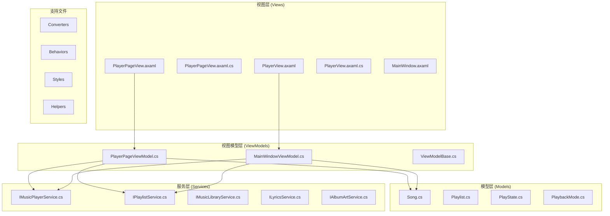
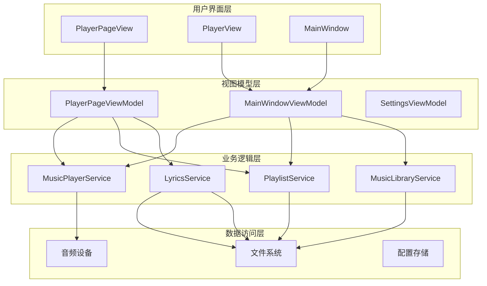
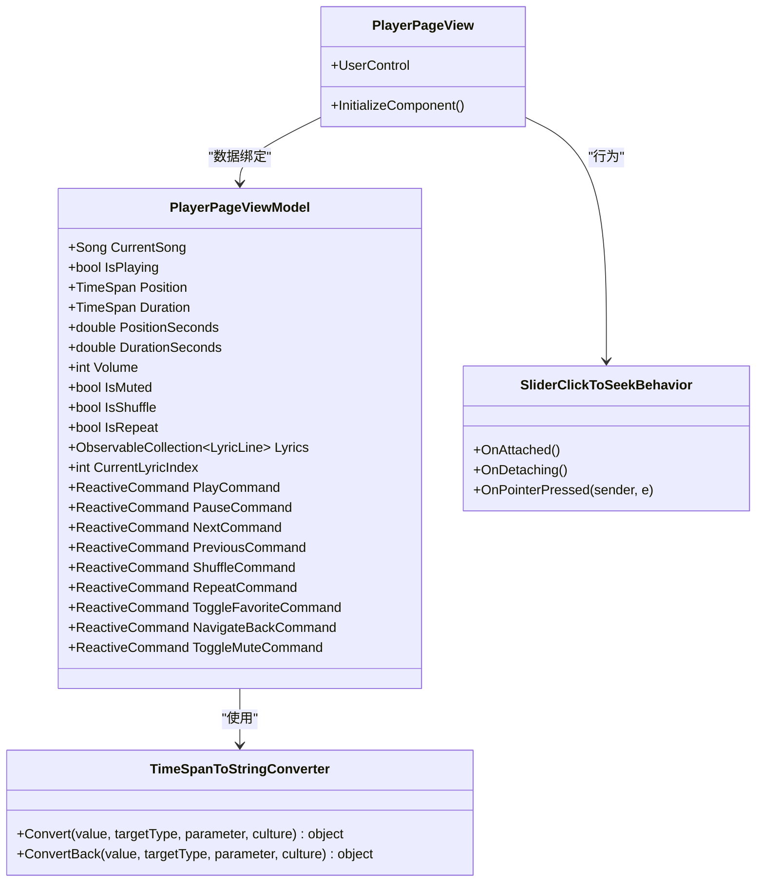
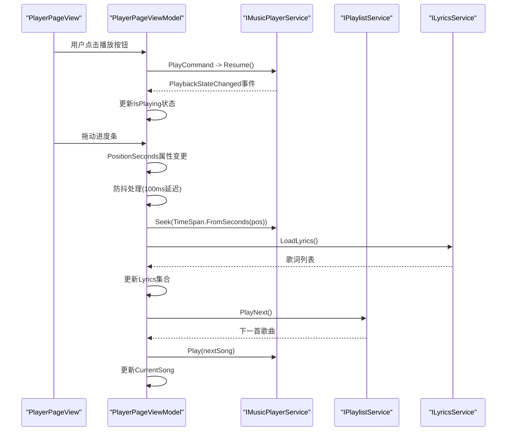
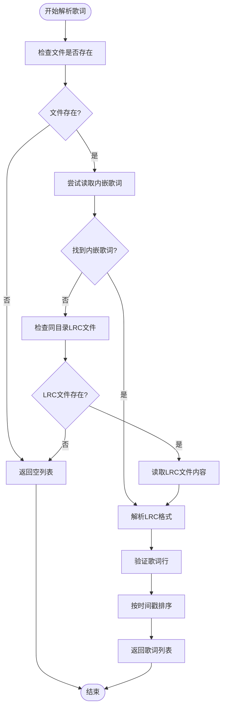
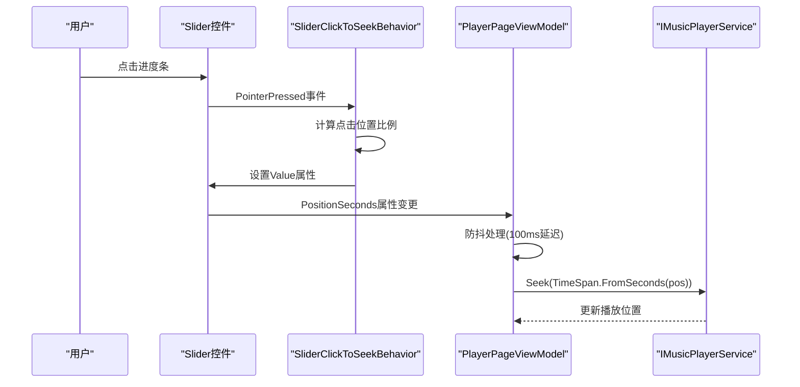
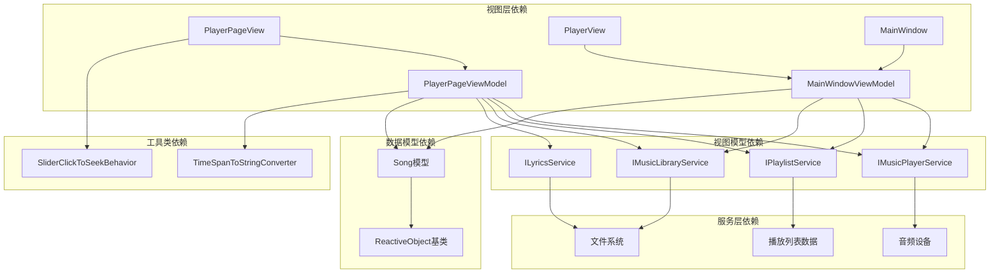

# 播放器页面界面

<cite>
**本文档引用的文件**
- [PlayerPageView.axaml](file://Views/PlayerPageView.axaml)
- [PlayerPageView.axaml.cs](file://Views/PlayerPageView.axaml.cs)
- [PlayerPageViewModel.cs](file://ViewModels/PlayerPageViewModel.cs)
- [PlayerView.axaml](file://Views/PlayerView.axaml)
- [PlayerView.axaml.cs](file://Views/PlayerView.axaml.cs)
- [MainWindowViewModel.cs](file://ViewModels/MainWindowViewModel.cs)
- [Song.cs](file://Models/Song.cs)
- [LyricsService.cs](file://Services/LyricsService.cs)
- [TimeSpanToStringConverter.cs](file://Converters/TimeSpanToStringConverter.cs)
- [SliderClickToSeekBehavior.cs](file://Behaviors/SliderClickToSeekBehavior.cs)
- [IMusicPlayerService.cs](file://Services/IMusicPlayerService.cs)
- [IPlaylistService.cs](file://Services/IPlaylistService.cs)
- [ViewModelBase.cs](file://ViewModels/ViewModelBase.cs)
</cite>

## 目录
1. [简介](#简介)
2. [项目结构](#项目结构)
3. [核心组件](#核心组件)
4. [架构概览](#架构概览)
5. [详细组件分析](#详细组件分析)
6. [依赖关系分析](#依赖关系分析)
7. [性能考虑](#性能考虑)
8. [故障排除指南](#故障排除指南)
9. [结论](#结论)

## 简介

这是一个基于AvaloniaUI框架开发的本地音乐播放器应用的播放器页面界面。该播放器采用现代化的设计语言，提供完整的音乐播放功能，包括播放控制、歌词显示、播放列表管理等特性。界面设计采用深色主题，配以紫色渐变的视觉效果，为用户提供了沉浸式的音乐体验。

播放器页面是应用的核心界面之一，它不仅展示了当前播放的歌曲信息，还提供了丰富的交互控件和视觉反馈。通过MVVM架构模式，实现了清晰的视图与业务逻辑分离，确保了代码的可维护性和可扩展性。

## 项目结构

该项目遵循标准的MVVM（Model-View-ViewModel）架构模式，采用分层组织方式：

**图表来源**
- [PlayerPageView.axaml:1-454](file://Views/PlayerPageView.axaml#L1-L454)
- [PlayerPageViewModel.cs:1-306](file://ViewModels/PlayerPageViewModel.cs#L1-L306)
- [MainWindowViewModel.cs:1-374](file://ViewModels/MainWindowViewModel.cs#L1-L374)

**章节来源**
- [PlayerPageView.axaml:1-454](file://Views/PlayerPageView.axaml#L1-L454)
- [PlayerPageViewModel.cs:1-306](file://ViewModels/PlayerPageViewModel.cs#L1-L306)
- [MainWindowViewModel.cs:1-374](file://ViewModels/MainWindowViewModel.cs#L1-L374)

## 核心组件

播放器页面界面由多个精心设计的组件构成，每个组件都有其特定的功能和职责：

### 视图组件

**PlayerPageView** - 主播放器页面视图
- 提供完整的播放器界面布局
- 包含专辑封面、歌曲信息、歌词显示区域
- 实现进度条控制和播放控制按钮
- 支持歌词同步显示和视觉效果

**PlayerView** - 底部播放栏视图  
- 提供全局播放控制界面
- 包含歌曲信息显示和播放控制按钮
- 实现进度条和音量控制
- 支持快速导航到播放器页面

### 视图模型组件

**PlayerPageViewModel** - 播放器页面视图模型
- 管理播放器状态和行为
- 处理歌词数据和显示逻辑
- 实现播放控制命令
- 管理播放进度同步

**MainWindowViewModel** - 主窗口视图模型
- 协调整个应用程序的状态
- 管理页面导航和视图切换
- 处理全局播放控制
- 维护播放列表和音乐库

### 数据模型组件

**Song** - 歌曲数据模型
- 表示单个音乐文件的信息
- 包含标题、艺术家、专辑等元数据
- 支持收藏状态和专辑封面路径
- 实现属性变更通知机制

**LyricsService** - 歌词服务
- 解析和处理LRC格式歌词
- 支持内嵌歌词和外部LRC文件
- 提供歌词时间戳解析功能
- 实现歌词索引计算

**章节来源**
- [PlayerPageView.axaml:1-454](file://Views/PlayerPageView.axaml#L1-L454)
- [PlayerPageViewModel.cs:1-306](file://ViewModels/PlayerPageViewModel.cs#L1-L306)
- [MainWindowViewModel.cs:1-374](file://ViewModels/MainWindowViewModel.cs#L1-L374)
- [Song.cs:1-77](file://Models/Song.cs#L1-L77)
- [LyricsService.cs:1-101](file://Services/LyricsService.cs#L1-L101)

## 架构概览

播放器页面采用MVVM架构模式，实现了清晰的关注点分离：

**图表来源**
- [PlayerPageViewModel.cs:156-167](file://ViewModels/PlayerPageViewModel.cs#L156-L167)
- [MainWindowViewModel.cs:185-200](file://ViewModels/MainWindowViewModel.cs#L185-L200)
- [IMusicPlayerService.cs:6-27](file://Services/IMusicPlayerService.cs#L6-L27)
- [IPlaylistService.cs:7-22](file://Services/IPlaylistService.cs#L7-L22)

该架构的主要特点：

1. **清晰的职责分离**：视图负责展示，视图模型负责业务逻辑，服务层处理具体功能
2. **响应式编程**：使用ReactiveUI实现数据绑定和事件处理
3. **依赖注入**：通过构造函数注入依赖服务
4. **事件驱动**：大量使用事件机制实现组件间通信

**章节来源**
- [PlayerPageViewModel.cs:156-167](file://ViewModels/PlayerPageViewModel.cs#L156-L167)
- [MainWindowViewModel.cs:185-200](file://ViewModels/MainWindowViewModel.cs#L185-L200)

## 详细组件分析

### PlayerPageView 组件分析

PlayerPageView是播放器页面的主要视图，采用了精心设计的布局和视觉效果：

**图表来源**
- [PlayerPageView.axaml.cs:5-11](file://Views/PlayerPageView.axaml.cs#L5-L11)
- [PlayerPageViewModel.cs:13-306](file://ViewModels/PlayerPageViewModel.cs#L13-L306)
- [TimeSpanToStringConverter.cs:7-21](file://Converters/TimeSpanToStringConverter.cs#L7-L21)
- [SliderClickToSeekBehavior.cs:10-49](file://Behaviors/SliderClickToSeekBehavior.cs#L10-L49)

#### 布局结构分析

播放器页面采用网格布局系统，实现了响应式设计：

**头部区域** - 包含返回按钮、标题和操作按钮
- 返回按钮用于导航回音乐库
- 标题显示"正在播放"状态
- 右侧包含队列按钮和更多选项按钮

**内容区域** - 分为左右两部分

左侧专辑封面区域：
- 大尺寸圆角矩形容器
- 投影效果增强立体感
- 居中显示专辑封面图像

右侧信息区域：
- 歌曲标题和艺术家信息
- 专辑信息显示
- 歌词滚动区域
- 进度控制和播放控制

**章节来源**
- [PlayerPageView.axaml:111-450](file://Views/PlayerPageView.axaml#L111-L450)

### PlayerPageViewModel 组件分析

PlayerPageViewModel是播放器页面的核心业务逻辑控制器：

**图表来源**
- [PlayerPageViewModel.cs:179-281](file://ViewModels/PlayerPageViewModel.cs#L179-L281)
- [IMusicPlayerService.cs:6-27](file://Services/IMusicPlayerService.cs#L6-L27)
- [IPlaylistService.cs:7-22](file://Services/IPlaylistService.cs#L7-L22)

#### 关键功能实现

**播放控制功能**：
- 播放/暂停命令处理
- 上一首/下一首切换
- 音量控制和静音切换
- 重复和随机播放模式

**进度同步机制**：
- 定时更新播放进度（500ms间隔）
- 防抖处理进度条拖动
- 秒级精度的位置跟踪

**歌词同步功能**：
- 自动加载歌曲歌词
- 实时歌词索引计算
- 歌词高亮显示

**章节来源**
- [PlayerPageViewModel.cs:146-306](file://ViewModels/PlayerPageViewModel.cs#L146-L306)

### 歌词服务组件分析

LyricsService提供了完整的歌词处理功能：

**图表来源**
- [LyricsService.cs:13-50](file://Services/LyricsService.cs#L13-L50)

#### 歌词解析算法

歌词服务支持两种歌词来源：
1. **内嵌歌词**：从音频文件的标签信息中提取
2. **外部LRC文件**：从同一目录下的同名LRC文件读取

解析过程包括：
- 使用正则表达式匹配LRC时间戳格式
- 转换时间为TimeSpan对象
- 过滤空白歌词内容
- 按时间顺序排序

**章节来源**
- [LyricsService.cs:66-99](file://Services/LyricsService.cs#L66-L99)

### 播放器行为组件分析

SliderClickToSeekBehavior实现了滑块点击跳转功能：

**图表来源**
- [SliderClickToSeekBehavior.cs:30-47](file://Behaviors/SliderClickToSeekBehavior.cs#L30-L47)
- [PlayerPageViewModel.cs:267-278](file://ViewModels/PlayerPageViewModel.cs#L267-L278)

#### 交互设计特点

该行为组件提供了精确的用户交互体验：
- 支持点击任意位置快速跳转
- 自动边界检查和限制
- 与播放器服务的无缝集成
- 保持播放状态的一致性

**章节来源**
- [SliderClickToSeekBehavior.cs:1-49](file://Behaviors/SliderClickToSeekBehavior.cs#L1-L49)

## 依赖关系分析

播放器页面的组件间依赖关系体现了清晰的架构层次：

**图表来源**
- [PlayerPageViewModel.cs:15-20](file://ViewModels/PlayerPageViewModel.cs#L15-L20)
- [MainWindowViewModel.cs:14-21](file://ViewModels/MainWindowViewModel.cs#L14-L21)
- [ViewModelBase.cs:5-7](file://ViewModels/ViewModelBase.cs#L5-L7)

### 依赖注入模式

项目采用构造函数依赖注入模式：
- 所有服务通过构造函数参数注入
- 避免使用静态工厂或全局变量
- 支持单元测试和模拟对象
- 提高代码的可维护性

### 循环依赖避免

通过接口抽象避免了循环依赖：
- 视图不直接依赖具体服务实现
- 服务层通过接口定义契约
- 视图模型只依赖服务接口
- 保持清晰的依赖方向

**章节来源**
- [PlayerPageViewModel.cs:156-167](file://ViewModels/PlayerPageViewModel.cs#L156-L167)
- [MainWindowViewModel.cs:185-200](file://ViewModels/MainWindowViewModel.cs#L185-L200)

## 性能考虑

播放器页面在设计时充分考虑了性能优化：

### 内存管理
- 使用ObservableCollection管理歌词列表，支持增量更新
- 防抖机制减少频繁的Seek调用
- 定时器更新频率经过优化（500ms间隔）

### 渲染优化
- 使用DropShadowEffect创建投影效果，但限制了模糊半径
- 渐变刷复用减少资源分配
- 控件模板预编译提高渲染效率

### 数据绑定优化
- 使用OneWay绑定减少不必要的更新
- 条件可见性绑定避免无效渲染
- 多绑定转换器缓存结果

### 异步处理
- 歌词解析异步执行
- 文件系统操作非阻塞
- UI线程调度优化

## 故障排除指南

### 常见问题及解决方案

**播放器无法启动**
- 检查音频设备是否正常工作
- 验证音乐文件路径有效性
- 确认播放器服务初始化成功

**歌词不显示**
- 检查LRC文件格式是否正确
- 验证内嵌歌词是否可用
- 确认文件编码格式

**进度条跳动问题**
- 检查防抖机制是否正常工作
- 验证PositionSeconds属性更新频率
- 确认Seek调用的时机

**内存泄漏问题**
- 检查事件订阅是否正确注销
- 验证定时器是否正确释放
- 确认大对象集合及时清理

**章节来源**
- [LyricsService.cs:20-47](file://Services/LyricsService.cs#L20-L47)
- [PlayerPageViewModel.cs:251-278](file://ViewModels/PlayerPageViewModel.cs#L251-L278)

## 结论

播放器页面界面展现了现代桌面应用的最佳实践，通过MVVM架构实现了清晰的职责分离和良好的可维护性。界面设计注重用户体验，提供了直观的操作方式和丰富的视觉反馈。

主要优势包括：
- **架构清晰**：MVVM模式确保了代码的模块化和可测试性
- **用户体验优秀**：响应式设计和流畅的动画效果
- **功能完整**：涵盖了现代音乐播放器的所有核心功能
- **性能优化**：合理的内存管理和渲染优化
- **扩展性强**：模块化设计便于功能扩展和定制

该播放器页面为开发者提供了优秀的参考实现，展示了如何在AvaloniaUI框架下构建高质量的桌面音乐应用。