# 样式和主题系统

<cite>
**本文档引用的文件**
- [Resources.axaml](file://Styles/Resources.axaml)
- [App.axaml](file://App.axaml)
- [App.axaml.cs](file://App.axaml.cs)
- [MainWindow.axaml](file://Views/MainWindow.axaml)
- [PlayerView.axaml](file://Views/PlayerView.axaml)
- [SettingsView.axaml](file://Views/SettingsView.axaml)
- [SettingsViewModel.cs](file://ViewModels/SettingsViewModel.cs)
- [BoolToOpacityConverter.cs](file://Converters/BoolToOpacityConverter.cs)
- [ClickBehavior.cs](file://Behaviors/ClickBehavior.cs)
</cite>

## 目录
1. [简介](#简介)
2. [项目结构](#项目结构)
3. [核心组件](#核心组件)
4. [架构概览](#架构概览)
5. [详细组件分析](#详细组件分析)
6. [依赖关系分析](#依赖关系分析)
7. [性能考虑](#性能考虑)
8. [故障排除指南](#故障排除指南)
9. [结论](#结论)
10. [附录](#附录)

## 简介

LocalMusicPlayer 的样式和主题系统基于 Avalonia UI 框架构建，采用深色主题设计。该系统通过统一的颜色资源管理、主题变体支持和控件样式定义，为用户提供了现代化的音乐播放器界面体验。系统支持动态主题切换，包括深色模式、浅色模式和系统跟随模式。

## 项目结构

样式和主题系统主要分布在以下目录中：

```mermaid
graph TB
subgraph "样式系统结构"
A[Styles/] --> B[Resources.axaml]
C[Views/] --> D[MainWindow.axaml]
C --> E[PlayerView.axaml]
C --> F[SettingsView.axaml]
G[App.axaml] --> H[App.axaml.cs]
I[ViewModels/] --> J[SettingsViewModel.cs]
K[Converters/] --> L[BoolToOpacityConverter.cs]
M[Behaviors/] --> N[ClickBehavior.cs]
end
subgraph "样式资源"
O[颜色资源(Color)] --> P[背景色(Bg*)]
O --> Q[文本色(Text*)]
O --> R[强调色(Accent*)]
O --> S[边框色(Border*)]
T[画刷资源(SolidColorBrush)] --> U[背景画刷(Bg*Brush)]
T --> V[文本画刷(Text*Brush)]
T --> W[强调画刷(Accent*Brush)]
T --> X[边框画刷(Border*Brush)]
Y[控件主题(ControlTheme)] --> Z[SidebarButtonTheme]
end
```

**图表来源**
- [Resources.axaml:1-67](file://Styles/Resources.axaml#L1-L67)
- [App.axaml:1-23](file://App.axaml#L1-L23)

**章节来源**
- [Resources.axaml:1-67](file://Styles/Resources.axaml#L1-L67)
- [App.axaml:1-23](file://App.axaml#L1-L23)

## 核心组件

### 颜色资源系统

系统采用分层的颜色资源组织结构，确保视觉一致性：

#### 主要颜色分类

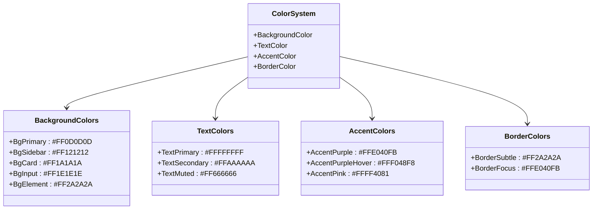

**图表来源**
- [Resources.axaml:4-20](file://Styles/Resources.axaml#L4-L20)

#### 颜色命名规范

系统遵循统一的命名约定：
- **背景色**: `Bg` + 主题层级 + `Brush`
- **文本色**: `Text` + 语义层级 + `Brush`
- **强调色**: `Accent` + 色彩名称 + `Brush`
- **边框色**: `Border` + 状态/强度 + `Brush`

**章节来源**
- [Resources.axaml:4-38](file://Styles/Resources.axaml#L4-L38)

### 画刷资源系统

为了提高性能和可维护性，系统使用 SolidColorBrush 包装所有颜色资源：

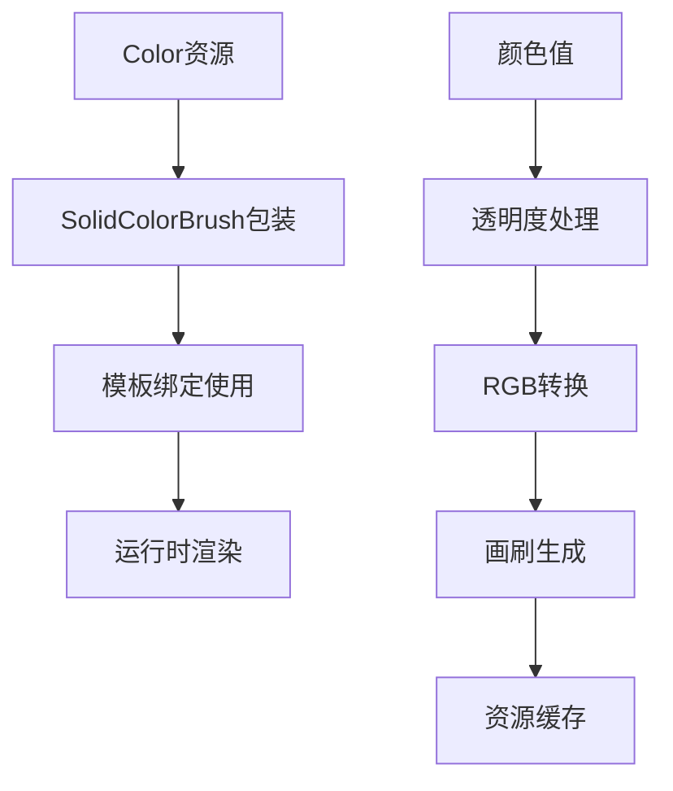

**图表来源**
- [Resources.axaml:22-38](file://Styles/Resources.axaml#L22-L38)

**章节来源**
- [Resources.axaml:22-38](file://Styles/Resources.axaml#L22-L38)

### 控件主题系统

系统定义了专门的 ControlTheme 来统一控件外观：

#### SidebarButtonTheme 分析

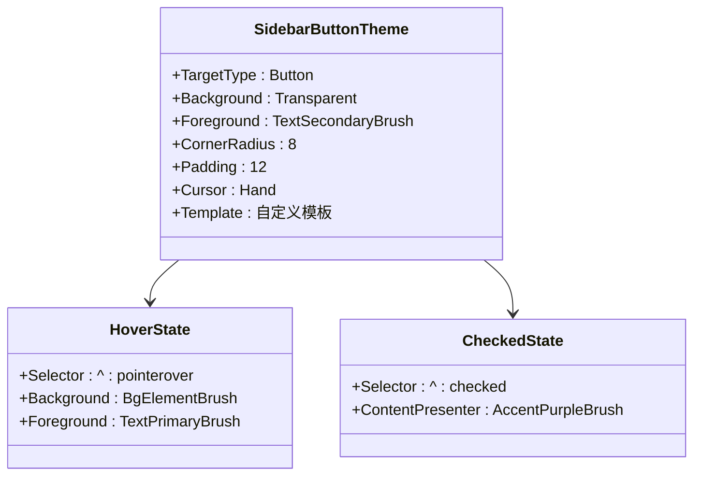

**图表来源**
- [Resources.axaml:40-63](file://Styles/Resources.axaml#L40-L63)

**章节来源**
- [Resources.axaml:40-63](file://Styles/Resources.axaml#L40-L63)

## 架构概览

### 主题系统架构

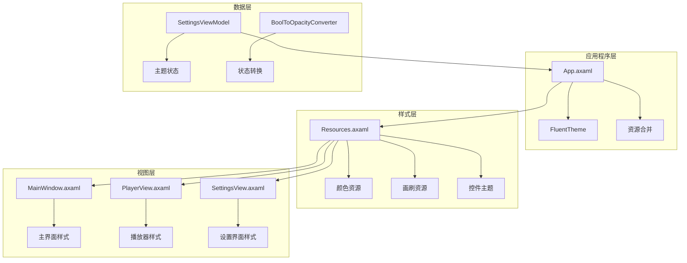

**图表来源**
- [App.axaml:12-22](file://App.axaml#L12-L22)
- [Resources.axaml:1-67](file://Styles/Resources.axaml#L1-L67)

### 主题切换机制

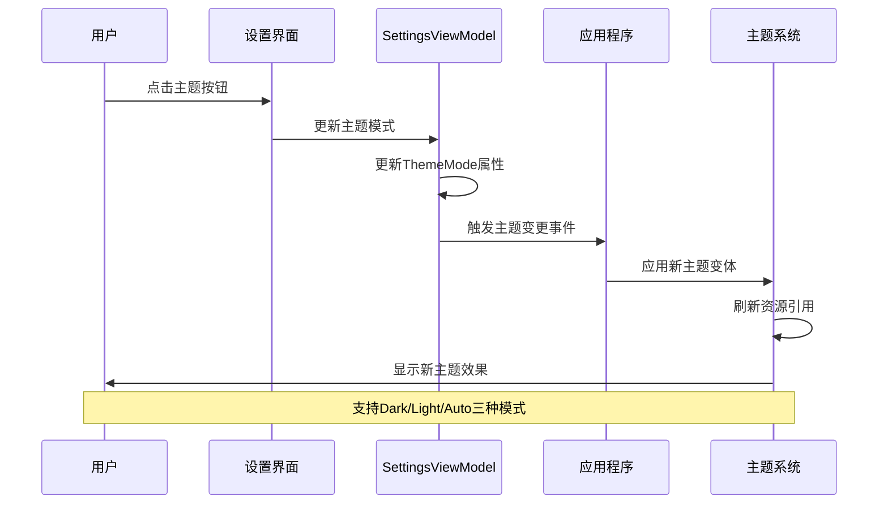

**图表来源**
- [SettingsView.axaml:305-366](file://Views/SettingsView.axaml#L305-L366)
- [SettingsViewModel.cs:88-94](file://ViewModels/SettingsViewModel.cs#L88-L94)

**章节来源**
- [App.axaml:5-6](file://App.axaml#L5-L6)
- [SettingsView.axaml:305-366](file://Views/SettingsView.axaml#L305-L366)
- [SettingsViewModel.cs:88-94](file://ViewModels/SettingsViewModel.cs#L88-L94)

## 详细组件分析

### 深色主题设计理念

#### 色彩方案分析

深色主题采用渐进式明暗层次设计：

```mermaid
flowchart LR
subgraph "深色层次"
A[#FF0D0D0D - 主背景<br/>最暗层，用于主容器"]
B[#FF121212 - 侧边栏<br/>次暗层，用于导航区域"]
C[#FF1A1A1A - 卡片背景<br/>中等暗层，用于内容卡片"]
D[#FF2A2A2A - 元素背景<br/>较亮的暗层，用于按钮悬停"]
E[#FF1E1E1E - 输入背景<br/>用于输入框"]
F[#FFFFFFFF - 主文本<br/>最高对比度，用于标题"]
G[#FFAAAAAA - 次级文本<br/>中等对比度，用于正文"]
H[#FF666666 - 柔和文本<br/>较低对比度，用于辅助信息"]
end
A --> B --> C --> D
F --> G --> H
```

**图表来源**
- [Resources.axaml:4-13](file://Styles/Resources.axaml#L4-L13)

#### 强调色系统

系统使用紫色作为主要强调色，提供多种变体：

| 强调色变体 | 颜色值 | 使用场景 |
|-----------|--------|----------|
| AccentPurple | #FFE040FB | 主要强调色，按钮激活状态 |
| AccentPurpleHover | #FFF048F8 | 悬停状态，按钮交互反馈 |
| AccentPink | #FFFF4081 | 辅助强调色，特殊功能 |

**章节来源**
- [Resources.axaml:15-17](file://Styles/Resources.axaml#L15-L17)

### 控件样式定义

#### 按钮样式系统

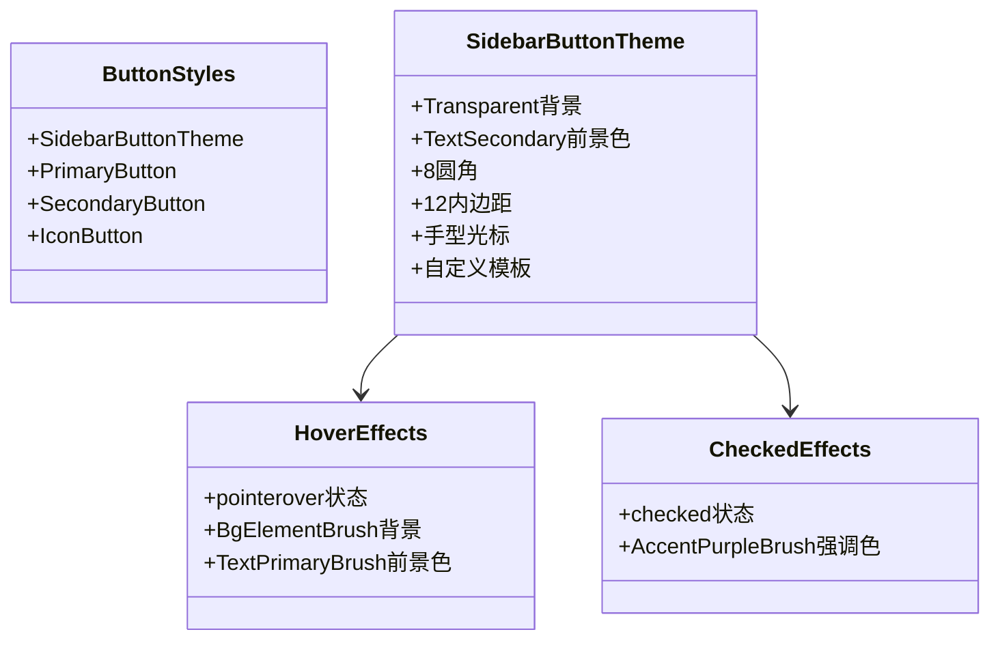

**图表来源**
- [Resources.axaml:40-63](file://Styles/Resources.axaml#L40-L63)

#### 输入框样式

系统为不同类型的输入框提供统一的样式规范：

| 组件类型 | 背景色 | 边框色 | 文本色 | 圆角半径 |
|---------|--------|--------|--------|----------|
| 搜索框 | BgInputBrush | BorderSubtleBrush | TextPrimaryBrush | 6 |
| 设置输入框 | BgInputBrush | BorderSubtleBrush | TextPrimaryBrush | 6 |
| 播放列表项 | Transparent | None | TextPrimaryBrush | 4 |

**章节来源**
- [PlayerView.axaml:175-199](file://Views/PlayerView.axaml#L175-L199)
- [SettingsView.axaml:63-86](file://Views/SettingsView.axaml#L63-L86)

### 视图中的样式应用

#### 主窗口样式

主窗口采用分栏布局，左侧为导航侧边栏，右侧为主内容区：

```mermaid
graph TB
A[MainWindow] --> B[Grid布局<br/>ColumnDefinitions="60,*"]
B --> C[左侧边栏<br/>60宽度固定]
B --> D[右侧内容区<br/>自动填充]
C --> E[导航按钮组<br/>垂直排列]
C --> F[顶部圆形按钮<br/>AccentPurple背景]
C --> G[功能按钮组<br/>SidebarButtonTheme]
D --> H[内容控制<br/>CurrentPage绑定]
```

**图表来源**
- [MainWindow.axaml:17-74](file://Views/MainWindow.axaml#L17-L74)

**章节来源**
- [MainWindow.axaml:17-74](file://Views/MainWindow.axaml#L17-L74)

#### 播放器界面样式

播放器界面采用 DockPanel 布局，底部为控制栏：

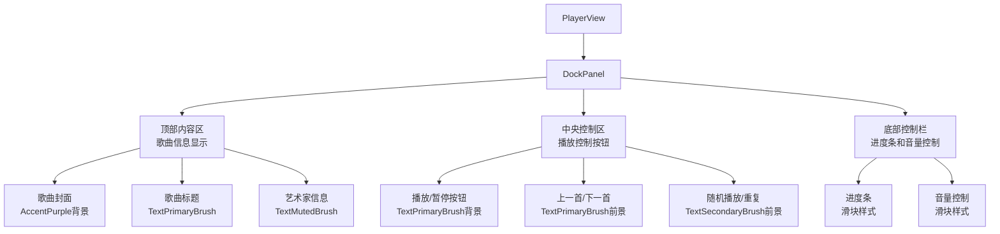

**图表来源**
- [PlayerView.axaml:21-165](file://Views/PlayerView.axaml#L21-L165)

**章节来源**
- [PlayerView.axaml:21-165](file://Views/PlayerView.axaml#L21-L165)

#### 设置界面样式

设置界面采用卡片式布局，分为多个功能模块：

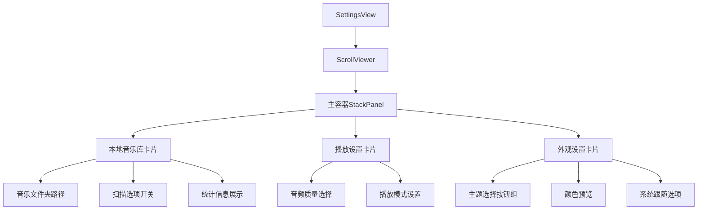

**图表来源**
- [SettingsView.axaml:14-207](file://Views/SettingsView.axaml#L14-L207)

**章节来源**
- [SettingsView.axaml:14-207](file://Views/SettingsView.axaml#L14-L207)

## 依赖关系分析

### 资源依赖图

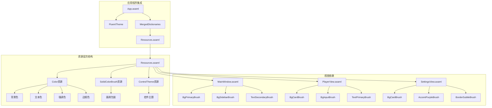

**图表来源**
- [Resources.axaml:1-67](file://Styles/Resources.axaml#L1-L67)
- [App.axaml:18-21](file://App.axaml#L18-L21)

### 样式继承关系

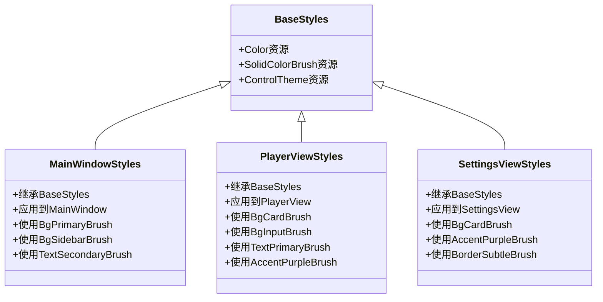

**图表来源**
- [MainWindow.axaml:11-21](file://Views/MainWindow.axaml#L11-L21)
- [PlayerView.axaml:24-56](file://Views/PlayerView.axaml#L24-L56)
- [SettingsView.axaml:30-34](file://Views/SettingsView.axaml#L30-L34)

**章节来源**
- [Resources.axaml:1-67](file://Styles/Resources.axaml#L1-L67)
- [MainWindow.axaml:11-21](file://Views/MainWindow.axaml#L11-L21)
- [PlayerView.axaml:24-56](file://Views/PlayerView.axaml#L24-L56)
- [SettingsView.axaml:30-34](file://Views/SettingsView.axaml#L30-L34)

## 性能考虑

### 资源缓存策略

系统通过以下方式优化样式性能：

1. **画刷缓存**: 所有颜色资源都预先包装为 SolidColorBrush，避免运行时重复创建
2. **模板复用**: ControlTheme 定义一次，多处复用
3. **静态资源引用**: 大多数情况下使用 StaticResource 而非 DynamicResource

### 渲染优化

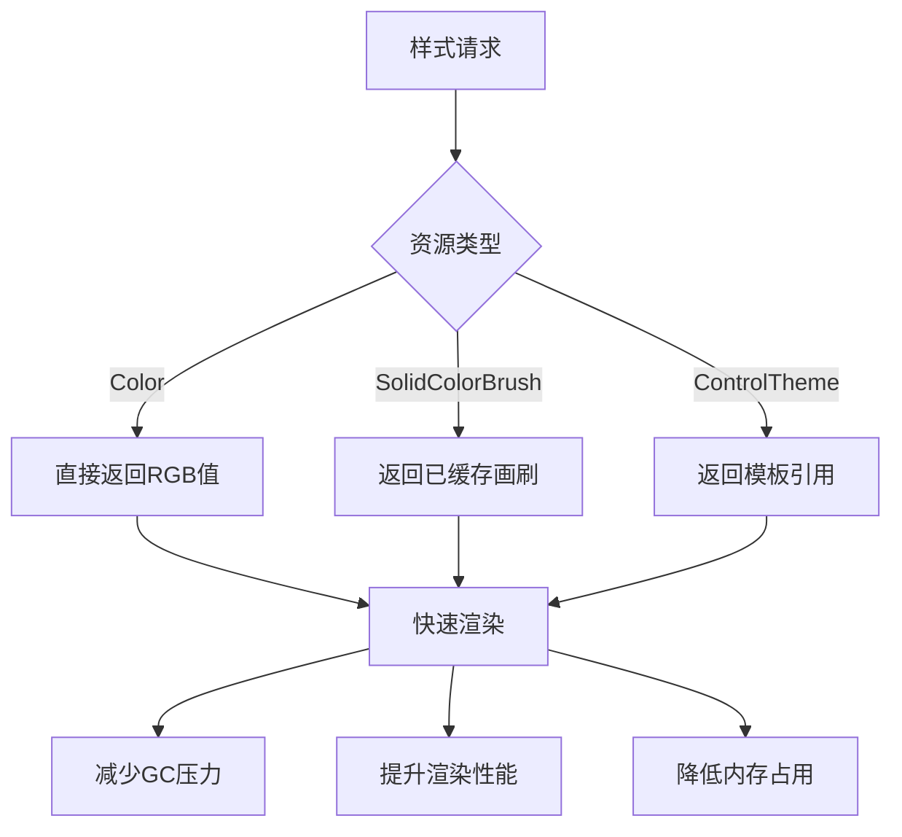

### 主题切换性能

主题切换时的性能优化措施：

1. **增量更新**: 只更新受影响的资源
2. **延迟加载**: 非关键资源延迟加载
3. **缓存策略**: 已应用的主题保持在内存中

## 故障排除指南

### 常见样式问题

#### 颜色不匹配问题

**症状**: 控件颜色与预期不符
**解决方案**:
1. 检查资源键名是否正确
2. 验证颜色值格式（#AARRGGBB）
3. 确认画刷资源是否正确定义

#### 主题切换失效

**症状**: 更换主题后界面无变化
**解决方案**:
1. 检查 FluentTheme 是否正确配置
2. 验证 RequestedThemeVariant 设置
3. 确认资源合并是否成功

#### 性能问题

**症状**: 界面响应缓慢或内存占用过高
**解决方案**:
1. 检查是否有过多的 DynamicResource 引用
2. 优化 ControlTheme 的复杂度
3. 减少不必要的样式重计算

**章节来源**
- [App.axaml:5-6](file://App.axaml#L5-L6)
- [Resources.axaml:1-67](file://Styles/Resources.axaml#L1-L67)

## 结论

LocalMusicPlayer 的样式和主题系统展现了现代桌面应用的最佳实践。通过分层的颜色资源管理、统一的命名规范和高效的资源缓存机制，系统实现了良好的视觉一致性和优秀的性能表现。

系统的主要优势包括：
- **一致性**: 统一的颜色方案和样式规范
- **可扩展性**: 易于添加新的颜色变体和控件样式
- **性能优化**: 通过资源缓存和模板复用提升渲染效率
- **用户体验**: 支持动态主题切换，适应不同用户偏好

未来可以考虑的改进方向：
- 添加更多主题变体支持
- 实现更精细的动画效果
- 优化移动端适配

## 附录

### 样式定制指南

#### 修改现有样式

1. **颜色调整**: 在 Resources.axaml 中修改对应颜色值
2. **尺寸调整**: 修改 ControlTheme 中的 CornerRadius 和 Padding
3. **状态效果**: 扩展现有的 :pointerover 和 :checked 状态

#### 创建新样式变体

1. **复制现有主题**: 基于现有 ControlTheme 创建新变体
2. **定义新颜色**: 在 Color 资源中添加新颜色
3. **创建画刷**: 为新颜色创建 SolidColorBrush 资源
4. **应用到控件**: 在视图中引用新样式

#### 跨平台适配策略

1. **系统主题跟随**: 使用 RequestedThemeVariant="Default"
2. **平台特定样式**: 为不同平台定义特定的样式变体
3. **响应式设计**: 根据屏幕尺寸调整样式参数