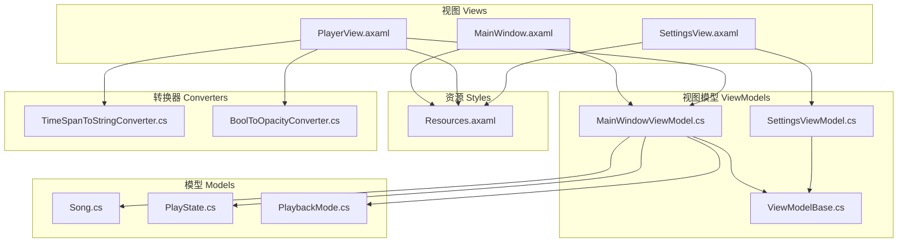
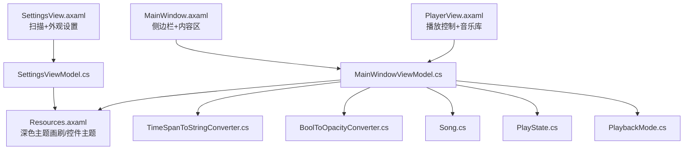
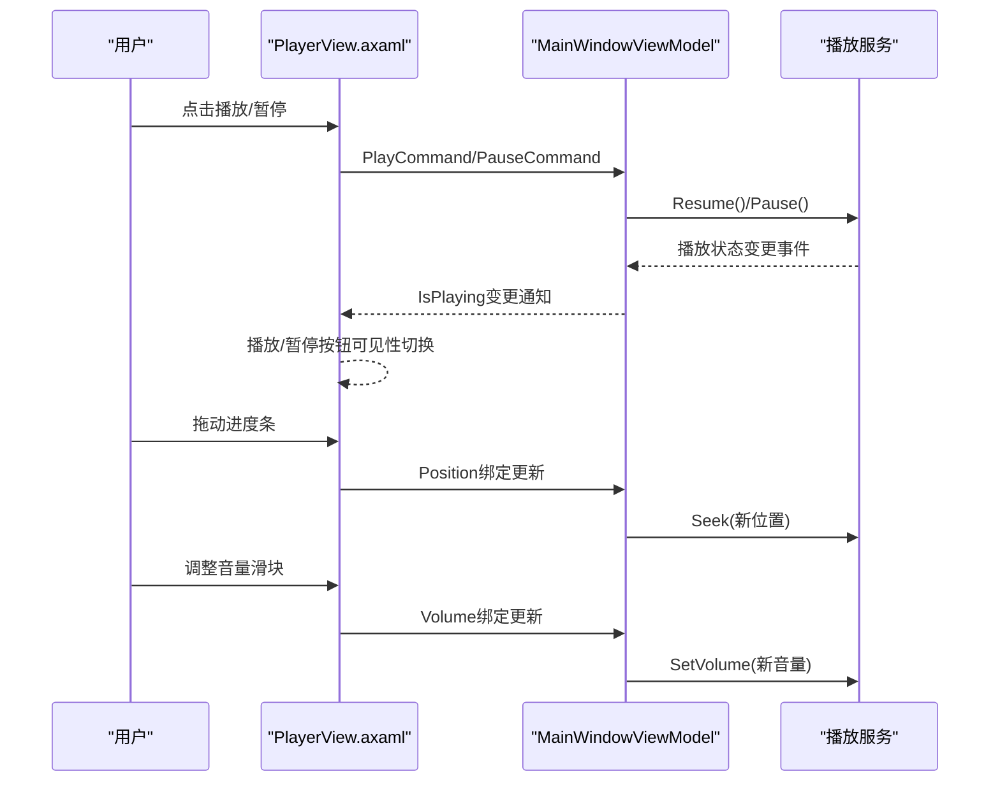
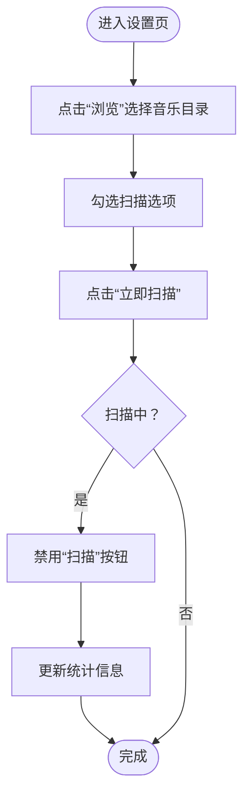
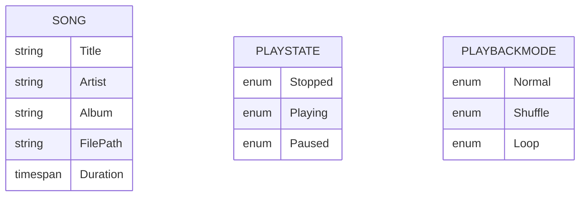
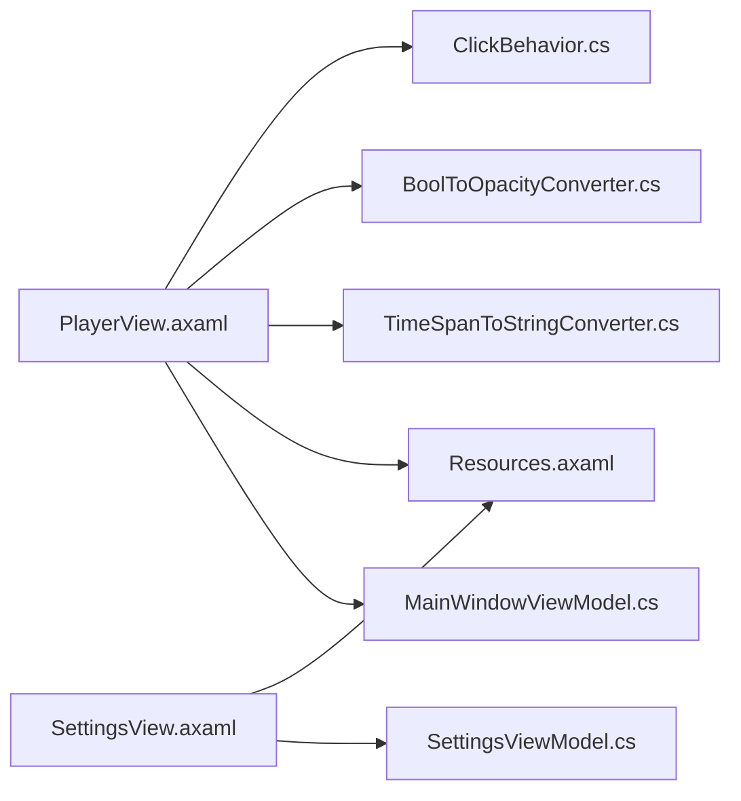

# 用户界面层

<cite>
**本文引用的文件**
- [MainWindow.axaml](file://Views/MainWindow.axaml)
- [MainWindow.axaml.cs](file://Views/MainWindow.axaml.cs)
- [PlayerView.axaml](file://Views/PlayerView.axaml)
- [PlayerView.axaml.cs](file://Views/PlayerView.axaml.cs)
- [SettingsView.axaml](file://Views/SettingsView.axaml)
- [SettingsView.axaml.cs](file://Views/SettingsView.axaml.cs)
- [MainWindowViewModel.cs](file://ViewModels/MainWindowViewModel.cs)
- [SettingsViewModel.cs](file://ViewModels/SettingsViewModel.cs)
- [ViewModelBase.cs](file://ViewModels/ViewModelBase.cs)
- [Resources.axaml](file://Styles/Resources.axaml)
- [TimeSpanToStringConverter.cs](file://Converters/TimeSpanToStringConverter.cs)
- [BoolToOpacityConverter.cs](file://Converters/BoolToOpacityConverter.cs)
- [Song.cs](file://Models/Song.cs)
- [PlayState.cs](file://Models/PlayState.cs)
- [PlaybackMode.cs](file://Models/PlaybackMode.cs)
- [ClickBehavior.cs](file://Behaviors/ClickBehavior.cs)
</cite>

## 目录
1. [简介](#简介)
2. [项目结构](#项目结构)
3. [核心组件](#核心组件)
4. [架构总览](#架构总览)
5. [详细组件分析](#详细组件分析)
6. [依赖关系分析](#依赖关系分析)
7. [性能考量](#性能考量)
8. [故障排查指南](#故障排查指南)
9. [结论](#结论)
10. [附录](#附录)

## 简介
本文件聚焦LocalMusicPlayer的用户界面层，系统化阐述Avalonia UI框架与XAML标记语言在项目中的应用方式，深入解析主界面（MainWindow）的布局与导航、播放器界面（PlayerView）的播放控制与进度/音量交互、设置界面（SettingsView）的配置项与参数调整，并总结深色主题系统的设计理念、颜色方案与样式定制策略。同时，提供响应式设计、无障碍访问与跨平台兼容性的实践建议，以及界面交互模式、动画与视觉反馈的实现要点。

## 项目结构
UI层采用“视图（Views）+ 视图模型（ViewModels）+ 资源（Styles）+ 转换器（Converters）+ 模型（Models）”的分层组织方式，遵循MVVM模式，通过XAML声明式布局与数据绑定实现清晰的职责分离与可维护性。

- 视图（Views）
  - MainWindow：应用主窗口，包含侧边栏导航与内容区域切换。
  - PlayerView：音乐库展示与播放控制面板。
  - SettingsView：扫描设置、音频质量与外观主题等配置界面。
- 视图模型（ViewModels）
  - MainWindowViewModel：负责页面切换、播放控制、搜索过滤、播放状态同步。
  - SettingsViewModel：负责扫描路径选择、扫描触发、统计信息更新与主题设置占位。
- 资源（Styles）
  - Resources.axaml：定义深色主题的颜色与画刷、控件主题样式。
- 转换器（Converters）
  - TimeSpanToStringConverter：时间格式转换。
  - BoolToOpacityConverter：布尔到不透明度映射。
- 模型（Models）
  - Song、PlayState、PlaybackMode：播放相关数据与状态枚举。



图表来源
- [MainWindow.axaml:1-78](file://Views/MainWindow.axaml#L1-L78)
- [PlayerView.axaml:1-271](file://Views/PlayerView.axaml#L1-L271)
- [SettingsView.axaml:1-372](file://Views/SettingsView.axaml#L1-L372)
- [MainWindowViewModel.cs:1-231](file://ViewModels/MainWindowViewModel.cs#L1-L231)
- [SettingsViewModel.cs:1-148](file://ViewModels/SettingsViewModel.cs#L1-L148)
- [Resources.axaml:1-67](file://Styles/Resources.axaml#L1-L67)
- [TimeSpanToStringConverter.cs:1-21](file://Converters/TimeSpanToStringConverter.cs#L1-L21)
- [BoolToOpacityConverter.cs:1-21](file://Converters/BoolToOpacityConverter.cs#L1-L21)
- [Song.cs:1-13](file://Models/Song.cs#L1-L13)
- [PlayState.cs:1-9](file://Models/PlayState.cs#L1-L9)
- [PlaybackMode.cs:1-9](file://Models/PlaybackMode.cs#L1-L9)

章节来源
- [MainWindow.axaml:1-78](file://Views/MainWindow.axaml#L1-L78)
- [PlayerView.axaml:1-271](file://Views/PlayerView.axaml#L1-L271)
- [SettingsView.axaml:1-372](file://Views/SettingsView.axaml#L1-L372)
- [MainWindowViewModel.cs:1-231](file://ViewModels/MainWindowViewModel.cs#L1-L231)
- [SettingsViewModel.cs:1-148](file://ViewModels/SettingsViewModel.cs#L1-L148)
- [Resources.axaml:1-67](file://Styles/Resources.axaml#L1-L67)

## 核心组件
- 主窗口（MainWindow）
  - 使用网格布局划分侧边栏与内容区；侧边栏包含图标按钮与导航按钮；内容区通过绑定当前页面进行动态切换。
  - 设计时DataContext用于设计器预览。
- 播放器界面（PlayerView）
  - 底部播放控制栏：播放/暂停、上一首/下一首、随机播放、循环模式、进度条与音量滑块。
  - 顶部音乐库区域：搜索框、歌曲列表与数据模板。
  - 使用转换器进行时间格式化与可见性/不透明度处理。
- 设置界面（SettingsView）
  - 扫描设置：音乐目录浏览、子文件夹包含、专辑封面下载、元数据自动检测。
  - 统计信息：歌曲数、专辑数、总大小、上次扫描时间。
  - 外观设置：主题（深色/浅色/自动）占位与按钮组。
- 视图模型
  - MainWindowViewModel：管理当前页面、播放命令、播放状态、位置与持续时间、音量与静音、搜索过滤。
  - SettingsViewModel：管理扫描路径、扫描选项、扫描触发与统计信息更新。
- 资源与样式
  - 深色主题：背景、文本、强调色、边框等画刷；控件主题（如侧边栏按钮）。
- 转换器
  - TimeSpanToStringConverter：将TimeSpan格式化为“mm:ss”。
  - BoolToOpacityConverter：布尔值映射到不透明度，用于弱化非活跃状态。

章节来源
- [MainWindow.axaml:1-78](file://Views/MainWindow.axaml#L1-L78)
- [PlayerView.axaml:1-271](file://Views/PlayerView.axaml#L1-L271)
- [SettingsView.axaml:1-372](file://Views/SettingsView.axaml#L1-L372)
- [MainWindowViewModel.cs:1-231](file://ViewModels/MainWindowViewModel.cs#L1-L231)
- [SettingsViewModel.cs:1-148](file://ViewModels/SettingsViewModel.cs#L1-L148)
- [Resources.axaml:1-67](file://Styles/Resources.axaml#L1-L67)
- [TimeSpanToStringConverter.cs:1-21](file://Converters/TimeSpanToStringConverter.cs#L1-L21)
- [BoolToOpacityConverter.cs:1-21](file://Converters/BoolToOpacityConverter.cs#L1-L21)

## 架构总览
UI层采用MVVM架构，视图通过XAML绑定到视图模型，视图模型通过服务与模型交互，资源字典统一提供主题与样式。



图表来源
- [MainWindow.axaml:1-78](file://Views/MainWindow.axaml#L1-L78)
- [PlayerView.axaml:1-271](file://Views/PlayerView.axaml#L1-L271)
- [SettingsView.axaml:1-372](file://Views/SettingsView.axaml#L1-L372)
- [MainWindowViewModel.cs:1-231](file://ViewModels/MainWindowViewModel.cs#L1-L231)
- [SettingsViewModel.cs:1-148](file://ViewModels/SettingsViewModel.cs#L1-L148)
- [Resources.axaml:1-67](file://Styles/Resources.axaml#L1-L67)
- [TimeSpanToStringConverter.cs:1-21](file://Converters/TimeSpanToStringConverter.cs#L1-L21)
- [BoolToOpacityConverter.cs:1-21](file://Converters/BoolToOpacityConverter.cs#L1-L21)
- [Song.cs:1-13](file://Models/Song.cs#L1-L13)
- [PlayState.cs:1-9](file://Models/PlayState.cs#L1-L9)
- [PlaybackMode.cs:1-9](file://Models/PlaybackMode.cs#L1-L9)

## 详细组件分析

### 主窗口（MainWindow）布局与导航
- 布局结构
  - 左侧边栏：顶部操作按钮、垂直排列的导航按钮集合，使用静态资源画刷统一风格。
  - 右侧内容区：通过ContentControl绑定CurrentPage，实现页面切换。
- 导航机制
  - 通过命令切换当前页面，实现从播放库页到设置页的无侵入切换。
- 设计时支持
  - Design.DataContext便于设计器预览。


图表来源
- [MainWindow.axaml:39-73](file://Views/MainWindow.axaml#L39-L73)
- [MainWindowViewModel.cs:132-139](file://ViewModels/MainWindowViewModel.cs#L132-L139)

章节来源
- [MainWindow.axaml:1-78](file://Views/MainWindow.axaml#L1-L78)
- [MainWindowViewModel.cs:1-231](file://ViewModels/MainWindowViewModel.cs#L1-L231)

### 播放器界面（PlayerView）播放控制与交互
- 播放控制
  - 随机播放、上一首、播放/暂停、下一首、重复模式，均通过命令绑定到视图模型。
  - 播放/暂停按钮根据IsPlaying状态可见性切换。
- 进度显示
  - Slider绑定Position与Duration，使用TimeSpanToStringConverter进行格式化显示。
- 音量控制
  - Slider绑定Volume，实时调用播放服务设置音量。
- 音乐库
  - 搜索框绑定SearchText，触发过滤逻辑；列表项使用数据模板展示标题、艺术家、专辑与时长。
- 转换器
  - TimeSpanToStringConverter：将TimeSpan格式化为“mm:ss”。
  - BoolToOpacityConverter：弱化非活跃状态的图标不透明度。



图表来源
- [PlayerView.axaml:66-162](file://Views/PlayerView.axaml#L66-L162)
- [MainWindowViewModel.cs:108-178](file://ViewModels/MainWindowViewModel.cs#L108-L178)
- [MainWindowViewModel.cs:209-215](file://ViewModels/MainWindowViewModel.cs#L209-L215)
- [TimeSpanToStringConverter.cs:1-21](file://Converters/TimeSpanToStringConverter.cs#L1-L21)
- [BoolToOpacityConverter.cs:1-21](file://Converters/BoolToOpacityConverter.cs#L1-L21)

章节来源
- [PlayerView.axaml:1-271](file://Views/PlayerView.axaml#L1-L271)
- [MainWindowViewModel.cs:1-231](file://ViewModels/MainWindowViewModel.cs#L1-L231)
- [TimeSpanToStringConverter.cs:1-21](file://Converters/TimeSpanToStringConverter.cs#L1-L21)
- [BoolToOpacityConverter.cs:1-21](file://Converters/BoolToOpacityConverter.cs#L1-L21)

### 设置界面（SettingsView）配置与参数
- 扫描设置
  - 音乐目录浏览：打开文件夹选择器，返回路径写入MusicFolderPath。
  - 扫描选项：包含子文件夹、下载专辑封面、自动检测元数据。
  - 扫描触发：ScanNowCommand异步执行扫描，期间禁用按钮并更新统计信息。
- 统计信息
  - 歌曲数、专辑数、总大小、上次扫描时间，扫描完成后刷新。
- 外观设置
  - 主题按钮组（深色/浅色/自动）占位，用于后续主题切换实现。



图表来源
- [SettingsView.axaml:63-205](file://Views/SettingsView.axaml#L63-L205)
- [SettingsViewModel.cs:116-145](file://ViewModels/SettingsViewModel.cs#L116-L145)

章节来源
- [SettingsView.axaml:1-372](file://Views/SettingsView.axaml#L1-L372)
- [SettingsViewModel.cs:1-148](file://ViewModels/SettingsViewModel.cs#L1-L148)

### 深色主题系统与样式定制
- 颜色体系
  - 定义主背景、侧栏、卡片、输入框、元素等背景色与文本色，形成统一的深色主题。
  - 强调色（如紫色）用于按钮与高亮元素。
- 画刷与控件主题
  - 将颜色映射为SolidColorBrush，供XAML直接引用。
  - 提供控件主题（如SidebarButtonTheme），定义悬停与选中态样式。
- 样式复用
  - 在各视图中通过静态资源引用画刷与主题，确保全局一致性。

```mermaid
classDiagram
class Resources_axaml {
"+BgPrimary<br/>+BgSidebar<br/>+BgCard<br/>+TextPrimary<br/>+AccentPurple"
"+BgPrimaryBrush<br/>+TextPrimaryBrush<br/>+AccentPurpleBrush"
"+SidebarButtonTheme"
}
class MainWindow_axaml
class PlayerView_axaml
class SettingsView_axaml
MainWindow_axaml --> Resources_axaml : "引用静态资源"
PlayerView_axaml --> Resources_axaml : "引用静态资源"
SettingsView_axaml --> Resources_axaml : "引用静态资源"
```

图表来源
- [Resources.axaml:1-67](file://Styles/Resources.axaml#L1-L67)
- [MainWindow.axaml:11-21](file://Views/MainWindow.axaml#L11-L21)
- [PlayerView.axaml:24-36](file://Views/PlayerView.axaml#L24-L36)
- [SettingsView.axaml:30-40](file://Views/SettingsView.axaml#L30-L40)

章节来源
- [Resources.axaml:1-67](file://Styles/Resources.axaml#L1-L67)
- [MainWindow.axaml:1-78](file://Views/MainWindow.axaml#L1-L78)
- [PlayerView.axaml:1-271](file://Views/PlayerView.axaml#L1-L271)
- [SettingsView.axaml:1-372](file://Views/SettingsView.axaml#L1-L372)

### 数据模型与状态
- Song：歌曲元数据（标题、艺术家、专辑、文件路径、时长）。
- PlayState：播放状态（停止、播放、暂停）。
- PlaybackMode：播放模式（普通、随机、单曲循环）。



图表来源
- [Song.cs:1-13](file://Models/Song.cs#L1-L13)
- [PlayState.cs:1-9](file://Models/PlayState.cs#L1-L9)
- [PlaybackMode.cs:1-9](file://Models/PlaybackMode.cs#L1-L9)

章节来源
- [Song.cs:1-13](file://Models/Song.cs#L1-L13)
- [PlayState.cs:1-9](file://Models/PlayState.cs#L1-L9)
- [PlaybackMode.cs:1-9](file://Models/PlaybackMode.cs#L1-L9)

## 依赖关系分析
- 视图与视图模型
  - PlayerView与MainWindowViewModel双向绑定：播放状态、位置、音量、当前歌曲、搜索文本。
  - SettingsView与SettingsViewModel绑定：扫描路径、选项、统计信息。
- 资源依赖
  - 所有视图均依赖Resources.axaml提供的画刷与控件主题。
- 转换器依赖
  - PlayerView依赖TimeSpanToStringConverter与BoolToOpacityConverter进行UI显示与交互反馈。
- 行为扩展点
  - ClickBehavior作为TemplatedControl扩展点，可用于自定义交互行为（当前未在UI中直接使用）。



图表来源
- [PlayerView.axaml:1-271](file://Views/PlayerView.axaml#L1-L271)
- [SettingsView.axaml:1-372](file://Views/SettingsView.axaml#L1-L372)
- [MainWindowViewModel.cs:1-231](file://ViewModels/MainWindowViewModel.cs#L1-L231)
- [SettingsViewModel.cs:1-148](file://ViewModels/SettingsViewModel.cs#L1-L148)
- [Resources.axaml:1-67](file://Styles/Resources.axaml#L1-L67)
- [TimeSpanToStringConverter.cs:1-21](file://Converters/TimeSpanToStringConverter.cs#L1-L21)
- [BoolToOpacityConverter.cs:1-21](file://Converters/BoolToOpacityConverter.cs#L1-L21)
- [ClickBehavior.cs:1-17](file://Behaviors/ClickBehavior.cs#L1-L17)

章节来源
- [PlayerView.axaml:1-271](file://Views/PlayerView.axaml#L1-L271)
- [SettingsView.axaml:1-372](file://Views/SettingsView.axaml#L1-L372)
- [MainWindowViewModel.cs:1-231](file://ViewModels/MainWindowViewModel.cs#L1-L231)
- [SettingsViewModel.cs:1-148](file://ViewModels/SettingsViewModel.cs#L1-L148)
- [Resources.axaml:1-67](file://Styles/Resources.axaml#L1-L67)
- [TimeSpanToStringConverter.cs:1-21](file://Converters/TimeSpanToStringConverter.cs#L1-L21)
- [BoolToOpacityConverter.cs:1-21](file://Converters/BoolToOpacityConverter.cs#L1-L21)
- [ClickBehavior.cs:1-17](file://Behaviors/ClickBehavior.cs#L1-L17)

## 性能考量
- 绑定与更新频率
  - 播放位置与持续时间通过定时器周期性更新，建议在播放状态变化或UI线程调度器上进行订阅，避免频繁GC与UI抖动。
- 列表渲染
  - 歌曲列表使用数据模板与绑定，建议对大数据集启用虚拟化与延迟加载，减少绘制开销。
- 资源复用
  - 静态资源与画刷应集中管理，避免重复实例化导致内存压力。
- 转换器
  - 转换器逻辑简单且无副作用，但需避免在转换过程中进行昂贵计算。

## 故障排查指南
- 播放控制无效
  - 检查命令绑定是否正确，确认视图模型命令初始化顺序与播放服务可用性。
  - 关注播放状态变更事件与IsPlaying绑定是否生效。
- 进度条不更新
  - 确认定时器订阅与主线程调度器设置，检查Position与Duration绑定是否同步。
- 音量调节无响应
  - 检查Volume绑定与播放服务SetVolume调用链路。
- 设置页扫描失败
  - 确认音乐目录路径非空，文件夹选择器返回值处理，扫描过程中的禁用状态与统计信息刷新。
- 主题样式异常
  - 检查静态资源键名拼写与引用，确认控件主题Selector匹配条件。

章节来源
- [MainWindowViewModel.cs:141-178](file://ViewModels/MainWindowViewModel.cs#L141-L178)
- [MainWindowViewModel.cs:209-215](file://ViewModels/MainWindowViewModel.cs#L209-L215)
- [SettingsViewModel.cs:133-145](file://ViewModels/SettingsViewModel.cs#L133-L145)
- [Resources.axaml:1-67](file://Styles/Resources.axaml#L1-L67)

## 结论
本UI层以Avalonia与XAML为核心，结合MVVM模式实现了清晰的职责分离与良好的可维护性。深色主题通过资源字典集中管理，配合控件主题提升了视觉一致性。播放器界面提供了完整的播放控制与交互反馈，设置界面覆盖了扫描与外观配置的关键需求。未来可在主题切换、动画与无障碍访问方面进一步增强，以提升跨平台体验与可访问性。

## 附录
- 响应式设计建议
  - 使用相对尺寸与自适应列/行定义，确保在不同分辨率下保持良好布局。
- 无障碍访问
  - 为按钮与控件提供可读名称与描述，确保键盘导航与屏幕阅读器友好。
- 动画与视觉反馈
  - 可引入轻量过渡动画（如按钮悬停、切换页面）提升交互质感，注意性能与电池消耗平衡。