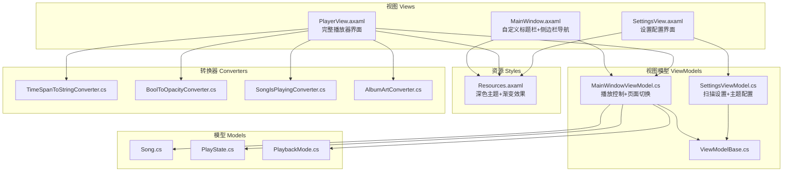
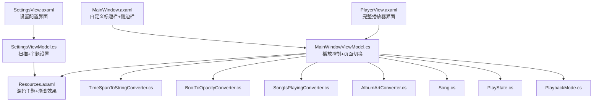
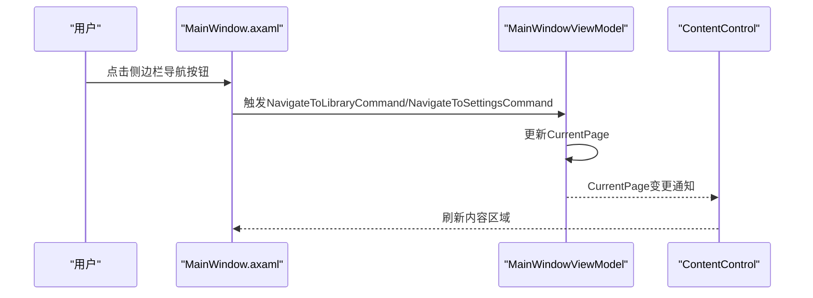
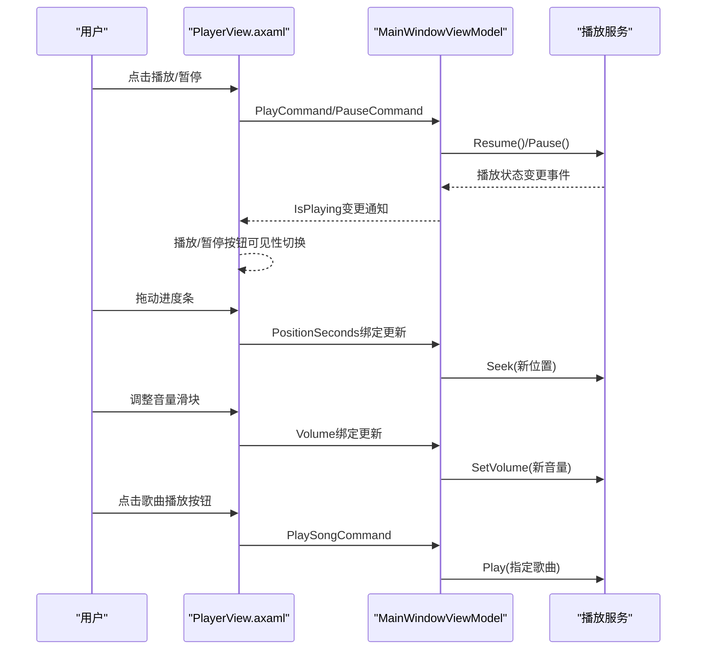
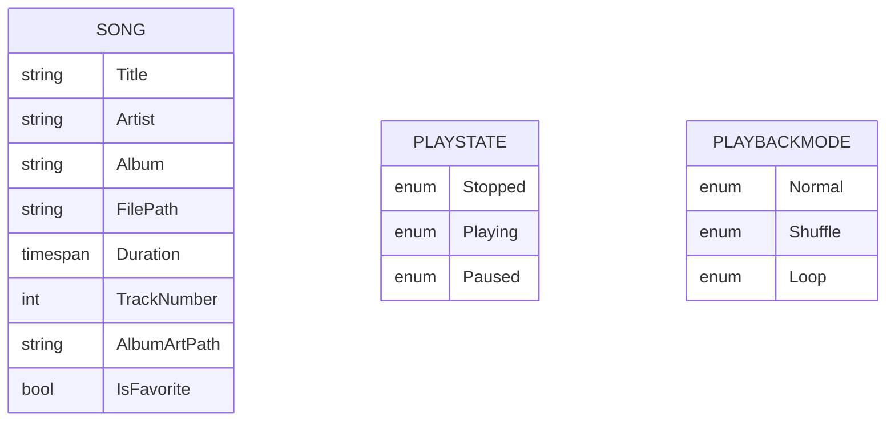
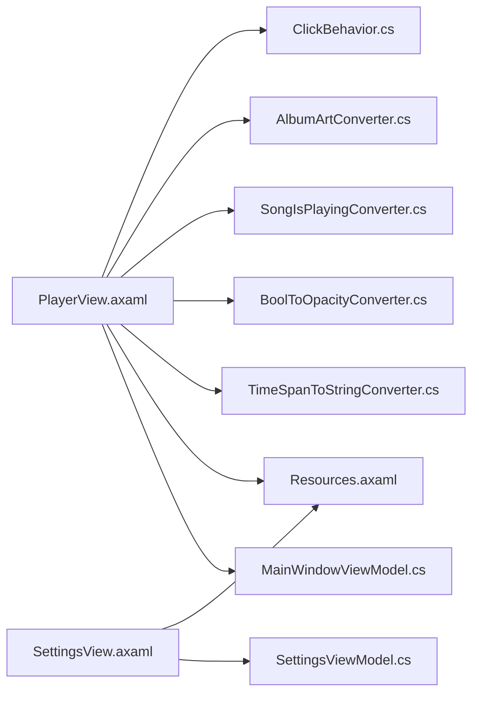

# 用户界面层

<cite>
**本文档引用的文件**
- [MainWindow.axaml](file://Views/MainWindow.axaml)
- [MainWindow.axaml.cs](file://Views/MainWindow.axaml.cs)
- [PlayerView.axaml](file://Views/PlayerView.axaml)
- [PlayerView.axaml.cs](file://Views/PlayerView.axaml.cs)
- [SettingsView.axaml](file://Views/SettingsView.axaml)
- [SettingsView.axaml.cs](file://Views/SettingsView.axaml.cs)
- [MainWindowViewModel.cs](file://ViewModels/MainWindowViewModel.cs)
- [SettingsViewModel.cs](file://ViewModels/SettingsViewModel.cs)
- [ViewModelBase.cs](file://ViewModels/ViewModelBase.cs)
- [Resources.axaml](file://Styles/Resources.axaml)
- [TimeSpanToStringConverter.cs](file://Converters/TimeSpanToStringConverter.cs)
- [BoolToOpacityConverter.cs](file://Converters/BoolToOpacityConverter.cs)
- [SongIsPlayingConverter.cs](file://Converters/SongIsPlayingConverter.cs)
- [AlbumArtConverter.cs](file://Converters/AlbumArtConverter.cs)
- [Song.cs](file://Models/Song.cs)
- [PlayState.cs](file://Models/PlayState.cs)
- [PlaybackMode.cs](file://Models/PlaybackMode.cs)
- [ClickBehavior.cs](file://Behaviors/ClickBehavior.cs)
</cite>

## 更新摘要
**所做更改**
- 新增PlayerView和SettingsView的完整文档分析
- 更新MainWindow.axaml的增强功能说明
- 扩展样式系统的详细说明
- 增加新的转换器和颜色方案分析
- 完善播放器界面的交互模式说明

## 目录
1. [简介](#简介)
2. [项目结构](#项目结构)
3. [核心组件](#核心组件)
4. [架构总览](#架构总览)
5. [详细组件分析](#详细组件分析)
6. [依赖关系分析](#依赖关系分析)
7. [性能考量](#性能考量)
8. [故障排查指南](#故障排查指南)
9. [结论](#结论)
10. [附录](#附录)

## 简介
本文件聚焦LocalMusicPlayer的用户界面层，系统化阐述Avalonia UI框架与XAML标记语言在项目中的应用方式，深入解析主界面（MainWindow）的布局与导航、播放器界面（PlayerView）的播放控制与进度/音量交互、设置界面（SettingsView）的配置项与参数调整，并总结深色主题系统的设计理念、颜色方案与样式定制策略。同时，提供响应式设计、无障碍访问与跨平台兼容性的实践建议，以及界面交互模式、动画与视觉反馈的实现要点。

## 项目结构
UI层采用"视图（Views）+ 视图模型（ViewModels）+ 资源（Styles）+ 转换器（Converters）+ 模型（Models）"的分层组织方式，遵循MVVM模式，通过XAML声明式布局与数据绑定实现清晰的职责分离与可维护性。

- 视图（Views）
  - MainWindow：应用主窗口，包含自定义标题栏与侧边栏导航，支持页面切换。
  - PlayerView：完整的音乐库展示与播放控制面板，包含播放列表、搜索、进度控制和底部播放栏。
  - SettingsView：扫描设置、音频质量与外观主题等配置界面，采用卡片式布局。
- 视图模型（ViewModels）
  - MainWindowViewModel：负责页面切换、播放控制、搜索过滤、播放状态同步和统计信息更新。
  - SettingsViewModel：负责扫描路径选择、扫描触发、统计信息更新与主题设置。
- 资源（Styles）
  - Resources.axaml：定义深色主题的颜色与画刷、控件主题样式，包含新增的颜色变量和渐变效果。
- 转换器（Converters）
  - TimeSpanToStringConverter：时间格式转换。
  - BoolToOpacityConverter：布尔到不透明度映射。
  - SongIsPlayingConverter：歌曲播放状态判断与视觉反馈。
  - AlbumArtConverter：专辑封面加载与默认封面处理。
- 模型（Models）
  - Song、PlayState、PlaybackMode：播放相关数据与状态枚举。



**图表来源**
- [MainWindow.axaml:1-210](file://Views/MainWindow.axaml#L1-L210)
- [PlayerView.axaml:1-718](file://Views/PlayerView.axaml#L1-L718)
- [SettingsView.axaml:1-641](file://Views/SettingsView.axaml#L1-L641)
- [MainWindowViewModel.cs:1-324](file://ViewModels/MainWindowViewModel.cs#L1-L324)
- [SettingsViewModel.cs:1-178](file://ViewModels/SettingsViewModel.cs#L1-L178)
- [Resources.axaml:1-131](file://Styles/Resources.axaml#L1-L131)

**章节来源**
- [MainWindow.axaml:1-210](file://Views/MainWindow.axaml#L1-L210)
- [PlayerView.axaml:1-718](file://Views/PlayerView.axaml#L1-L718)
- [SettingsView.axaml:1-641](file://Views/SettingsView.axaml#L1-L641)
- [MainWindowViewModel.cs:1-324](file://ViewModels/MainWindowViewModel.cs#L1-L324)
- [SettingsViewModel.cs:1-178](file://ViewModels/SettingsViewModel.cs#L1-L178)
- [Resources.axaml:1-131](file://Styles/Resources.axaml#L1-L131)

## 核心组件
- 主窗口（MainWindow）
  - 自定义标题栏：包含应用Logo、窗口控制按钮（最小化、最大化/还原、关闭），支持拖拽移动窗口。
  - 侧边栏导航：顶部Logo、中部导航按钮（播放列表、设置）、底部活跃状态指示。
  - 内容区域：通过ContentControl绑定CurrentPage实现页面切换。
- 播放器界面（PlayerView）
  - 顶部音乐库区域：标题、统计信息、搜索框、过滤按钮、视图切换按钮。
  - 歌曲列表表格：包含序号、标题、艺术家、专辑、时长、播放控制和收藏按钮。
  - 底部播放控制栏：专辑封面、歌曲信息、控制按钮、进度条、音量控制。
  - 自定义样式：渐变背景、圆角边框、阴影效果。
- 设置界面（SettingsView）
  - 本地音乐库卡片：音乐文件夹路径选择、扫描选项（包含子文件夹、下载专辑封面、自动检测元数据）。
  - 播放设置卡片：音频质量选择（标准、高质量、无损）。
  - 外观设置卡片：主题选择（深色、浅色、自动）。
  - 关于信息卡片：版本、构建日期、开发者信息。
- 视图模型
  - MainWindowViewModel：管理当前页面、播放命令、播放状态、位置与持续时间、音量与静音、搜索过滤、统计信息。
  - SettingsViewModel：管理扫描路径、扫描选项、扫描触发、统计信息更新、音频质量和主题设置。
- 资源与样式
  - 深色主题：背景、文本、强调色、边框等画刷；新增渐变效果和阴影。
  - 控件主题：侧边栏按钮、标题栏按钮、播放器样式。
- 转换器
  - TimeSpanToStringConverter：将TimeSpan格式化为"mm:ss"。
  - BoolToOpacityConverter：布尔值映射到不透明度。
  - SongIsPlayingConverter：多值转换器，支持背景色、边框色和可见性判断。
  - AlbumArtConverter：专辑封面加载与默认封面处理。

**章节来源**
- [MainWindow.axaml:1-210](file://Views/MainWindow.axaml#L1-L210)
- [PlayerView.axaml:1-718](file://Views/PlayerView.axaml#L1-L718)
- [SettingsView.axaml:1-641](file://Views/SettingsView.axaml#L1-L641)
- [MainWindowViewModel.cs:1-324](file://ViewModels/MainWindowViewModel.cs#L1-L324)
- [SettingsViewModel.cs:1-178](file://ViewModels/SettingsViewModel.cs#L1-L178)
- [Resources.axaml:1-131](file://Styles/Resources.axaml#L1-L131)
- [TimeSpanToStringConverter.cs:1-21](file://Converters/TimeSpanToStringConverter.cs#L1-L21)
- [BoolToOpacityConverter.cs:1-21](file://Converters/BoolToOpacityConverter.cs#L1-L21)
- [SongIsPlayingConverter.cs:1-53](file://Converters/SongIsPlayingConverter.cs#L1-L53)
- [AlbumArtConverter.cs:1-46](file://Converters/AlbumArtConverter.cs#L1-L46)

## 架构总览
UI层采用MVVM架构，视图通过XAML绑定到视图模型，视图模型通过服务与模型交互，资源字典统一提供主题与样式。



**图表来源**
- [MainWindow.axaml:1-210](file://Views/MainWindow.axaml#L1-L210)
- [PlayerView.axaml:1-718](file://Views/PlayerView.axaml#L1-L718)
- [SettingsView.axaml:1-641](file://Views/SettingsView.axaml#L1-L641)
- [MainWindowViewModel.cs:1-324](file://ViewModels/MainWindowViewModel.cs#L1-L324)
- [SettingsViewModel.cs:1-178](file://ViewModels/SettingsViewModel.cs#L1-L178)
- [Resources.axaml:1-131](file://Styles/Resources.axaml#L1-L131)
- [TimeSpanToStringConverter.cs:1-21](file://Converters/TimeSpanToStringConverter.cs#L1-L21)
- [BoolToOpacityConverter.cs:1-21](file://Converters/BoolToOpacityConverter.cs#L1-L21)
- [SongIsPlayingConverter.cs:1-53](file://Converters/SongIsPlayingConverter.cs#L1-L53)
- [AlbumArtConverter.cs:1-46](file://Converters/AlbumArtConverter.cs#L1-L46)

## 详细组件分析

### 主窗口（MainWindow）布局与导航
- 布局结构
  - 自定义标题栏：包含应用Logo、窗口控制按钮（最小化、最大化/还原、关闭），支持拖拽移动窗口。
  - 侧边栏导航：顶部Logo区域、中部导航按钮（播放列表、设置）、底部活跃导航按钮。
  - 内容区域：通过ContentControl绑定CurrentPage，实现页面切换。
- 导航机制
  - 通过命令切换当前页面，实现从播放库页到设置页的无侵入切换。
  - 活跃导航状态通过按钮样式和阴影效果直观显示。
- 设计时支持
  - Design.DataContext便于设计器预览。



**图表来源**
- [MainWindow.axaml:147-178](file://Views/MainWindow.axaml#L147-L178)
- [MainWindowViewModel.cs:189-190](file://ViewModels/MainWindowViewModel.cs#L189-L190)

**章节来源**
- [MainWindow.axaml:1-210](file://Views/MainWindow.axaml#L1-L210)
- [MainWindowViewModel.cs:1-324](file://ViewModels/MainWindowViewModel.cs#L1-L324)

### 播放器界面（PlayerView）播放控制与交互
- 播放控制
  - 随机播放、上一首、播放/暂停、下一首、重复模式，均通过命令绑定到视图模型。
  - 播放/暂停按钮根据IsPlaying状态可见性切换。
  - 播放列表中的每首歌曲都有独立的播放/暂停按钮。
- 进度显示
  - Slider绑定Position与Duration，使用TimeSpanToStringConverter进行格式化显示。
  - 自定义渐变进度条样式，支持视觉反馈。
- 音量控制
  - Slider绑定Volume，实时调用播放服务设置音量。
  - 静音/取消静音按钮，支持音量滑块的双态显示。
- 音乐库
  - 搜索框绑定SearchText，触发过滤逻辑；列表项使用数据模板展示标题、艺术家、专辑与时长。
  - 支持收藏功能，爱心图标显示/隐藏。
- 转换器
  - TimeSpanToStringConverter：将TimeSpan格式化为"mm:ss"。
  - BoolToOpacityConverter：弱化非活跃状态的图标不透明度。
  - SongIsPlayingConverter：多值转换器，支持背景色、边框色和可见性判断。
  - AlbumArtConverter：专辑封面加载与默认封面处理。



**图表来源**
- [PlayerView.axaml:567-621](file://Views/PlayerView.axaml#L567-L621)
- [PlayerView.axaml:632-646](file://Views/PlayerView.axaml#L632-L646)
- [PlayerView.axaml:695-700](file://Views/PlayerView.axaml#L695-L700)
- [MainWindowViewModel.cs:152-163](file://ViewModels/MainWindowViewModel.cs#L152-L163)
- [MainWindowViewModel.cs:230-246](file://ViewModels/MainWindowViewModel.cs#L230-L246)

**章节来源**
- [PlayerView.axaml:1-718](file://Views/PlayerView.axaml#L1-L718)
- [MainWindowViewModel.cs:1-324](file://ViewModels/MainWindowViewModel.cs#L1-L324)
- [TimeSpanToStringConverter.cs:1-21](file://Converters/TimeSpanToStringConverter.cs#L1-L21)
- [BoolToOpacityConverter.cs:1-21](file://Converters/BoolToOpacityConverter.cs#L1-L21)
- [SongIsPlayingConverter.cs:1-53](file://Converters/SongIsPlayingConverter.cs#L1-L53)
- [AlbumArtConverter.cs:1-46](file://Converters/AlbumArtConverter.cs#L1-L46)

### 设置界面（SettingsView）配置与参数
- 扫描设置
  - 音乐目录浏览：打开文件夹选择器，返回路径写入MusicFolderPath。
  - 扫描选项：包含子文件夹、下载专辑封面、自动检测元数据。
  - 扫描触发：ScanNowCommand异步执行扫描，期间禁用按钮并更新统计信息。
- 统计信息
  - 歌曲数、专辑数、总大小、上次扫描时间，扫描完成后刷新。
- 外观设置
  - 主题按钮组（深色/浅色/自动）占位，用于后续主题切换实现。
- 播放设置
  - 音频质量选择器：标准、高质量、无损三种模式。
- 关于信息
  - 版本、构建日期、开发者信息显示。

```mermaid
flowchart TD
Start(["进入设置页"]) --> Browse["点击"浏览"选择音乐目录"]
Browse --> ScanOpt["勾选扫描选项"]
ScanOpt --> ScanNow["点击"立即扫描"]
ScanNow --> Scanning{"扫描中？"}
Scanning --> |是| Disable["禁用"扫描"按钮"]
Disable --> UpdateStats["更新统计信息"]
UpdateStats --> Done(["完成"])
Scanning --> |否| Done
```

**图表来源**
- [SettingsView.axaml:99-203](file://Views/SettingsView.axaml#L99-L203)
- [SettingsViewModel.cs:148-166](file://ViewModels/SettingsViewModel.cs#L148-L166)

**章节来源**
- [SettingsView.axaml:1-641](file://Views/SettingsView.axaml#L1-L641)
- [SettingsViewModel.cs:1-178](file://ViewModels/SettingsViewModel.cs#L1-L178)

### 深色主题系统与样式定制
- 颜色体系
  - 定义主背景、侧栏、卡片、输入框、元素等背景色与文本色，形成统一的深色主题。
  - 强调色（如紫色）用于按钮与高亮元素。
  - 新增渐变色：紫色到粉色的渐变效果，用于播放按钮和进度条。
  - 新增颜色变量：半透明紫色、活动行背景、播放栏背景等。
- 画刷与控件主题
  - 将颜色映射为SolidColorBrush，供XAML直接引用。
  - 提供控件主题（如SidebarButtonTheme、TitleBarButtonTheme），定义悬停与选中态样式。
  - 新增标题栏按钮样式，支持最小化和关闭按钮的不同效果。
- 样式复用
  - 在各视图中通过静态资源引用画刷与主题，确保全局一致性。
  - 自定义Slider样式，支持渐变填充和圆角轨道。

```mermaid
classDiagram
class Resources_axaml {
"+BgPrimary<br/>+BgSidebar<br/>+BgCard<br/>+TextPrimary<br/>+AccentPurple"
"+BgPrimaryBrush<br/>+TextPrimaryBrush<br/>+AccentPurpleBrush"
"+SidebarButtonTheme<br/>+TitleBarButtonTheme<br/>+TitleBarCloseButtonTheme"
"+ProgressGradientBrush<br/>+SliderTrackBgBrush"
}
class MainWindow_axaml
class PlayerView_axaml
class SettingsView_axaml
MainWindow_axaml --> Resources_axaml : "引用静态资源"
PlayerView_axaml --> Resources_axaml : "引用静态资源"
SettingsView_axaml --> Resources_axaml : "引用静态资源"
```

**图表来源**
- [Resources.axaml:1-131](file://Styles/Resources.axaml#L1-L131)
- [MainWindow.axaml:11-14](file://Views/MainWindow.axaml#L11-L14)
- [PlayerView.axaml:22-36](file://Views/PlayerView.axaml#L22-L36)
- [SettingsView.axaml:14-20](file://Views/SettingsView.axaml#L14-L20)

**章节来源**
- [Resources.axaml:1-131](file://Styles/Resources.axaml#L1-L131)
- [MainWindow.axaml:1-210](file://Views/MainWindow.axaml#L1-L210)
- [PlayerView.axaml:1-718](file://Views/PlayerView.axaml#L1-L718)
- [SettingsView.axaml:1-641](file://Views/SettingsView.axaml#L1-L641)

### 数据模型与状态
- Song：歌曲元数据（标题、艺术家、专辑、文件路径、时长、音轨号、专辑封面路径、收藏状态）。
- PlayState：播放状态（停止、播放、暂停）。
- PlaybackMode：播放模式（普通、随机、单曲循环）。



**图表来源**
- [Song.cs:1-77](file://Models/Song.cs#L1-L77)
- [PlayState.cs:1-9](file://Models/PlayState.cs#L1-L9)
- [PlaybackMode.cs:1-9](file://Models/PlaybackMode.cs#L1-L9)

**章节来源**
- [Song.cs:1-77](file://Models/Song.cs#L1-L77)
- [PlayState.cs:1-9](file://Models/PlayState.cs#L1-L9)
- [PlaybackMode.cs:1-9](file://Models/PlaybackMode.cs#L1-L9)

## 依赖关系分析
- 视图与视图模型
  - PlayerView与MainWindowViewModel双向绑定：播放状态、位置、音量、当前歌曲、搜索文本。
  - SettingsView与SettingsViewModel绑定：扫描路径、选项、统计信息。
- 资源依赖
  - 所有视图均依赖Resources.axaml提供的画刷与控件主题。
- 转换器依赖
  - PlayerView依赖TimeSpanToStringConverter、BoolToOpacityConverter、SongIsPlayingConverter、AlbumArtConverter进行UI显示与交互反馈。
- 行为扩展点
  - ClickBehavior作为TemplatedControl扩展点，可用于自定义交互行为（当前未在UI中直接使用）。



**图表来源**
- [PlayerView.axaml:1-718](file://Views/PlayerView.axaml#L1-L718)
- [SettingsView.axaml:1-641](file://Views/SettingsView.axaml#L1-L641)
- [MainWindowViewModel.cs:1-324](file://ViewModels/MainWindowViewModel.cs#L1-L324)
- [SettingsViewModel.cs:1-178](file://ViewModels/SettingsViewModel.cs#L1-L178)
- [Resources.axaml:1-131](file://Styles/Resources.axaml#L1-L131)
- [TimeSpanToStringConverter.cs:1-21](file://Converters/TimeSpanToStringConverter.cs#L1-L21)
- [BoolToOpacityConverter.cs:1-21](file://Converters/BoolToOpacityConverter.cs#L1-L21)
- [SongIsPlayingConverter.cs:1-53](file://Converters/SongIsPlayingConverter.cs#L1-L53)
- [AlbumArtConverter.cs:1-46](file://Converters/AlbumArtConverter.cs#L1-L46)
- [ClickBehavior.cs:1-17](file://Behaviors/ClickBehavior.cs#L1-L17)

**章节来源**
- [PlayerView.axaml:1-718](file://Views/PlayerView.axaml#L1-L718)
- [SettingsView.axaml:1-641](file://Views/SettingsView.axaml#L1-L641)
- [MainWindowViewModel.cs:1-324](file://ViewModels/MainWindowViewModel.cs#L1-L324)
- [SettingsViewModel.cs:1-178](file://ViewModels/SettingsViewModel.cs#L1-L178)
- [Resources.axaml:1-131](file://Styles/Resources.axaml#L1-L131)
- [TimeSpanToStringConverter.cs:1-21](file://Converters/TimeSpanToStringConverter.cs#L1-L21)
- [BoolToOpacityConverter.cs:1-21](file://Converters/BoolToOpacityConverter.cs#L1-L21)
- [SongIsPlayingConverter.cs:1-53](file://Converters/SongIsPlayingConverter.cs#L1-L53)
- [AlbumArtConverter.cs:1-46](file://Converters/AlbumArtConverter.cs#L1-L46)
- [ClickBehavior.cs:1-17](file://Behaviors/ClickBehavior.cs#L1-L17)

## 性能考量
- 绑定与更新频率
  - 播放位置与持续时间通过定时器周期性更新，建议在播放状态变化或UI线程调度器上进行订阅，避免频繁GC与UI抖动。
  - 歌曲列表过滤使用LINQ查询，大数据集时建议优化查询性能。
- 列表渲染
  - 歌曲列表使用数据模板与绑定，建议对大数据集启用虚拟化与延迟加载，减少绘制开销。
  - 播放状态转换器支持多值绑定，注意避免在转换过程中进行昂贵计算。
- 资源复用
  - 静态资源与画刷应集中管理，避免重复实例化导致内存压力。
  - 渐变画刷和阴影效果应在需要时才创建，避免不必要的资源消耗。
- 转换器
  - 转换器逻辑简单且无副作用，但需避免在转换过程中进行昂贵计算。
  - AlbumArtConverter包含文件I/O操作，建议添加缓存机制。

## 故障排查指南
- 播放控制无效
  - 检查命令绑定是否正确，确认视图模型命令初始化顺序与播放服务可用性。
  - 关注播放状态变更事件与IsPlaying绑定是否生效。
- 进度条不更新
  - 确认定时器订阅与主线程调度器设置，检查Position与Duration绑定是否同步。
- 音量调节无响应
  - 检查Volume绑定与播放服务SetVolume调用链路。
- 设置页扫描失败
  - 确认音乐目录路径非空，文件夹选择器返回值处理，扫描过程中的禁用状态与统计信息刷新。
- 主题样式异常
  - 检查静态资源键名拼写与引用，确认控件主题Selector匹配条件。
- 播放列表显示问题
  - 检查SongIsPlayingConverter的多值绑定参数，确认当前歌曲和播放状态的正确传递。
- 专辑封面加载失败
  - 检查AlbumArtConverter的文件路径和默认封面资源，确认文件存在性和权限。

**章节来源**
- [MainWindowViewModel.cs:152-163](file://ViewModels/MainWindowViewModel.cs#L152-L163)
- [MainWindowViewModel.cs:268-278](file://ViewModels/MainWindowViewModel.cs#L268-L278)
- [SettingsViewModel.cs:148-166](file://ViewModels/SettingsViewModel.cs#L148-L166)
- [Resources.axaml:1-131](file://Styles/Resources.axaml#L1-L131)
- [SongIsPlayingConverter.cs:16-51](file://Converters/SongIsPlayingConverter.cs#L16-L51)
- [AlbumArtConverter.cs:11-40](file://Converters/AlbumArtConverter.cs#L11-L40)

## 结论
本UI层以Avalonia与XAML为核心，结合MVVM模式实现了清晰的职责分离与良好的可维护性。深色主题通过资源字典集中管理，配合新增的渐变效果和阴影增强了视觉层次感。播放器界面提供了完整的播放控制与交互反馈，包括详细的歌曲列表管理和底部播放栏。设置界面覆盖了扫描与外观配置的关键需求，采用卡片式布局提升了用户体验。未来可在主题切换、动画与无障碍访问方面进一步增强，以提升跨平台体验与可访问性。

## 附录
- 响应式设计建议
  - 使用相对尺寸与自适应列/行定义，确保在不同分辨率下保持良好布局。
  - 考虑触摸屏优化，增大按钮尺寸和间距。
- 无障碍访问
  - 为按钮与控件提供可读名称与描述，确保键盘导航与屏幕阅读器友好。
  - 考虑颜色对比度要求，确保文本可读性。
- 动画与视觉反馈
  - 可引入轻量过渡动画（如按钮悬停、切换页面）提升交互质感，注意性能与电池消耗平衡。
  - 利用现有的渐变和阴影效果增强视觉层次，但要避免过度使用影响性能。