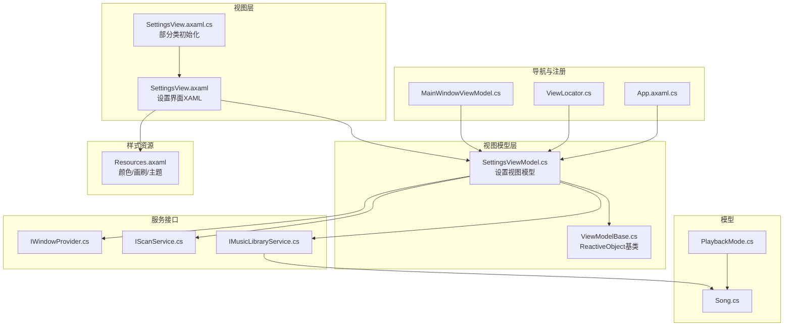
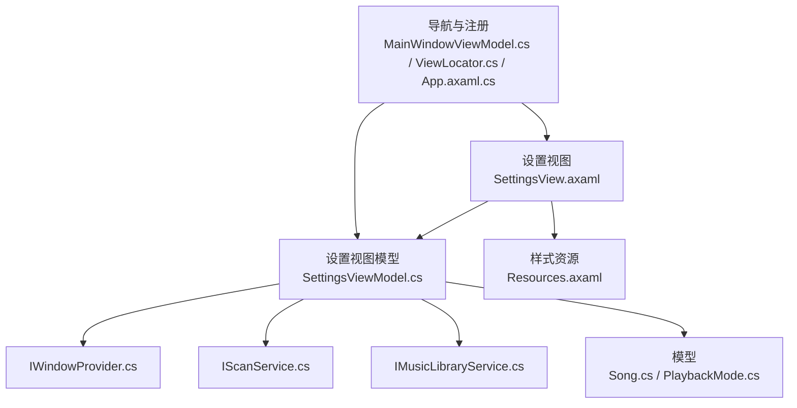
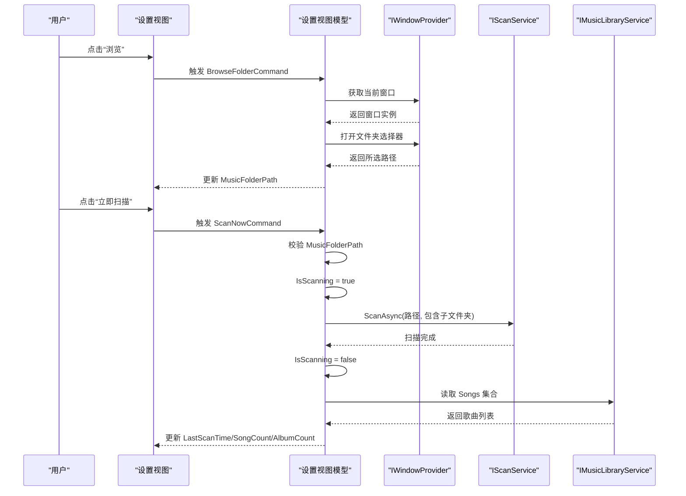
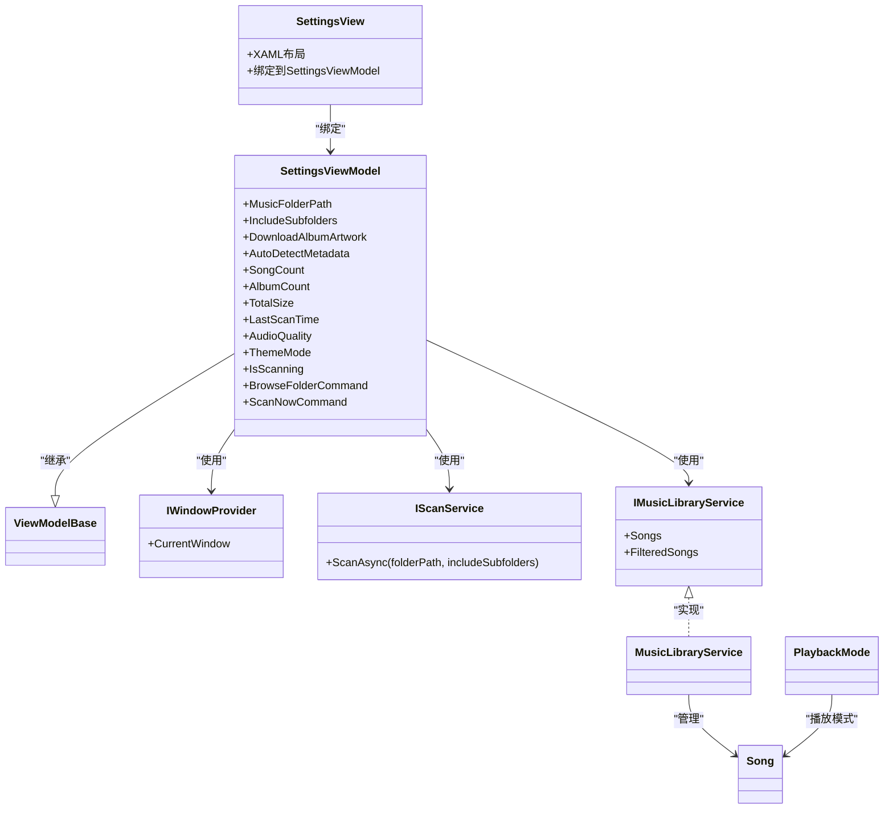

# 设置界面

<cite>
**本文引用的文件**
- [SettingsView.axaml](file://Views/SettingsView.axaml)
- [SettingsView.axaml.cs](file://Views/SettingsView.axaml.cs)
- [SettingsViewModel.cs](file://ViewModels/SettingsViewModel.cs)
- [ViewModelBase.cs](file://ViewModels/ViewModelBase.cs)
- [Resources.axaml](file://Styles/Resources.axaml)
- [IWindowProvider.cs](file://Services/IWindowProvider.cs)
- [IScanService.cs](file://Services/IScanService.cs)
- [IMusicLibraryService.cs](file://Services/IMusicLibraryService.cs)
- [MusicLibraryService.cs](file://Services/MusicLibraryService.cs)
- [IMusicPlayerService.cs](file://Services/IMusicPlayerService.cs)
- [PlaybackMode.cs](file://Models/PlaybackMode.cs)
- [Song.cs](file://Models/Song.cs)
- [MainWindowViewModel.cs](file://ViewModels/MainWindowViewModel.cs)
- [ViewLocator.cs](file://ViewLocator.cs)
- [App.axaml.cs](file://App.axaml.cs)
</cite>

## 目录
1. [简介](#简介)
2. [项目结构](#项目结构)
3. [核心组件](#核心组件)
4. [架构总览](#架构总览)
5. [详细组件分析](#详细组件分析)
6. [依赖分析](#依赖分析)
7. [性能考虑](#性能考虑)
8. [故障排除指南](#故障排除指南)
9. [结论](#结论)
10. [附录](#附录)

## 简介
本文件为 LocalMusicPlayer 的“设置界面”技术文档，聚焦于设置页面的 XAML 布局设计、设置项实现（音乐库扫描、播放质量、外观主题）、与 SettingsViewModel 的绑定关系、数据验证与实时预览、持久化存储机制、用户体验设计、可访问性与多语言适配、以及跨平台兼容性建议。文档以实际源码为依据，避免臆测，提供面向开发与非技术读者的双层解读。

## 项目结构
设置界面由视图与视图模型组成，并通过样式资源统一视觉风格。其关键文件与职责如下：
- 视图层：SettingsView.axaml（XAML 布局）、SettingsView.axaml.cs（部分类初始化）
- 视图模型层：SettingsViewModel.cs（状态与命令）、ViewModelBase.cs（ReactiveObject 基类）
- 样式资源：Resources.axaml（颜色与画刷、控件主题）
- 服务接口：IWindowProvider.cs、IScanService.cs、IMusicLibraryService.cs
- 模型：Song.cs、PlaybackMode.cs
- 导航与注册：MainWindowViewModel.cs、ViewLocator.cs、App.axaml.cs

图表来源
- [SettingsView.axaml:1-372](file://Views/SettingsView.axaml#L1-L372)
- [SettingsView.axaml.cs:1-12](file://Views/SettingsView.axaml.cs#L1-L12)
- [SettingsViewModel.cs:1-148](file://ViewModels/SettingsViewModel.cs#L1-L148)
- [ViewModelBase.cs:1-8](file://ViewModels/ViewModelBase.cs#L1-L8)
- [Resources.axaml:1-67](file://Styles/Resources.axaml#L1-L67)
- [IWindowProvider.cs:1-9](file://Services/IWindowProvider.cs#L1-L9)
- [IScanService.cs:1-9](file://Services/IScanService.cs#L1-L9)
- [IMusicLibraryService.cs:1-14](file://Services/IMusicLibraryService.cs#L1-L14)
- [MusicLibraryService.cs:1-27](file://Services/MusicLibraryService.cs#L1-L27)
- [Song.cs:1-13](file://Models/Song.cs#L1-L13)
- [PlaybackMode.cs:1-9](file://Models/PlaybackMode.cs#L1-L9)
- [MainWindowViewModel.cs:110-140](file://ViewModels/MainWindowViewModel.cs#L110-L140)
- [ViewLocator.cs:1-25](file://ViewLocator.cs#L1-L25)
- [App.axaml.cs:40-55](file://App.axaml.cs#L40-L55)

章节来源
- [SettingsView.axaml:1-372](file://Views/SettingsView.axaml#L1-L372)
- [SettingsView.axaml.cs:1-12](file://Views/SettingsView.axaml.cs#L1-L12)
- [SettingsViewModel.cs:1-148](file://ViewModels/SettingsViewModel.cs#L1-L148)
- [ViewModelBase.cs:1-8](file://ViewModels/ViewModelBase.cs#L1-L8)
- [Resources.axaml:1-67](file://Styles/Resources.axaml#L1-L67)
- [IWindowProvider.cs:1-9](file://Services/IWindowProvider.cs#L1-L9)
- [IScanService.cs:1-9](file://Services/IScanService.cs#L1-L9)
- [IMusicLibraryService.cs:1-14](file://Services/IMusicLibraryService.cs#L1-L14)
- [MusicLibraryService.cs:1-27](file://Services/MusicLibraryService.cs#L1-L27)
- [Song.cs:1-13](file://Models/Song.cs#L1-L13)
- [PlaybackMode.cs:1-9](file://Models/PlaybackMode.cs#L1-L9)
- [MainWindowViewModel.cs:110-140](file://ViewModels/MainWindowViewModel.cs#L110-L140)
- [ViewLocator.cs:1-25](file://ViewLocator.cs#L1-L25)
- [App.axaml.cs:40-55](file://App.axaml.cs#L40-L55)

## 核心组件
- 设置视图（SettingsView）：采用 ScrollViewer + StackPanel 组织多个卡片式配置区域，包含“本地音乐库”“播放”“外观”三大板块；使用 ToggleSwitch、按钮等控件绑定到视图模型属性与命令。
- 设置视图模型（SettingsViewModel）：继承 ViewModelBase，提供 MusicFolderPath、IncludeSubfolders、DownloadAlbumArtwork、AutoDetectMetadata、SongCount、AlbumCount、TotalSize、LastScanTime、AudioQuality、ThemeMode、IsScanning 等属性，以及 BrowseFolderCommand、ScanNowCommand 两个命令。
- 样式资源（Resources.axaml）：集中定义深色/浅色主题色板、文本与边框画刷、控件主题（如 SidebarButtonTheme），用于统一界面风格。
- 服务接口：IWindowProvider 提供当前窗口以弹出文件夹选择器；IScanService 执行扫描任务；IMusicLibraryService 提供歌曲集合与过滤集合。
- 模型：Song 表示歌曲元数据；PlaybackMode 定义播放模式枚举（Normal/Shuffle/Loop）。

章节来源
- [SettingsView.axaml:14-372](file://Views/SettingsView.axaml#L14-L372)
- [SettingsViewModel.cs:10-148](file://ViewModels/SettingsViewModel.cs#L10-L148)
- [Resources.axaml:1-67](file://Styles/Resources.axaml#L1-L67)
- [IWindowProvider.cs:1-9](file://Services/IWindowProvider.cs#L1-L9)
- [IScanService.cs:1-9](file://Services/IScanService.cs#L1-L9)
- [IMusicLibraryService.cs:1-14](file://Services/IMusicLibraryService.cs#L1-L14)
- [Song.cs:1-13](file://Models/Song.cs#L1-L13)
- [PlaybackMode.cs:1-9](file://Models/PlaybackMode.cs#L1-L9)

## 架构总览
设置界面遵循 MVVM 架构：视图通过绑定连接到视图模型，视图模型调用服务接口执行业务逻辑，样式资源统一渲染。

图表来源
- [SettingsView.axaml:1-372](file://Views/SettingsView.axaml#L1-L372)
- [SettingsViewModel.cs:10-148](file://ViewModels/SettingsViewModel.cs#L10-L148)
- [Resources.axaml:1-67](file://Styles/Resources.axaml#L1-L67)
- [IWindowProvider.cs:1-9](file://Services/IWindowProvider.cs#L1-L9)
- [IScanService.cs:1-9](file://Services/IScanService.cs#L1-L9)
- [IMusicLibraryService.cs:1-14](file://Services/IMusicLibraryService.cs#L1-L14)
- [Song.cs:1-13](file://Models/Song.cs#L1-L13)
- [PlaybackMode.cs:1-9](file://Models/PlaybackMode.cs#L1-L9)
- [MainWindowViewModel.cs:110-140](file://ViewModels/MainWindowViewModel.cs#L110-L140)
- [ViewLocator.cs:1-25](file://ViewLocator.cs#L1-L25)
- [App.axaml.cs:40-55](file://App.axaml.cs#L40-L55)

## 详细组件分析

### 设置视图布局与控件组织
- 布局容器：外层 ScrollViewer + 内层 StackPanel，提供垂直滚动与间距控制。
- 卡片区域：三个 Border + StackPanel 组成的卡片，分别承载“本地音乐库”“播放”“外观”设置。
- 音乐库区域：
  - 显示当前音乐目录路径（只读文本框）与“浏览”按钮（绑定 BrowseFolderCommand）。
  - 扫描选项：包含“包含子文件夹”“下载专辑封面”“自动检测元数据”三个开关（ToggleSwitch）。
  - 统计信息：显示歌曲数、专辑数、总大小、上次扫描时间。
  - “立即扫描”按钮（绑定 ScanNowCommand），受 IsScanning 状态禁用。
- 播放区域：
  - 音质选择：标准/高/无损三按钮（当前选中态通过按钮样式体现）。
- 外观区域：
  - 主题选择：深色/浅色/Auto 三按钮，选中时带强调边框。

章节来源
- [SettingsView.axaml:14-372](file://Views/SettingsView.axaml#L14-L372)

### 视图模型绑定与命令
- 属性绑定：
  - 音乐库：MusicFolderPath、IncludeSubfolders、DownloadAlbumArtwork、AutoDetectMetadata。
  - 统计：SongCount、AlbumCount、TotalSize、LastScanTime。
  - 状态：IsScanning。
  - 其他：AudioQuality、ThemeMode。
- 命令：
  - BrowseFolderCommand：打开系统文件夹选择器，更新 MusicFolderPath。
  - ScanNowCommand：校验路径后启动扫描，更新 IsScanning、LastScanTime、SongCount、AlbumCount。

图表来源
- [SettingsViewModel.cs:104-146](file://ViewModels/SettingsViewModel.cs#L104-L146)
- [IWindowProvider.cs:1-9](file://Services/IWindowProvider.cs#L1-L9)
- [IScanService.cs:1-9](file://Services/IScanService.cs#L1-L9)
- [IMusicLibraryService.cs:1-14](file://Services/IMusicLibraryService.cs#L1-L14)

章节来源
- [SettingsViewModel.cs:10-148](file://ViewModels/SettingsViewModel.cs#L10-L148)

### 数据验证与实时预览
- 输入验证：
  - 扫描前对 MusicFolderPath 进行空值检查，避免无效扫描。
- 实时预览：
  - 扫描期间 IsScanning 为 true，界面禁用“扫描”按钮，防止重复触发。
  - 扫描完成后即时刷新统计信息（歌曲数、专辑数、最后扫描时间）。

章节来源
- [SettingsViewModel.cs:133-145](file://ViewModels/SettingsViewModel.cs#L133-L145)

### 设置项实现要点
- 音乐库扫描：
  - 路径选择：通过 IWindowProvider 的 StorageProvider 打开文件夹选择器。
  - 扫描策略：IScanService.ScanAsync 接收路径与是否包含子文件夹参数。
  - 结果更新：从 IMusicLibraryService.Songs 获取数量与去重专辑数。
- 播放质量与音量偏好：
  - 当前视图未直接暴露音量与播放模式设置项；音量与播放模式在播放器服务接口中定义，可在后续扩展至设置页。
- 外观主题：
  - ThemeMode 字段用于标识当前主题模式（例如 Dark/Light/Auto），可通过样式资源切换视觉呈现。

章节来源
- [SettingsViewModel.cs:104-146](file://ViewModels/SettingsViewModel.cs#L104-L146)
- [IMusicPlayerService.cs:1-27](file://Services/IMusicPlayerService.cs#L1-L27)
- [PlaybackMode.cs:1-9](file://Models/PlaybackMode.cs#L1-L9)

### 用户体验设计
- 分组与标签：
  - 使用标题与副标题清晰分组；图标（Segoe Fluent Icons）增强可读性。
- 交互反馈：
  - 按钮禁用状态（扫描中）与选中态（主题按钮强调边框）提供明确反馈。
  - 统计信息随扫描结果实时更新，提升感知与信任度。
- 可访问性与多语言：
  - 文本标签使用静态资源键名（如 TextPrimaryBrush），便于后续多语言资源替换。
  - 控件具备默认焦点顺序与键盘可达性，建议结合无障碍测试工具进一步验证。

章节来源
- [SettingsView.axaml:17-206](file://Views/SettingsView.axaml#L17-L206)
- [Resources.axaml:11-31](file://Styles/Resources.axaml#L11-L31)

### 可访问性支持、多语言适配与跨平台兼容性
- 可访问性：
  - 控件具备默认可访问属性；建议补充 AutomationProperties.Name/Description 与键盘快捷键。
- 多语言适配：
  - 文本硬编码处应迁移到资源字典，使用 x:Uid 或绑定到本地化字符串。
- 跨平台兼容性：
  - Avalonia 支持 Windows/macOS/Linux；注意平台差异（如文件夹选择器行为、字体渲染）。

章节来源
- [SettingsView.axaml:1-372](file://Views/SettingsView.axaml#L1-L372)
- [Resources.axaml:1-67](file://Styles/Resources.axaml#L1-L67)

## 依赖分析
设置界面的依赖关系如下：

图表来源
- [SettingsView.axaml:1-372](file://Views/SettingsView.axaml#L1-L372)
- [SettingsViewModel.cs:10-148](file://ViewModels/SettingsViewModel.cs#L10-L148)
- [ViewModelBase.cs:1-8](file://ViewModels/ViewModelBase.cs#L1-L8)
- [IWindowProvider.cs:1-9](file://Services/IWindowProvider.cs#L1-L9)
- [IScanService.cs:1-9](file://Services/IScanService.cs#L1-L9)
- [IMusicLibraryService.cs:1-14](file://Services/IMusicLibraryService.cs#L1-L14)
- [MusicLibraryService.cs:1-27](file://Services/MusicLibraryService.cs#L1-L27)
- [Song.cs:1-13](file://Models/Song.cs#L1-L13)
- [PlaybackMode.cs:1-9](file://Models/PlaybackMode.cs#L1-L9)

章节来源
- [SettingsViewModel.cs:10-148](file://ViewModels/SettingsViewModel.cs#L10-L148)
- [IMusicLibraryService.cs:1-14](file://Services/IMusicLibraryService.cs#L1-L14)
- [MusicLibraryService.cs:1-27](file://Services/MusicLibraryService.cs#L1-L27)
- [Song.cs:1-13](file://Models/Song.cs#L1-L13)
- [PlaybackMode.cs:1-9](file://Models/PlaybackMode.cs#L1-L9)

## 性能考虑
- 扫描性能：
  - 合理设置 IncludeSubfolders 与 AutoDetectMetadata，避免不必要的 I/O 与解析。
  - 扫描期间禁用 UI 交互，减少重复触发导致的资源争用。
- 内存占用：
  - IMusicLibraryService 使用 ObservableCollection，建议在大量数据场景下进行分页或延迟加载。
- 渲染效率：
  - 使用统一样式资源，减少重复定义；合理使用 Grid/StackPanel 嵌套层级，避免过度布局计算。

## 故障排除指南
- 无法选择音乐目录
  - 检查 IWindowProvider.CurrentWindow 是否为空；确认应用具有文件系统访问权限。
- 扫描无响应
  - 确认 MusicFolderPath 非空；查看 IsScanning 状态是否被正确置位/复位。
- 统计信息不更新
  - 确保扫描完成后正确读取 IMusicLibraryService.Songs 并更新 SongCount/AlbumCount。
- 主题切换无效
  - 检查 ThemeMode 绑定与样式资源映射；确保主题切换逻辑在应用层生效。

章节来源
- [SettingsViewModel.cs:116-145](file://ViewModels/SettingsViewModel.cs#L116-L145)
- [IMusicLibraryService.cs:1-14](file://Services/IMusicLibraryService.cs#L1-L14)

## 结论
设置界面通过清晰的卡片化布局与直观的控件，实现了音乐库扫描、播放质量与外观主题的配置入口。视图模型以 ReactiveUI 提供响应式绑定与命令，服务接口解耦了平台与业务逻辑。当前版本未包含音量与播放模式设置项，但已为后续扩展预留空间。建议在后续迭代中完善持久化存储、多语言资源与可访问性细节，以提升整体用户体验与可维护性。

## 附录
- 导航与注册
  - MainWindowViewModel 将 SettingsViewModel 注入为当前页面；ViewLocator 将视图模型映射到视图；App 注册 SettingsViewModel 为瞬态服务。
- 模型与播放
  - PlaybackMode 定义播放模式；IMusicPlayerService 定义音量与播放控制接口，可用于扩展设置页中的音量与播放模式配置。

章节来源
- [MainWindowViewModel.cs:110-140](file://ViewModels/MainWindowViewModel.cs#L110-L140)
- [ViewLocator.cs:1-25](file://ViewLocator.cs#L1-L25)
- [App.axaml.cs:40-55](file://App.axaml.cs#L40-L55)
- [IMusicPlayerService.cs:1-27](file://Services/IMusicPlayerService.cs#L1-L27)
- [PlaybackMode.cs:1-9](file://Models/PlaybackMode.cs#L1-L9)