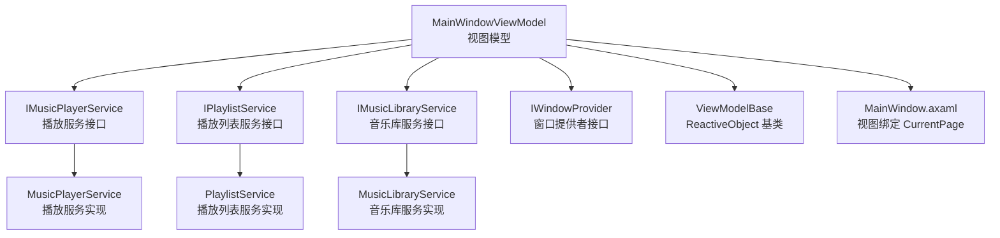
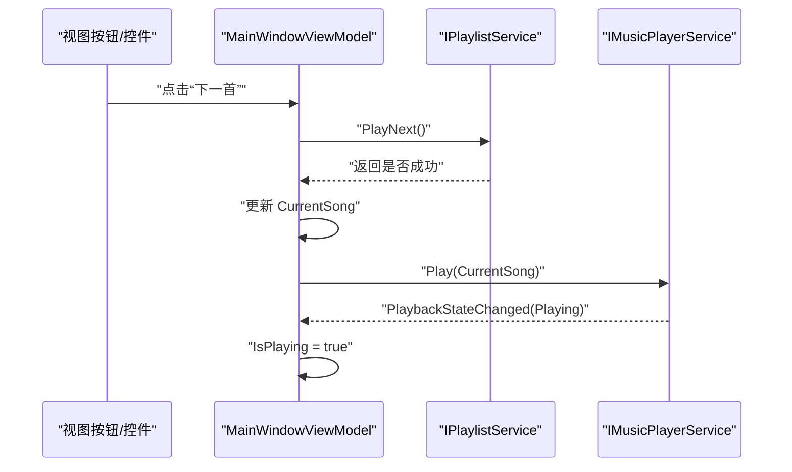
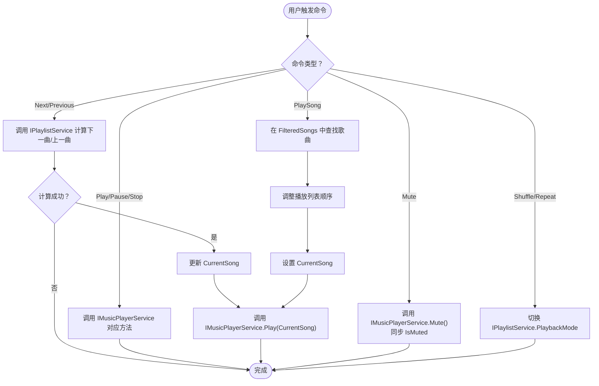
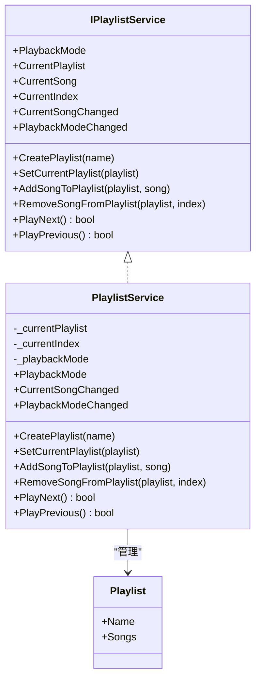
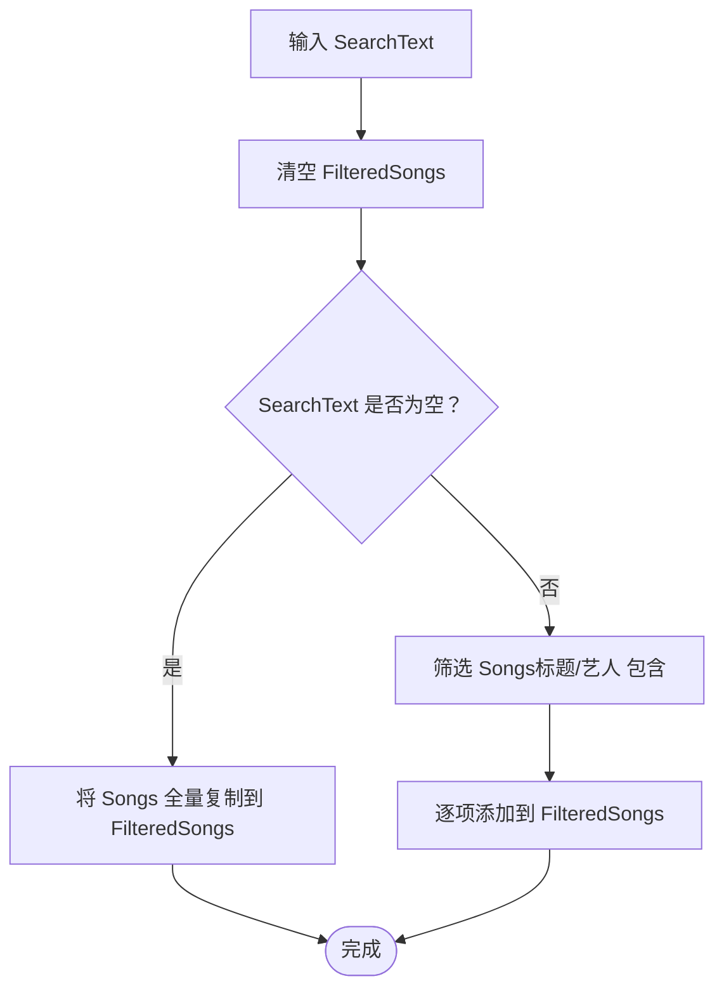
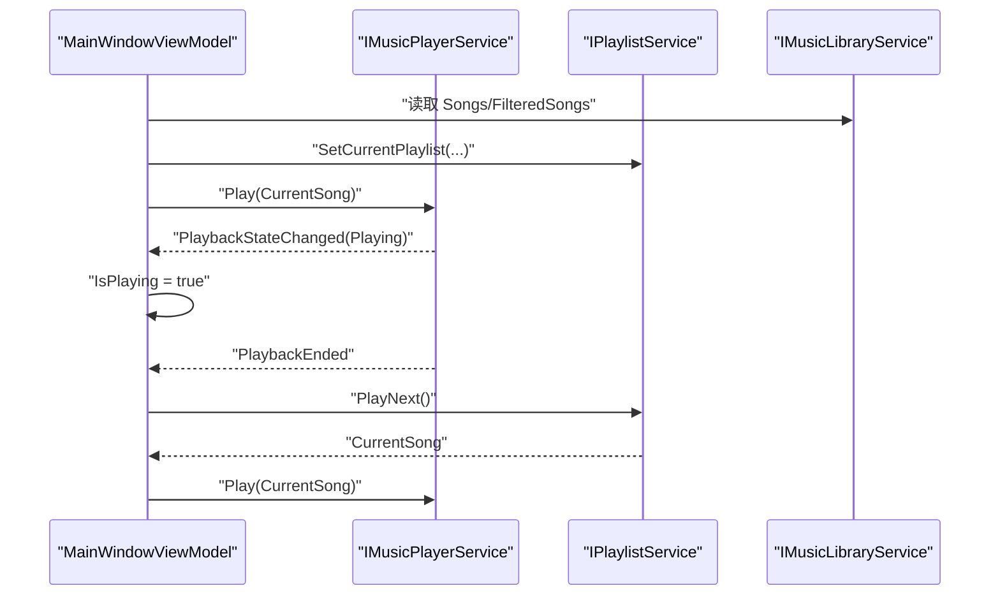
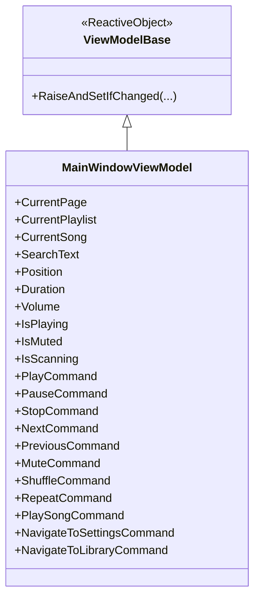
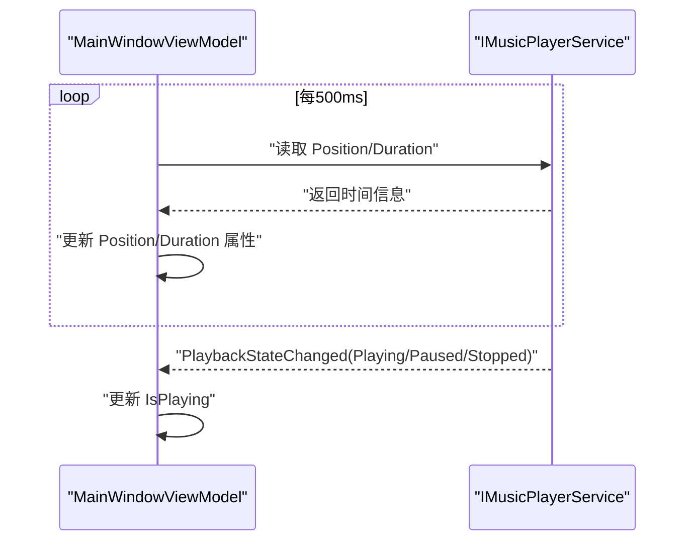
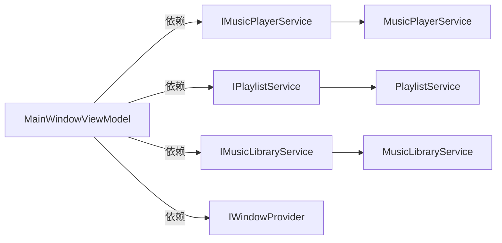

# 主窗口视图模型

<cite>
**本文引用的文件**
- [MainWindowViewModel.cs](file://ViewModels/MainWindowViewModel.cs)
- [ViewModelBase.cs](file://ViewModels/ViewModelBase.cs)
- [SettingsViewModel.cs](file://ViewModels/SettingsViewModel.cs)
- [IMusicPlayerService.cs](file://Services/IMusicPlayerService.cs)
- [MusicPlayerService.cs](file://Services/MusicPlayerService.cs)
- [IPlaylistService.cs](file://Services/IPlaylistService.cs)
- [PlaylistService.cs](file://Services/PlaylistService.cs)
- [IMusicLibraryService.cs](file://Services/IMusicLibraryService.cs)
- [MusicLibraryService.cs](file://Services/MusicLibraryService.cs)
- [IScanService.cs](file://Services/IScanService.cs)
- [Song.cs](file://Models/Song.cs)
- [Playlist.cs](file://Models/Playlist.cs)
- [PlayState.cs](file://Models/PlayState.cs)
- [PlaybackMode.cs](file://Models/PlaybackMode.cs)
- [MainWindow.axaml](file://Views/MainWindow.axaml)
</cite>

## 目录
1. [简介](#简介)
2. [项目结构](#项目结构)
3. [核心组件](#核心组件)
4. [架构总览](#架构总览)
5. [详细组件分析](#详细组件分析)
6. [依赖分析](#依赖分析)
7. [性能考虑](#性能考虑)
8. [故障排查指南](#故障排查指南)
9. [结论](#结论)
10. [附录](#附录)

## 简介
本文件聚焦于 MainWindowViewModel 的设计与实现，系统性阐述其在本地音乐播放器中的核心职责：音频播放控制命令（如播放、暂停、停止、上一首、下一首、静音、随机播放、单曲循环、直接播放某曲目）、播放列表管理、音乐库搜索与过滤、以及与 IMusicPlayerService、IPlaylistService、IMusicLibraryService 的协作关系。文档同时解释属性变更通知机制、命令绑定模式与响应式编程的应用，并给出播放状态管理、音量控制、播放进度跟踪等关键功能的实现要点与最佳实践。

## 项目结构
MainWindowViewModel 所属的典型分层组织如下：
- 视图模型层：MainWindowViewModel、SettingsViewModel 继承自 ViewModelBase，使用 ReactiveUI 实现属性变更通知与命令绑定。
- 服务层：IMusicPlayerService/MusicPlayerService 负责底层播放；IPlaylistService/PlaylistService 管理播放队列与播放模式；IMusicLibraryService/MusicLibraryService 提供歌曲集合与过滤视图。
- 模型层：Song、Playlist、PlayState、PlaybackMode 描述数据与状态。
- 视图层：MainWindow.axaml 将 CurrentPage 绑定到当前视图模型，实现“库”和“设置”页面切换。

图表来源
- [MainWindowViewModel.cs:11-216](file://ViewModels/MainWindowViewModel.cs#L11-L216)
- [IMusicPlayerService.cs:6-27](file://Services/IMusicPlayerService.cs#L6-L27)
- [MusicPlayerService.cs:7-129](file://Services/MusicPlayerService.cs#L7-L129)
- [IPlaylistService.cs:7-22](file://Services/IPlaylistService.cs#L7-L22)
- [PlaylistService.cs:7-120](file://Services/PlaylistService.cs#L7-L120)
- [IMusicLibraryService.cs:7-14](file://Services/IMusicLibraryService.cs#L7-L14)
- [MusicLibraryService.cs:7-27](file://Services/MusicLibraryService.cs#L7-L27)
- [ViewModelBase.cs:5](file://ViewModels/ViewModelBase.cs#L5)
- [MainWindow.axaml:73](file://Views/MainWindow.axaml#L73)

章节来源
- [MainWindowViewModel.cs:11-216](file://ViewModels/MainWindowViewModel.cs#L11-L216)
- [MainWindow.axaml:73](file://Views/MainWindow.axaml#L73)

## 核心组件
- 音频播放控制命令
  - PlayCommand/PauseCommand/StopCommand：委托给 IMusicPlayerService 对应方法。
  - NextCommand/PreviousCommand：通过 IPlaylistService 计算下一曲/上一曲索引，更新 CurrentSong 并触发播放。
  - MuteCommand：调用 IMusicPlayerService.Mute 并同步 IsMuted。
  - ShuffleCommand/RepeatCommand：切换 IPlaylistService.PlaybackMode。
  - PlaySongCommand：从 IMusicLibraryService.FilteredSongs 定位歌曲，调整播放列表顺序并播放。
- 播放列表管理
  - 默认创建“默认播放列表”，设置为当前播放列表；支持添加/移除歌曲、维护 CurrentSong 与 CurrentIndex。
- 音乐库搜索
  - SearchText 属性变更时触发 FilterSongs，基于标题或艺人进行大小写不敏感过滤，填充 IMusicLibraryService.FilteredSongs。
- 状态与显示
  - IsPlaying、Position、Duration、Volume、IsMuted、IsScanning 等属性驱动 UI 更新。
- 页面导航
  - NavigateToSettingsCommand/NavigateToLibraryCommand 切换 CurrentPage，实现“库”和“设置”页面切换。

章节来源
- [MainWindowViewModel.cs:108-229](file://ViewModels/MainWindowViewModel.cs#L108-L229)
- [IPlaylistService.cs:9-21](file://Services/IPlaylistService.cs#L9-L21)
- [IMusicLibraryService.cs:9-13](file://Services/IMusicLibraryService.cs#L9-L13)

## 架构总览
MainWindowViewModel 作为应用的中枢，负责：
- 协调播放器、播放列表与音乐库三类服务；
- 通过 ReactiveCommand 将用户交互映射为服务调用；
- 通过属性变更通知与定时轮询更新播放进度；
- 通过事件订阅处理播放结束与状态变化。

图表来源
- [MainWindowViewModel.cs:144-161](file://ViewModels/MainWindowViewModel.cs#L144-L161)
- [IPlaylistService.cs:13-14](file://Services/IPlaylistService.cs#L13-L14)
- [IMusicPlayerService.cs:24-26](file://Services/IMusicPlayerService.cs#L24-L26)

## 详细组件分析

### 音频播放控制命令
- PlayCommand：调用 IMusicPlayerService.Resume()。
- PauseCommand：调用 IMusicPlayerService.Pause()。
- StopCommand：调用 IMusicPlayerService.Stop()。
- NextCommand：若 IPlaylistService.PlayNext() 成功，更新 CurrentSong 并播放。
- PreviousCommand：若 IPlaylistService.PlayPrevious() 成功，更新 CurrentSong 并播放。
- MuteCommand：调用 IMusicPlayerService.Mute()，并将 IsMuted 同步为服务端状态。
- ShuffleCommand：在 Normal 与 Shuffle 之间切换 PlaybackMode。
- RepeatCommand：在 Normal 与 Loop 之间切换 PlaybackMode。
- PlaySongCommand：根据路径定位歌曲，调整播放列表顺序，设置 CurrentSong 并播放。

图表来源
- [MainWindowViewModel.cs:141-195](file://ViewModels/MainWindowViewModel.cs#L141-L195)
- [IPlaylistService.cs:13-14](file://Services/IPlaylistService.cs#L13-L14)
- [IMusicPlayerService.cs:8-16](file://Services/IMusicPlayerService.cs#L8-L16)

章节来源
- [MainWindowViewModel.cs:141-195](file://ViewModels/MainWindowViewModel.cs#L141-L195)
- [IMusicPlayerService.cs:8-26](file://Services/IMusicPlayerService.cs#L8-L26)
- [IPlaylistService.cs:13-14](file://Services/IPlaylistService.cs#L13-L14)

### 播放列表管理
- 创建默认播放列表并设为当前；支持向播放列表添加/移除歌曲。
- PlayNext/PlayPrevious 根据 PlaybackMode（Normal/Shuffle/Loop）决定索引推进策略。
- CurrentSongChanged 事件用于通知当前歌曲变化。

图表来源
- [IPlaylistService.cs:7-22](file://Services/IPlaylistService.cs#L7-L22)
- [PlaylistService.cs:7-120](file://Services/PlaylistService.cs#L7-L120)
- [Playlist.cs:5-10](file://Models/Playlist.cs#L5-L10)

章节来源
- [PlaylistService.cs:36-120](file://Services/PlaylistService.cs#L36-L120)
- [IPlaylistService.cs:9-21](file://Services/IPlaylistService.cs#L9-L21)

### 音乐库搜索功能
- SearchText 属性变更时，FilterSongs 清空 FilteredSongs，按标题或艺人进行模糊匹配后批量填充。
- IMusicLibraryService.Songs 为全量集合，FilteredSongs 为搜索结果视图。

图表来源
- [MainWindowViewModel.cs:218-229](file://ViewModels/MainWindowViewModel.cs#L218-L229)
- [IMusicLibraryService.cs:9-13](file://Services/IMusicLibraryService.cs#L9-L13)

章节来源
- [MainWindowViewModel.cs:44-54](file://ViewModels/MainWindowViewModel.cs#L44-L54)
- [MainWindowViewModel.cs:218-229](file://ViewModels/MainWindowViewModel.cs#L218-L229)
- [IMusicLibraryService.cs:9-13](file://Services/IMusicLibraryService.cs#L9-L13)

### 与服务的协作关系
- 与 IMusicPlayerService 的协作
  - 通过事件 PlaybackEnded 自动播放下一曲；通过 PlaybackStateChanged 同步 IsPlaying；通过定时轮询更新 Position 与 Duration。
- 与 IPlaylistService 的协作
  - 通过 PlayNext/PlayPrevious 获取下一曲；通过 PlaybackMode 控制播放策略；通过 CurrentSongChanged 推送当前歌曲。
- 与 IMusicLibraryService 的协作
  - 通过 FilteredSongs 支持搜索；通过 Songs 提供全量数据源。

图表来源
- [MainWindowViewModel.cs:197-205](file://ViewModels/MainWindowViewModel.cs#L197-L205)
- [MainWindowViewModel.cs:209-215](file://ViewModels/MainWindowViewModel.cs#L209-L215)
- [IMusicPlayerService.cs:24-26](file://Services/IMusicPlayerService.cs#L24-L26)
- [IPlaylistService.cs:13-14](file://Services/IPlaylistService.cs#L13-L14)

章节来源
- [MainWindowViewModel.cs:197-215](file://ViewModels/MainWindowViewModel.cs#L197-L215)
- [IMusicPlayerService.cs:18-26](file://Services/IMusicPlayerService.cs#L18-L26)
- [IPlaylistService.cs:19-20](file://Services/IPlaylistService.cs#L19-L20)

### 属性变更通知机制与命令绑定
- 属性变更通知
  - 所有可观察属性均通过 ViewModelBase 继承的 ReactiveObject 提供的 RaiseAndSetIfChanged 实现通知。
- 命令绑定
  - 使用 ReactiveCommand<Unit, Unit> 定义命令；在 XAML 中通过 Command 绑定到视图模型命令属性。
  - 页面切换命令通过设置 CurrentPage 实现内容区域的动态切换。
- 响应式编程
  - 使用 Observable.Interval 定期轮询播放进度；通过 ObserveOn(RxApp.MainThreadScheduler) 确保 UI 线程更新。

图表来源
- [ViewModelBase.cs:5](file://ViewModels/ViewModelBase.cs#L5)
- [MainWindowViewModel.cs:20-24](file://ViewModels/MainWindowViewModel.cs#L20-L24)
- [MainWindowViewModel.cs:108-118](file://ViewModels/MainWindowViewModel.cs#L108-L118)

章节来源
- [MainWindowViewModel.cs:20-98](file://ViewModels/MainWindowViewModel.cs#L20-L98)
- [MainWindowViewModel.cs:108-118](file://ViewModels/MainWindowViewModel.cs#L108-L118)
- [MainWindow.axaml:39-46](file://Views/MainWindow.axaml#L39-L46)

### 播放状态管理、音量控制与播放位置跟踪
- 播放状态
  - 通过 IMusicPlayerService.PlaybackStateChanged 事件监听 Playing/Paused/Stopped，并同步 IsPlaying。
- 音量控制
  - Volume 属性变更时调用 IMusicPlayerService.SetVolume；Mute 切换时保存/恢复音量。
- 播放位置跟踪
  - 使用 Observable.Interval 每 500ms 读取 Position 与 Duration，避免阻塞 UI 线程。

图表来源
- [MainWindowViewModel.cs:209-215](file://ViewModels/MainWindowViewModel.cs#L209-L215)
- [MainWindowViewModel.cs:207](file://ViewModels/MainWindowViewModel.cs#L207)
- [IMusicPlayerService.cs:18-22](file://Services/IMusicPlayerService.cs#L18-L22)

章节来源
- [MainWindowViewModel.cs:72-82](file://ViewModels/MainWindowViewModel.cs#L72-L82)
- [MainWindowViewModel.cs:207-215](file://ViewModels/MainWindowViewModel.cs#L207-L215)
- [MusicPlayerService.cs:84-113](file://Services/MusicPlayerService.cs#L84-L113)

### 设置视图模型与扫描服务集成
- SettingsViewModel 提供浏览目录、扫描音乐库、统计信息等功能，与 MainWindowViewModel 通过 CurrentPage 切换实现页面导航。
- 扫描流程通过 IScanService 异步执行，完成后更新音乐库统计信息。

章节来源
- [SettingsViewModel.cs:107-146](file://ViewModels/SettingsViewModel.cs#L107-L146)
- [IScanService.cs:5-8](file://Services/IScanService.cs#L5-L8)

## 依赖分析
- 内聚与耦合
  - MainWindowViewModel 对三大服务接口存在直接依赖，但通过接口隔离了具体实现细节，内聚度高、耦合度适中。
- 外部依赖
  - LibVLCSharp 用于底层播放；ReactiveUI 用于响应式与命令绑定；Avalonia UI 用于视图层。
- 循环依赖
  - 未发现循环依赖；服务接口与视图模型解耦良好。

图表来源
- [MainWindowViewModel.cs:13-16](file://ViewModels/MainWindowViewModel.cs#L13-L16)
- [IMusicPlayerService.cs:6-27](file://Services/IMusicPlayerService.cs#L6-L27)
- [IPlaylistService.cs:7-22](file://Services/IPlaylistService.cs#L7-L22)
- [IMusicLibraryService.cs:7-14](file://Services/IMusicLibraryService.cs#L7-L14)

章节来源
- [MainWindowViewModel.cs:13-16](file://ViewModels/MainWindowViewModel.cs#L13-L16)
- [MusicPlayerService.cs:7-38](file://Services/MusicPlayerService.cs#L7-L38)
- [PlaylistService.cs:7-34](file://Services/PlaylistService.cs#L7-L34)
- [MusicLibraryService.cs:7-26](file://Services/MusicLibraryService.cs#L7-L26)

## 性能考虑
- 定时轮询频率
  - 当前每 500ms 轮询一次位置与时长，已足够平滑 UI 更新；如需更高精度可降低间隔，但需权衡 CPU 开销。
- 搜索过滤
  - FilterSongs 在每次输入变更时重建 FilteredSongs；对于大量歌曲，建议：
    - 使用更高效的过滤策略（如惰性枚举、增量更新）；
    - 添加防抖（debounce）以减少频繁刷新。
- 事件订阅与资源释放
  - MusicPlayerService 在构造中注册媒体播放器事件；确保在合适时机释放资源，避免内存泄漏。
- 命令与绑定
  - ReactiveCommand 已具备良好的线程调度；避免在命令中执行耗时操作，必要时使用后台线程与结果回传。

[本节为通用指导，无需列出章节来源]

## 故障排查指南
- 播放无声音
  - 检查 IsMuted 与 Volume 属性是否被错误设置；确认 Mute 切换逻辑正确。
- 无法切歌
  - 检查 IPlaylistService.PlayNext/PlayPrevious 返回值与 CurrentIndex 边界条件；确认播放模式设置。
- 搜索无效
  - 确认 FilterSongs 是否被触发（SearchText 变更）；检查 IMusicLibraryService.Songs 与 FilteredSongs 的数据一致性。
- 进度条不动
  - 确认 Observable.Interval 是否运行且主线程调度有效；检查 IMusicPlayerService.Position/Duration 是否返回有效值。

章节来源
- [MainWindowViewModel.cs:209-215](file://ViewModels/MainWindowViewModel.cs#L209-L215)
- [MusicPlayerService.cs:21-25](file://Services/MusicPlayerService.cs#L21-L25)
- [MainWindowViewModel.cs:218-229](file://ViewModels/MainWindowViewModel.cs#L218-L229)
- [PlaylistService.cs:69-119](file://Services/PlaylistService.cs#L69-L119)

## 结论
MainWindowViewModel 以清晰的职责划分与响应式设计实现了播放控制、播放列表管理与音乐库搜索等核心功能。通过与三大服务接口的协作，它在保持低耦合的同时提供了良好的扩展性与可维护性。建议在搜索过滤与定时轮询方面引入防抖与更高效的数据结构，以进一步提升性能与用户体验。

[本节为总结性内容，无需列出章节来源]

## 附录
- 数据模型概览
  - Song：标题、艺人、专辑、文件路径、时长。
  - Playlist：名称、歌曲列表。
  - PlayState：Stopped、Playing、Paused。
  - PlaybackMode：Normal、Shuffle、Loop。

章节来源
- [Song.cs:5-12](file://Models/Song.cs#L5-L12)
- [Playlist.cs:5-9](file://Models/Playlist.cs#L5-L9)
- [PlayState.cs:3-8](file://Models/PlayState.cs#L3-L8)
- [PlaybackMode.cs:3-8](file://Models/PlaybackMode.cs#L3-L8)