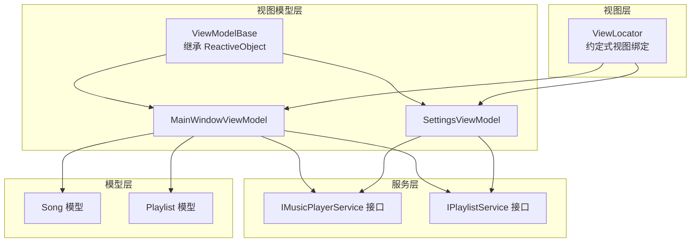
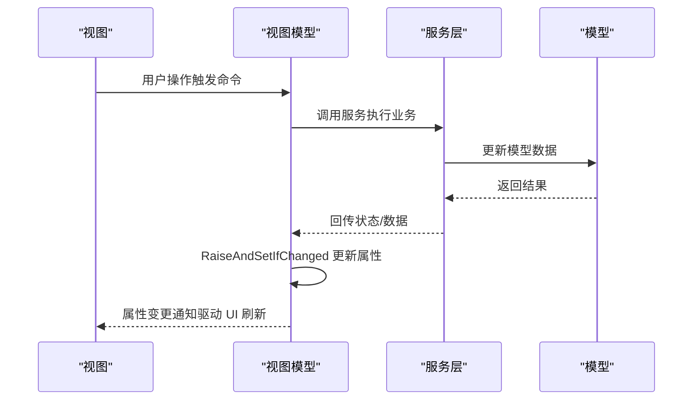
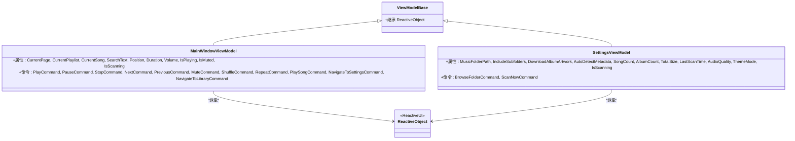
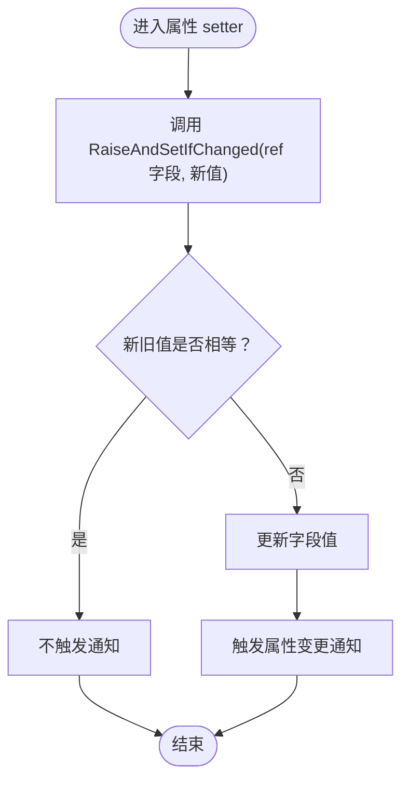
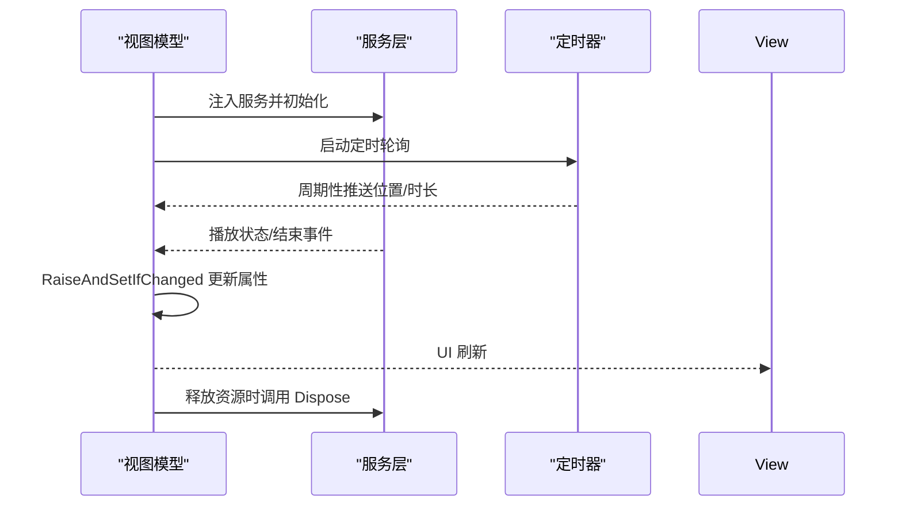
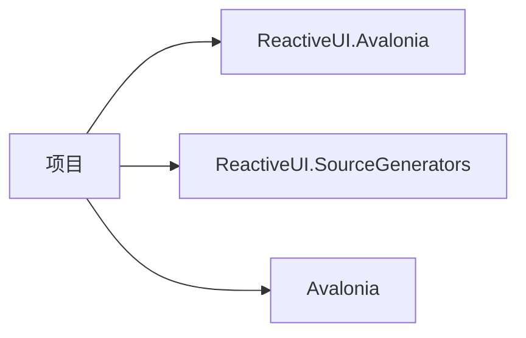

# 视图模型基类

<cite>
**本文引用的文件**
- [ViewModelBase.cs](file://ViewModels/ViewModelBase.cs)
- [MainWindowViewModel.cs](file://ViewModels/MainWindowViewModel.cs)
- [SettingsViewModel.cs](file://ViewModels/SettingsViewModel.cs)
- [LocalMusicPlayer.csproj](file://LocalMusicPlayer.csproj)
- [ViewLocator.cs](file://ViewLocator.cs)
- [IMusicPlayerService.cs](file://Services/IMusicPlayerService.cs)
- [IPlaylistService.cs](file://Services/IPlaylistService.cs)
- [Song.cs](file://Models/Song.cs)
- [Playlist.cs](file://Models/Playlist.cs)
</cite>

## 目录
1. [简介](#简介)
2. [项目结构](#项目结构)
3. [核心组件](#核心组件)
4. [架构总览](#架构总览)
5. [详细组件分析](#详细组件分析)
6. [依赖分析](#依赖分析)
7. [性能考虑](#性能考虑)
8. [故障排除指南](#故障排除指南)
9. [结论](#结论)
10. [附录](#附录)

## 简介
本文件围绕本地音乐播放器项目中的 ViewModelBase 基类展开，系统性阐述 MVVM 模式下视图模型基类的设计理念与实现方式，重点解析属性变更通知机制（RaiseAndSetIfChanged）的工作原理与使用方法，说明 ReactiveObject 基类的功能与继承体系，梳理视图模型生命周期管理、内存优化与性能考量，并结合项目中的实际应用模式给出最佳实践与常见问题解决方案，同时提供调试技巧与开发工具建议。

## 项目结构
该项目采用 Avalonia + ReactiveUI 的 MVVM 架构，视图模型位于 ViewModels 目录，通过 ViewLocator 将视图模型与视图进行约定式绑定。ViewModelBase 继承自 ReactiveObject，为所有视图模型提供统一的属性变更通知能力；MainWindowViewModel 与 SettingsViewModel 分别承载主界面与设置界面的状态与命令；服务层通过接口注入的方式解耦业务逻辑。

图表来源
- [ViewModelBase.cs:1-8](file://ViewModels/ViewModelBase.cs#L1-L8)
- [MainWindowViewModel.cs:11-231](file://ViewModels/MainWindowViewModel.cs#L11-L231)
- [SettingsViewModel.cs:10-148](file://ViewModels/SettingsViewModel.cs#L10-L148)
- [ViewLocator.cs:8-38](file://ViewLocator.cs#L8-L38)
- [IMusicPlayerService.cs:6-27](file://Services/IMusicPlayerService.cs#L6-L27)
- [IPlaylistService.cs:7-22](file://Services/IPlaylistService.cs#L7-L22)
- [Song.cs:5-13](file://Models/Song.cs#L5-L13)
- [Playlist.cs:5-10](file://Models/Playlist.cs#L5-L10)

章节来源
- [ViewModelBase.cs:1-8](file://ViewModels/ViewModelBase.cs#L1-L8)
- [MainWindowViewModel.cs:11-231](file://ViewModels/MainWindowViewModel.cs#L11-L231)
- [SettingsViewModel.cs:10-148](file://ViewModels/SettingsViewModel.cs#L10-L148)
- [ViewLocator.cs:8-38](file://ViewLocator.cs#L8-L38)

## 核心组件
- ViewModelBase：最小化基类，仅继承 ReactiveObject，提供统一的属性变更通知能力，确保所有视图模型具备一致的响应式行为。
- MainWindowViewModel：主界面视图模型，负责播放控制、播放列表切换、搜索过滤、音量与播放状态同步等。
- SettingsViewModel：设置界面视图模型，负责扫描目录选择、扫描执行、统计信息更新等。
- ViewLocator：约定式视图绑定，根据视图模型类型自动匹配对应视图，支持 MainWindowViewModel 与 SettingsViewModel 的映射。

章节来源
- [ViewModelBase.cs:5-7](file://ViewModels/ViewModelBase.cs#L5-L7)
- [MainWindowViewModel.cs:11-231](file://ViewModels/MainWindowViewModel.cs#L11-L231)
- [SettingsViewModel.cs:10-148](file://ViewModels/SettingsViewModel.cs#L10-L148)
- [ViewLocator.cs:8-38](file://ViewLocator.cs#L8-L38)

## 架构总览
MVVM 架构通过 ViewModelBase 提供统一的属性变更通知，视图模型通过 ReactiveCommand 执行命令，服务层通过接口注入实现业务逻辑解耦。视图通过绑定到视图模型的属性与命令完成交互，ViewLocator 负责视图模型与视图的绑定。

图表来源
- [MainWindowViewModel.cs:108-216](file://ViewModels/MainWindowViewModel.cs#L108-L216)
- [SettingsViewModel.cs:104-146](file://ViewModels/SettingsViewModel.cs#L104-L146)
- [IMusicPlayerService.cs:6-27](file://Services/IMusicPlayerService.cs#L6-L27)
- [IPlaylistService.cs:7-22](file://Services/IPlaylistService.cs#L7-L22)

## 详细组件分析

### ViewModelBase 基类设计与继承体系
- 设计理念：最小可用基类，仅引入 ReactiveObject，避免在基类中引入复杂逻辑，保持视图模型的轻量化与可扩展性。
- 继承体系：ViewModelBase 直接继承 ReactiveObject，所有派生类（如 MainWindowViewModel、SettingsViewModel）均获得属性变更通知能力。
- 使用建议：在派生类中仅定义需要暴露给视图绑定的公共属性与命令，避免在基类中添加业务逻辑。

图表来源
- [ViewModelBase.cs:5-7](file://ViewModels/ViewModelBase.cs#L5-L7)
- [MainWindowViewModel.cs:11-231](file://ViewModels/MainWindowViewModel.cs#L11-L231)
- [SettingsViewModel.cs:10-148](file://ViewModels/SettingsViewModel.cs#L10-L148)

章节来源
- [ViewModelBase.cs:5-7](file://ViewModels/ViewModelBase.cs#L5-L7)

### 属性变更通知机制：RaiseAndSetIfChanged
- 工作原理：RaiseAndSetIfChanged 是 ReactiveObject 提供的泛型方法，用于安全地设置字段值并在值发生变化时触发属性变更通知。其内部会比较新旧值，只有当值发生改变时才触发通知，避免不必要的 UI 刷新。
- 使用方法：
  - 在派生类中声明私有字段与公共属性。
  - 在属性 setter 中调用 RaiseAndSetIfChanged(ref 字段, 新值)，必要时在 setter 内部追加业务逻辑（如调用服务或触发其他副作用）。
  - 示例路径：
    - [MainWindowViewModel.cs:20-24](file://ViewModels/MainWindowViewModel.cs#L20-L24)
    - [MainWindowViewModel.cs:46-54](file://ViewModels/MainWindowViewModel.cs#L46-L54)
    - [MainWindowViewModel.cs:74-82](file://ViewModels/MainWindowViewModel.cs#L74-L82)
    - [SettingsViewModel.cs:18-22](file://ViewModels/SettingsViewModel.cs#L18-L22)
    - [SettingsViewModel.cs:98-102](file://ViewModels/SettingsViewModel.cs#L98-L102)

图表来源
- [MainWindowViewModel.cs:46-54](file://ViewModels/MainWindowViewModel.cs#L46-L54)
- [MainWindowViewModel.cs:74-82](file://ViewModels/MainWindowViewModel.cs#L74-L82)
- [SettingsViewModel.cs:18-22](file://ViewModels/SettingsViewModel.cs#L18-L22)
- [SettingsViewModel.cs:98-102](file://ViewModels/SettingsViewModel.cs#L98-L102)

章节来源
- [MainWindowViewModel.cs:20-24](file://ViewModels/MainWindowViewModel.cs#L20-L24)
- [MainWindowViewModel.cs:46-54](file://ViewModels/MainWindowViewModel.cs#L46-L54)
- [MainWindowViewModel.cs:74-82](file://ViewModels/MainWindowViewModel.cs#L74-L82)
- [SettingsViewModel.cs:18-22](file://ViewModels/SettingsViewModel.cs#L18-L22)
- [SettingsViewModel.cs:98-102](file://ViewModels/SettingsViewModel.cs#L98-L102)

### ReactiveObject 基类功能与继承体系
- 功能概述：ReactiveObject 提供属性变更通知、命令绑定、订阅管理等基础能力，是 ReactiveUI 的核心基类。
- 在本项目中的体现：
  - ViewModelBase 直接继承 ReactiveObject，使所有视图模型具备统一的通知机制。
  - MainWindowViewModel 与 SettingsViewModel 通过 ReactiveCommand 定义命令，通过 RaiseAndSetIfChanged 实现属性变更通知。
- 依赖版本：项目使用 ReactiveUI.Avalonia 与 ReactiveUI.SourceGenerators，确保编译期生成与运行时性能。

章节来源
- [ViewModelBase.cs:1-7](file://ViewModels/ViewModelBase.cs#L1-L7)
- [LocalMusicPlayer.csproj:31-35](file://LocalMusicPlayer.csproj#L31-L35)

### 视图模型生命周期管理
- 初始化：构造函数中注入服务，初始化当前页面、播放列表、命令等。
- 运行期：通过事件订阅（如播放状态变化、播放结束）与定时轮询（如进度刷新）维持 UI 与服务状态同步。
- 销毁：服务层实现 IDisposable，在释放媒体资源时清理底层资源。

图表来源
- [MainWindowViewModel.cs:120-216](file://ViewModels/MainWindowViewModel.cs#L120-L216)
- [IMusicPlayerService.cs:24-27](file://Services/IMusicPlayerService.cs#L24-L27)

章节来源
- [MainWindowViewModel.cs:120-216](file://ViewModels/MainWindowViewModel.cs#L120-L216)
- [IMusicPlayerService.cs:6-27](file://Services/IMusicPlayerService.cs#L6-L27)

### 内存优化与性能考虑
- 避免重复通知：仅在值发生变化时触发通知，减少不必要的 UI 刷新。
- 订阅管理：合理订阅事件，避免在视图模型销毁后仍持有订阅导致内存泄漏。
- 定时轮询频率：根据 UI 刷新需求调整轮询间隔，降低主线程压力。
- 资源释放：服务层实现 IDisposable，确保媒体播放器与底层资源及时释放。

章节来源
- [MainWindowViewModel.cs:209-216](file://ViewModels/MainWindowViewModel.cs#L209-L216)
- [IMusicPlayerService.cs:120-129](file://Services/IMusicPlayerService.cs#L120-L129)

### 具体应用模式与代码示例路径
- 主界面播放控制与状态同步：
  - [MainWindowViewModel.cs:108-178](file://ViewModels/MainWindowViewModel.cs#L108-L178)
  - [MainWindowViewModel.cs:197-205](file://ViewModels/MainWindowViewModel.cs#L197-L205)
  - [MainWindowViewModel.cs:209-215](file://ViewModels/MainWindowViewModel.cs#L209-L215)
- 设置界面扫描与统计：
  - [SettingsViewModel.cs:104-146](file://ViewModels/SettingsViewModel.cs#L104-L146)
- 视图模型与视图绑定：
  - [ViewLocator.cs:15-21](file://ViewLocator.cs#L15-L21)
  - [ViewLocator.cs:34-38](file://ViewLocator.cs#L34-L38)

章节来源
- [MainWindowViewModel.cs:108-178](file://ViewModels/MainWindowViewModel.cs#L108-L178)
- [MainWindowViewModel.cs:197-205](file://ViewModels/MainWindowViewModel.cs#L197-L205)
- [MainWindowViewModel.cs:209-215](file://ViewModels/MainWindowViewModel.cs#L209-L215)
- [SettingsViewModel.cs:104-146](file://ViewModels/SettingsViewModel.cs#L104-L146)
- [ViewLocator.cs:15-21](file://ViewLocator.cs#L15-L21)
- [ViewLocator.cs:34-38](file://ViewLocator.cs#L34-L38)

## 依赖分析
- ReactiveUI 生态：项目使用 ReactiveUI.Avalonia 与 ReactiveUI.SourceGenerators，前者提供跨平台 UI 绑定与命令支持，后者提供编译期生成优化。
- Avalonia 平台：Avalonia 作为 UI 框架，与 ReactiveUI 协同工作，支持 XAML 编译绑定与数据模板。
- 服务接口：通过接口注入实现业务逻辑解耦，便于测试与替换实现。

图表来源
- [LocalMusicPlayer.csproj:21-41](file://LocalMusicPlayer.csproj#L21-L41)

章节来源
- [LocalMusicPlayer.csproj:21-41](file://LocalMusicPlayer.csproj#L21-L41)

## 性能考虑
- 属性变更通知：仅在值变化时触发通知，避免频繁 UI 刷新。
- 订阅与取消：确保在视图模型生命周期结束时取消事件订阅，防止内存泄漏。
- 定时轮询：根据 UI 需求调整轮询频率，避免过度占用主线程。
- 资源释放：服务层实现 IDisposable，确保媒体播放器与底层资源及时释放。

## 故障排除指南
- 属性未更新：检查属性 setter 是否正确调用 RaiseAndSetIfChanged，并确认字段引用传递是否正确。
- 命令未响应：确认命令是否正确初始化，且绑定到视图的 Command 属性是否指向同一实例。
- 视图未显示：检查 ViewLocator 的约定式映射是否正确，确保视图模型类型与视图类型匹配。
- 内存泄漏：确认事件订阅在合适时机取消，避免长期持有订阅对象。

章节来源
- [MainWindowViewModel.cs:20-24](file://ViewModels/MainWindowViewModel.cs#L20-L24)
- [ViewLocator.cs:15-21](file://ViewLocator.cs#L15-L21)

## 结论
ViewModelBase 通过继承 ReactiveObject，为项目提供了统一、简洁的属性变更通知机制。在 MainWindowViewModel 与 SettingsViewModel 中，开发者可以遵循“属性使用 RaiseAndSetIfChanged，命令通过 ReactiveCommand 定义”的模式，实现清晰的 MVVM 架构。配合 ViewLocator 的约定式绑定与服务层接口注入，项目在可维护性、可测试性与性能方面均得到良好平衡。

## 附录
- 最佳实践清单
  - 在属性 setter 中始终使用 RaiseAndSetIfChanged。
  - 将业务逻辑封装在服务层并通过接口注入。
  - 使用 ReactiveCommand 管理用户交互命令。
  - 合理管理订阅与资源释放，避免内存泄漏。
- 开发工具建议
  - 使用 ReactiveUI.SourceGenerators 提升编译期性能与可读性。
  - 在调试阶段启用 Avalonia.Diagnostics（仅 Debug 配置），以便观察绑定与命令状态。