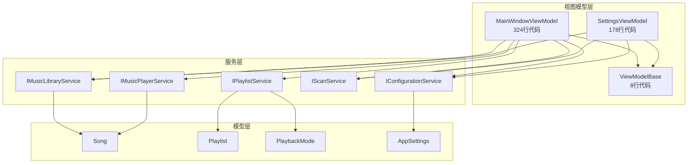
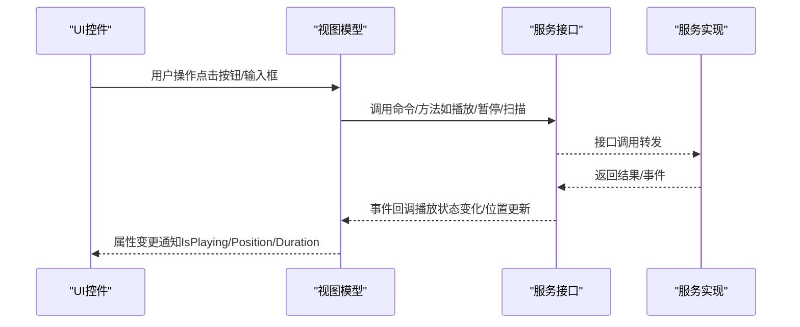
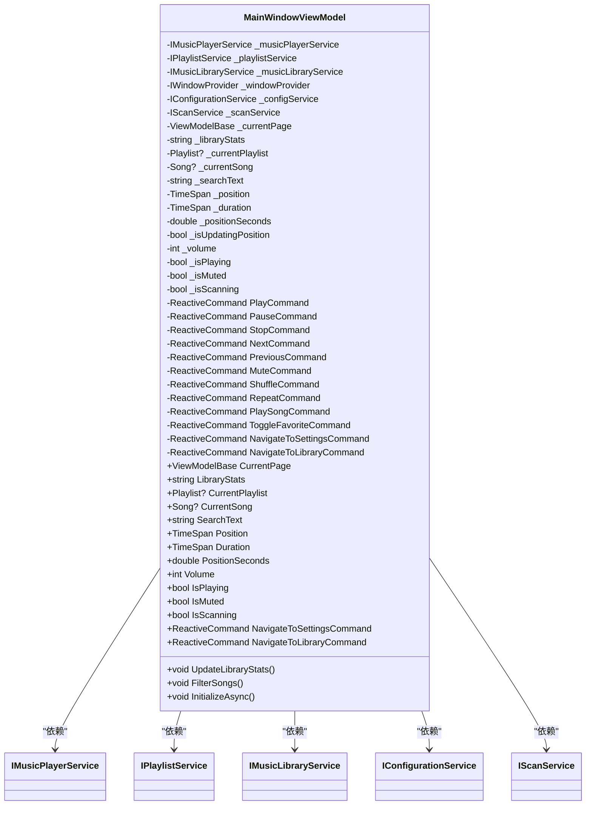
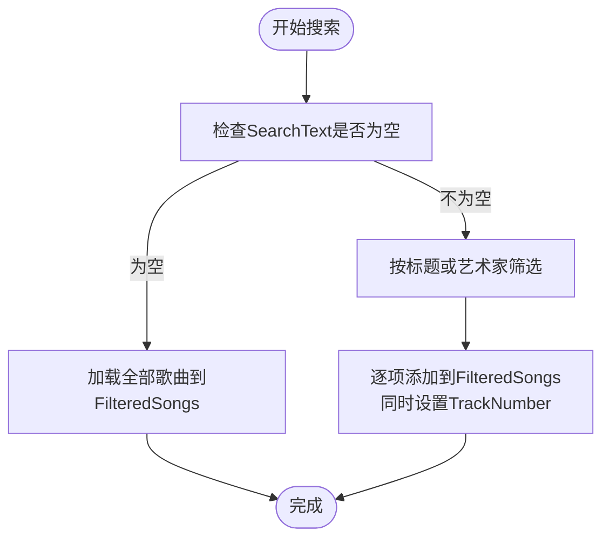
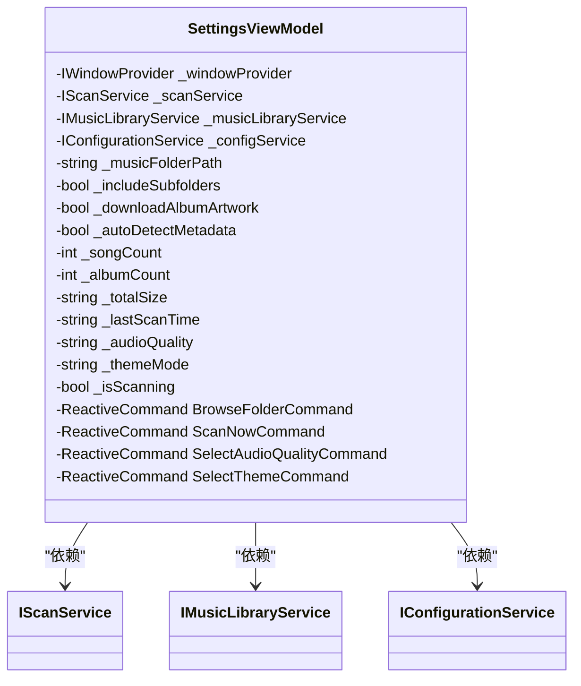
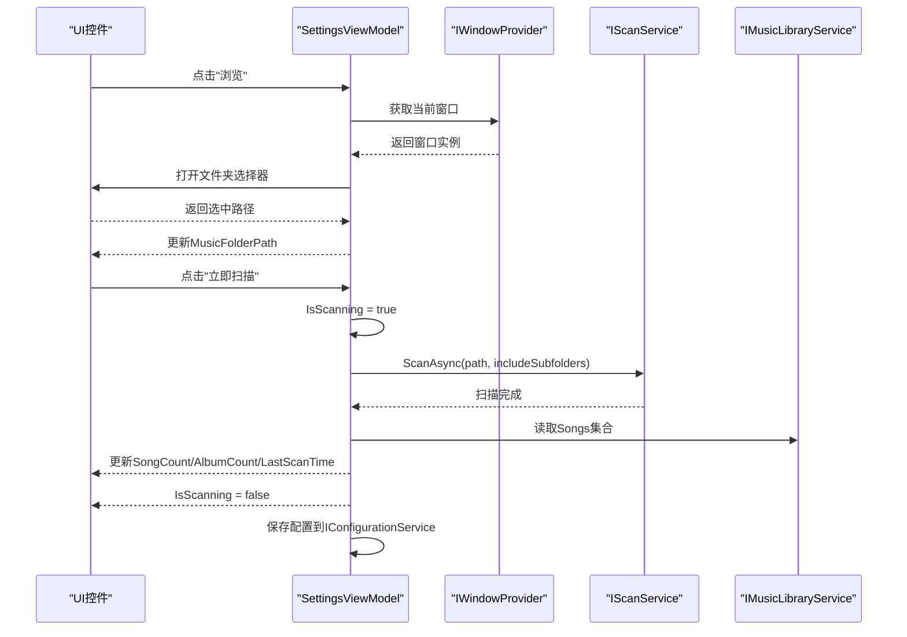
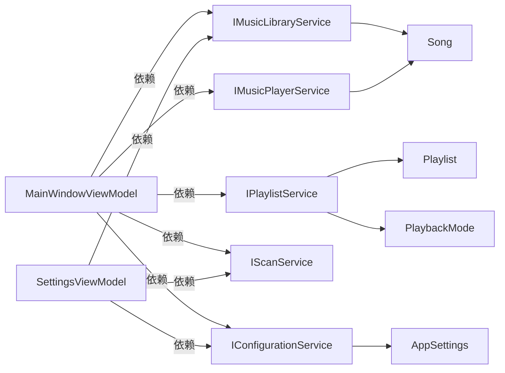

# 视图模型层

<cite>
**本文引用的文件**
- [MainWindowViewModel.cs](file://ViewModels/MainWindowViewModel.cs)
- [SettingsViewModel.cs](file://ViewModels/SettingsViewModel.cs)
- [ViewModelBase.cs](file://ViewModels/ViewModelBase.cs)
- [Song.cs](file://Models/Song.cs)
- [Playlist.cs](file://Models/Playlist.cs)
- [PlaybackMode.cs](file://Models/PlaybackMode.cs)
- [AppSettings.cs](file://Models/AppSettings.cs)
- [IMusicPlayerService.cs](file://Services/IMusicPlayerService.cs)
- [IPlaylistService.cs](file://Services/IPlaylistService.cs)
- [IMusicLibraryService.cs](file://Services/IMusicLibraryService.cs)
- [IScanService.cs](file://Services/IScanService.cs)
- [IConfigurationService.cs](file://Services/IConfigurationService.cs)
- [MainWindow.axaml](file://Views/MainWindow.axaml)
- [SettingsView.axaml](file://Views/SettingsView.axaml)
- [ViewLocator.cs](file://ViewLocator.cs)
</cite>

## 更新摘要
**变更内容**
- MainWindowViewModel从约200行增强至324行，新增大量功能和改进
- 新增独立的SettingsViewModel，专门处理设置管理
- ViewModelBase保持简洁但成为ViewLocator匹配的基础
- 增加了配置服务集成和自动扫描功能
- 新增收藏歌曲功能和更完善的统计信息显示

## 目录
1. [简介](#简介)
2. [项目结构](#项目结构)
3. [核心组件](#核心组件)
4. [架构总览](#架构总览)
5. [详细组件分析](#详细组件分析)
6. [依赖分析](#依赖分析)
7. [性能考虑](#性能考虑)
8. [故障排查指南](#故障排查指南)
9. [结论](#结论)
10. [附录](#附录)

## 简介
本文件聚焦于LocalMusicPlayer的视图模型层（ViewModel Layer），系统性阐述MVVM模式在该项目中的落地方式，重点覆盖：
- 视图模型在MVVM中的职责：封装UI状态、业务逻辑与命令，屏蔽底层服务细节
- MainWindowViewModel的核心业务编排：与音频播放服务、播放列表服务、音乐库服务的协作
- SettingsViewModel的设置管理与用户偏好处理
- ViewModelBase基类提供的通用能力与继承体系
- 命令绑定、属性变更通知与数据绑定的实现要点
- 生命周期管理、内存优化与性能考量
- 视图模型与UI层的交互模式与最佳实践

## 项目结构
视图模型层位于ViewModels目录，采用"按功能分层"的组织方式：
- MainWindowViewModel：主窗口的视图模型，负责页面导航、播放控制、搜索过滤、统计信息显示等
- SettingsViewModel：设置页的视图模型，负责扫描配置、统计信息与主题设置
- ViewModelBase：ReactiveObject的轻量封装，为所有视图模型提供统一的属性变更通知能力

视图模型通过接口与服务层解耦，界面通过ViewLocator按约定自动映射到对应视图，形成清晰的MVVM分层。

**图表来源**
- [MainWindowViewModel.cs:1-324](file://ViewModels/MainWindowViewModel.cs#L1-L324)
- [SettingsViewModel.cs:1-178](file://ViewModels/SettingsViewModel.cs#L1-L178)
- [ViewModelBase.cs:1-8](file://ViewModels/ViewModelBase.cs#L1-L8)

**章节来源**
- [MainWindowViewModel.cs:1-324](file://ViewModels/MainWindowViewModel.cs#L1-L324)
- [SettingsViewModel.cs:1-178](file://ViewModels/SettingsViewModel.cs#L1-L178)
- [ViewModelBase.cs:1-8](file://ViewModels/ViewModelBase.cs#L1-L8)

## 核心组件
- MainWindowViewModel：主页面的视图模型，承担播放控制、播放列表切换、搜索过滤、页面导航、统计信息显示等职责；通过ReactiveCommand与服务层交互，驱动IsPlaying、Position、Duration、Volume等UI状态
- SettingsViewModel：设置页的视图模型，负责音乐库扫描路径选择、扫描选项、统计信息展示与主题设置；通过ReactiveCommand触发异步扫描流程
- ViewModelBase：基于ReactiveObject的空壳基类，提供统一的属性变更通知机制，确保所有视图模型具备响应式行为

**章节来源**
- [MainWindowViewModel.cs:1-324](file://ViewModels/MainWindowViewModel.cs#L1-L324)
- [SettingsViewModel.cs:1-178](file://ViewModels/SettingsViewModel.cs#L1-L178)
- [ViewModelBase.cs:1-8](file://ViewModels/ViewModelBase.cs#L1-L8)

## 架构总览
视图模型层通过接口与服务层解耦，避免直接依赖具体实现，提升可测试性与可维护性。UI层通过ViewLocator按约定自动解析视图，实现"ViewModel -> View"的约定式映射。

**图表来源**
- [MainWindowViewModel.cs:152-254](file://ViewModels/MainWindowViewModel.cs#L152-L254)
- [SettingsViewModel.cs:105-176](file://ViewModels/SettingsViewModel.cs#L105-L176)
- [IMusicPlayerService.cs:6-27](file://Services/IMusicPlayerService.cs#L6-L27)
- [IPlaylistService.cs:7-22](file://Services/IPlaylistService.cs#L7-L22)
- [IMusicLibraryService.cs:7-14](file://Services/IMusicLibraryService.cs#L7-L14)
- [IScanService.cs:5-9](file://Services/IScanService.cs#L5-L9)

## 详细组件分析

### MainWindowViewModel 分析
**更新** MainWindowViewModel大幅增强，从约200行扩展至324行，新增了多项重要功能：

- **职责与边界**
  - 页面导航：通过CurrentPage与NavigateToSettingsCommand/NavigateToLibraryCommand在主页面与设置页之间切换
  - 播放控制：Play/Pause/Stop/Next/Previous/Mute/Shuffle/Repeat/Seek等命令，委托给IMusicPlayerService与IPlaylistService
  - 播放列表管理：创建默认播放列表、设置当前播放列表、根据播放模式推进下一曲
  - 音乐库集成：使用IMusicLibraryService的FilteredSongs进行搜索过滤
  - 实时状态：通过定时轮询与事件订阅同步Position、Duration、IsPlaying
  - **新增**：统计信息显示（LibraryStats）、收藏歌曲功能、配置加载与自动扫描
  - **新增**：位置同步优化（PositionSeconds与_isUpdatingPosition防止递归更新）

- **关键属性与命令**
  - CurrentPage：用于承载当前显示的视图模型
  - CurrentPlaylist/CurrentSong：播放上下文
  - SearchText：触发FilterSongs，更新FilteredSongs
  - Volume：联动音量设置与播放器服务
  - **新增**：LibraryStats：显示歌曲数、专辑数和总时长
  - **新增**：PositionSeconds：双向绑定的位置同步，带防递归更新
  - PlayCommand/PauseCommand/StopCommand/NextCommand/PreviousCommand/MuteCommand/ShuffleCommand/RepeatCommand/PlaySongCommand/ToggleFavoriteCommand/NavigateToSettingsCommand/NavigateToLibraryCommand

- **事件与订阅**
  - 订阅播放结束事件，自动推进下一曲
  - 订阅播放状态变化事件，更新IsPlaying
  - 使用Observable.Interval每500ms刷新Position与Duration
  - **新增**：订阅Library.Songs.CollectionChanged事件，实时更新统计信息

- **初始化流程**
  - **新增**：InitializeAsync方法负责配置加载、音量设置、自动扫描
  - **新增**：从IConfigurationService加载用户设置
  - **新增**：自动扫描配置的音乐文件夹

**图表来源**
- [MainWindowViewModel.cs:11-324](file://ViewModels/MainWindowViewModel.cs#L11-L324)
- [IMusicPlayerService.cs:6-27](file://Services/IMusicPlayerService.cs#L6-L27)
- [IPlaylistService.cs:7-22](file://Services/IPlaylistService.cs#L7-L22)
- [IMusicLibraryService.cs:7-14](file://Services/IMusicLibraryService.cs#L7-L14)
- [IConfigurationService.cs:7-15](file://Services/IConfigurationService.cs#L7-L15)

**图表来源**
- [MainWindowViewModel.cs:195-212](file://ViewModels/MainWindowViewModel.cs#L195-L212)
- [IPlaylistService.cs:13-14](file://Services/IPlaylistService.cs#L13-L14)
- [IMusicPlayerService.cs:8-9](file://Services/IMusicPlayerService.cs#L8-L9)

**图表来源**
- [MainWindowViewModel.cs:284-299](file://ViewModels/MainWindowViewModel.cs#L284-L299)
- [IMusicLibraryService.cs:9-10](file://Services/IMusicLibraryService.cs#L9-L10)

**章节来源**
- [MainWindowViewModel.cs:11-324](file://ViewModels/MainWindowViewModel.cs#L11-L324)
- [MainWindowViewModel.cs:284-299](file://ViewModels/MainWindowViewModel.cs#L284-L299)
- [MainWindowViewModel.cs:301-322](file://ViewModels/MainWindowViewModel.cs#L301-L322)

### SettingsViewModel 分析
**新增** SettingsViewModel是一个全新的独立视图模型，专门负责设置管理：

- **职责与边界**
  - 设置项管理：音乐文件夹路径、是否包含子文件夹、是否下载封面、自动检测元数据、音频质量、主题模式
  - 统计信息：歌曲数、专辑数、总大小、上次扫描时间
  - 扫描流程：选择文件夹、执行扫描、更新统计与扫描时间
  - **新增**：配置持久化（通过IConfigurationService）

- **关键属性与命令**
  - MusicFolderPath/IncludeSubfolders/DownloadAlbumArtwork/AutoDetectMetadata/SongCount/AlbumCount/TotalSize/LastScanTime/AudioQuality/ThemeMode/IsScanning
  - BrowseFolderCommand：打开系统文件夹选择器，设置MusicFolderPath
  - ScanNowCommand：异步扫描指定目录，更新统计信息与扫描时间
  - **新增**：SelectAudioQualityCommand：选择音频质量
  - **新增**：SelectThemeCommand：选择主题并保存配置

- **异步与UI线程**
  - 使用ReactiveCommand.CreateFromTask确保UI线程安全
  - 扫描期间IsScanning为true，禁用"扫描"按钮
  - **新增**：从IConfigurationService加载现有设置

**图表来源**
- [SettingsViewModel.cs:10-178](file://ViewModels/SettingsViewModel.cs#L10-L178)
- [IScanService.cs:5-9](file://Services/IScanService.cs#L5-L9)
- [IMusicLibraryService.cs:7-14](file://Services/IMusicLibraryService.cs#L7-L14)
- [IConfigurationService.cs:7-15](file://Services/IConfigurationService.cs#L7-L15)

**图表来源**
- [SettingsViewModel.cs:131-166](file://ViewModels/SettingsViewModel.cs#L131-L166)
- [IScanService.cs:7](file://Services/IScanService.cs#L7)
- [IMusicLibraryService.cs:9](file://Services/IMusicLibraryService.cs#L9)

**章节来源**
- [SettingsViewModel.cs:10-178](file://ViewModels/SettingsViewModel.cs#L10-L178)

### ViewModelBase 基类分析
**更新** ViewModelBase保持简洁，但成为ViewLocator匹配的基础：

- **设计目的**
  - 作为所有视图模型的基类，统一提供属性变更通知能力
  - 通过继承ReactiveObject，简化属性声明与变更通知代码
  - **新增**：成为ViewLocator.Match的判断基础

- **使用方式**
  - 所有视图模型均继承自ViewModelBase，从而获得RaiseAndSetIfChanged等ReactiveUI特性
  - **新增**：ViewLocator通过Match(data)方法检查ViewModelBase类型

- **优势**
  - 降低重复代码，提升一致性
  - 便于单元测试与Mock替换
  - **新增**：支持约定式视图映射

**章节来源**
- [ViewModelBase.cs:1-8](file://ViewModels/ViewModelBase.cs#L1-L8)
- [ViewLocator.cs:34-37](file://ViewLocator.cs#L34-L37)

## 依赖分析
**更新** 依赖关系有所扩展，增加了配置服务：

- **视图模型与服务层**
  - MainWindowViewModel依赖IMusicPlayerService、IPlaylistService、IMusicLibraryService、IWindowProvider、IScanService、IConfigurationService
  - SettingsViewModel依赖IWindowProvider、IScanService、IMusicLibraryService、IConfigurationService
  - **新增**：两个视图模型都依赖IConfigurationService进行配置管理

- **服务层接口契约**
  - IMusicPlayerService：播放控制、音量、状态事件
  - IPlaylistService：播放列表管理、播放模式、当前歌曲事件
  - IMusicLibraryService：歌曲集合、过滤集合、清空与添加
  - IScanService：异步扫描接口
  - **新增**：IConfigurationService：配置加载、保存、扫描文件夹管理

- **模型层**
  - Song：歌曲元数据
  - Playlist：播放列表容器
  - PlaybackMode：播放模式枚举
  - **新增**：AppSettings：应用程序配置数据结构

**图表来源**
- [MainWindowViewModel.cs:13-18](file://ViewModels/MainWindowViewModel.cs#L13-L18)
- [SettingsViewModel.cs:12-15](file://ViewModels/SettingsViewModel.cs#L12-L15)
- [IMusicPlayerService.cs:6-27](file://Services/IMusicPlayerService.cs#L6-L27)
- [IPlaylistService.cs:7-22](file://Services/IPlaylistService.cs#L7-L22)
- [IMusicLibraryService.cs:7-14](file://Services/IMusicLibraryService.cs#L7-L14)
- [IScanService.cs:5-9](file://Services/IScanService.cs#L5-L9)
- [IConfigurationService.cs:7-15](file://Services/IConfigurationService.cs#L7-L15)
- [Song.cs:5-12](file://Models/Song.cs#L5-L12)
- [Playlist.cs:5-9](file://Models/Playlist.cs#L5-L9)
- [PlaybackMode.cs:3-8](file://Models/PlaybackMode.cs#L3-L8)
- [AppSettings.cs:6-15](file://Models/AppSettings.cs#L6-L15)

**章节来源**
- [MainWindowViewModel.cs:13-18](file://ViewModels/MainWindowViewModel.cs#L13-L18)
- [SettingsViewModel.cs:12-15](file://ViewModels/SettingsViewModel.cs#L12-L15)

## 性能考虑
**更新** 性能考虑更加完善：

- **定时轮询频率**
  - MainWindowViewModel使用每500ms轮询Position与Duration，建议在UI线程调度器上订阅，避免频繁UI刷新导致卡顿
  - **新增**：PositionSeconds的_isUpdatingPosition标志防止递归更新

- **搜索过滤**
  - FilterSongs在每次SearchText变更时重建FilteredSongs，建议在高频输入场景下增加防抖策略，减少不必要的集合操作
  - **新增**：为每个歌曲设置TrackNumber，支持排序显示

- **扫描任务**
  - SettingsViewModel的ScanNowCommand为异步任务，扫描期间IsScanning置为true，避免重复触发扫描
  - **新增**：扫描完成后自动更新统计信息并保存配置

- **内存优化**
  - 使用Observable.Interval时注意取消订阅或在视图模型销毁时释放资源，防止内存泄漏
  - 对大集合（如FilteredSongs）进行批量操作，避免逐项Add引发多次通知
  - **新增**：LibraryStats的懒加载和按需更新

- **配置管理**
  - **新增**：IConfigurationService负责配置的异步加载和保存，避免阻塞UI线程

**章节来源**
- [MainWindowViewModel.cs:268-278](file://ViewModels/MainWindowViewModel.cs#L268-L278)
- [MainWindowViewModel.cs:284-299](file://ViewModels/MainWindowViewModel.cs#L284-L299)
- [MainWindowViewModel.cs:301-322](file://ViewModels/MainWindowViewModel.cs#L301-L322)
- [SettingsViewModel.cs:148-166](file://ViewModels/SettingsViewModel.cs#L148-L166)

## 故障排查指南
**更新** 故障排查指南更加全面：

- **播放状态不同步**
  - 检查PlaybackStateChanged事件订阅是否生效，确认IsPlaying赋值逻辑
  - **新增**：检查PositionSeconds的_isUpdatingPosition标志，防止递归更新

- **下一首未自动播放**
  - 确认PlaybackEnded事件触发后PlayNext返回true且CurrentSong非空
  - **新增**：检查CurrentPlaylist是否正确设置

- **搜索无结果**
  - 确认SearchText变更后FilterSongs被触发，且FilteredSongs已清空并重新填充
  - **新增**：检查TrackNumber设置逻辑

- **扫描按钮不可用**
  - 检查IsScanning是否为true，以及MusicFolderPath是否为空
  - **新增**：确认IConfigurationService的配置加载是否成功

- **统计信息不更新**
  - **新增**：检查Library.Songs.CollectionChanged事件订阅是否正常
  - **新增**：确认UpdateLibraryStats方法的调用时机

- **配置加载失败**
  - **新增**：检查IConfigurationService的LoadSettingsAsync方法
  - **新增**：确认AppSettings的数据结构和默认值

**章节来源**
- [MainWindowViewModel.cs:256-264](file://ViewModels/MainWindowViewModel.cs#L256-L264)
- [MainWindowViewModel.cs:266](file://ViewModels/MainWindowViewModel.cs#L266)
- [MainWindowViewModel.cs:284-299](file://ViewModels/MainWindowViewModel.cs#L284-L299)
- [SettingsViewModel.cs:148-166](file://ViewModels/SettingsViewModel.cs#L148-L166)
- [MainWindowViewModel.cs:38-46](file://ViewModels/MainWindowViewModel.cs#L38-L46)

## 结论
本项目在MVVM模式下实现了清晰的职责分离：视图模型负责业务编排与状态管理，服务层提供播放、播放列表与音乐库能力，模型层承载数据结构。MainWindowViewModel与SettingsViewModel分别覆盖了播放控制与设置管理两大核心场景，配合ViewModelBase的统一通知机制，形成了高内聚、低耦合的视图模型体系。通过ReactiveCommand与事件订阅，实现了UI与业务逻辑的松耦合交互；通过接口抽象，提升了系统的可测试性与扩展性。

**新增**：MainWindowViewModel的大幅增强使其成为功能完整的媒体播放器核心，SettingsViewModel提供了专业的设置管理界面，IConfigurationService确保了用户偏好的持久化。ViewLocator的约定式映射进一步简化了视图模型与视图的绑定过程。

## 附录
- **命令绑定与数据绑定示例（路径）**
  - 主窗口导航命令绑定：[MainWindow.axaml:148](file://Views/MainWindow.axaml#L148)，[MainWindow.axaml:164](file://Views/MainWindow.axaml#L164)
  - 设置页扫描命令绑定：[SettingsView.axaml:193](file://Views/SettingsView.axaml#L193)
  - 设置页开关绑定：[SettingsView.axaml:136](file://Views/SettingsView.axaml#L136)，[SettingsView.axaml:156](file://Views/SettingsView.axaml#L156)，[SettingsView.axaml:176](file://Views/SettingsView.axaml#L176)
  - **新增**：主窗口统计信息绑定：[MainWindow.axaml:200](file://Views/MainWindow.axaml#L200)

- **视图模型与视图映射**
  - ViewLocator约定式映射：[ViewLocator.cs:15-20](file://ViewLocator.cs#L15-L20)
  - **新增**：ViewModelBase类型检查：[ViewLocator.cs:34-37](file://ViewLocator.cs#L34-L37)

- **配置服务集成**
  - **新增**：AppSettings数据结构：[AppSettings.cs:6-15](file://Models/AppSettings.cs#L6-L15)
  - **新增**：IConfigurationService接口定义：[IConfigurationService.cs:7-15](file://Services/IConfigurationService.cs#L7-L15)