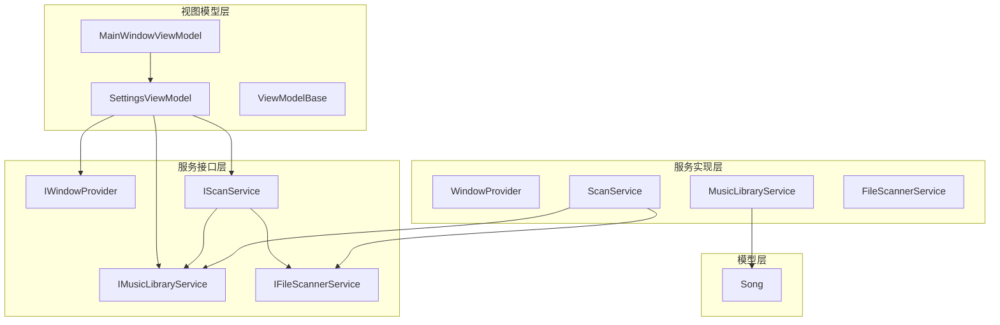
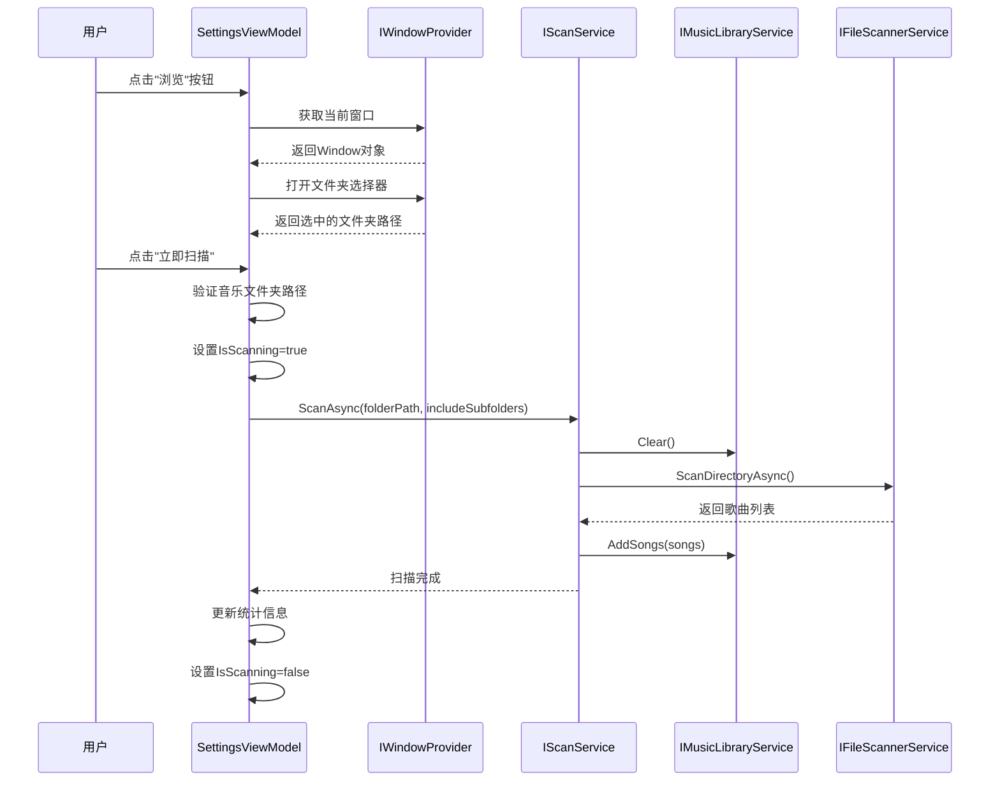
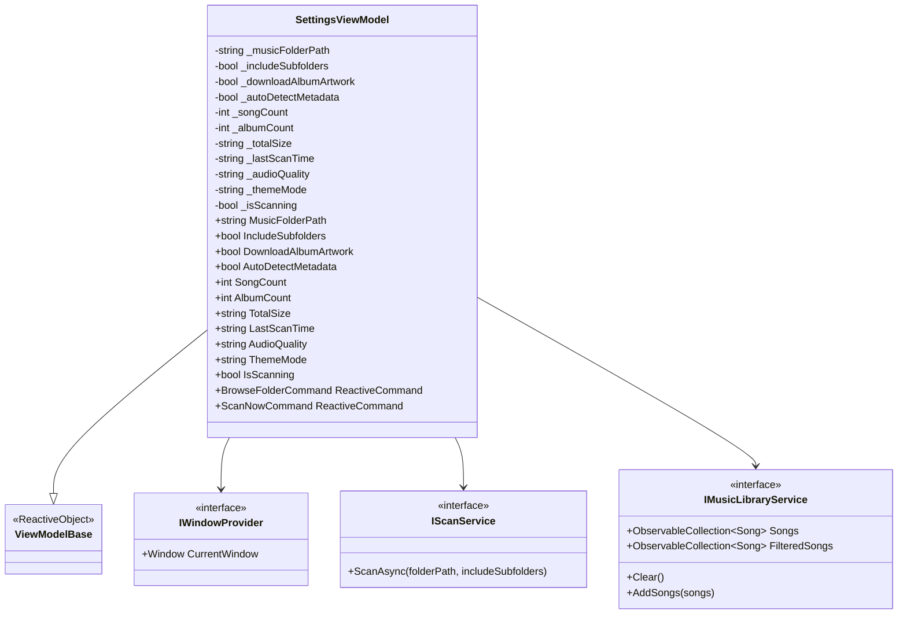
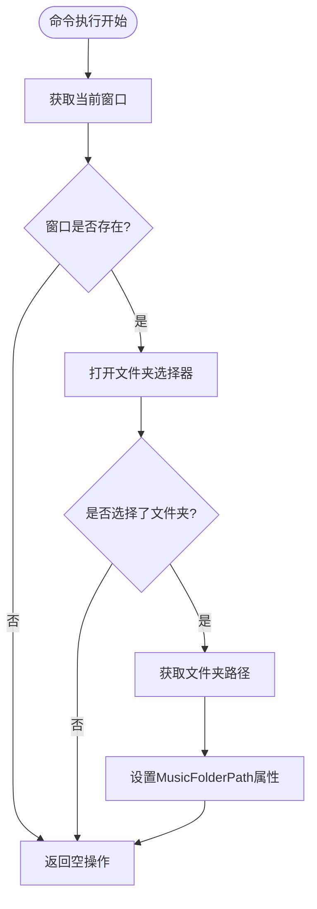
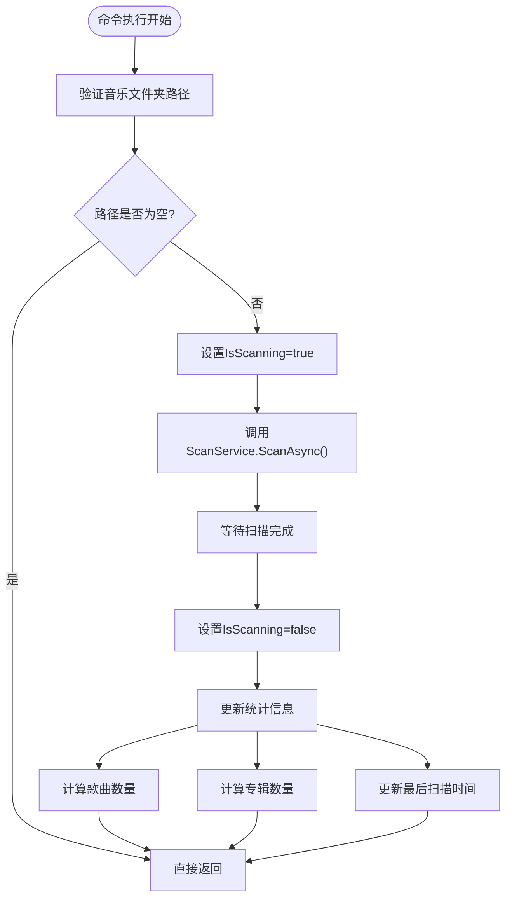
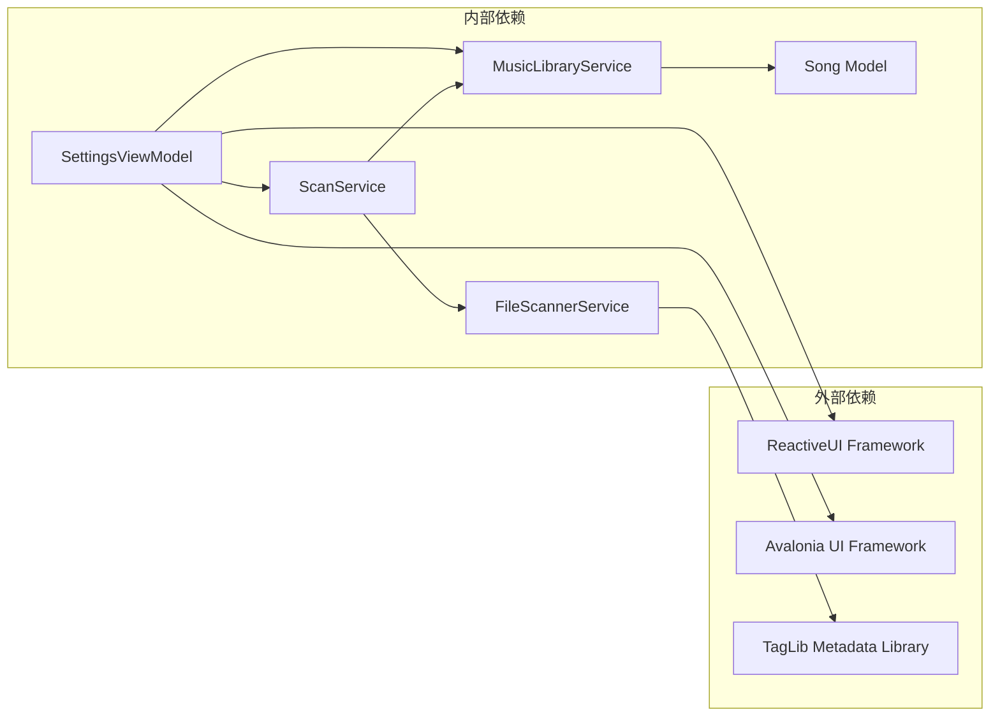

# 设置视图模型

<cite>
**本文档引用的文件**
- [SettingsViewModel.cs](file://ViewModels/SettingsViewModel.cs)
- [IWindowProvider.cs](file://Services/IWindowProvider.cs)
- [IScanService.cs](file://Services/IScanService.cs)
- [IMusicLibraryService.cs](file://Services/IMusicLibraryService.cs)
- [ScanService.cs](file://Services/ScanService.cs)
- [MusicLibraryService.cs](file://Services/MusicLibraryService.cs)
- [IFileScannerService.cs](file://Services/IFileScannerService.cs)
- [FileScannerService.cs](file://Services/FileScannerService.cs)
- [ViewModelBase.cs](file://ViewModels/ViewModelBase.cs)
- [MainWindowViewModel.cs](file://ViewModels/MainWindowViewModel.cs)
- [Song.cs](file://Models/Song.cs)
</cite>

## 目录
1. [简介](#简介)
2. [项目结构](#项目结构)
3. [核心组件](#核心组件)
4. [架构概览](#架构概览)
5. [详细组件分析](#详细组件分析)
6. [依赖关系分析](#依赖关系分析)
7. [性能考虑](#性能考虑)
8. [故障排除指南](#故障排除指南)
9. [结论](#结论)
10. [附录](#附录)

## 简介

SettingsViewModel是本地音乐播放器应用中的设置界面视图模型，负责管理用户界面的业务逻辑实现。该组件实现了扫描服务配置、音乐库设置、用户偏好管理等核心功能，并通过ReactiveUI框架实现了数据绑定和响应式编程模式。

该视图模型主要处理以下功能：
- 音乐文件夹路径选择和配置
- 扫描选项配置（子文件夹包含、专辑封面下载、元数据自动检测）
- 音乐库统计信息显示（歌曲数量、专辑数量、总大小、最后扫描时间）
- 主题模式和音频质量设置
- 扫描任务的执行和状态管理

## 项目结构

本地音乐播放器采用MVVM架构模式，SettingsViewModel位于ViewModels目录中，与Services目录中的服务层紧密协作。项目结构清晰地分离了视图模型、服务接口和具体实现。

**图表来源**
- [SettingsViewModel.cs:10-148](file://ViewModels/SettingsViewModel.cs#L10-L148)
- [IWindowProvider.cs:5-8](file://Services/IWindowProvider.cs#L5-L8)
- [IScanService.cs:5-8](file://Services/IScanService.cs#L5-L8)
- [IMusicLibraryService.cs:7-13](file://Services/IMusicLibraryService.cs#L7-L13)

**章节来源**
- [SettingsViewModel.cs:1-148](file://ViewModels/SettingsViewModel.cs#L1-L148)
- [ViewModelBase.cs:5-7](file://ViewModels/ViewModelBase.cs#L5-L7)

## 核心组件

SettingsViewModel继承自ViewModelBase基类，使用ReactiveUI框架提供的ReactiveObject作为基础类，实现了INotifyPropertyChanged接口。该设计确保了属性变更通知和数据绑定的自动化处理。

### 主要属性和功能

视图模型包含以下关键属性：

1. **音乐库配置属性**：
   - MusicFolderPath：音乐文件夹路径
   - IncludeSubfolders：是否包含子文件夹
   - DownloadAlbumArtwork：是否下载专辑封面
   - AutoDetectMetadata：是否自动检测元数据

2. **统计信息属性**：
   - SongCount：歌曲总数
   - AlbumCount：专辑数量
   - TotalSize：音乐库总大小
   - LastScanTime：最后扫描时间

3. **用户偏好属性**：
   - AudioQuality：音频质量设置
   - ThemeMode：主题模式
   - IsScanning：扫描状态指示

4. **命令属性**：
   - BrowseFolderCommand：浏览文件夹命令
   - ScanNowCommand：立即扫描命令

**章节来源**
- [SettingsViewModel.cs:16-94](file://ViewModels/SettingsViewModel.cs#L16-L94)
- [SettingsViewModel.cs:104-105](file://ViewModels/SettingsViewModel.cs#L104-L105)

## 架构概览

SettingsViewModel采用了清晰的分层架构设计，通过依赖注入模式实现了松耦合的服务交互。

**图表来源**
- [SettingsViewModel.cs:116-145](file://ViewModels/SettingsViewModel.cs#L116-L145)
- [ScanService.cs:17-22](file://Services/ScanService.cs#L17-L22)
- [MusicLibraryService.cs:12-25](file://Services/MusicLibraryService.cs#L12-L25)

### 交互模式分析

SettingsViewModel与各服务接口的交互遵循以下模式：

1. **IWindowProvider交互**：
   - 通过CurrentWindow属性获取当前应用程序窗口
   - 使用StorageProvider.OpenFolderPickerAsync方法打开文件夹选择对话框
   - 支持异步文件夹选择操作

2. **IScanService交互**：
   - 调用ScanAsync方法执行音乐库扫描
   - 接受folderPath和includeSubfolders参数
   - 异步等待扫描完成

3. **IMusicLibraryService交互**：
   - 从Songs集合获取扫描结果
   - 计算统计信息（歌曲数量、专辑数量）
   - 更新LastScanTime属性

**章节来源**
- [SettingsViewModel.cs:112-145](file://ViewModels/SettingsViewModel.cs#L112-L145)
- [IWindowProvider.cs:7](file://Services/IWindowProvider.cs#L7)
- [IScanService.cs:7](file://Services/IScanService.cs#L7)
- [IMusicLibraryService.cs:9-10](file://Services/IMusicLibraryService.cs#L9-L10)

## 详细组件分析

### 数据绑定和验证机制

SettingsViewModel实现了完整的数据绑定机制，所有属性都支持INotifyPropertyChanged通知：

**图表来源**
- [SettingsViewModel.cs:10-148](file://ViewModels/SettingsViewModel.cs#L10-L148)
- [ViewModelBase.cs:5](file://ViewModels/ViewModelBase.cs#L5)
- [IWindowProvider.cs:5](file://Services/IWindowProvider.cs#L5)
- [IScanService.cs:5](file://Services/IScanService.cs#L5)
- [IMusicLibraryService.cs:7](file://Services/IMusicLibraryService.cs#L7)

### 设置命令实现

#### 浏览文件夹命令 (BrowseFolderCommand)

浏览文件夹命令实现了用户界面的文件夹选择功能：

**图表来源**
- [SettingsViewModel.cs:116-131](file://ViewModels/SettingsViewModel.cs#L116-L131)

#### 立即扫描命令 (ScanNowCommand)

立即扫描命令处理音乐库扫描的完整流程：

**图表来源**
- [SettingsViewModel.cs:133-145](file://ViewModels/SettingsViewModel.cs#L133-L145)

### 配置参数处理

SettingsViewModel处理多种配置参数，每种参数都有特定的验证和处理逻辑：

1. **音乐文件夹路径**：
   - 使用IWindowProvider获取当前窗口
   - 通过StorageProvider.OpenFolderPickerAsync选择文件夹
   - 存储为本地路径字符串

2. **扫描选项**：
   - IncludeSubfolders：布尔值，默认true
   - DownloadAlbumArtwork：布尔值，默认true
   - AutoDetectMetadata：布尔值，默认false

3. **统计信息**：
   - SongCount：基于IMusicLibraryService.Songs.Count
   - AlbumCount：基于Distinct()去重计算
   - TotalSize：格式化字符串显示
   - LastScanTime：DateTime格式化显示

4. **用户偏好**：
   - AudioQuality：字符串枚举值，默认"Standard"
   - ThemeMode：字符串枚举值，默认"Dark"

**章节来源**
- [SettingsViewModel.cs:18-94](file://ViewModels/SettingsViewModel.cs#L18-L94)

### 错误处理策略

SettingsViewModel在错误处理方面采用了渐进式的容错策略：

1. **输入验证**：
   - 在ScanNowCommand中检查MusicFolderPath是否为空
   - 避免执行无效的扫描操作

2. **异常处理**：
   - FileScannerService对单个文件读取异常进行捕获
   - 当元数据读取失败时，使用文件名作为后备标题
   - 继续处理其他文件，避免整个扫描过程失败

3. **状态管理**：
   - 使用IsScanning属性控制UI状态
   - 确保扫描完成后正确重置状态

**章节来源**
- [SettingsViewModel.cs:135-145](file://ViewModels/SettingsViewModel.cs#L135-L145)
- [FileScannerService.cs:54-67](file://Services/FileScannerService.cs#L54-L67)

## 依赖关系分析

SettingsViewModel的依赖关系体现了良好的依赖注入设计原则：

**图表来源**
- [SettingsViewModel.cs:1-6](file://ViewModels/SettingsViewModel.cs#L1-L6)
- [ScanService.cs:8-9](file://Services/ScanService.cs#L8-L9)
- [FileScannerService.cs:7](file://Services/FileScannerService.cs#L7)

### 依赖注入配置

SettingsViewModel通过构造函数注入依赖，实现了松耦合的设计：

1. **IWindowProvider**：提供窗口访问能力
2. **IScanService**：封装扫描业务逻辑
3. **IMusicLibraryService**：管理音乐库数据

这种设计允许在测试环境中轻松替换依赖项，提高了代码的可测试性和可维护性。

**章节来源**
- [SettingsViewModel.cs:107-114](file://ViewModels/SettingsViewModel.cs#L107-L114)

## 性能考虑

### 扫描性能优化

SettingsViewModel在性能方面采用了多项优化策略：

1. **异步操作**：
   - 所有文件系统操作都是异步的
   - 避免阻塞UI线程
   - 提供进度报告机制

2. **内存管理**：
   - 使用ObservableCollection进行高效的数据绑定
   - 及时清理不再使用的数据
   - 避免重复计算统计信息

3. **文件过滤**：
   - 支持多种音频格式扩展名
   - 使用LINQ进行高效的文件筛选
   - 支持取消扫描操作

### 用户体验优化

1. **状态反馈**：
   - IsScanning属性提供实时扫描状态
   - 最后扫描时间显示最近的扫描结果
   - 按钮禁用机制防止重复操作

2. **错误恢复**：
   - 单个文件失败不影响整体扫描
   - 自动回退到文件名作为标题
   - 继续处理剩余文件

**章节来源**
- [FileScannerService.cs:16-25](file://Services/FileScannerService.cs#L16-L25)
- [FileScannerService.cs:45-72](file://Services/FileScannerService.cs#L45-L72)

## 故障排除指南

### 常见问题及解决方案

1. **扫描无结果**：
   - 检查音乐文件夹路径是否正确
   - 验证文件扩展名是否在支持列表中
   - 确认文件权限设置

2. **UI无响应**：
   - 确认IsScanning状态正确更新
   - 检查异步操作是否正常完成
   - 验证ReactiveCommand是否正确绑定

3. **元数据读取失败**：
   - 检查TagLib库是否正确安装
   - 验证音频文件完整性
   - 查看异常日志信息

### 调试技巧

1. **属性变更监控**：
   - 使用ReactiveUI的调试工具
   - 监控属性变更事件
   - 检查数据绑定状态

2. **服务层调试**：
   - 添加日志记录
   - 验证依赖注入配置
   - 检查接口实现

**章节来源**
- [SettingsViewModel.cs:133-145](file://ViewModels/SettingsViewModel.cs#L133-L145)
- [FileScannerService.cs:93-101](file://Services/FileScannerService.cs#L93-L101)

## 结论

SettingsViewModel是一个设计良好、功能完整的设置界面视图模型，它成功地实现了以下目标：

1. **清晰的职责分离**：通过依赖注入实现了松耦合设计
2. **完整的数据绑定**：支持双向数据绑定和属性变更通知
3. **健壮的错误处理**：提供了多层容错机制
4. **优秀的用户体验**：异步操作和状态反馈确保流畅的用户交互

该组件为本地音乐播放器提供了强大的设置管理功能，支持用户自定义扫描行为、管理音乐库配置和调整应用偏好设置。其架构设计为未来的功能扩展奠定了坚实的基础。

## 附录

### 最佳实践建议

1. **代码组织**：
   - 保持属性和命令的清晰分离
   - 使用partial类组织大型视图模型
   - 实现适当的接口隔离

2. **性能优化**：
   - 合理使用异步操作
   - 避免不必要的属性计算
   - 优化ObservableCollection的使用

3. **用户体验**：
   - 提供清晰的状态反馈
   - 实现合理的错误提示
   - 支持键盘快捷键操作

4. **测试策略**：
   - 为每个命令编写单元测试
   - 使用Mock对象测试依赖注入
   - 验证数据绑定的正确性