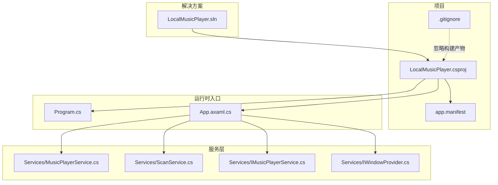
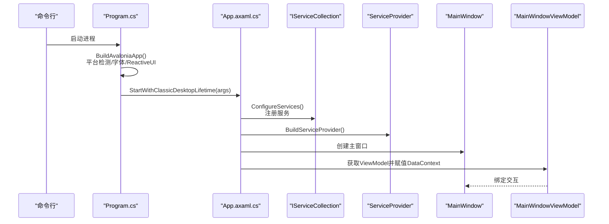
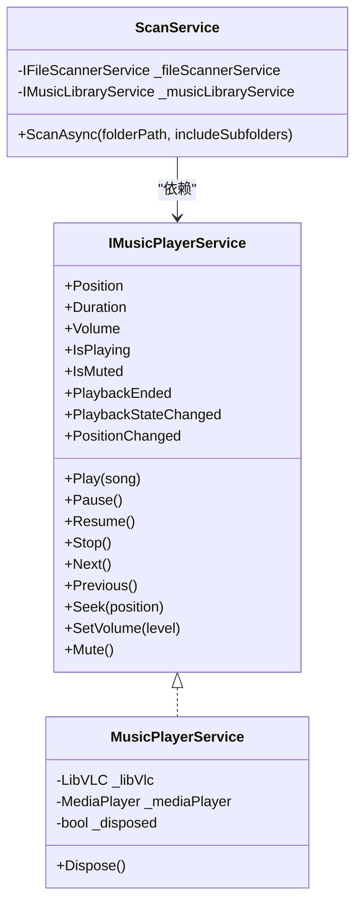
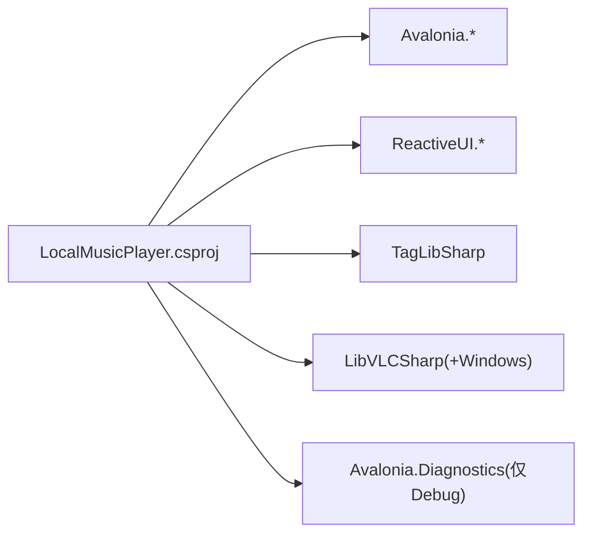

# 部署和发布

<cite>
**本文引用的文件**
- [LocalMusicPlayer.csproj](file://LocalMusicPlayer.csproj)
- [app.manifest](file://app.manifest)
- [Program.cs](file://Program.cs)
- [App.axaml.cs](file://App.axaml.cs)
- [LocalMusicPlayer.sln](file://LocalMusicPlayer.sln)
- [obj/LocalMusicPlayer.csproj.nuget.g.props](file://obj/LocalMusicPlayer.csproj.nuget.g.props)
- [.gitignore](file://.gitignore)
- [Services/MusicPlayerService.cs](file://Services/MusicPlayerService.cs)
- [Services/ScanService.cs](file://Services/ScanService.cs)
- [Services/IMusicPlayerService.cs](file://Services/IMusicPlayerService.cs)
- [Services/IWindowProvider.cs](file://Services/IWindowProvider.cs)
- [.trae/specs/core-features/tasks.md](file://.trae/specs/core-features/tasks.md)
- [.trae/specs/core-features/spec.md](file://.trae/specs/core-features/spec.md)
- [pencil-new.pen](file://pencil-new.pen)
</cite>

## 目录
1. [简介](#简介)
2. [项目结构](#项目结构)
3. [核心组件](#核心组件)
4. [架构总览](#架构总览)
5. [详细组件分析](#详细组件分析)
6. [依赖分析](#依赖分析)
7. [性能考虑](#性能考虑)
8. [故障排除指南](#故障排除指南)
9. [结论](#结论)
10. [附录](#附录)

## 简介
本文件面向LocalMusicPlayer项目的部署与发布，覆盖构建配置、编译选项（Debug/Release差异）、平台特定设置与依赖管理（Windows/macOS/Linux）、应用程序清单与数字签名、跨平台打包与分发策略、版本管理与发布流程、性能优化与资源清理、以及常见部署问题排查。内容基于仓库中实际存在的工程文件与源码进行整理，确保可操作性与可追溯性。

## 项目结构
项目采用C#与Avalonia UI框架，目标框架为.NET 9.0，输出类型为WinExe，并通过NuGet包管理第三方依赖。解决方案包含Debug与Release两种配置，适用于多平台桌面应用开发与部署。

图表来源
- [LocalMusicPlayer.sln:1-17](file://LocalMusicPlayer.sln#L1-L17)
- [LocalMusicPlayer.csproj:1-43](file://LocalMusicPlayer.csproj#L1-L43)
- [Program.cs:1-20](file://Program.cs#L1-L20)
- [App.axaml.cs:1-53](file://App.axaml.cs#L1-L53)
- [Services/MusicPlayerService.cs:1-129](file://Services/MusicPlayerService.cs#L1-L129)
- [Services/ScanService.cs:1-24](file://Services/ScanService.cs#L1-L24)
- [Services/IMusicPlayerService.cs:1-27](file://Services/IMusicPlayerService.cs#L1-L27)
- [Services/IWindowProvider.cs:1-9](file://Services/IWindowProvider.cs#L1-L9)
- [.gitignore:1-5](file://.gitignore#L1-L5)

章节来源
- [LocalMusicPlayer.sln:1-17](file://LocalMusicPlayer.sln#L1-L17)
- [LocalMusicPlayer.csproj:1-43](file://LocalMusicPlayer.csproj#L1-L43)
- [Program.cs:1-20](file://Program.cs#L1-L20)
- [App.axaml.cs:1-53](file://App.axaml.cs#L1-L53)
- [.gitignore:1-5](file://.gitignore#L1-L5)

## 核心组件
- 构建与配置
  - 目标框架：net9.0
  - 输出类型：WinExe（Windows可执行）
  - 应用清单：app.manifest（Windows专用）
  - Avalonia默认绑定：启用编译期绑定
  - 调试诊断：仅在Debug保留Avalonia.Diagnostics
- 运行时入口
  - Program.cs：启动Avalonia应用，平台检测，字体与ReactiveUI集成
  - App.axaml.cs：依赖注入容器初始化，主窗口与视图模型装配
- 服务层
  - MusicPlayerService：基于LibVLCSharp的播放器实现，支持事件通知与显式释放
  - ScanService：扫描目录并将结果注入音乐库服务
  - IMusicPlayerService/IWindowProvider：服务接口契约

章节来源
- [LocalMusicPlayer.csproj:1-43](file://LocalMusicPlayer.csproj#L1-L43)
- [Program.cs:1-20](file://Program.cs#L1-L20)
- [App.axaml.cs:1-53](file://App.axaml.cs#L1-L53)
- [Services/MusicPlayerService.cs:1-129](file://Services/MusicPlayerService.cs#L1-L129)
- [Services/ScanService.cs:1-24](file://Services/ScanService.cs#L1-L24)
- [Services/IMusicPlayerService.cs:1-27](file://Services/IMusicPlayerService.cs#L1-L27)
- [Services/IWindowProvider.cs:1-9](file://Services/IWindowProvider.cs#L1-L9)

## 架构总览
下图展示应用启动、依赖注入与服务装配的关键流程。

图表来源
- [Program.cs:14-20](file://Program.cs#L14-L20)
- [App.axaml.cs:18-51](file://App.axaml.cs#L18-L51)

## 详细组件分析

### 构建配置与编译选项（Debug/Release）
- 目标框架与输出类型
  - 目标框架：net9.0
  - 输出类型：WinExe（Windows桌面应用）
- 调试与发布差异
  - Debug：保留Avalonia.Diagnostics，便于调试
  - Release：排除Avalonia.Diagnostics，减小体积与运行时开销
- 平台检测与字体
  - 使用平台检测以适配不同桌面环境
  - 内置Inter字体加载
- 依赖注入与绑定
  - 启用Avalonia编译期绑定，提升XAML绑定性能与安全性

章节来源
- [LocalMusicPlayer.csproj:2-9](file://LocalMusicPlayer.csproj#L2-L9)
- [LocalMusicPlayer.csproj:26-30](file://LocalMusicPlayer.csproj#L26-L30)
- [Program.cs:14-20](file://Program.cs#L14-L20)

### 平台特定设置与依赖管理
- Windows
  - 应用清单：app.manifest用于兼容性声明与透明窗口等特性
  - LibVLCSharp.Windows：Windows平台的VLC本地库依赖
- macOS/Linux
  - 目标框架为net9.0，Avalonia.Desktop支持跨平台桌面
  - 通过平台检测自动适配
- NuGet包管理
  - Avalonia系列、ReactiveUI、TagLibSharp、LibVLCSharp等
  - 通过obj/*.nuget.g.props可见构建导入链

章节来源
- [app.manifest:1-19](file://app.manifest#L1-L19)
- [LocalMusicPlayer.csproj:21-41](file://LocalMusicPlayer.csproj#L21-L41)
- [obj/LocalMusicPlayer.csproj.nuget.g.props:15-23](file://obj/LocalMusicPlayer.csproj.nuget.g.props#L15-L23)

### 应用程序清单（app.manifest）与数字签名
- 清单用途
  - Windows专用，声明兼容的操作系统版本，避免透明窗口与嵌入控件问题
- 数字签名
  - 发布前建议对WinExe进行代码签名，以提升用户信任度与系统兼容性
  - 清单中assemblyIdentity包含版本号，建议与产品版本保持一致或由CI统一注入

章节来源
- [app.manifest:3-18](file://app.manifest#L3-L18)

### 服务与资源生命周期管理
- 播放器服务
  - 显式实现IDisposable，在Dispose中停止播放并释放LibVLC与MediaPlayer
  - 通过事件向外通知播放结束、状态变化与位置变化
- 扫描服务
  - 清空音乐库后异步扫描目录并将结果注入库
- 依赖注入
  - 在App初始化阶段注册服务并构建ServiceProvider
  - 主窗口Loaded事件后装配DataContext，确保UI与服务正确绑定

图表来源
- [Services/IMusicPlayerService.cs:1-27](file://Services/IMusicPlayerService.cs#L1-L27)
- [Services/MusicPlayerService.cs:7-129](file://Services/MusicPlayerService.cs#L7-L129)
- [Services/ScanService.cs:6-23](file://Services/ScanService.cs#L6-L23)

章节来源
- [Services/MusicPlayerService.cs:120-129](file://Services/MusicPlayerService.cs#L120-L129)
- [Services/ScanService.cs:17-22](file://Services/ScanService.cs#L17-L22)
- [App.axaml.cs:41-51](file://App.axaml.cs#L41-L51)

### 依赖注入与主窗口装配
- 服务注册
  - IWindowProvider、IFileScannerService、IMusicPlayerService、IPlaylistService、IMusicLibraryService、IScanService
  - MainWindowViewModel、SettingsViewModel按需注册
- 主窗口装配
  - 创建MainWindow并设置CurrentWindow
  - Loaded事件后获取ViewModel并赋值DataContext

章节来源
- [App.axaml.cs:22-35](file://App.axaml.cs#L22-L35)
- [App.axaml.cs:41-51](file://App.axaml.cs#L41-L51)

### 版本信息与构建信息
- 版本信息
  - 关联资产中包含“Version”字段，用于界面显示
- 构建日期
  - 关联资产中包含“Build”字段，用于界面显示

章节来源
- [pencil-new.pen:3260-3280](file://pencil-new.pen#L3260-L3280)
- [pencil-new.pen:3305-3315](file://pencil-new.pen#L3305-L3315)

## 依赖分析
- 直接依赖
  - Avalonia生态（Avalonia、Avalonia.Desktop、Avalonia.Themes.Fluent、Avalonia.Fonts.Inter）
  - ReactiveUI与源生成器
  - TagLibSharp（音频元数据）
  - LibVLCSharp（播放内核），Windows平台额外依赖VideoLAN.LibVLC.Windows
- 间接依赖
  - .NET 9.0运行时与平台检测
  - MSBuild/NuGet工具链
- 配置耦合
  - Debug/Release对Avalonia.Diagnostics的包含策略
  - 应用清单与Windows兼容性

图表来源
- [LocalMusicPlayer.csproj:21-41](file://LocalMusicPlayer.csproj#L21-L41)
- [LocalMusicPlayer.csproj:26-30](file://LocalMusicPlayer.csproj#L26-L30)

章节来源
- [LocalMusicPlayer.csproj:21-41](file://LocalMusicPlayer.csproj#L21-L41)
- [obj/LocalMusicPlayer.csproj.nuget.g.props:15-23](file://obj/LocalMusicPlayer.csproj.nuget.g.props#L15-L23)

## 性能考虑
- 构建优化
  - Release模式排除Avalonia.Diagnostics，减少运行时开销
  - 启用编译期绑定，降低运行时反射成本
- 播放器资源管理
  - 显式释放LibVLC与MediaPlayer，避免句柄泄漏
  - 音量静音切换时保存/恢复音量，避免重复设置
- 扫描与UI
  - 扫描服务清空后再注入，避免重复累积
  - ViewModel与服务解耦，便于单元测试与性能隔离

章节来源
- [LocalMusicPlayer.csproj:26-30](file://LocalMusicPlayer.csproj#L26-L30)
- [Services/MusicPlayerService.cs:120-129](file://Services/MusicPlayerService.cs#L120-L129)
- [Services/ScanService.cs:19-21](file://Services/ScanService.cs#L19-L21)

## 故障排除指南
- 构建产物被忽略
  - .gitignore包含bin/、obj/、packages/等，确保不会提交构建产物
- Windows透明窗口/嵌入控件问题
  - 确保app.manifest存在且未被删除，避免兼容性问题
- 播放器无法释放导致资源占用
  - 确保在合适时机调用Dispose，避免媒体播放器与LibVLC未释放
- 依赖缺失（Windows）
  - 确认已安装VideoLAN.LibVLC.Windows，否则播放功能不可用
- 调试诊断影响发布
  - Release模式应排除Avalonia.Diagnostics，避免不必要的体积与开销

章节来源
- [.gitignore:1-5](file://.gitignore#L1-L5)
- [app.manifest:3-18](file://app.manifest#L3-L18)
- [Services/MusicPlayerService.cs:120-129](file://Services/MusicPlayerService.cs#L120-L129)
- [LocalMusicPlayer.csproj:39](file://LocalMusicPlayer.csproj#L39)
- [LocalMusicPlayer.csproj:26-30](file://LocalMusicPlayer.csproj#L26-L30)

## 结论
本项目基于.NET 9.0与Avalonia实现了跨平台桌面音乐播放器的基础能力，通过明确的构建配置（Debug/Release）、平台检测与清单设置、以及服务层的资源管理与依赖注入，为后续打包、签名与分发奠定了基础。建议在CI/CD中统一注入版本与构建日期，并在Windows平台完成代码签名，以提升用户体验与系统兼容性。

## 附录

### 跨平台打包与分发策略
- Windows
  - 使用应用清单与代码签名，配合安装程序制作工具（如Inno Setup、WiX等）产出安装包
  - 可将VideoLAN.LibVLC.Windows作为运行时依赖一并打包
- macOS/Linux
  - 使用Avalonia.Desktop进行原生打包，结合包管理器或AppImage/Flatpak分发
  - 注意平台字体与系统主题的适配
- 通用建议
  - 在CI中分别构建Debug/Release工件，按需上传至发布渠道
  - 对可执行文件进行SHA校验与完整性检查

### 版本管理与发布流程
- 语义化版本控制
  - 建议采用主.次.修订格式，结合变更日志维护
- 变更日志
  - 记录重大功能、修复与破坏性变更，便于用户升级
- 构建信息
  - 在资产中维护“Version”与“Build”信息，便于用户反馈与问题定位

章节来源
- [pencil-new.pen:3260-3280](file://pencil-new.pen#L3260-L3280)
- [pencil-new.pen:3305-3315](file://pencil-new.pen#L3305-L3315)