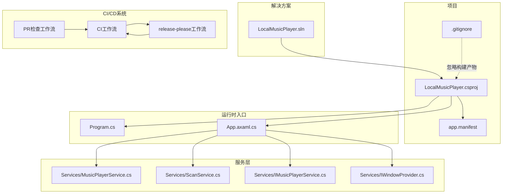
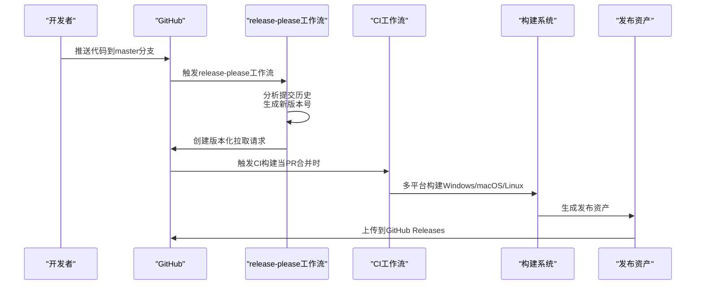
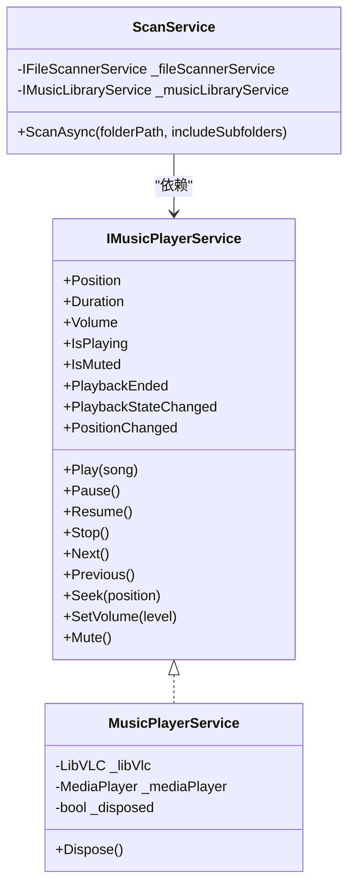
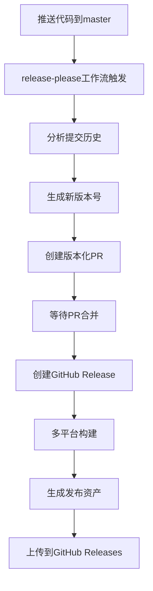
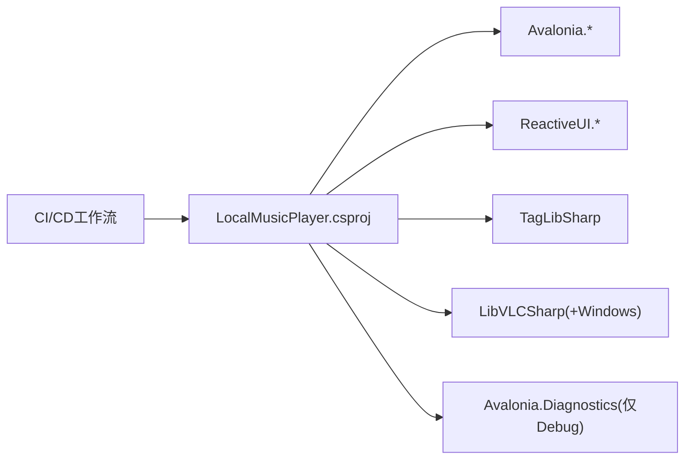

# 部署和发布

<cite>
**本文引用的文件**
- [LocalMusicPlayer.csproj](file://LocalMusicPlayer.csproj)
- [app.manifest](file://app.manifest)
- [Program.cs](file://Program.cs)
- [App.axaml.cs](file://App.axaml.cs)
- [LocalMusicPlayer.sln](file://LocalMusicPlayer.sln)
- [obj/LocalMusicPlayer.csproj.nuget.g.props](file://obj/LocalMusicPlayer.csproj.nuget.g.props)
- [.gitignore](file://.gitignore)
- [Services/MusicPlayerService.cs](file://Services/MusicPlayerService.cs)
- [Services/ScanService.cs](file://Services/ScanService.cs)
- [Services/IMusicPlayerService.cs](file://Services/IMusicPlayerService.cs)
- [Services/IWindowProvider.cs](file://Services/IWindowProvider.cs)
- [.release-please-config.json](file://.release-please-config.json)
- [.release-please-manifest.json](file://.release-please-manifest.json)
- [.github/workflows/release-please.yml](file://.github/workflows/release-please.yml)
- [.github/workflows/ci.yml](file://.github/workflows/ci.yml)
- [.github/workflows/pr-checks.yml](file://.github/workflows/pr-checks.yml)
- [README.md](file://README.md)
- [pencil-new.pen](file://pencil-new.pen)
</cite>

## 更新摘要
**所做更改**
- 新增Google release-please自动化发布系统章节，替代手动发布流程
- 更新CI/CD工作流配置，包含新的自动化发布工作流
- 更新版本管理策略，采用语义化版本控制和变更日志维护
- 新增跨平台打包与分发策略章节
- 更新性能优化和故障排除指南

## 目录
1. [简介](#简介)
2. [项目结构](#项目结构)
3. [核心组件](#核心组件)
4. [架构总览](#架构总览)
5. [详细组件分析](#详细组件分析)
6. [依赖分析](#依赖分析)
7. [性能考虑](#性能考虑)
8. [故障排除指南](#故障排除指南)
9. [结论](#结论)
10. [附录](#附录)

## 简介
本文件面向LocalMusicPlayer项目的部署与发布，覆盖构建配置、编译选项（Debug/Release差异）、平台特定设置与依赖管理（Windows/macOS/Linux）、应用程序清单与数字签名、**新增的Google release-please自动化发布系统**、**CI/CD工作流配置**、**跨平台打包与分发策略**、**版本管理与发布流程**、性能优化与资源清理、以及常见部署问题排查。内容基于仓库中实际存在的工程文件与源码进行整理，确保可操作性与可追溯性。

## 项目结构
项目采用C#与Avalonia UI框架，目标框架为.NET 9.0，输出类型为WinExe，并通过NuGet包管理第三方依赖。解决方案包含Debug与Release两种配置，适用于多平台桌面应用开发与部署。**新增的CI/CD系统包含三个主要工作流：CI构建、PR检查和release-please自动化发布**。

**章节来源**
- [LocalMusicPlayer.sln:1-17](file://LocalMusicPlayer.sln#L1-L17)
- [LocalMusicPlayer.csproj:1-44](file://LocalMusicPlayer.csproj#L1-L44)
- [Program.cs:1-20](file://Program.cs#L1-L20)
- [App.axaml.cs:1-55](file://App.axaml.cs#L1-L55)
- [.gitignore:1-5](file://.gitignore#L1-L5)
- [.github/workflows/release-please.yml:1-100](file://.github/workflows/release-please.yml#L1-L100)
- [.github/workflows/ci.yml:1-61](file://.github/workflows/ci.yml#L1-L61)
- [.github/workflows/pr-checks.yml:1-83](file://.github/workflows/pr-checks.yml#L1-L83)

## 核心组件
- 构建与配置
  - 目标框架：net9.0
  - 输出类型：WinExe（Windows可执行）
  - 应用清单：app.manifest（Windows专用）
  - Avalonia默认绑定：启用编译期绑定
  - 调试诊断：仅在Debug保留Avalonia.Diagnostics
- 运行时入口
  - Program.cs：启动Avalonia应用，平台检测，字体与ReactiveUI集成
  - App.axaml.cs：依赖注入容器初始化，主窗口与视图模型装配
- 服务层
  - MusicPlayerService：基于LibVLCSharp的播放器实现，支持事件通知与显式释放
  - ScanService：扫描目录并将结果注入音乐库服务
  - IMusicPlayerService/IWindowProvider：服务接口契约
- **CI/CD系统**
  - **CI工作流**：在所有推送和PR上执行构建、测试和质量检查
  - **PR检查工作流**：专门针对Pull Request的构建和代码质量检查
  - **release-please工作流**：自动化版本管理和发布创建

**章节来源**
- [LocalMusicPlayer.csproj:1-44](file://LocalMusicPlayer.csproj#L1-L44)
- [Program.cs:1-20](file://Program.cs#L1-L20)
- [App.axaml.cs:1-55](file://App.axaml.cs#L1-L55)
- [Services/MusicPlayerService.cs:1-129](file://Services/MusicPlayerService.cs#L1-L129)
- [Services/ScanService.cs:1-24](file://Services/ScanService.cs#L1-L24)
- [Services/IMusicPlayerService.cs:1-27](file://Services/IMusicPlayerService.cs#L1-L27)
- [Services/IWindowProvider.cs:1-9](file://Services/IWindowProvider.cs#L1-L9)
- [.github/workflows/release-please.yml:1-100](file://.github/workflows/release-please.yml#L1-L100)
- [.github/workflows/ci.yml:1-61](file://.github/workflows/ci.yml#L1-L61)
- [.github/workflows/pr-checks.yml:1-83](file://.github/workflows/pr-checks.yml#L1-L83)

## 架构总览
下图展示应用启动、依赖注入与服务装配的关键流程，以及CI/CD自动化发布系统的工作原理。

**图表来源**
- [.github/workflows/release-please.yml:12-25](file://.github/workflows/release-please.yml#L12-L25)
- [.github/workflows/release-please.yml:26-100](file://.github/workflows/release-please.yml#L26-L100)
- [.github/workflows/ci.yml:22-61](file://.github/workflows/ci.yml#L22-L61)

## 详细组件分析

### 构建配置与编译选项（Debug/Release）
- 目标框架与输出类型
  - 目标框架：net9.0
  - 输出类型：WinExe（Windows桌面应用）
- 调试与发布差异
  - Debug：保留Avalonia.Diagnostics，便于调试
  - Release：排除Avalonia.Diagnostics，减小体积与运行时开销
- 平台检测与字体
  - 使用平台检测以适配不同桌面环境
  - 内置Inter字体加载
- 依赖注入与绑定
  - 启用Avalonia编译期绑定，提升XAML绑定性能与安全性

**章节来源**
- [LocalMusicPlayer.csproj:2-9](file://LocalMusicPlayer.csproj#L2-L9)
- [LocalMusicPlayer.csproj:26-30](file://LocalMusicPlayer.csproj#L26-L30)
- [Program.cs:14-20](file://Program.cs#L14-L20)

### 平台特定设置与依赖管理
- Windows
  - 应用清单：app.manifest用于兼容性声明与透明窗口等特性
  - LibVLCSharp.Windows：Windows平台的VLC本地库依赖
- macOS/Linux
  - 目标框架为net9.0，Avalonia.Desktop支持跨平台桌面
  - 通过平台检测自动适配
- NuGet包管理
  - Avalonia系列、ReactiveUI、TagLibSharp、LibVLCSharp等
  - 通过obj/*.nuget.g.props可见构建导入链

**章节来源**
- [app.manifest:1-19](file://app.manifest#L1-L19)
- [LocalMusicPlayer.csproj:21-42](file://LocalMusicPlayer.csproj#L21-L42)
- [obj/LocalMusicPlayer.csproj.nuget.g.props:15-23](file://obj/LocalMusicPlayer.csproj.nuget.g.props#L15-L23)

### 应用程序清单（app.manifest）与数字签名
- 清单用途
  - Windows专用，声明兼容的操作系统版本，避免透明窗口与嵌入控件问题
- 数字签名
  - 发布前建议对WinExe进行代码签名，以提升用户信任度与系统兼容性
  - 清单中assemblyIdentity包含版本号，建议与产品版本保持一致或由CI统一注入

**章节来源**
- [app.manifest:3-18](file://app.manifest#L3-L18)

### 服务与资源生命周期管理
- 播放器服务
  - 显式实现IDisposable，在Dispose中停止播放并释放LibVLC与MediaPlayer
  - 通过事件向外通知播放结束、状态变化与位置变化
- 扫描服务
  - 清空音乐库后异步扫描目录并将结果注入库
- 依赖注入
  - 在App初始化阶段注册服务并构建ServiceProvider
  - 主窗口Loaded事件后装配DataContext，确保UI与服务正确绑定

**图表来源**
- [Services/IMusicPlayerService.cs:1-27](file://Services/IMusicPlayerService.cs#L1-L27)
- [Services/MusicPlayerService.cs:7-129](file://Services/MusicPlayerService.cs#L7-L129)
- [Services/ScanService.cs:6-23](file://Services/ScanService.cs#L6-L23)

**章节来源**
- [Services/MusicPlayerService.cs:120-129](file://Services/MusicPlayerService.cs#L120-L129)
- [Services/ScanService.cs:17-22](file://Services/ScanService.cs#L17-L22)
- [App.axaml.cs:41-53](file://App.axaml.cs#L41-L53)

### 依赖注入与主窗口装配
- 服务注册
  - IWindowProvider、IConfigurationService、IAlbumArtService、IFileScannerService、IMusicPlayerService、IPlaylistService、IMusicLibraryService、IScanService
  - MainWindowViewModel、SettingsViewModel按需注册
- 主窗口装配
  - 创建MainWindow并设置CurrentWindow
  - Loaded事件后获取ViewModel并赋值DataContext

**章节来源**
- [App.axaml.cs:22-35](file://App.axaml.cs#L22-L35)
- [App.axaml.cs:41-53](file://App.axaml.cs#L41-L53)

### Google Release-Please自动化发布系统

**更新** 新增Google release-please自动化发布系统，完全替代手动发布流程

#### 系统概述
Google release-please是一个基于Conventional Commits规范的自动化发布工具，能够根据Git提交历史自动生成版本号、更新版本文件和创建GitHub Releases。

#### 配置文件分析
- **.release-please-config.json**：定义了发布配置，包括：
  - 发布类型：simple（简单发布）
  - 变更日志路径：CHANGELOG.md
  - 支持的提交类型：feat、fix、docs、style、refactor、perf、test、build、ci、chore等
  - 额外文件同步：LocalMusicPlayer.csproj（自动更新版本号）

- **.release-please-manifest.json**：维护当前版本状态，初始为"0.0.0"

#### 工作流流程
1. **触发条件**：推送到master分支
2. **版本分析**：分析提交历史，确定版本号递增级别
3. **PR创建**：创建版本化拉取请求，包含版本更新和变更日志
4. **发布创建**：当PR合并时，自动创建GitHub Release
5. **资产生成**：多平台构建并上传发布资产

**图表来源**
- [.github/workflows/release-please.yml:12-25](file://.github/workflows/release-please.yml#L12-L25)
- [.github/workflows/release-please.yml:26-100](file://.github/workflows/release-please.yml#L26-L100)

**章节来源**
- [.release-please-config.json:1-63](file://.release-please-config.json#L1-L63)
- [.release-please-manifest.json:1-3](file://.release-please-manifest.json#L1-L3)
- [.github/workflows/release-please.yml:1-100](file://.github/workflows/release-please.yml#L1-L100)

### CI/CD工作流配置

**更新** 新增完整的CI/CD工作流配置，包含三个主要工作流

#### CI工作流（ci.yml）
- **触发条件**：推送和PR到master、develop分支
- **矩阵构建**：同时在ubuntu-latest、windows-latest、macos-latest上构建Debug和Release版本
- **测试集成**：dotnet test命令，允许测试失败继续执行
- **工件上传**：Windows Release版本上传构建工件

#### PR检查工作流（pr-checks.yml）
- **触发条件**：Pull Request打开、同步、重新打开
- **构建检查**：在所有平台上构建Debug和Release版本
- **代码质量**：使用dotnet-format验证代码格式
- **安全扫描**：检查易受攻击的包依赖

#### release-please工作流（release-please.yml）
- **自动化发布**：基于Conventional Commits自动创建版本
- **多平台构建**：Windows（x64、x86）、Linux（x64）、macOS（x64、arm64）
- **资产打包**：生成zip/tar.gz压缩包
- **自动发布**：上传到GitHub Releases

**章节来源**
- [.github/workflows/ci.yml:1-61](file://.github/workflows/ci.yml#L1-L61)
- [.github/workflows/pr-checks.yml:1-83](file://.github/workflows/pr-checks.yml#L1-L83)
- [.github/workflows/release-please.yml:1-100](file://.github/workflows/release-please.yml#L1-L100)

### 版本信息与构建信息
- 版本信息
  - 关联资产中包含"Version"字段，用于界面显示
- 构建日期
  - 关联资产中包含"Build"字段，用于界面显示
- **自动化版本管理**
  - release-please自动更新版本号
  - Conventional Commits规范确保版本递增的准确性

**章节来源**
- [pencil-new.pen:3260-3280](file://pencil-new.pen#L3260-L3280)
- [pencil-new.pen:3305-3315](file://pencil-new.pen#L3305-L3315)
- [.release-please-config.json:58-60](file://.release-please-config.json#L58-L60)

## 依赖分析
- 直接依赖
  - Avalonia生态（Avalonia、Avalonia.Desktop、Avalonia.Themes.Fluent、Avalonia.Fonts.Inter）
  - ReactiveUI与源生成器
  - TagLibSharp（音频元数据）
  - LibVLCSharp（播放内核），Windows平台额外依赖VideoLAN.LibVLC.Windows
- 间接依赖
  - .NET 9.0运行时与平台检测
  - MSBuild/NuGet工具链
- 配置耦合
  - Debug/Release对Avalonia.Diagnostics的包含策略
  - 应用清单与Windows兼容性
  - **CI/CD工作流中的多平台依赖管理**

**图表来源**
- [LocalMusicPlayer.csproj:21-42](file://LocalMusicPlayer.csproj#L21-L42)
- [LocalMusicPlayer.csproj:26-30](file://LocalMusicPlayer.csproj#L26-L30)
- [.github/workflows/release-please.yml:65-73](file://.github/workflows/release-please.yml#L65-L73)

**章节来源**
- [LocalMusicPlayer.csproj:21-42](file://LocalMusicPlayer.csproj#L21-L42)
- [obj/LocalMusicPlayer.csproj.nuget.g.props:15-23](file://obj/LocalMusicPlayer.csproj.nuget.g.props#L15-L23)

## 性能考虑
- 构建优化
  - Release模式排除Avalonia.Diagnostics，减少运行时开销
  - 启用编译期绑定，降低运行时反射成本
- 播放器资源管理
  - 显式释放LibVLC与MediaPlayer，避免句柄泄漏
  - 音量静音切换时保存/恢复音量，避免重复设置
- 扫描与UI
  - 扫描服务清空后再注入，避免重复累积
  - ViewModel与服务解耦，便于单元测试与性能隔离
- **CI/CD性能优化**
  - 并行矩阵构建，充分利用GitHub Actions资源
  - 条件执行，避免不必要的步骤
  - 缓存依赖，减少构建时间

**章节来源**
- [LocalMusicPlayer.csproj:26-30](file://LocalMusicPlayer.csproj#L26-L30)
- [Services/MusicPlayerService.cs:120-129](file://Services/MusicPlayerService.cs#L120-L129)
- [Services/ScanService.cs:19-21](file://Services/ScanService.cs#L19-L21)
- [.github/workflows/ci.yml:25-29](file://.github/workflows/ci.yml#L25-L29)

## 故障排除指南
- 构建产物被忽略
  - .gitignore包含bin/、obj/、packages/等，确保不会提交构建产物
- Windows透明窗口/嵌入控件问题
  - 确保app.manifest存在且未被删除，避免兼容性问题
- 播放器无法释放导致资源占用
  - 确保在合适时机调用Dispose，避免媒体播放器与LibVLC未释放
- 依赖缺失（Windows）
  - 确认已安装VideoLAN.LibVLC.Windows，否则播放功能不可用
- 调试诊断影响发布
  - Release模式应排除Avalonia.Diagnostics，避免不必要的体积与开销
- **CI/CD相关问题**
  - **release-please失败**：检查Conventional Commits格式和配置文件语法
  - **构建超时**：检查依赖下载和平台特定的VLC安装
  - **PR检查失败**：运行dotnet format修复代码格式问题
  - **安全扫描警告**：更新易受攻击的包到安全版本

**章节来源**
- [.gitignore:1-5](file://.gitignore#L1-L5)
- [app.manifest:3-18](file://app.manifest#L3-L18)
- [Services/MusicPlayerService.cs:120-129](file://Services/MusicPlayerService.cs#L120-L129)
- [LocalMusicPlayer.csproj:39](file://LocalMusicPlayer.csproj#L39)
- [LocalMusicPlayer.csproj:26-30](file://LocalMusicPlayer.csproj#L26-L30)
- [.github/workflows/release-please.yml:65-73](file://.github/workflows/release-please.yml#L65-L73)
- [.github/workflows/pr-checks.yml:57-58](file://.github/workflows/pr-checks.yml#L57-L58)

## 结论
本项目基于.NET 9.0与Avalonia实现了跨平台桌面音乐播放器的基础能力，通过明确的构建配置（Debug/Release）、平台检测与清单设置、以及服务层的资源管理与依赖注入，为后续打包、签名与分发奠定了基础。**新增的Google release-please自动化发布系统完全替代了手动发布流程，实现了基于Conventional Commits的自动化版本管理和发布创建**。建议在CI/CD中统一注入版本与构建日期，并在Windows平台完成代码签名，以提升用户体验与系统兼容性。

## 附录

### 跨平台打包与分发策略

**更新** 基于新的CI/CD系统更新打包策略

#### Windows平台
- **应用清单**：使用app.manifest确保兼容性
- **代码签名**：建议对WinExe进行代码签名
- **安装程序**：可使用Inno Setup、WiX等工具制作安装包
- **运行时依赖**：VideoLAN.LibVLC.Windows作为运行时依赖

#### macOS/Linux平台
- **原生打包**：使用Avalonia.Desktop进行原生打包
- **分发方式**：AppImage、Flatpak或包管理器分发
- **平台适配**：注意字体和系统主题的适配

#### 自动化分发
- **release-please**：自动创建GitHub Releases
- **多平台构建**：同时生成Windows、Linux、macOS版本
- **资产上传**：自动上传zip/tar.gz压缩包到Release页面

**章节来源**
- [README.md:29-31](file://README.md#L29-L31)
- [.github/workflows/release-please.yml:34-54](file://.github/workflows/release-please.yml#L34-L54)
- [.github/workflows/release-please.yml:82-99](file://.github/workflows/release-please.yml#L82-L99)

### 版本管理与发布流程

**更新** 基于Google release-please系统更新版本管理策略

#### Conventional Commits规范
项目采用Conventional Commits规范，支持以下类型的提交：
- feat：新功能
- fix：修复
- docs：文档更新
- style：代码样式
- refactor：重构
- perf：性能优化
- test：测试
- build：构建相关
- ci：CI/CD相关
- chore：其他杂务

#### 自动化版本管理
1. **版本分析**：基于提交历史自动确定版本递增级别
2. **变更日志**：自动生成CHANGELOG.md
3. **版本文件**：更新LocalMusicPlayer.csproj中的版本信息
4. **PR创建**：创建版本化拉取请求供审查
5. **自动发布**：PR合并后自动创建GitHub Release

#### 发布流程
1. 开发者按照Conventional Commits规范提交代码
2. 推送到master分支触发release-please工作流
3. 系统分析提交历史生成版本化PR
4. 审查并合并PR
5. 自动创建GitHub Release并上传发布资产
6. CI/CD系统构建多平台版本并分发

**章节来源**
- [README.md:74-90](file://README.md#L74-L90)
- [.release-please-config.json:6-56](file://.release-please-config.json#L6-L56)
- [.release-please-config.json:58-60](file://.release-please-config.json#L58-L60)
- [.github/workflows/release-please.yml:12-25](file://.github/workflows/release-please.yml#L12-L25)

### CI/CD最佳实践

#### 构建优化
- **并行构建**：利用GitHub Actions的并行执行能力
- **条件执行**：只在必要时执行昂贵的操作
- **缓存策略**：复用NuGet包缓存和依赖

#### 质量保证
- **多平台测试**：在所有目标平台上验证功能
- **代码格式**：使用dotnet-format确保一致性
- **安全审计**：定期检查依赖的安全性

#### 监控与报告
- **构建状态**：在README中显示CI/CD状态徽章
- **测试覆盖率**：监控测试执行情况
- **构建时间**：跟踪构建性能指标

**章节来源**
- [.github/workflows/ci.yml:25-29](file://.github/workflows/ci.yml#L25-L29)
- [.github/workflows/pr-checks.yml:57-58](file://.github/workflows/pr-checks.yml#L57-L58)
- [README.md:3-5](file://README.md#L3-L5)