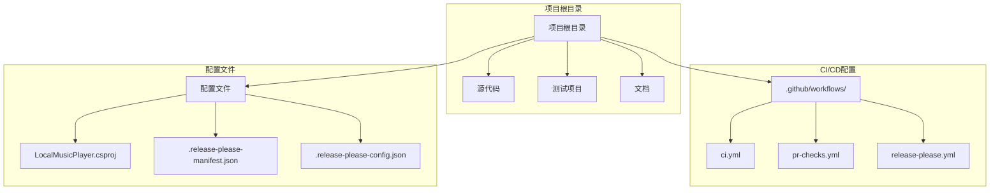
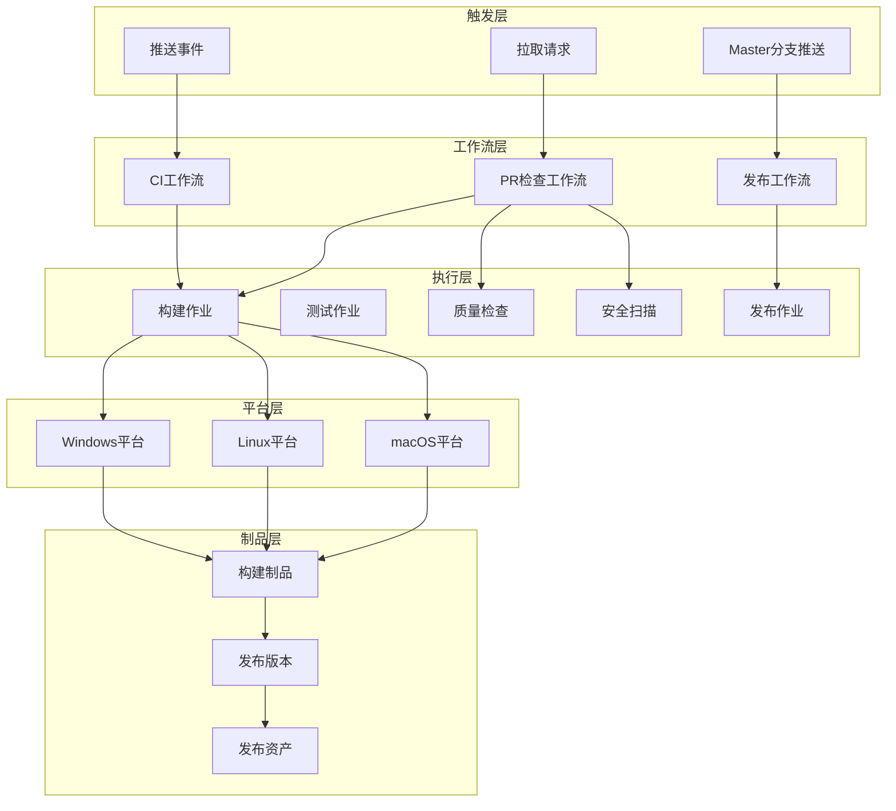
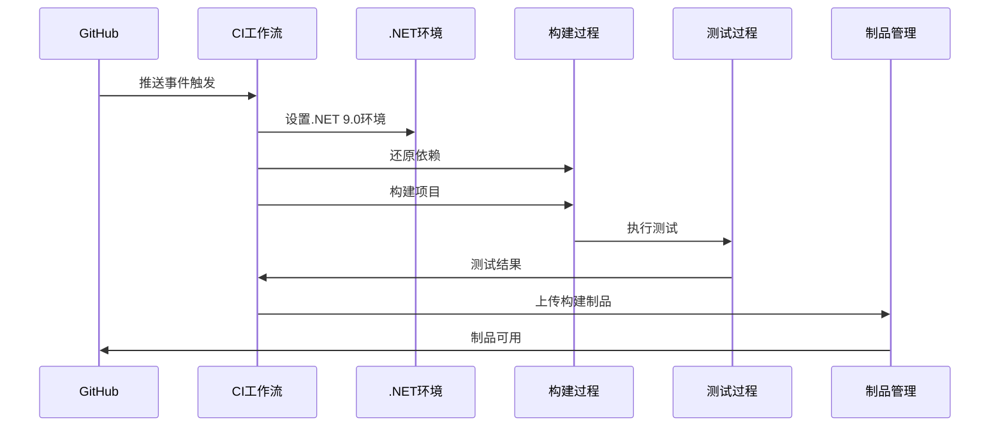
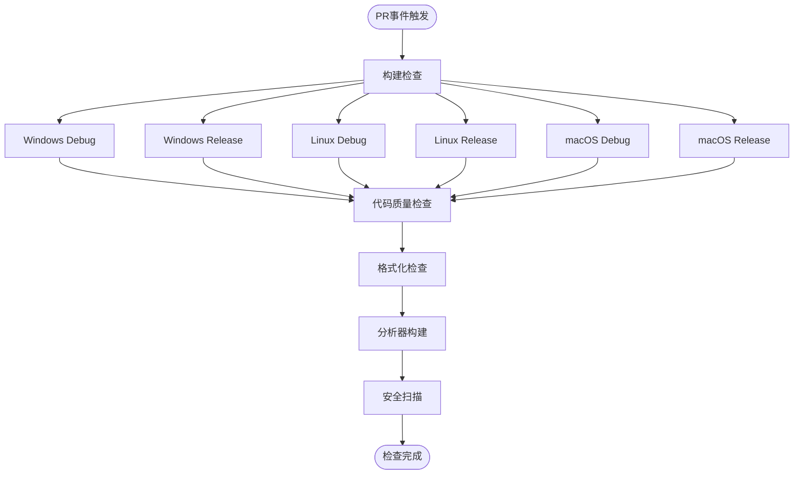
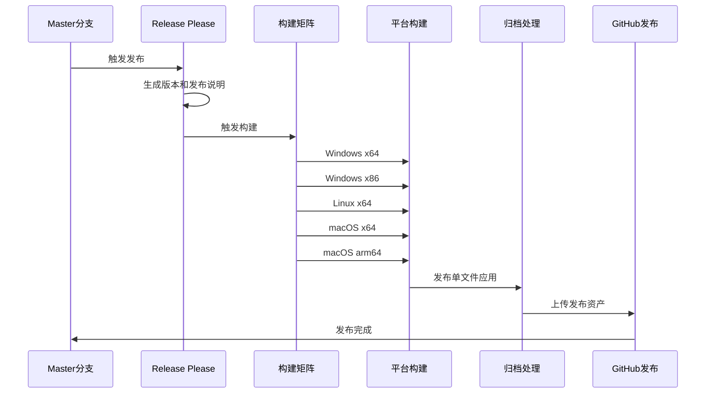
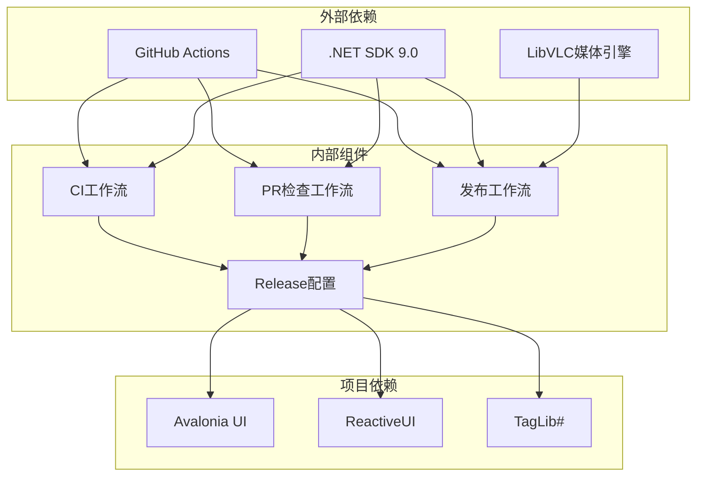

# CI/CD自动化系统

<cite>
**本文档中引用的文件**
- [ci.yml](file://.github/workflows/ci.yml)
- [pr-checks.yml](file://.github/workflows/pr-checks.yml)
- [release-please.yml](file://.github/workflows/release-please.yml)
- [.release-please-config.json](file://.release-please-config.json)
- [.release-please-manifest.json](file://.release-please-manifest.json)
- [LocalMusicPlayer.csproj](file://LocalMusicPlayer.csproj)
- [Program.cs](file://Program.cs)
- [README.md](file://README.md)
</cite>

## 目录
1. [简介](#简介)
2. [项目结构](#项目结构)
3. [核心组件](#核心组件)
4. [架构概览](#架构概览)
5. [详细组件分析](#详细组件分析)
6. [依赖关系分析](#依赖关系分析)
7. [性能考虑](#性能考虑)
8. [故障排除指南](#故障排除指南)
9. [结论](#结论)

## 简介

LocalMusicPlayer项目采用现代化的CI/CD自动化系统，通过GitHub Actions实现完整的持续集成和持续部署流程。该系统支持跨平台构建（Windows、Linux、macOS），包含代码质量检查、安全扫描、自动化测试和发布管理等功能。

项目使用.NET 9作为开发框架，基于Avalonia UI构建跨平台桌面应用程序，支持MP3、FLAC、WAV、AAC等主流音频格式。CI/CD系统确保代码质量和发布流程的标准化。

## 项目结构

项目采用标准的.NET项目结构，结合GitHub Actions工作流实现自动化构建：

**图表来源**
- [ci.yml:1-61](file://.github/workflows/ci.yml#L1-L61)
- [pr-checks.yml:1-83](file://.github/workflows/pr-checks.yml#L1-L83)
- [release-please.yml:1-100](file://.github/workflows/release-please.yml#L1-L100)

**章节来源**
- [README.md:56-67](file://README.md#L56-L67)
- [LocalMusicPlayer.csproj:1-45](file://LocalMusicPlayer.csproj#L1-L45)

## 核心组件

### GitHub Actions工作流

系统包含三个主要的工作流文件，每个都有特定的功能和职责：

#### CI工作流（ci.yml）
- **触发条件**：推送至master和develop分支，或创建拉取请求
- **平台支持**：Windows、Linux、macOS三平台并行构建
- **配置矩阵**：Debug和Release两种构建配置
- **核心步骤**：代码检出、.NET环境设置、依赖还原、构建、测试、发布制品

#### PR检查工作流（pr-checks.yml）
- **触发条件**：针对master分支的拉取请求事件
- **检查类型**：
  - 构建检查：跨平台构建验证
  - 代码质量检查：使用dotnet-format进行格式化验证
  - 安全扫描：检查易受攻击的依赖包

#### 发布工作流（release-please.yml）
- **触发条件**：推送至master分支
- **自动化发布**：使用release-please-action自动生成版本和发布说明
- **多平台发布**：支持win-x64、win-x86、linux-x64、osx-x64、osx-arm64
- **制品管理**：自动压缩和上传发布资产

**章节来源**
- [ci.yml:1-61](file://.github/workflows/ci.yml#L1-L61)
- [pr-checks.yml:1-83](file://.github/workflows/pr-checks.yml#L1-L83)
- [release-please.yml:1-100](file://.github/workflows/release-please.yml#L1-L100)

### 配置管理系统

#### Release Please配置
- **版本管理**：基于simple release-type的版本控制系统
- **变更日志**：支持多种提交类型（feat、fix、docs、style等）
- **文件同步**：与项目文件（LocalMusicPlayer.csproj）保持版本同步

#### 项目配置
- **目标框架**：.NET 9.0
- **输出类型**：WinExe（Windows可执行文件）
- **平台检测**：自动检测运行平台

**章节来源**
- [.release-please-config.json:1-63](file://.release-please-config.json#L1-L63)
- [.release-please-manifest.json:1-3](file://.release-please-manifest.json#L1-L3)
- [LocalMusicPlayer.csproj:1-45](file://LocalMusicPlayer.csproj#L1-L45)

## 架构概览

CI/CD系统的整体架构采用分层设计，确保各个组件之间的清晰分离和高效协作：

**图表来源**
- [ci.yml:22-61](file://.github/workflows/ci.yml#L22-L61)
- [pr-checks.yml:11-83](file://.github/workflows/pr-checks.yml#L11-L83)
- [release-please.yml:12-100](file://.github/workflows/release-please.yml#L12-L100)

## 详细组件分析

### CI工作流详细分析

CI工作流实现了完整的持续集成流程，具有以下特点：

#### 触发机制
- **分支过滤**：排除文档和图片文件的变更，减少不必要的构建
- **路径忽略**：避免对README.md、docs/**、images/**、vibe_images/**的变更触发构建

#### 构建策略
- **矩阵构建**：同时在三个操作系统上构建Debug和Release版本
- **并行执行**：充分利用GitHub Actions的并行能力

**图表来源**
- [ci.yml:31-60](file://.github/workflows/ci.yml#L31-L60)

#### 关键特性
- **测试容错**：测试失败不会阻止后续步骤执行
- **平台特定**：仅在Windows平台上生成发布制品
- **制品保留**：构建制品保留7天

**章节来源**
- [ci.yml:1-61](file://.github/workflows/ci.yml#L1-L61)

### PR检查工作流详细分析

PR检查工作流专注于代码质量和安全性验证：

#### 构建检查矩阵
- **跨平台验证**：确保代码在所有目标平台上都能正常编译
- **配置覆盖**：同时验证Debug和Release配置

#### 代码质量保证
- **格式化检查**：使用dotnet-format确保代码风格一致性
- **分析器构建**：在Release配置下运行分析器以发现潜在问题

**图表来源**
- [pr-checks.yml:13-83](file://.github/workflows/pr-checks.yml#L13-L83)

#### 安全扫描机制
- **漏洞检测**：使用`dotnet list package --vulnerable`检查已知漏洞
- **传递依赖**：包含传递依赖的安全检查
- **失败处理**：发现漏洞时工作流失败

**章节来源**
- [pr-checks.yml:1-83](file://.github/workflows/pr-checks.yml#L1-L83)

### 发布工作流详细分析

发布工作流实现了完全自动化的发布流程：

#### Release Please集成
- **版本自动化**：根据提交历史自动生成版本号
- **变更日志**：生成详细的变更日志，按类型分类
- **权限管理**：需要write权限来创建发布

#### 多平台发布矩阵
- **Windows平台**：win-x64和win-x86两个目标
- **Linux平台**：linux-x64单一目标
- **macOS平台**：osx-x64和osx-arm64两个目标

**图表来源**
- [release-please.yml:13-100](file://.github/workflows/release-please.yml#L13-L100)

#### 平台特定配置
- **Linux依赖**：安装libvlc-dev和vlc包
- **macOS依赖**：使用brew安装vlc
- **发布参数**：启用单文件发布和本机库包含

**章节来源**
- [release-please.yml:1-100](file://.github/workflows/release-please.yml#L1-L100)

### 配置管理系统详细分析

#### Release Please配置
- **变更日志分类**：支持11种不同的提交类型
- **中文标签**：为每种类型提供中文描述
- **额外文件**：与项目文件保持版本同步

#### 版本管理策略
- **简单版本**：使用simple release-type简化版本控制
- **手动版本**：当前版本为1.0.0，可通过配置文件调整

**章节来源**
- [.release-please-config.json:1-63](file://.release-please-config.json#L1-L63)
- [.release-please-manifest.json:1-3](file://.release-please-manifest.json#L1-L3)

## 依赖关系分析

CI/CD系统的依赖关系体现了清晰的层次结构：

**图表来源**
- [LocalMusicPlayer.csproj:21-43](file://LocalMusicPlayer.csproj#L21-L43)
- [ci.yml:19-20](file://.github/workflows/ci.yml#L19-L20)
- [pr-checks.yml:8-9](file://.github/workflows/pr-checks.yml#L8-L9)

### 外部依赖管理

#### GitHub Actions服务
- **执行环境**：使用GitHub-hosted runners
- **缓存机制**：利用actions/cache@v4进行依赖缓存
- **平台支持**：支持ubuntu-latest、windows-latest、macos-latest

#### .NET生态系统
- **SDK版本**：统一使用.NET 9.0.x
- **工具链**：包括dotnet-format、dotnet-test等工具
- **包管理**：使用NuGet进行包依赖管理

### 内部组件依赖

#### 工作流间依赖
- **顺序依赖**：发布工作流依赖PR检查工作流的结果
- **条件执行**：某些步骤仅在满足特定条件下执行
- **共享配置**：多个工作流共享相同的.NET版本配置

**章节来源**
- [LocalMusicPlayer.csproj:1-45](file://LocalMusicPlayer.csproj#L1-L45)
- [ci.yml:25-29](file://.github/workflows/ci.yml#L25-L29)

## 性能考虑

### 构建性能优化

#### 并行构建策略
- **矩阵构建**：利用GitHub Actions的并行能力同时在多个平台上构建
- **平台特定优化**：不同平台使用最优的构建配置
- **缓存利用**：合理使用依赖缓存减少重复下载时间

#### 资源管理
- **内存限制**：各平台runner具有不同的内存限制
- **并发控制**：通过fail-fast参数控制失败时的并发行为
- **存储优化**：制品保留策略平衡存储成本和可用性

### 测试性能

#### 测试执行策略
- **容错机制**：测试失败不影响其他步骤的执行
- **并行测试**：利用GitHub Actions的并行能力加速测试
- **选择性测试**：仅在必要时执行测试步骤

## 故障排除指南

### 常见问题诊断

#### 构建失败排查
- **依赖问题**：检查.NET SDK版本兼容性和包依赖
- **平台差异**：验证跨平台代码的兼容性
- **配置错误**：确认工作流配置文件的正确性

#### 测试失败处理
- **测试隔离**：确保测试之间没有相互依赖
- **环境变量**：检查必要的环境变量是否正确设置
- **超时问题**：优化长时间运行的测试

#### 发布失败诊断
- **权限问题**：确认GitHub Token具有必要的权限
- **平台依赖**：验证目标平台的依赖包安装
- **文件权限**：检查发布文件的访问权限

### 调试技巧

#### 日志分析
- **详细日志**：使用`--verbosity detailed`获取更多信息
- **步骤调试**：逐个步骤验证工作流的执行状态
- **缓存清理**：必要时清理缓存重新执行

#### 本地验证
- **环境复现**：在本地机器上模拟GitHub Actions环境
- **配置测试**：先在个人分支上测试工作流修改
- **增量更新**：逐步应用配置更改以定位问题

**章节来源**
- [ci.yml:47-48](file://.github/workflows/ci.yml#L47-L48)
- [pr-checks.yml:80-82](file://.github/workflows/pr-checks.yml#L80-L82)

## 结论

LocalMusicPlayer项目的CI/CD自动化系统展现了现代软件开发的最佳实践。通过精心设计的工作流架构，系统实现了：

### 核心优势
- **全面覆盖**：从代码质量到安全检查再到发布管理的完整流程
- **跨平台支持**：统一的构建和测试策略适用于所有目标平台
- **自动化程度高**：从版本管理到发布资产的全流程自动化
- **质量保证**：多层次的质量检查确保代码质量

### 技术亮点
- **Release Please集成**：智能化的版本管理和变更日志生成
- **多平台矩阵构建**：高效的跨平台开发体验
- **安全优先**：内置的安全扫描确保依赖包的安全性
- **灵活配置**：可扩展的配置系统适应项目发展需求

### 改进建议
- **测试覆盖率**：可以考虑添加测试覆盖率报告
- **性能监控**：增加构建时间监控和性能分析
- **回滚机制**：为发布流程添加更完善的回滚策略
- **文档完善**：补充CI/CD系统的使用文档和最佳实践

该CI/CD系统为LocalMusicPlayer项目提供了坚实的自动化基础，确保了代码质量和发布流程的可靠性，为项目的长期发展奠定了良好的技术基础。