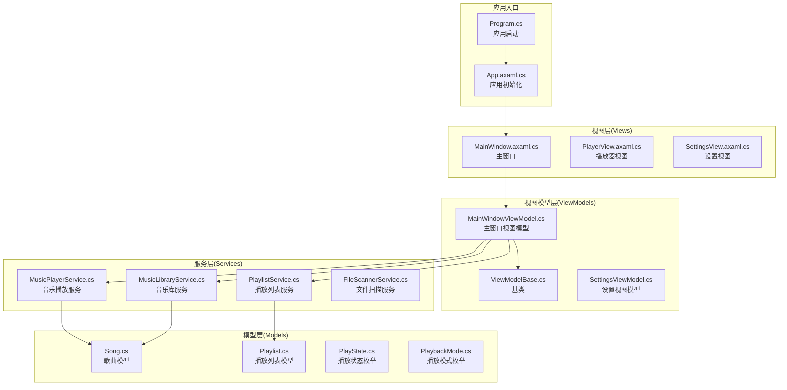
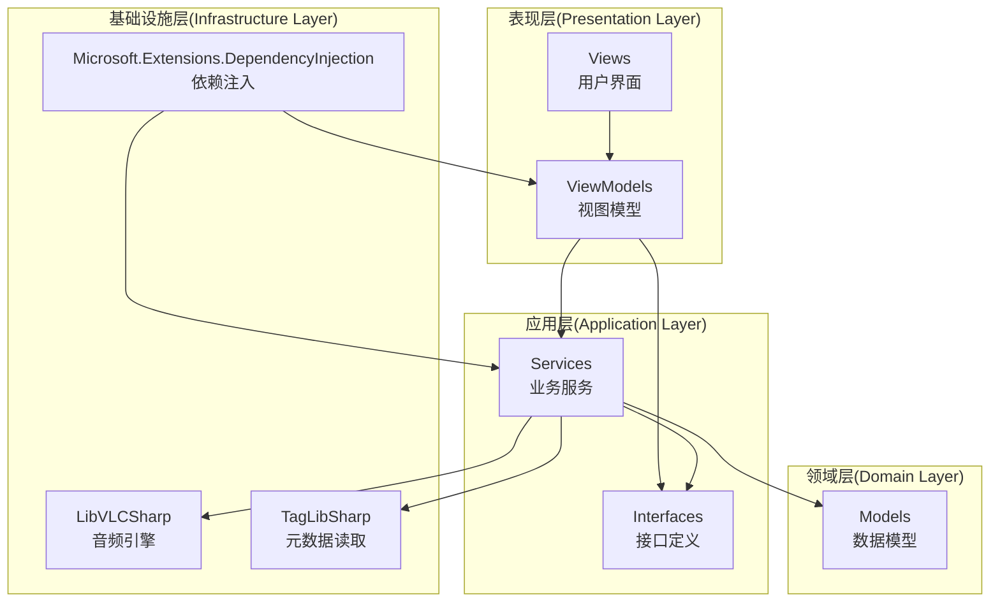
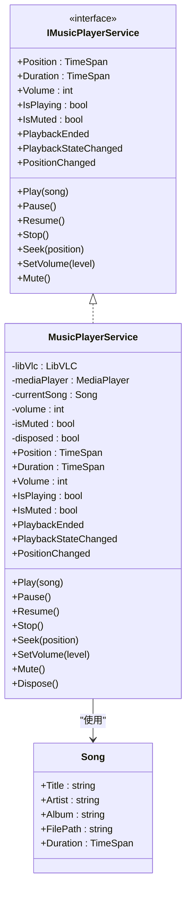
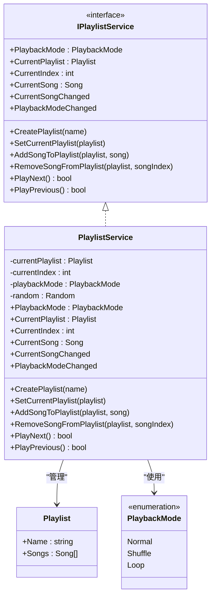
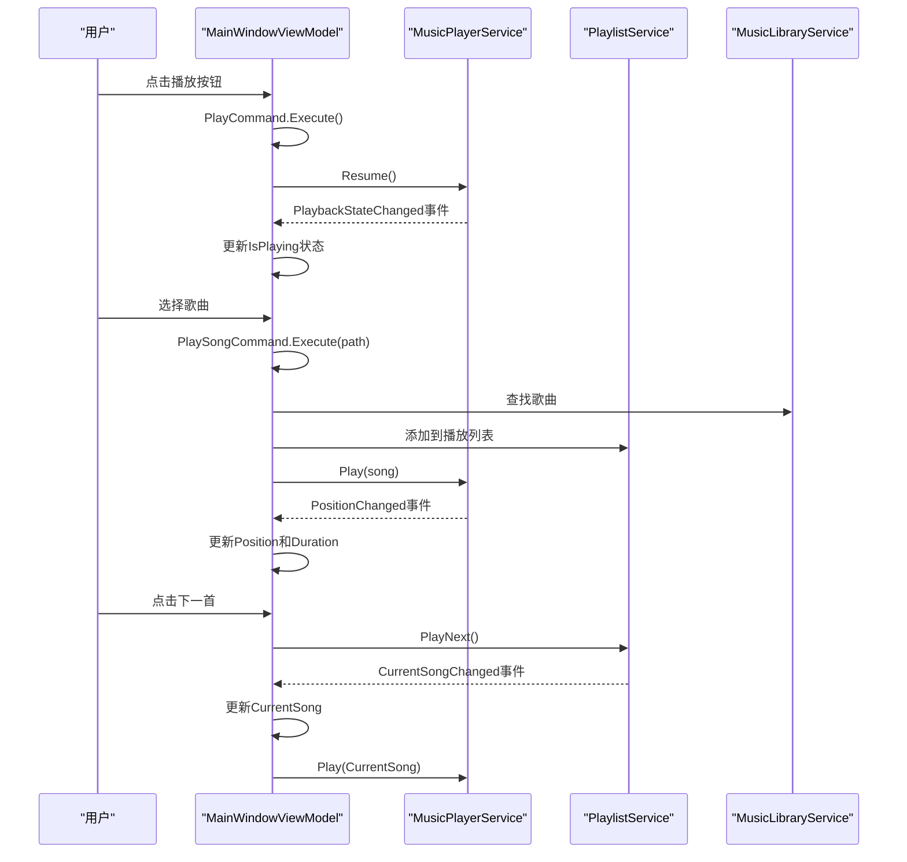
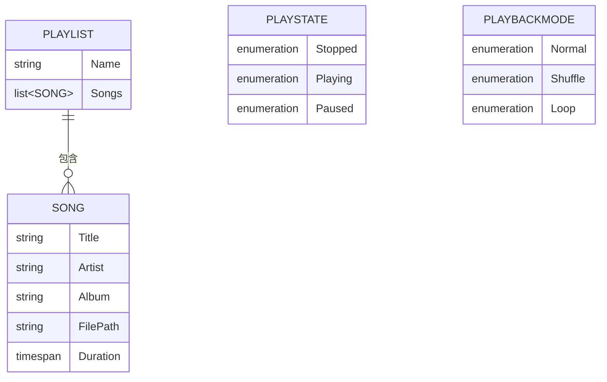
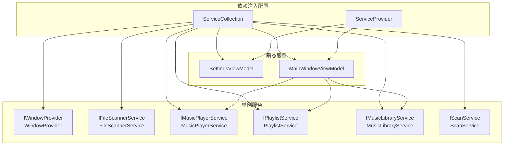

# 项目概述

<cite>
**本文档引用的文件**
- [LocalMusicPlayer.csproj](file://LocalMusicPlayer.csproj)
- [Program.cs](file://Program.cs)
- [App.axaml.cs](file://App.axaml.cs)
- [ViewModelBase.cs](file://ViewModels/ViewModelBase.cs)
- [MainWindowViewModel.cs](file://ViewModels/MainWindowViewModel.cs)
- [MusicPlayerService.cs](file://Services/MusicPlayerService.cs)
- [IMusicPlayerService.cs](file://Services/IMusicPlayerService.cs)
- [MusicLibraryService.cs](file://Services/MusicLibraryService.cs)
- [PlaylistService.cs](file://Services/PlaylistService.cs)
- [IPlaylistService.cs](file://Services/IPlaylistService.cs)
- [Song.cs](file://Models/Song.cs)
- [Playlist.cs](file://Models/Playlist.cs)
- [PlaybackMode.cs](file://Models/PlaybackMode.cs)
- [PlayState.cs](file://Models/PlayState.cs)
- [MainWindow.axaml.cs](file://Views/MainWindow.axaml.cs)
</cite>

## 目录
1. [简介](#简介)
2. [项目结构](#项目结构)
3. [核心组件](#核心组件)
4. [架构总览](#架构总览)
5. [详细组件分析](#详细组件分析)
6. [依赖关系分析](#依赖关系分析)
7. [性能考虑](#性能考虑)
8. [故障排除指南](#故障排除指南)
9. [结论](#结论)

## 简介
LocalMusicPlayer是一个基于Avalonia UI框架开发的跨平台桌面音乐播放器，支持Windows、macOS和Linux平台。该项目采用MVVM架构模式、依赖注入设计和响应式编程实践，结合LibVLCSharp音频播放引擎、TagLibSharp元数据读取与ReactiveUI响应式框架，构建了一个现代化、可扩展且易于维护的桌面应用。

项目目标是为用户提供简洁直观的音乐播放体验，具备本地音乐库扫描、播放列表管理、基础播放控制以及设置界面等功能。通过模块化设计，代码层次清晰，便于新开发者快速上手，同时为有经验的开发者提供了足够的扩展空间。

## 项目结构
项目采用分层架构，主要分为以下层次：
- Models：数据模型层，包含播放状态、播放模式、歌曲和播放列表等核心实体
- Services：服务层，封装播放器、音乐库、播放列表等业务逻辑
- ViewModels：视图模型层，实现MVVM中的交互逻辑和数据绑定
- Views：视图层，负责用户界面展示
- Converters/Helpers/Behaviors：辅助层，提供值转换器、格式化工具和行为扩展
- Styles：样式资源，统一UI风格

**图表来源**
- [Program.cs:1-20](file://Program.cs#L1-L20)
- [App.axaml.cs:18-51](file://App.axaml.cs#L18-L51)
- [MainWindowViewModel.cs:120-135](file://ViewModels/MainWindowViewModel.cs#L120-L135)

**章节来源**
- [LocalMusicPlayer.csproj:1-43](file://LocalMusicPlayer.csproj#L1-L43)
- [Program.cs:1-20](file://Program.cs#L1-L20)
- [App.axaml.cs:18-51](file://App.axaml.cs#L18-L51)

## 核心组件
本项目的核心组件围绕音乐播放这一主线展开，主要包括：

### 音乐播放引擎
- 基于LibVLCSharp的音频播放能力
- 支持多种音频格式的解码和播放
- 提供播放、暂停、停止、音量控制等基础功能

### 播放列表管理
- 支持创建、编辑和删除播放列表
- 实现普通播放、随机播放和循环播放三种模式
- 维护当前播放索引和歌曲状态

### 音乐库服务
- 管理本地音乐文件集合
- 提供搜索过滤功能
- 维护原始歌曲列表和过滤后的结果集

### 响应式UI交互
- 基于ReactiveUI的命令系统
- 实时状态更新和双向数据绑定
- 用户操作与播放状态的解耦

**章节来源**
- [MusicPlayerService.cs:7-38](file://Services/MusicPlayerService.cs#L7-L38)
- [PlaylistService.cs:7-34](file://Services/PlaylistService.cs#L7-L34)
- [MusicLibraryService.cs:7-26](file://Services/MusicLibraryService.cs#L7-L26)
- [MainWindowViewModel.cs:108-216](file://ViewModels/MainWindowViewModel.cs#L108-L216)

## 架构总览
项目采用经典的MVVM架构模式，通过依赖注入实现各层之间的松耦合。整体架构遵循关注点分离原则，确保业务逻辑、UI逻辑和数据访问的独立性。

**图表来源**
- [App.axaml.cs:41-51](file://App.axaml.cs#L41-L51)
- [MainWindowViewModel.cs:13-16](file://ViewModels/MainWindowViewModel.cs#L13-L16)
- [MusicPlayerService.cs:27-38](file://Services/MusicPlayerService.cs#L27-L38)

### MVVM架构详解
MVVM模式在项目中的具体体现：
- **Model层**：Song、Playlist、PlayState等纯数据对象
- **View层**：Avalonia XAML视图文件，负责UI展示
- **ViewModel层**：MainWindowViewModel等，处理用户交互逻辑
- **Service层**：封装业务规则和外部依赖

**章节来源**
- [ViewModelBase.cs:5-7](file://ViewModels/ViewModelBase.cs#L5-L7)
- [MainWindowViewModel.cs:11-24](file://ViewModels/MainWindowViewModel.cs#L11-L24)

## 详细组件分析

### 音乐播放服务(MusicPlayerService)
音乐播放服务是整个应用的核心，负责与LibVLCSharp进行交互，实现音频播放的所有功能。

**图表来源**
- [IMusicPlayerService.cs:6-27](file://Services/IMusicPlayerService.cs#L6-L27)
- [MusicPlayerService.cs:7-129](file://Services/MusicPlayerService.cs#L7-L129)
- [Song.cs:5-12](file://Models/Song.cs#L5-L12)

#### 关键特性
- **事件驱动**：通过事件通知播放状态变化
- **音量控制**：支持静音切换和音量调节
- **位置跟踪**：实时更新播放进度
- **生命周期管理**：正确释放LibVLC资源

**章节来源**
- [MusicPlayerService.cs:17-118](file://Services/MusicPlayerService.cs#L17-L118)

### 播放列表服务(PlaylistService)
播放列表服务管理音乐播放的队列和播放模式。

**图表来源**
- [IPlaylistService.cs:7-21](file://Services/IPlaylistService.cs#L7-L21)
- [PlaylistService.cs:7-120](file://Services/PlaylistService.cs#L7-L120)
- [Playlist.cs:5-9](file://Models/Playlist.cs#L5-L9)
- [PlaybackMode.cs:3-8](file://Models/PlaybackMode.cs#L3-L8)

#### 播放模式实现
- **普通模式**：按添加顺序依次播放
- **随机模式**：随机选择下一首歌曲
- **循环模式**：播放完最后一首后回到第一首

**章节来源**
- [PlaylistService.cs:69-119](file://Services/PlaylistService.cs#L69-L119)

### 主窗口视图模型(MainWindowViewModel)
主窗口视图模型是应用的核心协调者，负责整合各个服务并提供UI绑定的数据。

**图表来源**
- [MainWindowViewModel.cs:141-205](file://ViewModels/MainWindowViewModel.cs#L141-L205)
- [MusicPlayerService.cs:33-37](file://Services/MusicPlayerService.cs#L33-L37)
- [PlaylistService.cs:93-94](file://Services/PlaylistService.cs#L93-L94)

#### 核心功能
- **命令绑定**：PlayCommand、PauseCommand、StopCommand等
- **状态同步**：实时同步播放器状态到UI
- **搜索过滤**：动态过滤音乐库中的歌曲
- **页面导航**：在主库和设置页面间切换

**章节来源**
- [MainWindowViewModel.cs:108-229](file://ViewModels/MainWindowViewModel.cs#L108-L229)

### 数据模型层
项目的数据模型简洁而明确，遵循单一职责原则。

**图表来源**
- [Song.cs:7-11](file://Models/Song.cs#L7-L11)
- [Playlist.cs:7-8](file://Models/Playlist.cs#L7-L8)
- [PlayState.cs:4-7](file://Models/PlayState.cs#L4-L7)
- [PlaybackMode.cs:4-7](file://Models/PlaybackMode.cs#L4-L7)

**章节来源**
- [Song.cs:5-12](file://Models/Song.cs#L5-L12)
- [Playlist.cs:5-9](file://Models/Playlist.cs#L5-L9)

## 依赖关系分析
项目采用依赖注入容器管理组件生命周期，确保松耦合和可测试性。

**图表来源**
- [App.axaml.cs:41-51](file://App.axaml.cs#L41-L51)

### 技术栈说明
- **Avalonia UI**：跨平台UI框架，提供原生外观和性能
- **ReactiveUI**：响应式UI框架，简化MVVM实现
- **LibVLCSharp**：强大的多媒体播放引擎
- **TagLibSharp**：音频元数据读取库
- **Microsoft.Extensions.DependencyInjection**：依赖注入容器

**章节来源**
- [LocalMusicPlayer.csproj:22-41](file://LocalMusicPlayer.csproj#L22-L41)
- [App.axaml.cs:41-51](file://App.axaml.cs#L41-L51)

## 性能考虑
项目在性能方面采用了多项优化策略：

### 内存管理
- 正确实现IDisposable接口，及时释放LibVLC资源
- 使用Observable.Interval定期更新UI，避免过度刷新
- 音乐库使用ObservableCollection支持增量更新

### 播放性能
- 播放状态变更通过事件机制异步通知
- 音量控制直接调用底层播放器API
- 播放列表遍历使用高效的索引访问

### UI响应性
- 所有UI更新在主线程调度执行
- 命令执行与UI操作分离，避免阻塞
- 搜索过滤使用LINQ查询，支持大音乐库场景

## 故障排除指南
常见问题及解决方案：

### 播放器初始化失败
**症状**：应用启动后无法播放任何音频文件
**原因**：LibVLC库初始化失败或缺少必要的媒体插件
**解决方法**：
1. 确认VideoLAN.LibVLC.Windows包已正确安装
2. 检查应用程序清单文件配置
3. 验证目标平台的LibVLC依赖是否完整

### 音频格式不支持
**症状**：某些音频文件无法播放
**原因**：缺少特定编解码器支持
**解决方法**：
1. 更新LibVLCSharp版本到最新稳定版
2. 安装额外的编解码器包
3. 尝试转换音频格式为MP3或WAV

### 内存泄漏问题
**症状**：长时间使用后内存占用持续增长
**解决方法**：
1. 确保在应用退出时调用MusicPlayerService.Dispose()
2. 检查事件订阅是否正确注销
3. 验证播放列表中歌曲对象的生命周期

**章节来源**
- [MusicPlayerService.cs:120-129](file://Services/MusicPlayerService.cs#L120-L129)

## 结论
LocalMusicPlayer项目展示了现代C#桌面应用开发的最佳实践。通过采用MVVM架构、依赖注入和响应式编程，项目实现了清晰的代码结构和良好的可维护性。LibVLCSharp的强大播放能力和Avalonia UI的跨平台特性相结合，为用户提供了优秀的音乐播放体验。

项目的模块化设计使得功能扩展变得简单，无论是添加新的播放效果、改进UI界面还是集成更多音频格式，都能在现有架构基础上轻松实现。对于初学者而言，这是一个学习现代桌面应用开发的优秀范例；对于有经验的开发者，项目提供了足够的灵活性和扩展空间。